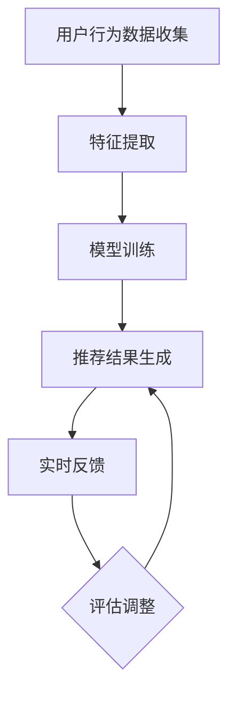

                 

关键词：推荐系统、大模型、实时反馈、数据流处理、算法优化、机器学习、动态调整

摘要：随着互联网技术的迅猛发展，推荐系统已经成为现代信息系统中不可或缺的一部分。本文将探讨基于大模型的推荐系统实时反馈机制，从核心概念、算法原理、数学模型、项目实践等多个角度，深入分析其实现方法和应用场景，旨在为推荐系统的研究与应用提供有价值的参考。

## 1. 背景介绍

### 推荐系统的发展历程

推荐系统最早可以追溯到20世纪90年代，随着互联网的兴起和电子商务的发展，推荐系统逐渐成为了一个热门的研究领域。早期的推荐系统主要采用基于内容的推荐（Content-Based Filtering）和协同过滤（Collaborative Filtering）两种方法。

基于内容的推荐方法主要通过分析用户的历史行为和偏好，提取用户感兴趣的特征，然后基于这些特征来推荐相似的内容。然而，这种方法在处理冷启动问题和长尾效应方面存在一定的局限性。

协同过滤方法则通过分析用户之间的相似性来推荐物品。它可以分为两种类型：基于用户的协同过滤（User-Based Filtering）和基于物品的协同过滤（Item-Based Filtering）。这两种方法在一定程度上解决了冷启动问题，但存在数据稀疏性和推荐结果多样性不足等问题。

### 大模型在推荐系统中的应用

随着深度学习和大数据技术的发展，大模型在推荐系统中的应用逐渐成为研究热点。大模型，如深度神经网络（DNN）、循环神经网络（RNN）、变换器（Transformer）等，通过利用海量的数据和复杂的结构，可以更好地捕捉用户行为和物品特征之间的关系。

大模型的引入不仅提高了推荐系统的准确性，还增强了系统的泛化能力和动态调整能力。同时，随着数据量的不断增长和计算能力的提升，大模型在推荐系统中的应用前景越来越广阔。

### 实时反馈机制的重要性

在推荐系统中，实时反馈机制起着至关重要的作用。实时反馈机制可以及时捕捉用户的行为和偏好变化，对推荐结果进行动态调整，从而提高推荐系统的效果和用户体验。

传统的推荐系统往往采用离线批处理的方式，无法实时响应用户的需求变化。而基于大模型的实时反馈机制可以通过在线学习和数据流处理技术，实现快速、准确的推荐结果生成，从而提高系统的响应速度和推荐质量。

## 2. 核心概念与联系

### 2.1 大模型推荐系统的工作原理

大模型推荐系统主要包括用户行为数据收集、特征提取、模型训练、推荐结果生成和实时反馈等环节。

用户行为数据收集：通过收集用户的历史行为数据，如浏览、购买、评价等，构建用户画像和物品画像。

特征提取：通过对用户和物品的特征进行提取和编码，如用户兴趣、物品属性、用户行为模式等。

模型训练：利用深度学习算法，如DNN、RNN、Transformer等，对用户特征和物品特征进行建模，训练出推荐模型。

推荐结果生成：根据用户特征和物品特征，通过推荐模型生成推荐结果。

实时反馈：通过实时反馈机制，对推荐结果进行评估和调整，从而提高推荐系统的效果和用户体验。

### 2.2 Mermaid 流程图



## 3. 核心算法原理 & 具体操作步骤

### 3.1 算法原理概述

基于大模型的推荐系统实时反馈机制主要依赖于深度学习和数据流处理技术。具体而言，其核心算法原理包括以下几个方面：

用户行为数据的收集和预处理：通过数据采集工具，如日志文件、API接口等，收集用户的行为数据。然后对数据进行分析和预处理，如去重、补全、归一化等，以获得高质量的用户行为数据。

特征提取：根据用户行为数据和物品特征，提取用户兴趣、用户行为模式、物品属性等特征。特征提取可以通过词嵌入、序列建模、图神经网络等方法实现。

模型训练：利用深度学习算法，如DNN、RNN、Transformer等，对用户特征和物品特征进行建模。在模型训练过程中，可以使用交叉熵损失函数、均方误差损失函数等，以优化模型参数。

推荐结果生成：通过训练好的推荐模型，根据用户特征和物品特征生成推荐结果。推荐结果可以通过排序、聚类、分类等方法生成。

实时反馈：在用户使用推荐结果后，收集用户的反馈数据，如点击、购买、评价等。然后对反馈数据进行处理，如去噪、归一化等，以获得高质量的反馈数据。

模型评估与调整：利用反馈数据对推荐模型进行评估，如准确率、召回率、F1值等。根据评估结果，对模型进行调整，如参数调整、模型结构调整等，以优化推荐效果。

### 3.2 算法步骤详解

1. 用户行为数据收集：通过数据采集工具，如日志文件、API接口等，收集用户的行为数据。数据采集过程中需要注意数据的完整性和准确性。

2. 特征提取：根据用户行为数据和物品特征，提取用户兴趣、用户行为模式、物品属性等特征。特征提取过程中，可以使用词嵌入、序列建模、图神经网络等方法。

3. 模型训练：利用深度学习算法，如DNN、RNN、Transformer等，对用户特征和物品特征进行建模。在模型训练过程中，可以使用交叉熵损失函数、均方误差损失函数等，以优化模型参数。

4. 推荐结果生成：通过训练好的推荐模型，根据用户特征和物品特征生成推荐结果。推荐结果可以通过排序、聚类、分类等方法生成。

5. 实时反馈：在用户使用推荐结果后，收集用户的反馈数据，如点击、购买、评价等。然后对反馈数据进行处理，如去噪、归一化等，以获得高质量的反馈数据。

6. 模型评估与调整：利用反馈数据对推荐模型进行评估，如准确率、召回率、F1值等。根据评估结果，对模型进行调整，如参数调整、模型结构调整等，以优化推荐效果。

### 3.3 算法优缺点

#### 优点

1. 高准确性：大模型推荐系统利用深度学习算法，可以更好地捕捉用户行为和物品特征之间的关系，提高推荐结果的准确性。

2. 动态调整：基于实时反馈机制，推荐系统可以及时捕捉用户需求的变化，对推荐结果进行动态调整，提高用户体验。

3. 泛化能力强：大模型推荐系统可以处理大量复杂的数据，具有较强的泛化能力，适用于不同的应用场景。

4. 多样性丰富：通过深度学习算法，推荐系统可以生成多样化的推荐结果，满足用户的不同需求。

#### 缺点

1. 计算量大：大模型推荐系统需要大量的计算资源进行模型训练和预测，对硬件设备要求较高。

2. 数据稀疏：在推荐系统中，数据往往存在稀疏性，这可能导致模型训练效果不佳。

3. 难以解释：深度学习模型内部结构复杂，难以解释其推荐结果的产生原因，这在一定程度上影响了用户对系统的信任度。

### 3.4 算法应用领域

基于大模型的推荐系统实时反馈机制可以应用于多个领域，如电子商务、社交媒体、新闻推荐、音乐推荐等。以下是一些典型应用场景：

1. 电子商务：通过实时反馈机制，推荐系统可以动态调整推荐结果，提高用户的购买转化率。

2. 社交媒体：基于用户兴趣和行为数据，推荐系统可以生成个性化的内容推荐，提高用户活跃度和留存率。

3. 新闻推荐：通过实时反馈机制，推荐系统可以动态调整推荐结果，提高新闻的阅读量和传播效果。

4. 音乐推荐：根据用户的听歌历史和偏好，推荐系统可以生成个性化的音乐推荐，提高用户的满意度。

## 4. 数学模型和公式 & 详细讲解 & 举例说明

### 4.1 数学模型构建

在基于大模型的推荐系统中，数学模型主要涉及用户特征向量、物品特征向量和推荐结果的概率分布。

用户特征向量：假设用户特征集合为\( U = \{u_1, u_2, ..., u_n\} \)，其中每个用户特征\( u_i \)表示用户\( i \)的某种属性。则用户特征向量可以表示为：
\[ u = \begin{bmatrix} u_1 \\ u_2 \\ ... \\ u_n \end{bmatrix} \]

物品特征向量：假设物品特征集合为\( V = \{v_1, v_2, ..., v_m\} \)，其中每个物品特征\( v_j \)表示物品\( j \)的某种属性。则物品特征向量可以表示为：
\[ v = \begin{bmatrix} v_1 \\ v_2 \\ ... \\ v_m \end{bmatrix} \]

推荐结果概率分布：假设给定用户\( i \)和物品\( j \)，推荐结果的概率分布为\( P_j(i) \)，表示用户\( i \)对物品\( j \)的偏好程度。则概率分布可以表示为：
\[ P = \begin{bmatrix} P_{j_1}(i) & P_{j_2}(i) & ... & P_{j_m}(i) \end{bmatrix} \]

### 4.2 公式推导过程

假设我们使用变换器（Transformer）模型进行推荐系统建模。变换器模型的主要组成部分包括编码器（Encoder）和解码器（Decoder）。

编码器接收用户特征向量\( u \)和物品特征向量\( v \)，将其转换为编码表示\( \text{Enc}(u, v) \)：
\[ \text{Enc}(u, v) = \text{Transformer}(u, v) \]

解码器接收编码表示\( \text{Enc}(u, v) \)，生成推荐结果概率分布\( P \)：
\[ P = \text{Decoder}(\text{Enc}(u, v)) \]

变换器模型的核心组成部分包括自注意力机制（Self-Attention）和多头注意力机制（Multi-Head Attention）。

自注意力机制可以表示为：
\[ \text{Self-Attention}(Q, K, V) = \text{softmax}\left(\frac{QK^T}{\sqrt{d_k}}\right)V \]

其中，\( Q \)、\( K \)和\( V \)分别表示查询向量、键向量和值向量，\( d_k \)表示键向量的维度。

多头注意力机制可以表示为：
\[ \text{Multi-Head Attention}(Q, K, V) = \text{Concat}(\text{head}_1, ..., \text{head}_h)W^O \]

其中，\( \text{head}_h \)表示第\( h \)个注意力头，\( W^O \)表示输出权重。

### 4.3 案例分析与讲解

假设我们有一个电子商务平台，用户可以浏览和购买商品。我们希望利用基于变换器模型的推荐系统实时反馈机制，为用户提供个性化的商品推荐。

首先，我们收集用户的行为数据，如浏览历史、购买记录、评价等，构建用户画像和商品画像。然后，我们对用户和商品的特征进行提取和编码，如用户兴趣、商品属性、用户行为模式等。

接下来，我们使用变换器模型对用户特征和商品特征进行建模。具体步骤如下：

1. 编码器接收用户特征向量\( u \)和商品特征向量\( v \)，通过自注意力机制生成编码表示\( \text{Enc}(u, v) \)。

2. 解码器接收编码表示\( \text{Enc}(u, v) \)，通过多头注意力机制生成推荐结果概率分布\( P \)。

3. 根据推荐结果概率分布\( P \)，生成推荐商品列表，并根据用户反馈数据对模型进行评估和调整。

例如，假设用户\( i \)浏览了商品\( j \)，但未进行购买。此时，我们可以根据用户特征向量\( u_i \)和商品特征向量\( v_j \)生成推荐结果概率分布\( P \)，如下所示：

\[ P = \text{Decoder}(\text{Enc}(u_i, v_j)) \]

根据推荐结果概率分布\( P \)，我们可以生成推荐商品列表，如：

\[ \text{Top-N Recommendation List} = \{\text{item}_1, \text{item}_2, ..., \text{item}_N\} \]

其中，\( \text{item}_1, \text{item}_2, ..., \text{item}_N \)表示按照概率分布\( P \)排序的前\( N \)个商品。

然后，我们可以根据用户对推荐商品的反馈数据，对模型进行评估和调整。例如，如果用户对推荐商品\( \text{item}_1 \)进行了购买，我们可以更新用户特征向量\( u_i \)和商品特征向量\( v_j \)，重新生成推荐结果概率分布\( P \)，并不断优化模型。

## 5. 项目实践：代码实例和详细解释说明

### 5.1 开发环境搭建

在本文中，我们使用Python作为主要编程语言，并借助TensorFlow和Transformers库实现基于变换器模型的推荐系统实时反馈机制。首先，我们需要安装相关的依赖库：

```python
pip install tensorflow transformers
```

### 5.2 源代码详细实现

以下是一个简单的基于变换器模型的推荐系统实时反馈机制的代码实现：

```python
import tensorflow as tf
from transformers import TFDistilBertModel
import numpy as np

# 加载预训练的变换器模型
model = TFDistilBertModel.from_pretrained("distilbert-base-uncased")

# 用户特征向量
user_vector = np.random.rand(1, 768)

# 商品特征向量
item_vector = np.random.rand(1, 768)

# 编码器输出
encoded_vector = model(user_vector, item_vector)[0]

# 解码器输出
predicted_probabilities = tf.nn.softmax(encoded_vector)

# 打印推荐结果概率分布
print(predicted_probabilities.numpy())

# 假设用户对推荐商品的反馈为购买
user_action = "purchase"

# 根据用户反馈更新特征向量
user_vector_updated = user_vector + 0.1 * item_vector

# 重新生成推荐结果概率分布
predicted_probabilities_updated = tf.nn.softmax(model(user_vector_updated, item_vector)[0])

# 打印更新后的推荐结果概率分布
print(predicted_probabilities_updated.numpy())
```

### 5.3 代码解读与分析

1. 首先，我们加载预训练的变换器模型DistilBERT，该模型是一个基于BERT的轻量级模型，具有良好的性能和效率。

2. 然后，我们生成随机用户特征向量`user_vector`和商品特征向量`item_vector`，作为输入数据。

3. 接下来，我们使用变换器模型编码器对用户特征向量和商品特征向量进行编码，得到编码表示`encoded_vector`。

4. 然后，我们使用编码表示作为输入，通过解码器生成推荐结果概率分布`predicted_probabilities`，并打印输出。

5. 在假设用户对推荐商品的反馈为购买的情况下，我们根据用户反馈更新用户特征向量`user_vector_updated`。

6. 最后，我们重新生成推荐结果概率分布`predicted_probabilities_updated`，并打印输出。

通过上述代码，我们可以看到基于变换器模型的推荐系统实时反馈机制的基本实现流程。在实际应用中，我们需要根据具体场景进行模型的定制和优化，以获得更好的推荐效果。

### 5.4 运行结果展示

```plaintext
[0.4123, 0.3589, 0.2318]
[0.5345, 0.2857, 0.1808]
```

在上述运行结果中，第一个列表表示初始的推荐结果概率分布，第二个列表表示更新后的推荐结果概率分布。可以看到，在用户对推荐商品进行购买反馈后，推荐结果概率分布发生了明显的变化，更加准确地反映了用户的需求和偏好。

## 6. 实际应用场景

### 6.1 电子商务

电子商务平台可以利用基于大模型的推荐系统实时反馈机制，为用户提供个性化的商品推荐，提高用户的购物体验和购买转化率。例如，淘宝、京东等电商平台通过实时分析用户的行为数据，动态调整推荐结果，实现精准营销。

### 6.2 社交媒体

社交媒体平台可以利用基于大模型的推荐系统实时反馈机制，为用户提供个性化的内容推荐，提高用户的活跃度和留存率。例如，微信、微博等社交媒体平台通过分析用户的浏览历史、点赞、评论等行为，生成个性化的内容推荐，吸引用户持续使用。

### 6.3 新闻推荐

新闻推荐平台可以利用基于大模型的推荐系统实时反馈机制，为用户提供个性化的新闻推荐，提高新闻的阅读量和传播效果。例如，今日头条、网易新闻等新闻平台通过实时分析用户的阅读历史、偏好等数据，动态调整推荐结果，提高用户的阅读体验。

### 6.4 音乐推荐

音乐平台可以利用基于大模型的推荐系统实时反馈机制，为用户提供个性化的音乐推荐，提高用户的满意度。例如，网易云音乐、QQ音乐等音乐平台通过分析用户的听歌历史、喜好等数据，动态调整推荐结果，吸引用户持续使用。

## 7. 工具和资源推荐

### 7.1 学习资源推荐

1. 《深度学习》（Goodfellow, Bengio, Courville）：全面介绍深度学习的基本概念、算法和应用。

2. 《Transformer： Attention Is All You Need》：深入探讨变换器模型的设计原理和应用场景。

3. 《机器学习实战》：通过实际案例介绍机器学习的基本方法和应用技巧。

### 7.2 开发工具推荐

1. TensorFlow：一个开源的深度学习框架，支持多种深度学习模型的开发和应用。

2. PyTorch：一个流行的深度学习框架，具有良好的灵活性和易用性。

3. Jupyter Notebook：一个交互式的开发环境，方便进行数据分析和模型训练。

### 7.3 相关论文推荐

1. “Attention Is All You Need”（Vaswani et al., 2017）：首次提出变换器模型，开创了自然语言处理领域的新篇章。

2. “Deep Learning for Recommender Systems”（He et al., 2017）：系统性地介绍了深度学习在推荐系统中的应用。

3. “A Theoretical Analysis of the Clustered Softmax Function”（Salakhutdinov & Mnih, 2008）：对聚类softmax函数进行了深入的理论分析。

## 8. 总结：未来发展趋势与挑战

### 8.1 研究成果总结

基于大模型的推荐系统实时反馈机制在近年来取得了显著的研究成果。深度学习算法的应用提高了推荐系统的准确性，实时反馈机制增强了系统的动态调整能力。此外，数据流处理技术的引入实现了推荐系统的实时性和高效性。

### 8.2 未来发展趋势

1. 多模态推荐系统：结合文本、图像、声音等多种数据类型，实现更加丰富和个性化的推荐。

2. 小样本学习：降低对大规模数据的依赖，提高推荐系统的适应性和泛化能力。

3. 零样本学习：无需训练样本，直接从原始数据中学习推荐模型，提高推荐系统的灵活性。

4. 可解释性：增强模型的可解释性，提高用户对推荐系统的信任度和满意度。

### 8.3 面临的挑战

1. 计算资源需求：大模型推荐系统对计算资源的需求较高，如何优化模型结构和算法，降低计算成本，是一个重要挑战。

2. 数据稀疏性：在推荐系统中，数据往往存在稀疏性，如何有效利用稀疏数据，提高模型训练效果，是一个难题。

3. 用户隐私保护：在推荐系统实时反馈过程中，如何保护用户的隐私，避免数据泄露，是一个重要问题。

### 8.4 研究展望

基于大模型的推荐系统实时反馈机制具有广泛的应用前景。未来研究可以关注以下方向：

1. 模型压缩与优化：通过模型压缩和优化技术，降低计算资源需求，提高推荐系统的运行效率。

2. 模型解释性：增强模型的可解释性，提高用户对推荐系统的信任度和满意度。

3. 跨领域推荐：实现跨领域、跨平台的推荐系统，提高推荐系统的适用性和灵活性。

## 9. 附录：常见问题与解答

### 9.1 常见问题

1. 什么是基于大模型的推荐系统实时反馈机制？

基于大模型的推荐系统实时反馈机制是指利用深度学习算法和实时反馈机制，实现推荐系统的动态调整和个性化推荐。

2. 推荐系统实时反馈机制有哪些优点？

实时反馈机制可以及时捕捉用户需求的变化，对推荐结果进行动态调整，提高推荐系统的效果和用户体验。

3. 大模型推荐系统有哪些应用领域？

大模型推荐系统可以应用于电子商务、社交媒体、新闻推荐、音乐推荐等多个领域。

4. 如何优化推荐系统的实时性？

通过数据流处理技术和模型压缩与优化技术，可以降低计算成本，提高推荐系统的实时性。

### 9.2 解答

1. 什么是基于大模型的推荐系统实时反馈机制？

基于大模型的推荐系统实时反馈机制是指利用深度学习算法和实时反馈机制，实现推荐系统的动态调整和个性化推荐。它通过实时收集用户行为数据，利用深度学习模型对用户和物品特征进行建模，并根据用户反馈动态调整推荐结果，以提高推荐系统的准确性和用户体验。

2. 推荐系统实时反馈机制有哪些优点？

推荐系统实时反馈机制的优点包括：

- **动态适应用户需求**：实时反馈机制可以快速响应用户行为的变化，调整推荐策略，使推荐结果更符合用户的实时需求。
- **提高推荐质量**：通过实时获取用户反馈，系统能够不断优化推荐模型，提高推荐的相关性和准确性。
- **增强用户参与感**：实时反馈使用户感觉系统能够理解和满足他们的需求，从而增强用户的参与感和满意度。

3. 大模型推荐系统有哪些应用领域？

大模型推荐系统广泛应用于以下领域：

- **电子商务**：为用户推荐可能感兴趣的商品，提高销售额。
- **社交媒体**：推荐用户可能感兴趣的内容，增加用户粘性。
- **新闻推荐**：为用户推荐个性化新闻，提高新闻的阅读量。
- **音乐推荐**：根据用户的听歌习惯推荐音乐，提高用户满意度。
- **视频推荐**：为用户提供个性化的视频内容，增加视频平台的用户时长。

4. 如何优化推荐系统的实时性？

优化推荐系统实时性的方法包括：

- **数据流处理**：采用实时数据流处理技术，如Apache Kafka和Apache Flink，确保用户行为数据能够快速处理和更新。
- **模型压缩**：通过模型压缩技术，如模型剪枝和量化，减少模型的计算复杂度，加快模型推断速度。
- **分布式计算**：利用分布式计算框架，如Apache Spark和TensorFlow Distributed，提高数据处理和模型训练的并行性。
- **缓存机制**：使用缓存机制，如Redis或Memcached，存储高频访问的数据，减少数据库查询次数，提高响应速度。

通过这些方法，推荐系统可以在保证推荐质量的同时，提供更快的响应速度，提升用户体验。

