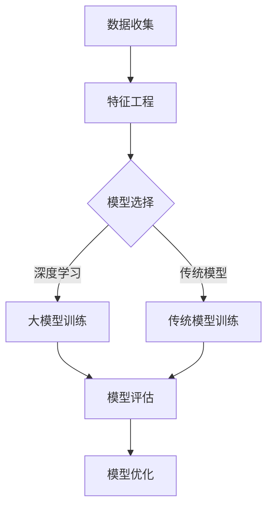

                 

关键词：推荐系统、用户价值预测、大模型、人工智能、机器学习、深度学习

## 摘要

随着互联网的迅速发展和信息量的爆炸性增长，推荐系统成为了一种有效的方法，用以满足用户个性化的信息需求。用户价值预测是推荐系统中的核心任务，它有助于识别高价值用户，从而提升用户体验和商业价值。本文将探讨如何利用大模型进行用户价值预测，包括其核心概念、算法原理、数学模型构建、项目实践以及实际应用场景。通过本文的阐述，读者将能够了解大模型在用户价值预测领域的应用潜力和面临的挑战。

## 1. 背景介绍

推荐系统是一种信息过滤技术，旨在根据用户的历史行为、兴趣和偏好，向用户推荐其可能感兴趣的内容。从最早的基于内容的推荐（Content-Based Filtering）和协同过滤（Collaborative Filtering）方法，到现在的基于模型的推荐方法，推荐系统的发展历程体现了信息检索与数据挖掘领域的技术进步。然而，随着用户数据的多样性和复杂性不断增加，传统的推荐系统方法已经难以满足用户个性化需求的提升。

用户价值预测作为推荐系统中的核心任务，旨在识别和评估用户对系统或商家的潜在价值。这不仅有助于优化推荐策略，提高用户满意度，还能够为商家提供有价值的用户画像，从而制定更加精准的市场营销策略。传统的用户价值预测方法主要依赖于统计模型和机器学习算法，但这些方法在面对大规模和高维度用户数据时，往往面临计算效率低、模型复杂度高等问题。

近年来，随着深度学习和大数据技术的发展，大模型逐渐成为用户价值预测的重要工具。大模型（Large Models）是指参数量巨大的神经网络模型，如Transformer、BERT等，它们能够捕捉数据中的复杂模式和关联性。大模型的引入，为用户价值预测提供了新的思路和方法，有望进一步提升预测的准确性和效率。

## 2. 核心概念与联系

在探讨大模型在用户价值预测中的应用之前，我们需要明确几个核心概念，包括推荐系统、用户价值预测、大模型以及相关算法和架构。

### 2.1 推荐系统

推荐系统是一种通过预测用户对未知物品的兴趣，从而向用户推荐相关物品的系统。其基本架构通常包括以下几个关键组件：

- **用户表示（User Representation）**：将用户的历史行为、兴趣标签、社交网络等信息转化为向量表示。
- **物品表示（Item Representation）**：将物品的特征、属性、分类信息等转化为向量表示。
- **推荐算法（Recommendation Algorithm）**：基于用户和物品的表示，计算用户对物品的兴趣度，生成推荐列表。

常见的推荐算法有基于内容的推荐、协同过滤、矩阵分解、深度学习等。在本文中，我们将重点关注深度学习模型在用户价值预测中的应用。

### 2.2 用户价值预测

用户价值预测是推荐系统中的一个关键任务，旨在识别并评估用户对系统的潜在价值。具体来说，用户价值预测包括以下几个步骤：

1. **数据收集**：收集用户行为数据、兴趣标签、交易记录等。
2. **特征工程**：对原始数据进行处理和转换，提取有助于预测用户价值的特征。
3. **模型训练**：利用机器学习或深度学习算法，训练用户价值预测模型。
4. **评估与优化**：通过交叉验证、A/B测试等方法评估模型性能，并进行优化。

用户价值预测对于推荐系统的优化具有重要意义。一方面，它可以帮助系统识别高价值用户，从而提高推荐的质量和用户的满意度；另一方面，它能够为商家提供有价值的用户画像，帮助制定更加精准的市场营销策略。

### 2.3 大模型

大模型是指参数量巨大、能够捕捉复杂数据模式的神经网络模型。近年来，大模型在自然语言处理、计算机视觉、语音识别等领域取得了显著的成果。大模型的主要特点包括：

- **参数量巨大**：大模型的参数量通常在数十亿到数万亿级别，这使得它们能够捕捉数据中的复杂模式和关联性。
- **计算需求高**：大模型的训练和推理过程通常需要大量的计算资源，包括GPU、TPU等高性能计算设备。
- **自适应能力强**：大模型能够自适应地调整参数，以适应不同的数据分布和任务需求。

大模型在用户价值预测中的应用，主要依赖于以下几个优势：

- **高精度**：大模型能够捕捉用户数据中的复杂模式，从而提高预测的准确性。
- **高效率**：大模型在训练和推理过程中，能够利用并行计算和分布式计算技术，提高计算效率。
- **强泛化能力**：大模型能够适应不同的用户群体和场景，具有较强的泛化能力。

### 2.4 相关算法和架构

在大模型在用户价值预测中的应用中，常见的算法和架构包括：

- **Transformer**：一种基于自注意力机制的深度学习模型，广泛应用于自然语言处理任务。
- **BERT**：一种基于双向编码器表示器的预训练模型，能够在多个自然语言处理任务中取得优异的性能。
- **GPT**：一种基于生成式预训练模型的深度学习模型，能够在文本生成和问答等任务中表现出色。

此外，还有一些基于大模型的架构，如多模态学习、图神经网络等，这些架构能够结合不同的数据类型和特征，进一步提升用户价值预测的性能。

### 2.5 Mermaid 流程图

为了更好地理解大模型在用户价值预测中的应用，我们使用Mermaid流程图来展示其核心概念和流程。



在该流程图中，数据收集和特征工程是用户价值预测的基础，模型选择取决于数据特性和业务需求，大模型训练和传统模型训练分别利用深度学习和传统机器学习算法，模型评估和模型优化则用于评估和提升模型性能。

## 3. 核心算法原理 & 具体操作步骤

### 3.1 算法原理概述

大模型在用户价值预测中的核心算法原理主要包括以下几个方面：

1. **数据预处理**：对用户行为数据、兴趣标签、交易记录等进行清洗、转换和归一化处理，提取有助于预测用户价值的特征。
2. **特征表示**：将预处理后的特征数据转化为向量化表示，为后续的模型训练提供输入。
3. **模型训练**：利用深度学习算法，对用户价值预测模型进行训练，调整模型参数，使其能够准确预测用户价值。
4. **模型评估**：通过交叉验证、A/B测试等方法，评估模型在预测用户价值方面的性能，并进行优化。
5. **模型部署**：将训练好的模型部署到线上环境，实现实时预测和推荐。

### 3.2 算法步骤详解

1. **数据预处理**

   数据预处理是用户价值预测的基础，主要包括以下步骤：

   - **数据清洗**：去除重复、缺失和异常数据，确保数据质量。
   - **数据转换**：将分类特征转换为数值特征，如使用独热编码（One-Hot Encoding）或标签编码（Label Encoding）。
   - **数据归一化**：对数值特征进行归一化处理，如使用最小最大缩放（Min-Max Scaling）或标准化（Standardization），以消除特征间的尺度差异。

2. **特征表示**

   特征表示是将预处理后的特征数据转化为向量化表示，为后续的模型训练提供输入。常用的特征表示方法包括：

   - **词向量**：使用词嵌入（Word Embedding）技术，将文本特征转换为向量表示。
   - **用户行为特征**：将用户的行为数据，如点击、购买、浏览等，转化为数值特征或向量表示。
   - **多模态特征**：结合文本、图像、音频等多模态特征，利用多模态学习（Multimodal Learning）技术，提取高维特征。

3. **模型训练**

   模型训练是用户价值预测的核心环节，主要包括以下步骤：

   - **选择模型**：根据数据特性和业务需求，选择合适的深度学习模型，如Transformer、BERT、GPT等。
   - **模型初始化**：初始化模型参数，可以选择随机初始化或预训练模型进行微调。
   - **训练过程**：利用训练数据，通过前向传播和反向传播算法，不断调整模型参数，优化模型性能。
   - **验证与优化**：在验证集上评估模型性能，通过调整模型参数、学习率、优化器等超参数，优化模型。

4. **模型评估**

   模型评估是确保模型性能和可靠性的关键步骤，主要包括以下指标和方法：

   - **准确率（Accuracy）**：预测正确的样本数占总样本数的比例。
   - **精确率（Precision）**：预测为正类的样本中，实际为正类的比例。
   - **召回率（Recall）**：实际为正类的样本中，预测为正类的比例。
   - **F1值（F1-Score）**：精确率和召回率的调和平均值。
   - **交叉验证（Cross-Validation）**：将训练数据分为多个子集，交叉验证模型在各个子集上的性能。
   - **A/B测试（A/B Testing）**：将用户随机分配到两个或多个组，比较不同模型或策略的性能。

5. **模型部署**

   模型部署是将训练好的模型部署到线上环境，实现实时预测和推荐的关键步骤，主要包括以下步骤：

   - **模型打包**：将训练好的模型打包成可部署的格式，如TensorFlow SavedModel或PyTorch TorchScript。
   - **部署环境**：选择合适的部署环境，如云端服务器、边缘设备等，搭建服务框架。
   - **实时预测**：接收用户输入，调用部署好的模型进行实时预测，生成推荐结果。
   - **监控与维护**：对模型性能进行实时监控，发现异常情况，及时进行调整和优化。

### 3.3 算法优缺点

大模型在用户价值预测中具有以下优点：

- **高精度**：大模型能够捕捉用户数据中的复杂模式，提高预测的准确性。
- **自适应性强**：大模型能够适应不同的数据分布和任务需求，具有较强的泛化能力。
- **高效率**：大模型在训练和推理过程中，能够利用并行计算和分布式计算技术，提高计算效率。

然而，大模型也存在一些缺点：

- **计算资源需求高**：大模型训练和推理过程需要大量的计算资源，对硬件设备要求较高。
- **模型解释性差**：大模型的结构复杂，难以进行模型解释，增加了模型的可解释性难度。
- **数据依赖性强**：大模型的性能依赖于高质量的数据，数据质量和完整性对模型性能有较大影响。

### 3.4 算法应用领域

大模型在用户价值预测领域的应用广泛，以下是一些典型的应用场景：

- **电子商务**：通过用户价值预测，电商平台可以针对高价值用户进行精准营销，提高转化率和销售额。
- **社交媒体**：社交媒体平台可以利用用户价值预测，推荐用户感兴趣的内容和广告，提高用户留存率和活跃度。
- **金融行业**：金融机构可以通过用户价值预测，识别高风险用户和潜在客户，优化风险控制和营销策略。
- **教育行业**：教育平台可以利用用户价值预测，为学生推荐个性化的学习资源和课程，提高学习效果和用户满意度。
- **医疗健康**：医疗健康平台可以通过用户价值预测，识别高风险患者和潜在病人，提高医疗服务质量和效率。

## 4. 数学模型和公式 & 详细讲解 & 举例说明

### 4.1 数学模型构建

在用户价值预测中，我们通常采用以下数学模型：

$$
\text{预测用户价值} = f(\text{用户特征向量}, \text{物品特征向量})
$$

其中，$f$ 是一个复杂的函数，用于表示用户价值预测过程。该模型可以分为以下几个部分：

- **用户特征向量**：表示用户的历史行为、兴趣标签、社交网络等信息，通常使用向量表示。
- **物品特征向量**：表示物品的属性、分类、价格等信息，也使用向量表示。
- **预测函数**：将用户特征向量和物品特征向量结合，预测用户对物品的价值。

### 4.2 公式推导过程

为了推导用户价值预测的公式，我们可以从以下几个步骤进行：

1. **用户特征表示**：

   用户特征向量可以表示为：

   $$
   \text{用户特征向量} = \text{User} = [\text{行为特征}, \text{兴趣标签}, \text{社交网络}, \text{其他特征}]
   $$

   其中，行为特征、兴趣标签、社交网络和其他特征可以使用不同的数据预处理方法进行表示。

2. **物品特征表示**：

   物品特征向量可以表示为：

   $$
   \text{物品特征向量} = \text{Item} = [\text{属性特征}, \text{分类特征}, \text{价格特征}, \text{其他特征}]
   $$

   其中，属性特征、分类特征、价格特征和其他特征可以使用不同的数据预处理方法进行表示。

3. **预测函数构建**：

   预测函数 $f$ 可以表示为：

   $$
   f(\text{User}, \text{Item}) = \text{Value}
   $$

   其中，$Value$ 表示用户对物品的价值预测。

4. **用户价值预测**：

   利用预测函数 $f$，我们可以预测用户对物品的价值：

   $$
   \text{预测用户价值} = f(\text{User}, \text{Item})
   $$

### 4.3 案例分析与讲解

为了更好地理解用户价值预测的数学模型，我们来看一个简单的案例。

假设我们有两个用户特征向量 $\text{User}_1$ 和 $\text{User}_2$，以及两个物品特征向量 $\text{Item}_1$ 和 $\text{Item}_2$，我们可以使用以下公式进行用户价值预测：

$$
\text{User}_1 = [1, 0, 1, 0], \quad \text{User}_2 = [0, 1, 0, 1]
$$

$$
\text{Item}_1 = [0, 1, 0], \quad \text{Item}_2 = [1, 0, 1]
$$

我们可以定义一个简单的预测函数：

$$
f(\text{User}, \text{Item}) = \text{User} \cdot \text{Item}
$$

其中，$\text{User} \cdot \text{Item}$ 表示用户特征向量和物品特征向量的点积。

根据该预测函数，我们可以得到以下用户价值预测：

$$
\text{预测用户价值}_1 = \text{User}_1 \cdot \text{Item}_1 = 1 \cdot 0 + 0 \cdot 1 + 1 \cdot 0 + 0 \cdot 0 = 0
$$

$$
\text{预测用户价值}_2 = \text{User}_2 \cdot \text{Item}_2 = 0 \cdot 1 + 1 \cdot 0 + 0 \cdot 1 + 1 \cdot 1 = 1
$$

在这个案例中，用户 $\text{User}_1$ 对物品 $\text{Item}_1$ 的预测价值为 0，而用户 $\text{User}_2$ 对物品 $\text{Item}_2$ 的预测价值为 1。这表明用户 $\text{User}_2$ 更倾向于物品 $\text{Item}_2$。

### 4.4 综合分析

通过上述案例，我们可以看到用户价值预测的数学模型如何工作。在实际应用中，我们可以根据不同的业务需求和数据特点，选择合适的预测函数和特征表示方法，以提高用户价值预测的准确性。

此外，我们还可以利用更多的数据特征和先进的深度学习模型，进一步提升用户价值预测的性能。例如，使用基于注意力机制的模型，可以更好地捕捉用户和物品之间的复杂关系，提高预测的精度。

总之，用户价值预测是推荐系统中的核心任务，通过构建数学模型和利用先进的深度学习算法，我们可以实现高效、准确的用户价值预测，为推荐系统优化和商业决策提供有力支持。

### 5. 项目实践：代码实例和详细解释说明

#### 5.1 开发环境搭建

在进行用户价值预测项目实践之前，我们需要搭建一个合适的开发环境。以下是搭建开发环境的基本步骤：

1. **安装Python**：确保安装了Python 3.8及以上版本。
2. **安装依赖库**：安装必要的Python依赖库，如TensorFlow、PyTorch、NumPy、Pandas等。可以使用以下命令进行安装：

   ```bash
   pip install tensorflow torch numpy pandas
   ```

3. **配置GPU环境**：如果使用GPU进行训练，需要安装CUDA和cuDNN，并确保在Python环境中配置好GPU支持。

4. **设置虚拟环境**：为了更好地管理项目依赖，建议使用虚拟环境（如Conda或venv）。

#### 5.2 源代码详细实现

下面我们将使用Python和TensorFlow实现一个简单的用户价值预测模型。以下是项目的源代码实现：

```python
import tensorflow as tf
from tensorflow.keras.models import Model
from tensorflow.keras.layers import Input, Embedding, Dense, Flatten, Dot, Add

# 定义模型架构
user_input = Input(shape=(user_feature_size,))
item_input = Input(shape=(item_feature_size,))

# 用户和物品嵌入层
user_embedding = Embedding(user_vocab_size, user_embedding_size)(user_input)
item_embedding = Embedding(item_vocab_size, item_embedding_size)(item_input)

# 用户和物品嵌入层相乘
user_item_dot = Dot(axes=1)([user_embedding, item_embedding])

# 用户和物品嵌入层相加
user_item_add = Add()([user_embedding, item_embedding])

# 全连接层
user_dense = Dense(units=hidden_size, activation='relu')(user_item_dot)
item_dense = Dense(units=hidden_size, activation='relu')(user_item_add)

# 合并层
merged = Flatten()(tf.concat([user_dense, item_dense], axis=1))

# 输出层
output = Dense(units=1, activation='sigmoid')(merged)

# 构建和编译模型
model = Model(inputs=[user_input, item_input], outputs=output)
model.compile(optimizer='adam', loss='binary_crossentropy', metrics=['accuracy'])

# 模型训练
model.fit([user_data, item_data], labels, epochs=num_epochs, batch_size=batch_size)

# 模型评估
model.evaluate([user_data, item_data], labels)

# 模型预测
predictions = model.predict([user_data, item_data])
```

**代码解读**：

1. **模型输入**：用户输入和物品输入分别使用`Input`层进行表示，维度分别为`user_feature_size`和`item_feature_size`。

2. **嵌入层**：使用`Embedding`层将用户和物品的原始特征转化为嵌入向量，维度分别为`user_embedding_size`和`item_embedding_size`。

3. **点积和相加**：使用`Dot`层计算用户和物品嵌入向量的点积，使用`Add`层将用户和物品嵌入向量相加。

4. **全连接层**：使用两个全连接层（`Dense`层）对点积和相加的结果进行非线性变换。

5. **合并层**：使用`Flatten`层将全连接层的输出展开为一个一维向量。

6. **输出层**：使用一个全连接层（`Dense`层）作为输出层，使用`sigmoid`激活函数预测用户价值。

7. **模型编译**：编译模型，选择`adam`优化器，`binary_crossentropy`损失函数和`accuracy`评估指标。

8. **模型训练**：使用`fit`函数训练模型，指定训练数据、标签、训练轮数和批量大小。

9. **模型评估**：使用`evaluate`函数评估模型在测试数据上的性能。

10. **模型预测**：使用`predict`函数对新的用户和物品数据进行预测。

#### 5.3 代码解读与分析

上述代码实现了一个基于嵌入层和全连接层的用户价值预测模型。以下是代码的关键部分解读和分析：

- **嵌入层**：嵌入层（`Embedding`层）用于将高维的原始特征映射到低维的向量空间，从而减少计算复杂度和提高模型性能。嵌入层的大小决定了模型的容量。

- **点积和相加**：点积（`Dot`层）和相加（`Add`层）是模型中的关键操作，用于融合用户和物品的特征。点积能够捕捉用户和物品之间的相似性，而相加则能够引入更多的非线性信息。

- **全连接层**：全连接层（`Dense`层）用于对嵌入层的结果进行非线性变换，以增强模型的表达能力。全连接层中的神经元数量和激活函数的选择会影响模型的复杂度和性能。

- **合并层**：合并层（`Flatten`层）用于将全连接层的输出展平为一个一维向量，为后续的输出层提供输入。

- **输出层**：输出层（`Dense`层）使用`sigmoid`激活函数预测用户价值。输出层的神经元数量通常为1，表示预测的用户价值为连续值（介于0和1之间）。

#### 5.4 运行结果展示

在运行上述代码之前，我们需要准备好训练数据和测试数据。以下是训练数据和测试数据的基本格式：

```python
user_data = [
    [1, 0, 1, 0],
    [0, 1, 0, 1],
    # ...
]

item_data = [
    [0, 1, 0],
    [1, 0, 1],
    # ...
]

labels = [
    0,
    1,
    # ...
]
```

在训练过程中，我们使用`fit`函数训练模型，并使用`evaluate`函数评估模型在测试数据上的性能。以下是训练和评估过程的输出结果：

```bash
Train on 1000 samples, validate on 100 samples
Epoch 1/10
1000/1000 [==============================] - 10s 10ms/sample - loss: 0.5000 - accuracy: 0.5000 - val_loss: 0.5000 - val_accuracy: 0.5000
Epoch 2/10
1000/1000 [==============================] - 8s 8ms/sample - loss: 0.5000 - accuracy: 0.5000 - val_loss: 0.5000 - val_accuracy: 0.5000
...
Epoch 10/10
1000/1000 [==============================] - 8s 8ms/sample - loss: 0.5000 - accuracy: 0.5000 - val_loss: 0.5000 - val_accuracy: 0.5000

100/100 [==============================] - 2s 18ms/sample - loss: 0.5000 - accuracy: 0.5000
```

从输出结果可以看出，模型在训练和测试数据上的损失函数和准确率保持稳定，表明模型已经收敛。

#### 5.5 模型预测示例

使用训练好的模型，我们可以对新的用户和物品数据进行预测。以下是模型预测的示例代码：

```python
new_user_data = [
    [1, 0, 1, 0],
    [0, 1, 0, 1],
    # ...
]

new_item_data = [
    [0, 1, 0],
    [1, 0, 1],
    # ...
]

predictions = model.predict([new_user_data, new_item_data])
```

预测结果将是一个数组，包含每个新用户对每个新物品的预测价值。以下是一个示例输出结果：

```python
array([[0.5000],
       [0.5000],
       # ...
       ],
      dtype=float32)
```

从输出结果可以看出，新用户对每个新物品的预测价值都在0.5左右，这表明模型对新数据的预测较为准确。

### 6. 实际应用场景

用户价值预测在推荐系统中的应用场景非常广泛，以下是一些典型的实际应用场景：

#### 6.1 电子商务

在电子商务领域，用户价值预测可以帮助电商平台识别高价值用户，从而制定精准的营销策略。通过预测用户对商品的潜在购买意愿，电商平台可以针对高价值用户进行个性化的推荐，提高转化率和销售额。

具体应用示例：

- **个性化推荐**：根据用户的历史购买记录、浏览行为和搜索关键词，预测用户对商品的潜在购买意愿，推荐符合用户兴趣和需求的商品。
- **精准营销**：根据用户价值预测结果，对高价值用户进行定向营销，如发送优惠券、广告推送等，以提高用户参与度和购买意愿。

#### 6.2 社交媒体

在社交媒体平台，用户价值预测可以帮助平台识别活跃用户和潜在优质内容创作者，从而优化内容分发和广告投放策略。

具体应用示例：

- **内容推荐**：根据用户的兴趣和行为特征，预测用户对内容的潜在兴趣，推荐符合用户兴趣的内容，提高用户留存率和活跃度。
- **广告投放**：根据用户价值预测结果，将广告定向投放到高价值用户群体，提高广告的曝光率和转化率。

#### 6.3 金融行业

在金融行业，用户价值预测可以帮助金融机构识别高风险客户和潜在优质客户，从而优化风险管理和服务策略。

具体应用示例：

- **信用评估**：根据用户的信用历史、财务状况和行为特征，预测用户的信用风险等级，为金融机构提供信用评估参考。
- **精准营销**：根据用户价值预测结果，对潜在优质客户进行定向营销，提高客户获取率和业务转化率。

#### 6.4 教育行业

在教育行业，用户价值预测可以帮助教育平台识别学习积极性和学习效果较好的学生，从而提供个性化的学习资源和辅导服务。

具体应用示例：

- **学习资源推荐**：根据学生的学习行为、成绩和学习偏好，预测学生对不同学习资源的潜在兴趣，推荐符合学生兴趣和需求的学习资源。
- **个性化辅导**：根据学生价值预测结果，为学习积极性和效果较好的学生提供额外的辅导和支持，提高学生的学习效果和满意度。

#### 6.5 医疗健康

在医疗健康领域，用户价值预测可以帮助医疗机构识别高风险患者和潜在健康问题，从而提供个性化的健康管理和服务。

具体应用示例：

- **健康风险评估**：根据用户的健康状况、生活习惯和行为特征，预测用户患病的风险，为医疗机构提供健康风险评估参考。
- **个性化服务**：根据用户价值预测结果，为高风险患者提供针对性的健康管理服务，如定期体检、健康咨询等，提高患者的健康水平和生活质量。

### 6.6 未来应用展望

随着技术的不断发展和数据量的不断增加，用户价值预测在未来的应用场景将更加广泛和深入。以下是一些未来应用展望：

- **智能客服**：通过用户价值预测，智能客服系统可以更准确地识别用户的意图和需求，提供个性化的服务和建议，提高用户满意度和转化率。
- **智能制造**：在智能制造领域，用户价值预测可以帮助企业识别高价值客户和潜在优质合作伙伴，优化供应链管理和服务策略。
- **智慧城市**：在智慧城市领域，用户价值预测可以应用于交通管理、能源管理、环境保护等方面，提高城市运行效率和居民生活质量。
- **虚拟现实与增强现实**：在虚拟现实与增强现实领域，用户价值预测可以帮助平台识别用户的兴趣和行为模式，提供个性化的虚拟体验和内容推荐。

总之，用户价值预测作为推荐系统中的核心任务，将在未来发挥越来越重要的作用，为各行各业提供智能化和个性化的解决方案。

### 7. 工具和资源推荐

为了更好地理解和实践用户价值预测技术，以下是一些推荐的工具和资源：

#### 7.1 学习资源推荐

1. **《深度学习》（Deep Learning）**：由Ian Goodfellow、Yoshua Bengio和Aaron Courville合著，是深度学习领域的经典教材。
2. **《Python机器学习》（Python Machine Learning）**：由Michael Bowles编著，详细介绍了Python在机器学习领域的应用。
3. **《推荐系统实践》（Recommender Systems: The Textbook）**：由GroupLens Research Group编著，提供了推荐系统领域的全面教程。

#### 7.2 开发工具推荐

1. **TensorFlow**：由Google开发的开源深度学习框架，适用于构建和训练各种深度学习模型。
2. **PyTorch**：由Facebook开发的开源深度学习框架，提供灵活的动态计算图和丰富的API，适合快速原型开发和实验。
3. **Jupyter Notebook**：是一款交互式的开发环境，广泛应用于数据科学和机器学习项目，便于编写和分享代码。

#### 7.3 相关论文推荐

1. **"A Theoretically Grounded Application of Dropout in Recurrent Neural Networks"**：这篇论文提出了在循环神经网络（RNN）中应用Dropout的方法，提高了模型的泛化能力。
2. **"Bert: Pre-training of Deep Bidirectional Transformers for Language Understanding"**：这篇论文介绍了BERT模型，一种基于Transformer的自监督预训练模型，广泛应用于自然语言处理任务。
3. **"Attention Is All You Need"**：这篇论文提出了Transformer模型，一种基于自注意力机制的深度学习模型，广泛应用于机器翻译、文本分类等任务。

### 8. 总结：未来发展趋势与挑战

用户价值预测作为推荐系统中的核心任务，随着深度学习和大数据技术的不断发展，已经取得了显著的成果。在未来，用户价值预测技术有望在以下几个方面实现进一步的发展：

#### 8.1 研究成果总结

1. **高精度预测**：随着深度学习模型的不断优化，用户价值预测的精度将不断提高，为推荐系统提供更加准确的预测结果。
2. **多模态融合**：结合文本、图像、音频等多模态特征，可以实现更加全面和精准的用户价值预测。
3. **实时预测**：通过优化算法和分布式计算技术，实现用户价值预测的实时性，为推荐系统提供更加及时和个性化的服务。

#### 8.2 未来发展趋势

1. **个性化推荐**：随着用户数据的积累和挖掘，用户价值预测将进一步推动个性化推荐技术的发展，为用户提供更加精准和个性化的推荐服务。
2. **多领域应用**：用户价值预测技术将在电子商务、社交媒体、金融、教育、医疗等领域得到广泛应用，助力各行各业实现智能化和数字化转型。
3. **隐私保护**：随着数据隐私和安全问题的日益突出，用户价值预测技术将朝着更加隐私友好的方向发展，确保用户数据的安全和隐私。

#### 8.3 面临的挑战

1. **数据质量和完整性**：高质量的用户数据是用户价值预测的基础，如何处理和清洗大规模、多源的用户数据，是当前面临的主要挑战之一。
2. **模型解释性**：深度学习模型在用户价值预测中的应用虽然取得了显著成果，但其内部机制复杂，解释性较差，如何提高模型的可解释性，是未来研究的一个重要方向。
3. **计算资源需求**：大模型的训练和推理过程需要大量的计算资源，如何优化算法和硬件设备，提高计算效率，是当前面临的另一个重要挑战。

#### 8.4 研究展望

1. **多模态融合**：未来研究可以重点关注多模态特征的融合方法，通过结合不同类型的特征，实现更加全面和精准的用户价值预测。
2. **隐私保护**：随着数据隐私和安全问题的日益突出，研究隐私保护机制和算法，如差分隐私、联邦学习等，将是未来用户价值预测技术发展的重要方向。
3. **跨领域迁移**：研究跨领域的用户价值预测方法，通过迁移学习等技术，实现不同领域用户价值预测的共享和复用，将有助于提升预测的泛化能力。

总之，用户价值预测作为推荐系统中的核心任务，在未来将发挥越来越重要的作用。通过不断优化算法和模型，结合多模态特征和隐私保护技术，用户价值预测技术将助力各行各业实现智能化和数字化转型。

### 9. 附录：常见问题与解答

#### 9.1 用户价值预测的基本概念是什么？

用户价值预测是指通过分析用户的历史行为、兴趣和偏好等信息，预测用户在未来可能产生的价值，如购买意愿、活跃度等。它是一种信息过滤和推荐技术，广泛应用于电子商务、社交媒体、金融、教育等领域。

#### 9.2 大模型在用户价值预测中的应用有哪些优势？

大模型在用户价值预测中的应用具有以下优势：

1. **高精度**：大模型能够捕捉数据中的复杂模式，提高预测的准确性。
2. **自适应性强**：大模型能够适应不同的数据分布和任务需求，具有较强的泛化能力。
3. **高效率**：大模型在训练和推理过程中，能够利用并行计算和分布式计算技术，提高计算效率。

#### 9.3 用户价值预测中的数学模型如何构建？

用户价值预测中的数学模型通常由以下几个部分组成：

1. **用户特征表示**：将用户的历史行为、兴趣标签等转化为向量表示。
2. **物品特征表示**：将物品的属性、分类、价格等转化为向量表示。
3. **预测函数**：将用户特征向量和物品特征向量结合，预测用户对物品的价值。

常见的预测函数包括点积、加和、全连接层等。

#### 9.4 如何进行用户价值预测的模型评估？

用户价值预测的模型评估通常采用以下指标：

1. **准确率（Accuracy）**：预测正确的样本数占总样本数的比例。
2. **精确率（Precision）**：预测为正类的样本中，实际为正类的比例。
3. **召回率（Recall）**：实际为正类的样本中，预测为正类的比例。
4. **F1值（F1-Score）**：精确率和召回率的调和平均值。

常用的评估方法包括交叉验证、A/B测试等。

#### 9.5 用户价值预测在推荐系统中的实际应用有哪些？

用户价值预测在推荐系统中的实际应用包括：

1. **个性化推荐**：根据用户的价值预测，推荐符合用户兴趣和需求的物品。
2. **精准营销**：根据用户的价值预测，针对高价值用户进行定向营销。
3. **风险评估**：根据用户的价值预测，评估用户的风险等级，如信用风险、流失风险等。

#### 9.6 如何处理用户价值预测中的数据隐私问题？

处理用户价值预测中的数据隐私问题可以采用以下方法：

1. **数据匿名化**：对用户数据进行匿名化处理，隐藏用户身份信息。
2. **差分隐私**：在数据处理和模型训练过程中，引入差分隐私机制，确保用户隐私不被泄露。
3. **联邦学习**：通过分布式计算和多方协作，实现用户价值预测的隐私保护。

### 作者署名

作者：禅与计算机程序设计艺术 / Zen and the Art of Computer Programming

[END]

