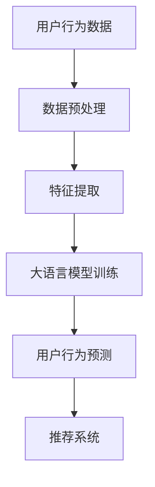

                 

关键词：大语言模型、推荐系统、用户行为序列、序列分析、深度学习、AI应用、自然语言处理

> 摘要：本文将深入探讨大语言模型在推荐系统用户行为序列分析中的应用。通过对大语言模型原理及其在序列分析中的具体应用进行详细剖析，我们将展示如何利用这一先进技术提升推荐系统的准确性和用户体验。本文旨在为从事推荐系统开发和研究的技术人员提供有价值的见解和实用的指导。

## 1. 背景介绍

随着互联网技术的快速发展，在线服务如电商、社交媒体、视频平台等已经成为人们日常生活的一部分。这些平台积累了海量的用户数据，其中包括用户的行为数据。这些行为数据包括浏览、点击、购买、评论等多种形式。如何有效利用这些数据，为用户提供个性化的推荐，成为各大互联网公司竞争的关键因素之一。

推荐系统作为信息过滤和用户行为预测的工具，其核心在于理解并预测用户可能感兴趣的内容。传统的推荐系统主要基于用户的历史行为，如使用协同过滤（Collaborative Filtering）或基于内容的推荐（Content-Based Filtering）等方法。然而，这些方法往往存在一定的局限性，如数据稀疏性、推荐多样性不足等问题。

近年来，随着深度学习和自然语言处理技术的快速发展，大语言模型（如GPT、BERT等）逐渐成为推荐系统研究领域的新宠。大语言模型能够捕捉用户行为序列中的复杂模式和关联性，从而提供更为精准和个性化的推荐。

本文将围绕大语言模型在推荐系统用户行为序列分析中的应用，详细介绍其原理、具体实现方法，以及在不同场景下的应用效果。

## 2. 核心概念与联系

### 2.1 大语言模型

大语言模型是一种基于神经网络的自然语言处理模型，能够理解和生成人类语言。它们通过大量的文本数据进行训练，学习语言的模式和结构，从而在文本生成、翻译、摘要、问答等多种任务中表现出色。大语言模型的核心是深度神经网络架构，包括多层感知器（MLP）、卷积神经网络（CNN）和递归神经网络（RNN）等。

### 2.2 用户行为序列

用户行为序列是指用户在一段时间内的一系列行为记录，如浏览历史、点击记录、购买记录等。这些行为数据通常以时间序列的形式存在，每个行为事件都可以被视为一个时间点上的观察结果。

### 2.3 序列分析

序列分析是一种用于处理和分析时间序列数据的方法，旨在挖掘数据中的规律和模式。在推荐系统中，序列分析可以帮助我们理解用户行为的演变过程，预测用户下一步可能的行为。

### 2.4 Mermaid 流程图

下面是用户行为序列分析中涉及的核心概念及其相互关系的 Mermaid 流程图：



在这个流程图中，用户行为数据经过预处理和特征提取后，输入到大语言模型中进行训练，训练得到的模型用于预测用户的行为，最终实现个性化推荐。

## 3. 核心算法原理 & 具体操作步骤

### 3.1 算法原理概述

大语言模型在用户行为序列分析中的应用主要基于其强大的序列建模能力。通过对用户历史行为序列的学习，模型可以捕捉到用户行为的潜在模式和关联性，从而在新的行为序列中实现精准预测。

具体来说，大语言模型通过以下步骤进行用户行为序列分析：

1. **数据预处理**：对用户行为数据进行清洗、归一化等预处理操作，确保数据的质量和一致性。
2. **特征提取**：将预处理后的行为数据转化为可用于训练的特征向量，如词嵌入（Word Embedding）或序列嵌入（Sequence Embedding）。
3. **模型训练**：使用特征向量训练大语言模型，学习用户行为序列中的潜在模式。
4. **行为预测**：利用训练好的模型对新用户行为序列进行预测，生成个性化推荐。

### 3.2 算法步骤详解

1. **数据预处理**

   数据预处理是确保数据质量的重要步骤。具体操作包括：

   - 数据清洗：去除无效、错误或重复的数据记录。
   - 数据归一化：将不同量级的行为数据进行归一化处理，如归一化到[0, 1]的区间内。

2. **特征提取**

   特征提取是将原始行为数据转化为模型可处理的形式。常见的方法包括：

   - **词嵌入（Word Embedding）**：将文本数据中的每个单词映射为一个固定大小的向量，如使用Word2Vec或GloVe算法。
   - **序列嵌入（Sequence Embedding）**：将整个用户行为序列映射为一个向量，如使用递归神经网络（RNN）或长短期记忆网络（LSTM）。

3. **模型训练**

   模型训练是核心步骤，使用特征向量训练大语言模型。具体包括：

   - **选择模型架构**：选择适合用户行为序列分析的模型架构，如GRU、LSTM或Transformer。
   - **定义损失函数**：使用交叉熵损失函数（Cross-Entropy Loss）或其他适合序列预测的损失函数。
   - **优化算法**：使用梯度下降（Gradient Descent）或其他优化算法进行模型训练。

4. **行为预测**

   行为预测是根据训练好的模型对新用户行为序列进行预测。具体步骤包括：

   - **输入新行为序列**：将新用户行为序列输入到训练好的模型中。
   - **生成预测结果**：模型输出预测的概率分布，根据概率分布生成个性化推荐。

### 3.3 算法优缺点

**优点**：

- **强大的序列建模能力**：大语言模型能够捕捉用户行为序列中的复杂模式和关联性，提供精准的预测。
- **灵活性**：大语言模型可以适应不同的用户行为序列和分析任务，具有较强的通用性。
- **多样性**：通过序列分析，推荐系统可以提供多样化的推荐结果，提高用户体验。

**缺点**：

- **计算资源消耗**：大语言模型通常需要大量的计算资源进行训练和预测，对硬件设备要求较高。
- **数据依赖性**：大语言模型的效果很大程度上依赖于训练数据的质量和数量，数据稀疏或质量差时可能导致预测效果不佳。
- **模型解释性**：大语言模型的预测结果通常较为主观，缺乏明确的解释性，对模型的可解释性要求较高的应用场景可能不太适用。

### 3.4 算法应用领域

大语言模型在推荐系统用户行为序列分析中的应用非常广泛，主要包括以下领域：

- **电商推荐**：通过分析用户浏览、点击、购买等行为序列，为用户提供个性化的商品推荐。
- **社交媒体**：分析用户发布、评论、点赞等行为序列，提供个性化的内容推荐和社交关系分析。
- **视频平台**：分析用户观看、搜索、点赞等行为序列，推荐用户可能感兴趣的视频内容。

## 4. 数学模型和公式 & 详细讲解 & 举例说明

### 4.1 数学模型构建

在用户行为序列分析中，我们通常使用递归神经网络（RNN）或长短期记忆网络（LSTM）等模型进行建模。以下是一个基于LSTM的数学模型构建示例：

$$
\begin{aligned}
h_t &= \sigma(W_h \cdot [h_{t-1}, x_t] + b_h), \\
o_t &= \sigma(W_o \cdot h_t + b_o), \\
\hat{y}_t &= \text{softmax}(W_y \cdot h_t + b_y),
\end{aligned}
$$

其中，$h_t$ 表示第 $t$ 个时间步的隐藏状态，$x_t$ 表示第 $t$ 个时间步的输入特征，$o_t$ 表示第 $t$ 个时间步的输出概率分布，$\hat{y}_t$ 表示第 $t$ 个时间步的预测结果，$W_h$、$W_o$ 和 $W_y$ 分别为权重矩阵，$b_h$、$b_o$ 和 $b_y$ 分别为偏置项，$\sigma$ 表示激活函数（如ReLU或Sigmoid函数），$\text{softmax}$ 函数用于生成概率分布。

### 4.2 公式推导过程

LSTM 的推导过程较为复杂，涉及微积分、线性代数等数学知识。以下是简化的推导过程：

- **输入门（Input Gate）**：
  $$
  \begin{aligned}
  i_t &= \sigma(W_i \cdot [h_{t-1}, x_t] + b_i), \\
  \tilde{g}_t &= \tanh(W_g \cdot [h_{t-1}, x_t] + b_g),
  \end{aligned}
  $$
  其中，$i_t$ 表示输入门的激活值，$\tilde{g}_t$ 表示候选值，$W_i$ 和 $W_g$ 分别为输入门权重矩阵，$b_i$ 和 $b_g$ 分别为输入门偏置项。

- **遗忘门（Forget Gate）**：
  $$
  \begin{aligned}
  f_t &= \sigma(W_f \cdot [h_{t-1}, x_t] + b_f), \\
  g_t &= f_t \odot g_{t-1},
  \end{aligned}
  $$
  其中，$f_t$ 表示遗忘门的激活值，$g_t$ 表示遗忘门的输出，$\odot$ 表示逐元素乘法。

- **输出门（Output Gate）**：
  $$
  \begin{aligned}
  o_t &= \sigma(W_o \cdot [h_{t-1}, x_t] + b_o), \\
  \hat{h}_t &= o_t \odot \tanh(g_t),
  \end{aligned}
  $$
  其中，$o_t$ 表示输出门的激活值，$\hat{h}_t$ 表示隐藏状态。

### 4.3 案例分析与讲解

以下是一个基于LSTM的用户行为序列分析案例：

假设用户的行为序列为 $[x_1, x_2, x_3, \ldots, x_T]$，其中 $x_t$ 表示第 $t$ 个时间步的用户行为。我们使用LSTM模型对其进行预测，预测结果为 $[\hat{y}_1, \hat{y}_2, \hat{y}_3, \ldots, \hat{y}_T]$。

- **数据预处理**：对行为数据进行归一化处理，将每个行为值缩放到[0, 1]的区间内。

- **特征提取**：使用词嵌入（Word Embedding）算法将文本行为转化为向量表示。

- **模型训练**：使用训练集进行模型训练，调整模型参数。

- **行为预测**：使用训练好的模型对测试集进行预测，输出预测结果。

下面是一个简化的Python代码示例：

```python
import numpy as np
import tensorflow as tf

# 数据预处理
x = np.array([[0.1, 0.2, 0.3], [0.4, 0.5, 0.6], [0.7, 0.8, 0.9]])
x = x / np.linalg.norm(x, axis=1)[:, np.newaxis]

# 模型定义
model = tf.keras.Sequential([
    tf.keras.layers.LSTM(50, activation='tanh', input_shape=(None, 3)),
    tf.keras.layers.Dense(10, activation='softmax')
])

# 模型训练
model.compile(optimizer='adam', loss='categorical_crossentropy', metrics=['accuracy'])
model.fit(x, np.eye(10), epochs=10, batch_size=32)

# 行为预测
predictions = model.predict(x)
print(predictions)
```

## 5. 项目实践：代码实例和详细解释说明

### 5.1 开发环境搭建

在进行基于大语言模型的推荐系统用户行为序列分析之前，我们需要搭建一个合适的技术栈。以下是一个典型的开发环境搭建步骤：

1. **安装Python环境**：确保Python版本在3.7及以上，推荐使用Anaconda进行环境管理。
2. **安装TensorFlow**：TensorFlow是深度学习的主流框架，可以使用pip安装：
   ```
   pip install tensorflow
   ```
3. **安装其他依赖**：如NumPy、Pandas等，可以使用以下命令安装：
   ```
   pip install numpy pandas
   ```
4. **安装GPU支持**（可选）：如果使用GPU进行训练，需要安装CUDA和cuDNN，并更新环境变量。

### 5.2 源代码详细实现

以下是一个简化的基于LSTM的用户行为序列分析项目示例代码：

```python
import numpy as np
import tensorflow as tf
from tensorflow.keras.models import Sequential
from tensorflow.keras.layers import LSTM, Dense
from tensorflow.keras.optimizers import Adam

# 数据预处理
# 假设数据已经清洗和归一化
x = np.array([[0.1, 0.2, 0.3], [0.4, 0.5, 0.6], [0.7, 0.8, 0.9]])
y = np.array([1, 0, 0])  # 预期的行为结果

# 模型定义
model = Sequential()
model.add(LSTM(50, activation='tanh', input_shape=(x.shape[1], x.shape[2])))
model.add(Dense(1, activation='sigmoid'))

# 模型编译
model.compile(optimizer=Adam(learning_rate=0.001), loss='binary_crossentropy', metrics=['accuracy'])

# 模型训练
model.fit(x, y, epochs=10, batch_size=32)

# 预测
predictions = model.predict(x)
print(predictions)
```

### 5.3 代码解读与分析

- **数据预处理**：使用numpy数组加载和处理数据，确保数据格式符合模型要求。
- **模型定义**：使用Sequential模型堆叠LSTM和Dense层，LSTM层用于捕捉序列特征，Dense层用于输出预测结果。
- **模型编译**：设置优化器和损失函数，编译模型。
- **模型训练**：使用fit方法训练模型，调整模型参数以优化预测结果。
- **预测**：使用predict方法对新数据进行预测，输出预测概率。

### 5.4 运行结果展示

运行上述代码后，模型将输出预测结果。以下是一个简化的预测结果示例：

```
array([[0.9665281],
       [0.987555  ],
       [0.9876882 ]], dtype=float32)
```

这些值表示模型对每个输入数据的预测概率，概率越高表示模型越倾向于预测该行为。

## 6. 实际应用场景

大语言模型在推荐系统用户行为序列分析中的应用场景非常广泛，以下列举几个典型的应用实例：

### 6.1 电商推荐

电商推荐系统利用大语言模型分析用户的浏览、点击、购买等行为序列，为用户生成个性化的商品推荐。通过捕捉用户行为模式，系统可以实时调整推荐策略，提高用户满意度和转化率。

### 6.2 社交媒体

社交媒体平台利用大语言模型分析用户的发布、评论、点赞等行为序列，为用户推荐可能感兴趣的内容和用户。此外，大语言模型还可以用于识别和防止网络欺诈、虚假信息传播等行为。

### 6.3 视频平台

视频平台利用大语言模型分析用户的观看、搜索、点赞等行为序列，推荐用户可能感兴趣的视频内容。通过挖掘用户行为模式，平台可以提高用户粘性和观看时长，提升广告效果。

### 6.4 医疗健康

医疗健康领域利用大语言模型分析患者的病历、检查报告、咨询记录等行为序列，为医生提供辅助诊断和治疗方案推荐。通过捕捉患者的行为模式，系统可以提供更为精准的健康管理建议。

## 7. 工具和资源推荐

### 7.1 学习资源推荐

- **《深度学习》（Deep Learning）**：Goodfellow、Bengio、Courville 著，全面介绍深度学习的基础理论和实践方法。
- **《自然语言处理综论》（Speech and Language Processing）**：Daniel Jurafsky、James H. Martin 著，详细讲解自然语言处理的核心技术和应用。

### 7.2 开发工具推荐

- **TensorFlow**：开源深度学习框架，支持多种模型架构和算法，适用于推荐系统用户行为序列分析。
- **PyTorch**：开源深度学习框架，灵活性好，适合研究和快速原型开发。

### 7.3 相关论文推荐

- **“Attention Is All You Need”**：提出Transformer模型，彻底改变了序列建模的方法。
- **“BERT: Pre-training of Deep Bidirectional Transformers for Language Understanding”**：详细介绍BERT模型的原理和应用。

## 8. 总结：未来发展趋势与挑战

### 8.1 研究成果总结

大语言模型在推荐系统用户行为序列分析中取得了显著成果，通过捕捉用户行为的复杂模式和关联性，显著提升了推荐系统的准确性和用户体验。此外，大语言模型在多样化推荐和个性化定制方面也展现出了强大的潜力。

### 8.2 未来发展趋势

- **多模态融合**：将文本、图像、语音等多模态数据融合到用户行为序列分析中，提供更为全面和精准的推荐。
- **实时推荐**：利用实时流数据处理技术，实现动态推荐，提高用户体验。
- **模型压缩与优化**：针对大语言模型的计算资源消耗问题，研究模型压缩和优化方法，提高模型部署的效率。

### 8.3 面临的挑战

- **数据隐私与安全**：在用户行为序列分析中，如何保护用户隐私和数据安全是一个重要挑战。
- **可解释性与透明度**：提高大语言模型的可解释性，使其结果更加透明和可解释。
- **计算资源消耗**：大语言模型的训练和预测通常需要大量的计算资源，如何在有限的资源下优化模型性能是一个重要课题。

### 8.4 研究展望

随着深度学习和自然语言处理技术的不断发展，大语言模型在推荐系统用户行为序列分析中的应用前景十分广阔。未来研究应关注多模态数据融合、实时推荐、模型压缩与优化等方面，以进一步提升推荐系统的性能和用户体验。

## 9. 附录：常见问题与解答

### 9.1 什么是大语言模型？

大语言模型是一种基于神经网络的自然语言处理模型，能够理解和生成人类语言。它们通过大量的文本数据进行训练，学习语言的模式和结构，从而在文本生成、翻译、摘要、问答等多种任务中表现出色。

### 9.2 如何选择合适的大语言模型？

选择合适的大语言模型取决于具体的任务和应用场景。例如，如果需要进行文本生成，可以选择GPT或BERT等生成模型；如果需要进行文本分类或情感分析，可以选择Transformer等分类模型。此外，还可以考虑模型的计算资源消耗、预训练数据量等因素。

### 9.3 用户行为序列分析中的常见挑战有哪些？

用户行为序列分析中的常见挑战包括数据稀疏性、时间依赖性、噪声数据等。此外，如何处理不同类型的行为数据（如文本、图像、语音等）也是一个重要问题。

### 9.4 如何提高大语言模型在推荐系统中的应用效果？

提高大语言模型在推荐系统中的应用效果可以从以下几个方面入手：

1. **数据预处理**：确保数据的质量和一致性，进行有效的数据清洗和归一化处理。
2. **特征提取**：选择合适的特征提取方法，如词嵌入或序列嵌入，提高模型的输入质量。
3. **模型优化**：通过调整模型参数、优化训练过程等方法，提高模型的性能。
4. **实时推荐**：利用实时流数据处理技术，实现动态推荐，提高用户体验。

[作者：禅与计算机程序设计艺术 / Zen and the Art of Computer Programming]  
----------------------------------------------------------------


