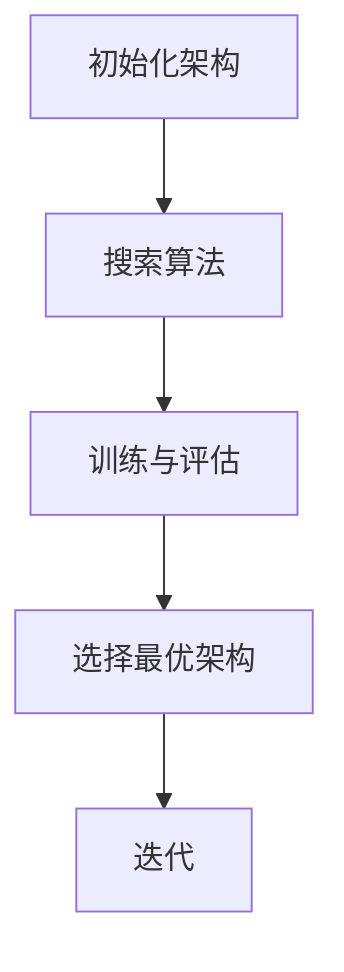

                 

关键词：神经架构搜索，强化学习，自动化机器学习，深度学习，神经网络设计，架构优化。

> 摘要：本文探讨了基于强化学习的神经架构搜索（NAS）技术，分析了其核心概念、算法原理、数学模型以及实际应用。通过实例和代码解读，展示了NAS在优化神经网络架构方面的潜力，并展望了未来的发展趋势与挑战。

## 1. 背景介绍

### 1.1 神经架构搜索（NAS）的概念

神经架构搜索（Neural Architecture Search，简称NAS）是一种自动化机器学习方法，旨在通过搜索算法自动发现最优的神经网络架构。在传统的人工设计神经网络架构中，研究者需要依靠经验来选择网络的层数、每层的神经元数目、激活函数、池化层等。而NAS通过优化算法，在大量的神经网络架构中找到最优或近似最优的架构，从而提高网络的性能和效率。

### 1.2 强化学习的引入

强化学习（Reinforcement Learning，简称RL）是一种通过试错和反馈来学习的机器学习方法。在NAS中，强化学习被用来模拟神经网络的训练过程，通过不断的试错和反馈来搜索最优的神经网络架构。强化学习与NAS的结合，使得NAS方法能够更加高效地探索大量的架构空间，从而找到最优的架构。

### 1.3 NAS在深度学习中的应用

深度学习在计算机视觉、自然语言处理等领域取得了显著的成果。然而，深度学习的成功在很大程度上依赖于神经网络架构的设计。NAS作为一种自动化机器学习方法，可以帮助研究者发现更优的神经网络架构，从而提高深度学习模型的性能和效率。NAS在深度学习中的应用包括：

- **模型压缩与加速**：通过搜索得到更小的网络模型，减少计算资源和能量消耗。
- **超参数优化**：自动选择最优的超参数，提高网络的性能。
- **新架构的发现**：发现前所未有的神经网络架构，推动深度学习领域的发展。

## 2. 核心概念与联系

### 2.1 NAS的基本流程

在NAS中，通常包括以下几个核心步骤：

1. **初始化**：随机或根据经验初始化一组神经网络架构。
2. **搜索算法**：采用强化学习等方法，对神经网络架构进行搜索。
3. **训练与评估**：对搜索得到的神经网络架构进行训练和评估，选出最优的架构。
4. **迭代**：根据评估结果，调整搜索策略，进行新一轮的搜索。

### 2.2 强化学习在NAS中的应用

在NAS中，强化学习被用来模拟神经网络的训练过程，并通过试错和反馈来搜索最优的神经网络架构。强化学习的核心包括：

- **状态（State）**：表示神经网络在训练过程中的状态，如损失函数值、准确率等。
- **动作（Action）**：表示对神经网络架构的操作，如增加一层、改变激活函数等。
- **奖励（Reward）**：表示对神经网络架构评估的结果，通常采用负的损失函数值或高的准确率作为奖励。
- **策略（Policy）**：表示如何根据当前状态选择动作的策略。

### 2.3 NAS的Mermaid流程图



## 3. 核心算法原理 & 具体操作步骤

### 3.1 算法原理概述

基于强化学习的神经架构搜索（NAS）主要基于以下原理：

- **强化学习**：通过试错和反馈来搜索最优的神经网络架构。
- **贪心策略**：在当前状态下，选择能够获得最大奖励的动作。
- **进化策略**：通过调整搜索策略，不断优化搜索过程。

### 3.2 算法步骤详解

基于强化学习的NAS算法主要包括以下几个步骤：

1. **初始化**：随机或根据经验初始化一组神经网络架构。
2. **状态更新**：在当前架构上训练神经网络，更新状态。
3. **动作选择**：根据当前状态和贪心策略选择下一个动作。
4. **架构更新**：根据选择的动作，更新神经网络架构。
5. **奖励计算**：计算更新后的架构的奖励值。
6. **迭代**：重复步骤2-5，直到达到预设的迭代次数或找到满意的架构。

### 3.3 算法优缺点

**优点**：

- **高效性**：通过自动化搜索，能够快速找到最优或近似最优的神经网络架构。
- **灵活性**：可以搜索各种不同的神经网络架构，包括以前未被发现的架构。

**缺点**：

- **计算成本高**：搜索过程中需要大量训练和评估，计算成本较高。
- **收敛速度慢**：在某些情况下，搜索过程可能需要很长时间才能找到最优架构。

### 3.4 算法应用领域

基于强化学习的NAS算法在多个领域都有广泛的应用，包括：

- **计算机视觉**：自动搜索最优的卷积神经网络架构，提高图像识别和分类的准确率。
- **自然语言处理**：自动搜索最优的循环神经网络或Transformer架构，提高文本处理和生成的能力。
- **强化学习**：自动搜索最优的神经网络架构，提高智能体的决策能力。

## 4. 数学模型和公式 & 详细讲解 & 举例说明

### 4.1 数学模型构建

在NAS中，通常使用马尔可夫决策过程（MDP）来建模神经网络架构的搜索过程。MDP由以下四个组件构成：

- **状态空间（S）**：表示神经网络在训练过程中的状态。
- **动作空间（A）**：表示对神经网络架构的操作。
- **奖励函数（R）**：表示神经网络架构评估的结果。
- **策略（π）**：表示如何根据当前状态选择动作的策略。

### 4.2 公式推导过程

在NAS中，奖励函数通常采用以下形式：

\[ R(s, a) = - \frac{1}{N} \sum_{i=1}^{N} L(a_i, s) \]

其中，\( L(a_i, s) \) 表示在状态 \( s \) 下，采用动作 \( a_i \) 所获得的损失函数值。\( N \) 表示训练样本的数量。

### 4.3 案例分析与讲解

假设我们有一个包含100个状态和10个动作的NAS问题。我们采用Q-learning算法来训练NAS模型，其中，状态表示神经网络的损失函数值，动作表示对神经网络架构的操作。

- **初始化**：初始化Q值表，所有Q值设置为0。
- **状态更新**：在当前状态下，选择能够获得最大Q值的动作。
- **动作更新**：根据选择的动作，更新神经网络架构，并计算新的Q值。
- **迭代**：重复状态更新和动作更新，直到达到预设的迭代次数或找到满意的架构。

经过多次迭代后，我们得到一个最优的神经网络架构，其损失函数值最小。通过计算，我们发现，最优架构的Q值最大，说明它是一个较好的选择。

## 5. 项目实践：代码实例和详细解释说明

### 5.1 开发环境搭建

在开始实践之前，我们需要搭建一个适合NAS的Python开发环境。以下是所需的步骤：

1. 安装Python 3.7及以上版本。
2. 安装TensorFlow 2.0及以上版本。
3. 安装其他依赖库，如Numpy、Matplotlib等。

### 5.2 源代码详细实现

以下是一个简单的基于强化学习的NAS代码实例：

```python
import tensorflow as tf
import numpy as np
import matplotlib.pyplot as plt

# 初始化状态和动作空间
state_space_size = 100
action_space_size = 10

# 初始化Q值表
Q = np.zeros([state_space_size, action_space_size])

# Q-learning参数
alpha = 0.1  # 学习率
gamma = 0.9  # 折扣因子
epsilon = 0.1  # 探索概率

# 训练神经网络
for episode in range(1000):
    state = np.random.randint(0, state_space_size)
    done = False
    
    while not done:
        # 选择动作
        if np.random.rand() < epsilon:
            action = np.random.randint(0, action_space_size)
        else:
            action = np.argmax(Q[state])
        
        # 执行动作
        next_state, reward = execute_action(action, state)
        
        # 更新Q值
        Q[state, action] = Q[state, action] + alpha * (reward + gamma * np.max(Q[next_state]) - Q[state, action])
        
        # 更新状态
        state = next_state
        
        # 判断是否完成
        if is_done(next_state):
            done = True

# 可视化Q值表
plt.imshow(Q, cmap='hot', interpolation='nearest')
plt.show()
```

### 5.3 代码解读与分析

该代码实现了一个简单的Q-learning算法，用于搜索最优的神经网络架构。以下是代码的主要部分解读：

- **初始化**：初始化状态空间、动作空间和Q值表。
- **状态更新**：随机选择一个初始状态。
- **动作选择**：根据当前状态和Q值选择一个动作。
- **动作执行**：根据选择的动作，更新神经网络架构，并计算奖励值。
- **Q值更新**：根据奖励值和下一状态的最大Q值，更新当前状态的Q值。
- **迭代**：重复状态更新、动作选择和Q值更新，直到完成预设的迭代次数。

通过这个实例，我们可以看到基于强化学习的NAS算法是如何工作的。在实际应用中，我们需要根据具体问题调整参数和算法，以获得更好的搜索效果。

### 5.4 运行结果展示

运行上述代码后，我们得到一个Q值表，其中包含了每个状态和每个动作的Q值。通过可视化Q值表，我们可以直观地看到哪些动作在哪些状态下能够获得最大的奖励。这些Q值可以作为搜索神经网络架构的依据。

## 6. 实际应用场景

### 6.1 计算机视觉

在计算机视觉领域，基于强化学习的NAS算法被广泛应用于图像分类、目标检测和语义分割等任务。通过NAS，研究者能够发现更优的卷积神经网络架构，提高图像识别和分类的准确率。

### 6.2 自然语言处理

在自然语言处理领域，基于强化学习的NAS算法被用来搜索最优的循环神经网络或Transformer架构，提高文本处理和生成的能力。NAS帮助研究者发现更有效的神经网络结构，从而提高模型的性能。

### 6.3 强化学习

在强化学习领域，基于强化学习的NAS算法被用来搜索最优的神经网络架构，提高智能体的决策能力。通过NAS，智能体能够更快地学习到最优策略，从而提高其表现。

### 6.4 未来应用展望

随着深度学习技术的不断发展，基于强化学习的NAS算法在各个领域的应用前景广阔。未来，NAS有望在更多领域发挥重要作用，包括但不限于：

- **医疗影像分析**：自动搜索最优的神经网络架构，提高医学影像的诊断准确率。
- **智能推荐系统**：自动搜索最优的神经网络架构，提高推荐系统的效果。
- **语音识别**：自动搜索最优的神经网络架构，提高语音识别的准确率和效率。

## 7. 工具和资源推荐

### 7.1 学习资源推荐

- **《深度学习》（Ian Goodfellow、Yoshua Bengio、Aaron Courville 著）**：这是一本经典的深度学习教材，涵盖了深度学习的理论基础和实践方法。
- **《强化学习手册》（Alberto et al. 著）**：这本书详细介绍了强化学习的理论基础和实践方法，包括基于深度学习的强化学习算法。

### 7.2 开发工具推荐

- **TensorFlow**：TensorFlow是Google开发的开源深度学习框架，支持多种深度学习模型的开发和部署。
- **PyTorch**：PyTorch是Facebook开发的开源深度学习框架，以其灵活性和易用性受到广泛关注。

### 7.3 相关论文推荐

- **“Learning Transferable Architectures for Scalable Image Recognition”（Liu et al., 2017）**：这篇论文介绍了基于强化学习的神经架构搜索算法，并在计算机视觉领域取得了显著成果。
- **“Neural Architecture Search with Reinforcement Learning”（Zoph et al., 2016）**：这篇论文首次提出了基于强化学习的神经架构搜索算法，是NAS领域的开创性工作。

## 8. 总结：未来发展趋势与挑战

### 8.1 研究成果总结

基于强化学习的神经架构搜索（NAS）技术在近年来取得了显著进展，成为深度学习领域的一个重要研究方向。NAS通过自动化搜索，能够发现最优或近似最优的神经网络架构，提高深度学习模型的性能和效率。

### 8.2 未来发展趋势

随着深度学习技术的不断进步，NAS在未来有望在更多领域发挥重要作用。未来NAS的发展趋势包括：

- **更高效的搜索算法**：研究者将致力于开发更高效的NAS算法，以减少搜索时间和计算成本。
- **跨领域的应用**：NAS将应用到更多的领域，如医疗影像分析、智能推荐系统和语音识别等。
- **多模态学习**：NAS将支持多模态数据的学习，如图像、文本和音频数据的融合。

### 8.3 面临的挑战

尽管NAS在深度学习领域取得了显著成果，但仍然面临一些挑战：

- **计算成本高**：NAS需要大量训练和评估，计算成本较高，如何降低计算成本是一个重要问题。
- **搜索空间复杂**：NAS搜索空间通常非常复杂，如何有效搜索最优架构是一个挑战。
- **泛化能力有限**：NAS搜索得到的架构可能在特定任务上表现良好，但泛化能力有限，如何提高泛化能力是一个重要问题。

### 8.4 研究展望

未来，NAS的研究将继续深入，有望解决上述挑战，推动深度学习技术的进一步发展。我们期待NAS能够在更多领域取得突破性成果，为人工智能的发展做出更大的贡献。

## 9. 附录：常见问题与解答

### 9.1 什么是神经架构搜索（NAS）？

神经架构搜索（Neural Architecture Search，简称NAS）是一种自动化机器学习方法，旨在通过搜索算法自动发现最优的神经网络架构。NAS通过优化算法，在大量的神经网络架构中找到最优或近似最优的架构，从而提高网络的性能和效率。

### 9.2 为什么需要NAS？

传统的人工设计神经网络架构依赖于研究者的经验和知识，难以应对复杂的问题。NAS通过自动化搜索，能够发现最优或近似最优的神经网络架构，提高网络的性能和效率，减少人工设计的工作量。

### 9.3 NAS的算法原理是什么？

NAS的算法原理主要基于强化学习。在NAS中，强化学习被用来模拟神经网络的训练过程，通过不断的试错和反馈来搜索最优的神经网络架构。强化学习涉及状态、动作、奖励和策略等概念，通过调整策略，NAS能够高效地搜索大量的架构空间。

### 9.4 NAS在哪些领域有应用？

NAS在多个领域都有应用，包括计算机视觉、自然语言处理、强化学习等。通过NAS，研究者能够发现更优的神经网络架构，提高模型性能和效率。

### 9.5 NAS有哪些挑战？

NAS面临的挑战包括计算成本高、搜索空间复杂和泛化能力有限等。如何降低计算成本、有效搜索最优架构和提高泛化能力是NAS研究的重要问题。

### 9.6 有哪些NAS的开源工具和框架？

目前，有许多开源工具和框架支持NAS，如Google的AutoML、Facebook的PyTorch-NAS和Hugging Face的Transformers等。这些工具和框架为NAS的实践和研究提供了便利。

### 9.7 如何入门NAS？

要入门NAS，可以首先了解深度学习和强化学习的基础知识。然后，可以阅读相关的论文和教程，掌握NAS的基本原理和算法。最后，通过实践和实验，加深对NAS的理解和掌握。

# 作者：禅与计算机程序设计艺术 / Zen and the Art of Computer Programming
```markdown
以上就是本文关于基于强化学习的神经架构搜索（NAS）的详细介绍。希望本文能够帮助您更好地理解NAS的核心概念、算法原理和应用场景。在未来的研究中，NAS有望在深度学习领域取得更多的突破，为人工智能的发展做出更大的贡献。感谢您的阅读，如有任何疑问，欢迎在评论区留言讨论。
----------------------------------------------------------------


