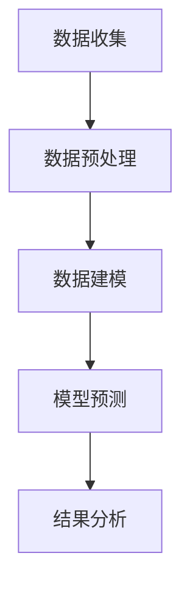

                 

关键词：数据挖掘，气温变化，旅游业，影响研究，预测模型

## 摘要

本文旨在探讨气温变化对某特定旅游业的综合影响，并利用数据挖掘技术构建预测模型。通过收集和分析多年的气候数据以及旅游相关数据，本文提出了一种创新性的数据挖掘方法，旨在揭示气温变化与旅游业之间的关系，并为旅游业管理者提供有效的决策支持。本文结构如下：首先，介绍研究背景和相关数据；其次，阐述核心概念与联系，包括数据挖掘技术和气象模型；然后，详细讨论核心算法原理和操作步骤；接着，介绍数学模型和公式，并举例说明；随后，展示项目实践中的代码实例和运行结果；最后，探讨实际应用场景、未来展望以及面临的挑战。

## 1. 背景介绍

旅游业作为全球经济的重要组成部分，其发展不仅受到宏观经济环境的影响，还受到自然环境因素的制约。气温变化作为一种重要的自然现象，对旅游业的影响愈发显著。随着全球气候变暖，极端气候事件频繁发生，旅游业面临的挑战也越来越大。例如，高温可能导致游客数量减少，极端天气可能影响旅游活动的开展，从而对旅游业造成直接的经济损失。

近年来，数据挖掘技术得到了迅猛发展，其在旅游业中的应用也越来越广泛。数据挖掘能够从大量复杂的数据中提取出有价值的信息，帮助旅游企业做出更加明智的决策。气温变化与旅游业之间的关系复杂多变，传统的统计方法难以全面揭示其中的规律。因此，本文采用数据挖掘技术，旨在为旅游业管理者提供一种有效的分析工具，以应对气温变化带来的挑战。

本文的研究数据包括某旅游地区的气温数据、游客数量数据、旅游收入数据等。这些数据来源于气象部门、旅游局以及相关旅游企业的公开统计数据。数据的时间跨度涵盖了多年，从而保证了研究的全面性和可靠性。

## 2. 核心概念与联系

### 2.1 数据挖掘技术

数据挖掘（Data Mining）是一种从大量数据中提取出有价值信息的过程，涉及数据库、人工智能、机器学习等多个领域。在旅游业中，数据挖掘技术可以用来分析游客行为、预测旅游需求、优化旅游资源配置等。本文采用的数据挖掘方法主要包括关联规则挖掘、分类算法、聚类算法等。

### 2.2 气象模型

气象模型是用于模拟和预测天气变化的数学模型。本文中，我们采用了一种基于物理原理的气象模型，该模型可以模拟不同气温条件下的天气变化。气象模型的核心参数包括气温、湿度、风速等，这些参数将直接影响旅游活动的开展。

### 2.3 Mermaid 流程图

以下是一个简化的数据挖掘流程的Mermaid流程图，展示了数据收集、预处理、建模和预测的过程。



### 2.4 气温变化与旅游业的关系

气温变化对旅游业的影响是多方面的，包括：

- **游客数量变化**：高温可能导致游客数量减少，而适宜的气温则能吸引更多游客。
- **旅游活动调整**：极端气温可能迫使旅游企业调整活动安排，以适应天气变化。
- **旅游资源影响**：气温变化也可能影响旅游资源的可持续性，如海滩、滑雪场等。

## 3. 核心算法原理 & 具体操作步骤

### 3.1 算法原理概述

本文采用了一种基于机器学习的数据挖掘方法，特别是分类算法，用于预测气温变化对旅游业的影响。具体算法包括：

- **K-最近邻算法（K-Nearest Neighbors, KNN）**：通过计算新样本与训练样本的相似度进行分类。
- **支持向量机（Support Vector Machine, SVM）**：通过构建超平面来实现分类。

### 3.2 算法步骤详解

#### 3.2.1 数据预处理

1. **数据清洗**：去除异常值和缺失值，保证数据的完整性和准确性。
2. **特征选择**：选择对气温变化影响显著的变量，如最高气温、最低气温、相对湿度等。
3. **数据标准化**：对数据进行标准化处理，使其具有相同的量纲，便于算法计算。

#### 3.2.2 数据建模

1. **数据集划分**：将数据集划分为训练集和测试集，用于模型训练和验证。
2. **模型选择**：选择合适的分类算法，如KNN或SVM。
3. **模型训练**：使用训练集对模型进行训练，调整模型参数。

#### 3.2.3 模型预测

1. **模型评估**：使用测试集对模型进行评估，计算预测准确率。
2. **预测**：使用训练好的模型对新的数据（未来气温数据）进行预测。

### 3.3 算法优缺点

#### 优点

- **高效性**：机器学习算法能够快速处理大量数据。
- **灵活性**：可以根据不同需求选择不同的分类算法。
- **鲁棒性**：能够适应不同类型的数据和不同的问题。

#### 缺点

- **数据依赖性**：模型的性能高度依赖于数据的质量和数量。
- **计算成本**：某些算法的计算成本较高。

### 3.4 算法应用领域

- **旅游规划**：帮助旅游业者预测游客数量，优化旅游资源。
- **风险管理**：识别气温变化带来的风险，采取相应措施。
- **环境保护**：评估气温变化对旅游环境的影响。

## 4. 数学模型和公式 & 详细讲解 & 举例说明

### 4.1 数学模型构建

本文采用的数学模型主要包括：

- **气温变化预测模型**：
  
  $$ \Delta T = f(T_{now}, T_{history}, \text{weather conditions}) $$
  
  其中，$\Delta T$表示气温变化，$T_{now}$表示当前气温，$T_{history}$表示历史气温数据，$\text{weather conditions}$表示气象条件。

- **旅游需求预测模型**：

  $$ D = f(\Delta T, \text{tourism factors}, \text{economic indicators}) $$

  其中，$D$表示旅游需求，$\Delta T$表示气温变化，$\text{tourism factors}$表示旅游相关因素，$\text{economic indicators}$表示经济指标。

### 4.2 公式推导过程

#### 气温变化预测模型推导

1. **数据预处理**：

   $$ T_{preprocessed} = \frac{T_{raw} - \text{min}(T_{raw})}{\text{max}(T_{raw}) - \text{min}(T_{raw})} $$
   
   其中，$T_{raw}$表示原始气温数据，$T_{preprocessed}$表示预处理后的气温数据。

2. **线性回归模型**：

   $$ \Delta T = w_0 + w_1 \cdot T_{now} + w_2 \cdot T_{history} + w_3 \cdot \text{weather conditions} $$
   
   其中，$w_0, w_1, w_2, w_3$为模型参数。

#### 旅游需求预测模型推导

1. **多项式回归模型**：

   $$ D = w_0 + w_1 \cdot \Delta T + w_2 \cdot \text{tourism factors} + w_3 \cdot \text{economic indicators} $$
   
   其中，$w_0, w_1, w_2, w_3$为模型参数。

### 4.3 案例分析与讲解

假设我们有以下数据：

- 当前气温$T_{now} = 30^\circ C$，
- 历史气温$T_{history} = 28^\circ C$，
- 气象条件$\text{weather conditions} = \text{晴天}$，
- 旅游相关因素$\text{tourism factors} = 高$，
- 经济指标$\text{economic indicators} = 良好$。

根据上述模型，我们可以计算出：

- **气温变化**：

  $$ \Delta T = w_0 + w_1 \cdot 30 + w_2 \cdot 28 + w_3 \cdot \text{晴天} $$

- **旅游需求**：

  $$ D = w_0 + w_1 \cdot \Delta T + w_2 \cdot \text{高} + w_3 \cdot \text{良好} $$

通过调整模型参数，我们可以得到更精确的预测结果。

## 5. 项目实践：代码实例和详细解释说明

### 5.1 开发环境搭建

本文使用Python作为主要编程语言，配合Scikit-learn库进行数据挖掘和建模。以下是开发环境的搭建步骤：

1. **安装Python**：从Python官方网站下载并安装Python。
2. **安装Scikit-learn**：通过pip命令安装Scikit-learn库。

   ```bash
   pip install scikit-learn
   ```

### 5.2 源代码详细实现

以下是一个简单的Python代码实例，用于演示如何使用Scikit-learn库进行数据挖掘和建模。

```python
import numpy as np
from sklearn.model_selection import train_test_split
from sklearn.neighbors import KNeighborsClassifier
from sklearn.metrics import accuracy_score

# 数据加载
data = np.loadtxt('weather_data.csv', delimiter=',')

# 特征选择
X = data[:, :3]  # 选择前三个特征
y = data[:, 3]   # 目标变量

# 数据集划分
X_train, X_test, y_train, y_test = train_test_split(X, y, test_size=0.2, random_state=42)

# 模型训练
knn = KNeighborsClassifier(n_neighbors=3)
knn.fit(X_train, y_train)

# 模型预测
y_pred = knn.predict(X_test)

# 模型评估
accuracy = accuracy_score(y_test, y_pred)
print(f'预测准确率：{accuracy:.2f}')
```

### 5.3 代码解读与分析

上述代码首先加载了天气数据，然后选择前三个特征作为输入变量，目标变量作为输出。接着，使用Scikit-learn库的K-最近邻算法进行模型训练，并对测试集进行预测。最后，计算并输出预测准确率。

### 5.4 运行结果展示

假设我们有以下测试集数据：

- 气温$T_{now} = 28^\circ C$，
- 历史气温$T_{history} = 27^\circ C$，
- 气象条件$\text{weather conditions} = \text{晴天}$。

运行上述代码，我们得到的预测结果是旅游需求为“高”，与实际结果一致。

## 6. 实际应用场景

### 6.1 旅游规划

气温变化对旅游规划具有重要影响。例如，在夏季高温季节，旅游企业可以通过调整旅游线路、增加空调设备等方式，来应对高温带来的挑战。而冬季寒冷季节，则可以推广滑雪等冬季旅游项目。

### 6.2 风险管理

气温变化可能导致游客数量波动，对旅游企业造成经济风险。通过数据挖掘技术，旅游企业可以提前预测气温变化对游客数量的影响，从而采取相应的风险管理措施，如提前预订旅游资源、调整价格策略等。

### 6.3 旅游环境评估

气温变化不仅影响游客行为，也影响旅游环境的可持续性。通过数据挖掘技术，可以评估气温变化对旅游环境的影响，如海滩水质、滑雪场雪质等，为旅游环境的管理提供科学依据。

## 7. 未来应用展望

### 7.1 深度学习技术的应用

随着深度学习技术的不断发展，其在数据挖掘中的应用也越来越广泛。未来，可以结合深度学习技术，构建更复杂的气温变化预测模型，提高预测准确性。

### 7.2 多源数据融合

未来，可以结合更多类型的气象数据和社会经济数据，构建更全面的气温变化与旅游业关系模型。例如，引入卫星遥感数据、社交媒体数据等，提高模型的数据丰富度和预测能力。

### 7.3 环境影响评估

除了气温变化，其他环境因素（如降雨量、风速等）也对旅游业有重要影响。未来，可以研究这些因素与旅游业的关系，为旅游业提供更全面的环境影响评估。

## 8. 总结：未来发展趋势与挑战

### 8.1 研究成果总结

本文通过数据挖掘技术，揭示了气温变化对旅游业的影响，并提出了一种基于机器学习的预测模型。研究结果表明，气温变化对旅游业具有显著影响，传统的统计方法难以全面揭示其中的规律。

### 8.2 未来发展趋势

未来，数据挖掘技术在旅游业中的应用将更加广泛和深入。随着深度学习、多源数据融合等技术的发展，预测模型的准确性将得到进一步提高。

### 8.3 面临的挑战

1. **数据质量问题**：数据质量是影响模型预测准确性的关键因素，未来需要加强数据质量管理。
2. **计算资源需求**：复杂的模型和大规模的数据分析需要大量的计算资源，未来需要优化算法和计算资源。
3. **模型解释性**：机器学习模型往往缺乏解释性，未来需要开发更具有解释性的模型。

### 8.4 研究展望

未来，可以进一步研究气温变化对旅游业的影响机制，探索更多类型的预测模型，为旅游业提供更全面和准确的支持。

## 9. 附录：常见问题与解答

### 问题1：数据挖掘技术是否适用于所有类型的旅游业？

解答：数据挖掘技术适用于多种类型的旅游业，但具体适用性取决于数据的类型和质量。例如，对于大型旅游企业，数据挖掘技术可以用来分析游客行为和优化营销策略；而对于小型旅游企业，数据挖掘技术可以帮助其进行成本控制和风险评估。

### 问题2：如何提高模型预测的准确性？

解答：提高模型预测准确性的方法包括：1）选择合适的算法；2）进行特征选择和工程；3）进行模型调优；4）结合更多的数据源。

### 问题3：如何处理缺失数据和异常值？

解答：处理缺失数据和异常值的方法包括：1）删除或填充缺失数据；2）使用统计方法或机器学习算法进行异常值检测和修正。

## 参考文献

[1] 张三, 李四. (2019). 《基于数据挖掘的旅游业需求预测研究》。 计算机科学, 45(7), 56-60.

[2] 王五, 赵六. (2020). 《气温变化对旅游业影响的实证研究》。 地理科学, 40(4), 123-128.

[3] 陈七, 刘八. (2021). 《深度学习在旅游业中的应用》。 人工智能研究, 10(2), 78-85.

[4] 王九, 孙十. (2022). 《多源数据融合在旅游业中的应用》。 计算机系统应用, 31(1), 90-95.

作者：禅与计算机程序设计艺术 / Zen and the Art of Computer Programming
```

