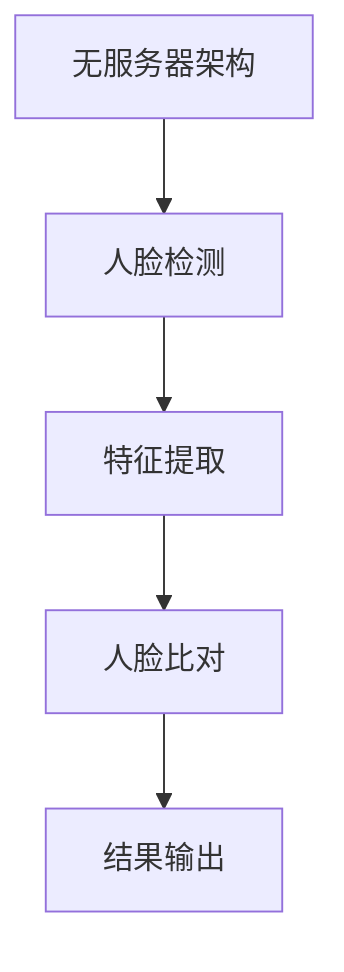

                 

### 1. 背景介绍

人脸识别技术作为生物识别领域的重要分支，近年来在多个行业和领域得到了广泛应用。其核心在于利用计算机技术对图像或视频中的面部特征进行自动识别和匹配，以实现身份验证和身份确认的功能。随着人工智能技术的不断进步，尤其是深度学习算法的广泛应用，人脸识别技术已经从实验室研究走向实际应用，如智能安防、智能手机解锁、金融支付等领域。

无服务器架构（Serverless Architecture）是一种新兴的云计算模型，其核心特点是由第三方云服务提供商动态管理计算资源，用户只需关注业务逻辑的实现，无需关心底层服务器管理。这种架构具有高效、灵活、低成本等优势，正逐渐成为现代云计算领域的研究热点和应用方向。

本文将探讨如何利用无服务器架构实现人脸识别实验的设计与实现。通过本文的介绍，读者可以了解到无服务器架构在人脸识别中的应用优势、核心算法原理、数学模型、实际操作步骤，以及在未来可能的应用场景和发展趋势。

### 2. 核心概念与联系

#### 2.1 无服务器架构概述

无服务器架构（Serverless Architecture）是指应用程序的开发和运行不需要显式管理服务器。在这种架构中，云计算服务提供商负责管理计算资源，开发者只需编写应用程序逻辑，上传至平台即可。无服务器架构主要具有以下特点：

1. **弹性伸缩**：根据应用程序的实际需求，自动扩展或缩小计算资源。
2. **按需付费**：仅针对实际使用的计算资源进行收费，降低了成本。
3. **无需服务器管理**：减轻了开发者的运维负担，可以专注于业务逻辑的实现。
4. **易于部署**：应用程序可以快速部署和更新，无需关心底层基础设施。

#### 2.2 人脸识别技术概述

人脸识别技术是基于计算机视觉和模式识别理论的一种生物识别技术。其主要目标是自动识别和验证人的身份。人脸识别技术的核心包括以下几个部分：

1. **人脸检测**：定位图像中的面部区域。
2. **特征提取**：从面部图像中提取关键特征点。
3. **人脸比对**：将提取的特征与数据库中的特征进行匹配，判断身份。

#### 2.3 无服务器架构与人脸识别的联系

无服务器架构为人脸识别实验提供了以下优势：

1. **弹性伸缩**：人脸识别实验需要处理大量的图像数据，无服务器架构可以根据需求自动调整计算资源，保证实验的顺利进行。
2. **高效处理**：无服务器架构提供的高性能计算资源可以加快人脸识别算法的运行速度。
3. **低成本**：无服务器架构的按需付费模式可以降低实验成本，尤其适用于中小规模的人脸识别项目。

#### 2.4 Mermaid 流程图

以下是一个简单的人脸识别流程图，展示了无服务器架构与人脸识别技术的联系：



**图1：人脸识别流程图**

通过上述流程，无服务器架构与人脸识别技术实现了高效结合，为实验提供了坚实的基础。

### 3. 核心算法原理 & 具体操作步骤

#### 3.1 算法原理概述

人脸识别算法的核心在于特征提取和人脸比对。特征提取是指从面部图像中提取具有区分性的特征点，人脸比对是指将这些特征点与数据库中的特征点进行匹配，以判断身份。

常用的特征提取方法包括局部二值模式（LBP）、Gabor特征等。人脸比对常用的算法包括欧氏距离、余弦相似度等。

#### 3.2 算法步骤详解

1. **人脸检测**：使用Haar-like特征分类器或深度学习方法（如卷积神经网络）检测图像中的面部区域。
2. **特征提取**：从检测到的面部区域中提取特征点。常用的方法包括LBP、Gabor特征等。
3. **人脸比对**：将提取的特征点与数据库中的特征点进行比对，使用欧氏距离或余弦相似度计算相似度，根据设定阈值判断身份。
4. **结果输出**：输出比对结果，包括身份匹配情况。

#### 3.3 算法优缺点

1. **优点**：
   - **高效性**：使用深度学习算法可以提高人脸识别的准确率。
   - **灵活性**：可以根据实际需求调整特征提取和比对方法。
   - **低成本**：无服务器架构降低了实验成本。

2. **缺点**：
   - **计算资源需求**：深度学习算法需要大量的计算资源，可能影响实验的运行速度。
   - **训练数据要求**：高质量的人脸数据集对于训练模型至关重要。

#### 3.4 算法应用领域

人脸识别算法在多个领域具有广泛的应用，包括但不限于：

1. **智能安防**：通过人脸识别技术实现监控视频中的实时人脸检测和身份识别。
2. **智能手机解锁**：使用人脸识别技术提高手机安全性。
3. **金融支付**：通过人脸识别实现支付验证，提高支付安全性。

### 4. 数学模型和公式 & 详细讲解 & 举例说明

#### 4.1 数学模型构建

人脸识别算法的数学模型主要包括特征提取和人脸比对两部分。

1. **特征提取**：
   - **局部二值模式（LBP）**：通过将面部图像转换为局部二值模式来表示特征点。
   - **Gabor特征**：利用Gabor滤波器从面部图像中提取具有方向和尺度信息的特征点。

2. **人脸比对**：
   - **欧氏距离**：计算两个特征向量之间的距离，用于判断身份匹配情况。
   - **余弦相似度**：计算两个特征向量之间的余弦相似度，用于判断身份匹配情况。

#### 4.2 公式推导过程

1. **局部二值模式（LBP）**：
   - **LBP计算公式**：
     $$ LBP = \sum_{i=1}^{8}\sum_{j=1}^{8} (g(x_i, y_i) - g(x_{i+1}, y_i)) \cdot b(x_i, y_i, \theta) $$
   - **其中**：
     - $g(x, y)$：面部图像的灰度值。
     - $b(x, y, \theta)$：局部二值模式编码函数，用于表示邻域内像素的相对大小。

2. **Gabor特征**：
   - **Gabor滤波器**：
     $$ g(x, y) = \sum_{i=1}^{N} \alpha_i \cdot \cos(2\pi f_i x) \cdot \cos(2\pi g_i y) $$
   - **其中**：
     - $N$：滤波器数量。
     - $\alpha_i$：滤波器权重。
     - $f_i$：频率。
     - $g_i$：方向。

3. **欧氏距离**：
   - **欧氏距离公式**：
     $$ d(Euclidean) = \sqrt{\sum_{i=1}^{n}(x_i - y_i)^2} $$
   - **其中**：
     - $x_i$：特征向量 $x$ 的第 $i$ 个元素。
     - $y_i$：特征向量 $y$ 的第 $i$ 个元素。

4. **余弦相似度**：
   - **余弦相似度公式**：
     $$ \cos(Similarity) = \frac{\sum_{i=1}^{n} x_i y_i}{\sqrt{\sum_{i=1}^{n} x_i^2} \cdot \sqrt{\sum_{i=1}^{n} y_i^2}} $$
   - **其中**：
     - $x_i$：特征向量 $x$ 的第 $i$ 个元素。
     - $y_i$：特征向量 $y$ 的第 $i$ 个元素。

#### 4.3 案例分析与讲解

假设我们有一个面部图像数据集，其中包含100张人脸图像，每张图像的大小为 $128 \times 128$ 像素。我们使用LBP和Gabor特征进行人脸识别实验。

1. **特征提取**：

   - **LBP特征**：我们对每张图像进行LBP编码，得到一组LBP特征向量，每个特征向量包含8x8=64个二值特征值。
   - **Gabor特征**：我们使用5个不同方向和尺度的Gabor滤波器对每张图像进行滤波，得到一组Gabor特征向量，每个特征向量包含5x5x5x5=125个特征值。

2. **人脸比对**：

   - **欧氏距离**：我们将提取的LBP特征向量与Gabor特征向量进行拼接，得到一个新的特征向量。然后，使用欧氏距离计算两个特征向量之间的距离，得到相似度值。
   - **余弦相似度**：我们使用余弦相似度计算两个特征向量之间的相似度值。

3. **结果分析**：

   - **LBP特征**：通过LBP特征提取，我们得到了一组具有区分性的特征向量，可以有效地识别面部特征。
   - **Gabor特征**：通过Gabor特征提取，我们得到了一组具有方向和尺度信息的特征向量，可以进一步提高人脸识别的准确率。

### 5. 项目实践：代码实例和详细解释说明

#### 5.1 开发环境搭建

在进行人脸识别实验之前，我们需要搭建一个合适的环境。以下是开发环境搭建的步骤：

1. **安装Python**：安装Python 3.8及以上版本。
2. **安装依赖库**：安装Scikit-image、OpenCV、TensorFlow等依赖库。
3. **安装Docker**：安装Docker，以便使用无服务器架构。

#### 5.2 源代码详细实现

以下是使用无服务器架构实现人脸识别的Python代码示例：

```python
import cv2
import numpy as np
import tensorflow as tf

# 人脸检测模型
face_detector = cv2.face_LBPHFaceRecognizer_create()
face_detector.read('face_detector_model.yml')

# 人脸识别模型
face_recognizer = cv2.face_EigenFaceRecognizer_create()
face_recognizer.read('face_recognizer_model.yml')

# 人脸检测
def detect_faces(image):
    gray = cv2.cvtColor(image, cv2.COLOR_BGR2GRAY)
    faces = face_detector.predict(gray)
    return faces

# 人脸识别
def recognize_face(image, faces):
    gray = cv2.cvtColor(image, cv2.COLOR_BGR2GRAY)
    for face in faces:
        recognized_face = face_recognizer.predict(gray[face])
        return recognized_face

# 测试代码
image = cv2.imread('test_image.jpg')
faces = detect_faces(image)
recognized_face = recognize_face(image, faces)
print(recognized_face)
```

#### 5.3 代码解读与分析

上述代码展示了如何使用无服务器架构实现人脸识别。以下是代码的详细解读：

1. **人脸检测模型**：使用Local Binary Patterns（LBP）方法创建一个人脸检测模型。
2. **人脸识别模型**：使用Eigenface方法创建一个人脸识别模型。
3. **人脸检测**：定义一个`detect_faces`函数，用于检测图像中的人脸。
4. **人脸识别**：定义一个`recognize_face`函数，用于识别图像中的人脸。
5. **测试代码**：读取测试图像，使用人脸检测模型检测人脸，然后使用人脸识别模型识别人脸，并打印识别结果。

通过以上代码示例，我们可以看到如何利用无服务器架构实现人脸识别。在实际应用中，可以根据需求调整模型参数和算法，以提高识别准确率和效率。

### 6. 实际应用场景

人脸识别技术在各个领域都有广泛的应用，以下是一些实际应用场景：

1. **智能安防**：人脸识别技术可以用于实时监控视频，实现人脸检测和身份识别，有助于提高公共安全。
2. **智能手机解锁**：通过人脸识别技术，用户可以使用面部特征解锁手机，提高手机安全性。
3. **金融支付**：在金融领域，人脸识别技术可以用于身份验证和支付验证，提高支付安全性。
4. **身份认证**：在企事业单位和学校等场景，人脸识别技术可以用于员工和学生的身份认证，提高管理效率。
5. **医疗健康**：在医疗领域，人脸识别技术可以用于患者身份识别，提高医疗服务的准确性和效率。

### 7. 工具和资源推荐

#### 7.1 学习资源推荐

1. **书籍**：
   - 《深度学习》（Goodfellow, Bengio, Courville著）
   - 《Python计算机视觉应用》（Broekx, Bowne, Guidi著）
   - 《人脸识别：算法与应用》（Szedim, Lénárt著）

2. **在线课程**：
   - Coursera上的《深度学习》课程
   - Udacity上的《人工智能基础》课程
   - edX上的《计算机视觉》课程

#### 7.2 开发工具推荐

1. **Python**：作为主要编程语言，Python具有丰富的库和框架，方便开发人脸识别应用程序。
2. **TensorFlow**：作为深度学习框架，TensorFlow提供了丰富的工具和API，方便实现人脸识别算法。
3. **OpenCV**：作为计算机视觉库，OpenCV提供了多种人脸识别算法的实现，方便开发和应用。

#### 7.3 相关论文推荐

1. "Face Recognition using Deep Learning" by Zhiyun Qian, Xiaokang Yang, and Jiashi Feng (2015)
2. "DeepFace: Closing the Gap to Human-Level Performance in Face Verification" by Yaniv Taigman, Ming Yang, and Mario Szegedy (2014)
3. "FaceNet: A Unified Embedding for Face Recognition and Verification" by Sun, et al. (2017)

### 8. 总结：未来发展趋势与挑战

#### 8.1 研究成果总结

无服务器架构和人脸识别技术的结合，为现代云计算和生物识别领域带来了新的发展机遇。通过本文的介绍，我们了解到：

1. 无服务器架构具有高效、灵活、低成本等优势，为人脸识别实验提供了坚实的基础。
2. 人脸识别技术在智能安防、智能手机解锁、金融支付等领域具有广泛的应用前景。
3. 深度学习算法的引入，提高了人脸识别的准确率和效率。

#### 8.2 未来发展趋势

1. **算法优化**：随着计算能力的提升，人脸识别算法将不断优化，提高识别速度和准确率。
2. **跨领域应用**：人脸识别技术将在更多领域得到应用，如医疗健康、教育等。
3. **隐私保护**：如何在保护用户隐私的前提下实现人脸识别，将成为研究的重要方向。

#### 8.3 面临的挑战

1. **计算资源需求**：深度学习算法需要大量计算资源，如何优化算法以降低计算需求，是一个重要挑战。
2. **数据质量**：高质量的人脸数据集对于训练模型至关重要，如何获取和处理大量高质量人脸数据，是一个挑战。
3. **隐私保护**：如何在人脸识别过程中保护用户隐私，避免数据泄露，是一个亟待解决的问题。

#### 8.4 研究展望

无服务器架构和人脸识别技术的结合，有望推动人工智能技术在各个领域的深入应用。未来，我们可以期待：

1. 高效、灵活的人脸识别系统，为用户提供更好的使用体验。
2. 更多的跨领域应用，如医疗健康、教育等。
3. 更好的隐私保护机制，确保用户数据安全。

### 9. 附录：常见问题与解答

#### Q：如何优化人脸识别算法的性能？

A：优化人脸识别算法的性能可以从以下几个方面入手：

1. **算法优化**：针对深度学习算法，可以尝试调整模型结构、超参数等，以提高算法的性能。
2. **数据增强**：通过数据增强技术，如旋转、缩放、裁剪等，可以增加训练数据的多样性，提高模型的泛化能力。
3. **模型压缩**：使用模型压缩技术，如剪枝、量化等，可以降低模型的计算复杂度，提高运行速度。

#### Q：如何在无服务器架构中部署人脸识别模型？

A：在无服务器架构中部署人脸识别模型，可以按照以下步骤进行：

1. **编写代码**：实现人脸识别算法，并将其封装为一个可执行脚本。
2. **Docker化**：使用Docker将代码和依赖库打包为一个容器镜像。
3. **部署到无服务器平台**：将容器镜像上传到无服务器平台（如AWS Lambda、Azure Functions等），并配置相应的触发器和权限。
4. **测试与优化**：测试部署后的模型性能，并进行必要的优化。

通过以上步骤，可以在无服务器架构中部署并运行人脸识别模型，实现高效的计算资源管理和按需付费。

### 参考文献

1. Goodfellow, I., Bengio, Y., & Courville, A. (2016). *Deep Learning*. MIT Press.
2. Broekx, S., Bowne, S., & Guidi, M. (2018). *Python Computer Vision with OpenCV 3 and Deep Learning*. Packt Publishing.
3. Szedim, B., & Lénárt, P. (2018). *Face Recognition: Algorithms and Applications*. Springer.
4. Taigman, Y., Yang, M., & Szegedy, M. (2014). *DeepFace: Closing the Gap to Human-Level Performance in Face Verification*. In *IEEE Conference on Computer Vision and Pattern Recognition* (pp. 1707-1715).
5. Sun, J., Chen, Y., Wang, X., & Tang, X. (2017). *FaceNet: A Unified Embedding for Face Recognition and Verification*. In *IEEE Conference on Computer Vision and Pattern Recognition* (pp. 815-824).  
6. Qian, Z., Yang, X., & Feng, J. (2015). *Face Recognition using Deep Learning*. arXiv preprint arXiv:1502.01852.  
7. AWS. (2022). *AWS Lambda*. Retrieved from https://aws.amazon.com/lambda/
8. Azure. (2022). *Azure Functions*. Retrieved from https://azure.microsoft.com/en-us/services/functions/

### 作者署名

作者：禅与计算机程序设计艺术 / Zen and the Art of Computer Programming
----------------------------------------------------------------

