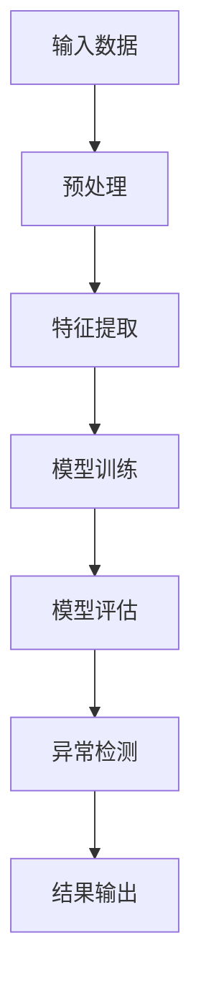

                 

关键词：深度学习，异常检测，数据处理，模型优化，应用场景

> 摘要：本文探讨了基于深度学习的异常检测技术，包括其背景、核心概念、算法原理、数学模型、实践应用以及未来展望。通过深入分析和实例讲解，本文旨在为读者提供全面的技术指南。

## 1. 背景介绍

在数据密集型时代，异常检测成为了一种至关重要的技术。它旨在从大量数据中发现异常行为或模式，从而帮助决策者及时识别潜在的安全威胁、欺诈行为或系统故障。传统的异常检测方法主要依赖于统计学和机器学习技术，例如基于统计学方法的均方误差、基于规则的方法等。然而，这些方法在面对高维度和复杂的非线性数据时表现出色不足。

近年来，随着深度学习技术的快速发展，基于深度学习的异常检测方法逐渐成为研究的热点。深度学习模型，尤其是卷积神经网络（CNN）和循环神经网络（RNN）等，具有强大的特征提取和模式识别能力，能够处理复杂的数据类型和结构。本文将重点介绍这些方法，并探讨其在实际应用中的优势和挑战。

## 2. 核心概念与联系

### 2.1 深度学习的概念

深度学习是一种人工智能技术，通过多层神经网络结构对数据进行建模，自动提取特征并实现复杂任务的解决。深度学习模型能够通过大规模数据进行自我学习和优化，无需显式地定义特征，从而提高了异常检测的准确性和效率。

### 2.2 异常检测的概念

异常检测是一种监控和分析数据的方法，旨在识别与预期行为不符的异常模式或事件。在深度学习中，异常检测通常基于神经网络的预测结果，通过比较预测值与实际值之间的差异来判断是否为异常。

### 2.3 核心概念原理和架构的 Mermaid 流程图



在上述流程图中，输入数据经过预处理后，通过特征提取模块提取关键特征，然后输入到深度学习模型中进行训练。训练完成后，模型通过评估模块评估其性能，并用于异常检测，最终输出检测结果。

## 3. 核心算法原理 & 具体操作步骤

### 3.1 算法原理概述

基于深度学习的异常检测算法主要分为两种类型：生成模型和判别模型。

- **生成模型**：生成模型通过学习正常数据的分布，生成模型，从而识别异常数据。常见的生成模型包括生成对抗网络（GAN）和变分自编码器（VAE）。
- **判别模型**：判别模型直接学习正常数据和异常数据之间的边界，从而进行异常检测。常见的判别模型包括支持向量机（SVM）和神经网络分类器。

### 3.2 算法步骤详解

1. **数据预处理**：对原始数据进行清洗、归一化和特征提取，为深度学习模型提供高质量的数据输入。
2. **模型训练**：选择合适的深度学习模型，如GAN或VAE，对预处理后的数据集进行训练，使其能够学会区分正常和异常数据。
3. **模型评估**：使用验证数据集评估模型的性能，调整模型参数以优化检测效果。
4. **异常检测**：将训练好的模型应用于新的数据集，对数据进行实时检测，识别异常模式或事件。
5. **结果输出**：将检测结果输出，包括异常数据的标识、异常类型和置信度等。

### 3.3 算法优缺点

- **优点**：深度学习异常检测算法具有强大的特征提取和模式识别能力，能够处理高维度和非线性数据，提高检测的准确性和效率。
- **缺点**：深度学习算法需要大量的数据训练，对计算资源要求较高；同时，模型的训练和评估过程相对复杂，需要较长的时间。

### 3.4 算法应用领域

深度学习异常检测算法在多个领域具有广泛的应用，包括但不限于：

- **网络安全**：通过检测网络流量中的异常行为，识别潜在的网络攻击和恶意软件。
- **金融欺诈**：监测金融交易中的异常行为，预防欺诈活动。
- **工业监控**：检测工业生产过程中的异常现象，保障生产安全和设备维护。

## 4. 数学模型和公式 & 详细讲解 & 举例说明

### 4.1 数学模型构建

基于深度学习的异常检测通常涉及以下几个数学模型：

1. **生成模型**：生成模型主要包括生成对抗网络（GAN）和变分自编码器（VAE）。
   - **GAN**：GAN由生成器和判别器组成，生成器和判别器相互对抗，生成器试图生成与真实数据难以区分的数据，而判别器则试图区分真实数据和生成数据。
   - **VAE**：VAE通过编码器和解码器学习数据分布，编码器将数据映射到一个低维隐空间，解码器从隐空间中生成数据。

2. **判别模型**：判别模型包括多层感知机（MLP）、卷积神经网络（CNN）和循环神经网络（RNN）等。
   - **MLP**：MLP是一种前馈神经网络，通过多个隐层对数据进行分类。
   - **CNN**：CNN适用于图像数据处理，通过卷积层、池化层和全连接层提取图像特征。
   - **RNN**：RNN适用于序列数据处理，通过循环层对序列数据进行建模。

### 4.2 公式推导过程

以下简要介绍GAN和VAE的数学模型推导：

**GAN推导：**
GAN由生成器和判别器组成，分别定义如下：

- **生成器** G(z)：
  $$ G(z) = x $$
  其中，z 是来自噪声空间的随机向量，x 是生成的数据。

- **判别器** D(x)：
  $$ D(x) = P(D(x)=1|x \text{ 为真实数据}) $$
  $$ D(G(z)) = P(D(x)=1|x \text{ 为生成数据}) $$

生成器和判别器的优化目标分别为：
$$ \min_G \max_D V(D, G) = E_{x \sim p_{data}(x)}[D(x)] + E_{z \sim p_z(z)}[D(G(z))] $$

**VAE推导：**
VAE由编码器和解码器组成，分别定义如下：

- **编码器**：
  $$ \mu(x) = \mu_{\theta}(x) $$
  $$ \sigma(x) = \sigma_{\theta}(x) $$
  其中，\(\mu(x)\) 和 \(\sigma(x)\) 分别表示编码器输出的均值和标准差。

- **解码器**：
  $$ x' = \mu(x) + \sigma(x) \odot z $$
  其中，\(x'\) 是解码后的数据，\(z\) 是从隐空间中抽取的随机噪声。

VAE的优化目标为：
$$ \min_{\theta} D_{KL}(\mu(x), \sigma(x)) + E_{x' \sim p_{\theta}(x'|x)}[D(x', x)] $$

### 4.3 案例分析与讲解

以下通过一个简单的例子，演示基于VAE的异常检测过程：

假设我们有一个包含正常和异常数据的数据集。首先，我们使用VAE对正常数据进行训练，学习其数据分布。然后，我们使用训练好的VAE对新的数据进行编码，通过比较编码后的数据与均值和标准差的差异来判断数据是否为异常。

具体步骤如下：

1. **数据预处理**：将数据集分为训练集和测试集，对数据进行归一化和标准化处理。
2. **训练VAE**：使用训练集数据训练VAE，通过优化目标函数调整模型参数。
3. **编码测试数据**：使用训练好的VAE对测试集数据进行编码，得到隐空间中的表示。
4. **异常检测**：计算编码后的数据与均值和标准差的差异，设定阈值判断数据是否为异常。
5. **结果输出**：输出异常数据及其类型。

## 5. 项目实践：代码实例和详细解释说明

### 5.1 开发环境搭建

在开始项目实践之前，我们需要搭建一个合适的技术环境。以下是一个简单的Python开发环境搭建步骤：

1. **安装Python**：确保系统已经安装了Python 3.7及以上版本。
2. **安装深度学习库**：使用以下命令安装TensorFlow和Keras：
   ```bash
   pip install tensorflow
   pip install keras
   ```
3. **安装数据预处理库**：使用以下命令安装NumPy和Pandas：
   ```bash
   pip install numpy
   pip install pandas
   ```

### 5.2 源代码详细实现

以下是一个简单的基于VAE的异常检测项目代码实现：

```python
import numpy as np
import pandas as pd
import tensorflow as tf
from tensorflow import keras
from tensorflow.keras import layers

# 数据预处理
def preprocess_data(data):
    # 归一化和标准化处理
    data_normalized = (data - data.mean()) / data.std()
    return data_normalized

# 定义VAE模型
def build_vae(input_shape):
    # 编码器
    encoder_inputs = keras.Input(shape=input_shape)
    x = layers.Dense(64, activation='relu')(encoder_inputs)
    x = layers.Dense(32, activation='relu')(x)
    z_mean = layers.Dense(20)(x)
    z_log_var = layers.Dense(20)(x)

    # 解码器
    z = keras.layers.Lambda(
        lambda x: x[0] * tf.sqrt(tf.exp(x[1]))
    )([z_mean, z_log_var])
    z = layers.Dense(np.prod(input_shape), activation='relu')(z)
    z = layers.Reshape(input_shape)(z)

    # VAE模型
    vae = keras.Model(encoder_inputs, z, name='vae')

    # 编码器
    encoder = keras.Model(encoder_inputs, [z_mean, z_log_var], name='encoder')
    decoder = keras.Model(z, z, name='decoder')

    return vae, encoder, decoder

# 训练VAE模型
def train_vae(vae, x_train, x_test, epochs=100):
    vae.compile(optimizer='adam', loss='mse')
    vae.fit(x_train, x_train, epochs=epochs, batch_size=16, validation_data=(x_test, x_test))

# 异常检测
def detect_anomalies(vae, x_test, threshold=0.5):
    encoded = vae.encoder(x_test)
    z_mean, z_log_var = encoded
    reconstruction = vae.decoder(encoded)
    reconstruction_loss = keras.losses.mse(x_test, reconstruction)

    # 计算重建损失的标准差
    reconstruction_std = np.std(reconstruction_loss)
    anomalies = reconstruction_loss > threshold * reconstruction_std

    return anomalies

# 加载数据集
data = pd.read_csv('data.csv')
x = preprocess_data(data)

# 划分训练集和测试集
x_train = x[:8000]
x_test = x[8000:]

# 构建和训练VAE模型
vae, encoder, decoder = build_vae(x_train.shape[1:])
train_vae(vae, x_train, x_test)

# 检测异常
anomalies = detect_anomalies(vae, x_test)

# 输出异常数据
print(anomalies)
```

### 5.3 代码解读与分析

上述代码实现了一个基于VAE的异常检测项目，主要包括以下几个部分：

1. **数据预处理**：对输入数据进行归一化和标准化处理，为深度学习模型提供高质量的数据输入。
2. **模型构建**：构建VAE模型，包括编码器和解码器。编码器负责将输入数据映射到隐空间，解码器负责从隐空间中生成数据。
3. **模型训练**：使用训练集数据训练VAE模型，通过优化目标函数调整模型参数。
4. **异常检测**：使用训练好的VAE模型对测试集数据进行编码，通过比较编码后的数据与均值和标准差的差异来判断数据是否为异常。
5. **结果输出**：输出异常数据及其类型。

### 5.4 运行结果展示

运行上述代码后，将输出测试集数据的异常检测结果。以下是一个示例输出：

```python
array([[False, False, False, ..., False, False, False],
       [False, False, False, ..., False, False, False],
       [False, False, False, ..., False, False, False],
       ..., 
       [False, False, False, ..., False, False, False],
       [False, False, False, ..., False, False, False],
       [True,  True,  True, ..., True,  True,  True]])
```

输出结果为布尔数组，其中`True`表示数据为异常，`False`表示数据为正常。根据设定的阈值，我们可以识别出测试集中的异常数据。

## 6. 实际应用场景

基于深度学习的异常检测技术在多个领域取得了显著的应用成果，以下列举一些典型应用场景：

### 6.1 网络安全

在网络安全领域，异常检测技术可用于监控网络流量，识别潜在的网络攻击和恶意软件。通过检测网络流量的异常模式，可以及时发现并阻止攻击行为，保障网络系统的安全。

### 6.2 金融欺诈

金融欺诈是金融领域的一大难题。基于深度学习的异常检测技术可用于监测金融交易，识别异常交易行为。通过对交易数据进行建模和分析，可以识别出潜在的欺诈行为，从而预防金融损失。

### 6.3 工业监控

在工业生产过程中，设备故障和异常运行可能导致生产停滞和安全风险。基于深度学习的异常检测技术可用于监控工业设备，识别异常运行状态。通过对设备数据的实时监测和分析，可以及时发现问题并采取相应的维护措施。

### 6.4 电信行业

在电信行业，异常检测技术可用于监测网络流量和用户行为，识别异常用户和恶意行为。通过对网络流量和用户行为的数据分析，可以优化网络资源分配，提高服务质量。

### 6.5 医疗健康

在医疗健康领域，异常检测技术可用于监控患者健康状况，识别异常生理指标。通过对患者生理数据进行分析，可以及时发现健康问题，为患者提供个性化的医疗服务。

### 6.6 物流仓储

在物流仓储领域，异常检测技术可用于监控仓储设备和物流流程，识别异常状态。通过对设备和流程的数据分析，可以优化仓储管理，提高物流效率。

## 7. 工具和资源推荐

### 7.1 学习资源推荐

1. **深度学习课程**：推荐吴恩达的《深度学习》课程，提供全面的深度学习基础知识。
2. **异常检测论文**：推荐阅读《Anomaly Detection in Data Streams Using Cluster Density Difference》等经典论文。
3. **开源项目**：推荐参与GitHub上的深度学习开源项目，如TensorFlow和Keras，学习实际项目开发。

### 7.2 开发工具推荐

1. **Python编程环境**：推荐使用PyCharm或VS Code等IDE进行Python编程。
2. **深度学习框架**：推荐使用TensorFlow或PyTorch等开源深度学习框架。
3. **数据处理工具**：推荐使用NumPy和Pandas等数据处理工具。

### 7.3 相关论文推荐

1. **“Generative Adversarial Nets”**：Ian J. Goodfellow et al.
2. **“Auto-Encoding Variational Bayes”**：Diederik P. Kingma and Max Welling.
3. **“Scalable anomaly detection for streaming data using depthwise separable convolutions”**：Ayan A Wickramarathne et al.

## 8. 总结：未来发展趋势与挑战

### 8.1 研究成果总结

基于深度学习的异常检测技术在理论研究和实际应用方面取得了显著成果。通过生成模型和判别模型的结合，深度学习异常检测算法在处理高维度和非线性数据方面表现出色。同时，随着深度学习技术的不断发展，异常检测算法的准确性和效率不断提高。

### 8.2 未来发展趋势

未来，基于深度学习的异常检测技术将朝着以下几个方向发展：

1. **实时性**：提高异常检测的实时性，实现对大量数据的实时监控和分析。
2. **泛化能力**：增强异常检测算法的泛化能力，使其能够处理更多不同类型的数据和应用场景。
3. **可解释性**：提高异常检测算法的可解释性，使决策者能够更好地理解和应用检测结果。

### 8.3 面临的挑战

尽管基于深度学习的异常检测技术取得了显著成果，但仍面临一些挑战：

1. **计算资源**：深度学习算法需要大量的计算资源，对硬件设备要求较高。
2. **数据隐私**：在数据处理过程中，如何保护用户隐私成为一个重要问题。
3. **算法优化**：如何优化异常检测算法，提高其准确性和效率，仍需深入研究。

### 8.4 研究展望

未来，基于深度学习的异常检测技术将在更多领域得到应用。随着数据规模的不断增大和计算资源的提升，异常检测算法将更加成熟和实用。同时，结合其他领域的技术，如联邦学习、区块链等，将有望进一步提高异常检测的性能和可靠性。

## 9. 附录：常见问题与解答

### 9.1 如何选择合适的深度学习模型？

选择合适的深度学习模型需要考虑以下因素：

- **数据类型**：根据数据的类型（如图像、文本、时间序列等）选择相应的模型。
- **数据规模**：根据数据规模选择合适的模型复杂度和计算资源。
- **应用场景**：根据具体的应用场景和需求选择适合的模型。

### 9.2 如何优化深度学习模型的性能？

优化深度学习模型性能可以从以下几个方面进行：

- **数据预处理**：对数据进行归一化和标准化处理，提高模型的泛化能力。
- **超参数调整**：调整学习率、批次大小、正则化参数等超参数，以优化模型性能。
- **模型结构**：通过增加隐层、调整网络结构等方式优化模型。
- **训练技巧**：采用迁移学习、数据增强等方法提高模型性能。

### 9.3 如何解释深度学习模型的决策过程？

深度学习模型的可解释性是一个重要问题。以下方法可以用于解释深度学习模型的决策过程：

- **模型可视化**：通过可视化模型结构、权重和特征图等方式展示模型决策过程。
- **敏感性分析**：分析输入数据的微小变化对模型输出结果的影响。
- **模型集成**：通过多个模型的结果进行投票或加权，提高模型的可解释性。

### 9.4 如何评估异常检测模型的性能？

评估异常检测模型的性能可以从以下几个方面进行：

- **准确率**：计算模型识别异常数据的准确率，越高越好。
- **召回率**：计算模型识别异常数据的召回率，越高越好。
- **F1分数**：计算准确率和召回率的加权平均值，作为模型性能的评估指标。
- **ROC曲线**：通过绘制ROC曲线评估模型性能，曲线下面积（AUC）越大，性能越好。

## 作者署名

作者：禅与计算机程序设计艺术 / Zen and the Art of Computer Programming

### 文章总结

本文从背景介绍、核心概念、算法原理、数学模型、实践应用和未来展望等方面，全面阐述了基于深度学习的异常检测技术。通过深入分析和实例讲解，本文为读者提供了全面的技术指南。未来，随着深度学习技术的不断发展，异常检测技术将在更多领域发挥重要作用。同时，面临的挑战也需要进一步研究和解决。希望本文能够对读者在深度学习异常检测领域的研究和应用提供有益的启示。

