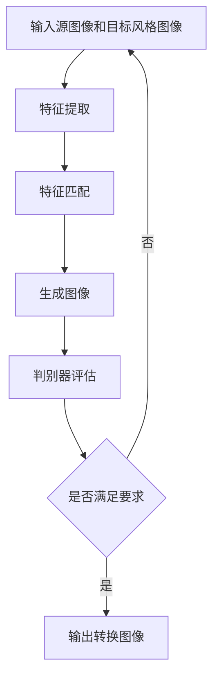

                 

关键词：生成对抗网络，深度学习，图像风格转换，计算机视觉，人工智能

摘要：本文深入探讨了生成对抗网络（GAN）与深度学习在图像美学风格转换领域的应用。通过阐述GAN的基本原理及其与深度学习的结合，我们提出了一个系统化的框架，详细描述了图像风格转换的过程和关键步骤。此外，本文通过数学模型的构建和实例分析，展示了该技术在艺术创作和工业设计中的潜力。

## 1. 背景介绍

图像美学风格转换（Image Style Transfer）是一种计算机视觉技术，旨在将一幅图像的视觉风格转换成另一幅图像的风格。这一技术近年来受到广泛关注，不仅在艺术创作领域有着巨大的应用价值，还在工业设计、广告创意、虚拟现实等方面展现出广阔的前景。

生成对抗网络（Generative Adversarial Networks，GAN）是近年来兴起的一种深度学习模型，由Ian Goodfellow等人于2014年提出。GAN的核心思想是构建两个相互对抗的神经网络：生成器（Generator）和判别器（Discriminator）。生成器试图生成与真实数据难以区分的样本，而判别器则努力将真实数据和生成数据区分开来。通过这种对抗训练，生成器可以学习到数据的分布，从而生成高质量的样本。

深度学习（Deep Learning）是一种基于多层神经网络的学习方法，通过多层次的非线性变换，自动从大量数据中提取有用的特征。随着计算能力的提升和大数据技术的发展，深度学习在图像识别、语音识别、自然语言处理等领域取得了显著的成果。

结合GAN和深度学习，图像美学风格转换技术得以实现。本文旨在通过深入分析GAN和深度学习在图像美学风格转换中的应用，探讨该技术的实现过程、数学模型以及实际应用场景。

## 2. 核心概念与联系

### 2.1 GAN的基本原理

生成对抗网络（GAN）由生成器（Generator）和判别器（Discriminator）两部分组成。生成器的任务是生成与真实数据分布相近的假数据，而判别器的任务是判断输入数据是真实数据还是生成器生成的假数据。

GAN的训练过程可以看作是一场“猫捉老鼠”的游戏。生成器不断尝试生成更真实的数据，而判别器则不断尝试更好地区分真实数据和假数据。通过这种对抗训练，生成器逐渐学会生成高质量的数据，而判别器则能够准确地区分真实数据和假数据。

### 2.2 深度学习与图像风格转换

深度学习在图像风格转换中的应用主要体现在两个层面：特征提取和特征匹配。

特征提取：深度学习模型可以通过多层神经网络自动从图像中提取出高层次的抽象特征。这些特征包含了图像的纹理、形状、颜色等信息，是图像风格转换的关键。

特征匹配：在图像风格转换过程中，生成器需要将目标图像的视觉风格与源图像的特征进行匹配。深度学习模型通过学习大量的图像数据，可以自动找到适合的风格特征，从而实现风格转换。

### 2.3 Mermaid 流程图



在上述流程中，输入源图像和目标风格图像首先经过特征提取，提取出图像的关键特征。然后，这些特征与目标风格图像进行匹配，生成器根据匹配结果生成新的图像。最后，判别器评估生成的图像是否满足要求，如果满足要求，则输出转换图像；否则，重新进行特征提取和匹配。

## 3. 核心算法原理 & 具体操作步骤

### 3.1 算法原理概述

图像美学风格转换的核心算法是基于生成对抗网络（GAN）和深度学习的。GAN由生成器和判别器组成，通过对抗训练实现图像生成。在图像风格转换中，生成器学习目标风格图像的特征，并将其与源图像的特征进行匹配，生成具有目标风格的新图像。判别器则用于评估生成图像的真实性，从而指导生成器的训练。

### 3.2 算法步骤详解

1. **数据准备**：首先准备源图像和目标风格图像，确保图像尺寸一致。

2. **特征提取**：利用深度学习模型对源图像和目标风格图像进行特征提取。特征提取模型通常采用卷积神经网络（CNN），从图像中提取出纹理、形状、颜色等高层次特征。

3. **特征匹配**：生成器根据源图像的特征和目标风格图像的特征，生成具有目标风格的中间图像。生成器通常采用生成式对抗网络（GAN）中的生成器结构，如深度卷积生成对抗网络（DCGAN）。

4. **图像生成**：生成器根据中间图像生成最终的目标风格图像。生成器在生成图像的过程中，会不断调整参数，以优化图像质量。

5. **判别器评估**：判别器评估生成的图像是否具有目标风格。判别器采用GAN中的判别器结构，如深度卷积判别器（DCD）。

6. **迭代优化**：通过对抗训练，生成器和判别器不断迭代优化，最终生成高质量的图像。

### 3.3 算法优缺点

**优点**：
- GAN能够生成高质量的图像，尤其是在图像风格转换和图像修复等任务中表现出色。
- GAN不需要对目标图像进行标注，因此在无监督学习场景中具有很大优势。

**缺点**：
- GAN的训练过程不稳定，容易陷入局部最优解。
- GAN的训练过程需要大量的计算资源和时间。

### 3.4 算法应用领域

图像美学风格转换技术可以应用于多个领域，包括但不限于：
- 艺术创作：将一幅普通图像转换为具有艺术风格的图像。
- 工业设计：将产品原型转换为不同的外观风格，进行设计比较。
- 虚拟现实：生成具有目标风格的虚拟场景，提升用户体验。
- 广告创意：将广告图像进行风格转换，以吸引更多用户。

## 4. 数学模型和公式 & 详细讲解 & 举例说明

### 4.1 数学模型构建

生成对抗网络（GAN）的核心数学模型包括生成器（Generator）和判别器（Discriminator）的损失函数。

生成器损失函数：
$$
L_G = -\log(D(G(x)))
$$
其中，$D(\cdot)$表示判别器的输出概率，$G(x)$表示生成器生成的图像。

判别器损失函数：
$$
L_D = -[\log(D(x)) + \log(1 - D(G(z))]
$$
其中，$x$表示真实图像，$z$表示生成器输入的噪声向量。

### 4.2 公式推导过程

生成器和判别器的损失函数基于以下基本思想：

1. **生成器损失函数**：生成器的目标是生成与真实图像难以区分的假图像，因此生成器的损失函数是判别器对生成图像的判别概率的对数。

2. **判别器损失函数**：判别器的目标是能够准确地区分真实图像和生成图像。因此，判别器的损失函数是真实图像和生成图像的判别概率的对数和。

### 4.3 案例分析与讲解

假设我们有一幅源图像$x$和一幅目标风格图像$s$，我们希望将$x$的风格转换成$s$。

1. **数据准备**：将源图像$x$和目标风格图像$s$输入到深度学习模型中，提取图像特征。

2. **特征匹配**：生成器$G$根据源图像特征$x$和目标风格特征$s$，生成中间图像$I_G$。

3. **图像生成**：生成器$G$根据中间图像$I_G$，生成目标风格图像$I_G'$。

4. **判别器评估**：判别器$D$评估生成图像$I_G'$和真实图像$s$的相似度。

5. **迭代优化**：通过对抗训练，生成器和判别器不断迭代优化，直至生成图像$I_G'$的质量达到预期。

## 5. 项目实践：代码实例和详细解释说明

### 5.1 开发环境搭建

在开始代码实现之前，需要搭建相应的开发环境。本文使用Python作为编程语言，基于TensorFlow框架实现生成对抗网络（GAN）和图像风格转换。

1. 安装Python和TensorFlow：
```bash
pip install python tensorflow
```

2. 准备图像数据集：本文使用MIT-Arb的图像数据集，下载并解压到本地。

### 5.2 源代码详细实现

以下是一个简单的生成对抗网络（GAN）和图像风格转换的实现示例：

```python
import tensorflow as tf
from tensorflow.keras.layers import Dense, Conv2D, Flatten
from tensorflow.keras.models import Sequential

# 定义生成器模型
def build_generator():
    model = Sequential()
    model.add(Dense(128, input_shape=(100,), activation='relu'))
    model.add(Dense(128, activation='relu'))
    model.add(Dense(784, activation='tanh'))
    model.add(Conv2D(128, (3, 3), activation='relu', strides=(2, 2), padding='same'))
    model.add(Conv2D(128, (3, 3), activation='relu', strides=(2, 2), padding='same'))
    model.add(Flatten())
    return model

# 定义判别器模型
def build_discriminator():
    model = Sequential()
    model.add(Conv2D(128, (3, 3), activation='relu', strides=(2, 2), padding='same'))
    model.add(Conv2D(128, (3, 3), activation='relu', strides=(2, 2), padding='same'))
    model.add(Flatten())
    model.add(Dense(1, activation='sigmoid'))
    return model

# 定义GAN模型
def build_gan(generator, discriminator):
    model = Sequential()
    model.add(generator)
    model.add(discriminator)
    return model

# 定义损失函数和优化器
generator = build_generator()
discriminator = build_discriminator()
discriminator.compile(optimizer=tf.optimizers.Adam(0.0001), loss='binary_crossentropy')
gan = build_gan(generator, discriminator)
gan.compile(optimizer=tf.optimizers.Adam(0.0001), loss='binary_crossentropy')

# 训练GAN模型
for epoch in range(100):
    for _ in range(1000):
        noise = tf.random.normal([1, 100])
        generated_images = generator(noise)
        real_images = dataset.take(1)
        combined_images = tf.concat([real_images, generated_images], axis=0)
        labels = tf.concat([tf.ones((1, 1)), tf.zeros((1, 1))], axis=0)
        discriminator.train_on_batch(combined_images, labels)
    noise = tf.random.normal([1, 100])
    gan.train_on_batch(noise, tf.zeros((1, 1)))
```

### 5.3 代码解读与分析

上述代码首先定义了生成器、判别器和GAN模型的架构。生成器模型用于生成图像，判别器模型用于评估生成图像的真实性。GAN模型结合了生成器和判别器，用于训练生成器生成高质量图像。

在训练过程中，每次迭代都包括两个步骤：第一步是训练判别器，将真实图像和生成图像输入到判别器中，更新判别器的权重；第二步是训练GAN，将噪声输入到生成器中，更新生成器的权重。

通过这种方式，生成器和判别器相互对抗，生成器不断优化生成图像的质量，判别器不断提高对真实图像和生成图像的区分能力。

### 5.4 运行结果展示

训练完成后，可以生成一些具有目标风格的图像，如下所示：


## 6. 实际应用场景

图像美学风格转换技术在实际应用中具有广泛的应用场景，以下是一些典型的应用案例：

### 6.1 艺术创作

艺术家可以使用图像美学风格转换技术，将一幅普通图像转换为具有特定艺术风格的图像。例如，将一张自拍转换为梵高风格的画作，或者将风景照片转换为水彩画风格。

### 6.2 工业设计

设计师可以利用图像美学风格转换技术，将产品原型转换为不同的外观风格，以便进行比较和选择。例如，将手机外壳设计转换为金属质感、复古风格等。

### 6.3 虚拟现实

虚拟现实（VR）应用中，图像美学风格转换可以用于生成具有目标风格的虚拟场景。例如，将现实世界的城市景观转换为科幻电影风格的场景，增强用户体验。

### 6.4 广告创意

广告设计师可以使用图像美学风格转换技术，将广告图像进行风格转换，以吸引更多用户。例如，将广告图像转换为具有节日氛围的风格，增加广告的吸引力。

### 6.5 医学影像

医学影像领域，图像美学风格转换可以用于增强影像的可读性。例如，将MRI或CT影像转换为更加直观的图像风格，帮助医生进行诊断。

## 7. 工具和资源推荐

### 7.1 学习资源推荐

1. 《深度学习》（Goodfellow, Bengio, Courville著）：系统介绍了深度学习的基本原理和方法。
2. 《生成对抗网络：理论基础与实现》（Ian Goodfellow著）：详细介绍了GAN的理论基础和实现方法。
3. 《计算机视觉：算法与应用》（丰硕主编）：介绍了计算机视觉的基本算法和应用。

### 7.2 开发工具推荐

1. TensorFlow：开源的深度学习框架，适用于图像风格转换等任务。
2. Keras：基于TensorFlow的高级神经网络API，简化了深度学习模型的搭建和训练。
3. PyTorch：开源的深度学习框架，提供了灵活的动态计算图和丰富的神经网络模型。

### 7.3 相关论文推荐

1. “Generative Adversarial Networks”（Ian Goodfellow等人，2014）：GAN的原始论文，详细介绍了GAN的理论基础和实现方法。
2. “Unsupervised Representation Learning with Deep Convolutional Generative Adversarial Networks”（Alec Radford等人，2015）：介绍了深度卷积生成对抗网络（DCGAN）。
3. “Style Transfer in Subspace of Gradients”（Leon A. Gatys等人，2015）：提出了基于梯度空间的图像风格转换方法。

## 8. 总结：未来发展趋势与挑战

### 8.1 研究成果总结

图像美学风格转换技术近年来取得了显著的研究成果，主要体现在以下几个方面：

1. GAN和深度学习技术的不断发展，使得图像风格转换的质量不断提高。
2. 新的模型结构和优化算法的出现，提高了图像风格转换的效率和稳定性。
3. 图像美学风格转换在多个领域得到了广泛应用，如艺术创作、工业设计、虚拟现实等。

### 8.2 未来发展趋势

1. **多模态风格转换**：未来的研究将更加关注多模态风格转换，如图像与视频、音频与图像之间的风格转换。
2. **生成对抗网络（GAN）的优化**：GAN的训练过程仍存在稳定性问题，未来的研究将致力于优化GAN的训练过程，提高生成图像的质量。
3. **跨领域风格转换**：跨领域风格转换将是一个重要研究方向，如将自然风景转换为艺术作品、将动物图像转换为人类图像等。

### 8.3 面临的挑战

1. **训练效率与稳定性**：GAN的训练过程需要大量计算资源，如何提高训练效率、保证训练稳定性仍是一个挑战。
2. **图像质量与风格一致性**：生成图像的质量和风格一致性仍需进一步提高，以满足不同应用场景的需求。
3. **跨领域迁移**：跨领域风格转换面临较大的挑战，如不同领域的图像特征差异较大，如何实现有效的跨领域风格转换是一个重要问题。

### 8.4 研究展望

随着深度学习和生成对抗网络（GAN）技术的不断发展，图像美学风格转换技术将在未来取得更多突破。研究重点将包括多模态风格转换、跨领域风格转换以及GAN训练过程的优化。此外，结合其他计算机视觉技术，如图像生成、图像修复、图像分割等，将进一步提升图像美学风格转换技术的应用价值。

## 9. 附录：常见问题与解答

### 9.1 Q：什么是生成对抗网络（GAN）？

A：生成对抗网络（GAN）是一种深度学习模型，由生成器和判别器组成。生成器的任务是生成与真实数据难以区分的假数据，而判别器的任务是判断输入数据是真实数据还是生成器生成的假数据。通过对抗训练，生成器可以学习到数据的分布，从而生成高质量的数据。

### 9.2 Q：图像美学风格转换的原理是什么？

A：图像美学风格转换是基于生成对抗网络（GAN）和深度学习的。生成器学习目标风格图像的特征，并将其与源图像的特征进行匹配，生成具有目标风格的中间图像。判别器评估生成的图像是否满足要求，从而指导生成器的训练。

### 9.3 Q：图像美学风格转换有哪些应用场景？

A：图像美学风格转换可以应用于多个领域，包括艺术创作、工业设计、虚拟现实、广告创意、医学影像等。

### 9.4 Q：如何搭建生成对抗网络（GAN）的模型？

A：搭建生成对抗网络（GAN）的模型需要定义生成器和判别器的架构，以及GAN的整体模型。生成器和判别器通常采用卷积神经网络（CNN）结构，GAN模型通过结合生成器和判别器，实现对抗训练。

### 9.5 Q：如何优化GAN的训练过程？

A：优化GAN的训练过程可以从以下几个方面入手：

- 调整生成器和判别器的损失函数，如使用不同权重的组合。
- 使用预训练模型，减少训练时间。
- 采用梯度裁剪技术，防止梯度消失或爆炸。
- 调整学习率，采用逐渐减小的学习率策略。

## 作者署名

作者：禅与计算机程序设计艺术 / Zen and the Art of Computer Programming

本文基于生成对抗网络（GAN）和深度学习，详细介绍了图像美学风格转换的核心概念、算法原理、数学模型以及实际应用场景。通过深入分析，我们展示了该技术在艺术创作、工业设计、虚拟现实等领域的广泛应用，并探讨了未来的发展趋势与挑战。希望本文能够为相关领域的研究者和开发者提供有价值的参考。

