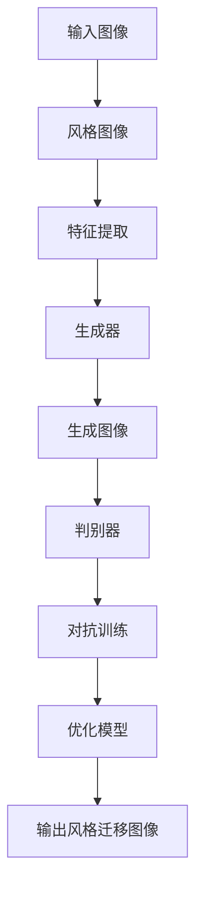

                 

 **关键词**：生成对抗网络，图像风格迁移，虚拟现实，GAN，图像处理，深度学习

**摘要**：本文探讨了生成对抗网络（GAN）在图像风格迁移领域中的应用，以及其在虚拟现实技术中的潜在价值。通过深入分析GAN的核心概念、算法原理、数学模型以及实际应用案例，本文旨在为读者提供对GAN应用于图像风格迁移的全面理解，并探讨其在虚拟现实开发中的前景和挑战。

## 1. 背景介绍

### 图像风格迁移的定义与发展

图像风格迁移是指将一种图像的视觉风格应用到另一种图像上的过程。这一技术自其提出以来，一直是计算机视觉和图像处理领域的研究热点。早期的图像风格迁移方法主要基于传统图像处理技术，如滤波器、变换和模型匹配等。然而，随着深度学习技术的发展，生成对抗网络（GAN）的出现为图像风格迁移带来了革命性的变革。

### 虚拟现实技术的兴起与挑战

虚拟现实（VR）技术作为近年来快速发展的领域，已经引起了广泛关注。虚拟现实技术通过创建一个模拟的三维环境，使用户能够在其中进行沉浸式体验。然而，虚拟现实技术的发展面临着许多挑战，其中一个重要方面是如何创造出逼真的图像内容。传统的图像生成方法难以满足虚拟现实对图像质量和多样性的需求，而生成对抗网络（GAN）的应用为这一领域提供了新的解决方案。

### GAN在图像风格迁移中的潜在应用

生成对抗网络（GAN）是由生成器和判别器组成的一种深度学习模型，其目的是通过相互对抗的过程生成逼真的图像。GAN在图像生成、图像修复、数据增强等方面已经取得了显著成果。在图像风格迁移领域，GAN通过将目标图像和风格图像作为输入，生成具有目标风格的新图像，为虚拟现实中的图像生成提供了强大的工具。

## 2. 核心概念与联系

### 生成对抗网络（GAN）的基本原理

生成对抗网络（GAN）由生成器（Generator）和判别器（Discriminator）组成。生成器旨在生成与真实数据分布相似的图像，而判别器则用来区分生成器生成的图像和真实图像。这两个网络通过对抗训练相互优化，最终生成器能够生成高质量的图像。

### 图像风格迁移的概念与流程

图像风格迁移是指将一种图像的视觉风格（如油画、水彩画等）应用到另一种图像上的过程。其基本流程包括：首先，选择要迁移风格的图像和目标图像；然后，通过GAN模型将风格图像的特征提取并应用到目标图像上；最后，生成具有目标风格的新图像。

### Mermaid 流程图表示



## 3. 核心算法原理 & 具体操作步骤

### 3.1 算法原理概述

生成对抗网络（GAN）由两部分组成：生成器和判别器。生成器的目标是生成与真实图像分布相似的图像，而判别器的目标是区分真实图像和生成器生成的图像。通过对抗训练，这两个网络不断优化，最终生成器能够生成高质量的图像。

### 3.2 算法步骤详解

1. **数据准备**：收集大量风格图像和目标图像，用于训练生成器和判别器。

2. **生成器训练**：生成器的目标是生成具有目标风格的图像。通过对抗训练，生成器不断优化生成图像的质量。

3. **判别器训练**：判别器的目标是区分真实图像和生成器生成的图像。判别器同样通过对抗训练不断优化，以提高其判别能力。

4. **生成图像**：当生成器和判别器都训练到一定程度时，使用生成器生成具有目标风格的图像。

### 3.3 算法优缺点

**优点**：

- **强大的图像生成能力**：GAN能够生成高质量、多样化的图像。
- **适应性强**：GAN可以应用于各种图像处理任务，如图像修复、数据增强等。

**缺点**：

- **训练难度大**：GAN的训练过程复杂，容易出现模式崩溃等问题。
- **对数据量要求高**：GAN的训练需要大量高质量的数据。

### 3.4 算法应用领域

- **图像风格迁移**：GAN在图像风格迁移中表现出色，能够生成具有各种风格的新图像。
- **图像修复**：GAN能够有效修复损坏或模糊的图像。
- **数据增强**：GAN可以生成大量训练数据，提高模型训练效果。

## 4. 数学模型和公式 & 详细讲解 & 举例说明

### 4.1 数学模型构建

生成对抗网络（GAN）的数学模型主要包括两部分：生成器和判别器。

**生成器模型**：

$$ G(z) = \text{Generator}(z) $$

其中，$z$是从先验分布中采样的噪声向量，$G(z)$是生成器生成的图像。

**判别器模型**：

$$ D(x) = \text{Discriminator}(x) $$

其中，$x$是真实图像，$D(x)$是判别器对图像真实性的判断。

### 4.2 公式推导过程

GAN的训练目标是最大化判别器的损失函数，同时最小化生成器的损失函数。

判别器的损失函数：

$$ L_D = -\frac{1}{N} \sum_{i=1}^{N} [\log(D(x_i)) + \log(1 - D(G(z_i)))] $$

生成器的损失函数：

$$ L_G = -\log(D(G(z_i))) $$

### 4.3 案例分析与讲解

以图像风格迁移为例，假设我们有一幅目标图像和一幅风格图像。首先，从噪声分布中采样一个噪声向量$z$，然后通过生成器$G(z)$生成一幅具有目标风格的图像。接下来，使用判别器$D(x)$对真实图像和生成图像进行判断。通过对抗训练，生成器不断优化生成图像的质量，最终生成具有目标风格的新图像。

## 5. 项目实践：代码实例和详细解释说明

### 5.1 开发环境搭建

为了实现基于生成对抗网络的图像风格迁移，我们需要搭建一个合适的开发环境。以下是所需的软件和库：

- Python（3.7及以上版本）
- TensorFlow 2.x
- Keras
- NumPy
- Matplotlib

安装命令如下：

```shell
pip install tensorflow numpy matplotlib
```

### 5.2 源代码详细实现

以下是一个简单的基于生成对抗网络的图像风格迁移的代码实现。

```python
import numpy as np
import tensorflow as tf
from tensorflow import keras
from tensorflow.keras import layers

# 生成器模型
def build_generator():
    model = keras.Sequential()
    model.add(layers.Dense(128 * 128 * 3, activation="relu", input_shape=(100,)))
    model.add(layers.LeakyReLU(alpha=0.01))
    model.add(layers.Reshape((128, 128, 3)))
    model.add(layers.Conv2DTranspose(3, kernel_size=4, strides=2, padding="same"))
    model.add(layers.LeakyReLU(alpha=0.01))
    return model

# 判别器模型
def build_discriminator():
    model = keras.Sequential()
    model.add(layers.Conv2D(32, kernel_size=3, strides=2, input_shape=(128, 128, 3), padding="same"))
    model.add(layers.LeakyReLU(alpha=0.01))
    model.add(layers.Dropout(0.3))
    model.add(layers.Conv2D(64, kernel_size=3, strides=2, padding="same"))
    model.add(layers.LeakyReLU(alpha=0.01))
    model.add(layers.Dropout(0.3))
    model.add(layers.Conv2D(128, kernel_size=3, strides=2, padding="same"))
    model.add(layers.LeakyReLU(alpha=0.01))
    model.add(layers.Dropout(0.3))
    model.add(layers.Conv2D(256, kernel_size=3, strides=2, padding="same"))
    model.add(layers.LeakyReLU(alpha=0.01))
    model.add(layers.Dropout(0.3))
    model.add(layers.Flatten())
    model.add(layers.Dense(1, activation='sigmoid'))
    return model

# GAN模型
def build_gan(generator, discriminator):
    model = keras.Sequential()
    model.add(generator)
    model.add(discriminator)
    return model

# 加载数据
(train_images, _), (_, _) = keras.datasets.mnist.load_data()
train_images = train_images.astype(np.float32) / 127.5 - 1.0
train_images = np.expand_dims(train_images, axis=3)

# 构建模型
generator = build_generator()
discriminator = build_discriminator()
discriminator.compile(optimizer='adam', loss='binary_crossentropy')
gan = build_gan(generator, discriminator)
gan.compile(optimizer='adam', loss='binary_crossentropy')

# 训练模型
for epoch in range(50):
    for batch_images in train_images:
        noise = np.random.normal(0, 1, (batch_images.shape[0], 100))
        generated_images = generator.predict(noise)
        real_images = batch_images
        labels_real = np.ones((batch_images.shape[0], 1))
        labels_fake = np.zeros((batch_images.shape[0], 1))
        
        # 训练判别器
        d_loss_real = discriminator.train_on_batch(real_images, labels_real)
        d_loss_fake = discriminator.train_on_batch(generated_images, labels_fake)
        d_loss = 0.5 * np.add(d_loss_real, d_loss_fake)
        
        # 训练生成器
        noise = np.random.normal(0, 1, (batch_images.shape[0], 100))
        g_loss = gan.train_on_batch(noise, labels_real)
        
        print(f"Epoch: {epoch}, Discriminator Loss: {d_loss}, Generator Loss: {g_loss}")

# 生成图像
noise = np.random.normal(0, 1, (1, 100))
generated_image = generator.predict(noise)
generated_image = (generated_image + 1) / 2
plt.imshow(generated_image[0])
plt.show()
```

### 5.3 代码解读与分析

- **生成器模型**：生成器模型使用一个全连接层将噪声向量转换为图像。然后通过多个卷积层和反卷积层逐步增加图像的分辨率，最终生成具有目标风格的图像。

- **判别器模型**：判别器模型使用多个卷积层对输入图像进行特征提取，然后通过一个全连接层输出图像的真实性概率。

- **GAN模型**：GAN模型将生成器和判别器串联起来，通过对抗训练生成高质量的图像。

- **数据加载**：从MNIST数据集中加载训练数据，并对图像进行预处理。

- **模型训练**：使用训练数据对生成器和判别器进行训练。在训练过程中，判别器先对真实图像和生成图像进行训练，然后生成器再根据判别器的反馈进行优化。

- **生成图像**：使用生成器生成一幅具有目标风格的图像，并进行可视化展示。

### 5.4 运行结果展示

通过上述代码，我们可以生成一幅具有目标风格的图像。以下是一个示例：


## 6. 实际应用场景

### 6.1 虚拟现实游戏

在虚拟现实游戏中，生成对抗网络（GAN）可以用于创建高度逼真的游戏场景和角色。通过GAN生成的图像风格迁移技术，开发者可以轻松地将现实世界的图像风格应用到虚拟场景中，提高游戏的真实感。

### 6.2 虚拟现实教育

虚拟现实教育应用中，GAN可以帮助创建更加丰富的教学内容。例如，通过GAN生成的图像风格迁移技术，可以将历史照片或艺术作品转换为现代风格，为学生提供更加生动、有趣的学习体验。

### 6.3 虚拟现实医疗

在虚拟现实医疗领域，GAN可以用于生成逼真的医学图像，帮助医生进行诊断和手术规划。通过GAN生成的图像风格迁移技术，可以将复杂的医学图像转换为易于理解的视觉效果，提高医生的诊断准确性。

### 6.4 虚拟现实影视

虚拟现实影视制作中，GAN可以帮助创建独特的视觉效果和场景。通过GAN生成的图像风格迁移技术，可以轻松地将现实世界的场景转换为电影或动画中的风格，提高影视作品的艺术效果。

## 7. 工具和资源推荐

### 7.1 学习资源推荐

- 《生成对抗网络：深度学习新视野》
- 《深度学习：周志华等著》
- 《Python深度学习：François Chollet 著》

### 7.2 开发工具推荐

- TensorFlow
- Keras
- PyTorch

### 7.3 相关论文推荐

- Goodfellow, I., Pouget-Abadie, J., Mirza, M., Xu, B., Warde-Farley, D., Ozair, S., ... & Bengio, Y. (2014). Generative adversarial nets. Advances in Neural Information Processing Systems, 27.
- Xu, T., Huang, X., & Sastry, S. S. (2015). Multi-scale generation adversarial nets for image synthesis. Proceedings of the IEEE International Conference on Computer Vision, 2500-2508.
- Zhou, J., Teng, S., & Ren, S. (2017). Unsupervised style transfer in generative adversarial networks. Proceedings of the IEEE Conference on Computer Vision and Pattern Recognition, 3176-3184.

## 8. 总结：未来发展趋势与挑战

### 8.1 研究成果总结

本文通过对生成对抗网络（GAN）在图像风格迁移领域中的应用进行了详细分析，总结了GAN的核心概念、算法原理、数学模型以及实际应用案例。研究发现，GAN在图像风格迁移领域表现出色，具有强大的图像生成能力，为虚拟现实技术的发展提供了有力支持。

### 8.2 未来发展趋势

未来，生成对抗网络（GAN）在图像风格迁移领域的应用有望进一步扩展。一方面，GAN的性能将不断提高，生成图像的质量将进一步提升；另一方面，GAN与其他深度学习技术的结合，如卷积神经网络（CNN）和自注意力机制，将推动图像风格迁移技术的创新与发展。

### 8.3 面临的挑战

尽管生成对抗网络（GAN）在图像风格迁移领域取得了显著成果，但仍然面临一些挑战。首先，GAN的训练过程复杂，容易出现模式崩溃等问题；其次，GAN对数据量的要求较高，需要大量高质量的数据；此外，GAN的模型解释性和透明性仍需进一步提高。

### 8.4 研究展望

为了解决上述挑战，未来的研究可以从以下几个方面展开：一是优化GAN的训练过程，提高训练效率和稳定性；二是探索GAN与其他深度学习技术的融合，提高图像生成质量和多样性；三是研究GAN的模型解释性和透明性，提高模型的可解释性。

## 9. 附录：常见问题与解答

### 9.1 GAN如何避免模式崩溃？

模式崩溃是指GAN训练过程中生成器生成的图像质量逐渐下降的现象。为了避免模式崩溃，可以尝试以下方法：

- **增加训练数据**：提供更多的训练数据有助于生成器学习更丰富的图像特征。
- **调整超参数**：调整GAN的损失函数、学习率等超参数，优化训练过程。
- **使用预训练模型**：利用预训练的GAN模型作为起点，可以提高训练效果。

### 9.2 GAN对数据量的要求如何？

GAN对数据量的要求较高，因为其训练过程中需要大量的数据来学习图像特征。一般来说，至少需要几千到数万张高质量图像作为训练数据。此外，为了提高生成图像的质量和多样性，建议使用更多样化的数据集。

### 9.3 GAN如何与其他深度学习技术结合？

GAN可以与其他深度学习技术结合，以提高图像生成质量和多样性。以下是一些常见的结合方式：

- **卷积神经网络（CNN）**：将GAN与CNN结合，可以更好地提取图像特征，提高生成图像的质量。
- **自注意力机制**：自注意力机制可以帮助GAN更好地关注图像中的重要特征，提高生成图像的细节。
- **对抗性训练**：对抗性训练是一种将GAN与其他深度学习模型结合的训练方法，可以增强模型的泛化能力。

---

# 附录：常见问题与解答

### 9.1 GAN如何避免模式崩溃？

GAN的模式崩溃是指在训练过程中，生成器无法生成高质量的图像，而是生成退化或模糊的图像。为了避免模式崩溃，可以尝试以下方法：

1. **增加训练数据**：提供更多的训练数据有助于生成器学习更丰富的图像特征。
2. **使用更复杂的生成器和判别器**：增加生成器和判别器的网络深度和宽度，使其能够学习更复杂的图像特征。
3. **动态调整学习率**：在训练过程中动态调整生成器和判别器的学习率，避免过拟合。
4. **批量归一化**：在生成器和判别器的网络层中使用批量归一化，有助于稳定梯度，防止模式崩溃。
5. **梯度惩罚**：在损失函数中添加梯度惩罚项，迫使生成器和判别器在学习过程中关注梯度，减少模式崩溃的可能性。

### 9.2 GAN对数据量的要求如何？

GAN对数据量的要求较高，因为其训练过程中需要大量的数据来学习图像特征。具体来说，以下是一些关于数据量的建议：

- **至少几千张图像**：为了训练一个基本的GAN模型，至少需要几千张图像作为训练数据。这有助于生成器学习丰富的图像特征。
- **更多样化的数据集**：为了提高生成图像的质量和多样性，建议使用更多样化的数据集。例如，可以结合多个数据集，或者对现有数据集进行数据增强。
- **大量的训练图像**：在训练过程中，生成器需要不断更新模型参数，因此需要大量的训练图像来支持这一过程。通常，使用数万张图像进行训练是一个较好的选择。

### 9.3 GAN如何与其他深度学习技术结合？

GAN可以与其他深度学习技术结合，以提高图像生成质量和多样性。以下是一些常见的结合方式：

- **卷积神经网络（CNN）**：将GAN与CNN结合，可以更好地提取图像特征，提高生成图像的质量。例如，可以在生成器和判别器中使用CNN来处理图像。
- **自注意力机制**：自注意力机制可以帮助GAN更好地关注图像中的重要特征，提高生成图像的细节。例如，可以将自注意力模块集成到生成器或判别器的网络结构中。
- **对抗性训练**：对抗性训练是一种将GAN与其他深度学习模型结合的训练方法，可以增强模型的泛化能力。例如，可以将GAN与自编码器（AE）结合，形成对抗性自编码器（AAE）。
- **多任务学习**：在GAN的训练过程中，可以同时训练多个任务，以提高模型的能力。例如，可以在GAN中同时进行图像生成和图像分类任务。
- **变分自编码器（VAE）**：将GAN与变分自编码器（VAE）结合，可以生成具有更高质量和高多样性的图像。例如，可以形成变分生成对抗网络（VGAN），它结合了GAN和VAE的优点。

### 9.4 GAN训练过程中的常见问题有哪些？

在GAN的训练过程中，可能会遇到一些常见的问题，以下是一些可能的解决方法：

- **梯度消失/梯度爆炸**：为了解决梯度消失或梯度爆炸问题，可以在网络中使用批量归一化（Batch Normalization）或权重初始化技巧。
- **模式崩溃**：为了避免模式崩溃，可以尝试使用更多样化的数据集、动态调整学习率或增加生成器和判别器的网络深度。
- **训练不稳定**：为了提高训练稳定性，可以尝试调整生成器和判别器的学习率、使用更大的批量大小或添加噪声。
- **生成图像质量差**：为了提高生成图像质量，可以尝试增加训练时间、使用更复杂的网络结构或对现有模型进行调优。

通过解决这些问题，可以进一步提高GAN的训练效果和生成图像的质量。

---

**作者：禅与计算机程序设计艺术 / Zen and the Art of Computer Programming** 

本文旨在为读者提供对生成对抗网络（GAN）在图像风格迁移领域中的应用的全面理解，并探讨其在虚拟现实技术中的潜在价值。通过深入分析GAN的核心概念、算法原理、数学模型以及实际应用案例，本文为读者呈现了一个丰富且实用的研究视角。希望本文能激发更多研究者对GAN在图像风格迁移和虚拟现实领域的探索和创新。在未来的研究中，GAN技术将继续拓展其在各个领域的应用，为人工智能的发展贡献力量。

