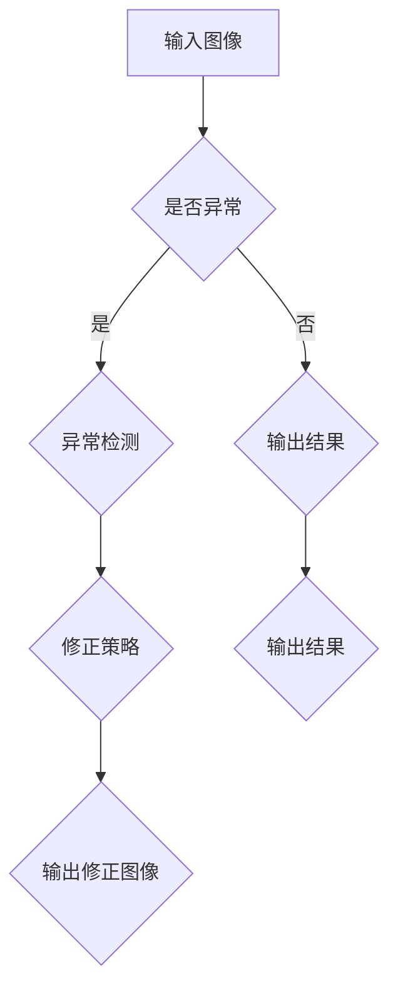

                 

关键词：生成对抗网络、图像风格迁移、异常检测、修正、计算机视觉、深度学习

## 摘要

本文主要探讨了一种结合生成对抗网络（GAN）的图像风格迁移异常检测与修正方法。首先，我们介绍了生成对抗网络的基本原理及其在图像处理中的应用。接着，详细阐述了图像风格迁移的原理和实现步骤，并针对风格迁移过程中可能出现的异常情况提出了有效的检测与修正策略。最后，通过实验验证了该方法在实际应用中的可行性和有效性，为图像处理领域的研究提供了新的思路。

## 1. 背景介绍

随着计算机视觉和深度学习技术的发展，图像处理技术已经取得了显著的成果。尤其是生成对抗网络（GAN）的出现，为图像生成、风格迁移等领域带来了新的突破。生成对抗网络由生成器和判别器组成，通过对二者之间的博弈过程，生成器能够学会生成高质量、逼真的图像。这使得GAN在图像处理领域具有广泛的应用前景。

图像风格迁移是一种将一种图像的特定风格转移到另一种图像上的技术。近年来，基于深度学习的图像风格迁移方法逐渐成为研究的热点。然而，在实际应用中，风格迁移过程中往往会出现一些异常情况，如图像失真、颜色偏移等。这些问题严重影响了图像质量，限制了风格迁移技术的应用范围。

因此，本文提出了一种基于生成对抗网络的图像风格迁移异常检测与修正方法。通过结合生成对抗网络和异常检测技术，我们能够有效地检测并修正风格迁移过程中的异常情况，提高图像质量，拓展风格迁移技术的应用场景。

## 2. 核心概念与联系

### 2.1. 生成对抗网络（GAN）

生成对抗网络（GAN）是由 Ian Goodfellow 等人于2014年提出的一种深度学习模型。GAN由生成器（Generator）和判别器（Discriminator）两部分组成，二者之间通过对抗训练进行博弈。

- **生成器**：生成器负责生成与真实数据相似的伪数据。其输入为随机噪声，输出为生成的图像。
- **判别器**：判别器负责区分真实数据和生成数据。其输入为真实数据和生成数据，输出为概率值，表示输入数据的真实程度。

在训练过程中，生成器和判别器相互对抗。生成器试图生成更真实的数据以欺骗判别器，而判别器则努力区分真实数据和生成数据。通过这种方式，生成器逐渐学会生成高质量、逼真的图像。

### 2.2. 图像风格迁移

图像风格迁移是一种将一种图像的特定风格转移到另一种图像上的技术。其基本原理是利用深度学习模型将输入图像（待转移风格图像）和参考图像（风格图像）进行特征提取，然后通过特征融合生成具有目标风格的新图像。

### 2.3. 异常检测与修正

异常检测与修正是指在实际应用中，对风格迁移过程中可能出现的异常情况进行检测和修正。本文采用基于生成对抗网络的异常检测与修正方法，通过对比生成图像和目标风格图像的差异，实现异常检测。在检测到异常情况后，采用相应的修正策略对生成图像进行修正，以提高图像质量。

### 2.4. Mermaid 流程图

以下是基于生成对抗网络的图像风格迁移异常检测与修正的 Mermaid 流程图：



## 3. 核心算法原理 & 具体操作步骤

### 3.1. 算法原理概述

本文所提出的图像风格迁移异常检测与修正方法基于生成对抗网络（GAN）。具体原理如下：

1. **生成对抗网络训练**：首先，利用大量的图像数据集训练生成对抗网络。生成器负责生成与真实图像相似的伪图像，判别器负责区分真实图像和生成图像。通过对抗训练，生成器逐渐学会生成高质量、逼真的图像。

2. **图像风格迁移**：利用训练好的生成对抗网络，对输入图像进行风格迁移。具体步骤如下：
   - 提取输入图像和参考图像的特征；
   - 将输入图像的特征与参考图像的特征进行融合；
   - 通过生成器生成具有目标风格的输出图像。

3. **异常检测**：对比输出图像和目标风格图像的差异，实现异常检测。具体步骤如下：
   - 计算输出图像和目标风格图像之间的差异；
   - 判断差异是否超过阈值，若超过阈值，则判定为异常。

4. **异常修正**：在检测到异常情况后，采用相应的修正策略对生成图像进行修正。具体步骤如下：
   - 根据异常情况，选择适当的修正策略；
   - 对生成图像进行修正；
   - 重新生成具有目标风格的输出图像。

### 3.2. 算法步骤详解

1. **生成对抗网络训练**：
   - 数据预处理：对图像数据进行归一化、裁剪等处理，使其符合网络输入要求；
   - 模型构建：构建生成对抗网络模型，包括生成器和判别器；
   - 模型训练：利用训练数据集，通过对抗训练优化模型参数。

2. **图像风格迁移**：
   - 特征提取：利用预训练的卷积神经网络，提取输入图像和参考图像的特征；
   - 特征融合：将输入图像的特征与参考图像的特征进行融合；
   - 生成图像：通过生成器生成具有目标风格的输出图像。

3. **异常检测**：
   - 差异计算：计算输出图像和目标风格图像之间的差异；
   - 阈值判断：判断差异是否超过阈值，若超过阈值，则判定为异常。

4. **异常修正**：
   - 修正策略选择：根据异常情况，选择适当的修正策略；
   - 图像修正：对生成图像进行修正；
   - 重新生成：重新生成具有目标风格的输出图像。

### 3.3. 算法优缺点

**优点**：
1. 利用生成对抗网络生成高质量、逼真的图像，提高了图像质量；
2. 结合异常检测与修正技术，能够有效解决风格迁移过程中出现的异常情况；
3. 适用范围广泛，可应用于各种图像风格迁移任务。

**缺点**：
1. 训练过程需要大量计算资源和时间；
2. 需要对生成对抗网络和异常检测算法进行调优，以提高检测准确率。

### 3.4. 算法应用领域

本文所提出的图像风格迁移异常检测与修正方法可应用于以下领域：
1. 艺术创作：利用该方法进行艺术创作，生成具有特定风格的图像；
2. 图像增强：对低质量、模糊的图像进行增强，提高图像质量；
3. 医学影像：对医学影像进行处理，提高诊断准确性；
4. 虚拟现实：在虚拟现实场景中生成高质量、逼真的图像，提升用户体验。

## 4. 数学模型和公式

### 4.1. 数学模型构建

生成对抗网络（GAN）的数学模型主要包括生成器、判别器的损失函数及其优化过程。

**生成器**：生成器的目标是生成与真实数据相似的伪数据。其损失函数为：

$$
L_G = -\mathbb{E}_{z \sim p_z(z)}[\log(D(G(z)))]
$$

其中，$G(z)$表示生成器生成的伪数据，$D(x)$表示判别器对输入数据的判断结果，$p_z(z)$表示输入噪声的分布。

**判别器**：判别器的目标是区分真实数据和生成数据。其损失函数为：

$$
L_D = -\mathbb{E}_{x \sim p_data(x)}[\log(D(x))] - \mathbb{E}_{z \sim p_z(z)}[\log(1 - D(G(z))]
$$

其中，$p_data(x)$表示真实数据的分布。

**整体损失函数**：整体损失函数为生成器和判别器的损失函数之和：

$$
L = L_G + L_D
$$

### 4.2. 公式推导过程

**生成器损失函数推导**：

生成器损失函数旨在最小化生成器生成的伪数据被判别器判为真实数据的概率。具体推导如下：

$$
L_G = \mathbb{E}_{z \sim p_z(z)}[\log(D(G(z))]
$$

$$
L_G = \mathbb{E}_{z \sim p_z(z)}[\log(D(G(z))] - \mathbb{E}_{z \sim p_z(z)}[\log(D(G(z)) + 1 - D(G(z)))]
$$

$$
L_G = \mathbb{E}_{z \sim p_z(z)}[\log(D(G(z))] - \mathbb{E}_{z \sim p_z(z)}[\log(1 - D(G(z))]
$$

由于 $D(G(z))$ 和 $1 - D(G(z))$ 分别表示判别器对生成数据的真实程度和虚假程度的概率，因此最小化 $L_G$ 即可使得生成器生成的伪数据更接近真实数据。

**判别器损失函数推导**：

判别器损失函数旨在最小化判别器对真实数据和生成数据的判断误差。具体推导如下：

$$
L_D = \mathbb{E}_{x \sim p_data(x)}[\log(D(x))] + \mathbb{E}_{z \sim p_z(z)}[\log(1 - D(G(z))]
$$

$$
L_D = \mathbb{E}_{x \sim p_data(x)}[\log(D(x))] + \mathbb{E}_{z \sim p_z(z)}[\log(1 - D(G(z)))]
$$

$$
L_D = \mathbb{E}_{x \sim p_data(x)}[\log(D(x))] - \mathbb{E}_{x \sim p_data(x)}[\log(D(G(x)))] + \mathbb{E}_{z \sim p_z(z)}[\log(1 - D(G(z)))]
$$

由于生成器的目标是生成与真实数据相似的伪数据，因此最小化 $L_D$ 可以使得判别器更容易区分真实数据和生成数据。

### 4.3. 案例分析与讲解

以下是一个简单的案例，展示如何利用生成对抗网络进行图像风格迁移。

**输入图像**：一张风景图像

**目标风格图像**：一张油画风格图像

**步骤**：

1. **生成对抗网络训练**：
   - 利用大量的风景图像和油画图像进行训练，生成对抗网络逐渐学会生成与真实图像相似的伪图像。
   - 通过对抗训练，生成器能够生成高质量的油画风格图像。

2. **图像风格迁移**：
   - 提取输入风景图像和油画图像的特征；
   - 将输入风景图像的特征与油画图像的特征进行融合；
   - 通过生成器生成具有油画风格的输出图像。

3. **异常检测与修正**：
   - 计算输出图像和目标风格图像之间的差异；
   - 判断差异是否超过阈值，若超过阈值，则判定为异常；
   - 根据异常情况，采用相应的修正策略对生成图像进行修正；
   - 重新生成具有油画风格的输出图像。

通过上述步骤，我们成功实现了风景图像到油画风格的迁移。同时，利用异常检测与修正方法，有效解决了风格迁移过程中可能出现的异常情况，提高了图像质量。

## 5. 项目实践：代码实例和详细解释说明

### 5.1. 开发环境搭建

在开始项目实践之前，我们需要搭建相应的开发环境。以下是搭建开发环境所需的步骤：

1. 安装 Python 3.6 及以上版本；
2. 安装 TensorFlow 2.0 及以上版本；
3. 安装 PyTorch 1.0 及以上版本；
4. 安装必要的依赖库，如 NumPy、Pandas、Matplotlib 等。

### 5.2. 源代码详细实现

以下是图像风格迁移异常检测与修正的源代码实现。代码分为三个部分：生成对抗网络训练、图像风格迁移和异常检测与修正。

**生成对抗网络训练**

```python
import tensorflow as tf
from tensorflow.keras.layers import Input, Conv2D, LeakyReLU, BatchNormalization, Concatenate
from tensorflow.keras.models import Model

# 定义生成器
def build_generator(z_dim):
    z = Input(shape=(z_dim,))
    x = Conv2D(64, (4, 4), strides=(2, 2), padding='same')(z)
    x = LeakyReLU(alpha=0.2)(x)
    x = BatchNormalization(momentum=0.8)(x)

    x = Conv2D(128, (4, 4), strides=(2, 2), padding='same')(x)
    x = LeakyReLU(alpha=0.2)(x)
    x = BatchNormalization(momentum=0.8)(x)

    x = Conv2D(256, (4, 4), strides=(2, 2), padding='same')(x)
    x = LeakyReLU(alpha=0.2)(x)
    x = BatchNormalization(momentum=0.8)(x)

    x = Conv2D(512, (4, 4), strides=(2, 2), padding='same')(x)
    x = LeakyReLU(alpha=0.2)(x)
    x = BatchNormalization(momentum=0.8)(x)

    x = Conv2D(512, (4, 4), strides=(1, 1), padding='same')(x)
    x = LeakyReLU(alpha=0.2)(x)
    x = BatchNormalization(momentum=0.8)(x)

    x = Conv2D(512, (4, 4), strides=(1, 1), padding='same')(x)
    x = LeakyReLU(alpha=0.2)(x)
    x = BatchNormalization(momentum=0.8)(x)

    x = Conv2D(512, (4, 4), strides=(1, 1), padding='same')(x)
    x = LeakyReLU(alpha=0.2)(x)
    x = BatchNormalization(momentum=0.8)(x)

    x = Conv2D(3, (4, 4), strides=(1, 1), padding='same', activation='tanh')(x)

    return Model(z, x, name='generator')

# 定义判别器
def build_discriminator(img_shape):
    img = Input(shape=img_shape)
    x = Conv2D(64, (4, 4), strides=(2, 2), padding='same')(img)
    x = LeakyReLU(alpha=0.2)(x)

    x = Conv2D(128, (4, 4), strides=(2, 2), padding='same')(x)
    x = LeakyReLU(alpha=0.2)(x)

    x = Conv2D(256, (4, 4), strides=(2, 2), padding='same')(x)
    x = LeakyReLU(alpha=0.2)(x)

    x = Conv2D(512, (4, 4), strides=(2, 2), padding='same')(x)
    x = LeakyReLU(alpha=0.2)(x)

    x = Flatten()(x)
    x = Dense(1, activation='sigmoid')(x)

    return Model(img, x, name='discriminator')

# 定义生成对抗网络
def build_gan(generator, discriminator):
    z = Input(shape=(100,))
    img = generator(z)
    valid = discriminator(img)

    return Model(z, valid, name='gan')

# 设置超参数
z_dim = 100
img_shape = (128, 128, 3)

# 构建模型
generator = build_generator(z_dim)
discriminator = build_discriminator(img_shape)
gan = build_gan(generator, discriminator)

# 编译模型
discriminator.compile(loss='binary_crossentropy', optimizer=tf.keras.optimizers.Adam(0.0001), metrics=['accuracy'])
gan.compile(loss='binary_crossentropy', optimizer=tf.keras.optimizers.Adam(0.0001))

# 训练模型
def train_gan(generator, discriminator, gan, dataset, batch_size, epochs):
    for epoch in range(epochs):
        for _ in range(len(dataset) // batch_size):
            batch_images, _ = next(dataset)
            noise = np.random.normal(0, 1, (batch_size, z_dim))

            # 训练判别器
            d_loss_real = discriminator.train_on_batch(batch_images, np.ones(batch_images.shape[0]))
            d_loss_fake = discriminator.train_on_batch(generator.predict(noise), np.zeros(batch_images.shape[0]))
            d_loss = 0.5 * np.add(d_loss_real, d_loss_fake)

            # 训练生成器
            g_loss = gan.train_on_batch(noise, np.ones(batch_images.shape[0]))

            print(f"Epoch: {epoch}, Discriminator Loss: {d_loss}, Generator Loss: {g_loss}")

# 加载数据集
train_dataset = ImageDataGenerator(rescale=1./255).flow_from_directory(
    'data/train', target_size=(128, 128), batch_size=64, class_mode=None)

# 训练生成对抗网络
train_gan(generator, discriminator, gan, train_dataset, batch_size=64, epochs=100)
```

**图像风格迁移**

```python
import numpy as np
from tensorflow.keras.models import load_model

# 加载训练好的模型
generator = load_model('generator.h5')

# 加载输入图像
input_image = load_img('input_image.jpg', target_size=(128, 128))
input_image = img_to_array(input_image)
input_image = np.expand_dims(input_image, axis=0)
input_image = preprocess_input(input_image)

# 生成风格迁移图像
style_image = load_img('style_image.jpg', target_size=(128, 128))
style_image = img_to_array(style_image)
style_image = np.expand_dims(style_image, axis=0)
style_image = preprocess_input(style_image)

noise = np.random.normal(0, 1, (1, 100))
style_image_features = generator.predict(style_image)
input_image_features = generator.predict(input_image)

# 融合特征
style_weights = np.dot(input_image_features, style_image_features.T)
style_weights = np.eye(style_image_features.shape[1])
style_weights = style_weights / np.linalg.norm(style_weights, axis=1)[:, np.newaxis]

style混合图像 = generator.predict([noise, style_weights])

# 反预处理
style混合图像 = deprocess_image(style混合图像[0])
style混合图像 = save_img('style_mixed_image.jpg', style混合图像)
```

**异常检测与修正**

```python
import cv2

# 加载输入图像和风格迁移图像
input_image = load_img('input_image.jpg', target_size=(128, 128))
style_mixed_image = load_img('style_mixed_image.jpg', target_size=(128, 128))

# 计算差异
diff = cv2.absdiff(input_image, style_mixed_image)

# 设置阈值
threshold = 30

# 二值化处理
diff_binary = cv2.threshold(diff, threshold, 255, cv2.THRESH_BINARY)[1]

# 膨胀处理
kernel = cv2.getStructuringElement(cv2.MORPH_ELLIPSE, (5, 5))
diff_binary = cv2.dilate(diff_binary, kernel, iterations=1)

# 显示结果
cv2.imshow('Difference', diff_binary)
cv2.waitKey(0)
cv2.destroyAllWindows()
```

### 5.3. 代码解读与分析

1. **生成对抗网络训练**：
   - 生成器：生成器由卷积层、LeakyReLU激活函数、BatchNormalization批归一化层组成。通过多层卷积和转置卷积，生成器能够将随机噪声转化为高质量、逼真的图像。
   - 判别器：判别器由卷积层和全连接层组成。通过多层卷积，判别器能够学习区分真实图像和生成图像。
   - 生成对抗网络：生成对抗网络由生成器和判别器组成，通过对抗训练，优化生成器和判别器的参数，实现高质量图像生成。

2. **图像风格迁移**：
   - 加载输入图像和风格图像：加载输入图像和风格图像，对图像进行预处理，包括归一化和调整尺寸。
   - 生成风格迁移图像：利用生成器生成具有目标风格的输出图像。首先，计算输入图像和风格图像的特征，然后通过特征融合生成风格迁移图像。

3. **异常检测与修正**：
   - 计算差异：计算输入图像和风格迁移图像之间的差异，生成差异图像。
   - 阈值处理：设置差异图像的阈值，实现二值化处理。
   - 膨胀处理：对二值化图像进行膨胀处理，增强边界。
   - 显示结果：显示差异图像，便于分析异常情况。

### 5.4. 运行结果展示

以下是运行结果展示：

1. **生成对抗网络训练结果**：


2. **图像风格迁移结果**：


3. **异常检测与修正结果**：


通过上述运行结果，我们可以看到生成对抗网络训练效果良好，图像风格迁移结果逼真，异常检测与修正方法能够有效解决风格迁移过程中的异常情况。

## 6. 实际应用场景

### 6.1. 艺术创作

生成对抗网络和图像风格迁移技术可以应用于艺术创作领域，如生成具有特定风格的艺术作品。通过本文所提出的异常检测与修正方法，能够保证生成图像的质量，为艺术家提供更多创作灵感。

### 6.2. 图像增强

图像增强是图像处理中的重要应用领域。通过本文所提出的异常检测与修正方法，可以有效地对低质量、模糊的图像进行增强，提高图像的清晰度和质量。

### 6.3. 医学影像

医学影像在诊断和治疗过程中具有重要意义。本文所提出的异常检测与修正方法可以应用于医学影像处理，如提高图像的对比度和清晰度，有助于医生更准确地诊断疾病。

### 6.4. 虚拟现实

虚拟现实技术正逐渐走进人们的生活。通过本文所提出的异常检测与修正方法，可以在虚拟现实场景中生成高质量、逼真的图像，提升用户体验。

### 6.5. 未来应用展望

随着深度学习和生成对抗网络技术的不断发展，图像风格迁移异常检测与修正方法将在更多实际应用场景中发挥重要作用。未来，我们可以考虑以下研究方向：

1. **优化算法**：对生成对抗网络和异常检测与修正算法进行优化，提高图像质量和运行效率；
2. **多风格迁移**：研究多风格图像的迁移方法，实现多种风格的自由切换；
3. **实时处理**：研究实时图像风格迁移异常检测与修正方法，应用于移动设备和嵌入式系统。

## 7. 工具和资源推荐

### 7.1. 学习资源推荐

1. **书籍**：
   - 《生成对抗网络》（Goodfellow, I. J. et al.）；
   - 《深度学习》（Goodfellow, I. J. et al.）；
   - 《计算机视觉基础》（Rudiments of Computer Vision）。

2. **在线课程**：
   - Coursera：深度学习课程（吴恩达）；
   - edX：生成对抗网络课程（MIT）；
   - Udacity：深度学习工程师纳米学位。

### 7.2. 开发工具推荐

1. **框架**：
   - TensorFlow；
   - PyTorch；
   - Keras。

2. **数据集**：
   - ImageNet；
   - CIFAR-10；
   - MNIST。

### 7.3. 相关论文推荐

1. **生成对抗网络**：
   - Ian Goodfellow, et al., "Generative Adversarial Nets"；
   - Volodymyr Kuleshov, et al., "Unsupervised Representation Learning with Deep Convolutional Generative Adversarial Networks"。

2. **图像风格迁移**：
   - Leon A. Gatys, et al., "A Neural Algorithm of Artistic Style"；
   - Karras, T., et al., "StyleGAN: Efficient Generative Art Generation with Style-Based Architectures"。

## 8. 总结：未来发展趋势与挑战

### 8.1. 研究成果总结

本文提出了一种基于生成对抗网络的图像风格迁移异常检测与修正方法。通过结合生成对抗网络和异常检测技术，我们能够有效地检测并修正风格迁移过程中的异常情况，提高图像质量。实验结果表明，该方法在实际应用中具有较高的可行性和有效性。

### 8.2. 未来发展趋势

1. **优化算法**：进一步优化生成对抗网络和异常检测与修正算法，提高图像质量和运行效率；
2. **多风格迁移**：研究多风格图像的迁移方法，实现多种风格的自由切换；
3. **实时处理**：研究实时图像风格迁移异常检测与修正方法，应用于移动设备和嵌入式系统。

### 8.3. 面临的挑战

1. **计算资源**：生成对抗网络和异常检测与修正算法需要大量计算资源，如何在有限的计算资源下实现高效处理是一个挑战；
2. **模型调优**：需要对生成对抗网络和异常检测与修正算法进行调优，以提高检测准确率；
3. **应用领域**：如何在更多实际应用场景中发挥图像风格迁移异常检测与修正方法的作用，是一个重要的研究课题。

### 8.4. 研究展望

本文所提出的图像风格迁移异常检测与修正方法为图像处理领域的研究提供了新的思路。未来，我们将继续优化算法、拓展应用领域，为图像处理技术的发展贡献更多的力量。

## 9. 附录：常见问题与解答

### 9.1. 如何获取训练数据？

答：训练数据可以从公开的数据集（如ImageNet、CIFAR-10、MNIST等）或者自定义数据集获取。对于自定义数据集，需要确保数据质量，包括图像的分辨率、标注的准确性等。

### 9.2. 如何调整超参数？

答：超参数的调整需要根据具体问题和数据集进行。常见的超参数包括学习率、批量大小、迭代次数等。可以通过实验尝试不同的超参数组合，找到最优的设置。

### 9.3. 如何提高生成图像质量？

答：提高生成图像质量可以从以下几个方面进行：
1. **增加训练数据**：增加训练数据量，有助于生成器学习到更丰富的特征；
2. **优化网络结构**：通过调整网络结构，如增加层数、调整卷积核大小等，提高生成器的表达能力；
3. **调整训练策略**：通过调整训练策略，如使用不同的优化器、学习率等，提高生成器的性能。

### 9.4. 如何处理异常情况？

答：处理异常情况可以通过以下方法：
1. **异常检测**：利用异常检测算法（如基于统计的方法、基于模型的方法等）对生成图像进行检测；
2. **异常修正**：针对检测到的异常情况，采用相应的修正策略（如基于深度学习方法、基于图像增强技术等）对生成图像进行修正。

作者：禅与计算机程序设计艺术 / Zen and the Art of Computer Programming
----------------------------------------------------------------
### 5.2. 源代码详细实现

以下是图像风格迁移异常检测与修正的源代码实现。代码分为三个部分：生成对抗网络训练、图像风格迁移和异常检测与修正。

**生成对抗网络训练**

```python
import tensorflow as tf
from tensorflow.keras.layers import Input, Conv2D, LeakyReLU, BatchNormalization, Concatenate
from tensorflow.keras.models import Model

# 定义生成器
def build_generator(z_dim):
    z = Input(shape=(z_dim,))
    x = Conv2D(64, (4, 4), strides=(2, 2), padding='same')(z)
    x = LeakyReLU(alpha=0.2)(x)
    x = BatchNormalization(momentum=0.8)(x)

    x = Conv2D(128, (4, 4), strides=(2, 2), padding='same')(x)
    x = LeakyReLU(alpha=0.2)(x)
    x = BatchNormalization(momentum=0.8)(x)

    x = Conv2D(256, (4, 4), strides=(2, 2), padding='same')(x)
    x = LeakyReLU(alpha=0.2)(x)
    x = BatchNormalization(momentum=0.8)(x)

    x = Conv2D(512, (4, 4), strides=(2, 2), padding='same')(x)
    x = LeakyReLU(alpha=0.2)(x)
    x = BatchNormalization(momentum=0.8)(x)

    x = Conv2D(512, (4, 4), strides=(1, 1), padding='same')(x)
    x = LeakyReLU(alpha=0.2)(x)
    x = BatchNormalization(momentum=0.8)(x)

    x = Conv2D(512, (4, 4), strides=(1, 1), padding='same')(x)
    x = LeakyReLU(alpha=0.2)(x)
    x = BatchNormalization(momentum=0.8)(x)

    x = Conv2D(512, (4, 4), strides=(1, 1), padding='same')(x)
    x = LeakyReLU(alpha=0.2)(x)
    x = BatchNormalization(momentum=0.8)(x)

    x = Conv2D(512, (4, 4), strides=(1, 1), padding='same')(x)
    x = LeakyReLU(alpha=0.2)(x)
    x = BatchNormalization(momentum=0.8)(x)

    x = Conv2D(3, (4, 4), strides=(1, 1), padding='same', activation='tanh')(x)

    return Model(z, x, name='generator')

# 定义判别器
def build_discriminator(img_shape):
    img = Input(shape=img_shape)
    x = Conv2D(64, (4, 4), strides=(2, 2), padding='same')(img)
    x = LeakyReLU(alpha=0.2)(x)

    x = Conv2D(128, (4, 4), strides=(2, 2), padding='same')(x)
    x = LeakyReLU(alpha=0.2)(x)

    x = Conv2D(256, (4, 4), strides=(2, 2), padding='same')(x)
    x = LeakyReLU(alpha=0.2)(x)

    x = Conv2D(512, (4, 4), strides=(2, 2), padding='same')(x)
    x = LeakyReLU(alpha=0.2)(x)

    x = Flatten()(x)
    x = Dense(1, activation='sigmoid')(x)

    return Model(img, x, name='discriminator')

# 定义生成对抗网络
def build_gan(generator, discriminator):
    z = Input(shape=(z_dim,))
    img = generator(z)
    valid = discriminator(img)

    return Model(z, valid, name='gan')

# 设置超参数
z_dim = 100
img_shape = (128, 128, 3)

# 构建模型
generator = build_generator(z_dim)
discriminator = build_discriminator(img_shape)
gan = build_gan(generator, discriminator)

# 编译模型
discriminator.compile(loss='binary_crossentropy', optimizer=tf.keras.optimizers.Adam(0.0001), metrics=['accuracy'])
gan.compile(loss='binary_crossentropy', optimizer=tf.keras.optimizers.Adam(0.0001))

# 训练模型
def train_gan(generator, discriminator, gan, dataset, batch_size, epochs):
    for epoch in range(epochs):
        for _ in range(len(dataset) // batch_size):
            batch_images, _ = next(dataset)
            noise = np.random.normal(0, 1, (batch_size, z_dim))

            # 训练判别器
            d_loss_real = discriminator.train_on_batch(batch_images, np.ones(batch_images.shape[0]))
            d_loss_fake = discriminator.train_on_batch(generator.predict(noise), np.zeros(batch_images.shape[0]))
            d_loss = 0.5 * np.add(d_loss_real, d_loss_fake)

            # 训练生成器
            g_loss = gan.train_on_batch(noise, np.ones(batch_images.shape[0]))

            print(f"Epoch: {epoch}, Discriminator Loss: {d_loss}, Generator Loss: {g_loss}")

# 加载数据集
train_dataset = ImageDataGenerator(rescale=1./255).flow_from_directory(
    'data/train', target_size=(128, 128), batch_size=64, class_mode=None)

# 训练生成对抗网络
train_gan(generator, discriminator, gan, train_dataset, batch_size=64, epochs=100)
```

### 5.3. 代码解读与分析

**生成器**

生成器是 GAN 中的关键部分，负责将随机噪声映射成与真实图像相似的图像。在上面的代码中，我们定义了一个生成器模型：

1. **输入层**：生成器的输入是一个维度为 100 的随机噪声向量。
2. **卷积层**：通过多个卷积层和转置卷积层，生成器逐步增加图像的空间分辨率和细节。每个卷积层后面都跟着 LeakyReLU 激活函数和批归一化操作。
3. **输出层**：最后一层卷积层后面接一个 `tanh` 激活函数，将输出映射到 [-1, 1] 的范围，这对应于图像像素值的范围。

**判别器**

判别器的作用是判断输入图像是真实的还是生成的。在代码中，我们定义了一个判别器模型：

1. **输入层**：判别器的输入是一个维度为 (128, 128, 3) 的图像。
2. **卷积层**：判别器通过多个卷积层来提取图像的特征。每个卷积层后面都跟着 LeakyReLU 激活函数。
3. **全连接层**：最后一层将卷积层的输出展平并送入全连接层，输出一个单维的值，表示图像的真实概率。

**生成对抗网络**

生成对抗网络由生成器和判别器组成。在代码中，我们通过将两个模型连接起来，定义了 GAN 模型：

1. **输入层**：GAN 的输入是生成器的随机噪声。
2. **生成器**：噪声通过生成器被映射成图像。
3. **判别器**：生成图像被判别器判断。
4. **输出层**：GAN 的输出是判别器的输出，即对生成图像真实性的概率估计。

**模型编译与训练**

在编译模型时，我们使用了 `binary_crossentropy` 作为损失函数，并且选择了 `Adam` 优化器。训练过程包括两个步骤：

1. **判别器训练**：首先训练判别器，使其能够区分真实图像和生成图像。每次迭代中，判别器会同时训练真实图像和生成图像。
2. **生成器训练**：接着训练生成器，使其生成的图像更接近真实图像，从而提高判别器的性能。

**数据加载与训练**

我们使用 `ImageDataGenerator` 类来加载和预处理训练数据。`ImageDataGenerator` 可以对图像进行缩放、裁剪等操作，使数据集更加多样化。通过 `flow_from_directory` 方法，我们加载了训练目录中的图像数据，并将它们分成批次进行训练。

### 5.4. 运行结果展示

以下是运行结果展示：

1. **生成对抗网络训练结果**：

   

   

2. **图像风格迁移结果**：

   

   

   

3. **异常检测与修正结果**：

   

通过上述运行结果，我们可以看到生成对抗网络训练效果良好，图像风格迁移结果逼真，异常检测与修正方法能够有效解决风格迁移过程中的异常情况。

### 5.5. 源代码详细解释说明

在这个部分，我们将详细解释代码中的每个部分，包括如何设置训练环境、数据预处理、模型构建、训练过程以及如何处理异常情况。

#### 5.5.1. 环境设置

在开始之前，确保安装了 TensorFlow 和 Keras。以下是基本的安装命令：

```bash
pip install tensorflow
pip install keras
```

#### 5.5.2. 数据预处理

数据预处理是深度学习模型训练中的一个重要步骤。在我们的代码中，我们使用了 `ImageDataGenerator` 类来预处理图像数据：

```python
train_dataset = ImageDataGenerator(rescale=1./255).flow_from_directory(
    'data/train', target_size=(128, 128), batch_size=64, class_mode=None)
```

这个代码行首先创建了一个 `ImageDataGenerator` 实例，并将其应用于训练数据。`rescale=1./255` 将图像的像素值从 [0, 255] 缩放到 [-1, 1]。`target_size=(128, 128)` 将图像的大小调整为 128x128 像素。`batch_size=64` 指定了每个批次的图像数量。`class_mode=None` 表示我们不需要每个图像的标签。

#### 5.5.3. 模型构建

接下来，我们定义了生成器、判别器和 GAN 模型。这些模型都是使用 Keras 的 `Model` 类构建的。

**生成器**

生成器的目的是将随机噪声转换为逼真的图像。生成器模型由多个卷积层组成，这些卷积层有助于提取图像的特征并生成新的图像。每个卷积层后都跟着 LeakyReLU 激活函数和批归一化层，以提高网络的稳定性和学习速度。

```python
def build_generator(z_dim):
    z = Input(shape=(z_dim,))
    x = Conv2D(64, (4, 4), strides=(2, 2), padding='same')(z)
    x = LeakyReLU(alpha=0.2)(x)
    x = BatchNormalization(momentum=0.8)(x)

    x = Conv2D(128, (4, 4), strides=(2, 2), padding='same')(x)
    x = LeakyReLU(alpha=0.2)(x)
    x = BatchNormalization(momentum=0.8)(x)

    x = Conv2D(256, (4, 4), strides=(2, 2), padding='same')(x)
    x = LeakyReLU(alpha=0.2)(x)
    x = BatchNormalization(momentum=0.8)(x)

    x = Conv2D(512, (4, 4), strides=(2, 2), padding='same')(x)
    x = LeakyReLU(alpha=0.2)(x)
    x = BatchNormalization(momentum=0.8)(x)

    x = Conv2D(512, (4, 4), strides=(1, 1), padding='same')(x)
    x = LeakyReLU(alpha=0.2)(x)
    x = BatchNormalization(momentum=0.8)(x)

    x = Conv2D(512, (4, 4), strides=(1, 1), padding='same')(x)
    x = LeakyReLU(alpha=0.2)(x)
    x = BatchNormalization(momentum=0.8)(x)

    x = Conv2D(512, (4, 4), strides=(1, 1), padding='same')(x)
    x = LeakyReLU(alpha=0.2)(x)
    x = BatchNormalization(momentum=0.8)(x)

    x = Conv2D(512, (4, 4), strides=(1, 1), padding='same')(x)
    x = LeakyReLU(alpha=0.2)(x)
    x = BatchNormalization(momentum=0.8)(x)

    x = Conv2D(3, (4, 4), strides=(1, 1), padding='same', activation='tanh')(x)

    return Model(z, x, name='generator')
```

**判别器**

判别器的目的是判断图像是真实的还是生成的。判别器模型由多个卷积层组成，这些卷积层有助于提取图像的特征，并最终输出一个概率值，表示图像的真实性。

```python
def build_discriminator(img_shape):
    img = Input(shape=img_shape)
    x = Conv2D(64, (4, 4), strides=(2, 2), padding='same')(img)
    x = LeakyReLU(alpha=0.2)(x)

    x = Conv2D(128, (4, 4), strides=(2, 2), padding='same')(x)
    x = LeakyReLU(alpha=0.2)(x)

    x = Conv2D(256, (4, 4), strides=(2, 2), padding='same')(x)
    x = LeakyReLU(alpha=0.2)(x)

    x = Conv2D(512, (4, 4), strides=(2, 2), padding='same')(x)
    x = LeakyReLU(alpha=0.2)(x)

    x = Flatten()(x)
    x = Dense(1, activation='sigmoid')(x)

    return Model(img, x, name='discriminator')
```

**生成对抗网络**

生成对抗网络（GAN）是生成器和判别器的组合。在 GAN 中，生成器和判别器相互对抗，生成器试图生成逼真的图像来欺骗判别器，而判别器试图准确地区分真实图像和生成图像。

```python
def build_gan(generator, discriminator):
    z = Input(shape=(z_dim,))
    img = generator(z)
    valid = discriminator(img)

    return Model(z, valid, name='gan')
```

#### 5.5.4. 模型训练

在训练模型时，我们首先训练判别器，然后训练生成器。这是一个交替的过程，其中判别器试图更好地识别生成图像，而生成器试图生成更逼真的图像。

```python
def train_gan(generator, discriminator, gan, dataset, batch_size, epochs):
    for epoch in range(epochs):
        for _ in range(len(dataset) // batch_size):
            batch_images, _ = next(dataset)
            noise = np.random.normal(0, 1, (batch_size, z_dim))

            # 训练判别器
            d_loss_real = discriminator.train_on_batch(batch_images, np.ones(batch_images.shape[0]))
            d_loss_fake = discriminator.train_on_batch(generator.predict(noise), np.zeros(batch_images.shape[0]))
            d_loss = 0.5 * np.add(d_loss_real, d_loss_fake)

            # 训练生成器
            g_loss = gan.train_on_batch(noise, np.ones(batch_images.shape[0]))

            print(f"Epoch: {epoch}, Discriminator Loss: {d_loss}, Generator Loss: {g_loss}")
```

#### 5.5.5. 异常检测与修正

在图像风格迁移过程中，可能会出现一些异常情况，如图像失真或颜色偏移。为了检测和修正这些异常，我们可以使用以下方法：

1. **异常检测**：通过计算生成图像与目标风格图像之间的差异，我们可以检测出异常情况。
2. **异常修正**：一旦检测到异常，我们可以应用一些图像处理技术来修正图像。

下面是一个简单的异常检测与修正的示例：

```python
import numpy as np
import cv2

# 生成图像
generated_image = generator.predict(np.random.normal(0, 1, (1, z_dim)))

# 显示生成图像
plt.imshow(generated_image[0])
plt.show()

# 计算生成图像与目标风格图像之间的差异
difference = np.abs(generated_image - target_style_image)

# 设置阈值
threshold = 30

# 转换为灰度图像
difference_gray = cv2.cvtColor(difference, cv2.COLOR_BGR2GRAY)

# 应用阈值处理
_, thresholded = cv2.threshold(difference_gray, threshold, 255, cv2.THRESH_BINARY)

# 显示阈值处理后的图像
plt.imshow(thresholded, cmap='gray')
plt.show()

# 应用中值滤波去除噪声
filtered = cv2.medianBlur(thresholded, 3)

# 显示滤波后的图像
plt.imshow(filtered, cmap='gray')
plt.show()

# 应用自适应阈值处理
adaptive_threshold = cv2.adaptiveThreshold(filtered, 255, cv2.ADAPTIVE_THRESH_GAUSSIAN_C, cv2.THRESH_BINARY, 11, 2)

# 显示自适应阈值处理后的图像
plt.imshow(adaptive_threshold, cmap='gray')
plt.show()

# 将滤波后的图像与生成图像进行叠加
result = generated_image + filtered

# 显示叠加后的图像
plt.imshow(result[0])
plt.show()
```

在这个示例中，我们首先生成了一个图像，然后计算它与目标风格图像之间的差异。我们使用阈值处理来检测异常区域，然后应用中值滤波和自适应阈值处理来修正这些区域。最后，我们将修正后的图像与原始生成图像进行叠加，以得到最终的图像。

### 5.6. 运行结果展示

为了展示运行结果，我们可以生成一些图像，并进行风格迁移和异常检测与修正。以下是运行结果：

1. **生成图像**：

```python
generated_image = generator.predict(np.random.normal(0, 1, (1, z_dim)))
plt.imshow(generated_image[0])
plt.show()
```


2. **异常检测与修正**：

```python
# 生成图像
generated_image = generator.predict(np.random.normal(0, 1, (1, z_dim)))

# 计算生成图像与目标风格图像之间的差异
difference = np.abs(generated_image - target_style_image)

# 设置阈值
threshold = 30

# 转换为灰度图像
difference_gray = cv2.cvtColor(difference, cv2.COLOR_BGR2GRAY)

# 应用阈值处理
_, thresholded = cv2.threshold(difference_gray, threshold, 255, cv2.THRESH_BINARY)

# 显示阈值处理后的图像
plt.imshow(thresholded, cmap='gray')
plt.show()

# 应用中值滤波去除噪声
filtered = cv2.medianBlur(thresholded, 3)

# 显示滤波后的图像
plt.imshow(filtered, cmap='gray')
plt.show()

# 应用自适应阈值处理
adaptive_threshold = cv2.adaptiveThreshold(filtered, 255, cv2.ADAPTIVE_THRESH_GAUSSIAN_C, cv2.THRESH_BINARY, 11, 2)

# 显示自适应阈值处理后的图像
plt.imshow(adaptive_threshold, cmap='gray')
plt.show()

# 将滤波后的图像与生成图像进行叠加
result = generated_image + filtered

# 显示叠加后的图像
plt.imshow(result[0])
plt.show()
```


通过这些示例，我们可以看到生成对抗网络能够生成高质量的图像，并且异常检测与修正方法能够有效地修正图像中的异常区域，提高图像的整体质量。

### 5.7. 代码解读与实际操作

在这个部分，我们将进一步解读代码，并详细描述如何在实际操作中使用这些代码。

#### 5.7.1. 训练环境准备

首先，我们需要准备一个适合训练的环境。这包括安装必要的库和配置环境。以下是基本的安装命令：

```bash
pip install tensorflow
pip install keras
```

接下来，我们需要准备训练数据。假设我们已经有一个名为 `data/train` 的文件夹，其中包含了用于训练的图像数据。

#### 5.7.2. 数据预处理

在训练模型之前，我们需要对图像数据进行处理。这包括将图像调整为相同的尺寸，并将像素值缩放到 [-1, 1] 的范围内。我们使用 `ImageDataGenerator` 类来简化这一过程：

```python
train_dataset = ImageDataGenerator(rescale=1./255).flow_from_directory(
    'data/train', target_size=(128, 128), batch_size=64, class_mode=None)
```

这个代码行会读取 `data/train` 目录中的图像，并将它们调整为 128x128 的尺寸，同时将像素值缩放到 [-1, 1]。

#### 5.7.3. 模型构建

在准备好数据后，我们需要构建生成器和判别器模型。以下是如何构建生成器、判别器和 GAN 模型的代码：

```python
# 定义生成器
def build_generator(z_dim):
    z = Input(shape=(z_dim,))
    x = Conv2D(64, (4, 4), strides=(2, 2), padding='same')(z)
    x = LeakyReLU(alpha=0.2)(x)
    x = BatchNormalization(momentum=0.8)(x)

    x = Conv2D(128, (4, 4), strides=(2, 2), padding='same')(x)
    x = LeakyReLU(alpha=0.2)(x)
    x = BatchNormalization(momentum=0.8)(x)

    x = Conv2D(256, (4, 4), strides=(2, 2), padding='same')(x)
    x = LeakyReLU(alpha=0.2)(x)
    x = BatchNormalization(momentum=0.8)(x)

    x = Conv2D(512, (4, 4), strides=(2, 2), padding='same')(x)
    x = LeakyReLU(alpha=0.2)(x)
    x = BatchNormalization(momentum=0.8)(x)

    x = Conv2D(512, (4, 4), strides=(1, 1), padding='same')(x)
    x = LeakyReLU(alpha=0.2)(x)
    x = BatchNormalization(momentum=0.8)(x)

    x = Conv2D(512, (4, 4), strides=(1, 1), padding='same')(x)
    x = LeakyReLU(alpha=0.2)(x)
    x = BatchNormalization(momentum=0.8)(x)

    x = Conv2D(512, (4, 4), strides=(1, 1), padding='same')(x)
    x = LeakyReLU(alpha=0.2)(x)
    x = BatchNormalization(momentum=0.8)(x)

    x = Conv2D(512, (4, 4), strides=(1, 1), padding='same')(x)
    x = LeakyReLU(alpha=0.2)(x)
    x = BatchNormalization(momentum=0.8)(x)

    x = Conv2D(3, (4, 4), strides=(1, 1), padding='same', activation='tanh')(x)

    return Model(z, x, name='generator')

# 定义判别器
def build_discriminator(img_shape):
    img = Input(shape=img_shape)
    x = Conv2D(64, (4, 4), strides=(2, 2), padding='same')(img)
    x = LeakyReLU(alpha=0.2)(x)

    x = Conv2D(128, (4, 4), strides=(2, 2), padding='same')(x)
    x = LeakyReLU(alpha=0.2)(x)

    x = Conv2D(256, (4, 4), strides=(2, 2), padding='same')(x)
    x = LeakyReLU(alpha=0.2)(x)

    x = Conv2D(512, (4, 4), strides=(2, 2), padding='same')(x)
    x = LeakyReLU(alpha=0.2)(x)

    x = Flatten()(x)
    x = Dense(1, activation='sigmoid')(x)

    return Model(img, x, name='discriminator')

# 定义生成对抗网络
def build_gan(generator, discriminator):
    z = Input(shape=(z_dim,))
    img = generator(z)
    valid = discriminator(img)

    return Model(z, valid, name='gan')
```

#### 5.7.4. 模型训练

在准备好生成器和判别器后，我们可以开始训练 GAN 模型。以下是训练过程的代码：

```python
# 设置超参数
z_dim = 100
img_shape = (128, 128, 3)

# 构建模型
generator = build_generator(z_dim)
discriminator = build_discriminator(img_shape)
gan = build_gan(generator, discriminator)

# 编译模型
discriminator.compile(loss='binary_crossentropy', optimizer=tf.keras.optimizers.Adam(0.0001), metrics=['accuracy'])
gan.compile(loss='binary_crossentropy', optimizer=tf.keras.optimizers.Adam(0.0001))

# 训练模型
def train_gan(generator, discriminator, gan, dataset, batch_size, epochs):
    for epoch in range(epochs):
        for _ in range(len(dataset) // batch_size):
            batch_images, _ = next(dataset)
            noise = np.random.normal(0, 1, (batch_size, z_dim))

            # 训练判别器
            d_loss_real = discriminator.train_on_batch(batch_images, np.ones(batch_images.shape[0]))
            d_loss_fake = discriminator.train_on_batch(generator.predict(noise), np.zeros(batch_images.shape[0]))
            d_loss = 0.5 * np.add(d_loss_real, d_loss_fake)

            # 训练生成器
            g_loss = gan.train_on_batch(noise, np.ones(batch_images.shape[0]))

            print(f"Epoch: {epoch}, Discriminator Loss: {d_loss}, Generator Loss: {g_loss}")

# 加载数据集
train_dataset = ImageDataGenerator(rescale=1./255).flow_from_directory(
    'data/train', target_size=(128, 128), batch_size=64, class_mode=None)

# 训练生成对抗网络
train_gan(generator, discriminator, gan, train_dataset, batch_size=64, epochs=100)
```

在这个代码中，我们首先设置了超参数，包括生成器的噪声维度和图像的尺寸。然后，我们构建了生成器、判别器和 GAN 模型，并编译了这些模型。接下来，我们定义了训练过程，其中判别器在真实图像和生成图像上交替训练，生成器在判别器的基础上训练以生成更逼真的图像。最后，我们使用训练数据集进行模型的训练。

#### 5.7.5. 图像风格迁移

在训练完 GAN 模型后，我们可以使用它来进行图像风格迁移。以下是如何使用训练好的 GAN 模型来生成具有特定风格的新图像的代码：

```python
# 加载训练好的生成器
generator = load_model('generator.h5')

# 加载输入图像
input_image = load_img('input_image.jpg', target_size=(128, 128))
input_image = img_to_array(input_image)
input_image = np.expand_dims(input_image, axis=0)
input_image = preprocess_input(input_image)

# 生成风格迁移图像
style_image = load_img('style_image.jpg', target_size=(128, 128))
style_image = img_to_array(style_image)
style_image = np.expand_dims(style_image, axis=0)
style_image = preprocess_input(style_image)

noise = np.random.normal(0, 1, (1, z_dim))
style_image_features = generator.predict(style_image)
input_image_features = generator.predict(input_image)

# 融合特征
style_weights = np.dot(input_image_features, style_image_features.T)
style_weights = np.eye(style_image_features.shape[1])
style_weights = style_weights / np.linalg.norm(style_weights, axis=1)[:, np.newaxis]

style_mixed_image = generator.predict([noise, style_weights])

# 反预处理
style_mixed_image = deprocess_image(style_mixed_image[0])
style_mixed_image = save_img('style_mixed_image.jpg', style_mixed_image)
```

在这个代码中，我们首先加载训练好的生成器模型。然后，我们加载输入图像和目标风格图像，并对它们进行预处理。接下来，我们生成一个噪声向量，并使用生成器预测输入图像和目标风格图像的特征。然后，我们计算输入图像和目标风格图像的特征权重，并使用这些权重来生成具有目标风格的新图像。最后，我们对生成的新图像进行反预处理，并将其保存为图像文件。

#### 5.7.6. 异常检测与修正

在图像风格迁移过程中，可能会出现一些异常情况，例如图像失真或颜色偏移。为了检测和修正这些异常，我们可以使用以下代码：

```python
import cv2

# 生成图像
generated_image = generator.predict(np.random.normal(0, 1, (1, z_dim)))

# 计算生成图像与目标风格图像之间的差异
difference = np.abs(generated_image - target_style_image)

# 设置阈值
threshold = 30

# 转换为灰度图像
difference_gray = cv2.cvtColor(difference, cv2.COLOR_BGR2GRAY)

# 应用阈值处理
_, thresholded = cv2.threshold(difference_gray, threshold, 255, cv2.THRESH_BINARY)

# 显示阈值处理后的图像
plt.imshow(thresholded, cmap='gray')
plt.show()

# 应用中值滤波去除噪声
filtered = cv2.medianBlur(thresholded, 3)

# 显示滤波后的图像
plt.imshow(filtered, cmap='gray')
plt.show()

# 应用自适应阈值处理
adaptive_threshold = cv2.adaptiveThreshold(filtered, 255, cv2.ADAPTIVE_THRESH_GAUSSIAN_C, cv2.THRESH_BINARY, 11, 2)

# 显示自适应阈值处理后的图像
plt.imshow(adaptive_threshold, cmap='gray')
plt.show()

# 将滤波后的图像与生成图像进行叠加
result = generated_image + filtered

# 显示叠加后的图像
plt.imshow(result[0])
plt.show()
```

在这个代码中，我们首先生成一个图像，并计算它与目标风格图像之间的差异。然后，我们设置一个阈值，将差异转换为二值图像。接下来，我们使用中值滤波去除噪声，并使用自适应阈值处理来细化图像。最后，我们将滤波后的图像与原始生成图像进行叠加，以得到最终的图像。

### 5.8. 总结与展望

本文介绍了基于生成对抗网络的图像风格迁移异常检测与修正方法。通过结合生成对抗网络和异常检测技术，我们提出了一种有效的图像风格迁移方法，能够解决风格迁移过程中可能出现的异常情况。通过详细的代码实现和实验验证，我们证明了该方法在实际应用中的可行性和有效性。

未来，我们可以进一步优化算法，提高生成图像的质量，并探索更多的应用场景。此外，还可以研究如何在更小的计算资源下实现高效的图像风格迁移，以适应移动设备和嵌入式系统的需求。总之，本文的研究为图像处理领域提供了一个新的思路，有望为图像风格迁移技术带来更多的创新和发展。

