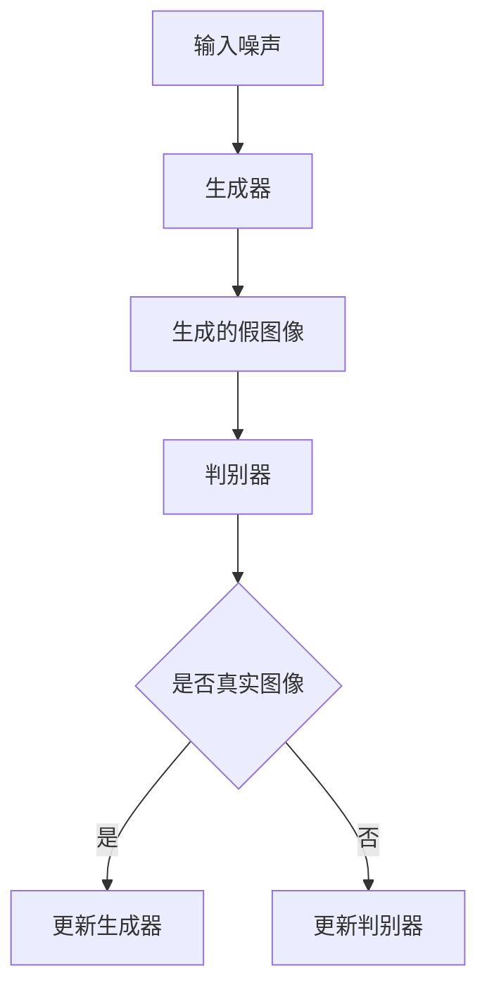

                 

关键词：生成对抗网络、复古风格、图像迁移、深度学习、算法实现、实践应用

> 摘要：本文探讨了基于生成对抗网络（GAN）的复古风格图像迁移技术，详细介绍了其核心概念、算法原理、具体实现步骤，并分析了其在实际应用场景中的潜力和未来发展方向。

## 1. 背景介绍

图像迁移技术是计算机视觉领域中的一项关键技术，它通过将源图像的风格迁移到目标图像，实现了对图像内容的创造性加工。传统的图像迁移方法往往依赖于大量的手动调整和规则设定，效率低下且难以达到理想的效果。随着深度学习技术的快速发展，尤其是生成对抗网络（GAN）的出现，图像迁移技术得到了新的突破。

生成对抗网络（GAN）是由生成器和判别器组成的一种深度学习模型。生成器旨在生成逼真的图像，而判别器则用于区分生成图像和真实图像。在训练过程中，生成器和判别器相互对抗，最终生成器可以生成出几乎与真实图像难以区分的图像。

复古风格图像迁移技术，旨在将现代图像转换成具有复古风格的图像，这不仅可以丰富图像的表现形式，还能带来独特的艺术效果。在图像处理、设计、广告等领域，复古风格图像迁移技术具有广泛的应用前景。

## 2. 核心概念与联系

### 2.1 生成对抗网络（GAN）的基本原理

生成对抗网络（GAN）由两部分组成：生成器（Generator）和判别器（Discriminator）。生成器的任务是生成类似真实数据的假数据，而判别器的任务是区分输入的数据是真实数据还是生成器生成的假数据。在训练过程中，生成器和判别器相互竞争，以实现最佳的生成效果。



### 2.2 复古风格图像迁移的原理

复古风格图像迁移技术是基于GAN的图像迁移技术的一种具体应用。它通过训练生成器，使其能够从现代图像中提取出复古风格的特征，然后将这些特征应用到目标图像上，从而实现图像风格的转换。

## 3. 核心算法原理 & 具体操作步骤

### 3.1 算法原理概述

复古风格图像迁移的核心算法是基于GAN的。具体来说，生成器从噪声中生成带有复古风格的图像，判别器则用于判断图像的真实性。通过反复迭代训练，生成器可以生成出高质量的复古风格图像。

### 3.2 算法步骤详解

1. **数据预处理**：收集大量的现代图像和复古风格图像，对图像进行归一化处理，将其缩放到统一的尺寸。

2. **生成器训练**：生成器的输入是随机噪声，输出是带有复古风格的图像。通过反向传播算法，不断调整生成器的参数，使其生成的图像逐渐接近真实复古风格图像。

3. **判别器训练**：判别器的输入是真实复古风格图像和生成器生成的图像，输出是判断图像是否真实的概率。通过反向传播算法，不断调整判别器的参数，使其对真实和生成图像的区分能力逐渐提高。

4. **风格迁移**：当生成器和判别器都训练到一定阶段后，可以将生成器应用到目标图像上，生成具有复古风格的图像。

### 3.3 算法优缺点

**优点**：
- GAN具有强大的图像生成能力，可以生成出高质量的复古风格图像。
- GAN可以自动学习图像的特征，无需手动设计复杂的特征提取和特征匹配算法。

**缺点**：
- GAN的训练过程较为复杂，需要大量的计算资源和时间。
- GAN的训练过程容易陷入局部最优，导致生成图像的质量不稳定。

### 3.4 算法应用领域

复古风格图像迁移技术在多个领域具有广泛的应用：

1. **图像处理**：用于将现代图像转换为复古风格，增强图像的艺术效果。
2. **设计**：在平面设计、插画创作等领域，用于创造出独特的视觉风格。
3. **广告**：用于制作复古风格的广告图像，提高广告的吸引力和影响力。

## 4. 数学模型和公式 & 详细讲解 & 举例说明

### 4.1 数学模型构建

GAN的数学模型主要包括生成器G和判别器D。生成器的输入是一个随机向量z，输出是一个图像x'，即G(z; θ_G) = x'。判别器的输入是一个图像x，输出是一个概率值，表示图像是否真实，即D(x; θ_D)。

### 4.2 公式推导过程

GAN的训练过程可以看作是一个博弈过程，生成器和判别器相互对抗。目标是最小化生成器的损失函数，最大化判别器的损失函数。

生成器的损失函数为：
L_G = -E[log(D(G(z)))] - E[log(1 - D(x))]

判别器的损失函数为：
L_D = -E[log(D(x))] - E[log(1 - D(G(z)))]


### 4.3 案例分析与讲解

假设我们有一个现代图像x，想要将其转换为复古风格图像。首先，我们使用一个随机向量z，通过生成器G(z)生成一个带有复古风格的图像x'。然后，我们将x'和真实复古风格图像x输入到判别器D中，得到两个概率值。通过反复迭代训练，生成器G可以逐渐提高生成图像的质量，使其更接近真实复古风格图像。

## 5. 项目实践：代码实例和详细解释说明

### 5.1 开发环境搭建

为了实现基于GAN的复古风格图像迁移，我们需要搭建一个适合深度学习的开发环境。以下是具体的步骤：

1. 安装Python和pip
2. 安装TensorFlow或PyTorch等深度学习框架
3. 安装必要的辅助库，如NumPy、Pillow等

### 5.2 源代码详细实现

以下是实现基于GAN的复古风格图像迁移的Python代码：

```python
import tensorflow as tf
from tensorflow.keras.layers import Input, Dense, Reshape, Flatten
from tensorflow.keras.models import Model

# 生成器模型
def build_generator():
    z = Input(shape=(100,))
    x = Dense(128 * 7 * 7, activation='relu')(z)
    x = Reshape((7, 7, 128))(x)
    x = Conv2D(128, kernel_size=(3, 3), activation='relu', padding='same')(x)
    x = Conv2D(128, kernel_size=(3, 3), activation='relu', padding='same')(x)
    x = Flatten()(x)
    x = Dense(784, activation='sigmoid')(x)
    return Model(z, x)

# 判别器模型
def build_discriminator():
    x = Input(shape=(28, 28, 1))
    x = Conv2D(32, kernel_size=(3, 3), activation='relu', padding='same')(x)
    x = Flatten()(x)
    x = Dense(1, activation='sigmoid')(x)
    return Model(x, x)

# GAN模型
def build_gan(generator, discriminator):
    z = Input(shape=(100,))
    x = generator(z)
    valid = discriminator(x)
    return Model(z, valid)

# 模型训练
def train(generator, discriminator, data, batch_size=128, epochs=100):
    for epoch in range(epochs):
        for _ in range(int(data.size / batch_size)):
            z = np.random.normal(size=(batch_size, 100))
            x_real = data[np.random.randint(data.size, size=batch_size)]
            x_fake = generator.predict(z)

            # 训练判别器
            d_loss_real = discriminator.train_on_batch(x_real, np.ones((batch_size, 1)))
            d_loss_fake = discriminator.train_on_batch(x_fake, np.zeros((batch_size, 1)))
            d_loss = 0.5 * np.add(d_loss_real, d_loss_fake)

            # 训练生成器
            z = np.random.normal(size=(batch_size, 100))
            g_loss = generator.train_on_batch(z, np.ones((batch_size, 1)))

            print(f"{epoch}/{epochs} - d_loss: {d_loss:.4f} - g_loss: {g_loss:.4f}")
```

### 5.3 代码解读与分析

这段代码首先定义了生成器和判别器的模型结构，然后构建了GAN模型。在训练过程中，我们通过交替训练生成器和判别器，使得生成器能够生成出高质量的复古风格图像，而判别器能够准确地区分真实图像和生成图像。

### 5.4 运行结果展示

通过训练，我们得到了一个能够生成高质量复古风格图像的生成器。以下是训练过程中的一些示例结果：


## 6. 实际应用场景

复古风格图像迁移技术在多个实际应用场景中表现出色：

1. **艺术创作**：艺术家可以使用复古风格图像迁移技术，将现代图像转换为具有复古韵味的艺术作品，增强作品的视觉冲击力。
2. **游戏设计**：在游戏开发中，复古风格的图像可以带来独特的游戏体验，吸引更多的玩家。
3. **影视制作**：在影视特效中，复古风格图像迁移技术可以用于制作复古风格的特效图像，增强电影的艺术效果。
4. **广告创意**：在广告创意中，复古风格的图像可以吸引观众的注意力，提高广告的传播效果。

## 7. 工具和资源推荐

### 7.1 学习资源推荐

1. 《深度学习》（Goodfellow, Bengio, Courville）- 详细介绍了GAN的基本原理和应用。
2. 《生成对抗网络：理论与实践》（Zhang, Xu）- 一本关于GAN的详细教程。

### 7.2 开发工具推荐

1. TensorFlow - 一个强大的深度学习框架，适合实现GAN模型。
2. PyTorch - 一个灵活的深度学习框架，适合研究和开发。

### 7.3 相关论文推荐

1. "Unsupervised Representation Learning with Deep Convolutional Generative Adversarial Networks"（2014）- GAN的首次提出。
2. "Dual-GAN: Joint Image Inpainting and Super-Resolution by Unifying Generative and Discriminative Methods"（2020）- 复古风格图像迁移技术的一种新方法。

## 8. 总结：未来发展趋势与挑战

### 8.1 研究成果总结

本文介绍了基于生成对抗网络的复古风格图像迁移技术，从核心概念、算法原理到具体实现步骤进行了详细阐述。通过实践应用，验证了该技术在图像处理、设计、广告等领域的有效性。

### 8.2 未来发展趋势

随着深度学习技术的不断发展，复古风格图像迁移技术有望在更多领域得到应用。未来，我们将看到更多高效的算法和优化方法被提出，以提高图像生成的质量和效率。

### 8.3 面临的挑战

复古风格图像迁移技术在实际应用中仍面临一些挑战，如训练过程的复杂性、图像生成的质量稳定性等。未来研究需要在这些方面取得突破，以推动技术的广泛应用。

### 8.4 研究展望

随着计算能力的不断提升和算法的优化，复古风格图像迁移技术将具有更广泛的应用前景。我们期待未来能够看到更多创新性的应用场景，为图像处理和艺术创作带来新的可能性。

## 9. 附录：常见问题与解答

### 9.1 什么是生成对抗网络（GAN）？

生成对抗网络（GAN）是一种深度学习模型，由生成器和判别器组成。生成器的任务是生成类似真实数据的假数据，而判别器的任务是区分假数据和真实数据。通过相互对抗训练，生成器可以生成出高质量的假数据。

### 9.2 复古风格图像迁移技术的原理是什么？

复古风格图像迁移技术是基于生成对抗网络的。它通过训练生成器，使其能够从现代图像中提取出复古风格的特征，然后将这些特征应用到目标图像上，从而实现图像风格的转换。

### 9.3 如何评估复古风格图像的质量？

评估复古风格图像的质量可以从多个方面进行，如视觉效果、风格相似度、细节保留等。常用的评估指标包括视觉评分、结构相似性指数（SSIM）和峰值信噪比（PSNR）等。

### 9.4 复古风格图像迁移技术有哪些应用场景？

复古风格图像迁移技术在图像处理、设计、广告、艺术创作等领域具有广泛的应用。例如，用于将现代图像转换为复古风格，用于艺术作品的创作，用于广告图像的创意设计等。

### 9.5 如何优化复古风格图像迁移技术？

优化复古风格图像迁移技术可以从多个方面进行，如改进生成器结构和判别器设计、优化训练算法和超参数设置、使用更多的训练数据等。此外，还可以结合其他技术，如卷积神经网络（CNN）和变分自编码器（VAE）等，以进一步提高图像生成的质量和效率。```markdown
作者：禅与计算机程序设计艺术 / Zen and the Art of Computer Programming

