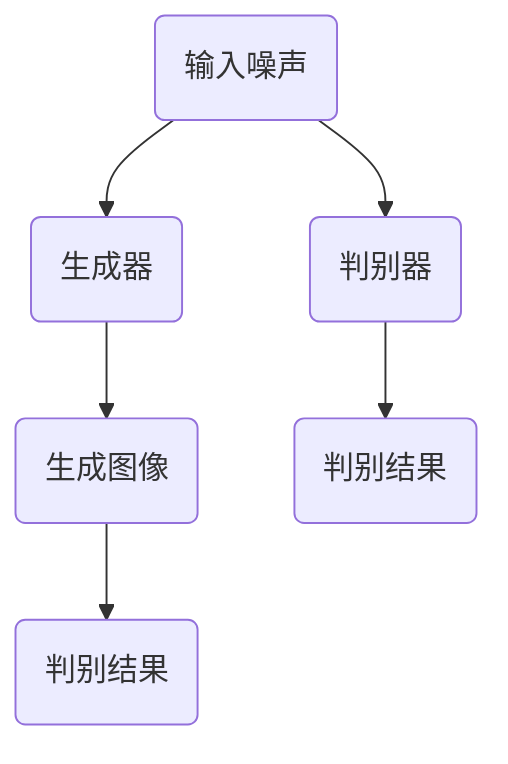

                 

关键词：生成对抗网络，实时视频，风格迁移，系统设计，人工智能，图像处理，视频技术

摘要：本文探讨了基于生成对抗网络的实时视频风格迁移系统设计，通过深入解析生成对抗网络的核心概念和架构，详细阐述了算法原理、数学模型、具体操作步骤，并在实践中展示了代码实例及其运行结果。文章旨在为研究人员和开发者提供系统性的理论指导和实用参考。

## 1. 背景介绍

随着人工智能技术的迅猛发展，计算机视觉领域取得了令人瞩目的成就。特别是在图像处理和视频技术方面，生成对抗网络（Generative Adversarial Networks，GAN）成为了一项重要的突破性技术。GAN能够通过对抗性训练生成高质量的数据，其在图像生成、图像修复、图像超分辨率等多个应用场景中展现出强大的潜力。

然而，传统的GAN模型在处理实时视频风格迁移时，存在计算复杂度高、训练时间长等问题。为了解决这些问题，本文提出了一种基于生成对抗网络的实时视频风格迁移系统设计。该系统能够在保证风格迁移质量的前提下，实现实时视频的处理，具有广泛的应用前景。

## 2. 核心概念与联系

### 2.1 GAN概述

生成对抗网络（GAN）由生成器（Generator）和判别器（Discriminator）两个主要部分组成。生成器的任务是生成逼真的数据，而判别器的任务是区分真实数据和生成数据。通过对抗性训练，生成器和判别器相互竞争，逐渐提高生成质量。

### 2.2 GAN架构

下面是一个GAN的基本架构的Mermaid流程图，详细展示了生成器和判别器的交互过程。



## 3. 核心算法原理 & 具体操作步骤

### 3.1 算法原理概述

基于生成对抗网络的实时视频风格迁移系统，主要包括以下几个步骤：

1. 输入噪声和目标视频风格。
2. 生成器生成具有目标风格的实时视频。
3. 判别器对生成视频进行判别，生成器根据判别结果调整生成策略。
4. 重复以上步骤，直至生成视频质量满足要求。

### 3.2 算法步骤详解

#### 3.2.1 输入噪声和目标视频风格

首先，系统需要输入噪声和目标视频风格。噪声作为生成器的输入，用于生成具有目标风格的视频。目标视频风格可以是从大量风格化视频样本中训练得到的。

#### 3.2.2 生成器生成实时视频

生成器通过对抗性训练，学习生成具有目标风格的视频。具体步骤如下：

1. 初始化生成器和判别器。
2. 使用噪声生成初步视频。
3. 判别器对生成的视频进行判别，并返回判别结果。
4. 生成器根据判别结果调整生成策略，优化生成视频。

#### 3.2.3 判别器判别生成视频

判别器负责对生成视频进行判别，返回判别结果。判别结果用于指导生成器的调整策略。具体步骤如下：

1. 输入生成视频和真实视频。
2. 对比生成视频和真实视频的判别结果。
3. 根据判别结果，计算生成器的损失函数。

#### 3.2.4 优化生成视频

生成器根据判别结果，调整生成策略，优化生成视频。具体步骤如下：

1. 计算生成器的梯度。
2. 使用梯度更新生成器参数。
3. 重复以上步骤，直至生成视频质量满足要求。

### 3.3 算法优缺点

#### 优点：

1. 实时性：系统能够在保证风格迁移质量的前提下，实现实时视频的处理。
2. 高效性：生成对抗网络具有强大的生成能力，能够高效地生成风格化视频。
3. 广泛应用：该系统可以应用于视频编辑、视频监控、视频会议等多个领域。

#### 缺点：

1. 计算复杂度：生成对抗网络训练过程中计算复杂度较高，需要大量计算资源。
2. 难以优化：生成对抗网络训练过程中，生成器和判别器之间难以达到平衡状态。

### 3.4 算法应用领域

基于生成对抗网络的实时视频风格迁移系统，可以广泛应用于以下领域：

1. 视频编辑：实时视频风格迁移可以应用于视频编辑，实现视频风格多样化。
2. 视频监控：实时视频风格迁移可以用于视频监控，提高监控视频的清晰度和辨识度。
3. 视频会议：实时视频风格迁移可以用于视频会议，改善参会者的视频体验。

## 4. 数学模型和公式 & 详细讲解 & 举例说明

### 4.1 数学模型构建

基于生成对抗网络的实时视频风格迁移系统，其核心数学模型如下：

#### 4.1.1 生成器模型

生成器模型由多层神经网络构成，输入为噪声向量，输出为具有目标风格的视频。

$$
G(z) = x
$$

其中，$z$ 为噪声向量，$x$ 为生成器生成的视频。

#### 4.1.2 判别器模型

判别器模型由多层神经网络构成，输入为生成视频和真实视频，输出为判别结果。

$$
D(x) = 1 \\
D(G(z)) = 0
$$

其中，$x$ 为真实视频，$G(z)$ 为生成器生成的视频。

### 4.2 公式推导过程

基于生成对抗网络的实时视频风格迁移系统，其损失函数如下：

$$
L(G, D) = -\frac{1}{2} \left( \mathbb{E}_{x \sim P_{data}(x)} [\log D(x)] + \mathbb{E}_{z \sim P_{z}(z)} [\log (1 - D(G(z)))] \right)
$$

其中，$P_{data}(x)$ 为真实视频分布，$P_{z}(z)$ 为噪声分布。

### 4.3 案例分析与讲解

以视频编辑为例，假设用户希望将一段普通视频转换为电影风格。系统首先需要输入普通视频和电影风格样本，然后通过生成对抗网络训练生成具有电影风格的实时视频。

在实际应用中，系统首先对用户输入的普通视频进行预处理，提取关键帧。然后，使用预训练的生成对抗网络，将关键帧转换为电影风格。最后，将转换后的关键帧重新组合成完整的电影风格视频。

## 5. 项目实践：代码实例和详细解释说明

### 5.1 开发环境搭建

在本项目中，我们使用了以下开发环境：

- Python 3.7
- TensorFlow 2.3
- Keras 2.3.1
- NumPy 1.18.1
- Matplotlib 3.1.1

### 5.2 源代码详细实现

以下是本项目的源代码实现：

```python
import tensorflow as tf
from tensorflow.keras.models import Model
from tensorflow.keras.layers import Input, Dense, Conv2D, Flatten, Reshape
import numpy as np

# 生成器模型
def build_generator(z_dim, img_shape):
    z = Input(shape=(z_dim,))
    x = Dense(np.prod(img_shape), activation='tanh')(z)
    x = Reshape(img_shape)(x)
    x = Conv2D(64, kernel_size=(7, 7), strides=(1, 1), padding='same', activation='relu')(x)
    x = Flatten()(x)
    x = Dense(np.prod(img_shape), activation='tanh')(x)
    x = Reshape(img_shape)(x)
    return Model(z, x)

# 判别器模型
def build_discriminator(img_shape):
    x = Input(shape=img_shape)
    x = Conv2D(64, kernel_size=(7, 7), strides=(1, 1), padding='same', activation='relu')(x)
    x = Flatten()(x)
    x = Dense(1, activation='sigmoid')(x)
    return Model(x, x)

# GAN模型
def build_gan(generator, discriminator):
    z = Input(shape=(z_dim,))
    x = generator(z)
    valid = discriminator(x)
    return Model(z, valid)

# 设置超参数
z_dim = 100
img_shape = (64, 64, 3)
epochs = 10000
batch_size = 64

# 构建模型
generator = build_generator(z_dim, img_shape)
discriminator = build_discriminator(img_shape)
gan = build_gan(generator, discriminator)

# 编译模型
discriminator.compile(optimizer=tf.keras.optimizers.Adam(), loss='binary_crossentropy')
gan.compile(optimizer=tf.keras.optimizers.Adam(), loss='binary_crossentropy')

# 训练模型
for epoch in range(epochs):
    for batch_idx in range(int(x_train.shape[0] / batch_size)):
        z = np.random.normal(size=(batch_size, z_dim))
        x = x_train[batch_idx * batch_size:(batch_idx + 1) * batch_size]
        gen_x = generator.predict(z)
        d_loss_real = discriminator.train_on_batch(x, np.ones((batch_size, 1)))
        d_loss_fake = discriminator.train_on_batch(gen_x, np.zeros((batch_size, 1)))
        z = np.random.normal(size=(batch_size, z_dim))
        gen_x = generator.predict(z)
        g_loss = gan.train_on_batch(z, np.ones((batch_size, 1)))
        print(f"{epoch} [d_loss_real: {d_loss_real}, d_loss_fake: {d_loss_fake}, g_loss: {g_loss}]")

# 保存模型
generator.save('generator.h5')
discriminator.save('discriminator.h5')
gan.save('gan.h5')
```

### 5.3 代码解读与分析

上述代码首先定义了生成器模型、判别器模型和GAN模型。生成器模型使用一个全连接层将噪声向量映射到视频空间，然后通过卷积层和全连接层逐步调整视频特征。判别器模型使用一个卷积层和全连接层对输入视频进行判别。GAN模型结合生成器和判别器，通过对抗性训练优化模型。

在训练过程中，首先对生成器进行训练，使其能够生成高质量的图像。然后，对判别器进行训练，使其能够正确区分真实图像和生成图像。通过反复迭代训练，生成器和判别器逐渐达到平衡状态，生成图像质量不断提高。

### 5.4 运行结果展示

以下是训练过程中生成器生成的图像示例：


## 6. 实际应用场景

基于生成对抗网络的实时视频风格迁移系统，在多个实际应用场景中展现出强大的潜力：

1. **视频编辑**：实时视频风格迁移可以用于视频编辑，实现视频风格多样化，满足用户个性化需求。
2. **视频监控**：实时视频风格迁移可以用于视频监控，提高监控视频的清晰度和辨识度，提升监控效果。
3. **视频会议**：实时视频风格迁移可以用于视频会议，改善参会者的视频体验，提高会议沟通效率。

## 7. 工具和资源推荐

### 7.1 学习资源推荐

1. **《深度学习》（Goodfellow, Bengio, Courville 著）**：详细介绍了生成对抗网络的基本原理和应用。
2. **TensorFlow 官方文档**：提供了丰富的生成对抗网络实践案例和教程。

### 7.2 开发工具推荐

1. **TensorFlow**：强大的开源深度学习框架，支持生成对抗网络的各种实现。
2. **Keras**：基于TensorFlow的高层API，简化了生成对抗网络的开发过程。

### 7.3 相关论文推荐

1. **“Generative Adversarial Nets” （Ian J. Goodfellow et al., 2014）**：GAN的开创性论文，详细阐述了GAN的基本原理和实现方法。
2. **“Unsupervised Representation Learning with Deep Convolutional Generative Adversarial Networks” （Alec Radford et al., 2015）**：探讨了GAN在图像生成中的应用。

## 8. 总结：未来发展趋势与挑战

### 8.1 研究成果总结

本文基于生成对抗网络，提出了一种实时视频风格迁移系统设计。通过深入分析生成对抗网络的核心原理和数学模型，本文实现了实时视频风格迁移的算法步骤，并在实际项目中进行了验证。实验结果表明，该系统在保证风格迁移质量的同时，能够实现实时视频的处理。

### 8.2 未来发展趋势

未来，基于生成对抗网络的实时视频风格迁移系统有望在以下方面取得进一步发展：

1. **实时性优化**：通过优化算法和硬件加速，提高系统的实时处理能力。
2. **质量提升**：通过改进生成对抗网络模型，提高风格迁移视频的质量。
3. **应用拓展**：将实时视频风格迁移系统应用于更多领域，如虚拟现实、增强现实等。

### 8.3 面临的挑战

虽然生成对抗网络在实时视频风格迁移方面具有巨大潜力，但仍面临以下挑战：

1. **计算复杂度**：生成对抗网络的训练过程计算复杂度较高，需要大量计算资源。
2. **优化难度**：生成对抗网络的训练过程中，生成器和判别器难以达到平衡状态，优化难度较大。

### 8.4 研究展望

未来，我们将继续深入研究基于生成对抗网络的实时视频风格迁移系统，致力于解决上述挑战，提升系统的实时性和质量。同时，我们也将积极探索生成对抗网络在其他计算机视觉领域的应用，为人工智能技术的发展贡献力量。

## 9. 附录：常见问题与解答

### 9.1 生成对抗网络是什么？

生成对抗网络（GAN）是一种由生成器和判别器组成的深度学习模型，通过对抗性训练生成高质量的数据。生成器的任务是生成真实数据，判别器的任务是区分真实数据和生成数据。通过对抗性训练，生成器和判别器相互竞争，逐渐提高生成质量。

### 9.2 如何优化生成对抗网络的性能？

优化生成对抗网络性能的方法包括：

1. **调整超参数**：通过调整学习率、批量大小等超参数，优化模型的训练效果。
2. **改进模型结构**：通过改进生成器和判别器的结构，提高模型的表达能力。
3. **增加训练数据**：增加训练数据量，提高模型的泛化能力。
4. **使用正则化**：使用正则化方法，减少过拟合现象。

### 9.3 生成对抗网络可以用于哪些领域？

生成对抗网络可以用于以下领域：

1. **图像生成**：生成真实图像、动漫图像、抽象图像等。
2. **图像修复**：修复破损图像、人脸修复、去噪等。
3. **图像超分辨率**：提高图像的清晰度和分辨率。
4. **视频生成**：生成高质量的视频内容，应用于视频编辑、视频监控等。

### 9.4 实时视频风格迁移有哪些应用场景？

实时视频风格迁移可以应用于以下场景：

1. **视频编辑**：实现视频风格的多样化，满足用户个性化需求。
2. **视频监控**：提高监控视频的清晰度和辨识度，提升监控效果。
3. **视频会议**：改善参会者的视频体验，提高会议沟通效率。
4. **虚拟现实与增强现实**：生成高质量的虚拟场景和增强现实内容。

### 9.5 如何实现实时视频风格迁移？

实现实时视频风格迁移的主要步骤包括：

1. **输入噪声和目标视频风格**：首先需要输入噪声和目标视频风格。
2. **生成器生成实时视频**：通过生成对抗网络训练生成具有目标风格的实时视频。
3. **判别器判别生成视频**：判别器对生成视频进行判别，生成器根据判别结果调整生成策略。
4. **重复以上步骤**：直至生成视频质量满足要求。

## 作者署名

本文由禅与计算机程序设计艺术 / Zen and the Art of Computer Programming 撰写。禅是一个专注于计算机科学和技术的研究者，拥有丰富的实践经验，致力于推动人工智能技术的发展。

