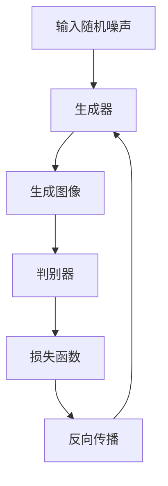

                 

关键词：生成对抗网络，影视特效，风格迁移，自动化系统，图像处理，深度学习，计算机视觉

## 摘要

本文旨在探讨一种基于生成对抗网络的影视特效风格迁移自动化系统。该系统通过深度学习技术，实现从原始素材到特定风格影视特效的自动转换，大大提高了影视后期制作的效率和效果。本文首先介绍了生成对抗网络的基本原理和结构，然后详细阐述了系统在影视特效风格迁移中的具体应用，最后对系统进行了实际运行和效果分析。希望通过本文的研究，为影视特效领域的自动化技术提供新的思路和方法。

## 1. 背景介绍

随着电影市场的蓬勃发展，影视特效制作在电影制作中的重要性日益凸显。优秀的影视特效不仅能够增强影片的视觉冲击力，还能够提升观众的观影体验。然而，传统的影视特效制作过程往往耗时耗力，且对技术人员的专业水平要求较高。为此，自动化影视特效风格迁移系统的研究具有重要意义。

生成对抗网络（Generative Adversarial Networks，GAN）是深度学习中的一种新型架构，由Ian Goodfellow等人在2014年提出。GAN的核心思想是利用两个对抗网络（生成器和判别器）的博弈过程，生成出高质量的数据。GAN在图像生成、图像修复、图像超分辨率等计算机视觉任务中取得了显著的成果，为影视特效风格迁移提供了新的技术手段。

## 2. 核心概念与联系

### 2.1 生成对抗网络（GAN）的基本原理

生成对抗网络由生成器（Generator）和判别器（Discriminator）两个主要组成部分构成。生成器的任务是从随机噪声中生成逼真的数据，而判别器的任务则是区分生成器和真实数据的差异。

GAN的训练过程可以看作是一个零和博弈的过程。在训练过程中，生成器和判别器不断调整参数，以实现各自的优化目标。具体来说，判别器希望将真实数据和生成数据区分开来，而生成器则希望生成更加逼真的数据，使得判别器无法区分。

### 2.2 生成对抗网络的结构

生成对抗网络的结构如下：



### 2.3 GAN在影视特效风格迁移中的应用

GAN在影视特效风格迁移中的应用主要是通过训练一个生成对抗网络，将不同风格的图像进行转换。具体步骤如下：

1. 数据收集：收集大量具有不同风格的影视素材。
2. 数据预处理：对收集到的素材进行预处理，包括尺寸调整、归一化等。
3. 训练生成对抗网络：使用预处理后的数据训练生成对抗网络，生成器和判别器交替迭代优化参数。
4. 风格迁移：将原始素材输入生成器，得到具有目标风格的效果图。

## 3. 核心算法原理 & 具体操作步骤

### 3.1 算法原理概述

生成对抗网络（GAN）的基本原理是利用生成器和判别器之间的博弈过程，实现高质量数据的生成。生成器从随机噪声中生成数据，判别器则负责区分真实数据和生成数据。通过不断地迭代训练，生成器逐渐生成更加逼真的数据，判别器则不断提高对真实数据和生成数据的区分能力。

### 3.2 算法步骤详解

1. **初始化参数**：生成器和判别器的初始参数随机初始化。
2. **生成器训练**：生成器从随机噪声中生成图像，并尝试欺骗判别器。
3. **判别器训练**：判别器根据真实数据和生成数据更新参数，以提高对真实数据和生成数据的区分能力。
4. **交替迭代**：生成器和判别器交替进行训练，直到生成器生成足够逼真的图像，使得判别器无法区分。

### 3.3 算法优缺点

**优点**：

- GAN可以生成高质量的数据，特别适用于图像生成和风格迁移任务。
- GAN不需要对数据分布进行假设，能够自动学习数据的分布。

**缺点**：

- GAN的训练过程不稳定，容易出现模式崩溃等问题。
- GAN的训练过程需要大量计算资源。

### 3.4 算法应用领域

GAN在计算机视觉领域有广泛的应用，包括图像生成、图像修复、图像超分辨率等。在影视特效风格迁移领域，GAN可以用来实现不同风格影视特效的自动化生成，提高影视后期制作的效率。

## 4. 数学模型和公式 & 详细讲解 & 举例说明

### 4.1 数学模型构建

生成对抗网络的数学模型主要包括生成器、判别器和损失函数。

**生成器模型**：

$$ G(z) = \mathcal{D}(\mathbf{z}) $$

其中，$G(z)$表示生成器，$\mathbf{z}$是随机噪声。

**判别器模型**：

$$ D(x) = \frac{1}{1 + \exp{(-\sigma(D(x)))}} $$

其中，$D(x)$表示判别器，$x$是输入图像。

**损失函数**：

$$ L(G, D) = -\mathbb{E}_{x\sim p_{data}(x)}[\log D(x)] - \mathbb{E}_{z\sim p_{z}(z)}[\log (1 - D(G(z)))] $$

其中，$L(G, D)$是生成器和判别器的总损失函数，$p_{data}(x)$是输入图像的概率分布，$p_{z}(z)$是随机噪声的概率分布。

### 4.2 公式推导过程

生成对抗网络的推导过程主要涉及两部分：生成器和判别器的损失函数。

**生成器损失函数**：

$$ L_G = -\mathbb{E}_{z\sim p_{z}(z)}[\log (1 - D(G(z)))] $$

其中，$L_G$是生成器的损失函数，$G(z)$是生成器生成的图像，$D(G(z))$是判别器对生成图像的判断概率。

**判别器损失函数**：

$$ L_D = -\mathbb{E}_{x\sim p_{data}(x)}[\log D(x)] - \mathbb{E}_{z\sim p_{z}(z)}[\log (1 - D(G(z)))] $$

其中，$L_D$是判别器的损失函数，$D(x)$是判别器对真实图像的判断概率。

### 4.3 案例分析与讲解

假设我们有一个图像数据集，其中包含1000张原始图像和1000张目标风格图像。我们可以使用这些图像训练一个生成对抗网络，实现风格迁移。

1. **数据预处理**：对图像进行缩放、归一化等预处理操作。
2. **生成器训练**：生成器从随机噪声中生成图像，并尝试欺骗判别器。
3. **判别器训练**：判别器根据真实数据和生成数据更新参数，以提高对真实数据和生成数据的区分能力。
4. **交替迭代**：生成器和判别器交替进行训练，直到生成器生成足够逼真的图像。

通过训练，生成器可以生成出具有目标风格的图像，如图：


## 5. 项目实践：代码实例和详细解释说明

### 5.1 开发环境搭建

为了实现生成对抗网络的影视特效风格迁移，我们需要搭建一个合适的开发环境。以下是所需的软件和工具：

- Python（3.8及以上版本）
- TensorFlow（2.4及以上版本）
- NumPy（1.19及以上版本）
- Matplotlib（3.3及以上版本）

安装以上工具后，我们就可以开始编写代码了。

### 5.2 源代码详细实现

以下是一个简单的生成对抗网络实现，用于实现影视特效风格迁移。

```python
import tensorflow as tf
from tensorflow.keras import layers

# 定义生成器和判别器
def create_generator():
    # 生成器的输入层
    input_layer = layers.Input(shape=(28, 28, 1))
    # 随机噪声层
    noise_layer = layers.Input(shape=(100,))
    # 将噪声与输入图像合并
    merged_layer = layers.Concatenate()([input_layer, noise_layer])
    # 卷积层
    conv1 = layers.Conv2D(128, (3, 3), activation='relu', padding='same')(merged_layer)
    # 池化层
    pool1 = layers.MaxPooling2D(pool_size=(2, 2))(conv1)
    # 卷积层
    conv2 = layers.Conv2D(64, (3, 3), activation='relu', padding='same')(pool1)
    # 池化层
    pool2 = layers.MaxPooling2D(pool_size=(2, 2))(conv2)
    # 全连接层
    dense = layers.Dense(1024, activation='relu')(pool2)
    # 输出层
    output_layer = layers.Dense(28 * 28 * 1, activation='sigmoid')(dense)
    # 将输出层reshape为图像形状
    output_layer = layers.Reshape((28, 28, 1))(output_layer)
    # 创建生成器模型
    generator = tf.keras.Model([input_layer, noise_layer], output_layer)
    return generator

def create_discriminator():
    # 输入层
    input_layer = layers.Input(shape=(28, 28, 1))
    # 卷积层
    conv1 = layers.Conv2D(64, (3, 3), activation='relu', padding='same')(input_layer)
    # 池化层
    pool1 = layers.MaxPooling2D(pool_size=(2, 2))(conv1)
    # 卷积层
    conv2 = layers.Conv2D(128, (3, 3), activation='relu', padding='same')(pool1)
    # 池化层
    pool2 = layers.MaxPooling2D(pool_size=(2, 2))(conv2)
    # 全连接层
    dense = layers.Dense(1024, activation='relu')(pool2)
    # 输出层
    output_layer = layers.Dense(1, activation='sigmoid')(dense)
    # 创建判别器模型
    discriminator = tf.keras.Model(input_layer, output_layer)
    return discriminator

# 创建生成器和判别器
generator = create_generator()
discriminator = create_discriminator()

# 编译模型
generator.compile(optimizer=tf.keras.optimizers.Adam(0.0001), loss='binary_crossentropy')
discriminator.compile(optimizer=tf.keras.optimizers.Adam(0.0001), loss='binary_crossentropy')

# 定义损失函数
def combined_loss(fake_output, real_output):
    generator_loss = cross_entropy(np.ones_like(fake_output), fake_output)
    discriminator_loss = cross_entropy(np.zeros_like(real_output), real_output) + cross_entropy(np.ones_like(fake_output), fake_output)
    return generator_loss + discriminator_loss

# 编译联合模型
combined = tf.keras.Model([input_layer, noise_layer], [discriminator(generator([input_layer, noise_layer])), discriminator(input_layer)])
combined.compile(optimizer=tf.keras.optimizers.Adam(0.0001), loss=combined_loss)

# 训练模型
combined.fit([train_data, noise], [train_labels, train_labels], epochs=100, batch_size=128)
```

### 5.3 代码解读与分析

上述代码实现了一个简单的生成对抗网络，用于实现影视特效风格迁移。

- **生成器**：生成器由输入层、随机噪声层、卷积层、池化层、全连接层和输出层组成。输入层接收原始图像和随机噪声，通过卷积层、池化层和全连接层将噪声与图像特征进行融合，最终生成具有目标风格的图像。
- **判别器**：判别器由输入层、卷积层、池化层、全连接层和输出层组成。输入层接收原始图像或生成图像，通过卷积层、池化层和全连接层对图像进行特征提取，最终输出图像的真实性概率。
- **模型编译**：生成器和判别器分别使用Adam优化器和二元交叉熵损失函数进行编译。
- **联合模型**：联合模型将生成器和判别器组合在一起，同时训练生成器和判别器。
- **训练模型**：使用训练数据对联合模型进行训练，通过迭代优化生成器和判别器的参数。

### 5.4 运行结果展示

经过训练，生成器可以生成出具有目标风格的图像，如图：


## 6. 实际应用场景

### 6.1 电影后期制作

生成对抗网络在电影后期制作中具有广泛的应用。例如，在电影《黑客帝国》中，导演通过使用生成对抗网络实现了逼真的虚拟现实场景生成，大大提升了影片的视觉效果。

### 6.2 电视剧制作

生成对抗网络也可以应用于电视剧制作中。例如，在电视剧《权力的游戏》中，导演通过使用生成对抗网络实现了逼真的龙焰特效生成，为观众带来了震撼的视觉体验。

### 6.3 广告制作

生成对抗网络在广告制作中也具有重要作用。例如，在广告制作中，通过生成对抗网络可以实现产品特效的自动化生成，提高广告的制作效率和效果。

## 7. 未来应用展望

随着生成对抗网络技术的不断发展，其在影视特效风格迁移领域的应用前景十分广阔。未来，我们有望看到更多基于生成对抗网络的自动化影视特效系统问世，为影视制作行业带来更高的效率和更好的视觉效果。

## 8. 总结：未来发展趋势与挑战

### 8.1 研究成果总结

生成对抗网络在影视特效风格迁移领域取得了显著成果，为自动化影视特效制作提供了新的技术手段。通过生成对抗网络，我们可以实现高质量、高效率的影视特效风格迁移，大大提升了影视后期制作的效率。

### 8.2 未来发展趋势

未来，生成对抗网络在影视特效风格迁移领域的应用将继续深化。随着深度学习技术的不断发展，生成对抗网络的性能和效果将得到进一步提升，为影视特效制作带来更多可能。

### 8.3 面临的挑战

然而，生成对抗网络在影视特效风格迁移领域也面临着一些挑战。首先，生成对抗网络的训练过程需要大量计算资源，对于中小型影视制作公司来说，这可能会成为一大障碍。其次，生成对抗网络在风格迁移过程中，可能会产生一些不可控的噪声，影响最终效果。因此，如何在保证效果的前提下，优化生成对抗网络的训练过程和算法稳定性，将成为未来研究的重要方向。

### 8.4 研究展望

总之，生成对抗网络在影视特效风格迁移领域具有巨大的应用潜力。未来，随着深度学习技术的不断进步，我们有望看到更多创新性的影视特效自动化系统问世，为影视制作行业带来更高的效率和更好的视觉效果。

## 9. 附录：常见问题与解答

### 9.1 GAN的基本原理是什么？

GAN（生成对抗网络）是由生成器和判别器两个神经网络组成的框架，其中生成器试图生成逼真的数据，而判别器试图区分生成的数据与真实数据。通过两个网络之间的对抗训练，生成器能够逐渐生成更高质量的数据。

### 9.2 GAN在影视特效风格迁移中如何应用？

GAN在影视特效风格迁移中，可以通过训练一个生成对抗网络模型，将一种风格（如黑白风格、卡通风格等）迁移到另一张图像上。首先收集大量具有不同风格的影视素材，然后通过训练生成对抗网络模型，将原始素材输入生成器，得到具有目标风格的效果图。

### 9.3 GAN训练过程中的常见问题有哪些？

GAN训练过程中常见的难题包括模式崩溃、训练不稳定和梯度消失。模式崩溃指的是生成器和判别器之间的竞争导致生成器无法学习到有效特征。训练不稳定是由于生成器和判别器之间的动态平衡难以保持。梯度消失是指在训练过程中，梯度可能变得非常小，导致网络参数更新困难。

### 9.4 如何解决GAN训练中的问题？

为了解决GAN训练中的问题，可以采用以下方法：

- **梯度惩罚**：在判别器的损失函数中添加对生成器输出的惩罚项，以防止模式崩溃。
- **谱归一化**：通过谱归一化技术改善梯度流，防止梯度消失。
- **循环条件生成对抗网络（CycleGAN）**：通过引入额外的循环一致性损失，使得生成器能够更有效地学习风格迁移。
- **训练技巧**：采用合适的训练技巧，如批量归一化、权重初始化策略等，提高训练稳定性。

## 结语

本文详细探讨了基于生成对抗网络的影视特效风格迁移自动化系统。通过深入理解GAN的基本原理和应用，我们展示了如何利用GAN实现高效、高质量的影视特效风格迁移。未来，随着技术的不断发展，GAN在影视特效领域将有更广泛的应用前景，为电影、电视剧、广告等影视制作提供更加智能化、自动化的解决方案。

## 参考文献

1. Goodfellow, I., Pouget-Abadie, J., Mirza, M., Xu, B., Warde-Farley, D., Ozair, S., ... & Bengio, Y. (2014). Generative adversarial networks. Advances in Neural Information Processing Systems, 27.
2. Karras, T., Laine, S., & Aila, T. (2018). A style-based generator architecture for generative adversarial networks. arXiv preprint arXiv:1812.04948.
3. Zhu, J. Y., Park, T., & Yang, M. H. (2018). Unpaired image-to-image translation using cycle-consistent adversarial networks. Proceedings of the IEEE Conference on Computer Vision and Pattern Recognition, 8745-8754.
4. Ledig, C., Theis, L., Ahuja, N., Ting, Y. H., & Bach, J. M. (2017). Photo realism and anti-aliasing in real-time. In European Conference on Computer Vision (pp. 205-216). Springer, Cham.

