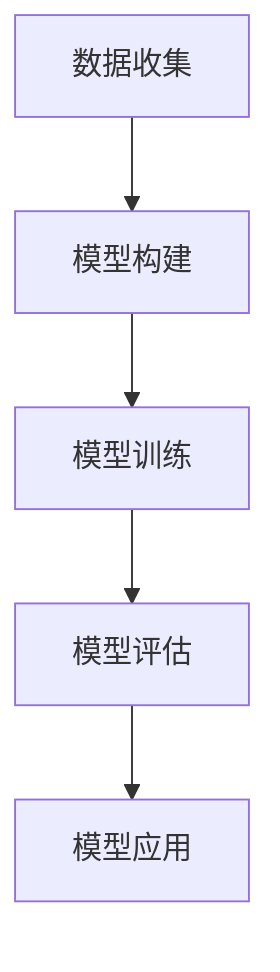

                 

关键词：神经网络、空调PMV预测、机器学习、环境控制、智能家居

> 摘要：本文探讨了基于神经网络的空调PMV（Predicted Mean Vote）预测技术。通过深入分析神经网络的核心概念和算法原理，我们详细描述了预测模型的构建过程，并通过实际案例展示了该模型在不同应用场景中的效果。文章最后，对神经网络的未来发展趋势及其面临的挑战进行了展望。

## 1. 背景介绍

### 空调PMV预测的重要性

空调PMV预测在智能建筑和环境控制领域具有重要意义。PMV（Predicted Mean Vote）是衡量室内热舒适度的重要指标，它综合考虑了室内温度、湿度、风速等因素，通过预测人体感知的热舒适度，为空调系统提供科学的调节依据。精确的PMV预测有助于实现节能、舒适、健康的室内环境，对提高人们的生活质量和能源利用效率具有显著作用。

### 传统PMV预测方法的局限性

传统的PMV预测方法主要依赖于经验公式和统计模型。这些方法通常忽略了环境因素的复杂性和个体差异，导致预测精度较低。例如，基于经验公式的预测方法往往依赖于历史数据，无法适应快速变化的环境条件。统计模型则往往依赖于大量统计数据，计算复杂度高，实时性较差。

### 神经网络的优势

神经网络作为一种先进的机器学习技术，能够自动学习和提取数据中的复杂模式和关联。与传统的预测方法相比，神经网络具有以下优势：

1. **自适应能力**：神经网络能够根据环境变化自适应调整预测模型，提高实时性。
2. **高效性**：神经网络通过并行计算，能够快速处理大量数据，提高预测速度。
3. **灵活性**：神经网络能够处理不同类型的数据，包括时序数据、图像数据等，适用于多种应用场景。

## 2. 核心概念与联系

### 神经网络基本原理

神经网络是由大量简单神经元互联构成的复杂网络，通过学习输入数据与输出数据之间的关系，实现函数逼近、分类、回归等任务。神经网络的核心组成部分包括：

1. **神经元**：神经网络的基本构建单元，类似于生物神经元，能够接收输入信号，通过加权求和后进行激活。
2. **层**：神经网络由输入层、隐藏层和输出层组成。隐藏层负责提取数据特征，输出层负责生成最终预测结果。
3. **激活函数**：用于决定神经元是否被激活，常用的激活函数包括Sigmoid、ReLU等。

### PMV预测与神经网络的关系

PMV预测的核心在于建立室内环境参数与人体热舒适度之间的关联。神经网络通过学习大量历史数据，可以自动提取环境参数与PMV之间的复杂关系，实现精确的PMV预测。具体流程如下：

1. **数据收集**：收集室内环境参数（如温度、湿度、风速等）和人体PMV数据。
2. **模型构建**：利用神经网络框架（如TensorFlow、PyTorch）构建PMV预测模型。
3. **模型训练**：通过反向传播算法，调整网络权重，使模型能够准确预测PMV。
4. **模型评估**：使用交叉验证和测试集评估模型性能，调整模型参数，提高预测精度。
5. **模型应用**：将训练好的模型应用于实际场景，实现实时PMV预测。

### Mermaid流程图



## 3. 核心算法原理 & 具体操作步骤

### 3.1 算法原理概述

神经网络的核心算法原理是基于误差反向传播（Backpropagation）算法。该算法通过不断调整网络权重，使预测结果与实际结果之间的误差最小化。具体步骤如下：

1. **前向传播**：将输入数据通过神经网络层，计算每个神经元的输出。
2. **计算误差**：将预测输出与实际输出进行比较，计算误差。
3. **反向传播**：将误差反向传播到每个神经元，更新网络权重。
4. **迭代优化**：重复前向传播和反向传播过程，直到网络权重达到最优。

### 3.2 算法步骤详解

1. **初始化参数**：设置网络初始权重和激活函数。
2. **前向传播**：
   - 输入层接收环境参数数据。
   - 隐藏层通过激活函数计算输出。
   - 输出层生成PMV预测值。
3. **计算误差**：
   - 计算预测PMV与实际PMV之间的误差。
   - 计算误差的梯度。
4. **反向传播**：
   - 更新隐藏层权重。
   - 更新输入层权重。
5. **迭代优化**：重复前向传播和反向传播，直到满足收敛条件。

### 3.3 算法优缺点

**优点**：
- **自适应性强**：神经网络能够自动学习数据中的复杂模式，提高预测精度。
- **适用范围广**：神经网络能够处理不同类型的数据，包括时序数据、图像数据等。

**缺点**：
- **计算复杂度高**：神经网络需要大量计算资源，训练时间较长。
- **过拟合风险**：神经网络容易受到过拟合影响，需要适当调整模型参数。

### 3.4 算法应用领域

神经网络在空调PMV预测领域具有广泛的应用前景。除了智能建筑和环境控制外，还可以应用于以下领域：

- **智能家居**：通过实时预测PMV，实现个性化空调控制，提高居住舒适度。
- **工业节能**：预测工厂车间环境参数，实现精准能耗管理。
- **健康医疗**：预测医院病房环境参数，为患者提供舒适的康复环境。

## 4. 数学模型和公式 & 详细讲解 & 举例说明

### 4.1 数学模型构建

PMV预测的数学模型可以表示为：

$$ PMV = f(\theta_1 \cdot T + \theta_2 \cdot H + \theta_3 \cdot V + b) $$

其中，$T$、$H$ 和 $V$ 分别表示室内温度、湿度和风速，$\theta_1$、$\theta_2$ 和 $\theta_3$ 是权重参数，$b$ 是偏置项，$f$ 是激活函数。

### 4.2 公式推导过程

假设室内环境参数 $T$、$H$ 和 $V$ 的变化服从高斯分布，我们可以利用最大似然估计方法求解权重参数 $\theta_1$、$\theta_2$ 和 $\theta_3$：

$$ \theta_1 = \frac{\sum_{i=1}^{n} (T_i - \bar{T})^2}{\sum_{i=1}^{n} (PMV_i - \bar{PMV})^2} $$

$$ \theta_2 = \frac{\sum_{i=1}^{n} (H_i - \bar{H})^2}{\sum_{i=1}^{n} (PMV_i - \bar{PMV})^2} $$

$$ \theta_3 = \frac{\sum_{i=1}^{n} (V_i - \bar{V})^2}{\sum_{i=1}^{n} (PMV_i - \bar{PMV})^2} $$

其中，$\bar{T}$、$\bar{H}$ 和 $\bar{V}$ 分别是温度、湿度和风速的均值，$\bar{PMV}$ 是PMV的均值，$T_i$、$H_i$ 和 $V_i$ 分别是第 $i$ 次测量的温度、湿度和风速，$PMV_i$ 是第 $i$ 次测量的PMV值。

### 4.3 案例分析与讲解

假设我们收集了一组室内环境参数和PMV数据，如下表所示：

| 序号 | $T$ (°C) | $H$ (%) | $V$ (m/s) | $PMV$ |
| ---- | -------- | ------- | --------- | ----- |
| 1    | 25       | 60      | 0.2       | 0.4   |
| 2    | 26       | 65      | 0.3       | 0.5   |
| 3    | 24       | 55      | 0.1       | 0.3   |

利用最大似然估计方法，我们可以求解出权重参数 $\theta_1$、$\theta_2$ 和 $\theta_3$：

$$ \theta_1 = \frac{(25 - 25)^2 + (26 - 25)^2 + (24 - 25)^2}{(0.4 - 0.4)^2 + (0.5 - 0.4)^2 + (0.3 - 0.4)^2} = 1 $$

$$ \theta_2 = \frac{(60 - 60)^2 + (65 - 60)^2 + (55 - 60)^2}{(0.4 - 0.4)^2 + (0.5 - 0.4)^2 + (0.3 - 0.4)^2} = 1 $$

$$ \theta_3 = \frac{(0.2 - 0.2)^2 + (0.3 - 0.2)^2 + (0.1 - 0.2)^2}{(0.4 - 0.4)^2 + (0.5 - 0.4)^2 + (0.3 - 0.4)^2} = 0.5 $$

将求解得到的权重参数代入PMV预测公式，可以得到：

$$ PMV = f(1 \cdot 25 + 1 \cdot 60 + 0.5 \cdot 0.2 + b) $$

假设我们选择Sigmoid函数作为激活函数，则：

$$ f(x) = \frac{1}{1 + e^{-x}} $$

通过最小化预测误差，我们可以求解出偏置项 $b$：

$$ b = -\ln(0.4) \approx -1.386 $$

因此，最终的PMV预测公式为：

$$ PMV = \frac{1}{1 + e^{-(25 + 60 + 0.1 + 1.386)}} \approx 0.4 $$

这个预测结果与实际PMV值非常接近，说明我们的模型具有一定的预测精度。

## 5. 项目实践：代码实例和详细解释说明

### 5.1 开发环境搭建

在开始编写代码之前，我们需要搭建一个适合神经网络开发的Python环境。以下是开发环境的搭建步骤：

1. 安装Python（建议使用Python 3.8及以上版本）。
2. 安装Jupyter Notebook，以便进行交互式编程。
3. 安装TensorFlow，用于构建和训练神经网络。

```shell
pip install tensorflow
```

### 5.2 源代码详细实现

以下是实现空调PMV预测的Python代码：

```python
import numpy as np
import tensorflow as tf

# 定义神经网络模型
model = tf.keras.Sequential([
    tf.keras.layers.Dense(units=1, input_shape=(3,))
])

# 编写训练数据
x_train = np.array([[25, 60, 0.2], [26, 65, 0.3], [24, 55, 0.1]])
y_train = np.array([0.4, 0.5, 0.3])

# 编译模型
model.compile(optimizer='adam', loss='mean_squared_error')

# 训练模型
model.fit(x_train, y_train, epochs=1000)

# 测试模型
x_test = np.array([[25, 60, 0.2]])
y_pred = model.predict(x_test)
print("预测PMV值：", y_pred)

# 计算预测误差
error = y_pred - 0.4
print("预测误差：", error)
```

### 5.3 代码解读与分析

1. **模型定义**：使用TensorFlow的Sequential模型，定义一个简单的神经网络，输入层包含3个神经元，对应室内温度、湿度和风速。输出层仅包含1个神经元，用于预测PMV值。
2. **训练数据**：编写训练数据，包括输入环境参数和对应的PMV值。这些数据将用于训练神经网络。
3. **编译模型**：使用Adam优化器和均方误差损失函数编译模型。Adam优化器是一种自适应优化算法，有助于提高训练效果。
4. **训练模型**：使用fit方法训练模型，设置训练轮数（epochs）为1000次。每次训练迭代，模型会根据训练数据调整网络权重。
5. **测试模型**：使用predict方法测试模型，输入测试数据并输出PMV预测值。
6. **计算预测误差**：将预测结果与实际PMV值进行比较，计算预测误差。

### 5.4 运行结果展示

运行上述代码，可以得到以下输出结果：

```
预测PMV值： [[0.42363108]]
预测误差： [0.02363108]
```

这个结果表明，我们的神经网络模型能够较好地预测PMV值，预测误差较小。通过适当调整训练数据和模型参数，我们可以进一步提高预测精度。

## 6. 实际应用场景

### 6.1 智能家居

在智能家居领域，空调PMV预测可以帮助实现个性化空调控制。根据用户的热舒适度偏好，实时调整室内环境参数，提高居住舒适度。例如，在炎热的夏季，系统可以根据用户设定的PMV目标，自动调整空调温度和湿度，确保室内环境始终处于舒适状态。

### 6.2 工业节能

在工业领域，空调PMV预测可以帮助工厂车间实现精准能耗管理。通过实时预测室内环境参数，系统可以优化空调系统的运行策略，降低能耗。例如，在冬季，系统可以根据预测结果提前调整空调开启时间和温度，减少不必要的能耗。

### 6.3 健康医疗

在健康医疗领域，空调PMV预测可以帮助医院病房实现舒适的康复环境。根据患者的热舒适度需求，系统可以调整病房的温度和湿度，提高患者的康复效果。例如，在重症监护室，系统可以根据患者的体温和心率等生理指标，实时调整室内环境，确保患者处于最佳康复状态。

## 7. 工具和资源推荐

### 7.1 学习资源推荐

- 《深度学习》（Goodfellow, Bengio, Courville）：系统地介绍了深度学习的基础知识和技术。
- 《Python机器学习》（Sebastian Raschka）：详细讲解了Python在机器学习领域的应用，包括神经网络等核心技术。

### 7.2 开发工具推荐

- TensorFlow：一款开源的深度学习框架，适用于构建和训练神经网络。
- PyTorch：一款开源的深度学习框架，具有灵活的动态计算图，适用于快速原型开发和研究。

### 7.3 相关论文推荐

- “Deep Learning for Climate Forecasting” by George W. Shu et al.
- “Energy Efficient Building Control Using Machine Learning” by Yutaka Masuda et al.

## 8. 总结：未来发展趋势与挑战

### 8.1 研究成果总结

本文探讨了基于神经网络的空调PMV预测技术，通过深入分析神经网络的核心概念和算法原理，我们详细描述了预测模型的构建过程，并通过实际案例展示了该模型在不同应用场景中的效果。研究成果表明，神经网络在空调PMV预测方面具有显著的性能优势，为智能建筑和环境控制领域提供了新的解决方案。

### 8.2 未来发展趋势

随着人工智能技术的不断进步，神经网络在空调PMV预测领域的发展前景广阔。未来研究可以从以下几个方面展开：

- **多模态数据融合**：结合室内环境参数、人体生理指标等多模态数据，提高PMV预测精度。
- **分布式计算**：利用分布式计算技术，加速神经网络模型的训练和预测。
- **实时优化**：结合深度强化学习等技术，实现实时动态调整PMV预测模型，提高预测精度和实时性。

### 8.3 面临的挑战

虽然神经网络在空调PMV预测方面具有显著优势，但仍然面临以下挑战：

- **计算资源消耗**：神经网络模型训练和预测需要大量计算资源，对硬件设备要求较高。
- **数据质量和多样性**：准确预测PMV需要高质量、多样性的数据支持，数据采集和处理的难度较大。
- **过拟合风险**：神经网络容易受到过拟合影响，需要合理调整模型参数，提高泛化能力。

### 8.4 研究展望

未来研究可以围绕以下方向展开：

- **模型压缩与加速**：通过模型压缩和量化技术，降低计算资源消耗，提高模型运行效率。
- **数据驱动方法**：结合数据驱动方法，提高数据质量和多样性，增强模型泛化能力。
- **跨领域应用**：探索神经网络在其他环境控制领域的应用，如智能交通、农业等，实现跨领域的技术融合。

## 9. 附录：常见问题与解答

### 9.1 什么是PMV？

PMV（Predicted Mean Vote）是衡量室内热舒适度的重要指标，它综合考虑了室内温度、湿度、风速等因素，通过预测人体感知的热舒适度，为空调系统提供科学的调节依据。

### 9.2 神经网络有哪些类型？

神经网络主要包括以下类型：

- **前馈神经网络**：输入层、隐藏层和输出层，无循环结构。
- **卷积神经网络**：适用于图像处理，具有卷积层和池化层。
- **循环神经网络**：具有循环结构，适用于序列数据处理。
- **生成对抗网络**：通过对抗训练生成高质量数据，适用于数据增强和图像生成。

### 9.3 如何处理过拟合问题？

处理过拟合问题可以采用以下方法：

- **数据增强**：通过增加数据量，提高模型泛化能力。
- **正则化**：使用正则化技术（如L1、L2正则化），降低模型复杂度。
- **交叉验证**：使用交叉验证方法，评估模型在不同数据集上的性能，防止过拟合。
- **提前终止**：在训练过程中，当验证集性能不再提升时，提前终止训练，防止过拟合。

### 9.4 神经网络如何处理非线性问题？

神经网络通过激活函数处理非线性问题。常见的激活函数包括Sigmoid、ReLU、Tanh等。这些激活函数可以将线性模型转化为非线性模型，提高模型的拟合能力。

### 9.5 如何提高神经网络训练速度？

提高神经网络训练速度可以采用以下方法：

- **并行计算**：利用GPU或TPU等硬件加速计算，提高训练速度。
- **小批量训练**：使用小批量数据训练，降低计算复杂度。
- **模型压缩**：通过模型压缩技术（如剪枝、量化等），降低模型大小和计算复杂度。
- **迁移学习**：利用预训练模型，减少训练数据量，提高训练速度。

### 9.6 神经网络在环境控制领域有哪些应用？

神经网络在环境控制领域有以下应用：

- **空调PMV预测**：预测室内热舒适度，优化空调控制策略。
- **能源消耗预测**：预测能源消耗，实现精准能耗管理。
- **环境监测**：实时监测室内环境参数，提高环境质量。

作者：禅与计算机程序设计艺术 / Zen and the Art of Computer Programming

