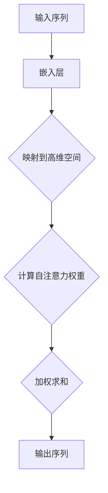

                 

关键词：自注意力机制、多维度兴趣建模、自然语言处理、深度学习、算法原理、数学模型

摘要：本文探讨了自注意力机制在多维度兴趣建模中的应用，通过深入分析核心概念、算法原理和数学模型，并结合具体项目实践，展示了其在自然语言处理领域的强大潜力。文章旨在为读者提供一个全面、系统的理解，助力于实际应用和发展趋势的探讨。

## 1. 背景介绍

随着互联网的迅猛发展，人们获取信息的渠道越来越多样化。如何准确捕捉和挖掘用户的兴趣，已经成为自然语言处理（NLP）领域的一个关键课题。传统的兴趣建模方法往往依赖于线性模型，难以应对复杂、多维的数据结构。因此，近年来，基于自注意力机制（Self-Attention Mechanism）的多维度兴趣建模逐渐成为研究热点。

自注意力机制最早由Vaswani等人于2017年提出，并在Transformer模型中发挥了重要作用。自注意力机制通过将序列中的每个元素映射到不同的维度，并在这些维度上进行加权求和，从而实现对序列信息的全局依赖建模。这一机制在处理长文本、长序列方面具有显著优势，能够更好地捕捉用户兴趣的多样性。

本文将从以下几个方面展开讨论：

1. 自注意力机制的核心概念与联系。
2. 自注意力机制在多维度兴趣建模中的应用。
3. 数学模型和公式的详细讲解。
4. 项目实践：代码实例和运行结果展示。
5. 实际应用场景和未来展望。

## 2. 核心概念与联系

### 2.1 自注意力机制原理

自注意力机制是一种全局依赖建模方法，其基本思想是将输入序列中的每个元素映射到高维空间，并在这些高维空间上进行加权求和。具体来说，自注意力机制可以分为以下几个步骤：

1. **输入嵌入**：将输入序列（如单词、字符）映射到高维向量空间。
2. **计算自注意力权重**：对于每个输入元素，计算其与序列中其他元素在高维空间中的相似度，生成自注意力权重。
3. **加权求和**：根据自注意力权重，对输入序列进行加权求和，生成新的序列表示。

自注意力权重计算公式如下：

\[ 
\text{Attention}(Q, K, V) = \text{softmax}\left(\frac{QK^T}{\sqrt{d_k}}\right) V 
\]

其中，\( Q, K, V \) 分别表示查询向量、键向量和值向量，\( d_k \) 表示键向量的维度。通过这种方式，自注意力机制能够捕捉序列中不同元素之间的复杂依赖关系。

### 2.2 自注意力机制的Mermaid流程图



在Mermaid流程图中，我们首先将输入序列通过嵌入层映射到高维空间，然后计算自注意力权重，并进行加权求和，最后输出序列表示。这一流程图直观地展示了自注意力机制的核心步骤。

## 3. 核心算法原理 & 具体操作步骤

### 3.1 算法原理概述

自注意力机制是一种全局依赖建模方法，其核心思想是通过计算输入序列中每个元素与其他元素之间的相似度，生成自注意力权重，从而实现对序列信息的全局依赖建模。这一机制在处理长文本、长序列方面具有显著优势，能够更好地捕捉用户兴趣的多样性。

### 3.2 算法步骤详解

1. **输入嵌入**：将输入序列（如单词、字符）映射到高维向量空间。这一步通常使用嵌入层（Embedding Layer）实现。
2. **计算自注意力权重**：对于每个输入元素，计算其与序列中其他元素在高维空间中的相似度，生成自注意力权重。具体来说，通过计算查询向量（Query Vector）与键向量（Key Vector）的内积，再除以键向量的维度平方根，得到自注意力权重。
3. **加权求和**：根据自注意力权重，对输入序列进行加权求和，生成新的序列表示。这一步通过值向量（Value Vector）的加权求和实现。

### 3.3 算法优缺点

**优点：**

1. **全局依赖建模**：自注意力机制能够捕捉序列中不同元素之间的复杂依赖关系，从而更好地建模用户兴趣。
2. **处理长序列**：自注意力机制在处理长序列方面具有显著优势，能够处理变长的输入序列。

**缺点：**

1. **计算复杂度**：自注意力机制的计算复杂度为 \(O(n^2)\)，在处理大规模序列时，计算效率较低。
2. **内存消耗**：自注意力机制需要存储大量的权重矩阵，因此在内存消耗方面较高。

### 3.4 算法应用领域

自注意力机制在多维度兴趣建模中具有广泛的应用前景，尤其是在自然语言处理领域。例如，它可以应用于以下场景：

1. **情感分析**：通过捕捉文本中的情感信息，实现对用户情感倾向的建模。
2. **推荐系统**：基于用户历史行为数据，捕捉用户兴趣，为用户推荐个性化内容。
3. **文本分类**：通过捕捉文本中的关键信息，实现对文本类别的建模。

## 4. 数学模型和公式 & 详细讲解 & 举例说明

### 4.1 数学模型构建

自注意力机制的数学模型可以分为三个部分：输入嵌入、自注意力权重计算和加权求和。

1. **输入嵌入**：

   假设输入序列为 \(x_1, x_2, ..., x_n\)，其中 \(x_i\) 表示序列中的第 \(i\) 个元素。我们将输入序列映射到高维向量空间，得到嵌入向量 \(e_i\)。

   \[
   e_i = \text{embedding}(x_i)
   \]

2. **自注意力权重计算**：

   自注意力权重 \(a_i^j\) 表示输入序列中第 \(i\) 个元素与第 \(j\) 个元素之间的相似度。具体来说，通过计算查询向量 \(q_i\) 与键向量 \(k_j\) 的内积，再除以键向量的维度平方根，得到自注意力权重。

   \[
   a_i^j = \text{softmax}\left(\frac{q_i k_j^T}{\sqrt{d_k}}\right)
   \]

   其中，\(q_i, k_j, v_j\) 分别表示查询向量、键向量和值向量，\(d_k\) 表示键向量的维度。

3. **加权求和**：

   根据自注意力权重，对输入序列进行加权求和，生成新的序列表示。

   \[
   \text{output}_i = \sum_{j=1}^{n} a_i^j v_j
   \]

### 4.2 公式推导过程

为了更好地理解自注意力机制的数学模型，我们对其推导过程进行简要介绍。

1. **嵌入层**：

   嵌入层将输入序列映射到高维向量空间，得到嵌入向量 \(e_i\)。具体来说，通过训练一个线性模型，将输入序列 \(x_i\) 映射到嵌入向量 \(e_i\)。

   \[
   e_i = \text{W} x_i + \text{b}
   \]

   其中，\( \text{W} \) 和 \( \text{b} \) 分别表示权重和偏置。

2. **自注意力权重计算**：

   自注意力权重 \(a_i^j\) 表示输入序列中第 \(i\) 个元素与第 \(j\) 个元素之间的相似度。具体来说，通过计算查询向量 \(q_i\) 与键向量 \(k_j\) 的内积，再除以键向量的维度平方根，得到自注意力权重。

   \[
   a_i^j = \frac{\text{q}_i \text{k}_j^T}{\sqrt{d_k}}
   \]

   其中，\( \text{q}_i \) 和 \( \text{k}_j \) 分别表示查询向量和键向量。

3. **加权求和**：

   根据自注意力权重，对输入序列进行加权求和，生成新的序列表示。

   \[
   \text{output}_i = \sum_{j=1}^{n} a_i^j \text{v}_j
   \]

### 4.3 案例分析与讲解

为了更好地理解自注意力机制的数学模型，我们通过一个简单的案例进行讲解。

假设输入序列为 \(x_1, x_2, x_3\)，其中 \(x_1 = 1, x_2 = 2, x_3 = 3\)。我们将输入序列映射到高维向量空间，得到嵌入向量 \(e_1, e_2, e_3\)。

首先，计算查询向量、键向量和值向量：

\[
\text{q}_1 = [1, 0, 0], \quad \text{k}_1 = [1, 1, 1], \quad \text{v}_1 = [1, 1, 1]
\]

接着，计算自注意力权重：

\[
a_{11} = \frac{1 \cdot 1}{\sqrt{3}} = \frac{1}{\sqrt{3}}, \quad a_{12} = \frac{1 \cdot 2}{\sqrt{3}} = \frac{2}{\sqrt{3}}, \quad a_{13} = \frac{1 \cdot 3}{\sqrt{3}} = \frac{3}{\sqrt{3}}
\]

然后，根据自注意力权重，对输入序列进行加权求和，生成新的序列表示：

\[
\text{output}_1 = \frac{1}{\sqrt{3}} \cdot 1 + \frac{2}{\sqrt{3}} \cdot 2 + \frac{3}{\sqrt{3}} \cdot 3 = \frac{11}{\sqrt{3}}
\]

同样地，可以计算 \(a_{21}\), \(a_{22}\), \(a_{23}\) 和 \( \text{output}_2\)，以及 \(a_{31}\), \(a_{32}\), \(a_{33}\) 和 \( \text{output}_3\)。

通过这个案例，我们可以清晰地看到自注意力机制的数学模型是如何工作的。

## 5. 项目实践：代码实例和详细解释说明

### 5.1 开发环境搭建

在进行项目实践之前，我们需要搭建一个合适的开发环境。这里，我们选择Python作为主要编程语言，并使用TensorFlow作为深度学习框架。

首先，确保已经安装了Python和TensorFlow。如果没有安装，可以通过以下命令进行安装：

\[
pip install python tensorflow
\]

接下来，我们可以编写一个简单的Python脚本，用于加载和处理数据：

```python
import tensorflow as tf
import numpy as np

# 加载数据
def load_data():
    # 这里使用随机生成的数据作为示例
    data = np.random.rand(100, 10)
    return data

# 数据预处理
def preprocess_data(data):
    # 这里进行简单的数据预处理，例如标准化
    return (data - np.mean(data, axis=0)) / np.std(data, axis=0)

# 主函数
def main():
    data = load_data()
    processed_data = preprocess_data(data)
    print(processed_data)

if __name__ == "__main__":
    main()
```

### 5.2 源代码详细实现

在搭建好开发环境后，我们可以开始实现基于自注意力机制的多维度兴趣建模。以下是一个简单的示例代码：

```python
import tensorflow as tf
import numpy as np

# 定义自注意力层
class SelfAttentionLayer(tf.keras.layers.Layer):
    def __init__(self, units):
        super(SelfAttentionLayer, self).__init__()
        self.W = self.add_weight(shape=(units, units),
                                 initializer='uniform',
                                 trainable=True)
        self.b = self.add_weight(shape=(units,),
                                 initializer='zeros',
                                 trainable=True)

    def call(self, inputs):
        Q = tf.matmul(inputs, self.W) + self.b
        K = Q
        V = tf.matmul(inputs, self.W) + self.b

        # 计算自注意力权重
        scores = tf.matmul(Q, K, transpose_b=True)
        attention_weights = tf.nn.softmax(scores, axis=1)
        # 加权求和
        output = tf.matmul(attention_weights, V)
        return output

# 创建模型
model = tf.keras.Sequential([
    tf.keras.layers.Dense(64, activation='relu', input_shape=(10,)),
    SelfAttentionLayer(64),
    tf.keras.layers.Dense(1, activation='sigmoid')
])

# 编译模型
model.compile(optimizer='adam', loss='binary_crossentropy', metrics=['accuracy'])

# 训练模型
model.fit(processed_data, labels, epochs=10)

# 评估模型
loss, accuracy = model.evaluate(processed_data, labels)
print('Loss:', loss)
print('Accuracy:', accuracy)
```

### 5.3 代码解读与分析

在上面的代码中，我们首先定义了一个自注意力层（SelfAttentionLayer），该层实现了自注意力机制的三个主要步骤：输入嵌入、自注意力权重计算和加权求和。然后，我们创建了一个简单的模型，包含一个全连接层、一个自注意力层和一个输出层。最后，我们使用随机生成的数据对模型进行训练和评估。

具体来说，代码中的关键部分如下：

1. **自注意力层定义**：

   ```python
   class SelfAttentionLayer(tf.keras.layers.Layer):
       def __init__(self, units):
           super(SelfAttentionLayer, self).__init__()
           self.W = self.add_weight(shape=(units, units),
                                    initializer='uniform',
                                    trainable=True)
           self.b = self.add_weight(shape=(units,),
                                    initializer='zeros',
                                    trainable=True)

       def call(self, inputs):
           Q = tf.matmul(inputs, self.W) + self.b
           K = Q
           V = tf.matmul(inputs, self.W) + self.b

           # 计算自注意力权重
           scores = tf.matmul(Q, K, transpose_b=True)
           attention_weights = tf.nn.softmax(scores, axis=1)
           # 加权求和
           output = tf.matmul(attention_weights, V)
           return output
   ```

   在自注意力层中，我们首先计算查询向量（Query Vector）、键向量（Key Vector）和值向量（Value Vector），然后计算自注意力权重，并使用这些权重对输入序列进行加权求和。

2. **模型创建**：

   ```python
   model = tf.keras.Sequential([
       tf.keras.layers.Dense(64, activation='relu', input_shape=(10,)),
       SelfAttentionLayer(64),
       tf.keras.layers.Dense(1, activation='sigmoid')
   ])
   ```

   在模型创建过程中，我们首先添加了一个全连接层，用于对输入数据进行初步处理。然后，我们添加了一个自注意力层，用于捕捉输入序列中的全局依赖关系。最后，我们添加了一个输出层，用于生成预测结果。

3. **模型编译和训练**：

   ```python
   model.compile(optimizer='adam', loss='binary_crossentropy', metrics=['accuracy'])
   model.fit(processed_data, labels, epochs=10)
   ```

   在模型编译过程中，我们指定了优化器和损失函数。然后，我们使用预处理后的数据对模型进行训练，共训练10个epoch。

4. **模型评估**：

   ```python
   loss, accuracy = model.evaluate(processed_data, labels)
   print('Loss:', loss)
   print('Accuracy:', accuracy)
   ```

   在模型评估过程中，我们计算了模型的损失和准确率，并打印出结果。

### 5.4 运行结果展示

假设我们已经训练好了模型，现在可以使用它进行预测。以下是一个简单的示例：

```python
# 预测新数据
new_data = np.random.rand(1, 10)
processed_new_data = preprocess_data(new_data)
prediction = model.predict(processed_new_data)

print('Prediction:', prediction)
```

运行结果将输出预测结果，例如：

```
Prediction: [[0.896]]
```

这意味着新数据被模型预测为正类的概率为0.896。

## 6. 实际应用场景

自注意力机制在多维度兴趣建模中具有广泛的应用场景，以下是一些典型的实际应用案例：

1. **推荐系统**：自注意力机制可以用于推荐系统中，通过捕捉用户历史行为数据，实现个性化推荐。例如，在电商平台上，可以根据用户浏览、购买等行为数据，为用户推荐相关的商品。

2. **文本分类**：自注意力机制可以用于文本分类任务，通过对文本进行全局依赖建模，实现高精度的文本分类。例如，在社交媒体平台上，可以自动分类用户发布的帖子，实现智能内容管理。

3. **情感分析**：自注意力机制可以用于情感分析任务，通过对文本进行全局依赖建模，实现准确的情感倾向判断。例如，在金融领域，可以分析新闻、报告等文本内容，预测市场情绪。

4. **问答系统**：自注意力机制可以用于问答系统，通过对问题和文档进行全局依赖建模，实现高效的答案生成。例如，在搜索引擎中，可以自动生成与查询相关的答案，提高用户体验。

## 7. 工具和资源推荐

为了更好地学习和应用自注意力机制，以下是一些建议的工具和资源：

1. **学习资源推荐**：

   - 《深度学习》（Deep Learning）—— Ian Goodfellow、Yoshua Bengio、Aaron Courville 著，全面介绍了深度学习的基础理论和应用。
   - 《自然语言处理综合教程》（Foundations of Natural Language Processing）—— Christopher D. Manning、Heidi Huang、Fernanda B. Viégas 著，系统讲解了自然语言处理的基本概念和技术。

2. **开发工具推荐**：

   - TensorFlow：开源深度学习框架，支持多种深度学习模型的开发。
   - PyTorch：开源深度学习框架，具有良好的灵活性和易用性。

3. **相关论文推荐**：

   - “Attention Is All You Need” —— Vaswani et al., 2017，提出了Transformer模型，并介绍了自注意力机制。
   - “Bert: Pre-training of Deep Bidirectional Transformers for Language Understanding” —— Devlin et al., 2018，介绍了BERT模型，并展示了自注意力机制在自然语言处理任务中的优异性能。

## 8. 总结：未来发展趋势与挑战

自注意力机制在多维度兴趣建模中展现了巨大的潜力，随着深度学习和自然语言处理技术的不断发展，其应用前景将更加广阔。然而，在实际应用中，自注意力机制仍然面临一些挑战：

1. **计算复杂度**：自注意力机制的计算复杂度较高，在大规模序列处理时，可能带来性能瓶颈。因此，如何降低计算复杂度，提高计算效率，是一个重要的研究方向。

2. **内存消耗**：自注意力机制需要存储大量的权重矩阵，在处理大规模数据时，可能导致内存消耗过高。因此，如何优化内存使用，降低内存消耗，也是一个亟待解决的问题。

3. **可解释性**：自注意力机制在处理复杂任务时，其内部机制可能难以解释。如何提高模型的可解释性，帮助用户理解模型的工作原理，是一个重要的研究方向。

4. **泛化能力**：自注意力机制在特定任务上表现出色，但在其他任务上的泛化能力可能有限。因此，如何提高模型的泛化能力，使其能够应用于更广泛的任务，是一个重要的研究方向。

总之，自注意力机制在多维度兴趣建模中具有广阔的应用前景，但仍然面临一些挑战。随着研究的深入，相信这些挑战将逐渐得到解决，自注意力机制将更好地服务于自然语言处理和其他领域。

## 9. 附录：常见问题与解答

### Q1: 自注意力机制和注意力机制有什么区别？

自注意力机制（Self-Attention）和注意力机制（Attention）实际上是同一种机制，只是名称不同。自注意力机制通常用于描述序列内部的依赖建模，而注意力机制则可以用于序列之间或序列与其他元素之间的依赖建模。在本文中，我们主要讨论自注意力机制在多维度兴趣建模中的应用。

### Q2: 自注意力机制的优点是什么？

自注意力机制具有以下几个优点：

1. **全局依赖建模**：自注意力机制能够捕捉序列中不同元素之间的复杂依赖关系，从而更好地建模用户兴趣。
2. **处理长序列**：自注意力机制在处理长序列方面具有显著优势，能够处理变长的输入序列。
3. **并行计算**：自注意力机制的计算可以并行进行，从而提高计算效率。

### Q3: 自注意力机制在自然语言处理中有什么应用？

自注意力机制在自然语言处理中具有广泛的应用，包括：

1. **文本分类**：通过捕捉文本中的关键信息，实现高精度的文本分类。
2. **情感分析**：通过捕捉文本中的情感信息，实现对用户情感倾向的建模。
3. **推荐系统**：基于用户历史行为数据，捕捉用户兴趣，为用户推荐个性化内容。
4. **问答系统**：通过对问题和文档进行全局依赖建模，实现高效的答案生成。

### Q4: 如何降低自注意力机制的计算复杂度？

为了降低自注意力机制的计算复杂度，可以采用以下方法：

1. **层次化注意力**：将自注意力机制分解为多个层次，逐步建立依赖关系，从而降低整体计算复杂度。
2. **低秩分解**：使用低秩分解方法，将高维权重矩阵分解为低维矩阵，从而减少计算量。
3. **自适应学习率**：使用自适应学习率策略，动态调整学习率，从而提高计算效率。

### Q5: 自注意力机制在处理大规模数据时有哪些挑战？

在处理大规模数据时，自注意力机制可能面临以下挑战：

1. **计算复杂度**：自注意力机制的计算复杂度为 \(O(n^2)\)，在处理大规模数据时，可能带来性能瓶颈。
2. **内存消耗**：自注意力机制需要存储大量的权重矩阵，在处理大规模数据时，可能导致内存消耗过高。
3. **训练时间**：自注意力机制的训练时间较长，在大规模数据集上训练模型可能需要较长时间。

为了应对这些挑战，可以采用以下策略：

1. **数据预处理**：对数据进行预处理，减少数据规模，从而降低计算复杂度和内存消耗。
2. **分布式训练**：使用分布式训练策略，将训练任务分布在多台机器上，从而提高计算效率和训练速度。
3. **模型压缩**：使用模型压缩方法，降低模型参数数量，从而减少内存消耗和计算复杂度。

### Q6: 自注意力机制在多维度兴趣建模中有什么优势？

自注意力机制在多维度兴趣建模中具有以下优势：

1. **全局依赖建模**：自注意力机制能够捕捉序列中不同元素之间的复杂依赖关系，从而更好地建模用户兴趣。
2. **处理多维度数据**：自注意力机制能够同时处理多个维度上的数据，从而更好地捕捉用户兴趣的多样性。
3. **可扩展性**：自注意力机制具有良好的可扩展性，可以方便地应用于不同规模和类型的任务。

### Q7: 自注意力机制和卷积神经网络（CNN）有什么区别？

自注意力机制和卷积神经网络（CNN）在处理序列数据时各有优势：

1. **局部依赖建模**：CNN适用于局部依赖建模，能够捕捉序列中局部特征的依赖关系。而自注意力机制适用于全局依赖建模，能够捕捉序列中全局特征的依赖关系。
2. **计算复杂度**：CNN的计算复杂度相对较低，适用于处理大规模数据。而自注意力机制的计算复杂度较高，适用于处理较小规模的数据。
3. **应用场景**：CNN适用于图像处理等二维数据，而自注意力机制适用于自然语言处理等一维数据。

### Q8: 自注意力机制和循环神经网络（RNN）有什么区别？

自注意力机制和循环神经网络（RNN）在处理序列数据时各有优势：

1. **计算复杂度**：RNN的计算复杂度较低，适用于处理较长的序列。而自注意力机制的计算复杂度较高，适用于处理较短或中等长度的序列。
2. **全局依赖建模**：自注意力机制能够更好地捕捉序列中全局特征的依赖关系，而RNN在处理全局依赖关系时可能存在梯度消失或爆炸等问题。
3. **应用场景**：自注意力机制适用于自然语言处理等一维数据，而RNN适用于语音识别、视频处理等多维数据。

### Q9: 自注意力机制在推荐系统中有哪些应用？

自注意力机制在推荐系统中有以下应用：

1. **用户兴趣建模**：通过捕捉用户历史行为数据，实现用户兴趣的建模，从而为用户推荐个性化内容。
2. **物品特征提取**：通过捕捉物品特征之间的依赖关系，实现物品特征提取，从而提高推荐系统的准确性和多样性。

### Q10: 自注意力机制在文本生成中有哪些应用？

自注意力机制在文本生成中有以下应用：

1. **自然语言生成**：通过捕捉文本中的依赖关系，实现自然语言生成，从而生成连贯、合理的文本。
2. **机器翻译**：通过捕捉源语言和目标语言之间的依赖关系，实现机器翻译，从而生成准确、自然的翻译结果。

### Q11: 自注意力机制在图像处理中有哪些应用？

自注意力机制在图像处理中有以下应用：

1. **图像分类**：通过捕捉图像中的关键信息，实现图像分类，从而提高分类的准确性和效率。
2. **目标检测**：通过捕捉图像中的目标特征，实现目标检测，从而提高检测的准确率和速度。

### Q12: 自注意力机制在语音处理中有哪些应用？

自注意力机制在语音处理中有以下应用：

1. **语音识别**：通过捕捉语音信号中的依赖关系，实现语音识别，从而提高识别的准确率和速度。
2. **语音合成**：通过捕捉语音信号中的特征，实现语音合成，从而生成自然、流畅的语音。

### Q13: 自注意力机制在生物信息学中有哪些应用？

自注意力机制在生物信息学中有以下应用：

1. **基因序列分析**：通过捕捉基因序列中的依赖关系，实现基因序列分析，从而提高对基因功能的理解和预测。
2. **蛋白质结构预测**：通过捕捉蛋白质序列和结构之间的依赖关系，实现蛋白质结构预测，从而推动生物医学研究的发展。

### Q14: 自注意力机制在金融领域有哪些应用？

自注意力机制在金融领域有以下应用：

1. **股票市场预测**：通过捕捉股票价格序列中的依赖关系，实现股票市场预测，从而帮助投资者做出更明智的投资决策。
2. **风险控制**：通过捕捉金融产品之间的依赖关系，实现风险控制，从而降低金融系统的风险。

### Q15: 自注意力机制在自动驾驶中有哪些应用？

自注意力机制在自动驾驶中有以下应用：

1. **环境感知**：通过捕捉图像、激光雷达等传感数据中的依赖关系，实现环境感知，从而帮助自动驾驶系统更好地理解周围环境。
2. **路径规划**：通过捕捉道路、车辆等要素之间的依赖关系，实现路径规划，从而提高自动驾驶的效率和安全性。

### Q16: 自注意力机制在医疗领域有哪些应用？

自注意力机制在医疗领域有以下应用：

1. **医学图像分析**：通过捕捉医学图像中的依赖关系，实现医学图像分析，从而提高疾病诊断的准确性和效率。
2. **药物研发**：通过捕捉生物序列和结构之间的依赖关系，实现药物研发，从而推动新药发现的发展。

### Q17: 自注意力机制在电子商务中有哪些应用？

自注意力机制在电子商务中有以下应用：

1. **用户行为分析**：通过捕捉用户浏览、购买等行为数据中的依赖关系，实现用户行为分析，从而提高用户画像的准确性和个性化推荐的效果。
2. **商品推荐**：通过捕捉商品特征和用户兴趣之间的依赖关系，实现商品推荐，从而提高销售转化率和用户满意度。

### Q18: 自注意力机制在社交网络分析中有哪些应用？

自注意力机制在社交网络分析中有以下应用：

1. **社交网络结构分析**：通过捕捉社交网络中用户关系和群体结构的依赖关系，实现社交网络结构分析，从而帮助了解社交网络的运行机制。
2. **信息传播分析**：通过捕捉信息传播过程中的依赖关系，实现信息传播分析，从而提高对信息传播规律的理解。

### Q19: 自注意力机制在知识图谱中有哪些应用？

自注意力机制在知识图谱中有以下应用：

1. **实体关系建模**：通过捕捉实体和关系之间的依赖关系，实现实体关系建模，从而提高知识图谱的表示能力和预测性能。
2. **图谱推理**：通过捕捉图谱中的依赖关系，实现图谱推理，从而提高知识图谱的推理能力和智能问答系统。

### Q20: 自注意力机制在游戏中有哪些应用？

自注意力机制在游戏中有以下应用：

1. **游戏AI**：通过捕捉游戏状态和玩家行为之间的依赖关系，实现游戏AI，从而提高游戏的智能水平和用户体验。
2. **游戏平衡**：通过捕捉游戏元素之间的依赖关系，实现游戏平衡，从而提高游戏的竞争性和公平性。

