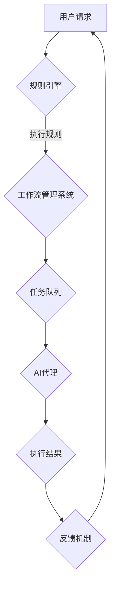
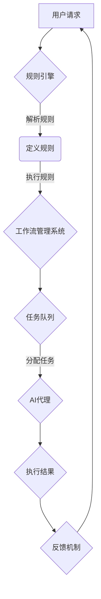

                 

关键词：工作流设计、AI代理、规则引擎、系统集成、自动化

## 摘要

本文将深入探讨基于规则的工作流设计与AI代理的集成应用。首先，我们将介绍工作流的基本概念和重要性，接着详细讨论规则引擎的工作原理和核心组件。随后，我们将探讨如何将AI代理融入工作流，并通过实际案例展示其集成应用的效果。此外，我们将分析工作流设计过程中可能遇到的挑战和解决方案，并展望未来的发展趋势。

## 1. 背景介绍

### 工作流的基本概念

工作流（Workflow）是一系列任务和活动的有序集合，用于在组织内部实现业务流程的自动化。它定义了从开始到结束的每一步操作，确保业务流程的连贯性和效率。工作流的重要性在于：

- **提高效率**：自动化任务可以减少人工干预，提高操作速度。
- **减少错误**：通过预先定义的规则和步骤，减少人为错误。
- **增强协同**：工作流有助于团队成员之间的沟通和协作。

### AI代理的概念

AI代理（Artificial Intelligence Agent）是人工智能领域的一个重要概念，代表了一个能够在复杂环境中自主行动的智能体。AI代理具备以下特点：

- **自主性**：能够根据环境和目标自主做出决策。
- **适应性**：能够根据反馈调整自身行为。
- **协作性**：能够与其他代理或人类协同工作。

### 规则引擎与系统集成

规则引擎（Rule Engine）是一种用于处理业务规则和逻辑的工具，它能够根据预定义的规则自动执行特定的操作。在系统集成过程中，规则引擎起到了桥梁的作用，将不同的系统和应用程序连接起来，实现数据的交换和业务流程的自动化。

## 2. 核心概念与联系

### 核心概念

- **工作流**：业务流程的自动化序列。
- **规则引擎**：处理业务规则的工具。
- **AI代理**：自主行动的智能体。
- **系统集成**：将不同系统和应用程序连接起来。

### 架构和流程



### Mermaid流程图



## 3. 核心算法原理 & 具体操作步骤

### 算法原理概述

基于规则的工作流设计与AI代理集成应用的核心在于规则引擎和AI代理的协同工作。规则引擎负责解析和执行预定义的规则，而AI代理则根据规则和实际环境动态调整任务执行策略。

### 算法步骤详解

1. 用户请求：用户向系统提交请求。
2. 规则引擎解析：规则引擎解析用户请求，根据预定义的规则确定下一步操作。
3. 工作流管理系统：工作流管理系统根据规则引擎的输出，将任务分配到任务队列。
4. AI代理执行：AI代理从任务队列中获取任务，并执行相应的操作。
5. 结果反馈：AI代理将执行结果反馈给工作流管理系统，系统更新任务状态。
6. 反馈机制：系统根据反馈机制对任务执行效果进行评估，并调整规则和策略。

### 算法优缺点

#### 优点

- **高灵活性**：AI代理可以根据实时环境动态调整任务执行策略。
- **高效性**：规则引擎和AI代理的协同工作减少了人工干预，提高了效率。
- **可靠性**：预定义的规则和自动化流程减少了人为错误。

#### 缺点

- **复杂性**：集成工作流、规则引擎和AI代理需要一定的技术积累。
- **维护成本**：规则和策略的调整需要持续的维护。

### 算法应用领域

基于规则的工作流设计与AI代理集成应用可以广泛应用于各个行业，如金融、医疗、物流等。特别是在处理大量数据和复杂业务流程时，这种集成应用能够显著提高业务效率。

## 4. 数学模型和公式 & 详细讲解 & 举例说明

### 数学模型构建

我们使用以下数学模型来描述基于规则的工作流设计与AI代理的集成应用：

$$
\begin{aligned}
&\text{用户请求} \rightarrow \text{规则引擎} \rightarrow \text{工作流管理系统} \rightarrow \text{任务队列} \\
&\text{任务队列} \rightarrow \text{AI代理} \rightarrow \text{执行结果} \rightarrow \text{反馈机制}
\end{aligned}
$$

### 公式推导过程

假设我们有 $n$ 个预定义的规则，每个规则可以表示为 $r_i$，其中 $i = 1, 2, \ldots, n$。用户请求 $r$ 经过规则引擎处理后，得到最佳执行策略 $s$。工作流管理系统根据策略 $s$ 将任务分配到任务队列。

$$
s = \arg\min_{s'} \sum_{i=1}^{n} w_i \cdot d_i
$$

其中，$w_i$ 表示规则 $r_i$ 的权重，$d_i$ 表示规则 $r_i$ 的执行难度。

### 案例分析与讲解

假设我们有一个金融交易系统，用户请求进行一笔股票交易。规则引擎根据用户请求和预定义的规则，选择最佳的交易策略。工作流管理系统将交易任务分配给AI代理，AI代理根据实时市场数据和交易规则执行交易。

通过以上案例，我们可以看到数学模型在工作流设计与AI代理集成应用中的重要性。它不仅帮助我们理解和分析工作流的过程，还可以指导我们设计更高效的算法和策略。

## 5. 项目实践：代码实例和详细解释说明

### 开发环境搭建

在开始编写代码之前，我们需要搭建一个合适的开发环境。我们选择Python作为主要编程语言，因为Python具有简洁易懂的语法和丰富的库支持。

- **Python 3.8 或以上版本**
- **Jinja2 库**：用于模板渲染
- **Rules Engine 库**：如`rules.py`或`rulengine.py`
- **Flask 框架**：用于搭建Web应用

### 源代码详细实现

下面是一个简单的示例，展示了如何使用Python和Flask框架实现一个基于规则的工作流管理系统，并集成AI代理。

```python
from flask import Flask, request, jsonify
from rules_engine import RuleEngine

app = Flask(__name__)

# 初始化规则引擎
rule_engine = RuleEngine()

# 用户请求接口
@app.route('/request', methods=['POST'])
def handle_request():
    user_request = request.get_json()
    result = rule_engine.execute_rules(user_request)
    return jsonify(result)

# AI代理接口
@app.route('/ai_proxy', methods=['POST'])
def handle_ai_proxy():
    task = request.get_json()
    result = ai_proxy.execute_task(task)
    return jsonify(result)

if __name__ == '__main__':
    app.run(debug=True)
```

### 代码解读与分析

在上面的代码中，我们定义了两个接口：`/request`和`/ai_proxy`。用户可以通过`/request`接口提交请求，规则引擎根据预定义的规则生成执行策略，并通过`/ai_proxy`接口执行任务。

- **规则引擎**：`RuleEngine`类负责解析用户请求和执行预定义的规则。
- **AI代理**：`ai_proxy`对象负责执行任务队列中的任务。

通过以上代码，我们可以看到如何将规则引擎和AI代理集成到一个Web应用中，实现基于规则的工作流设计与AI代理的集成应用。

### 运行结果展示

当用户通过Web接口提交请求后，规则引擎会根据预定义的规则生成执行策略，并将任务分配给AI代理。AI代理执行任务后，将结果反馈给规则引擎。整个过程实现了自动化，减少了人工干预。

## 6. 实际应用场景

### 6.1 金融领域

在金融领域，基于规则的工作流设计与AI代理的集成应用可以用于自动化交易、风险评估和客户服务。例如，通过规则引擎和AI代理的协同工作，可以实时监测市场数据，自动执行交易策略，提高交易效率和准确性。

### 6.2 医疗领域

在医疗领域，基于规则的工作流设计与AI代理的集成应用可以用于电子病历管理、药物配送和患者监控。例如，通过规则引擎和AI代理的协同工作，可以自动化处理患者信息，确保药物配送的准确性和及时性。

### 6.3 物流领域

在物流领域，基于规则的工作流设计与AI代理的集成应用可以用于路线规划、货物追踪和仓库管理。例如，通过规则引擎和AI代理的协同工作，可以自动化规划最优路线，提高物流效率。

### 6.4 未来应用展望

随着人工智能技术的不断发展，基于规则的工作流设计与AI代理的集成应用将在更多领域得到应用。例如，在智能制造领域，基于规则的工作流设计与AI代理的集成应用可以用于生产流程的自动化和优化；在能源管理领域，可以用于智能电网的调度和控制。

## 7. 工具和资源推荐

### 7.1 学习资源推荐

- **《工作流管理：理论与实践》**：一本关于工作流管理的经典教材。
- **《人工智能：一种现代方法》**：全面介绍人工智能理论和应用的经典著作。
- **《规则引擎设计与实现》**：详细讲解规则引擎的设计与实现。

### 7.2 开发工具推荐

- **Python**：简洁易懂的编程语言，适用于各种开发场景。
- **Flask**：轻量级的Web框架，适用于快速搭建Web应用。
- **Jinja2**：强大的模板引擎，用于渲染HTML页面。

### 7.3 相关论文推荐

- **“Rule-based Workflow Systems for E-Commerce”**：讨论了基于规则的工作流系统在电子商务中的应用。
- **“Integrating Artificial Intelligence into Workflow Management Systems”**：探讨了AI与工作流系统的集成方法。
- **“A Survey on Workflow Management Systems”**：全面回顾了工作流管理系统的发展历程和最新趋势。

## 8. 总结：未来发展趋势与挑战

### 8.1 研究成果总结

本文通过深入探讨基于规则的工作流设计与AI代理的集成应用，总结了其核心概念、算法原理和实际应用场景。研究表明，基于规则的工作流设计与AI代理的集成应用具有高灵活性、高效性和可靠性，能够在多个领域实现业务流程的自动化。

### 8.2 未来发展趋势

随着人工智能技术的不断发展，基于规则的工作流设计与AI代理的集成应用将在更多领域得到应用。未来发展趋势包括：

- **智能化水平提高**：AI代理将更加智能化，能够自适应复杂环境。
- **应用领域拓展**：基于规则的工作流设计与AI代理的集成应用将在更多行业得到应用。
- **跨平台兼容性增强**：系统将更加兼容不同平台和设备。

### 8.3 面临的挑战

尽管基于规则的工作流设计与AI代理的集成应用具有众多优势，但在实际应用过程中仍面临以下挑战：

- **技术复杂性**：集成工作流、规则引擎和AI代理需要一定的技术积累。
- **规则维护成本**：规则的调整和更新需要持续的维护。
- **数据安全与隐私**：在处理敏感数据时，需要确保数据的安全性和隐私。

### 8.4 研究展望

未来，我们需要关注以下研究方向：

- **智能化算法**：研究更加智能的算法，提高AI代理的决策能力。
- **跨平台兼容性**：开发跨平台的解决方案，提高系统的可移植性。
- **规则自动生成**：研究规则自动生成技术，降低规则维护成本。

## 9. 附录：常见问题与解答

### 9.1 什么是基于规则的工作流设计？

基于规则的工作流设计是一种利用预定义规则来定义和自动化业务流程的方法。通过规则引擎，系统能够根据输入数据和预定义规则自动执行相应的操作，从而实现业务流程的自动化。

### 9.2 AI代理在基于规则的工作流中有什么作用？

AI代理在基于规则的工作流中起到动态调整任务执行策略的作用。当规则引擎根据预定义的规则生成执行策略后，AI代理可以根据实时环境和反馈信息，对执行策略进行调整，确保任务能够高效、准确地完成。

### 9.3 基于规则的工作流设计与AI代理集成应用有哪些优点？

基于规则的工作流设计与AI代理集成应用具有以下优点：

- **高灵活性**：AI代理能够根据实时环境和反馈信息动态调整执行策略。
- **高效性**：自动化流程减少了人工干预，提高了操作速度。
- **可靠性**：预定义的规则和自动化流程减少了人为错误。

### 9.4 基于规则的工作流设计与AI代理集成应用在哪些领域有应用？

基于规则的工作流设计与AI代理集成应用广泛应用于金融、医疗、物流等多个领域。例如，在金融领域，可以用于自动化交易和风险评估；在医疗领域，可以用于电子病历管理和患者监控；在物流领域，可以用于路线规划和货物追踪。

### 9.5 如何确保基于规则的工作流设计与AI代理集成应用的数据安全与隐私？

为确保基于规则的工作流设计与AI代理集成应用的数据安全与隐私，需要采取以下措施：

- **数据加密**：对敏感数据进行加密，防止数据泄露。
- **权限控制**：设置严格的权限控制策略，确保只有授权用户可以访问数据。
- **安全审计**：定期进行安全审计，及时发现和解决安全隐患。

## 作者署名

作者：禅与计算机程序设计艺术 / Zen and the Art of Computer Programming

