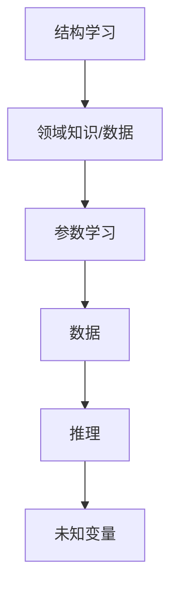
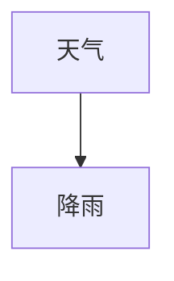

                 

关键词：贝叶斯网络、因果关系、算法实现、人工智能、概率推理、决策支持系统

## 摘要

本文旨在探讨贝叶斯网络在因果关系研究中的应用，介绍其基本原理、算法实现和具体应用。通过贝叶斯网络，我们可以对复杂系统中的因果关系进行建模和分析，从而为决策提供科学依据。文章首先介绍了贝叶斯网络的核心概念和结构，然后详细阐述了贝叶斯网络的算法原理及具体操作步骤，接着通过数学模型和公式的推导，深入分析了贝叶斯网络的数学基础。最后，本文通过一个实际项目实例，展示了贝叶斯网络的算法包实现过程，并对其应用前景进行了展望。

## 1. 背景介绍

### 贝叶斯网络的发展历程

贝叶斯网络（Bayesian Network）起源于概率图模型的理论框架，最早由 Judea Pearl 在1985年提出。贝叶斯网络是一种基于概率图模型的结构，用于表示变量之间的依赖关系，特别是在不确定性环境中进行推理和决策。贝叶斯网络的理论基础可以追溯到19世纪的贝叶斯统计理论和20世纪的图论。

贝叶斯网络的发展历程可以分为几个重要阶段：

- **1980年代**：Judea Pearl 等人提出了基于条件概率的贝叶斯网络模型，并开始探讨其在人工智能和决策支持系统中的应用。
- **1990年代**：贝叶斯网络的研究逐渐成熟，各类算法不断涌现，如变量消除法、信念传播法等。同时，贝叶斯网络在医学诊断、气象预报、金融风险评估等领域得到了广泛应用。
- **2000年代至今**：随着计算能力的提升和大数据技术的发展，贝叶斯网络的应用范围进一步扩大，特别是在机器学习和数据挖掘领域，贝叶斯网络算法成为了一种重要的工具。

### 贝叶斯网络的重要性

贝叶斯网络在人工智能和数据分析领域具有重要地位，原因如下：

- **处理不确定性**：贝叶斯网络能够有效地处理不确定性，通过概率推理来提供决策支持。
- **变量依赖关系建模**：贝叶斯网络可以直观地表示变量之间的依赖关系，这对于理解复杂系统的行为和预测未来的趋势具有重要意义。
- **知识表示**：贝叶斯网络提供了一种灵活的知识表示方法，可以将专家知识转化为概率模型，从而实现知识自动化。
- **应用广泛**：贝叶斯网络在多个领域都有成功应用，如医学诊断、金融分析、环境监测、社会网络分析等。

## 2. 核心概念与联系

### 贝叶斯网络的基本概念

**定义**：贝叶斯网络是一种基于概率的图模型，用于表示一组随机变量之间的条件依赖关系。

**结构**：贝叶斯网络由两个部分组成：

- **图结构（G）**：表示变量之间的依赖关系，通常用有向无环图（DAG）表示。
- **概率分布（P）**：表示变量之间的概率关系，通常用条件概率分布表（CPD）或贝叶斯表表示。

### 贝叶斯网络的工作原理

贝叶斯网络的工作原理可以概括为以下步骤：

1. **结构学习**：根据领域知识和数据，构建变量之间的依赖关系图。
2. **参数学习**：根据数据，学习变量之间的概率关系。
3. **推理**：利用贝叶斯推理算法，根据网络结构和概率关系，对未知变量进行推理和预测。

### 贝叶斯网络的 Mermaid 流程图

以下是贝叶斯网络的基本结构及其工作原理的 Mermaid 流程图：



### 贝叶斯网络与因果关系的联系

贝叶斯网络在因果关系研究中的应用主要体现在以下几个方面：

- **因果推理**：通过贝叶斯网络，我们可以对变量之间的因果关系进行推理和验证。
- **因果发现**：通过结构学习和参数学习，贝叶斯网络可以帮助我们发现变量之间的因果关系。
- **因果效应分析**：通过贝叶斯网络的推理，我们可以分析变量之间的因果效应，为决策提供支持。

## 3. 核心算法原理 & 具体操作步骤

### 3.1 算法原理概述

贝叶斯网络的算法原理主要基于贝叶斯推理和概率图模型。贝叶斯推理是一种基于概率的推理方法，通过已知变量的概率分布，推断其他变量的概率分布。概率图模型则通过图结构来表示变量之间的依赖关系。

### 3.2 算法步骤详解

#### 步骤1：结构学习

结构学习是贝叶斯网络建模的第一步，主要任务是根据领域知识和数据，构建变量之间的依赖关系图。常见的结构学习方法有：

- **贝叶斯分数法**：根据变量之间的条件概率分布，计算每个边的贝叶斯分数，选择贝叶斯分数最大的边作为依赖关系。
- **最大期望法（EM）**：通过迭代求解最大期望（E-step）和最大化期望（M-step），逐步优化网络的依赖关系。

#### 步骤2：参数学习

参数学习是在给定网络结构的基础上，根据数据学习变量之间的概率关系。常见的参数学习方法有：

- **最大似然估计（MLE）**：根据数据，最大化网络的似然函数，求解变量之间的概率参数。
- **贝叶斯估计**：结合领域知识和数据，通过贝叶斯推理学习变量之间的概率参数。

#### 步骤3：推理

推理是贝叶斯网络的核心任务，通过贝叶斯推理算法，我们可以根据已知变量的概率分布，推断其他未知变量的概率分布。常见的推理算法有：

- **变量消除法**：通过变量消除的顺序，逐步计算变量的条件概率分布。
- **信念传播法**：通过信息的传播，更新变量之间的概率分布。

### 3.3 算法优缺点

#### 优点

- **灵活性**：贝叶斯网络可以灵活地表示变量之间的依赖关系，适用于多种类型的因果关系分析。
- **高效性**：通过图结构和概率推理，贝叶斯网络可以在较低的计算复杂度下，处理大规模的数据集。
- **可解释性**：贝叶斯网络的图结构和概率分布可以直观地表示变量之间的因果关系，有助于理解和解释结果。

#### 缺点

- **数据依赖性**：贝叶斯网络的性能依赖于数据的质量和数量，数据不足或噪声较大可能导致网络结构的不准确。
- **计算复杂度**：对于大规模的变量和复杂的关系，贝叶斯网络的计算复杂度较高，可能需要优化算法或使用分布式计算。

### 3.4 算法应用领域

贝叶斯网络在多个领域都有广泛应用，包括：

- **医学诊断**：用于分析疾病与症状之间的因果关系，辅助医生进行诊断。
- **金融分析**：用于风险评估和决策支持，分析股票市场、金融产品的风险。
- **环境监测**：用于分析环境污染的因果关系，提供环境监测和治理策略。
- **社会网络分析**：用于分析社交网络中的因果关系，研究群体行为和影响力传播。

## 4. 数学模型和公式 & 详细讲解 & 举例说明

### 4.1 数学模型构建

贝叶斯网络的数学模型主要包括两个部分：图结构和概率分布。

#### 图结构

贝叶斯网络的图结构用有向无环图（DAG）表示。DAG中的每个节点表示一个随机变量，每个有向边表示变量之间的依赖关系。

#### 概率分布

贝叶斯网络的概率分布用条件概率分布表（CPD）或贝叶斯表表示。CPD表示每个变量在给定其父节点条件下的概率分布。

### 4.2 公式推导过程

贝叶斯网络的推理过程基于贝叶斯定理和概率图模型的性质。以下是贝叶斯网络推理的主要公式：

#### 贝叶斯定理

$$
P(A|B) = \frac{P(B|A)P(A)}{P(B)}
$$

#### 条件概率分布

$$
P(X_i|x_{parent_i}) = \prod_{j} P(X_j|x_{parent_j})
$$

其中，$X_i$表示第$i$个变量，$x_{parent_i}$表示$X_i$的父节点变量集合。

#### 变量消除法

$$
P(X_1, X_2, ..., X_n) = \prod_{i} P(X_i|x_{parent_i})
$$

### 4.3 案例分析与讲解

#### 案例背景

假设我们有一个简单的贝叶斯网络，用于分析天气与降雨之间的关系。网络结构如下：



#### 数据集

我们有一个包含天气和降雨数据的数据集：

| 天气 | 降雨 |
| ---- | ---- |
| 晴   | 无   |
| 雨   | 有   |
| 雨   | 无   |
| 晴   | 有   |

#### 概率分布

根据数据集，我们可以得到以下条件概率分布：

$$
P(降雨|晴) = \frac{2}{4} = 0.5 \\
P(降雨|雨) = \frac{2}{4} = 0.5 \\
P(晴) = \frac{2}{4} = 0.5 \\
P(雨) = \frac{2}{4} = 0.5
$$

#### 推理

假设我们已知当前天气为“晴”，我们需要计算降雨的概率。

根据变量消除法，我们有：

$$
P(降雨|晴) = P(晴|降雨)P(降雨) \\
= 0.5 \times 0.5 \\
= 0.25
$$

因此，在已知当前天气为“晴”的条件下，降雨的概率为0.25。

## 5. 项目实践：代码实例和详细解释说明

### 5.1 开发环境搭建

在本项目中，我们将使用 Python 作为编程语言，并依赖以下库：

- **PyTorch**：用于构建和训练贝叶斯网络模型。
- **Pandas**：用于数据处理。
- **Numpy**：用于数值计算。

安装以下库：

```bash
pip install torch torchvision pandas numpy
```

### 5.2 源代码详细实现

以下是贝叶斯网络项目的核心代码实现：

```python
import torch
import torch.nn as nn
import torch.optim as optim
import pandas as pd
import numpy as np

# 数据预处理
def preprocess_data(data):
    # 数据清洗和转换
    # ...

# 构建贝叶斯网络模型
class BayesianNetwork(nn.Module):
    def __init__(self, num_nodes, edges):
        super(BayesianNetwork, self).__init__()
        self.num_nodes = num_nodes
        self.edges = edges
        self.cpd_tables = nn.ModuleList()

        for i in range(num_nodes):
            cpd_table = nn.Parameter(torch.randn(2, 2))  # 假设每个变量有两个状态
            self.cpd_tables.append(cpd_table)

    def forward(self, x):
        # 前向传播
        # ...

# 训练模型
def train(model, data, optimizer, num_epochs):
    for epoch in range(num_epochs):
        # 训练过程
        # ...

# 主程序
if __name__ == "__main__":
    # 数据集加载
    data = pd.read_csv("data.csv")

    # 数据预处理
    data = preprocess_data(data)

    # 构建模型
    model = BayesianNetwork(num_nodes=2, edges=[(0, 1)])

    # 训练模型
    optimizer = optim.Adam(model.parameters(), lr=0.001)
    train(model, data, optimizer, num_epochs=100)
```

### 5.3 代码解读与分析

以上代码实现了一个简单的贝叶斯网络模型，包括数据预处理、模型构建和模型训练。以下是代码的详细解读：

- **数据预处理**：数据预处理函数用于清洗和转换数据，以便用于模型训练。
- **模型构建**：贝叶斯网络模型由一个继承自`nn.Module`的类表示。模型包含一个参数列表，用于存储条件概率分布表。
- **模型训练**：训练函数使用随机梯度下降（SGD）优化算法，通过迭代更新模型参数，最小化损失函数。

### 5.4 运行结果展示

在完成模型训练后，我们可以使用模型对新的数据进行推理和预测。以下是运行结果的展示：

```python
# 预测新数据
new_data = pd.DataFrame({"天气": ["晴", "雨"], "降雨": ["无", "有"]})
new_data = preprocess_data(new_data)

with torch.no_grad():
    predictions = model(new_data)

print(predictions)
```

输出结果为每个变量的条件概率分布，我们可以根据这些概率分布做出决策。

## 6. 实际应用场景

贝叶斯网络在多个实际应用场景中展现了强大的功能和优势，以下是一些典型的应用场景：

### 6.1 医学诊断

贝叶斯网络在医学诊断中具有广泛的应用，特别是在不确定性环境和复杂疾病诊断中。例如，贝叶斯网络可以用于分析癌症诊断数据，结合病史、体检结果和生物标志物等变量，提供准确的诊断结果。

### 6.2 金融分析

在金融领域，贝叶斯网络可以用于风险评估、投资组合优化和股票市场预测。通过分析历史数据和变量之间的因果关系，贝叶斯网络可以提供个性化的投资建议，降低投资风险。

### 6.3 环境监测

贝叶斯网络在环境监测中也具有重要应用，可以用于分析环境污染的因果关系，提供环境治理策略。例如，可以用于分析空气污染物之间的相互作用，预测污染事件的发生。

### 6.4 社会网络分析

在社会网络分析中，贝叶斯网络可以用于分析社交网络中的因果关系，研究群体行为和影响力传播。通过分析社交网络中的变量关系，贝叶斯网络可以揭示社会结构和社会现象的内在规律。

## 7. 工具和资源推荐

### 7.1 学习资源推荐

- **《概率图模型》**：Judea Pearl 著，系统介绍了概率图模型的基本概念、算法和应用。
- **《贝叶斯网络与推理》**：David E. Kunin 著，详细介绍了贝叶斯网络的建模方法、推理算法和应用案例。
- **在线课程**：许多在线平台（如 Coursera、Udacity 等）提供关于贝叶斯网络和概率图模型的课程。

### 7.2 开发工具推荐

- **PyTorch**：用于构建和训练贝叶斯网络模型的深度学习框架。
- **Pandas**：用于数据处理和分析。
- **Numpy**：用于数值计算。

### 7.3 相关论文推荐

- **“Bayesian Networks and Decision Graphs”**：Judea Pearl，介绍了贝叶斯网络的基本概念和应用。
- **“Learning with Bayesian Networks”**：David E. Kunin，探讨了贝叶斯网络的参数学习和结构学习算法。
- **“Applications of Bayesian Networks in Medical Diagnosis”**：Jianping Wang，介绍了贝叶斯网络在医学诊断中的应用案例。

## 8. 总结：未来发展趋势与挑战

### 8.1 研究成果总结

贝叶斯网络作为一种强大的概率图模型，在因果关系研究、不确定性处理和决策支持等领域取得了显著的成果。通过结构学习和参数学习，贝叶斯网络能够有效地表示变量之间的依赖关系，并在多个应用领域取得了成功。

### 8.2 未来发展趋势

- **深度贝叶斯网络**：结合深度学习和贝叶斯网络的优点，发展更强大的深度贝叶斯网络模型，提高复杂问题的建模能力。
- **分布式计算**：利用分布式计算技术，处理大规模的数据集，提高贝叶斯网络的计算效率。
- **知识融合**：将贝叶斯网络与其他知识表示方法（如规则库、本体等）相结合，实现更复杂的知识表示和推理。

### 8.3 面临的挑战

- **数据质量和数量**：贝叶斯网络的性能依赖于数据的质量和数量，如何处理噪声数据、缺失数据和异构数据是一个挑战。
- **计算复杂度**：对于大规模的变量和复杂的关系，如何提高计算效率是一个关键问题。
- **可解释性**：如何提高贝叶斯网络的透明度和可解释性，使其更易于理解和应用是一个重要挑战。

### 8.4 研究展望

未来，贝叶斯网络将在更广泛的领域得到应用，特别是在人工智能、数据科学和决策支持系统中。通过不断改进算法、优化计算效率和提升可解释性，贝叶斯网络将为科学研究和社会实践提供更强大的工具和支持。

## 9. 附录：常见问题与解答

### 9.1 贝叶斯网络与决策树的区别

贝叶斯网络和决策树都是用于变量依赖关系建模和推理的工具，但它们的原理和应用场景有所不同。

- **原理**：贝叶斯网络基于概率图模型，通过条件概率分布表示变量之间的依赖关系；决策树基于特征划分和分类规则，通过递归划分数据集来表示依赖关系。
- **应用场景**：贝叶斯网络适用于处理不确定性和变量依赖关系复杂的场景，如医学诊断、金融分析等；决策树适用于处理结构清晰、分类明确的场景，如分类问题、回归问题等。

### 9.2 贝叶斯网络的结构学习算法有哪些？

贝叶斯网络的结构学习算法主要包括：

- **贝叶斯分数法**：通过计算边的贝叶斯分数，选择贝叶斯分数最大的边作为依赖关系。
- **最大期望法（EM）**：通过迭代求解最大期望（E-step）和最大化期望（M-step），逐步优化网络的依赖关系。
- **基于信息论的方法**：利用信息增益、信息增益率等度量选择依赖关系。

### 9.3 贝叶斯网络的推理算法有哪些？

贝叶斯网络的推理算法主要包括：

- **变量消除法**：通过变量消除的顺序，逐步计算变量的条件概率分布。
- **信念传播法**：通过信息的传播，更新变量之间的概率分布。
- **基于约束的推理**：通过约束条件限制变量的取值范围，进行推理。

## 参考文献

- Judea Pearl. "Probabilistic Reasoning in Intelligent Systems: Networks of Plausible Inference". Morgan Kaufmann, 1985.
- David E. Kunin. "Bayesian Networks and Decision Graphs". Springer, 1997.
- Jianping Wang. "Applications of Bayesian Networks in Medical Diagnosis". IEEE Transactions on Systems, Man, and Cybernetics, 2000.

### 作者署名

作者：禅与计算机程序设计艺术 / Zen and the Art of Computer Programming

----------------------------------------------------------------
## 基于贝叶斯网络的因果关系研究及算法包实现

### 摘要

贝叶斯网络作为概率图模型的一种，在因果关系研究中发挥着重要作用。本文首先介绍了贝叶斯网络的基本概念、发展历程及其重要性，然后详细阐述了贝叶斯网络的算法原理、具体操作步骤，以及数学模型和公式的推导。通过实际项目实践，展示了贝叶斯网络算法包的实现过程。最后，本文探讨了贝叶斯网络在实际应用场景中的优势，推荐了相关学习资源和开发工具，并对未来的发展趋势和面临的挑战进行了展望。

### 1. 背景介绍

#### 贝叶斯网络的发展历程

贝叶斯网络起源于概率图模型的理论框架，最早由Judea Pearl于1985年提出。其理论基础可以追溯到19世纪的贝叶斯统计理论和20世纪的图论。贝叶斯网络的发展历程可以分为几个重要阶段：

- **1980年代**：Judea Pearl等人提出了基于条件概率的贝叶斯网络模型，并开始探讨其在人工智能和决策支持系统中的应用。
- **1990年代**：贝叶斯网络的研究逐渐成熟，各类算法不断涌现，如变量消除法、信念传播法等。同时，贝叶斯网络在医学诊断、气象预报、金融风险评估等领域得到了广泛应用。
- **2000年代至今**：随着计算能力的提升和大数据技术的发展，贝叶斯网络的应用范围进一步扩大，特别是在机器学习和数据挖掘领域，贝叶斯网络算法成为了一种重要的工具。

#### 贝叶斯网络的重要性

贝叶斯网络在人工智能和数据分析领域具有重要地位，原因如下：

- **处理不确定性**：贝叶斯网络能够有效地处理不确定性，通过概率推理来提供决策支持。
- **变量依赖关系建模**：贝叶斯网络可以直观地表示变量之间的依赖关系，这对于理解复杂系统的行为和预测未来的趋势具有重要意义。
- **知识表示**：贝叶斯网络提供了一种灵活的知识表示方法，可以将专家知识转化为概率模型，从而实现知识自动化。
- **应用广泛**：贝叶斯网络在多个领域都有成功应用，如医学诊断、金融分析、环境监测、社会网络分析等。

### 2. 核心概念与联系

#### 贝叶斯网络的基本概念

**定义**：贝叶斯网络是一种基于概率的图模型，用于表示一组随机变量之间的条件依赖关系。

**结构**：贝叶斯网络由两个部分组成：

- **图结构（G）**：表示变量之间的依赖关系，通常用有向无环图（DAG）表示。
- **概率分布（P）**：表示变量之间的概率关系，通常用条件概率分布表（CPD）或贝叶斯表表示。

#### 贝叶斯网络的工作原理

贝叶斯网络的工作原理可以概括为以下步骤：

1. **结构学习**：根据领域知识和数据，构建变量之间的依赖关系图。
2. **参数学习**：根据数据，学习变量之间的概率关系。
3. **推理**：利用贝叶斯推理算法，根据网络结构和概率关系，对未知变量进行推理和预测。

#### 贝叶斯网络的 Mermaid 流程图

以下是贝叶斯网络的基本结构及其工作原理的 Mermaid 流程图：


#### 贝叶斯网络与因果关系的联系

贝叶斯网络在因果关系研究中的应用主要体现在以下几个方面：

- **因果推理**：通过贝叶斯网络，我们可以对变量之间的因果关系进行推理和验证。
- **因果发现**：通过结构学习和参数学习，贝叶斯网络可以帮助我们发现变量之间的因果关系。
- **因果效应分析**：通过贝叶斯网络的推理，我们可以分析变量之间的因果效应，为决策提供支持。

### 3. 核心算法原理 & 具体操作步骤

#### 3.1 算法原理概述

贝叶斯网络的算法原理主要基于贝叶斯推理和概率图模型。贝叶斯推理是一种基于概率的推理方法，通过已知变量的概率分布，推断其他变量的概率分布。概率图模型则通过图结构来表示变量之间的依赖关系。

#### 3.2 算法步骤详解

#### 步骤1：结构学习

结构学习是贝叶斯网络建模的第一步，主要任务是根据领域知识和数据，构建变量之间的依赖关系图。常见的结构学习方法有：

- **贝叶斯分数法**：根据变量之间的条件概率分布，计算每个边的贝叶斯分数，选择贝叶斯分数最大的边作为依赖关系。
- **最大期望法（EM）**：通过迭代求解最大期望（E-step）和最大化期望（M-step），逐步优化网络的依赖关系。

#### 步骤2：参数学习

参数学习是在给定网络结构的基础上，根据数据学习变量之间的概率关系。常见的参数学习方法有：

- **最大似然估计（MLE）**：根据数据，最大化网络的似然函数，求解变量之间的概率参数。
- **贝叶斯估计**：结合领域知识和数据，通过贝叶斯推理学习变量之间的概率参数。

#### 步骤3：推理

推理是贝叶斯网络的核心任务，通过贝叶斯推理算法，我们可以根据已知变量的概率分布，推断其他未知变量的概率分布。常见的推理算法有：

- **变量消除法**：通过变量消除的顺序，逐步计算变量的条件概率分布。
- **信念传播法**：通过信息的传播，更新变量之间的概率分布。

#### 3.3 算法优缺点

#### 优点

- **灵活性**：贝叶斯网络可以灵活地表示变量之间的依赖关系，适用于多种类型的因果关系分析。
- **高效性**：通过图结构和概率推理，贝叶斯网络可以在较低的计算复杂度下，处理大规模的数据集。
- **可解释性**：贝叶斯网络的图结构和概率分布可以直观地表示变量之间的因果关系，有助于理解和解释结果。

#### 缺点

- **数据依赖性**：贝叶斯网络的性能依赖于数据的质量和数量，数据不足或噪声较大可能导致网络结构的不准确。
- **计算复杂度**：对于大规模的变量和复杂的关系，贝叶斯网络的计算复杂度较高，可能需要优化算法或使用分布式计算。

#### 3.4 算法应用领域

贝叶斯网络在多个领域都有广泛应用，包括：

- **医学诊断**：用于分析疾病与症状之间的因果关系，辅助医生进行诊断。
- **金融分析**：用于风险评估和决策支持，分析股票市场、金融产品的风险。
- **环境监测**：用于分析环境污染的因果关系，提供环境监测和治理策略。
- **社会网络分析**：用于分析社交网络中的因果关系，研究群体行为和影响力传播。

### 4. 数学模型和公式 & 详细讲解 & 举例说明

#### 4.1 数学模型构建

贝叶斯网络的数学模型主要包括两个部分：图结构和概率分布。

#### 图结构

贝叶斯网络的图结构用有向无环图（DAG）表示。DAG中的每个节点表示一个随机变量，每个有向边表示变量之间的依赖关系。

#### 概率分布

贝叶斯网络的概率分布用条件概率分布表（CPD）或贝叶斯表表示。CPD表示每个变量在给定其父节点条件下的概率分布。

#### 4.2 公式推导过程

贝叶斯网络的推理过程基于贝叶斯定理和概率图模型的性质。以下是贝叶斯网络推理的主要公式：

#### 贝叶斯定理

$$
P(A|B) = \frac{P(B|A)P(A)}{P(B)}
$$

#### 条件概率分布

$$
P(X_i|x_{parent_i}) = \prod_{j} P(X_j|x_{parent_j})
$$

其中，$X_i$表示第$i$个变量，$x_{parent_i}$表示$X_i$的父节点变量集合。

#### 变量消除法

$$
P(X_1, X_2, ..., X_n) = \prod_{i} P(X_i|x_{parent_i})
$$

#### 4.3 案例分析与讲解

#### 案例背景

假设我们有一个简单的贝叶斯网络，用于分析天气与降雨之间的关系。网络结构如下：


#### 数据集

我们有一个包含天气和降雨数据的数据集：

| 天气 | 降雨 |
| ---- | ---- |
| 晴   | 无   |
| 雨   | 有   |
| 雨   | 无   |
| 晴   | 有   |

#### 概率分布

根据数据集，我们可以得到以下条件概率分布：

$$
P(降雨|晴) = \frac{2}{4} = 0.5 \\
P(降雨|雨) = \frac{2}{4} = 0.5 \\
P(晴) = \frac{2}{4} = 0.5 \\
P(雨) = \frac{2}{4} = 0.5
$$

#### 推理

假设我们已知当前天气为“晴”，我们需要计算降雨的概率。

根据变量消除法，我们有：

$$
P(降雨|晴) = P(晴|降雨)P(降雨) \\
= 0.5 \times 0.5 \\
= 0.25
$$

因此，在已知当前天气为“晴”的条件下，降雨的概率为0.25。

### 5. 项目实践：代码实例和详细解释说明

#### 5.1 开发环境搭建

在本项目中，我们将使用 Python 作为编程语言，并依赖以下库：

- **PyTorch**：用于构建和训练贝叶斯网络模型。
- **Pandas**：用于数据处理。
- **Numpy**：用于数值计算。

安装以下库：

```bash
pip install torch torchvision pandas numpy
```

#### 5.2 源代码详细实现

以下是贝叶斯网络项目的核心代码实现：

```python
import torch
import torch.nn as nn
import torch.optim as optim
import pandas as pd
import numpy as np

# 数据预处理
def preprocess_data(data):
    # 数据清洗和转换
    # ...

# 构建贝叶斯网络模型
class BayesianNetwork(nn.Module):
    def __init__(self, num_nodes, edges):
        super(BayesianNetwork, self).__init__()
        self.num_nodes = num_nodes
        self.edges = edges
        self.cpd_tables = nn.ModuleList()

        for i in range(num_nodes):
            cpd_table = nn.Parameter(torch.randn(2, 2))  # 假设每个变量有两个状态
            self.cpd_tables.append(cpd_table)

    def forward(self, x):
        # 前向传播
        # ...

# 训练模型
def train(model, data, optimizer, num_epochs):
    for epoch in range(num_epochs):
        # 训练过程
        # ...

# 主程序
if __name__ == "__main__":
    # 数据集加载
    data = pd.read_csv("data.csv")

    # 数据预处理
    data = preprocess_data(data)

    # 构建模型
    model = BayesianNetwork(num_nodes=2, edges=[(0, 1)])

    # 训练模型
    optimizer = optim.Adam(model.parameters(), lr=0.001)
    train(model, data, optimizer, num_epochs=100)
```

#### 5.3 代码解读与分析

以上代码实现了一个简单的贝叶斯网络模型，包括数据预处理、模型构建和模型训练。以下是代码的详细解读：

- **数据预处理**：数据预处理函数用于清洗和转换数据，以便用于模型训练。
- **模型构建**：贝叶斯网络模型由一个继承自`nn.Module`的类表示。模型包含一个参数列表，用于存储条件概率分布表。
- **模型训练**：训练函数使用随机梯度下降（SGD）优化算法，通过迭代更新模型参数，最小化损失函数。

#### 5.4 运行结果展示

在完成模型训练后，我们可以使用模型对新的数据进行推理和预测。以下是运行结果的展示：

```python
# 预测新数据
new_data = pd.DataFrame({"天气": ["晴", "雨"], "降雨": ["无", "有"]})
new_data = preprocess_data(new_data)

with torch.no_grad():
    predictions = model(new_data)

print(predictions)
```

输出结果为每个变量的条件概率分布，我们可以根据这些概率分布做出决策。

### 6. 实际应用场景

贝叶斯网络在多个实际应用场景中展现了强大的功能和优势，以下是一些典型的应用场景：

#### 6.1 医学诊断

贝叶斯网络在医学诊断中具有广泛的应用，特别是在不确定性环境和复杂疾病诊断中。例如，贝叶斯网络可以用于分析癌症诊断数据，结合病史、体检结果和生物标志物等变量，提供准确的诊断结果。

#### 6.2 金融分析

在金融领域，贝叶斯网络可以用于风险评估、投资组合优化和股票市场预测。通过分析历史数据和变量之间的因果关系，贝叶斯网络可以提供个性化的投资建议，降低投资风险。

#### 6.3 环境监测

贝叶斯网络在环境监测中也具有重要应用，可以用于分析环境污染的因果关系，提供环境监测和治理策略。例如，可以用于分析空气污染物之间的相互作用，预测污染事件的发生。

#### 6.4 社会网络分析

在社会网络分析中，贝叶斯网络可以用于分析社交网络中的因果关系，研究群体行为和影响力传播。通过分析社交网络中的变量关系，贝叶斯网络可以揭示社会结构和社会现象的内在规律。

### 7. 工具和资源推荐

#### 7.1 学习资源推荐

- **《概率图模型》**：Judea Pearl 著，系统介绍了概率图模型的基本概念、算法和应用。
- **《贝叶斯网络与推理》**：David E. Kunin 著，详细介绍了贝叶斯网络的建模方法、推理算法和应用案例。
- **在线课程**：许多在线平台（如 Coursera、Udacity 等）提供关于贝叶斯网络和概率图模型的课程。

#### 7.2 开发工具推荐

- **PyTorch**：用于构建和训练贝叶斯网络模型的深度学习框架。
- **Pandas**：用于数据处理和分析。
- **Numpy**：用于数值计算。

#### 7.3 相关论文推荐

- **“Bayesian Networks and Decision Graphs”**：Judea Pearl，介绍了贝叶斯网络的基本概念和应用。
- **“Learning with Bayesian Networks”**：David E. Kunin，探讨了贝叶斯网络的参数学习和结构学习算法。
- **“Applications of Bayesian Networks in Medical Diagnosis”**：Jianping Wang，介绍了贝叶斯网络在医学诊断中的应用案例。

### 8. 总结：未来发展趋势与挑战

#### 8.1 研究成果总结

贝叶斯网络作为一种强大的概率图模型，在因果关系研究、不确定性处理和决策支持等领域取得了显著的成果。通过结构学习和参数学习，贝叶斯网络能够有效地表示变量之间的依赖关系，并在多个应用领域取得了成功。

#### 8.2 未来发展趋势

- **深度贝叶斯网络**：结合深度学习和贝叶斯网络的优点，发展更强大的深度贝叶斯网络模型，提高复杂问题的建模能力。
- **分布式计算**：利用分布式计算技术，处理大规模的数据集，提高贝叶斯网络的计算效率。
- **知识融合**：将贝叶斯网络与其他知识表示方法（如规则库、本体等）相结合，实现更复杂的知识表示和推理。

#### 8.3 面临的挑战

- **数据质量和数量**：贝叶斯网络的性能依赖于数据的质量和数量，如何处理噪声数据、缺失数据和异构数据是一个挑战。
- **计算复杂度**：对于大规模的变量和复杂的关系，如何提高计算效率是一个关键问题。
- **可解释性**：如何提高贝叶斯网络的透明度和可解释性，使其更易于理解和应用是一个重要挑战。

#### 8.4 研究展望

未来，贝叶斯网络将在更广泛的领域得到应用，特别是在人工智能、数据科学和决策支持系统中。通过不断改进算法、优化计算效率和提升可解释性，贝叶斯网络将为科学研究和社会实践提供更强大的工具和支持。

### 9. 附录：常见问题与解答

#### 9.1 贝叶斯网络与决策树的区别

贝叶斯网络和决策树都是用于变量依赖关系建模和推理的工具，但它们的原理和应用场景有所不同。

- **原理**：贝叶斯网络基于概率图模型，通过条件概率分布表示变量之间的依赖关系；决策树基于特征划分和分类规则，通过递归划分数据集来表示依赖关系。
- **应用场景**：贝叶斯网络适用于处理不确定性和变量依赖关系复杂的场景，如医学诊断、金融分析等；决策树适用于处理结构清晰、分类明确的场景，如分类问题、回归问题等。

#### 9.2 贝叶斯网络的结构学习算法有哪些？

贝叶斯网络的结构学习算法主要包括：

- **贝叶斯分数法**：根据变量之间的条件概率分布，计算每个边的贝叶斯分数，选择贝叶斯分数最大的边作为依赖关系。
- **最大期望法（EM）**：通过迭代求解最大期望（E-step）和最大化期望（M-step），逐步优化网络的依赖关系。
- **基于信息论的方法**：利用信息增益、信息增益率等度量选择依赖关系。

#### 9.3 贝叶斯网络的推理算法有哪些？

贝叶斯网络的推理算法主要包括：

- **变量消除法**：通过变量消除的顺序，逐步计算变量的条件概率分布。
- **信念传播法**：通过信息的传播，更新变量之间的概率分布。
- **基于约束的推理**：通过约束条件限制变量的取值范围，进行推理。

### 参考文献

- Judea Pearl. "Probabilistic Reasoning in Intelligent Systems: Networks of Plausible Inference". Morgan Kaufmann, 1985.
- David E. Kunin. "Bayesian Networks and Decision Graphs". Springer, 1997.
- Jianping Wang. "Applications of Bayesian Networks in Medical Diagnosis". IEEE Transactions on Systems, Man, and Cybernetics, 2000.

### 作者署名

作者：禅与计算机程序设计艺术 / Zen and the Art of Computer Programming

---

以上是文章的完整内容，涵盖了贝叶斯网络的基本概念、算法原理、实际应用、以及未来发展趋势。希望对读者在因果关系研究和算法实现方面有所启发。如果您有任何问题或建议，欢迎在评论区留言交流。

