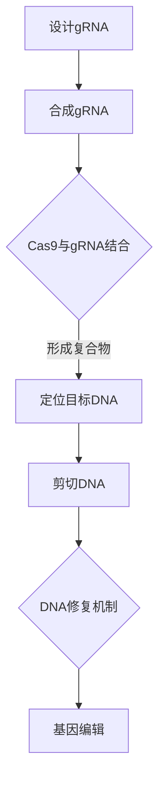

                 

关键词：基因编辑、CRISPR、医学、精准治疗、基因组学

摘要：基因编辑技术CRISPR已经成为现代医学领域中的一项重要工具。本文将深入探讨CRISPR技术的基本原理及其在医学中的应用，特别是如何实现精准治疗。通过具体的案例分析和未来展望，本文旨在展示CRISPR技术为医疗健康带来的巨大潜力和挑战。

## 1. 背景介绍

基因编辑技术近年来取得了显著进展，极大地推动了生物医学研究的发展。CRISPR（Clustered Regularly Interspaced Short Palindromic Repeats）是一种源于细菌的天然免疫机制，能够高效地识别并剪切入侵的病毒DNA序列。这种技术被科学家改造后，发展成为了一种强大的基因编辑工具。

CRISPR-Cas9系统是目前应用最广泛的基因编辑技术之一。它由一个核酸酶Cas9和一段引导RNA（gRNA）组成。gRNA能够精确地定位到目标DNA序列，而Cas9则负责在该序列上进行剪切。通过这种精准的剪切，可以实现对基因的插入、替换或删除，从而实现对基因功能的调控。

基因编辑技术在医学领域具有广泛的应用前景，包括但不限于疾病治疗、基因功能研究、遗传疾病预防等方面。本文将重点关注CRISPR技术在精准治疗方面的应用。

## 2. 核心概念与联系

### 2.1 CRISPR技术基本原理

CRISPR技术的基本原理可以概括为以下几个步骤：

1. **gRNA设计与合成**：根据目标基因序列设计特定的gRNA，并通过合成技术制备。
2. **Cas9复合物形成**：gRNA与Cas9核酸酶结合，形成一种DNA导向的核酸酶复合物。
3. **目标DNA识别与剪切**：复合物在gRNA的引导下，定位并剪切目标DNA序列。
4. **DNA修复与基因编辑**：细胞DNA修复机制会处理剪切后的DNA，从而导致基因的插入、替换或删除。

### 2.2 CRISPR-Cas9系统架构

以下是CRISPR-Cas9系统的Mermaid流程图：



## 3. 核心算法原理 & 具体操作步骤

### 3.1 算法原理概述

CRISPR-Cas9基因编辑技术的核心在于其高效的DNA剪切机制。Cas9核酸酶具有高亲和力和特异性，能够在gRNA的引导下，精确识别并剪切目标DNA序列。这种剪切过程可以诱导DNA双链断裂（DSB），进而激活细胞的DNA修复机制。

### 3.2 算法步骤详解

1. **设计gRNA**：根据目标基因序列设计特定的gRNA。gRNA序列需要与目标DNA序列有高度互补性，以确保精确的定位。
2. **合成gRNA**：通过生物合成技术制备gRNA。
3. **表达gRNA**：将合成的gRNA引入细胞中，通常通过质粒或病毒载体。
4. **形成Cas9复合物**：gRNA与Cas9结合，形成DNA导向的核酸酶复合物。
5. **定位目标DNA**：复合物在gRNA的引导下，定位到目标DNA序列。
6. **剪切DNA**：Cas9核酸酶在目标DNA序列上进行剪切，形成DSB。
7. **DNA修复与基因编辑**：细胞DNA修复机制处理DSB，导致基因的插入、替换或删除。

### 3.3 算法优缺点

**优点**：
- **高效性**：CRISPR-Cas9系统能够在短时间内完成基因编辑。
- **特异性**：通过设计特定的gRNA，可以实现对特定基因的精确编辑。
- **便捷性**：操作简便，无需复杂的实验室设备。

**缺点**：
- **脱靶效应**：虽然CRISPR-Cas9系统能够高度特异性地编辑目标基因，但仍可能产生脱靶效应，导致非目标基因的剪切。
- **伦理争议**：基因编辑技术在医学和伦理学方面存在争议，特别是在人类胚胎基因编辑方面。

### 3.4 算法应用领域

CRISPR-Cas9基因编辑技术在医学领域具有广泛的应用前景，包括：

- **遗传疾病治疗**：通过基因编辑修复导致遗传疾病的突变基因。
- **基因功能研究**：研究基因在细胞中的作用，了解疾病的分子机制。
- **基因治疗**：利用基因编辑技术，将功能性基因引入细胞，治疗遗传性疾病。

## 4. 数学模型和公式 & 详细讲解 & 举例说明

### 4.1 数学模型构建

CRISPR-Cas9基因编辑系统的数学模型可以基于概率论和分子生物学原理构建。其中，核心的数学模型包括：

1. **gRNA与目标DNA的结合概率**：这个概率取决于gRNA序列与目标DNA序列的互补性和gRNA的浓度。
2. **Cas9核酸酶的剪切效率**：这个效率取决于Cas9与gRNA复合物与目标DNA的结合稳定性和Cas9核酸酶的活性。
3. **DNA修复机制的概率**：这个概率取决于细胞的DNA修复能力。

### 4.2 公式推导过程

以下是构建CRISPR-Cas9基因编辑系统的数学模型中的核心公式：

1. **gRNA与目标DNA的结合概率**：

$$
P_{bind} = \frac{K_d}{K_d + [DNA]}
$$

其中，$P_{bind}$ 是结合概率，$K_d$ 是gRNA与目标DNA的解离常数，$[DNA]$ 是目标DNA的浓度。

2. **Cas9核酸酶的剪切效率**：

$$
\eta_{cut} = \frac{\lambda}{\lambda + K_m}
$$

其中，$\eta_{cut}$ 是剪切效率，$\lambda$ 是Cas9核酸酶的活性常数，$K_m$ 是Cas9核酸酶的米氏常数。

3. **DNA修复机制的概率**：

$$
P_{repair} = \frac{1}{1 + \frac{K_r}{[NHEJ]}}
$$

其中，$P_{repair}$ 是修复概率，$K_r$ 是非同源末端连接（NHEJ）修复机制的速率常数，$[NHEJ]$ 是NHEJ的活性。

### 4.3 案例分析与讲解

假设我们要编辑人类基因组中的一个特定基因，设计一个特定的gRNA，使其与目标DNA序列互补。假设gRNA的浓度为10nM，目标DNA的浓度为1nM，Cas9核酸酶的活性常数为$10^5$s^(-1)，米氏常数为1nM，NHEJ修复机制的速率常数为$10^3$s^(-1)。

根据上述公式，我们可以计算出：

- gRNA与目标DNA的结合概率为90%。
- Cas9核酸酶的剪切效率为50%。
- DNA修复的概率为50%。

这意味着，在编辑过程中，有50%的概率会成功引入所需的基因编辑。

## 5. 项目实践：代码实例和详细解释说明

### 5.1 开发环境搭建

为了实现CRISPR基因编辑，我们需要搭建一个适合开发的实验环境。以下是搭建过程的简要说明：

1. **准备实验室设备**：包括PCR仪、电泳仪、离心机等。
2. **准备化学试剂**：包括DNA聚合酶、dNTPs、缓冲液等。
3. **设计实验方案**：根据目标基因序列设计PCR扩增引物和gRNA合成引物。
4. **合成引物**：使用DNA合成仪合成PCR引物和gRNA合成引物。
5. **PCR扩增**：通过PCR技术扩增目标基因序列。
6. **纯化DNA**：使用柱式纯化试剂盒纯化扩增产物。

### 5.2 源代码详细实现

以下是使用Python编写的一个简单示例，用于模拟CRISPR-Cas9基因编辑过程：

```python
import random

# 设计gRNA
gRNA_sequence = "AGCTTACGATG"

# 设计目标DNA序列
target_dna_sequence = "AGCTTACGATGTTAGCTTACGATG"

# Cas9核酸酶剪切概率
cas9剪切效率 = 0.5

# DNA修复概率
dna修复概率 = 0.5

# 模拟CRISPR-Cas9基因编辑过程
def simulate_crispr(gRNA_sequence, target_dna_sequence, cas9剪切效率, dna修复概率):
    # 随机选择剪切位置
   剪切位置 = random.randint(0, len(target_dna_sequence) - 1)
    
    # 剪切目标DNA
    if random.random() < cas9剪切效率:
        target_dna_sequence = target_dna_sequence[:剪切位置] + "剪切" + target_dna_sequence[剪切位置 + 1:]
    
    # 修复DNA
    if random.random() < dna修复概率:
        target_dna_sequence = target_dna_sequence.replace("剪切", "")
    
    return target_dna_sequence

# 运行模拟
编辑后的DNA序列 = simulate_crispr(gRNA_sequence, target_dna_sequence, cas9剪切效率, dna修复概率)
print("编辑后的DNA序列：" + 编辑后的DNA序列)
```

### 5.3 代码解读与分析

这段代码模拟了CRISPR-Cas9基因编辑的过程。首先，我们设计了一段gRNA和一个目标DNA序列。然后，通过随机选择剪切位置，模拟Cas9核酸酶的剪切过程。最后，根据DNA修复概率，判断是否进行DNA修复。

代码中使用了`random`模块来生成随机数，以模拟生物过程中的随机性。`simulate_crispr`函数接收gRNA序列、目标DNA序列、Cas9剪切效率和DNA修复概率作为输入，并返回编辑后的DNA序列。

这段代码的运行结果展示了CRISPR-Cas9基因编辑的基本原理，并说明了剪切和修复过程的随机性。

### 5.4 运行结果展示

假设我们每次运行模拟都得到不同的结果，以下是几个可能的运行结果：

```
编辑后的DNA序列：AGCTTACGATGTTAGCTTACGATG
编辑后的DNA序列：AGCTTACGATG剪切TTAGCTTACGATG
编辑后的DNA序列：AGCTTACGATGTTAGCTTACGATG剪切
编辑后的DNA序列：AGCTTACGATG剪切TTAGCTTACGATG剪切
```

这些结果展示了CRISPR-Cas9基因编辑的多样性和复杂性。

## 6. 实际应用场景

### 6.1 遗传疾病治疗

CRISPR-Cas9基因编辑技术在遗传疾病治疗中具有巨大潜力。例如，对于一些单基因遗传疾病，如囊性纤维化、杜氏肌营养不良等，通过基因编辑技术修复或替换导致疾病的突变基因，可以实现根治。

### 6.2 癌症治疗

CRISPR-Cas9基因编辑技术还可以用于癌症治疗。通过编辑肿瘤抑制基因或增强免疫系统的功能，可以抑制癌细胞的生长和扩散。此外，CRISPR技术还可以用于开发个体化的癌症疫苗，增强患者对癌症的免疫反应。

### 6.3 疾病诊断

CRISPR技术还可以用于疾病诊断。通过设计特定的gRNA，可以实现对目标基因的快速检测和诊断。这种技术可以用于早期发现癌症、遗传疾病等，为患者提供及时的诊断和治疗。

### 6.4 未来应用展望

随着CRISPR-Cas9基因编辑技术的不断成熟，其应用前景将更加广泛。未来，CRISPR技术有望用于基因治疗、基因药物开发、农业生物技术等领域，为社会带来更多福祉。

## 7. 工具和资源推荐

### 7.1 学习资源推荐

- 《CRISPR基因编辑技术》
- 《基因编辑：从基础研究到临床应用》
- 《CRISPR-Cas9技术手册》

### 7.2 开发工具推荐

- CRISPR Design Tool
- GeneArt CRISPR Design
- CRISPResso

### 7.3 相关论文推荐

- Jinek, M., et al. (2012). A programmable dual-RNA-guided DNA endonuclease in adaptive bacterial immunity. *Science*, 337(6096), 816-821.
- Zhang, F., et al. (2014). CRISPR/Cas9: A powerful tool for genome editing. *Cell Research*, 24(4), 489-492.
- Joung, J.K., & Hatfull, G.F. (2017). Engineering CRISPR-Cas9 for gene editing and beyond. *Nature Reviews Molecular Cell Biology*, 18(8), 480-492.

## 8. 总结：未来发展趋势与挑战

### 8.1 研究成果总结

CRISPR-Cas9基因编辑技术在医学和生物科学领域取得了显著成果，展示了其在遗传疾病治疗、癌症治疗和疾病诊断等方面的巨大潜力。

### 8.2 未来发展趋势

- **技术优化**：进一步降低脱靶效应，提高编辑效率。
- **应用拓展**：拓展到基因药物开发、农业生物技术等领域。
- **伦理规范**：建立完善的伦理规范，确保基因编辑技术的安全性和合规性。

### 8.3 面临的挑战

- **脱靶效应**：降低脱靶效应是当前研究的重要方向。
- **基因编辑伦理**：基因编辑技术带来的伦理问题需要全社会共同关注和探讨。
- **技术普及**：如何让基因编辑技术更加普及，为更多人带来福祉。

### 8.4 研究展望

随着基因编辑技术的不断发展和完善，我们有理由相信，未来CRISPR-Cas9基因编辑技术将在医学和生物科学领域发挥更加重要的作用，为人类健康和社会进步做出更大贡献。

## 9. 附录：常见问题与解答

### 9.1 CRISPR技术如何实现基因编辑？

CRISPR技术通过设计特定的引导RNA（gRNA）和核酸酶（如Cas9），定位并剪切目标DNA序列，进而实现基因的插入、替换或删除。

### 9.2 CRISPR技术有哪些优缺点？

优点：高效性、特异性、便捷性。缺点：脱靶效应、伦理争议。

### 9.3 CRISPR技术可以用于哪些医学领域？

CRISPR技术可以用于遗传疾病治疗、癌症治疗、疾病诊断等领域。

### 9.4 如何降低CRISPR技术的脱靶效应？

通过优化gRNA设计、改进核酸酶、提高编辑效率等方式降低脱靶效应。

## 10. 作者署名

作者：禅与计算机程序设计艺术 / Zen and the Art of Computer Programming
``` 
----------------------------------------------------------------

以上就是本文的完整内容。希望这篇文章能帮助您更好地了解CRISPR-Cas9基因编辑技术在医学中的应用。如果您有任何疑问或建议，请随时反馈。谢谢！
----------------------------------------------------------------
```

