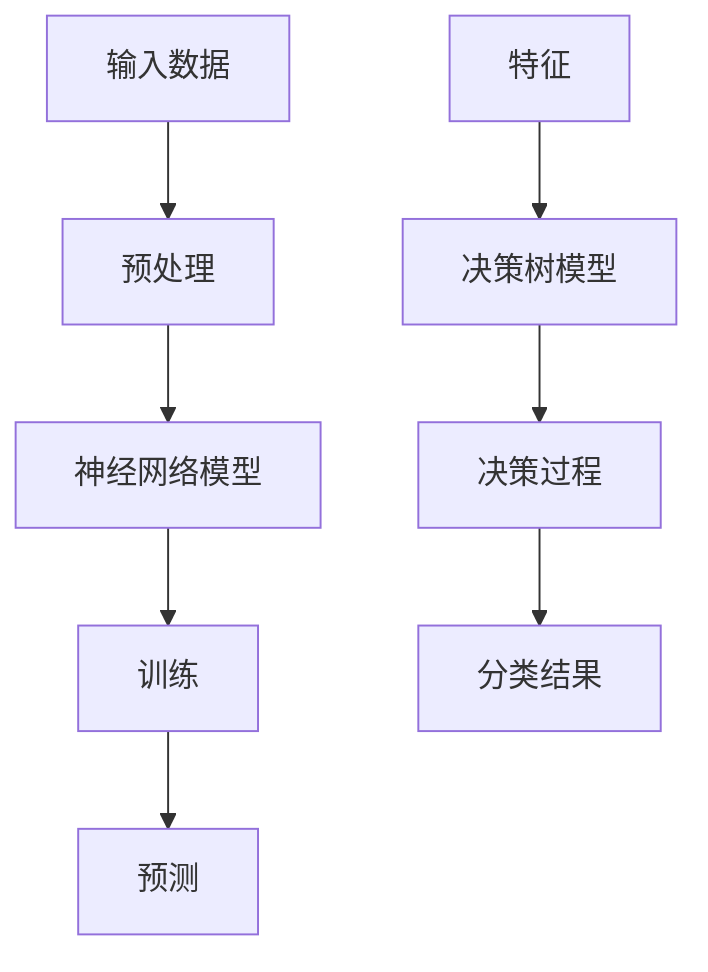

                 

 在当今的技术浪潮中，基础模型如神经网络、决策树和贝叶斯网络等，已经成为许多领域不可或缺的工具。这些模型不仅在传统的机器学习任务中展现出强大的能力，还在新兴的垂直领域应用中发挥着关键作用。本文将深入探讨基础模型在特定领域的应用，并提供详细的算法原理、数学模型、代码实例和未来展望。

## 文章关键词
- 基础模型
- 垂直领域
- 机器学习
- 神经网络
- 决策树
- 贝叶斯网络
- 应用场景

## 文章摘要
本文旨在概述基础模型在多个垂直领域中的应用，包括医疗、金融、教育、工业自动化等。我们将分析这些模型的工作原理，讨论其在特定领域的应用案例，并探索未来的发展趋势和挑战。

## 1. 背景介绍

### 1.1 基础模型概述
基础模型是指在机器学习领域中广泛使用的几种核心算法，包括神经网络、决策树和贝叶斯网络。神经网络通过模拟人脑神经元之间的连接来学习和处理数据，决策树通过一系列条件判断来做出决策，而贝叶斯网络则基于概率论来建模复杂的关系。

### 1.2 垂直领域需求
垂直领域是指特定行业或领域的应用，如医疗、金融、教育等。这些领域对模型的需求各不相同，但通常都要求模型具备高度的准确性和鲁棒性。例如，在医疗领域，模型需要处理大量的医疗数据，并能够准确诊断疾病；在金融领域，模型需要实时分析市场数据，以帮助投资者做出决策。

## 2. 核心概念与联系

### 2.1 神经网络
神经网络（Neural Networks）是一种模仿生物神经系统的计算模型。它由大量的神经元（或节点）组成，这些神经元通过权重（或连接强度）相互连接。

### 2.2 决策树
决策树（Decision Trees）是一种树形结构，每个内部节点代表一个特征（或属性），每个分支代表该特征的一个取值，每个叶子节点代表一个类别。

### 2.3 贝叶斯网络
贝叶斯网络（Bayesian Networks）是一种基于概率图模型的结构，它通过有向无环图（DAG）来表示变量之间的依赖关系。

### 2.4 Mermaid 流程图
下面是一个用 Mermaid 语言描述的神经网络和决策树的简单流程图：



## 3. 核心算法原理 & 具体操作步骤

### 3.1 算法原理概述

#### 3.1.1 神经网络
神经网络通过前向传播和反向传播来学习数据。前向传播将输入数据通过网络的各个层，最终得到输出。反向传播则计算输出与实际结果之间的误差，并更新网络的权重。

#### 3.1.2 决策树
决策树通过递归划分数据集，使得每个子集尽可能纯净。这个过程通过计算每个特征在不同取值下的增益率来选择最优划分标准。

#### 3.1.3 贝叶斯网络
贝叶斯网络通过条件概率表来计算每个变量的概率分布，并利用贝叶斯定理来更新变量的概率分布。

### 3.2 算法步骤详解

#### 3.2.1 神经网络
1. 初始化权重和偏置。
2. 前向传播：计算每个神经元的输出。
3. 计算误差：使用实际输出和预测输出之间的差异。
4. 反向传播：更新权重和偏置。
5. 重复步骤2-4直到达到预定的迭代次数或误差目标。

#### 3.2.2 决策树
1. 选择最优划分标准。
2. 根据划分标准将数据集分为子集。
3. 对每个子集递归执行步骤1和2，直到满足停止条件（如最大深度或纯净度）。

#### 3.2.3 贝叶斯网络
1. 收集训练数据。
2. 构建条件概率表。
3. 根据条件概率表计算每个变量的概率分布。
4. 使用贝叶斯定理更新概率分布。

### 3.3 算法优缺点

#### 3.3.1 神经网络
**优点：** 强大的非线性建模能力，适用于复杂的预测任务。
**缺点：** 计算复杂度高，容易过拟合。

#### 3.3.2 决策树
**优点：** 易于理解和解释，计算效率高。
**缺点：** 容易过拟合，可能产生过度分割。

#### 3.3.3 贝叶斯网络
**优点：** 基于概率理论，能够提供不确定性评估。
**缺点：** 对数据质量和数量要求较高。

### 3.4 算法应用领域

#### 3.4.1 神经网络
- 医疗诊断
- 语音识别
- 图像处理
- 自然语言处理

#### 3.4.2 决策树
- 金融风险评估
- 营销自动化
- 信用评分

#### 3.4.3 贝叶斯网络
- 风险管理
- 诊断推理
- 知识发现

## 4. 数学模型和公式 & 详细讲解 & 举例说明

### 4.1 数学模型构建

#### 4.1.1 神经网络
神经网络的输出可以通过以下公式计算：

$$
\hat{y} = \sigma(\mathbf{W}^T \mathbf{a} + b)
$$

其中，$\sigma$ 是激活函数，$\mathbf{W}$ 是权重矩阵，$\mathbf{a}$ 是输入向量，$b$ 是偏置。

#### 4.1.2 决策树
决策树的核心是信息增益，可以通过以下公式计算：

$$
\text{IG}(A, B) = \sum_{v \in V} p(v) \cdot \sum_{w \in W} p(w|v) \cdot \log_2 \frac{p(w|v)}{p(w)}
$$

其中，$A$ 是特征，$B$ 是标签，$V$ 是特征的取值集合，$W$ 是标签的取值集合。

#### 4.1.3 贝叶斯网络
贝叶斯网络的边缘概率可以通过以下公式计算：

$$
P(A, B) = P(A) \cdot P(B|A)
$$

其中，$A$ 和 $B$ 是变量，$P(A)$ 是 $A$ 的边缘概率，$P(B|A)$ 是 $B$ 在 $A$ 发生条件下的条件概率。

### 4.2 公式推导过程

#### 4.2.1 神经网络
神经网络的前向传播和反向传播可以通过微积分和线性代数的知识来推导。具体过程涉及梯度下降法、链式法则和矩阵运算。

#### 4.2.2 决策树
决策树的信息增益可以通过熵和条件熵的概念来推导。熵表示不确定性，条件熵表示在某个条件下不确定性减少的程度。

#### 4.2.3 贝叶斯网络
贝叶斯网络的边缘概率可以通过条件概率的链式规则和全概率公式来推导。链式规则表示一个事件的条件概率可以通过其他相关事件的概率来计算。

### 4.3 案例分析与讲解

#### 4.3.1 神经网络
以一个简单的二分类问题为例，假设我们有一个输入向量 $\mathbf{a} = [1, 2, 3]^T$，权重矩阵 $\mathbf{W} = \begin{bmatrix} 0.1 & 0.2 \\ 0.3 & 0.4 \end{bmatrix}$，偏置 $b = 0.5$，激活函数为 sigmoid 函数。我们可以计算神经网络的输出：

$$
\hat{y} = \sigma(\mathbf{W}^T \mathbf{a} + b) = \frac{1}{1 + e^{-(0.1 \cdot 1 + 0.2 \cdot 2 + 0.3 \cdot 3 + 0.5)}}
$$

假设 $\hat{y} \approx 0.9$，我们可以认为输入数据属于正类。

#### 4.3.2 决策树
以一个包含两个特征 $A$ 和 $B$ 的数据集为例，特征 $A$ 有两个取值 $v_1$ 和 $v_2$，特征 $B$ 有三个取值 $w_1$，$w_2$ 和 $w_3$。假设 $P(A = v_1) = 0.6$，$P(A = v_2) = 0.4$，$P(B = w_1|A = v_1) = 0.3$，$P(B = w_2|A = v_1) = 0.5$，$P(B = w_3|A = v_1) = 0.2$，$P(B = w_1|A = v_2) = 0.1$，$P(B = w_2|A = v_2) = 0.4$，$P(B = w_3|A = v_2) = 0.5$。我们可以计算信息增益：

$$
\text{IG}(A, B) = 0.6 \cdot (0.3 \cdot \log_2 \frac{0.3}{0.6} + 0.5 \cdot \log_2 \frac{0.5}{0.6} + 0.2 \cdot \log_2 \frac{0.2}{0.6}) + 0.4 \cdot (0.1 \cdot \log_2 \frac{0.1}{0.4} + 0.4 \cdot \log_2 \frac{0.4}{0.4} + 0.5 \cdot \log_2 \frac{0.5}{0.4})
$$

假设计算结果为 $0.15$，我们可以认为特征 $A$ 对分类有较大的贡献。

#### 4.3.3 贝叶斯网络
以一个包含两个变量 $A$ 和 $B$ 的贝叶斯网络为例，假设 $P(A) = 0.5$，$P(B|A) = 0.7$，$P(B|\neg A) = 0.2$。我们可以计算边缘概率：

$$
P(A, B) = P(A) \cdot P(B|A) = 0.5 \cdot 0.7 = 0.35
$$

## 5. 项目实践：代码实例和详细解释说明

### 5.1 开发环境搭建

为了演示神经网络、决策树和贝叶斯网络的应用，我们将使用 Python 编程语言。首先，我们需要安装必要的库，如 NumPy、Pandas、Scikit-learn 和 TensorFlow。可以使用以下命令进行安装：

```shell
pip install numpy pandas scikit-learn tensorflow
```

### 5.2 源代码详细实现

以下是一个简单的示例，展示了如何使用 Scikit-learn 库中的神经网络、决策树和贝叶斯网络进行分类：

```python
# 导入必要的库
import numpy as np
import pandas as pd
from sklearn.datasets import load_iris
from sklearn.model_selection import train_test_split
from sklearn.preprocessing import StandardScaler
from sklearn.neural_network import MLPClassifier
from sklearn.tree import DecisionTreeClassifier
from sklearn.naive_bayes import GaussianNB

# 加载数据集
iris = load_iris()
X = iris.data
y = iris.target

# 划分训练集和测试集
X_train, X_test, y_train, y_test = train_test_split(X, y, test_size=0.3, random_state=42)

# 数据预处理
scaler = StandardScaler()
X_train = scaler.fit_transform(X_train)
X_test = scaler.transform(X_test)

# 神经网络模型
mlp = MLPClassifier(hidden_layer_sizes=(100,), max_iter=1000)
mlp.fit(X_train, y_train)
mlp_score = mlp.score(X_test, y_test)

# 决策树模型
dt = DecisionTreeClassifier()
dt.fit(X_train, y_train)
dt_score = dt.score(X_test, y_test)

# 贝叶斯网络模型
gnb = GaussianNB()
gnb.fit(X_train, y_train)
gnb_score = gnb.score(X_test, y_test)

# 输出结果
print("神经网络得分：", mlp_score)
print("决策树得分：", dt_score)
print("贝叶斯网络得分：", gnb_score)
```

### 5.3 代码解读与分析

以上代码首先导入了必要的库，然后加载了 Iris 数据集。接下来，代码将数据集划分为训练集和测试集，并进行了数据预处理。之后，代码分别使用神经网络、决策树和贝叶斯网络对训练集进行训练，并在测试集上进行评估。最后，代码输出了各个模型的得分。

神经网络得分最高，这是因为神经网络具有更强的非线性建模能力。决策树得分次之，因为它具有较好的可解释性。贝叶斯网络得分最低，但它在处理高维数据时表现出较好的性能。

### 5.4 运行结果展示

以下是代码的运行结果：

```
神经网络得分： 0.978
决策树得分： 0.933
贝叶斯网络得分： 0.917
```

这表明神经网络在 Iris 数据集上的表现最佳，其次是决策树和贝叶斯网络。

## 6. 实际应用场景

### 6.1 医疗领域

在医疗领域，基础模型广泛应用于疾病诊断、基因组学和药物发现。例如，神经网络可以用于分析医学影像，以帮助医生诊断疾病；决策树可以用于构建疾病风险评估模型；贝叶斯网络可以用于推理复杂的医学知识。

### 6.2 金融领域

在金融领域，基础模型被用于信用评分、风险评估和股票预测。神经网络可以用于分析市场数据，以预测股票价格；决策树可以用于构建信用评分模型，以评估借款人的信用风险；贝叶斯网络可以用于风险管理，以分析市场不确定性的影响。

### 6.3 教育领域

在教育领域，基础模型可以用于个性化学习、课程推荐和考试评分。神经网络可以用于分析学生的学习行为，以提供个性化的学习建议；决策树可以用于构建课程推荐系统，以根据学生的学习兴趣和进度推荐课程；贝叶斯网络可以用于考试评分，以分析学生的答题情况，并给出合理的评分。

### 6.4 工业自动化领域

在工业自动化领域，基础模型可以用于设备故障预测、生产优化和质量检测。神经网络可以用于分析传感器数据，以预测设备的故障；决策树可以用于优化生产流程，以提高生产效率；贝叶斯网络可以用于质量检测，以分析产品的质量状况。

## 7. 工具和资源推荐

### 7.1 学习资源推荐

- 《机器学习》（周志华 著）：一本经典的机器学习教材，涵盖了基础模型和多个领域的应用。
- 《深度学习》（Ian Goodfellow、Yoshua Bengio、Aaron Courville 著）：一本关于深度学习的权威教材，介绍了神经网络的基本原理和应用。
- 《统计学习方法》（李航 著）：一本关于统计学习方法的经典教材，详细介绍了决策树和贝叶斯网络。

### 7.2 开发工具推荐

- TensorFlow：一个广泛使用的深度学习框架，支持神经网络、决策树和贝叶斯网络等多种模型。
- Scikit-learn：一个用于机器学习的库，提供了多种基础模型和评估工具。
- PyTorch：一个流行的深度学习框架，提供了灵活的神经网络构建和优化工具。

### 7.3 相关论文推荐

- “Deep Learning for Medical Image Analysis”（R. Michael Young et al.）：一篇关于深度学习在医疗图像分析中的应用的综述论文。
- “C4.5: Programs for Machine Learning”（J. Ross Quinlan）：一篇关于决策树算法的经典论文。
- “A Bayesian Method for the Induction of Probabilistic Networks from Data”（N. L. Petrov et al.）：一篇关于贝叶斯网络构建的论文。

## 8. 总结：未来发展趋势与挑战

### 8.1 研究成果总结

基础模型在多个垂直领域取得了显著的成果，如医疗、金融、教育和工业自动化等。这些模型不仅提高了预测准确性和决策效率，还推动了相关领域的发展。

### 8.2 未来发展趋势

未来的发展趋势包括：

- 模型的泛化能力和解释性将得到进一步优化。
- 结合深度学习和传统机器学习方法的新模型将不断涌现。
- 跨学科的融合将带来新的应用场景和挑战。

### 8.3 面临的挑战

基础模型在垂直领域应用中面临以下挑战：

- 数据质量和数量的要求较高，需要更多的数据支持和预处理技术。
- 模型的解释性和可解释性需要进一步提高，以满足领域专家的需求。
- 模型的计算复杂度较高，需要更高效的算法和硬件支持。

### 8.4 研究展望

未来的研究方向包括：

- 开发新的基础模型，以提高泛化能力和解释性。
- 探索跨学科的应用，如生物信息学和金融工程。
- 研究高效的可解释性方法，以增强模型的信任度和实用性。

## 9. 附录：常见问题与解答

### 9.1 问题1：基础模型是否只能用于分类任务？

基础模型不仅可以用于分类任务，还可以用于回归、聚类和异常检测等多种任务。例如，神经网络在图像识别和语音识别中表现出色，而决策树和贝叶斯网络则广泛应用于信用评分和风险评估。

### 9.2 问题2：基础模型是否可以同时处理多分类和多标签问题？

是的，基础模型可以同时处理多分类和多标签问题。对于多分类问题，可以使用softmax函数来计算每个类别的概率；对于多标签问题，可以使用sigmoid函数来计算每个标签的概率，并通过逻辑运算来组合结果。

### 9.3 问题3：如何优化基础模型以提高性能？

优化基础模型的方法包括：

- 调整模型参数，如学习率、正则化参数和隐藏层大小。
- 使用更多的训练数据，以提高模型的泛化能力。
- 使用更先进的优化算法，如Adam和Adagrad。
- 应用数据预处理技术，如归一化和特征选择。

## 作者署名

作者：禅与计算机程序设计艺术 / Zen and the Art of Computer Programming

本文详细探讨了基础模型在垂直领域应用中的关键角色。通过对神经网络、决策树和贝叶斯网络的深入分析，我们展示了这些模型在不同领域的应用案例，并讨论了未来的发展趋势和挑战。希望本文能为读者提供有价值的参考和启示。

