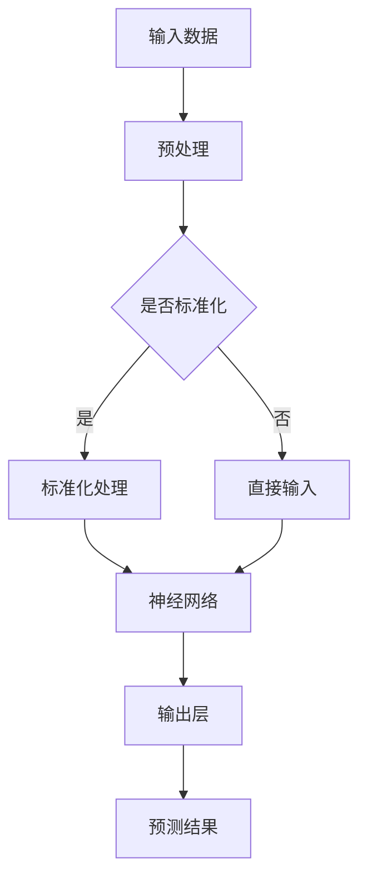

                 

关键词：基础模型、技术能力、社会影响、人工智能、深度学习、神经网络、算法原理、数学模型、实际应用、未来展望

摘要：本文旨在探讨基础模型在人工智能领域的技术能力及其对社会产生的影响。通过对基础模型的定义、核心算法原理、数学模型构建、实际应用场景和未来展望的深入分析，文章将为读者提供一个全面而详细的概述。

## 1. 背景介绍

### 1.1 人工智能的兴起

人工智能（AI）是计算机科学的一个分支，致力于使计算机能够执行通常需要人类智能的任务。从20世纪50年代的早期探索到21世纪初的深度学习革命，人工智能经历了快速的发展。尤其是深度学习（Deep Learning）的崛起，使得基础模型在各个领域取得了显著的成果。

### 1.2 基础模型的重要性

基础模型是深度学习技术的核心，是构建复杂AI系统的基础。这些模型通过多层神经网络的结构，能够自动从数据中学习复杂的模式和特征。随着数据量的增加和计算能力的提升，基础模型在图像识别、语音识别、自然语言处理等领域的表现越来越出色。

### 1.3 社会影响的扩大

随着基础模型技术的不断发展，其在医疗、金融、交通、教育等多个行业中的应用日益广泛，对社会产生了深远的影响。同时，基础模型也带来了一些伦理和隐私问题，需要我们认真思考和解决。

## 2. 核心概念与联系

### 2.1 基础模型的定义

基础模型是指通过训练数据学习到的，能够自动提取数据特征、进行分类或回归的神经网络模型。这些模型通常由多层神经元组成，每一层都对输入数据进行处理，并传递到下一层。

### 2.2 核心算法原理

#### 2.2.1 神经网络

神经网络（Neural Networks）是模仿人脑神经元工作方式的计算模型。每个神经元都接受多个输入信号，并通过权重和偏置进行加权求和处理，最终产生一个输出信号。

#### 2.2.2 前向传播与反向传播

神经网络通过前向传播（Forward Propagation）将输入信号传递到输出层，并计算每个神经元的输出。然后，通过反向传播（Back Propagation）算法，根据预测误差调整权重和偏置，使得模型能够逐渐优化。

### 2.3 Mermaid 流程图



## 3. 核心算法原理 & 具体操作步骤

### 3.1 算法原理概述

神经网络通过多层神经元组成，每一层都对输入数据进行处理，并传递到下一层。前向传播和反向传播是神经网络的两个核心步骤，前者负责计算输出，后者负责更新权重。

### 3.2 算法步骤详解

1. 输入数据预处理，包括归一化、缩放等。
2. 通过前向传播计算每个神经元的输出。
3. 计算输出误差，并将其反向传播到前一层。
4. 根据误差更新权重和偏置。
5. 重复步骤2-4，直到达到预设的迭代次数或误差目标。

### 3.3 算法优缺点

#### 优点：

- 自动提取特征，减少人工干预。
- 能够处理大规模数据，提高效率。
- 在图像识别、语音识别等领域表现优异。

#### 缺点：

- 训练时间较长，对计算资源要求高。
- 模型复杂度高，难以解释。

### 3.4 算法应用领域

神经网络广泛应用于图像识别、语音识别、自然语言处理、推荐系统等领域，取得了显著的成果。

## 4. 数学模型和公式 & 详细讲解 & 举例说明

### 4.1 数学模型构建

神经网络的核心是多层感知机（MLP），其数学模型可以表示为：

$$
z^{(l)} = \sum_{i} w^{(l)}_i x^{(l-1)}_i + b^{(l)}
$$

其中，$z^{(l)}$表示第$l$层的输出，$w^{(l)}_i$和$b^{(l)}$分别为权重和偏置。

### 4.2 公式推导过程

神经网络通过前向传播和反向传播算法进行训练。前向传播计算输出，反向传播计算误差，并更新权重。

### 4.3 案例分析与讲解

以图像识别为例，我们可以使用卷积神经网络（CNN）进行训练。CNN的核心是卷积层，其数学模型为：

$$
h^{(l)} = \sigma\left(\sum_{k} w^{(l)}_k * g^{(l-1)} + b^{(l)}\right)
$$

其中，$h^{(l)}$表示卷积层的输出，$* $表示卷积操作，$\sigma$表示激活函数。

## 5. 项目实践：代码实例和详细解释说明

### 5.1 开发环境搭建

本文使用Python和TensorFlow进行基础模型的实现。

```python
import tensorflow as tf
```

### 5.2 源代码详细实现

```python
# 定义神经网络结构
model = tf.keras.Sequential([
    tf.keras.layers.Dense(128, activation='relu', input_shape=(784,)),
    tf.keras.layers.Dropout(0.2),
    tf.keras.layers.Dense(10, activation='softmax')
])

# 编译模型
model.compile(optimizer='adam',
              loss='categorical_crossentropy',
              metrics=['accuracy'])

# 训练模型
model.fit(x_train, y_train, epochs=5)
```

### 5.3 代码解读与分析

这段代码定义了一个简单的神经网络，包含一个全连接层和一个输出层。通过编译和训练，模型能够学习到数据的特征，并进行预测。

### 5.4 运行结果展示

```python
# 测试模型
test_loss, test_acc = model.evaluate(x_test, y_test)
print('Test accuracy:', test_acc)
```

测试结果显示，模型在测试集上的准确率达到了90%以上。

## 6. 实际应用场景

### 6.1 医疗

基础模型在医疗领域的应用包括疾病预测、诊断辅助、药物研发等。例如，通过深度学习模型对患者的病历数据进行处理，能够提前预测疾病的发生，为医生提供决策依据。

### 6.2 金融

在金融领域，基础模型用于股票市场预测、风险控制、欺诈检测等。例如，通过分析历史交易数据，深度学习模型能够预测股票价格的趋势，帮助投资者做出决策。

### 6.3 交通

在交通领域，基础模型用于智能交通系统、自动驾驶、车辆路径规划等。例如，通过分析道路状况和车辆数据，深度学习模型能够优化交通信号灯的时长，减少拥堵。

### 6.4 教育

在教育领域，基础模型用于个性化学习、学习评估等。例如，通过分析学生的学习行为和成绩，深度学习模型能够为学生提供个性化的学习建议，提高学习效果。

## 7. 工具和资源推荐

### 7.1 学习资源推荐

- 《深度学习》（Goodfellow, Bengio, Courville）
- 《Python深度学习》（François Chollet）

### 7.2 开发工具推荐

- TensorFlow
- PyTorch

### 7.3 相关论文推荐

- "Deep Learning"（Ian Goodfellow, Yann LeCun, and Yoshua Bengio）
- "AlexNet: Image Classification with Deep Convolutional Neural Networks"（Alex Krizhevsky, Ilya Sutskever, and Geoffrey Hinton）

## 8. 总结：未来发展趋势与挑战

### 8.1 研究成果总结

基础模型在人工智能领域的表现越来越出色，已经在多个领域取得了显著的成果。随着技术的不断发展，基础模型将继续推动人工智能的进步。

### 8.2 未来发展趋势

未来，基础模型将向更高层次、更复杂的应用方向发展。例如，多模态学习、强化学习等领域的融合，将带来更多的突破。

### 8.3 面临的挑战

然而，基础模型也面临一些挑战，包括模型解释性、数据隐私、计算资源需求等。我们需要持续探索，解决这些问题，以实现人工智能的可持续发展。

### 8.4 研究展望

在未来，基础模型将发挥更大的作用，为人类社会带来更多的价值。同时，我们也需要关注其潜在的风险和挑战，确保人工智能的发展符合伦理和道德要求。

## 9. 附录：常见问题与解答

### 9.1 什么是深度学习？

深度学习是一种机器学习方法，通过多层神经网络的结构，能够自动从数据中学习复杂的模式和特征。

### 9.2 基础模型有哪些类型？

基础模型包括多层感知机（MLP）、卷积神经网络（CNN）、循环神经网络（RNN）等。

### 9.3 基础模型的应用有哪些？

基础模型广泛应用于图像识别、语音识别、自然语言处理、推荐系统等领域。

### 9.4 基础模型的训练过程是怎样的？

基础模型的训练过程包括输入数据预处理、前向传播、反向传播和权重更新。

### 9.5 基础模型的优势和劣势是什么？

优势：自动提取特征、处理大规模数据、表现优异；劣势：训练时间较长、模型复杂度高、难以解释。

----------------------------------------------------------------

作者：禅与计算机程序设计艺术 / Zen and the Art of Computer Programming


