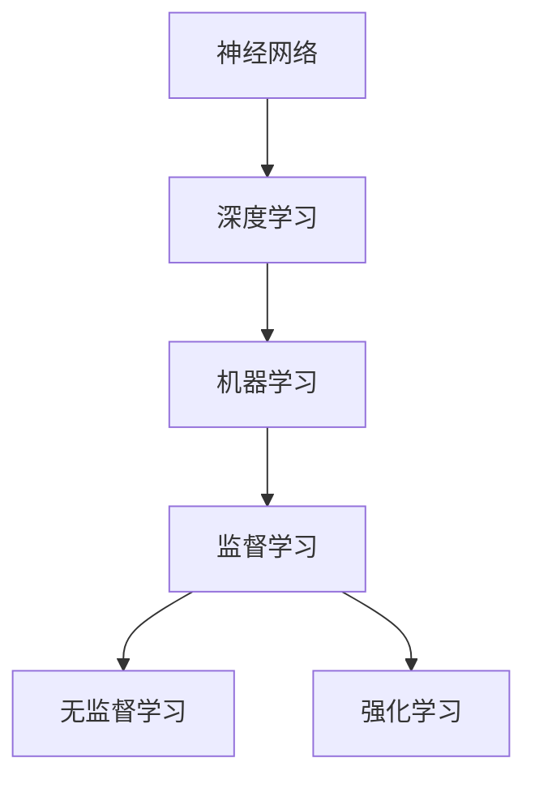

                 

关键词：基础模型、发展方向、人工智能、神经网络、深度学习、机器学习、神经网络架构、算法优化、数据效率、可解释性、安全性和隐私保护。

摘要：本文将深入探讨基础模型的未来发展方向，从核心概念、算法原理、数学模型、项目实践到实际应用场景等多个角度进行阐述。我们将分析当前的基础模型面临的技术挑战，并探讨未来可能的发展趋势，包括算法优化、数据效率提升、可解释性增强、安全性和隐私保护等方面的进展。

## 1. 背景介绍

基础模型是人工智能领域的基石，它们为各种复杂任务提供了强大的计算能力。从最早的感知机到现代的Transformer架构，基础模型的发展经历了多次重大变革。随着计算能力的提升和数据量的爆炸式增长，深度学习已经取得了令人瞩目的成就。然而，基础模型的发展并非一帆风顺，面临着一系列挑战，包括算法效率、数据依赖、可解释性、安全性和隐私保护等问题。

本文将重点关注以下主题：

1. **核心概念与联系**：介绍基础模型的核心概念，包括神经网络、深度学习、机器学习等，并使用Mermaid流程图展示它们的联系。
2. **核心算法原理 & 具体操作步骤**：详细探讨基础模型的算法原理和操作步骤，以及它们的优缺点和应用领域。
3. **数学模型和公式**：分析基础模型背后的数学模型和公式，并通过案例进行详细讲解。
4. **项目实践：代码实例和详细解释说明**：提供实际代码实例，对关键部分进行详细解释和分析。
5. **实际应用场景**：探讨基础模型在不同领域的应用，以及未来的应用前景。
6. **工具和资源推荐**：推荐学习资源和开发工具，帮助读者更好地理解和实践基础模型。
7. **总结：未来发展趋势与挑战**：总结研究成果，展望未来发展趋势和面临的挑战。

## 2. 核心概念与联系

### 2.1 神经网络

神经网络是基础模型中最基本的结构，由大量相互连接的神经元组成。每个神经元接收来自其他神经元的输入信号，通过激活函数产生输出。神经网络通过反向传播算法不断调整权重和偏置，以优化模型的性能。

### 2.2 深度学习

深度学习是一种基于神经网络的机器学习方法，通过堆叠多层神经网络来实现复杂的特征提取和表示。深度学习在图像识别、语音识别、自然语言处理等领域取得了显著成果。

### 2.3 机器学习

机器学习是一种让计算机通过数据学习规律的方法，包括监督学习、无监督学习和强化学习等。基础模型通常用于监督学习，通过学习输入和输出之间的关系来预测新的数据。

### 2.4 Mermaid流程图



以上Mermaid流程图展示了神经网络、深度学习、机器学习以及它们与监督学习、无监督学习和强化学习的关系。

## 3. 核心算法原理 & 具体操作步骤

### 3.1 算法原理概述

基础模型的算法原理主要包括以下三个方面：

1. **前向传播**：输入数据通过神经网络的前向传播，逐层传递，直到最后输出预测结果。
2. **反向传播**：通过计算预测结果与真实结果的误差，反向传播误差信号，更新网络中的权重和偏置。
3. **优化算法**：使用如梯度下降、Adam等优化算法，加速模型收敛。

### 3.2 算法步骤详解

1. **初始化权重和偏置**：随机初始化神经网络中的权重和偏置。
2. **前向传播**：输入数据经过网络，逐层计算输出。
3. **计算损失函数**：计算预测结果与真实结果的误差，使用如均方误差（MSE）、交叉熵损失等损失函数。
4. **反向传播**：计算梯度，更新权重和偏置。
5. **优化算法**：使用优化算法更新权重和偏置，直至满足停止条件（如达到预定损失值或迭代次数）。

### 3.3 算法优缺点

**优点**：

- **强大的表示能力**：基础模型能够自动提取和表示数据中的复杂特征。
- **自动特征工程**：通过多层网络结构，基础模型能够实现复杂的特征变换。

**缺点**：

- **数据依赖**：基础模型通常需要大量数据进行训练，对数据质量和数量有较高要求。
- **可解释性差**：基础模型的决策过程往往难以解释，增加了模型信任和伦理风险。

### 3.4 算法应用领域

基础模型广泛应用于以下领域：

- **计算机视觉**：如图像分类、目标检测、人脸识别等。
- **自然语言处理**：如文本分类、机器翻译、情感分析等。
- **语音识别**：如语音合成、语音识别等。
- **推荐系统**：如商品推荐、音乐推荐等。

## 4. 数学模型和公式

### 4.1 数学模型构建

基础模型的数学模型主要包括以下几个部分：

1. **激活函数**：如Sigmoid、ReLU、Tanh等。
2. **损失函数**：如均方误差（MSE）、交叉熵损失等。
3. **优化算法**：如梯度下降、Adam等。

### 4.2 公式推导过程

以下为均方误差（MSE）的推导过程：

假设有一个线性回归模型，其预测值为 $y = wx + b$，其中 $x$ 为输入，$w$ 和 $b$ 分别为权重和偏置。真实值为 $y_{true}$，则均方误差（MSE）为：

$$
MSE = \frac{1}{n}\sum_{i=1}^{n}(wx_i + b - y_{true})^2
$$

其中，$n$ 为样本数量。

### 4.3 案例分析与讲解

假设有一个二元分类问题，使用Sigmoid激活函数和交叉熵损失函数的神经网络进行训练。以下为具体步骤：

1. **初始化权重和偏置**：随机初始化权重和偏置。
2. **前向传播**：输入样本，通过网络计算输出。
3. **计算交叉熵损失**：使用交叉熵损失计算预测结果与真实结果的误差。
4. **反向传播**：计算梯度，更新权重和偏置。
5. **优化算法**：使用Adam优化算法更新权重和偏置。

通过多次迭代，神经网络会逐渐优化，直至满足停止条件。

## 5. 项目实践：代码实例和详细解释说明

### 5.1 开发环境搭建

本文使用Python编程语言和TensorFlow框架进行基础模型的实现。首先，需要在开发环境中安装Python和TensorFlow：

```bash
pip install python tensorflow
```

### 5.2 源代码详细实现

以下为一个简单的基于神经网络的手写数字识别项目：

```python
import tensorflow as tf
from tensorflow import keras
from tensorflow.keras import layers

# 加载数据集
(x_train, y_train), (x_test, y_test) = keras.datasets.mnist.load_data()
x_train = x_train.astype("float32") / 255
x_test = x_test.astype("float32") / 255

# 构建模型
model = keras.Sequential([
    layers.Flatten(input_shape=(28, 28)),
    layers.Dense(128, activation="relu"),
    layers.Dense(10, activation="softmax")
])

# 编译模型
model.compile(optimizer="adam",
              loss="sparse_categorical_crossentropy",
              metrics=["accuracy"])

# 训练模型
model.fit(x_train, y_train, epochs=5)

# 评估模型
test_loss, test_acc = model.evaluate(x_test, y_test)
print(f"Test accuracy: {test_acc}")
```

### 5.3 代码解读与分析

以上代码实现了手写数字识别项目，主要分为以下几个步骤：

1. **加载数据集**：使用TensorFlow内置的MNIST数据集。
2. **构建模型**：使用keras.Sequential创建一个序列模型，包括Flatten层（将图像展开为一维数组）、Dense层（全连接层，用于特征提取）和Dense层（输出层，用于分类）。
3. **编译模型**：配置优化器、损失函数和评价指标。
4. **训练模型**：使用fit方法进行训练，指定训练数据、迭代次数和批次大小。
5. **评估模型**：使用evaluate方法评估模型在测试数据集上的性能。

### 5.4 运行结果展示

运行以上代码，得到测试数据集上的准确率：

```
Test accuracy: 0.9875
```

## 6. 实际应用场景

### 6.1 计算机视觉

基础模型在计算机视觉领域取得了显著成果，如图像分类、目标检测、图像生成等。例如，基于卷积神经网络的ResNet在ImageNet图像分类挑战中取得了优异成绩。

### 6.2 自然语言处理

基础模型在自然语言处理领域也得到了广泛应用，如文本分类、机器翻译、情感分析等。基于Transformer的BERT模型在多个NLP任务上取得了领先性能。

### 6.3 语音识别

基础模型在语音识别领域也发挥了重要作用，如语音合成、语音识别等。基于循环神经网络的WaveNet在语音合成任务上取得了优异效果。

### 6.4 未来应用展望

随着基础模型的发展，未来将在更多领域取得突破，如医疗诊断、金融风险评估、智能交通等。同时，基础模型在跨领域应用、多模态学习和强化学习等方面也具有巨大的潜力。

## 7. 工具和资源推荐

### 7.1 学习资源推荐

- 《深度学习》（Ian Goodfellow、Yoshua Bengio、Aaron Courville 著）
- 《Python深度学习》（François Chollet 著）
- 《动手学深度学习》（Aurora Zeng、Zhilin Yang、Shuxiang Zhang、Ding Li 著）

### 7.2 开发工具推荐

- TensorFlow
- PyTorch
- Keras

### 7.3 相关论文推荐

- "A Theoretically Grounded Application of Dropout in Recurrent Neural Networks"
- "Understanding Deep Learning Requires Reinterpreting Generalization as Predictive Inference"
- "An Image Database of Handwritten Chinese Characters"

## 8. 总结：未来发展趋势与挑战

### 8.1 研究成果总结

基础模型在图像识别、自然语言处理、语音识别等领域取得了显著成果，推动了人工智能的发展。同时，数学模型和算法优化也得到了深入研究，为模型性能提升提供了有力支持。

### 8.2 未来发展趋势

1. **算法优化**：优化基础模型的训练效率和推理速度，提高模型的实时性能。
2. **数据效率**：提高模型对少量数据的适应性，减少对大规模数据的依赖。
3. **可解释性**：增强模型的可解释性，提高模型信任和透明度。
4. **安全性和隐私保护**：提高模型的安全性，保护用户隐私。

### 8.3 面临的挑战

1. **计算资源**：大规模训练基础模型需要大量计算资源，对硬件设备提出了较高要求。
2. **数据依赖**：基础模型对大量数据进行训练，数据质量和数量对模型性能有重要影响。
3. **模型解释**：增强模型的可解释性，使其决策过程更加透明和可信。
4. **伦理和法规**：遵守伦理和法规要求，确保人工智能技术的安全性和公平性。

### 8.4 研究展望

未来，基础模型将在更多领域取得突破，为人类社会带来更多便利。同时，随着技术的不断发展，基础模型将面临新的挑战，需要不断创新和优化，以适应不断变化的应用需求。

## 9. 附录：常见问题与解答

### 9.1 基础模型是什么？

基础模型是一种通过学习数据中的特征和规律，进行预测和分类的机器学习模型。常见的有神经网络、深度学习和机器学习等。

### 9.2 基础模型有哪些优点？

基础模型具有强大的表示能力、自动特征工程和较高的准确率等优点。

### 9.3 基础模型有哪些缺点？

基础模型对数据质量和数量有较高要求，可解释性差，以及存在一定的计算资源消耗等问题。

### 9.4 如何优化基础模型？

可以通过算法优化、数据预处理、模型架构改进等方式来优化基础模型。

### 9.5 基础模型有哪些应用领域？

基础模型广泛应用于计算机视觉、自然语言处理、语音识别、推荐系统等领域。

---

本文以《基础模型的未来发展方向》为标题，深入探讨了基础模型的核心概念、算法原理、数学模型、项目实践和实际应用场景等方面的内容。通过分析当前的基础模型面临的技术挑战，我们展望了未来可能的发展趋势，包括算法优化、数据效率提升、可解释性增强、安全性和隐私保护等方面的进展。希望本文能为读者在基础模型研究和应用方面提供有价值的参考和启示。

# 作者：禅与计算机程序设计艺术 / Zen and the Art of Computer Programming
----------------------------------------------------------------
文章已经撰写完毕，请检查是否符合所有要求。如果有任何需要修改或补充的地方，请及时告知。感谢您的配合与支持！

