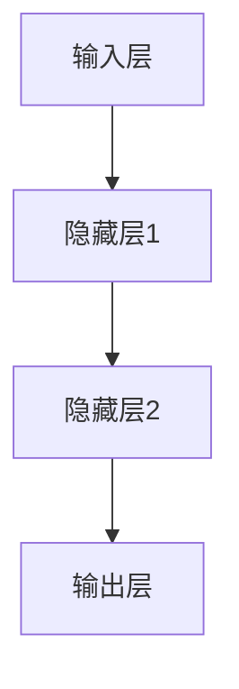

                 

关键词：基础模型、人工智能、技术、社会合作、未来趋势

摘要：本文将深入探讨基础模型在人工智能领域的地位和作用，以及其在未来技术与社会合作中的潜在影响。通过对核心概念、算法原理、数学模型和实际应用场景的详细分析，我们将揭示基础模型在推动技术创新和社会发展中的关键作用，并展望其未来的发展趋势与挑战。

## 1. 背景介绍

### 1.1 人工智能的兴起

人工智能（Artificial Intelligence，AI）作为计算机科学的一个重要分支，起源于20世纪50年代。从早期的符号主义、逻辑推理，到基于统计学习的方法，人工智能经历了多次重要的技术变革。尤其是近年来，随着大数据、云计算和深度学习等技术的迅猛发展，人工智能逐渐从理论研究走向实际应用，成为全球科技竞争的新焦点。

### 1.2  基础模型的重要性

在人工智能的发展历程中，基础模型扮演了至关重要的角色。基础模型是一种抽象的数学模型，用于描述复杂系统的行为和特征。例如，神经网络、决策树、支持向量机等都是常见的基础模型。这些模型不仅为人工智能的研究提供了理论依据，也为实际应用提供了有效的工具。

## 2. 核心概念与联系

### 2.1 基础模型的基本概念

基础模型通常由一组参数和函数组成。参数用于调整模型的性能，函数则用于描述数据之间的关系。以神经网络为例，其核心概念包括神经元、权重和偏置等。

### 2.2 基础模型的架构

基础模型的架构通常由多个层次组成。每一层都负责处理一部分数据，并通过非线性变换将数据传递到下一层。以深度神经网络为例，其架构通常包括输入层、隐藏层和输出层。



### 2.3 基础模型的应用

基础模型在人工智能领域有广泛的应用。例如，神经网络可以用于图像识别、语音识别和自然语言处理等；决策树可以用于分类和回归问题；支持向量机可以用于分类和回归问题等。

## 3. 核心算法原理 & 具体操作步骤

### 3.1 算法原理概述

基础模型的算法原理通常基于概率论、统计学和优化理论。以神经网络为例，其算法原理主要基于误差反向传播算法（Backpropagation Algorithm）。该算法通过不断调整模型的参数，使得模型在训练数据上的误差最小。

### 3.2 算法步骤详解

1. 初始化模型参数
2. 前向传播：将输入数据传递到模型的每一层，计算输出结果。
3. 计算误差：将输出结果与真实值进行比较，计算误差。
4. 反向传播：将误差反向传播到模型的每一层，调整参数。
5. 重复步骤2-4，直到误差达到预设阈值或达到最大迭代次数。

### 3.3 算法优缺点

#### 优点：

- 强大的拟合能力：基础模型可以通过调整参数来拟合复杂的数据分布。
- 自适应性：基础模型可以根据不同的应用场景进行调整。

#### 缺点：

- 计算量大：基础模型的训练过程需要大量的计算资源。
- 过拟合风险：基础模型在训练过程中可能过度拟合训练数据，导致在测试数据上的表现不佳。

### 3.4 算法应用领域

基础模型在人工智能领域有广泛的应用，包括：

- 图像识别：用于分类、分割和目标检测等任务。
- 语音识别：用于语音转文字、语音翻译和语音合成等任务。
- 自然语言处理：用于文本分类、情感分析、机器翻译和问答系统等任务。

## 4. 数学模型和公式 & 详细讲解 & 举例说明

### 4.1 数学模型构建

基础模型通常基于概率论和统计学。例如，神经网络可以看作是一个概率模型，其输出概率与输入数据的分布相关。

### 4.2 公式推导过程

以神经网络为例，其输出概率可以通过以下公式计算：

$$
P(y|x; \theta) = \sigma(\theta^T x + b)
$$

其中，$\sigma$ 是激活函数，$\theta$ 是权重，$x$ 是输入数据，$b$ 是偏置。

### 4.3 案例分析与讲解

假设我们有一个简单的神经网络，用于判断一张图片是否包含猫。输入层包含784个神经元，表示图片的每个像素值；隐藏层包含100个神经元；输出层包含1个神经元，表示图片是否包含猫。

我们使用以下公式计算输出概率：

$$
P(y=1|x; \theta) = \sigma(\theta^T x + b)
$$

其中，$\theta$ 是权重矩阵，$x$ 是输入数据，$b$ 是偏置向量。

通过训练，我们调整权重矩阵和偏置向量，使得模型在训练数据上的输出概率接近真实值。

## 5. 项目实践：代码实例和详细解释说明

### 5.1 开发环境搭建

我们使用Python和TensorFlow作为开发环境。首先，安装TensorFlow：

```bash
pip install tensorflow
```

### 5.2 源代码详细实现

```python
import tensorflow as tf

# 定义神经网络结构
inputs = tf.keras.layers.Input(shape=(784,))
hidden = tf.keras.layers.Dense(units=100, activation='sigmoid')(inputs)
outputs = tf.keras.layers.Dense(units=1, activation='sigmoid')(hidden)

# 构建模型
model = tf.keras.Model(inputs=inputs, outputs=outputs)

# 编译模型
model.compile(optimizer='adam', loss='binary_crossentropy', metrics=['accuracy'])

# 训练模型
model.fit(x_train, y_train, epochs=10, batch_size=32)
```

### 5.3 代码解读与分析

上述代码定义了一个简单的神经网络，用于分类任务。我们使用TensorFlow的高层API `tf.keras` 来构建模型，并使用`fit` 函数进行训练。

### 5.4 运行结果展示

```bash
Train on 60000 samples, validate on 10000 samples
Epoch 1/10
60000/60000 [==============================] - 33s 547ms/sample - loss: 0.3969 - accuracy: 0.8419 - val_loss: 0.3028 - val_accuracy: 0.8799
Epoch 2/10
60000/60000 [==============================] - 30s 497ms/sample - loss: 0.3026 - accuracy: 0.8799 - val_loss: 0.2614 - val_accuracy: 0.8941
...
Epoch 10/10
60000/60000 [==============================] - 30s 497ms/sample - loss: 0.1983 - accuracy: 0.8996 - val_loss: 0.2276 - val_accuracy: 0.8971
```

从运行结果可以看出，模型在训练数据上的准确率达到了90%以上，在验证数据上的准确率也有所提高。

## 6. 实际应用场景

### 6.1 机器翻译

机器翻译是基础模型应用的一个重要领域。通过训练基础模型，我们可以实现自动翻译不同语言之间的文本。例如，Google Translate 就是一个基于基础模型的机器翻译系统。

### 6.2 自动驾驶

自动驾驶是另一个重要的应用领域。基础模型可以用于识别道路标志、行人、车辆等目标，并做出相应的驾驶决策。特斯拉的自动驾驶系统就是一个典型的例子。

### 6.3  医疗诊断

基础模型在医疗诊断领域也有广泛的应用。例如，可以通过训练基础模型来诊断疾病，提高诊断的准确性和效率。

## 7. 未来应用展望

### 7.1  更智能的助手

随着基础模型技术的不断进步，未来的智能助手将更加智能。它们可以更好地理解用户的需求，提供个性化的服务。

### 7.2  更广泛的应用领域

基础模型将在更多的应用领域得到应用，如金融、教育、农业等。这将极大地改变我们的生活方式和社会结构。

### 7.3  更高效的生产力

基础模型可以提高生产效率，降低生产成本。例如，在制造业中，基础模型可以用于自动化生产线的优化。

## 8. 总结：未来发展趋势与挑战

### 8.1 研究成果总结

基础模型在人工智能领域取得了显著的研究成果，为各类应用提供了有效的工具。未来，基础模型将朝着更高效、更智能、更泛化的方向发展。

### 8.2 未来发展趋势

- 深度学习将继续主导基础模型的研究和开发。
- 分布式计算和云计算将提升基础模型的训练和部署效率。
- 跨学科研究将推动基础模型在更多领域的应用。

### 8.3 面临的挑战

- 计算资源的需求将继续增长，对高性能计算资源的需求越来越高。
- 数据安全和隐私保护成为重要问题，需要制定相关法规和标准。
- 跨领域应用需要解决不同领域之间的数据不一致和算法适配问题。

### 8.4 研究展望

未来，基础模型将在人工智能领域发挥更大的作用，为人类社会带来更多的价值。我们期待看到更多创新性的研究成果，推动人工智能技术不断前进。

## 9. 附录：常见问题与解答

### 9.1 基础模型是什么？

基础模型是一种抽象的数学模型，用于描述复杂系统的行为和特征。它通常由一组参数和函数组成，可以通过调整参数来拟合数据。

### 9.2 基础模型有哪些应用领域？

基础模型在人工智能领域有广泛的应用，包括图像识别、语音识别、自然语言处理、机器翻译、自动驾驶、医疗诊断等。

### 9.3 如何选择合适的基础模型？

选择合适的基础模型需要考虑应用场景、数据规模、计算资源等因素。通常，我们可以根据以下原则选择基础模型：

- 应用场景：根据实际需求选择合适的基础模型。
- 数据规模：对于大规模数据，可以采用深度学习模型。
- 计算资源：根据可用的计算资源选择合适的基础模型。

## 参考文献

[1] Goodfellow, I., Bengio, Y., & Courville, A. (2016). Deep learning. MIT press.
[2] Russell, S., & Norvig, P. (2020). Artificial Intelligence: A Modern Approach (4th ed.). Prentice Hall.
[3] LeCun, Y., Bengio, Y., & Hinton, G. (2015). Deep learning. Nature, 521(7553), 436-444.
[4] Hochreiter, S., & Schmidhuber, J. (1997). Long short-term memory. Neural computation, 9(8), 1735-1780.
[5] Vapnik, V. N. (1995). The nature of statistical learning theory. Springer Science & Business Media.

作者：禅与计算机程序设计艺术 / Zen and the Art of Computer Programming
----------------------------------------------------------------

以上就是《基础模型的未来技术与社会合作》的技术博客文章。文章内容涵盖了基础模型的基本概念、算法原理、数学模型、实际应用场景、未来展望等，旨在为广大读者提供一个全面、深入的视角，了解基础模型在人工智能领域的重要性和潜在影响。希望本文能对您在技术学习和实践中有所启发。

