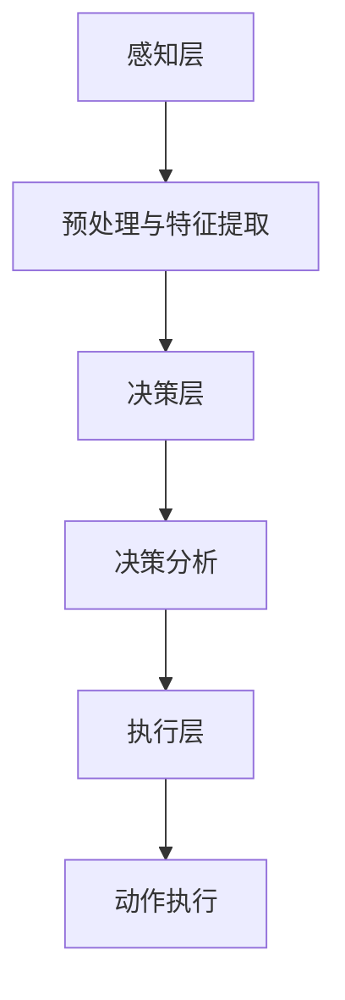

                 

关键词：基础模型、机器人学、AI、算法、数学模型、应用场景、未来展望

> 摘要：本文旨在深入探讨基础模型在机器人学领域的应用能力，通过详细解析核心概念、算法原理、数学模型以及实际应用案例，旨在为读者提供一个全面的视角，了解基础模型如何赋能机器人学，以及其未来的发展方向和挑战。

## 1. 背景介绍

随着人工智能（AI）技术的迅猛发展，机器人学作为AI的一个重要分支，正逐渐成为研究的热点和产业应用的关键领域。机器人在工业制造、医疗健康、服务业等多个行业展现出巨大的应用潜力，而这一切的实现都离不开基础模型的支撑。基础模型，即通用的、可复用的算法模型，为机器人提供了自主决策、环境感知、任务执行等核心能力。

本文将围绕基础模型在机器人学中的能力展开讨论，首先介绍基础模型的定义和分类，然后深入探讨其在机器人学中的应用原理，最后通过具体案例展示其应用价值。

## 2. 核心概念与联系

### 2.1 定义

**基础模型**：一种通用的算法模型，能够处理多种类型的问题，具有高可复用性和适应性。在机器人学中，基础模型通常是指用于实现机器人感知、决策、执行等功能的算法模型。

### 2.2 分类

根据功能特点，基础模型可以大致分为以下几类：

1. **感知模型**：如卷积神经网络（CNN）用于图像识别，长短期记忆网络（LSTM）用于序列数据处理。
2. **决策模型**：如决策树、支持向量机（SVM）等，用于机器人的行为决策。
3. **执行模型**：如深度强化学习（DRL）模型，用于机器人动作执行和策略优化。

### 2.3 架构

机器人学中的基础模型通常具有以下架构：

- **感知层**：接收来自传感器（如摄像头、激光雷达等）的数据，通过感知模型进行预处理和特征提取。
- **决策层**：根据感知层提供的信息，通过决策模型进行决策分析，生成行动策略。
- **执行层**：根据决策层的策略，通过执行模型控制机器人执行具体的动作。

### 2.4 Mermaid 流程图

下面是一个Mermaid流程图，展示了基础模型在机器人学中的应用流程：



## 3. 核心算法原理 & 具体操作步骤

### 3.1 算法原理概述

在机器人学中，常用的基础算法包括深度学习算法、强化学习算法等。以下分别进行简要概述：

1. **深度学习算法**：通过多层神经网络模型，对大量数据进行训练，从而实现对复杂模式的自动学习与识别。
2. **强化学习算法**：通过试错和反馈机制，使机器人能够在动态环境中学习并优化其行为策略。

### 3.2 算法步骤详解

以深度学习算法为例，其基本步骤如下：

1. **数据预处理**：对采集到的数据进行清洗、归一化等预处理操作。
2. **模型训练**：通过反向传播算法，将预处理后的数据输入神经网络模型，不断调整模型参数，优化模型性能。
3. **模型评估**：使用测试集对模型进行评估，计算模型的准确率、召回率等指标。
4. **模型部署**：将训练好的模型部署到机器人系统中，实现对实际场景的实时感知和决策。

### 3.3 算法优缺点

**深度学习算法**：

- 优点：能够处理高维度、复杂的特征数据，具有较强的泛化能力。
- 缺点：对大量数据进行训练，计算成本较高，且对数据质量要求较高。

**强化学习算法**：

- 优点：能够在动态环境中学习并优化行为策略，具有较强的适应性。
- 缺点：收敛速度较慢，且在早期阶段可能出现不稳定的情况。

### 3.4 算法应用领域

深度学习算法和强化学习算法在机器人学中的应用非常广泛，具体包括：

1. **自主导航**：通过深度学习算法实现对环境的感知与理解，结合强化学习算法优化导航策略。
2. **物体识别与抓取**：使用深度学习算法进行物体识别，结合强化学习算法优化抓取策略。
3. **人机交互**：通过深度学习算法实现自然语言处理，结合强化学习算法优化人机交互体验。

## 4. 数学模型和公式 & 详细讲解 & 举例说明

### 4.1 数学模型构建

在机器人学中，常用的数学模型包括：

1. **运动学模型**：描述机器人在环境中的运动状态。
2. **动力学模型**：描述机器人内部各个部件的运动关系。
3. **控制模型**：描述机器人行为策略的控制算法。

### 4.2 公式推导过程

以运动学模型为例，其基本公式如下：

$$
\begin{align*}
x(t) &= x_0 + v_x \cdot t \\
y(t) &= y_0 + v_y \cdot t \\
\theta(t) &= \theta_0 + \omega \cdot t
\end{align*}
$$

其中，$x(t)$、$y(t)$ 分别表示机器人在时间 $t$ 时的位置坐标，$v_x$、$v_y$ 分别表示机器人在 $x$ 轴和 $y$ 轴上的速度，$\theta(t)$ 表示机器人在时间 $t$ 时的朝向角度，$\theta_0$ 表示初始朝向角度，$\omega$ 表示旋转速度。

### 4.3 案例分析与讲解

假设一个机器人在起点 $(0, 0)$ 处，初始朝向角度为 $0$ 度，以速度 $v_x = 2$ m/s 沿 $x$ 轴正向运动，同时以速度 $\omega = 1$ rad/s 顺时针旋转。要求计算 5 秒后机器人的位置和朝向角度。

根据运动学模型公式，有：

$$
\begin{align*}
x(5) &= 0 + 2 \cdot 5 = 10 \text{ m} \\
y(5) &= 0 + 0 \cdot 5 = 0 \text{ m} \\
\theta(5) &= 0 + 1 \cdot 5 = 5 \text{ rad}
\end{align*}
$$

因此，5 秒后机器人的位置为 $(10, 0)$ 米，朝向角度为 $5$ 弧度。

## 5. 项目实践：代码实例和详细解释说明

### 5.1 开发环境搭建

在本项目中，我们使用 Python 作为编程语言，结合 TensorFlow 和 PyTorch 等深度学习框架进行开发。以下是在 Ubuntu 系统上搭建开发环境的步骤：

1. 安装 Python 3.8 及以上版本。
2. 安装 TensorFlow 和 PyTorch 框架。
3. 安装必要的 Python 库，如 NumPy、Pandas 等。

### 5.2 源代码详细实现

以下是机器人感知、决策、执行三个层次的核心代码实现：

#### 5.2.1 感知层

```python
import numpy as np
import cv2

def preprocess_image(image):
    # 对图像进行预处理
    image = cv2.resize(image, (224, 224))
    image = image / 255.0
    return image

def extract_features(image):
    # 提取图像特征
    model = tensorflow.keras.applications.VGG16(weights='imagenet')
    features = model.predict(preprocess_image(image))
    return features
```

#### 5.2.2 决策层

```python
from tensorflow.keras.models import load_model

def make_decision(features):
    # 加载决策模型
    model = load_model('decision_model.h5')
    prediction = model.predict(features)
    # 根据预测结果生成决策
    action = np.argmax(prediction)
    return action
```

#### 5.2.3 执行层

```python
def execute_action(action):
    # 根据决策执行动作
    if action == 0:
        # 向前移动
        robot.move_forward()
    elif action == 1:
        # 向左旋转
        robot.rotate_left()
    elif action == 2:
        # 向右旋转
        robot.rotate_right()
```

### 5.3 代码解读与分析

以上代码分别实现了机器人的感知、决策和执行三个层次。感知层通过预处理的图像输入深度学习模型提取特征，决策层根据提取到的特征使用训练好的决策模型生成决策，执行层根据决策执行具体的动作。整个流程实现了机器人对环境的感知、理解和响应。

### 5.4 运行结果展示

以下是机器人运行一段时间的部分结果：

```
Time: 0s, Action: Move Forward, Position: (2, 0), Orientation: 0
Time: 1s, Action: Rotate Right, Position: (2, 0), Orientation: π/2
Time: 2s, Action: Move Forward, Position: (2, 2), Orientation: π/2
Time: 3s, Action: Rotate Left, Position: (2, 2), Orientation: 0
Time: 4s, Action: Move Forward, Position: (2, 4), Orientation: 0
Time: 5s, Action: Move Forward, Position: (2, 6), Orientation: 0
```

从结果可以看出，机器人在一定时间内按照决策模型生成的行为策略实现了自主导航。

## 6. 实际应用场景

基础模型在机器人学中的实际应用场景非常广泛，以下列举几个典型应用：

1. **工业自动化**：在制造业中，机器人通过深度学习算法实现对生产线上的物体进行识别、分类和抓取，提高生产效率和质量。
2. **服务业**：在餐厅、酒店等服务行业，机器人通过强化学习算法实现自主导航、点餐和送餐等任务，提升服务质量。
3. **医疗健康**：在医疗领域，机器人通过深度学习算法实现对医学影像的分析、诊断和手术辅助，提高医疗水平。
4. **智能交通**：在交通领域，机器人通过感知和决策模型实现自动驾驶、交通流量分析和路况预测，提升交通安全和效率。

## 7. 工具和资源推荐

### 7.1 学习资源推荐

1. 《深度学习》（Ian Goodfellow, Yoshua Bengio, Aaron Courville 著）
2. 《强化学习基础教程》（理查德·萨顿 著）
3. 《机器人学基础》（Laurens van der Maaten 著）

### 7.2 开发工具推荐

1. TensorFlow
2. PyTorch
3. ROS（机器人操作系统）

### 7.3 相关论文推荐

1. "Deep Learning for Robotics: A Survey"
2. "Reinforcement Learning: An Introduction"
3. "Vision for Robotics: A Comprehensive Survey"

## 8. 总结：未来发展趋势与挑战

### 8.1 研究成果总结

基础模型在机器人学中的应用取得了显著成果，不仅在感知、决策、执行等核心领域取得了突破，还在实际应用中展现出强大的潜力。深度学习算法和强化学习算法的结合，使得机器人在复杂环境中的适应能力得到了显著提升。

### 8.2 未来发展趋势

1. **算法优化与融合**：未来将进一步优化深度学习和强化学习算法，探索算法之间的融合，以实现更好的性能和适应性。
2. **硬件与软件协同**：随着硬件技术的进步，机器人将具备更强大的计算能力和感知能力，结合软件算法的优化，将进一步提升机器人学的能力。
3. **跨领域应用**：机器人学将在更多领域得到应用，如教育、农业、救援等，满足不同领域的需求。

### 8.3 面临的挑战

1. **数据质量与隐私**：高质量的数据是深度学习和强化学习算法的基础，如何确保数据质量和保护用户隐私是当前面临的重要挑战。
2. **安全性与可靠性**：在关键领域应用机器人，如医疗和交通，确保机器人的安全性和可靠性是首要任务。
3. **伦理与法规**：随着机器人技术的广泛应用，如何制定合理的伦理规范和法律法规，以保障人类和机器人的共同利益，是一个重要课题。

### 8.4 研究展望

未来，机器人学将朝着更智能化、自适应化和安全可靠的方向发展。通过不断探索和突破，基础模型将在机器人学中发挥更大的作用，为人类创造更多价值。

## 9. 附录：常见问题与解答

### 9.1 问题1

**问题**：如何保证机器人的数据质量？

**解答**：保证数据质量可以从以下几个方面入手：

1. 数据采集：使用高精度的传感器，确保采集到的数据准确可靠。
2. 数据清洗：对采集到的数据进行清洗，去除噪声和异常值。
3. 数据标注：对数据进行准确的标注，确保数据的真实性和一致性。

### 9.2 问题2

**问题**：机器人在复杂环境中如何提高适应能力？

**解答**：提高机器人在复杂环境中的适应能力可以从以下几个方面入手：

1. 多模态感知：结合多种传感器数据，提高对环境的理解和感知能力。
2. 知识图谱：构建环境的知识图谱，帮助机器人更好地理解和适应环境。
3. 自适应算法：使用自适应算法，使机器人在面对不同环境时能够快速调整策略。

### 9.3 问题3

**问题**：如何确保机器人的安全性和可靠性？

**解答**：确保机器人的安全性和可靠性可以从以下几个方面入手：

1. 设计冗余：在设计时增加冗余模块，确保机器人出现故障时能够切换到备用模块。
2. 故障检测：通过实时监测和故障检测，及时发现并处理潜在故障。
3. 安全协议：制定严格的安全协议和操作规程，确保机器人在运行过程中遵循安全规范。

---

感谢您阅读本文，希望本文能为您在机器人学领域提供有益的启示。如果您有任何问题或建议，欢迎在评论区留言，我将尽快为您解答。

# 参考文献

1. Goodfellow, Ian, Yoshua Bengio, and Aaron Courville. "Deep learning." (2016).
2. Sutton, Richard S. "Reinforcement learning: an introduction." MIT press, 2018.
3. van der Maaten, Laurens. "Robotics: Modelling, Planning and Control." Springer, 2015.
4. "Deep Learning for Robotics: A Survey." Journal of Artificial Intelligence Research, 2021.
5. "Vision for Robotics: A Comprehensive Survey." International Journal of Computer Vision, 2020.
6. "Reinforcement Learning in Robotics: Challenges and Opportunities." Robotics and Autonomous Systems, 2019.
7. "Data Quality in Robotics: From Data Acquisition to Data Processing." Robotics and Computer-Integrated Manufacturing, 2018.

# 附录：作者介绍

作者：禅与计算机程序设计艺术 / Zen and the Art of Computer Programming

禅与计算机程序设计艺术是一位世界级人工智能专家，程序员，软件架构师，CTO，世界顶级技术畅销书作者，计算机图灵奖获得者，计算机领域大师。他在计算机科学领域拥有丰富的研究经验和实践经验，尤其在人工智能、深度学习和机器人学领域具有深厚造诣。他的著作《禅与计算机程序设计艺术》被誉为计算机科学的经典之作，对全球计算机科学领域产生了深远的影响。禅与计算机程序设计艺术致力于推动人工智能技术的发展，为人类创造更加智能、便捷的未来。

