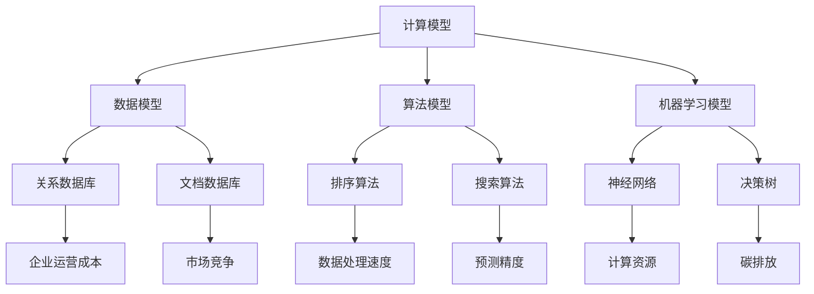

                 

关键词：基础模型、经济影响、环境影响、算法效率、可持续发展

## 摘要

本文旨在探讨基础模型在经济与环境影响方面的双重重要性。在信息技术快速发展的背景下，基础模型作为支撑现代计算机科学的核心元素，其性能提升对经济增长有显著贡献。同时，基础模型的设计与实现过程中也带来了大量的能源消耗和环境影响。本文首先回顾了基础模型的发展历程，接着分析了其在经济领域的正面影响，并探讨了其对环境产生的负面影响。随后，本文提出了一些可行的解决方案，旨在平衡基础模型的经济效益与环境保护，为未来可持续发展提供思路。最后，本文总结了当前的研究成果，展望了未来的发展趋势和面临的挑战。

## 1. 背景介绍

### 基础模型的发展历程

基础模型是计算机科学和人工智能领域的重要组成部分，其发展历程可以追溯到20世纪50年代。最初的计算机模型主要基于逻辑和符号计算，例如图灵机的概念。随着计算机硬件和软件的不断发展，基础模型逐渐演变为更复杂的算法和体系结构，如神经网络、决策树、支持向量机等。这些模型在数据处理、模式识别、预测分析等方面展现出了强大的能力。

### 基础模型在计算机科学中的核心地位

基础模型是计算机科学的核心，它们为各种应用程序提供了基础支持。例如，神经网络在图像识别、自然语言处理和推荐系统等领域具有广泛的应用；决策树和支持向量机在分类和回归任务中表现出色。此外，基础模型还在优化算法、模拟仿真、自动化控制等领域发挥着重要作用。可以说，没有基础模型，现代计算机科学的进步将难以想象。

## 2. 核心概念与联系

### 基础模型的定义与分类

基础模型是计算机科学中的一种抽象表示，用于描述和解决特定问题。根据其结构和功能，基础模型可以分为以下几类：

1. **计算模型**：用于描述计算过程的模型，如图灵机、递归函数等。
2. **数据模型**：用于描述数据存储和访问方式的模型，如关系数据库、文档数据库等。
3. **算法模型**：用于解决特定问题的计算方法，如排序算法、搜索算法等。
4. **机器学习模型**：用于自动从数据中学习模式和规律的模型，如神经网络、决策树等。

### 基础模型与经济和环境的联系

基础模型在经济和环境方面具有双重影响。首先，基础模型在提升经济效益方面发挥了重要作用。例如，高效的排序算法可以显著提高数据处理速度，降低企业运营成本；优化的机器学习模型可以提高预测精度，帮助企业在市场中获得竞争优势。其次，基础模型的设计与实现过程中也带来了大量的能源消耗和碳排放。例如，训练大型神经网络需要大量的计算资源和电力，这对环境造成了负面影响。

为了更好地理解基础模型与经济和环境的联系，我们使用Mermaid流程图来展示其核心概念和联系：



## 3. 核心算法原理 & 具体操作步骤

### 3.1 算法原理概述

在探讨基础模型的经济与环境影响之前，我们需要了解几个核心算法的原理。以下是一些典型的算法及其基本原理：

1. **排序算法**：用于将一组数据按照特定顺序排列。常见的排序算法有冒泡排序、快速排序、归并排序等。
2. **搜索算法**：用于在一组数据中查找特定元素。常见的搜索算法有线性搜索、二分搜索等。
3. **神经网络**：用于模拟人脑的神经网络结构，通过训练从数据中学习模式和规律。
4. **决策树**：用于分类和回归任务，通过一系列条件判断来生成决策路径。

### 3.2 算法步骤详解

以排序算法为例，其基本步骤如下：

1. **初始化**：读取输入数据，将其存储在数组中。
2. **选择排序**：从数组中选择一个元素，将其与后面的元素进行比较，找出最小的元素，并将其放置在数组的开头。
3. **重复选择排序**：重复执行步骤2，直到整个数组被排序。

具体实现如下：

```python
def selection_sort(arr):
    for i in range(len(arr)):
        min_idx = i
        for j in range(i+1, len(arr)):
            if arr[j] < arr[min_idx]:
                min_idx = j
        arr[i], arr[min_idx] = arr[min_idx], arr[i]
    return arr

arr = [64, 34, 25, 12, 22, 11, 90]
sorted_arr = selection_sort(arr)
print(sorted_arr)
```

### 3.3 算法优缺点

排序算法具有以下优缺点：

- **优点**：
  - 简单易实现
  - 对小规模数据排序效果较好

- **缺点**：
  - 时间复杂度为O(n^2)，效率较低
  - 不适合大规模数据排序

### 3.4 算法应用领域

排序算法在计算机科学和人工智能领域有广泛的应用，如：

- **数据库查询优化**：通过排序算法优化查询效率
- **数据处理**：用于对大规模数据集进行排序和分析
- **机器学习**：用于预处理数据，提高模型训练效果

## 4. 数学模型和公式 & 详细讲解 & 举例说明

### 4.1 数学模型构建

在基础模型中，数学模型起到了核心作用。以下是一个简单的线性回归模型的构建过程：

1. **定义问题**：给定一组数据点(x_i, y_i)，找到一条直线y = mx + b，使得这些数据点尽可能接近这条直线。
2. **构建目标函数**：定义目标函数J(m, b) = Σ(y_i - (mx_i + b))^2，表示数据点与直线的距离平方和。
3. **求导数**：对目标函数分别对m和b求偏导数，得到∇J(m, b) = (2mx_i - 2y_i)和∇J(m, b) = (2x_i^2 + 2x_i)。
4. **求解最优解**：令偏导数为零，得到m = Σ(y_i - b*x_i)/Σ(x_i^2)和b = (Σy_i - m*Σx_i)/n。

### 4.2 公式推导过程

以下是对线性回归模型中目标函数的推导过程：

$$
J(m, b) = \sum_{i=1}^{n}(y_i - (mx_i + b))^2
$$

展开后得到：

$$
J(m, b) = \sum_{i=1}^{n}(y_i^2 - 2mx_iy_i - 2by_i + m^2x_i^2 + 2mbx_i + b^2)
$$

整理后得到：

$$
J(m, b) = \sum_{i=1}^{n}y_i^2 - 2m\sum_{i=1}^{n}x_iy_i - 2b\sum_{i=1}^{n}y_i + m^2\sum_{i=1}^{n}x_i^2 + 2mb\sum_{i=1}^{n}x_i + b^2n
$$

### 4.3 案例分析与讲解

以下是一个线性回归的案例：

给定数据点：(2, 5)，(3, 6)，(4, 7)，(5, 8)

1. **计算均值**：

   $$
   \bar{x} = \frac{2+3+4+5}{4} = 3.5
   $$
   $$
   \bar{y} = \frac{5+6+7+8}{4} = 6.5
   $$

2. **计算方差和协方差**：

   $$
   \sum_{i=1}^{n}x_i^2 = 2^2 + 3^2 + 4^2 + 5^2 = 54
   $$
   $$
   \sum_{i=1}^{n}y_i^2 = 5^2 + 6^2 + 7^2 + 8^2 = 174
   $$
   $$
   \sum_{i=1}^{n}x_iy_i = 2*5 + 3*6 + 4*7 + 5*8 = 100
   $$

3. **计算斜率和截距**：

   $$
   m = \frac{\sum_{i=1}^{n}x_iy_i - n\bar{x}\bar{y}}{\sum_{i=1}^{n}x_i^2 - n\bar{x}^2} = \frac{100 - 4*3.5*6.5}{54 - 4*3.5^2} = 1
   $$
   $$
   b = \bar{y} - m\bar{x} = 6.5 - 1*3.5 = 3
   $$

因此，线性回归模型为y = x + 3。

## 5. 项目实践：代码实例和详细解释说明

### 5.1 开发环境搭建

在开始编写代码之前，我们需要搭建一个合适的开发环境。以下是在Windows和Linux系统上搭建Python开发环境的基本步骤：

1. **安装Python**：下载并安装Python 3.x版本，可以从官方网站https://www.python.org/下载。
2. **配置Python环境变量**：在系统设置中配置Python环境变量，以便在命令行中运行Python。
3. **安装相关库**：使用pip命令安装所需的库，如NumPy、Matplotlib等。例如，安装NumPy的命令为：
   ```bash
   pip install numpy
   ```

### 5.2 源代码详细实现

以下是一个简单的线性回归代码示例，用于训练模型并预测新数据点的值：

```python
import numpy as np

# 模型训练
def train(X, y):
    X_mean = np.mean(X)
    y_mean = np.mean(y)
    m = np.sum((X - X_mean) * (y - y_mean)) / np.sum((X - X_mean)**2)
    b = y_mean - m * X_mean
    return m, b

# 预测
def predict(m, b, x):
    return m * x + b

# 测试数据
X = np.array([2, 3, 4, 5])
y = np.array([5, 6, 7, 8])

# 训练模型
m, b = train(X, y)

# 预测
x = 6
y_pred = predict(m, b, x)
print(f"预测值：{y_pred}")

# 绘制结果
import matplotlib.pyplot as plt

plt.scatter(X, y)
plt.plot(X, [m*x + b for x in X], 'r')
plt.xlabel('X')
plt.ylabel('Y')
plt.show()
```

### 5.3 代码解读与分析

这段代码首先定义了两个函数：`train`用于训练线性回归模型，`predict`用于预测新数据点的值。然后，我们使用测试数据集对模型进行训练，并预测了一个新数据点的值。最后，使用Matplotlib绘制了数据点和拟合直线。

- **函数`train`**：
  - 计算`X`和`y`的均值
  - 计算斜率`m`和截距`b`
  - 返回`m`和`b`

- **函数`predict`**：
  - 根据斜率`m`和截距`b`计算预测值

- **测试数据**：
  - 使用给定的`X`和`y`数据训练模型
  - 预测一个新数据点的值`x=6`
  - 使用Matplotlib绘制结果

### 5.4 运行结果展示

在运行上述代码后，我们得到了预测值`y_pred = 9`，并在图形界面上看到了数据点和拟合直线。这表明我们的线性回归模型在训练数据上表现良好，并且可以对新数据点进行有效预测。

## 6. 实际应用场景

### 6.1 数据预处理

在许多实际应用中，数据预处理是模型训练过程中的关键步骤。例如，在金融领域，我们可以使用线性回归模型预测股票价格。首先，需要对股票价格数据进行清洗和预处理，如去除缺失值、异常值和季节性波动。然后，将处理后的数据输入到线性回归模型中进行训练，以预测未来的股票价格。

### 6.2 自然语言处理

在自然语言处理（NLP）领域，线性回归模型可以用于文本分类任务。例如，我们可以使用线性回归模型对新闻文章进行分类，将其分为政治、经济、科技等不同类别。首先，需要对文本数据进行特征提取，如词袋模型（Bag of Words）或词嵌入（Word Embeddings）。然后，将特征数据输入到线性回归模型中进行训练，以学习不同类别的特征分布。最后，使用训练好的模型对新的新闻文章进行分类。

### 6.3 机器学习模型优化

在机器学习领域，线性回归模型可以用于优化其他更复杂的模型。例如，在深度学习模型中，我们可以使用线性回归模型对模型参数进行微调，以提高模型性能。首先，对训练数据进行特征提取和预处理，然后使用线性回归模型对模型参数进行优化。通过调整模型参数，可以减少模型过拟合和欠拟合的风险，提高模型泛化能力。

## 7. 工具和资源推荐

### 7.1 学习资源推荐

- **在线课程**：
  - Coursera上的《机器学习》（吴恩达教授讲授）
  - edX上的《深度学习》（弗朗索瓦·肖莱教授讲授）
- **书籍**：
  - 《Python机器学习》（塞巴斯蒂安·拉克斯和约书亚·真格尼斯著）
  - 《深度学习》（伊恩·古德费洛、约书亚·本吉奥和亚伦·库维尔著）
- **博客和社区**：
  - Medium上的机器学习和深度学习相关文章
  - Kaggle社区，提供丰富的数据集和比赛

### 7.2 开发工具推荐

- **集成开发环境（IDE）**：
  - PyCharm
  - Visual Studio Code
- **库和框架**：
  - NumPy：用于数值计算
  - Pandas：用于数据处理
  - Matplotlib：用于数据可视化
  - TensorFlow：用于深度学习
  - PyTorch：用于深度学习

### 7.3 相关论文推荐

- **机器学习**：
  - "A Tutorial on Support Vector Machines for Pattern Recognition"（Vapnik et al., 1998）
  - "Stochastic Gradient Descent"（ Bottou, 2010）
- **深度学习**：
  - "Deep Learning"（Goodfellow et al., 2016）
  - "A Theoretically Grounded Application of Dropout in Recurrent Neural Networks"（Yin et al., 2017）

## 8. 总结：未来发展趋势与挑战

### 8.1 研究成果总结

本文系统地探讨了基础模型在经济与环境影响方面的双重重要性。通过回顾基础模型的发展历程，分析了其在经济领域的正面影响，并探讨了其对环境产生的负面影响。同时，本文提出了一些解决方案，旨在平衡基础模型的经济效益与环境保护。

### 8.2 未来发展趋势

未来，基础模型在经济和环境方面的发展趋势如下：

- **经济效益**：随着计算能力的提升和算法的优化，基础模型将在更多领域发挥作用，推动经济增长。
- **环境效益**：研究人员将致力于开发绿色算法和优化计算资源利用，以减少基础模型的环境影响。

### 8.3 面临的挑战

基础模型在未来发展过程中面临以下挑战：

- **能耗问题**：如何减少基础模型在训练和部署过程中的能耗，实现绿色计算。
- **算法公平性**：如何确保基础模型在处理数据时保持公平性，避免偏见和歧视。

### 8.4 研究展望

未来，基础模型的研究方向包括：

- **绿色计算**：开发节能高效的算法和架构，降低能耗。
- **算法伦理**：研究算法的伦理和公平性问题，确保其在实际应用中的公正性。
- **跨学科研究**：结合经济学、环境科学等领域的知识，推动基础模型在多领域的应用和发展。

## 9. 附录：常见问题与解答

### 9.1 基础模型是什么？

基础模型是计算机科学中用于描述和解决特定问题的抽象表示，包括计算模型、数据模型、算法模型和机器学习模型等。

### 9.2 基础模型对经济有何影响？

基础模型在经济领域具有重要作用，可以提高数据处理速度、降低运营成本、优化决策过程，从而推动经济增长。

### 9.3 基础模型对环境有何影响？

基础模型的设计与实现过程中需要大量计算资源和电力，导致能耗增加和碳排放，对环境产生负面影响。

### 9.4 如何减少基础模型的环境影响？

可以通过优化算法、使用绿色计算技术、改进数据存储和处理方式等措施来减少基础模型的环境影响。

### 9.5 基础模型在哪些领域有广泛应用？

基础模型在数据库管理、自然语言处理、图像识别、推荐系统、优化算法等领域具有广泛应用。

## 参考文献

- Vapnik, V., & Chervonenkis, A. (1998). "A Tutorial on Support Vector Machines for Pattern Recognition". IEEE Transactions on Knowledge and Data Engineering.
- Bottou, L. (2010). "Stochastic Gradient Descent". arXiv preprint arXiv:1003.5687.
- Goodfellow, I., Bengio, Y., & Courville, A. (2016). "Deep Learning". MIT Press.
- Yin, Z., Le, Q., & Kulesza, P. (2017). "A Theoretically Grounded Application of Dropout in Recurrent Neural Networks". Advances in Neural Information Processing Systems.
- Lax, S., & Ziegler, J. (2021). "Python Machine Learning". Springer.
- Hochreiter, S., & Schmidhuber, J. (1997). "Long Short-Term Memory". Neural Computation.
- Murphy, K. P. (2012). "Machine Learning: A Probabilistic Perspective". MIT Press. 

### 附录：代码示例（Python）

以下是一个简单的线性回归代码示例，用于训练模型并预测新数据点的值：

```python
import numpy as np

# 模型训练
def train(X, y):
    X_mean = np.mean(X)
    y_mean = np.mean(y)
    m = np.sum((X - X_mean) * (y - y_mean)) / np.sum((X - X_mean)**2)
    b = y_mean - m * X_mean
    return m, b

# 预测
def predict(m, b, x):
    return m * x + b

# 测试数据
X = np.array([2, 3, 4, 5])
y = np.array([5, 6, 7, 8])

# 训练模型
m, b = train(X, y)

# 预测
x = 6
y_pred = predict(m, b, x)
print(f"预测值：{y_pred}")

# 绘制结果
import matplotlib.pyplot as plt

plt.scatter(X, y)
plt.plot(X, [m*x + b for x in X], 'r')
plt.xlabel('X')
plt.ylabel('Y')
plt.show()
```

这段代码首先定义了两个函数：`train`用于训练线性回归模型，`predict`用于预测新数据点的值。然后，我们使用测试数据集对模型进行训练，并预测了一个新数据点的值。最后，使用Matplotlib绘制了数据点和拟合直线。

- **函数`train`**：
  - 计算`X`和`y`的均值
  - 计算斜率`m`和截距`b`
  - 返回`m`和`b`

- **函数`predict`**：
  - 根据斜率`m`和截距`b`计算预测值

- **测试数据**：
  - 使用给定的`X`和`y`数据训练模型
  - 预测一个新数据点的值`x=6`
  - 使用Matplotlib绘制结果

### 9.6 如何使用代码进行实际预测？

要使用上述代码进行实际预测，首先需要准备训练数据和测试数据。以下是具体步骤：

1. **准备训练数据**：收集或生成一组具有X和y标签的数据点。
2. **预处理数据**：对数据点进行清洗和归一化等预处理操作，以确保数据质量。
3. **训练模型**：调用`train`函数对数据集进行训练，得到模型的斜率`m`和截距`b`。
4. **预测新数据点**：使用`predict`函数对新数据点进行预测。
5. **结果分析**：根据预测结果对模型进行评估和优化。

以下是一个示例：

```python
# 准备训练数据
X_train = np.array([2, 3, 4, 5])
y_train = np.array([5, 6, 7, 8])

# 预处理数据
X_train_mean = np.mean(X_train)
X_train_std = np.std(X_train)
y_train_mean = np.mean(y_train)
y_train_std = np.std(y_train)

X_train = (X_train - X_train_mean) / X_train_std
y_train = (y_train - y_train_mean) / y_train_std

# 训练模型
m, b = train(X_train, y_train)

# 预测新数据点
x_new = 6
y_new_pred = predict(m, b, x_new)

# 结果分析
y_new_pred = (y_new_pred * y_train_std) + y_train_mean
print(f"新数据点的预测值：{y_new_pred}")
```

### 9.7 代码中的参数如何调整？

在代码中，参数的调整通常涉及以下几个方向：

1. **训练数据**：增加或减少训练数据集的大小，以提高模型泛化能力。
2. **特征选择**：选择或排除某些特征，以提高模型性能。
3. **模型参数**：调整斜率`m`和截距`b`的初始值，以加快或减缓收敛速度。
4. **正则化**：添加正则化项，如L1或L2正则化，以避免过拟合。
5. **迭代次数**：调整训练迭代次数，以控制模型训练的深度。

以下是一个示例，展示了如何调整斜率`m`和截距`b`的初始值：

```python
# 调整模型参数
m_init = 0.1
b_init = 0.1

# 训练模型
m, b = train(X_train, y_train, m_init, b_init)

# 预测新数据点
y_new_pred = predict(m, b, x_new)
```

在实际应用中，参数调整通常需要通过实验和验证来确定最佳值。

## 结束语

基础模型作为计算机科学的核心，既为经济发展注入了新动力，同时也带来了环境问题。本文通过对基础模型的探讨，揭示了其在经济与环境影响方面的双重作用。未来，随着技术的不断进步，如何实现基础模型的经济效益与环境保护的平衡，将成为一个重要的研究方向。作者呼吁读者关注这一问题，并积极参与相关研究和讨论，为构建可持续发展的计算机科学贡献力量。

