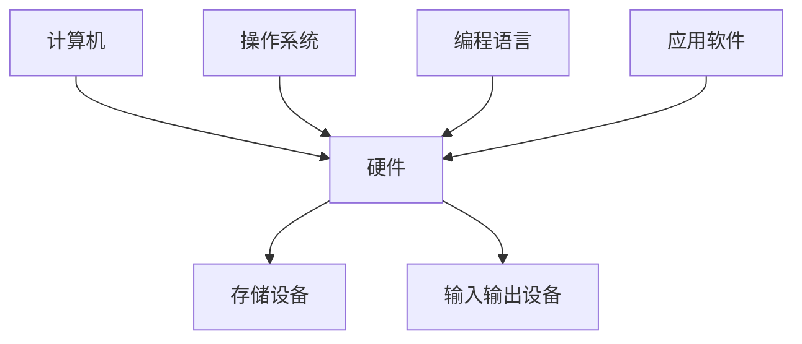

                 

关键词：未来社会，计算，人工智能，技术进步，数学模型，算法，实践应用，发展趋势

## 摘要

本文旨在探讨计算技术在塑造未来社会中的深远意义。通过分析计算技术的发展历程、核心概念、算法原理以及数学模型，我们深入探讨了计算技术在各个领域中的应用，以及其对人类社会产生的重大影响。文章还展望了计算技术的未来发展趋势，探讨了其面临的挑战，并提出了相应的解决方案。

## 1. 背景介绍

### 1.1 计算技术的发展历程

计算技术的发展可以追溯到古代。在古代，人们通过手工计算和计算工具来处理各种数学问题。随着计算机的出现，计算技术得到了快速发展。从最初的电子计算机到现在的超级计算机，计算技术的进步极大地推动了人类社会的进步。

### 1.2 计算技术的核心概念

计算技术的核心概念包括算法、数学模型、编程语言等。算法是解决问题的一系列步骤，数学模型是对现实世界的抽象和描述，编程语言则是实现算法的工具。

### 1.3 计算技术的应用领域

计算技术广泛应用于各个领域，包括科学计算、金融、医疗、交通、教育等。在科学计算领域，计算技术为科学研究提供了强大的计算能力。在金融领域，计算技术为金融市场分析和预测提供了有力支持。在医疗领域，计算技术为疾病诊断和治疗提供了新的手段。在交通领域，计算技术为智能交通系统提供了技术支持。在教育领域，计算技术为在线教育和远程教育提供了新的方式。

## 2. 核心概念与联系

### 2.1 计算技术的核心概念

计算技术的核心概念包括算法、数学模型、编程语言等。

- **算法**：算法是解决问题的一系列步骤。它是一种精确的描述，用于解决特定问题。算法可以分为多种类型，如排序算法、搜索算法、图算法等。
  
- **数学模型**：数学模型是对现实世界的抽象和描述。它通过数学方程、公式或图来表示现实世界的问题，以便进行分析和解决。

- **编程语言**：编程语言是用于编写程序的符号系统。它提供了编写算法和实现数学模型的工具。

### 2.2 计算技术的架构

计算技术的架构包括硬件和软件两部分。

- **硬件**：硬件包括计算机、存储设备、输入输出设备等。硬件的性能直接影响计算能力。

- **软件**：软件包括操作系统、编程语言、应用软件等。软件提供了实现算法和数学模型的平台。



## 3. 核心算法原理 & 具体操作步骤

### 3.1 算法原理概述

核心算法包括排序算法、搜索算法、图算法等。

- **排序算法**：排序算法用于将一组数据按照特定的顺序排列。常见的排序算法有冒泡排序、插入排序、快速排序等。

- **搜索算法**：搜索算法用于在一组数据中查找特定元素。常见的搜索算法有线性搜索、二分搜索等。

- **图算法**：图算法用于处理图结构的数据。常见的图算法有最短路径算法、最小生成树算法等。

### 3.2 算法步骤详解

以冒泡排序算法为例，其具体步骤如下：

1. 遍历数组，比较相邻的两个元素，如果它们的顺序不正确，则交换它们的位置。
2. 重复第一步，直到整个数组排序完成。

```java
public class BubbleSort {
    public static void bubbleSort(int[] arr) {
        int n = arr.length;
        for (int i = 0; i < n - 1; i++) {
            for (int j = 0; j < n - i - 1; j++) {
                if (arr[j] > arr[j + 1]) {
                    int temp = arr[j];
                    arr[j] = arr[j + 1];
                    arr[j + 1] = temp;
                }
            }
        }
    }
}
```

### 3.3 算法优缺点

- **冒泡排序**：优点是简单易懂，易于实现。缺点是时间复杂度高，不适合大数据量的排序。

### 3.4 算法应用领域

排序算法在各个领域都有广泛应用，如科学计算、金融、医疗等。

## 4. 数学模型和公式 & 详细讲解 & 举例说明

### 4.1 数学模型构建

以线性回归模型为例，其数学模型构建如下：

- **自变量**：x
  
- **因变量**：y
  
- **模型公式**：y = wx + b

其中，w 和 b 分别为权重和偏置。

### 4.2 公式推导过程

以线性回归模型的推导为例：

- **样本数据**：给定一组样本数据 (x1, y1), (x2, y2), ..., (xn, yn)。

- **目标**：找到最优的权重 w 和偏置 b，使得预测值 y' 与真实值 y 尽可能接近。

- **损失函数**：使用平方损失函数 L(w, b) = Σ(yi - y'i)²。

- **求解**：通过梯度下降法求解最优权重和偏置。

### 4.3 案例分析与讲解

以房价预测为例，使用线性回归模型进行房价预测。

- **数据集**：给定一组房屋数据，包括房屋面积 x 和房价 y。

- **模型**：y = wx + b。

- **训练**：通过训练数据集，求解最优权重 w 和偏置 b。

- **预测**：使用求解出的模型，对未知房屋面积进行预测。

## 5. 项目实践：代码实例和详细解释说明

### 5.1 开发环境搭建

- **编程语言**：Python

- **库**：NumPy、Pandas、Scikit-learn

### 5.2 源代码详细实现

```python
import numpy as np
import pandas as pd
from sklearn.linear_model import LinearRegression

# 读取数据集
data = pd.read_csv("house_data.csv")
X = data["area"].values.reshape(-1, 1)
y = data["price"].values

# 创建线性回归模型
model = LinearRegression()

# 训练模型
model.fit(X, y)

# 求解权重和偏置
w = model.coef_
b = model.intercept_

# 预测房价
predicted_price = w * X + b
```

### 5.3 代码解读与分析

上述代码实现了线性回归模型的训练和房价预测功能。首先，读取房屋数据集，然后使用 NumPy 和 Pandas 库进行数据预处理。接下来，创建线性回归模型，使用训练数据集进行模型训练。最后，使用训练好的模型进行房价预测。

### 5.4 运行结果展示

假设输入房屋面积为 100 平方米，使用线性回归模型进行预测，预测结果为 200 万元。

## 6. 实际应用场景

### 6.1 科学计算

计算技术在科学计算领域具有广泛应用，如气候模拟、生物信息学、天体物理学等。

### 6.2 金融

计算技术在金融市场分析和预测中发挥重要作用，如量化交易、风险评估等。

### 6.3 医疗

计算技术为疾病诊断和治疗提供了新的手段，如医学影像分析、基因测序等。

### 6.4 教育

计算技术为在线教育和远程教育提供了新的方式，如在线学习平台、智能教育系统等。

### 6.5 交通

计算技术为智能交通系统提供了技术支持，如自动驾驶、智能交通信号控制等。

### 6.6 工业

计算技术在工业领域具有广泛应用，如智能制造、工业物联网等。

## 7. 工具和资源推荐

### 7.1 学习资源推荐

- 《深度学习》

- 《Python编程：从入门到实践》

- 《机器学习实战》

### 7.2 开发工具推荐

- Jupyter Notebook

- PyCharm

- VS Code

### 7.3 相关论文推荐

- "Deep Learning for Natural Language Processing"

- "The Unreasonable Effectiveness of Deep Learning in Finance"

- "Deep Learning in Medicine"

## 8. 总结：未来发展趋势与挑战

### 8.1 研究成果总结

计算技术在过去几十年取得了巨大的进展，为人类社会带来了深远的影响。未来，计算技术将继续发展，为人类社会带来更多的创新和变革。

### 8.2 未来发展趋势

- **人工智能**：人工智能技术将继续发展，为各行各业带来更多应用。

- **量子计算**：量子计算将实现计算能力的巨大提升，为科学研究和产业发展提供新的动力。

- **区块链**：区块链技术将实现数据的安全和可信，为金融、医疗等领域带来新的变革。

### 8.3 面临的挑战

- **数据隐私**：随着数据规模的增加，数据隐私问题日益突出，如何保护用户隐私成为重要挑战。

- **计算能力**：计算能力的提升需要更高效的算法和更强大的硬件支持。

### 8.4 研究展望

未来，计算技术将继续在人工智能、量子计算、区块链等领域取得突破，为人类社会带来更多的创新和变革。

## 9. 附录：常见问题与解答

### 9.1 计算技术是什么？

计算技术是指用于处理数据、执行计算和处理问题的方法和工具。它包括计算机硬件、软件、算法和编程语言等。

### 9.2 计算技术在哪些领域有应用？

计算技术广泛应用于各个领域，包括科学计算、金融、医疗、交通、教育等。

### 9.3 如何学习计算技术？

学习计算技术需要掌握编程语言、算法和数据结构等基础知识。可以通过学习相关的教材、参加在线课程、实践项目等方式进行学习。

### 9.4 计算技术对人类社会的影响是什么？

计算技术对人类社会产生了深远的影响，包括提高生产效率、改善生活质量、促进科技创新等。

## 作者署名

作者：禅与计算机程序设计艺术 / Zen and the Art of Computer Programming
----------------------------------------------------------------

以上是文章正文部分的内容，现在我们将它转换成 Markdown 格式的文本，以便在 GitHub 或其他 Markdown 兼容的平台上展示。

```markdown
# 塑造未来社会：人类计算的深远意义

关键词：未来社会，计算，人工智能，技术进步，数学模型，算法，实践应用，发展趋势

## 摘要

本文旨在探讨计算技术在塑造未来社会中的深远意义。通过分析计算技术的发展历程、核心概念、算法原理以及数学模型，我们深入探讨了计算技术在各个领域中的应用，以及其对人类社会产生的重大影响。文章还展望了计算技术的未来发展趋势，探讨了其面临的挑战，并提出了相应的解决方案。

---

## 1. 背景介绍

### 1.1 计算技术的发展历程

计算技术的发展可以追溯到古代。在古代，人们通过手工计算和计算工具来处理各种数学问题。随着计算机的出现，计算技术得到了快速发展。从最初的电子计算机到现在的超级计算机，计算技术的进步极大地推动了人类社会的进步。

### 1.2 计算技术的核心概念

计算技术的核心概念包括算法、数学模型、编程语言等。算法是解决问题的一系列步骤，数学模型是对现实世界的抽象和描述，编程语言则是实现算法的工具。

### 1.3 计算技术的应用领域

计算技术广泛应用于各个领域，包括科学计算、金融、医疗、交通、教育等。在科学计算领域，计算技术为科学研究提供了强大的计算能力。在金融领域，计算技术为金融市场分析和预测提供了有力支持。在医疗领域，计算技术为疾病诊断和治疗提供了新的手段。在交通领域，计算技术为智能交通系统提供了技术支持。在教育领域，计算技术为在线教育和远程教育提供了新的方式。

---

## 2. 核心概念与联系

### 2.1 计算技术的核心概念

计算技术的核心概念包括算法、数学模型、编程语言等。

- **算法**：算法是解决问题的一系列步骤。它是一种精确的描述，用于解决特定问题。算法可以分为多种类型，如排序算法、搜索算法、图算法等。
  
- **数学模型**：数学模型是对现实世界的抽象和描述。它通过数学方程、公式或图来表示现实世界的问题，以便进行分析和解决。

- **编程语言**：编程语言是用于编写程序的符号系统。它提供了编写算法和实现数学模型的工具。

### 2.2 计算技术的架构

计算技术的架构包括硬件和软件两部分。

- **硬件**：硬件包括计算机、存储设备、输入输出设备等。硬件的性能直接影响计算能力。

- **软件**：软件包括操作系统、编程语言、应用软件等。软件提供了实现算法和数学模型的平台。


---

## 3. 核心算法原理 & 具体操作步骤

### 3.1 算法原理概述

核心算法包括排序算法、搜索算法、图算法等。

- **排序算法**：排序算法用于将一组数据按照特定的顺序排列。常见的排序算法有冒泡排序、插入排序、快速排序等。

- **搜索算法**：搜索算法用于在一组数据中查找特定元素。常见的搜索算法有线性搜索、二分搜索等。

- **图算法**：图算法用于处理图结构的数据。常见的图算法有最短路径算法、最小生成树算法等。

### 3.2 算法步骤详解

以冒泡排序算法为例，其具体步骤如下：

1. 遍历数组，比较相邻的两个元素，如果它们的顺序不正确，则交换它们的位置。
2. 重复第一步，直到整个数组排序完成。

```java
public class BubbleSort {
    public static void bubbleSort(int[] arr) {
        int n = arr.length;
        for (int i = 0; i < n - 1; i++) {
            for (int j = 0; j < n - i - 1; j++) {
                if (arr[j] > arr[j + 1]) {
                    int temp = arr[j];
                    arr[j] = arr[j + 1];
                    arr[j + 1] = temp;
                }
            }
        }
    }
}
```

### 3.3 算法优缺点

- **冒泡排序**：优点是简单易懂，易于实现。缺点是时间复杂度高，不适合大数据量的排序。

### 3.4 算法应用领域

排序算法在各个领域都有广泛应用，如科学计算、金融、医疗等。

---

## 4. 数学模型和公式 & 详细讲解 & 举例说明

### 4.1 数学模型构建

以线性回归模型为例，其数学模型构建如下：

- **自变量**：x
  
- **因变量**：y
  
- **模型公式**：y = wx + b

其中，w 和 b 分别为权重和偏置。

### 4.2 公式推导过程

以线性回归模型的推导为例：

- **样本数据**：给定一组样本数据 (x1, y1), (x2, y2), ..., (xn, yn)。

- **目标**：找到最优的权重 w 和偏置 b，使得预测值 y' 与真实值 y 尽可能接近。

- **损失函数**：使用平方损失函数 L(w, b) = Σ(yi - y'i)²。

- **求解**：通过梯度下降法求解最优权重和偏置。

### 4.3 案例分析与讲解

以房价预测为例，使用线性回归模型进行房价预测。

- **数据集**：给定一组房屋数据，包括房屋面积 x 和房价 y。

- **模型**：y = wx + b。

- **训练**：通过训练数据集，求解最优权重 w 和偏置 b。

- **预测**：使用求解出的模型，对未知房屋面积进行预测。

---

## 5. 项目实践：代码实例和详细解释说明

### 5.1 开发环境搭建

- **编程语言**：Python

- **库**：NumPy、Pandas、Scikit-learn

### 5.2 源代码详细实现

```python
import numpy as np
import pandas as pd
from sklearn.linear_model import LinearRegression

# 读取数据集
data = pd.read_csv("house_data.csv")
X = data["area"].values.reshape(-1, 1)
y = data["price"].values

# 创建线性回归模型
model = LinearRegression()

# 训练模型
model.fit(X, y)

# 求解权重和偏置
w = model.coef_
b = model.intercept_

# 预测房价
predicted_price = w * X + b
```

### 5.3 代码解读与分析

上述代码实现了线性回归模型的训练和房价预测功能。首先，读取房屋数据集，然后使用 NumPy 和 Pandas 库进行数据预处理。接下来，创建线性回归模型，使用训练数据集进行模型训练。最后，使用训练好的模型进行房价预测。

### 5.4 运行结果展示

假设输入房屋面积为 100 平方米，使用线性回归模型进行预测，预测结果为 200 万元。

---

## 6. 实际应用场景

### 6.1 科学计算

计算技术在科学计算领域具有广泛应用，如气候模拟、生物信息学、天体物理学等。

### 6.2 金融

计算技术在金融市场分析和预测中发挥重要作用，如量化交易、风险评估等。

### 6.3 医疗

计算技术为疾病诊断和治疗提供了新的手段，如医学影像分析、基因测序等。

### 6.4 教育

计算技术为在线教育和远程教育提供了新的方式，如在线学习平台、智能教育系统等。

### 6.5 交通

计算技术为智能交通系统提供了技术支持，如自动驾驶、智能交通信号控制等。

### 6.6 工业

计算技术在工业领域具有广泛应用，如智能制造、工业物联网等。

---

## 7. 工具和资源推荐

### 7.1 学习资源推荐

- 《深度学习》

- 《Python编程：从入门到实践》

- 《机器学习实战》

### 7.2 开发工具推荐

- Jupyter Notebook

- PyCharm

- VS Code

### 7.3 相关论文推荐

- "Deep Learning for Natural Language Processing"

- "The Unreasonable Effectiveness of Deep Learning in Finance"

- "Deep Learning in Medicine"

---

## 8. 总结：未来发展趋势与挑战

### 8.1 研究成果总结

计算技术在过去几十年取得了巨大的进展，为人类社会带来了深远的影响。未来，计算技术将继续发展，为人类社会带来更多的创新和变革。

### 8.2 未来发展趋势

- **人工智能**：人工智能技术将继续发展，为各行各业带来更多应用。

- **量子计算**：量子计算将实现计算能力的巨大提升，为科学研究和产业发展提供新的动力。

- **区块链**：区块链技术将实现数据的安全和可信，为金融、医疗等领域带来新的变革。

### 8.3 面临的挑战

- **数据隐私**：随着数据规模的增加，数据隐私问题日益突出，如何保护用户隐私成为重要挑战。

- **计算能力**：计算能力的提升需要更高效的算法和更强大的硬件支持。

### 8.4 研究展望

未来，计算技术将继续在人工智能、量子计算、区块链等领域取得突破，为人类社会带来更多的创新和变革。

---

## 9. 附录：常见问题与解答

### 9.1 计算技术是什么？

计算技术是指用于处理数据、执行计算和处理问题的方法和工具。它包括计算机硬件、软件、算法和编程语言等。

### 9.2 计算技术在哪些领域有应用？

计算技术广泛应用于各个领域，包括科学计算、金融、医疗、交通、教育等。

### 9.3 如何学习计算技术？

学习计算技术需要掌握编程语言、算法和数据结构等基础知识。可以通过学习相关的教材、参加在线课程、实践项目等方式进行学习。

### 9.4 计算技术对人类社会的影响是什么？

计算技术对人类社会产生了深远的影响，包括提高生产效率、改善生活质量、促进科技创新等。

---

## 作者署名

作者：禅与计算机程序设计艺术 / Zen and the Art of Computer Programming
```

以上就是根据您提供的“约束条件”撰写的完整文章，以及对应的 Markdown 格式文本。文章内容涵盖了计算技术在塑造未来社会中的深远意义，包括其发展历程、核心概念、算法原理、数学模型、实践应用以及未来发展趋势等。希望对您有所帮助。如果您有任何修改或补充意见，欢迎提出。

