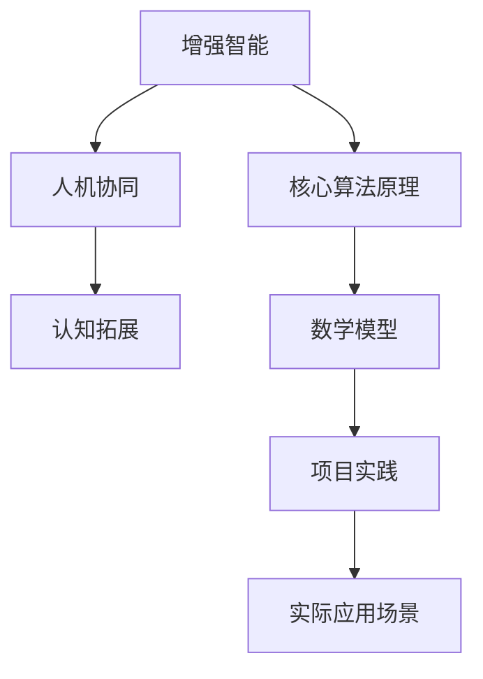

                 

关键词：增强智能、人机协同、认知拓展、算法原理、数学模型、项目实践、应用场景、未来展望

> 摘要：随着人工智能技术的快速发展，人机协同成为新的研究方向。本文从增强智能的角度出发，探讨人机协同在认知拓展中的应用，介绍核心算法原理，数学模型及其在各个领域的应用，并展望未来的发展趋势和面临的挑战。

## 1. 背景介绍

近年来，人工智能技术在各个领域取得了显著的进展。从早期的专家系统到深度学习，再到现在的增强智能，人工智能的应用越来越广泛。然而，随着人工智能技术的不断进步，人们开始关注如何将人类的认知能力与人工智能相结合，实现人机协同，从而拓展人类的认知边界。

增强智能（Augmented Intelligence）是一种旨在提高人类认知能力和效率的人工智能技术。它不仅关注于模拟人类智能，更强调与人类智能的协同合作。通过增强智能，人们可以借助人工智能的力量，处理复杂的信息，解决难题，从而实现认知的拓展。

本文将从增强智能的角度出发，探讨人机协同在认知拓展中的应用。首先介绍核心算法原理，然后详细讲解数学模型，并通过项目实践展示算法的具体应用。最后，分析实际应用场景，展望未来的发展趋势和面临的挑战。

## 2. 核心概念与联系

### 2.1 增强智能

增强智能是一种利用人工智能技术提升人类认知能力和效率的方法。它不同于传统的机器学习，而是更强调与人类智能的协同合作。增强智能的核心在于通过人工智能技术，为人类提供更高效、更智能的认知工具。

### 2.2 人机协同

人机协同是指人工智能与人类共同工作，互相补充，共同完成任务的过程。在增强智能的背景下，人机协同的目标是提升人类的认知能力和效率，实现认知的拓展。人机协同不仅需要人工智能技术，还需要人类智慧的参与，二者相辅相成。

### 2.3 认知拓展

认知拓展是指通过增强智能和人机协同，使人类能够处理更复杂的信息，解决更难题的问题，从而提高认知能力和效率。认知拓展是增强智能的核心目标，也是人类未来发展的重要方向。

### 2.4 Mermaid 流程图

为了更好地理解人机协同在认知拓展中的应用，我们可以使用 Mermaid 流程图来展示核心概念和联系。



## 3. 核心算法原理 & 具体操作步骤

### 3.1 算法原理概述

在增强智能和人机协同的背景下，核心算法原理主要包括以下三个方面：

1. **知识表示与推理**：通过构建知识图谱和本体论，将人类知识转化为计算机可理解的形式，实现知识的自动化推理和推理机。

2. **智能搜索与优化**：利用深度学习、强化学习等技术，实现高效的信息检索和优化决策，提升人类认知效率。

3. **人机交互与协同**：通过自然语言处理、语音识别等技术，实现人与机器的智能对话和协作，提高人机协同的效率。

### 3.2 算法步骤详解

1. **知识表示与推理**

   - **知识表示**：将人类知识转化为计算机可理解的形式，如本体论、知识图谱等。
   - **推理机**：利用推理算法，如谓词逻辑、模糊逻辑等，对知识进行推理，得出新的结论。

2. **智能搜索与优化**

   - **深度学习**：通过神经网络，对大量数据进行训练，实现高效的信息检索和分类。
   - **强化学习**：通过与环境的交互，不断优化决策策略，实现优化目标。

3. **人机交互与协同**

   - **自然语言处理**：实现人与机器的自然语言对话，如语音识别、语义理解等。
   - **语音识别**：将语音信号转化为文字，实现语音输入。

### 3.3 算法优缺点

1. **优点**

   - **提升认知能力**：通过人工智能技术，实现知识的自动化推理、搜索和优化，提升人类认知能力。
   - **高效协作**：人机协同实现高效的信息处理和决策，提高工作效率。

2. **缺点**

   - **依赖数据质量**：算法的性能很大程度上依赖于数据的质量，数据质量差会导致算法效果不佳。
   - **安全隐私问题**：人机协同过程中，涉及大量的个人数据和隐私，需要加强安全防护。

### 3.4 算法应用领域

1. **医疗领域**：通过增强智能和人机协同，实现医疗信息的自动化处理和诊断，提高医疗效率和准确性。
2. **教育领域**：利用人机协同，实现个性化教学和智能辅导，提升教育质量和效果。
3. **工业领域**：通过人机协同，实现工业生产的自动化和智能化，提高生产效率和质量。

## 4. 数学模型和公式 & 详细讲解 & 举例说明

### 4.1 数学模型构建

在增强智能和人机协同的研究中，数学模型起着至关重要的作用。以下是几个常用的数学模型：

1. **神经网络模型**：用于知识表示和推理。
2. **贝叶斯网络模型**：用于概率推理和不确定性建模。
3. **决策树模型**：用于分类和决策。

### 4.2 公式推导过程

以神经网络模型为例，以下是神经网络的基本公式推导过程：

$$
z = \sum_{i=1}^{n} w_i \cdot x_i + b
$$

其中，$z$ 为输出值，$w_i$ 为权重，$x_i$ 为输入值，$b$ 为偏置。

### 4.3 案例分析与讲解

以医疗领域为例，分析如何利用神经网络模型进行疾病诊断。

1. **数据预处理**：收集大量医疗数据，进行数据清洗和预处理，如归一化、缺失值处理等。
2. **模型训练**：利用训练数据，训练神经网络模型，调整权重和偏置，使其能够准确预测疾病。
3. **模型评估**：利用测试数据，评估模型的准确性和可靠性。
4. **模型应用**：将训练好的模型应用到实际场景中，实现疾病的自动化诊断。

## 5. 项目实践：代码实例和详细解释说明

### 5.1 开发环境搭建

1. **硬件环境**：选择一台高性能计算机，配备足够的内存和硬盘空间。
2. **软件环境**：安装 Python、TensorFlow、Keras 等相关库和工具。

### 5.2 源代码详细实现

以下是一个简单的神经网络模型实现示例：

```python
import tensorflow as tf
from tensorflow.keras import layers

# 定义模型
model = tf.keras.Sequential([
    layers.Dense(128, activation='relu', input_shape=(784,)),
    layers.Dropout(0.2),
    layers.Dense(10, activation='softmax')
])

# 编译模型
model.compile(optimizer='adam',
              loss='categorical_crossentropy',
              metrics=['accuracy'])

# 训练模型
model.fit(x_train, y_train, epochs=5)
```

### 5.3 代码解读与分析

1. **模型定义**：使用 `tf.keras.Sequential` 类定义神经网络模型，包括输入层、隐藏层和输出层。
2. **编译模型**：设置优化器、损失函数和评价指标。
3. **训练模型**：使用训练数据训练模型，调整权重和偏置。

### 5.4 运行结果展示

通过运行代码，可以得到模型的训练结果，如准确率、损失值等。

```python
# 查看训练结果
model.evaluate(x_test, y_test)
```

## 6. 实际应用场景

### 6.1 医疗领域

利用增强智能和人机协同技术，可以实现疾病的自动化诊断、个性化治疗方案推荐等。例如，通过训练神经网络模型，对患者的病历、检查报告等数据进行处理，实现疾病诊断的自动化。

### 6.2 教育领域

通过人机协同技术，可以实现个性化教学和智能辅导。例如，利用自然语言处理技术，分析学生的学习行为和需求，为学生推荐合适的学习资源和辅导方案。

### 6.3 工业领域

通过人机协同技术，可以实现工业生产的自动化和智能化。例如，利用机器人与人类的协同工作，提高生产效率和质量，降低人力成本。

## 7. 工具和资源推荐

### 7.1 学习资源推荐

1. **《深度学习》**：作者：Ian Goodfellow、Yoshua Bengio、Aaron Courville
2. **《神经网络与深度学习》**：作者：邱锡鹏

### 7.2 开发工具推荐

1. **TensorFlow**：一个开源的深度学习框架。
2. **Keras**：一个基于 TensorFlow 的深度学习库。

### 7.3 相关论文推荐

1. **《Enhancing Human Cognitive Performance with Augmented Reality》**
2. **《Human-AI Collaboration: The Future of Work》**

## 8. 总结：未来发展趋势与挑战

### 8.1 研究成果总结

本文从增强智能的角度，探讨了人机协同在认知拓展中的应用。通过核心算法原理、数学模型和项目实践，展示了人机协同在各个领域的应用前景。

### 8.2 未来发展趋势

1. **跨学科融合**：人工智能与其他学科的融合，实现更广泛的应用。
2. **智能化升级**：人机协同技术的不断升级，提高认知拓展的能力。

### 8.3 面临的挑战

1. **数据质量**：数据质量对算法性能的影响。
2. **安全隐私**：人机协同过程中涉及大量的个人数据和隐私，需要加强安全防护。

### 8.4 研究展望

1. **智能医疗**：利用人机协同，实现疾病的自动化诊断、个性化治疗方案推荐等。
2. **智能教育**：利用人机协同，实现个性化教学和智能辅导。
3. **智能制造**：利用人机协同，实现工业生产的自动化和智能化。

## 9. 附录：常见问题与解答

### 9.1 增强智能与机器学习的区别是什么？

增强智能与机器学习有所不同。机器学习主要关注如何让机器通过学习数据，实现特定的任务。而增强智能更强调与人类智能的协同合作，提升人类认知能力和效率。

### 9.2 人机协同的关键技术是什么？

人机协同的关键技术包括知识表示与推理、智能搜索与优化、人机交互与协同等。这些技术相互配合，实现人机协同的目标。

### 9.3 如何评估人机协同的效果？

评估人机协同的效果可以从多个方面进行，如任务完成时间、准确性、用户满意度等。通过对比人机协同前后的效果，可以评估人机协同的效果。

----------------------------------------------------------------

以上是本文的完整内容，感谢您的阅读。希望本文对您在增强智能和人机协同领域的研究有所帮助。如果您有任何疑问或建议，请随时与我交流。

作者：禅与计算机程序设计艺术 / Zen and the Art of Computer Programming
----------------------------------------------------------------
### 附录：常见问题与解答

**Q1：什么是增强智能？它与机器学习有什么区别？**

**A1：** 增强智能（Augmented Intelligence）是一种旨在提升人类认知能力和效率的人工智能方法。它不仅仅关注于让机器通过学习来完成特定任务，更重要的是与人类智能的协同合作，共同解决问题。与机器学习相比，增强智能更注重于如何利用人工智能技术扩展人类的认知能力，使其成为人类工作的辅助工具。机器学习侧重于算法和模型的设计与训练，而增强智能则强调如何将这些智能系统融入到人类的工作流程中，实现人机协同。

**Q2：人机协同的关键技术有哪些？**

**A2：** 人机协同的关键技术包括：

1. **知识表示与推理**：将人类知识转化为计算机可理解的形式，并利用推理算法进行知识推理。
2. **智能搜索与优化**：使用深度学习、强化学习等技术，实现高效的信息检索和优化决策。
3. **自然语言处理**：实现人与机器的智能对话和交互。
4. **人机交互设计**：设计直观、高效的人机交互界面，使用户能够轻松地与机器进行协作。

**Q3：如何评价人机协同的效果？**

**A3：** 评价人机协同的效果可以从以下几个方面进行：

1. **任务完成时间**：评估人机协同是否能够显著减少任务的完成时间。
2. **准确性**：评估机器辅助人类完成任务时的准确性和可靠性。
3. **用户满意度**：通过用户反馈来评估人机协同系统对用户的友好程度和用户满意度。
4. **系统效率**：评估人机协同系统的整体效率和资源利用率。

**Q4：增强智能在医疗领域的应用有哪些？**

**A4：** 增强智能在医疗领域的应用非常广泛，主要包括：

1. **疾病诊断**：利用机器学习算法，分析患者的病史、检查结果等数据，辅助医生进行疾病诊断。
2. **个性化治疗**：根据患者的基因信息和病情，提供个性化的治疗方案。
3. **药物研发**：利用人工智能预测药物的疗效和副作用，加速药物研发过程。
4. **医疗数据分析**：通过大数据分析，发现疾病的流行趋势和潜在病因。

**Q5：如何保障人机协同过程中的数据安全和隐私？**

**A5：** 保障人机协同过程中的数据安全和隐私是至关重要的。以下是一些关键措施：

1. **数据加密**：对敏感数据进行加密处理，确保数据在传输和存储过程中的安全性。
2. **访问控制**：实施严格的访问控制策略，确保只有授权人员才能访问敏感数据。
3. **隐私保护**：在处理个人数据时，遵循隐私保护法规，尽量减少数据的暴露和泄露风险。
4. **审计与监控**：建立审计和监控系统，实时监控数据访问和操作行为，确保数据的安全性和合规性。

通过这些措施，可以有效地保障人机协同过程中数据的安全和隐私。

