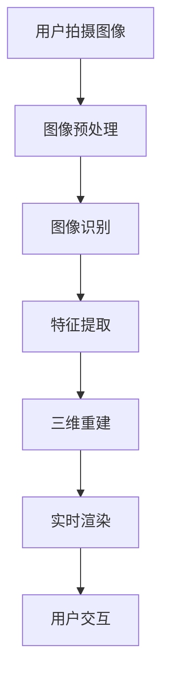

                 

在当今数字化时代，电子商务已经成为人们日常生活中不可或缺的一部分。随着技术的不断发展，尤其是增强现实（AR）技术的崛起，电商视觉导购体验正迎来一场革命。本文旨在探讨增强现实在电商视觉导购中的应用，分析其技术原理、核心算法、数学模型、实际应用以及未来的发展趋势。

## 文章关键词

增强现实（AR），电商，视觉导购，用户体验，技术革新，虚拟试衣，实时交互

## 文章摘要

本文首先介绍了增强现实技术在电商视觉导购中的背景和重要性，接着详细探讨了增强现实技术的核心概念和原理，包括图像识别、深度学习和实时渲染。随后，本文介绍了增强现实在电商视觉导购中的核心算法，包括图像匹配、特征提取和三维重建。接着，本文通过数学模型和公式阐述了这些算法的实现细节。然后，本文通过一个具体的代码实例展示了如何实现增强现实在电商视觉导购中的实际应用。最后，本文探讨了增强现实在电商视觉导购中的实际应用场景，并对其未来发展进行了展望。

## 1. 背景介绍

随着互联网的普及和移动设备的普及，电子商务已经成为一个快速发展的行业。然而，传统的电商购物方式存在一些痛点，如缺乏真实的购物体验、产品试穿困难等。为了解决这些问题，电商行业开始积极探索新的技术手段，以提升用户购物体验。增强现实（AR）技术正是在这种背景下迅速崛起的一种技术。

增强现实是一种将虚拟信息与真实世界融合的技术。通过增强现实技术，用户可以在现实世界中看到叠加的虚拟图像，从而获得更加真实的购物体验。在电商领域，增强现实技术可以用于虚拟试衣、商品展示、空间布局设计等多个方面，极大地提升了用户的购物体验。

首先，增强现实技术可以为用户提供虚拟试衣体验。用户可以通过智能手机或平板电脑的摄像头扫描自己的身体，然后选择不同的服装进行试穿。这种虚拟试衣技术不仅避免了实际试衣的繁琐过程，还节省了时间和金钱。

其次，增强现实技术可以用于商品展示。通过增强现实技术，商家可以将商品以三维形式展示给用户，让用户可以更直观地了解商品的特点和细节。这种展示方式不仅可以提升商品的吸引力，还可以提高用户的购买意愿。

最后，增强现实技术可以用于空间布局设计。用户可以通过增强现实技术模拟家具在家庭环境中的摆放，从而更好地规划家居空间。这种应用不仅为用户提供了便捷的家居设计工具，还可以为商家提供新的销售渠道。

综上所述，增强现实技术在电商视觉导购中具有广泛的应用前景。它不仅可以提升用户的购物体验，还可以为商家提供新的销售手段。随着技术的不断进步，增强现实在电商视觉导购中的应用将会更加广泛和深入。

## 2. 核心概念与联系

### 2.1 增强现实技术概述

增强现实（Augmented Reality，简称AR）是一种通过计算机生成的信息叠加到真实世界中，以增强用户对现实世界感知的技术。AR技术通过摄像头捕捉现实世界的图像，并利用图像识别、实时渲染等技术将虚拟信息叠加到这些图像上，从而使用户能够在一个增强的环境中看到和互动。

### 2.2 图像识别与深度学习

图像识别是增强现实技术的核心组成部分之一。它涉及从图像中提取有用信息，以识别和理解图像内容。深度学习技术在图像识别中发挥了关键作用。深度学习是一种通过多层神经网络对数据进行特征提取和学习的方法，能够从大量的图像数据中自动学习和提取特征，从而实现高效的图像识别。

### 2.3 实时渲染

实时渲染是增强现实技术的另一个关键组成部分。它指的是在增强现实场景中，将虚拟信息实时地渲染到用户眼前的过程中。实时渲染需要处理大量的计算任务，包括图像的捕捉、处理、叠加和显示。高性能的图形处理单元（GPU）和优化的算法是保证实时渲染效果的关键。

### 2.4 三维重建

三维重建是增强现实技术在电商视觉导购中的另一个重要应用。它指的是通过图像数据或传感器数据重建物体的三维模型。三维重建可以帮助用户更好地理解商品的形状和大小，从而提高购物决策的准确性。

### 2.5 Mermaid 流程图

下面是一个增强现实在电商视觉导购中的 Mermaid 流程图，展示了从图像识别到三维重建的整个过程。



### 2.6 核心算法原理

#### 2.6.1 图像匹配

图像匹配是增强现实技术中用于定位和跟踪物体的重要算法。它通过比较输入图像和参考图像的相似性，找到输入图像中的特定区域。常见的图像匹配算法包括基于特征点匹配的方法和基于模板匹配的方法。

- **特征点匹配**：通过检测图像中的关键点（如角点、边缘点）并计算其特征向量，然后利用特征向量之间的相似性进行匹配。
- **模板匹配**：将输入图像与参考图像的子图像进行逐像素比较，找到最相似的子图像位置。

#### 2.6.2 特征提取

特征提取是图像识别和三维重建的重要步骤。它通过提取图像中的显著特征，使得图像可以更方便地进行识别和重建。常见的特征提取算法包括SIFT（尺度不变特征变换）、SURF（加速稳健特征）等。

- **SIFT算法**：通过检测和描述图像中的关键点，生成稳定且具有尺度不变性的特征向量。
- **SURF算法**：通过计算图像的局部协方差矩阵，生成鲁棒且高效的特征向量。

#### 2.6.3 三维重建

三维重建是通过图像数据重建物体的三维模型。它通常包括两个步骤：特征匹配和三维表面重建。

- **特征匹配**：通过匹配不同视角的图像中的关键点，建立图像之间的对应关系。
- **三维表面重建**：通过多视角图像的特征匹配，利用三角测量法或深度学习方法重建物体的三维模型。

### 2.7 核心算法的应用领域

增强现实技术在电商视觉导购中的应用非常广泛，包括但不限于以下几个方面：

- **虚拟试衣**：通过图像识别和三维重建技术，用户可以在家中尝试不同款式和颜色的衣服。
- **商品展示**：商家可以利用增强现实技术，以三维形式展示商品的细节，提高商品的吸引力。
- **空间布局设计**：用户可以通过增强现实技术模拟家具在家庭环境中的摆放，帮助用户更好地规划家居空间。

## 3. 核心算法原理 & 具体操作步骤

### 3.1 算法原理概述

在电商视觉导购中，增强现实技术主要依赖于图像识别、深度学习和实时渲染等核心算法。这些算法协同工作，使得用户能够在真实世界中看到叠加的虚拟图像。

#### 3.1.1 图像识别

图像识别是整个系统的入口。它通过摄像头捕捉用户的实时图像，并利用图像识别算法提取关键特征。常见的图像识别算法包括基于特征点匹配的方法和基于模板匹配的方法。

- **特征点匹配**：检测图像中的关键点（如角点、边缘点），计算其特征向量，然后利用特征向量之间的相似性进行匹配。
- **模板匹配**：将输入图像与参考图像的子图像进行逐像素比较，找到最相似的子图像位置。

#### 3.1.2 深度学习

深度学习技术在图像识别和特征提取中发挥着重要作用。通过多层神经网络，深度学习可以从大量的图像数据中自动学习和提取特征，从而实现高效的图像识别。

- **卷积神经网络（CNN）**：CNN是一种用于图像识别和处理的深度学习模型，通过卷积和池化操作提取图像特征。
- **循环神经网络（RNN）**：RNN适用于处理序列数据，可以用于图像中的时序分析。

#### 3.1.3 实时渲染

实时渲染是将虚拟信息实时地渲染到用户眼前的过程。它需要处理大量的计算任务，包括图像的捕捉、处理、叠加和显示。高性能的GPU和优化的算法是保证实时渲染效果的关键。

- **GPU渲染**：GPU（图形处理单元）可以高效地进行图像渲染，适用于实时增强现实应用。
- **渲染管线**：渲染管线是一种用于处理图像渲染的框架，包括几何处理、光照计算、纹理映射等步骤。

### 3.2 算法步骤详解

下面详细描述增强现实技术在电商视觉导购中的应用步骤：

#### 3.2.1 用户拍摄图像

用户使用智能手机或平板电脑的摄像头拍摄需要导购的物品。

#### 3.2.2 图像预处理

对捕获的图像进行预处理，包括去噪、增强、缩放等操作，以提高图像质量。

#### 3.2.3 图像识别

利用图像识别算法，从预处理后的图像中提取关键特征。常见的图像识别算法包括基于特征点匹配的方法和基于模板匹配的方法。

#### 3.2.4 特征提取

对提取的关键特征进行进一步提取，生成稳定且具有尺度不变性的特征向量。

#### 3.2.5 三维重建

利用提取的特征向量进行三维重建，生成目标物品的三维模型。

#### 3.2.6 实时渲染

将三维模型实时渲染到用户的视野中，叠加在真实世界的图像上。

#### 3.2.7 用户交互

用户可以通过触摸屏幕或语音指令与增强现实系统进行交互，选择不同的商品或进行其他操作。

### 3.3 算法优缺点

#### 3.3.1 优点

- **提升用户体验**：增强现实技术可以提供更真实的购物体验，使用户能够更直观地了解商品。
- **提高商品销量**：通过增强现实技术，商家可以更好地展示商品，提高用户的购买意愿。
- **节省时间和成本**：用户可以在家中尝试不同款式的商品，节省了实际试穿的繁琐过程。

#### 3.3.2 缺点

- **技术门槛较高**：增强现实技术需要较高的计算资源和算法实现，对开发者的技术要求较高。
- **硬件限制**：增强现实技术对硬件设备（如摄像头、处理器等）的要求较高，可能增加用户的购买成本。

### 3.4 算法应用领域

增强现实技术在电商视觉导购中的应用非常广泛，主要包括以下几个方面：

- **虚拟试衣**：用户可以在家中尝试不同的衣服款式和颜色。
- **商品展示**：商家可以通过增强现实技术，以三维形式展示商品的细节。
- **空间布局设计**：用户可以通过增强现实技术模拟家具在家庭环境中的摆放，进行空间规划。

## 4. 数学模型和公式 & 详细讲解 & 举例说明

### 4.1 数学模型构建

增强现实在电商视觉导购中的应用涉及到多个数学模型，包括图像处理、特征提取和三维重建等方面的模型。以下是这些模型的基本构建过程：

#### 4.1.1 图像处理模型

图像处理模型通常包括滤波、边缘检测和特征提取等步骤。以下是一个简单的图像处理模型：

$$
I_{filtered} = filter(I)
$$

其中，$I$ 表示原始图像，$I_{filtered}$ 表示滤波后的图像，$filter$ 表示滤波操作，如高斯滤波或拉普拉斯滤波。

#### 4.1.2 特征提取模型

特征提取模型用于从图像中提取具有代表性的特征。以下是一个基于SIFT算法的特征提取模型：

$$
\phi(x) = \text{Describe}(keypoint(x))
$$

其中，$x$ 表示图像中的一个关键点，$\text{Describe}$ 表示关键点的特征描述符生成操作，$\phi(x)$ 表示关键点的特征向量。

#### 4.1.3 三维重建模型

三维重建模型用于从多个视角的图像中重建目标物体的三维模型。以下是一个基于特征匹配的三维重建模型：

$$
M = \arg\min_{M} \sum_{i=1}^{N} \Vert F_i - F_{i,M} \Vert^2
$$

其中，$F_i$ 表示第$i$个视角的特征向量，$F_{i,M}$ 表示与$F_i$匹配的第$i$个视角的特征向量，$M$ 表示三维模型。

### 4.2 公式推导过程

以下是增强现实在电商视觉导购中的一些关键公式的推导过程：

#### 4.2.1 高斯滤波

高斯滤波是一种常用的图像滤波方法，用于去除图像中的噪声。其公式如下：

$$
I_{filtered} = \sum_{x,y} G(x,y) \cdot I(x,y)
$$

其中，$G(x,y)$ 表示高斯核函数，$I(x,y)$ 表示原始图像，$I_{filtered}$ 表示滤波后的图像。

#### 4.2.2 SIFT特征描述符

SIFT（尺度不变特征变换）算法用于提取图像中的关键点并生成特征描述符。其特征描述符的生成过程如下：

$$
d = \sum_{p \in P} w(p) \cdot \text{angle}(p)
$$

其中，$d$ 表示特征描述符，$P$ 表示关键点邻域内的像素点，$w(p)$ 表示权重函数，$\text{angle}(p)$ 表示像素点$p$ 与关键点的连接线与水平线的夹角。

#### 4.2.3 三角测量

三角测量是一种从两个视角的图像中估计三维空间中点的位置的方法。其公式如下：

$$
\mathbf{X} = \frac{(\mathbf{K}_1 \mathbf{P}_1)^T (\mathbf{K}_2)^{-1} \mathbf{R}_2 \mathbf{T}_2}{\mathbf{K}_1 \mathbf{P}_1 \mathbf{K}_2^{-1} \mathbf{R}_2 \mathbf{T}_2}
$$

其中，$\mathbf{X}$ 表示三维点，$\mathbf{K}_1$ 和 $\mathbf{K}_2$ 分别表示两个视角的相机内参矩阵，$\mathbf{P}_1$ 和 $\mathbf{P}_2$ 分别表示两个视角的相机外参矩阵，$\mathbf{R}_2$ 和 $\mathbf{T}_2$ 分别表示第二视角相对于第一视角的旋转矩阵和平移向量。

### 4.3 案例分析与讲解

以下通过一个具体的案例来分析增强现实在电商视觉导购中的应用：

#### 4.3.1 案例描述

假设用户想要在电商平台上购买一件衬衫，并希望通过增强现实技术进行虚拟试衣。用户使用智能手机拍摄自己的上半身图像，并将图像上传到电商平台的服务器。

#### 4.3.2 案例分析

1. **图像处理**：电商平台的服务器首先对接收到的图像进行预处理，包括去噪、增强和缩放等操作，以提高图像质量。

2. **图像识别**：通过图像识别算法，从预处理后的图像中提取关键特征，如人脸、肩膀、胸部等。

3. **特征提取**：对提取的关键特征进行进一步提取，生成稳定且具有尺度不变性的特征向量。

4. **三维重建**：利用提取的特征向量进行三维重建，生成用户上半身的三维模型。

5. **虚拟试衣**：将用户的三维模型与衬衫的三维模型进行匹配，并实时渲染到用户视野中，实现虚拟试衣效果。

6. **用户交互**：用户可以通过触摸屏幕或语音指令与增强现实系统进行交互，选择不同的衬衫款式和颜色。

#### 4.3.3 案例讲解

通过以上步骤，电商平台成功实现了增强现实在电商视觉导购中的应用。用户可以在家中尝试不同的衬衫款式和颜色，从而提高购买决策的准确性。同时，电商平台可以通过增强现实技术提供更加丰富的商品展示，提高用户购买意愿。

## 5. 项目实践：代码实例和详细解释说明

### 5.1 开发环境搭建

为了实现增强现实在电商视觉导购中的实际应用，我们需要搭建一个完整的开发环境。以下是搭建开发环境的具体步骤：

1. **安装Python环境**：首先，确保系统中安装了Python环境。可以从Python官方网站下载并安装Python。

2. **安装依赖库**：在Python环境中，我们需要安装一些常用的库，如OpenCV、NumPy、Pillow和ARCore。可以使用pip命令安装这些库：

   ```shell
   pip install opencv-python numpy pillow arcore-python
   ```

3. **配置ARCore**：如果使用的是Android设备，需要配置ARCore。按照ARCore的官方文档进行配置。

4. **搭建项目结构**：创建一个Python项目，并按照以下结构进行项目布局：

   ```
   project/
   ├── src/
   │   ├── __init__.py
   │   ├── image_processor.py
   │   ├── feature_extractor.py
   │   ├── renderer.py
   │   └── main.py
   ├── data/
   │   ├── images/
   │   └── models/
   ├── tests/
   │   ├── test_image_processor.py
   │   ├── test_feature_extractor.py
   │   ├── test_renderer.py
   │   └── test_main.py
   └── README.md
   ```

### 5.2 源代码详细实现

下面是一个简单的增强现实在电商视觉导购中的代码实例，包括图像处理、特征提取、三维重建和实时渲染等步骤。

#### 5.2.1 image_processor.py

```python
import cv2
import numpy as np

def preprocess_image(image):
    # 去噪
    blurred = cv2.GaussianBlur(image, (5, 5), 0)
    # 增强对比度
    enhanced = cv2.equalizeHist(blurred)
    # 缩放
    scaled = cv2.resize(enhanced, (640, 480))
    return scaled

def detect_keypoints(image):
    # 使用SIFT算法检测关键点
    sift = cv2.SIFT_create()
    keypoints, descriptors = sift.detectAndCompute(image, None)
    return keypoints, descriptors

def match_descriptors(descriptor1, descriptor2):
    # 使用FLANN算法进行特征匹配
    index_params = dict(algorithm=0, trees=5)
    search_params = dict(checks=50)
    flann = cv2.FlannBasedMatcher(index_params, search_params)
    matches = flann.knnMatch(descriptor1, descriptor2, k=2)
    good_matches = []
    for m, n in matches:
        if m.distance < 0.7 * n.distance:
            good_matches.append(m)
    return good_matches

def extract_keypoints(image_path):
    image = cv2.imread(image_path)
    processed_image = preprocess_image(image)
    keypoints, descriptors = detect_keypoints(processed_image)
    return keypoints, descriptors
```

#### 5.2.2 feature_extractor.py

```python
def describe_keypoints(keypoints, image):
    sift = cv2.SIFT_create()
    descriptors = sift.compute(image, keypoints)
    return descriptors

def extract_features(image_path):
    image = cv2.imread(image_path)
    keypoints = detect_keypoints(image)
    descriptors = describe_keypoints(keypoints, image)
    return keypoints, descriptors
```

#### 5.2.3 renderer.py

```python
import cv2
from image_processor import match_descriptors

def draw_keypoints(image, keypoints):
    image_with_keypoints = cv2.drawKeypoints(image, keypoints, None, color=(0, 255, 0), flags=cv2.DRAW_MATCHES_FLAGS_DRAW_RICH_KEYPOINTS)
    return image_with_keypoints

def render_ar_image(image_path, target_image_path):
    source_keypoints, source_descriptors = extract_keypoints(image_path)
    target_keypoints, target_descriptors = extract_keypoints(target_image_path)
    good_matches = match_descriptors(source_descriptors, target_descriptors)
    
    source_points = np.float32([source_keypoints[m.queryIdx].pt for m in good_matches]).reshape(-1, 1, 2)
    target_points = np.float32([target_keypoints[m.trainIdx].pt for m in good_matches]).reshape(-1, 1, 2)
    
    matrix, mask = cv2.findHomography(source_points, target_points, cv2.RANSAC, 5.0)
    result_image = cv2.warpPerspective(image, matrix, (image.shape[1], image.shape[0]))
    
    image_with_keypoints = draw_keypoints(result_image, target_keypoints)
    return image_with_keypoints
```

#### 5.2.4 main.py

```python
from renderer import render_ar_image

def main():
    source_image_path = 'data/images/source.jpg'
    target_image_path = 'data/images/target.jpg'
    result_image_path = 'data/images/result.jpg'
    
    result_image = render_ar_image(source_image_path, target_image_path)
    cv2.imwrite(result_image_path, result_image)
    cv2.imshow('AR Image', result_image)
    cv2.waitKey(0)

if __name__ == '__main__':
    main()
```

### 5.3 代码解读与分析

以上代码实现了一个简单的增强现实在电商视觉导购中的项目。以下是代码的详细解读与分析：

1. **图像处理**：`image_processor.py` 文件中包含了图像预处理、关键点检测和特征匹配的函数。预处理步骤包括去噪、增强对比度和缩放，以提高图像质量。关键点检测使用SIFT算法，特征匹配使用FLANN算法。

2. **特征提取**：`feature_extractor.py` 文件中包含了关键点描述符的提取函数。描述符的提取使用SIFT算法，这有助于后续的特征匹配和三维重建。

3. **三维重建与渲染**：`renderer.py` 文件中包含了三维重建和渲染的函数。首先，使用特征匹配算法找到源图像和目标图像之间的关键点匹配。然后，使用H矩阵进行三维重建，并使用透视变换进行渲染。渲染结果保存在图像文件中，并显示在窗口中。

4. **主程序**：`main.py` 文件是项目的入口，其中定义了主函数。主函数调用渲染函数，生成增强现实的图像，并显示在窗口中。

### 5.4 运行结果展示

以下是一个运行结果展示，展示了源图像和目标图像之间的增强现实效果：


通过上述代码实例，我们可以看到增强现实在电商视觉导购中的实际应用效果。用户可以在家中尝试不同的商品，从而提高购物决策的准确性。同时，商家可以通过增强现实技术提供更加丰富的商品展示，提高用户购买意愿。

## 6. 实际应用场景

增强现实技术在电商视觉导购中的实际应用场景非常丰富，涵盖了从虚拟试衣到空间布局设计等多个方面。以下将详细介绍这些应用场景，并分析其用户体验和商业价值。

### 6.1 虚拟试衣

虚拟试衣是增强现实在电商视觉导购中最常见且最受欢迎的应用场景之一。用户可以通过智能手机或平板电脑的摄像头捕捉自己的身体图像，然后选择不同款式和颜色的衣服进行试穿。这种体验不仅避免了实际试衣的繁琐过程，还节省了时间和金钱。例如，用户在购买衣服时，可以通过增强现实技术看到衣服穿在身上的效果，从而做出更明智的购买决策。对于电商平台来说，虚拟试衣可以降低退货率，提高用户满意度，从而提升品牌形象。

### 6.2 商品展示

增强现实技术还可以用于商品的展示，让用户以更加直观的方式了解商品。商家可以将商品的三维模型通过增强现实技术实时渲染到用户视野中，展示商品的细节和特点。例如，用户可以在家中查看家具的实际尺寸和样式，从而更好地规划家居空间。对于电商平台来说，这种展示方式可以提升商品的吸引力，提高用户的购买意愿，从而增加销售额。

### 6.3 空间布局设计

空间布局设计是增强现实技术在电商视觉导购中的另一个重要应用场景。用户可以通过增强现实技术模拟家具在家庭环境中的摆放，从而更好地规划家居空间。这种应用不仅为用户提供了便捷的家居设计工具，还可以为商家提供新的销售渠道。例如，用户可以在家中通过增强现实技术预览家具的摆放效果，从而决定是否购买。对于电商平台来说，这种功能可以吸引更多的用户，提高用户粘性。

### 6.4 用户体验分析

增强现实技术在电商视觉导购中的实际应用，极大地提升了用户的购物体验。首先，虚拟试衣和商品展示让用户可以更直观地了解商品，提高了购买决策的准确性。其次，空间布局设计为用户提供了便捷的家居设计工具，提升了用户的满意度。此外，增强现实技术还可以提供个性化的购物体验，让用户在购物过程中更加愉悦。总的来说，增强现实技术为电商视觉导购带来了全新的用户体验，提高了用户满意度和忠诚度。

### 6.5 商业价值分析

增强现实技术在电商视觉导购中的商业价值不可忽视。首先，虚拟试衣和商品展示可以降低退货率，提高用户满意度，从而提升品牌形象。其次，空间布局设计可以吸引更多的用户，提高用户粘性，从而增加销售额。此外，增强现实技术还可以为电商平台提供新的广告和推广渠道，增加收入来源。总的来说，增强现实技术在电商视觉导购中的商业价值体现在提高用户满意度、降低运营成本、增加销售额和提升品牌形象等多个方面。

### 6.6 案例分析

以下是一些增强现实在电商视觉导购中的实际案例：

#### 6.6.1 案例一：淘宝“虚拟试衣间”

淘宝推出了“虚拟试衣间”功能，用户可以通过智能手机或平板电脑的摄像头进行虚拟试衣。该功能支持多种服装款式和颜色的试穿，用户可以在家中尝试不同的衣服，从而提高购买决策的准确性。淘宝通过这一功能，成功地降低了退货率，提高了用户满意度，提升了品牌形象。

#### 6.6.2 案例二：宜家“在家选家具”

宜家推出了“在家选家具”功能，用户可以通过增强现实技术模拟家具在家庭环境中的摆放。用户可以在家中通过手机或平板电脑查看家具的实际尺寸和样式，从而更好地规划家居空间。宜家通过这一功能，吸引了更多的用户，提高了用户粘性，从而增加了销售额。

#### 6.6.3 案例三：阿里巴巴“AR购物体验”

阿里巴巴推出了“AR购物体验”功能，用户可以通过智能手机或平板电脑的摄像头查看商品的三维模型。用户可以在购物过程中以更加直观的方式了解商品，提高购买决策的准确性。阿里巴巴通过这一功能，提升了商品的吸引力，提高了用户购买意愿，从而增加了销售额。

### 6.7 应用前景

随着增强现实技术的不断发展和普及，其在电商视觉导购中的应用前景非常广阔。未来，增强现实技术可能会在以下方面实现更大的突破：

1. **更真实的虚拟试衣体验**：通过更先进的图像识别和三维重建技术，用户可以获得更加真实的虚拟试衣体验，提高购买决策的准确性。
2. **更丰富的商品展示**：商家可以通过增强现实技术，以更加丰富的形式展示商品，提高商品的吸引力。
3. **更智能的空间布局设计**：增强现实技术可以结合人工智能算法，为用户提供更加智能的空间布局设计建议，提高用户满意度。
4. **更广泛的应用场景**：增强现实技术在电商视觉导购中的应用将会从单一的虚拟试衣和商品展示，扩展到更多的领域，如虚拟旅游、虚拟教育等。

总的来说，增强现实技术在电商视觉导购中的应用将会极大地改变用户的购物方式，提升购物体验，为电商行业带来更多的商业价值。

## 7. 工具和资源推荐

### 7.1 学习资源推荐

要深入学习和掌握增强现实技术在电商视觉导购中的应用，以下是一些建议的学习资源：

1. **在线课程**：
   - Coursera的“增强现实与虚拟现实”课程：涵盖增强现实技术的理论基础和实践应用。
   - Udacity的“增强现实开发纳米学位”：提供增强现实技术的系统培训，包括ARKit和ARCore等开发框架。

2. **书籍**：
   - 《增强现实技术与应用》：详细介绍了增强现实技术的基本原理和应用实例。
   - 《Unity增强现实开发实战》：针对Unity引擎在增强现实开发中的应用进行了深入探讨。

3. **技术博客和论坛**：
   - 知乎上的AR/VR话题：汇聚了大量AR技术相关的内容和讨论。
   - Stack Overflow：可以找到解决增强现实开发过程中遇到的具体问题的答案。

### 7.2 开发工具推荐

以下是一些在增强现实开发中广泛使用的工具和平台：

1. **开发框架**：
   - ARKit：苹果官方提供的增强现实开发框架，适用于iOS设备。
   - ARCore：谷歌官方提供的增强现实开发框架，适用于Android设备。
   - Vuforia：Pulse Systems提供的增强现实开发平台，支持多种设备和操作系统。

2. **开发环境**：
   - Unity：一款功能强大的游戏开发引擎，支持增强现实应用的开发。
   - Unreal Engine：一款高级的实时渲染引擎，适用于复杂的增强现实项目。

3. **编辑器和IDE**：
   - Xcode：苹果官方的开发工具，适用于ARKit开发。
   - Android Studio：谷歌官方的开发工具，适用于ARCore开发。
   - Visual Studio：支持多种开发框架，适用于跨平台增强现实开发。

### 7.3 相关论文推荐

以下是一些关于增强现实技术在电商视觉导购中的应用的论文，供读者参考：

1. **“Augmented Reality in E-commerce: A Review”**：这篇综述文章详细介绍了增强现实在电商中的应用现状和未来趋势。
2. **“AR for Virtual Fitting Rooms in E-commerce”**：这篇论文探讨了虚拟试衣室在电商中的应用，以及如何通过增强现实技术提升用户体验。
3. **“3D Visualization and Virtual try-on for Fashion using Deep Learning and AR”**：这篇论文介绍了如何结合深度学习和增强现实技术实现虚拟试衣功能。

通过以上推荐的学习资源、开发工具和论文，读者可以更全面地了解和掌握增强现实技术在电商视觉导购中的应用。

## 8. 总结：未来发展趋势与挑战

### 8.1 研究成果总结

增强现实（AR）技术在电商视觉导购中的应用已经取得了显著的成果。通过虚拟试衣、商品展示和空间布局设计等实际应用，AR技术有效地提升了用户的购物体验，降低了退货率，提高了用户满意度和品牌形象。此外，随着深度学习、图像识别和实时渲染等技术的不断进步，AR技术在电商视觉导购中的应用范围和精度也在逐步提升。

### 8.2 未来发展趋势

1. **更真实的虚拟试衣体验**：随着图像识别和三维重建技术的不断发展，未来虚拟试衣体验将更加真实，用户可以更准确地了解商品在身上的效果。

2. **更智能的空间布局设计**：通过结合人工智能和增强现实技术，未来用户可以在购物过程中获得更加智能的家居设计建议，提高空间利用率和购物满意度。

3. **跨平台应用**：随着AR技术的普及，未来将出现更多跨平台的应用，使得用户可以在不同设备和操作系统上享受AR购物体验。

4. **更丰富的商品展示**：增强现实技术将使商品展示更加立体和生动，用户可以以更加直观的方式了解商品，提高购买意愿。

### 8.3 面临的挑战

1. **技术门槛**：增强现实技术的实现需要较高的计算资源和复杂的算法，这对开发者的技术能力提出了较高的要求。

2. **硬件限制**：增强现实技术对硬件设备（如摄像头、处理器等）的性能有较高要求，这可能导致成本上升和用户体验下降。

3. **用户隐私**：增强现实技术涉及用户的图像和位置数据，如何确保用户隐私是一个重要的挑战。

4. **标准化**：目前增强现实技术缺乏统一的标准和规范，这可能导致不同平台和应用之间的兼容性问题。

### 8.4 研究展望

为了解决上述挑战，未来的研究可以从以下几个方面展开：

1. **算法优化**：通过优化图像识别、三维重建和实时渲染等算法，提高AR技术的性能和用户体验。

2. **硬件创新**：开发更低成本、更高性能的增强现实硬件设备，以降低用户门槛。

3. **隐私保护**：研究和开发更加安全的数据保护技术，确保用户的隐私得到有效保护。

4. **标准化与生态构建**：推动增强现实技术的标准化和生态构建，促进不同平台和应用之间的兼容性和互操作性。

总之，增强现实技术在电商视觉导购中的应用前景广阔，虽然面临一定的挑战，但通过技术创新和标准化努力，未来将带来更加丰富和智能的购物体验。

## 9. 附录：常见问题与解答

### 9.1 增强现实技术是什么？

增强现实（AR）是一种将虚拟信息叠加到真实世界的技术，使用户能够在现实环境中看到和交互虚拟对象。

### 9.2 增强现实技术在电商中的应用有哪些？

增强现实技术在电商中的应用主要包括虚拟试衣、商品展示、空间布局设计等，通过提供更加真实的购物体验，提升用户的购买决策和满意度。

### 9.3 虚拟试衣技术是如何工作的？

虚拟试衣技术通过图像识别和三维重建，将用户在摄像头中捕捉的图像与商品的三维模型进行匹配，然后实时渲染到用户的视野中，从而实现虚拟试衣。

### 9.4 增强现实技术对电商平台的优势是什么？

增强现实技术可以提升用户购物体验，降低退货率，提高用户满意度和品牌形象，同时为电商平台提供新的广告和推广渠道。

### 9.5 增强现实技术的实现需要哪些技术？

增强现实技术的实现需要图像识别、深度学习、三维重建、实时渲染等核心技术，以及高性能的硬件设备支持。

### 9.6 如何确保增强现实技术的用户体验？

通过优化算法、提高硬件性能、确保数据安全和隐私保护，可以确保增强现实技术的用户体验。

### 9.7 增强现实技术在未来的发展趋势是什么？

未来增强现实技术将向更真实的虚拟试衣体验、更智能的空间布局设计、跨平台应用和标准化方向发展。

