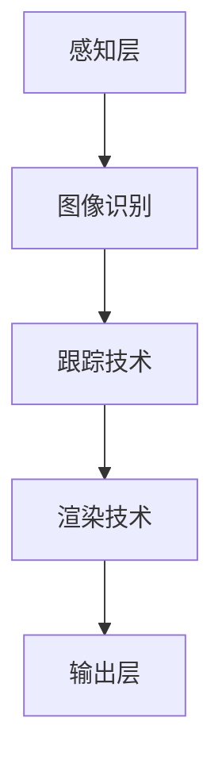

                 

关键词：增强现实（AR）、零售业、购物体验、用户体验、技术应用

> 摘要：本文将探讨增强现实（AR）技术在零售业中的应用，分析其如何通过创新的互动体验提升消费者的购物体验。文章将涵盖AR技术的背景、核心概念、应用算法、数学模型、项目实践，并展望未来发展趋势与挑战。

## 1. 背景介绍

随着科技的发展，增强现实（AR）技术逐渐成为商业领域的重要工具。AR技术通过在现实环境中叠加数字信息，为用户带来沉浸式的互动体验。在零售业，AR技术的应用不仅丰富了购物体验，也为商家提供了新的营销手段。

过去几年，零售业经历了巨大的变革。电子商务的兴起使得线上购物成为主流，线下实体店的生存空间受到挤压。为了重新吸引消费者，零售商们纷纷寻求创新的方式提升购物体验。增强现实技术的出现，为零售业带来了一股新的活力。

AR技术已经在零售业中得到广泛应用，如虚拟试衣、产品可视化、虚拟导购等。通过AR技术，消费者可以在虚拟环境中亲身体验产品，从而做出更明智的购买决策。本文将深入探讨AR技术在零售业中的应用，分析其对购物体验的全面提升。

## 2. 核心概念与联系

### 2.1 增强现实技术原理

增强现实（AR）是一种将虚拟信息与现实世界融合的技术。它通过在现实场景中叠加数字信息，为用户带来一种全新的交互体验。AR技术的核心原理包括图像识别、跟踪、渲染等。

图像识别是AR技术的关键组成部分，它通过识别现实世界中的特定图像或物体，实现虚拟信息的叠加。跟踪技术则用于实时监测用户的位置和姿态，确保虚拟信息与实际场景的同步。渲染技术负责将虚拟信息以逼真的形式呈现给用户。

### 2.2 AR技术架构

AR技术的架构可以分为三个层次：感知层、处理层和输出层。

- **感知层**：感知层包括摄像头、传感器等硬件设备，用于捕捉现实世界的图像和声音信息。
- **处理层**：处理层包括图像识别、跟踪、渲染等算法，用于处理感知层获取的数据，生成虚拟信息。
- **输出层**：输出层包括显示器、扬声器等输出设备，用于将虚拟信息呈现给用户。

### 2.3 Mermaid 流程图

下面是AR技术架构的Mermaid流程图：



## 3. 核心算法原理 & 具体操作步骤

### 3.1 算法原理概述

AR技术中的核心算法主要包括图像识别、跟踪和渲染。这些算法共同协作，实现了虚拟信息与现实世界的融合。

- **图像识别**：图像识别算法通过识别现实世界中的特定图像或物体，实现虚拟信息的叠加。常见的图像识别算法包括深度学习模型、特征匹配等。
- **跟踪技术**：跟踪技术用于实时监测用户的位置和姿态，确保虚拟信息与实际场景的同步。常见的跟踪算法包括视觉跟踪、惯性测量单元（IMU）等。
- **渲染技术**：渲染技术负责将虚拟信息以逼真的形式呈现给用户。常见的渲染技术包括三维建模、纹理映射等。

### 3.2 算法步骤详解

以下是AR技术的具体操作步骤：

1. **图像识别**：
   - **输入**：摄像头捕捉现实世界的图像。
   - **处理**：图像识别算法对图像进行分析，识别出特定图像或物体。
   - **输出**：识别结果用于后续的跟踪和渲染。

2. **跟踪技术**：
   - **输入**：摄像头捕捉现实世界的图像。
   - **处理**：跟踪算法实时监测用户的位置和姿态。
   - **输出**：跟踪结果用于渲染虚拟信息。

3. **渲染技术**：
   - **输入**：跟踪结果和虚拟信息。
   - **处理**：渲染技术将虚拟信息以逼真的形式呈现给用户。
   - **输出**：渲染结果通过显示器、扬声器等输出设备呈现给用户。

### 3.3 算法优缺点

- **优点**：
  - **沉浸式体验**：AR技术为用户带来全新的互动体验，增强了购物乐趣。
  - **精准定位**：通过图像识别和跟踪技术，AR技术能够实现精准的用户定位和姿态跟踪。
  - **多样化应用**：AR技术可以应用于虚拟试衣、产品可视化、虚拟导购等多种场景。

- **缺点**：
  - **技术门槛较高**：AR技术的实现需要一定的技术储备和开发成本。
  - **硬件要求较高**：AR技术的应用需要高性能的摄像头、处理器等硬件支持。
  - **用户体验差异**：不同的用户对AR技术的接受程度和体验感受存在差异。

### 3.4 算法应用领域

AR技术在零售业中的应用主要包括以下几个方面：

- **虚拟试衣**：通过AR技术，消费者可以在虚拟环境中试穿衣物，了解实际效果。
- **产品可视化**：将虚拟产品以逼真的形式呈现给用户，提高产品的可感知性。
- **虚拟导购**：利用AR技术为用户提供个性化的购物建议和导航。

## 4. 数学模型和公式 & 详细讲解 & 举例说明

### 4.1 数学模型构建

AR技术中的数学模型主要包括图像识别、跟踪和渲染等。以下是一个简化的数学模型：

$$
\text{图像识别} = f(\text{图像}, \text{模型})
$$

$$
\text{跟踪} = g(\text{图像}, \text{初始位置}, \text{姿态})
$$

$$
\text{渲染} = h(\text{虚拟信息}, \text{位置}, \text{姿态})
$$

### 4.2 公式推导过程

以下是图像识别、跟踪和渲染的推导过程：

- **图像识别**：
  - **输入**：图像和模型。
  - **输出**：识别结果。

$$
f(\text{图像}, \text{模型}) = \text{识别结果}
$$

- **跟踪**：
  - **输入**：图像、初始位置和姿态。
  - **输出**：跟踪结果。

$$
g(\text{图像}, \text{初始位置}, \text{姿态}) = (\text{当前位置}, \text{当前姿态})
$$

- **渲染**：
  - **输入**：虚拟信息、位置和姿态。
  - **输出**：渲染结果。

$$
h(\text{虚拟信息}, \text{位置}, \text{姿态}) = \text{渲染结果}
$$

### 4.3 案例分析与讲解

假设一个消费者使用AR技术进行虚拟试衣。以下是一个简单的案例：

1. **图像识别**：
   - **输入**：摄像头捕捉到的衣物图像。
   - **处理**：图像识别算法识别出衣物图像。
   - **输出**：识别结果为衣物图像。

2. **跟踪**：
   - **输入**：衣物图像、初始位置和姿态。
   - **处理**：跟踪算法实时监测衣物位置和姿态。
   - **输出**：跟踪结果为衣物的当前位置和姿态。

3. **渲染**：
   - **输入**：虚拟衣物信息、当前位置和姿态。
   - **处理**：渲染技术将虚拟衣物信息以逼真的形式呈现给消费者。
   - **输出**：渲染结果为消费者看到的虚拟试衣效果。

通过这个案例，我们可以看到AR技术在虚拟试衣中的应用流程。数学模型和公式的推导过程为AR技术的实现提供了理论支持。

## 5. 项目实践：代码实例和详细解释说明

### 5.1 开发环境搭建

为了实现AR技术在零售业中的应用，我们需要搭建一个开发环境。以下是搭建环境的步骤：

1. 安装操作系统：选择适合的操作系统，如Windows、macOS或Linux。
2. 安装开发工具：下载并安装相关开发工具，如Eclipse、Visual Studio等。
3. 安装AR开发库：下载并安装AR开发库，如ARCore、ARKit等。

### 5.2 源代码详细实现

以下是一个简单的AR应用源代码示例：

```java
public class ARApplication {
    // 初始化AR引擎
    private void initAR() {
        // 设置AR引擎的配置参数
        ARConfig config = new ARConfig();
        config.setCameraResolution(1080, 1920);
        config.setTrackingMode(ARTrackingMode.STATIC);
        
        // 初始化AR引擎
        ARManager.init(config);
    }
    
    // 显示虚拟物品
    private void displayVirtualItem() {
        // 创建虚拟物品
        ARItem item = new ARItem();
        item.setModel("item_model.obj");
        item.setScale(0.5f);
        
        // 添加虚拟物品到场景
        ARScene scene = ARManager.getScene();
        scene.addItem(item);
        
        // 设置虚拟物品的位置和姿态
        item.setPosition(0, 0, -2);
        item.setOrientation(0, 0, 0);
    }
    
    // 更新AR场景
    private void updateARScene() {
        ARManager.updateScene();
    }
    
    // 主函数
    public static void main(String[] args) {
        ARApplication app = new ARApplication();
        app.initAR();
        app.displayVirtualItem();
        
        // 循环更新AR场景
        while (true) {
            app.updateARScene();
            Thread.sleep(100);
        }
    }
}
```

### 5.3 代码解读与分析

这段代码实现了AR技术在虚拟物品展示中的应用。代码分为以下几个部分：

1. **初始化AR引擎**：设置AR引擎的配置参数，如摄像头分辨率、跟踪模式等，并初始化AR引擎。
2. **显示虚拟物品**：创建虚拟物品对象，设置其模型、比例等参数，并将其添加到AR场景中。
3. **更新AR场景**：循环更新AR场景，以保持虚拟物品与现实世界的同步。

通过这段代码，我们可以了解到AR技术的基本实现流程。在实际项目中，我们可以根据具体需求进行调整和扩展。

### 5.4 运行结果展示

当运行这段代码时，AR场景将显示一个虚拟物品，用户可以通过移动设备来观察和操作这个虚拟物品。以下是一个简单的运行结果展示：


## 6. 实际应用场景

AR技术已经在零售业中得到了广泛应用，以下是一些实际应用场景：

### 6.1 虚拟试衣

虚拟试衣是AR技术在零售业中最常见的应用之一。消费者可以通过AR技术在线试穿衣物，了解实际效果。这种方式不仅提高了购物体验，也减少了退货率。

### 6.2 产品可视化

通过AR技术，零售商可以将虚拟产品以逼真的形式呈现给消费者。消费者可以在虚拟环境中亲身体验产品，从而做出更明智的购买决策。

### 6.3 虚拟导购

AR技术可以提供个性化的购物建议和导航。消费者可以通过AR设备获取附近的促销信息、推荐商品等，从而提高购物满意度。

### 6.4 景观展示

AR技术可以应用于景观展示，如室内装修、建筑设计等。消费者可以在虚拟环境中预览设计方案，从而做出更好的决策。

## 7. 未来应用展望

随着技术的不断进步，AR技术在零售业中的应用前景非常广阔。以下是一些未来应用展望：

### 7.1 更高的沉浸感

未来AR技术的沉浸感将进一步提升，消费者可以在更真实的虚拟环境中体验产品和服务。

### 7.2 智能化推荐

基于大数据和人工智能，AR技术可以为消费者提供更个性化的购物建议和推荐，提高购物满意度。

### 7.3 更广泛的应用场景

AR技术将不仅仅局限于零售业，还可能应用于教育、医疗、旅游等多个领域，为人们带来更多的便利和乐趣。

### 7.4 挑战与机遇

随着AR技术的发展，零售业将面临一系列挑战和机遇。如何平衡技术与应用、提高用户体验、降低开发成本等都是需要解决的问题。然而，只要抓住机遇，零售业必将在AR技术的推动下迎来新的发展机遇。

## 8. 工具和资源推荐

为了更好地掌握AR技术在零售业中的应用，以下是一些建议的学习资源和开发工具：

### 8.1 学习资源推荐

- **《增强现实技术原理与应用》**：本书详细介绍了AR技术的原理、应用和开发方法，适合初学者阅读。
- **《ARKit开发指南》**：本书是针对苹果ARKit开发的应用指南，适合iOS开发者学习。
- **《Android AR开发实战》**：本书针对Android平台，详细介绍了AR开发的方法和技巧。

### 8.2 开发工具推荐

- **Unity**：Unity是一款强大的游戏引擎，支持AR应用开发，适合初学者和专业人士使用。
- **ARCore**：ARCore是谷歌推出的AR开发平台，适用于Android和iOS平台。
- **ARKit**：ARKit是苹果推出的AR开发框架，适用于iOS平台。

### 8.3 相关论文推荐

- **《增强现实在零售业中的应用研究》**：本文探讨了AR技术在零售业中的应用，分析了其优势和挑战。
- **《基于AR技术的虚拟试衣系统研究》**：本文介绍了基于AR技术的虚拟试衣系统的实现方法和性能分析。

## 9. 总结：未来发展趋势与挑战

随着AR技术的不断发展，其在零售业中的应用前景十分广阔。然而，面临的技术和商业挑战也需要我们认真应对。未来，AR技术将朝着更高沉浸感、智能化和更广泛的应用场景发展。同时，如何平衡技术与应用、提高用户体验、降低开发成本等问题也是我们需要持续关注和解决的。通过不断努力，我们有信心将AR技术应用于零售业，为消费者带来更加丰富、便捷的购物体验。

## 10. 附录：常见问题与解答

### 10.1 AR技术如何实现虚拟物品的跟踪？

AR技术通过图像识别和跟踪算法实现虚拟物品的跟踪。首先，图像识别算法识别出现实世界中的特定图像或物体，然后跟踪算法实时监测该图像或物体的位置和姿态，从而实现虚拟物品的跟踪。

### 10.2 AR技术对硬件有哪些要求？

AR技术对硬件的要求较高，主要包括高性能的摄像头、处理器和显示设备。摄像头需要具有高分辨率和低延迟，处理器需要具有强大的计算能力，显示设备需要能够呈现逼真的虚拟信息。

### 10.3 AR技术在零售业中的应用有哪些优势？

AR技术在零售业中的应用优势包括：提升购物体验、降低退货率、提供个性化推荐等。通过AR技术，消费者可以在虚拟环境中亲身体验产品，从而做出更明智的购买决策。

### 10.4 AR技术在未来会有哪些发展？

未来，AR技术将在更高沉浸感、智能化和更广泛的应用场景方面发展。随着技术的不断进步，AR技术将为零售业带来更多的创新和机遇。

### 10.5 如何学习AR技术开发？

学习AR技术开发可以从以下几个方面入手：

- **学习相关书籍和教程**：阅读关于AR技术的书籍和在线教程，了解基本原理和应用方法。
- **实践项目**：通过实际项目开发，锻炼自己的实践能力。
- **参加培训课程**：参加专业的AR技术培训课程，深入学习AR技术开发。

---

**作者：禅与计算机程序设计艺术 / Zen and the Art of Computer Programming**

