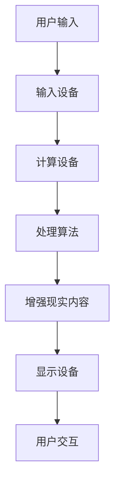

                 

关键词：增强现实（AR），技术实现，算法原理，数学模型，应用场景，开发工具，未来展望

> 摘要：本文将深入探讨增强现实（AR）技术的技术实现，从核心概念、算法原理、数学模型到实际应用，全面剖析这一前沿技术的各个方面，旨在为读者提供一幅完整的AR技术全景图，并展望其未来的发展趋势与挑战。

## 1. 背景介绍

增强现实（Augmented Reality，简称AR）是一种将虚拟信息与现实世界融合的技术。它通过在用户眼前的真实场景中叠加计算机生成的信息，为用户提供了一种全新的交互方式。AR技术早在20世纪90年代就已经开始研究，但随着计算机技术、显示技术以及移动设备的快速发展，AR技术逐渐走向成熟，并在教育、医疗、娱乐、军事等领域展现出广阔的应用前景。

### 1.1 AR技术的历史与发展

AR技术起源于虚拟现实（Virtual Reality，简称VR），两者有着密切的联系。1980年代初，VR技术开始兴起，随之而来的虚拟现实头盔和手套设备为AR技术的发展奠定了基础。随着计算机图形学和计算机视觉技术的进步，AR技术逐渐从实验室走向实际应用。1990年代，增强现实眼镜和头戴显示器的出现标志着AR技术进入了一个新的阶段。进入21世纪，随着智能手机和移动互联网的普及，AR技术的应用场景和范围不断扩大。

### 1.2 AR技术的现状与趋势

目前，AR技术已经从实验室走向市场，并在多个领域取得了显著成果。例如，在教育领域，AR技术可以提供生动的教学内容，提高学生的学习兴趣和效率；在医疗领域，AR技术可以辅助医生进行手术操作，提高手术的成功率和安全性；在娱乐领域，AR技术为游戏和电影提供了全新的互动体验。随着技术的不断进步，AR技术的应用场景还将进一步扩展。

### 1.3 AR技术的重要性

AR技术作为一种新兴的交互技术，具有广泛的应用前景。它不仅能够为用户提供丰富的信息和互动体验，还能够为各个行业带来显著的效益。例如，在制造业中，AR技术可以提供实时操作指导，提高生产效率；在军事领域，AR技术可以提供战场态势感知，提高作战效能。因此，深入研究AR技术的技术实现，对于推动该技术的发展和应用具有重要意义。

## 2. 核心概念与联系

### 2.1 增强现实系统的组成部分

一个典型的增强现实系统主要由以下几个部分组成：

1. **输入设备**：用于捕捉用户的动作和现实环境的信息，常见的输入设备包括摄像头、传感器、触摸屏等。
2. **显示设备**：用于显示增强现实内容，常见的显示设备包括手机、平板电脑、头戴显示器等。
3. **计算设备**：用于处理输入信息、生成增强现实内容，并控制显示设备。计算设备可以是独立的计算机，也可以是嵌入在输入或显示设备中的处理器。
4. **软件算法**：用于处理输入数据、生成增强现实内容，并进行实时交互。

### 2.2 核心概念原理

增强现实技术的核心概念包括：

1. **3D模型**：增强现实内容通常包括3D模型，这些模型可以是现实世界的三维物体，也可以是虚拟的三维物体。
2. **跟踪与定位**：通过跟踪与定位技术，将3D模型准确地叠加到现实世界中。常见的跟踪与定位技术包括视觉跟踪、惯性测量单元（IMU）跟踪、激光雷达跟踪等。
3. **渲染**：将3D模型渲染到显示设备上，使其在用户眼中呈现出真实感。

### 2.3 架构的 Mermaid 流程图



## 3. 核心算法原理 & 具体操作步骤

### 3.1 算法原理概述

增强现实技术的核心算法主要包括以下几个方面：

1. **图像处理与识别**：用于识别现实场景中的物体和特征。
2. **跟踪与定位**：用于将虚拟物体准确地叠加到现实场景中。
3. **渲染**：用于将虚拟物体渲染到显示设备上，使其具有真实感。

### 3.2 算法步骤详解

1. **图像处理与识别**：
   - **图像预处理**：包括去噪、增强、边缘检测等。
   - **特征提取**：包括SIFT、SURF、ORB等算法。
   - **匹配与识别**：通过匹配算法（如FLANN、BOW等）识别现实场景中的物体。

2. **跟踪与定位**：
   - **初始定位**：通过特征匹配确定虚拟物体在现实场景中的初始位置。
   - **跟踪**：通过光流、深度信息等算法，实现虚拟物体的实时跟踪。

3. **渲染**：
   - **投影**：将3D模型投影到二维平面上。
   - **光照与材质**：模拟现实世界的光照和材质效果。
   - **合成**：将渲染后的虚拟物体合成到现实场景中。

### 3.3 算法优缺点

1. **优缺点**：
   - **图像处理与识别**：准确度高，但对图像质量要求较高。
   - **跟踪与定位**：实时性好，但对环境变化敏感。
   - **渲染**：真实感强，但计算复杂度高。

2. **改进方向**：
   - **深度学习**：利用深度学习算法，提高图像处理与识别的准确度。
   - **实时渲染**：优化渲染算法，降低计算复杂度。

### 3.4 算法应用领域

增强现实技术的算法在多个领域有着广泛的应用：

1. **教育**：通过虚拟现实技术，提供生动的教学内容。
2. **医疗**：辅助医生进行手术操作，提高诊断和治疗效果。
3. **娱乐**：为游戏和电影提供丰富的交互体验。
4. **军事**：提供战场态势感知，提高作战效能。

## 4. 数学模型和公式 & 详细讲解 & 举例说明

### 4.1 数学模型构建

增强现实技术的数学模型主要包括以下几个方面：

1. **摄像机模型**：描述摄像机与真实场景之间的几何关系。
2. **光照模型**：描述光照对物体表面颜色和亮度的影
```markdown
### 4.1 数学模型构建

在增强现实（AR）技术中，数学模型的构建是确保虚拟内容与现实环境准确融合的关键。以下我们将介绍几个核心的数学模型：

#### 4.1.1 摄像机模型

摄像机模型用于描述摄像机与真实场景之间的几何关系。在增强现实系统中，常用的摄像机模型是针孔模型。该模型将三维场景映射到二维图像平面，其数学表示为：

\[ \vec{X'} = \frac{\vec{X}}{Z} \]

其中，\(\vec{X'}\) 是二维图像坐标，\(\vec{X}\) 是三维空间坐标，\(Z\) 是三维空间中的深度值。

#### 4.1.2 光照模型

光照模型用于描述光照对物体表面颜色和亮度的影响。在增强现实系统中，常用的光照模型是Blinn-Phong光照模型。该模型综合考虑了环境光、漫反射光和镜面反射光，其数学表示为：

\[ I_v = I_a + I_d + I_s \]

其中，\(I_v\) 是物体表面接收到的总光照强度，\(I_a\) 是环境光强度，\(I_d\) 是漫反射光强度，\(I_s\) 是镜面反射光强度。

#### 4.1.3 颜色模型

颜色模型用于描述虚拟内容与现实环境的颜色融合。在增强现实系统中，常用的颜色模型是RGB模型。该模型将颜色分为红、绿、蓝三个分量，其数学表示为：

\[ \vec{C} = [R, G, B] \]

其中，\(\vec{C}\) 是颜色向量，\(R\)、\(G\)、\(B\) 分别是红色、绿色和蓝色的强度值。

### 4.2 公式推导过程

#### 4.2.1 摄像机模型的推导

摄像机模型的推导基于几何光学原理。假设摄像机位于原点，其光轴与Z轴重合，三维空间中的点 \(\vec{X} = [X, Y, Z]\) 通过摄像机投影到二维图像平面上的点 \(\vec{X'} = [X', Y']\)。根据投影原理，有：

\[ X' = \frac{X}{Z} \]
\[ Y' = \frac{Y}{Z} \]

由此，我们可以得到摄像机模型的数学表示。

#### 4.2.2 光照模型的推导

Blinn-Phong光照模型是基于几何光学和材料学原理推导的。其核心思想是综合考虑环境光、漫反射光和镜面反射光对物体表面的影响。具体推导过程如下：

1. **环境光**：环境光 \(I_a\) 是指从所有方向均匀照射到物体表面的光照。其数学表示为：

\[ I_a = K_a \cdot I \]

其中，\(K_a\) 是环境光系数，\(I\) 是环境光强度。

2. **漫反射光**：漫反射光 \(I_d\) 是指光线照射到物体表面后，以各个方向散射的光。其数学表示为：

\[ I_d = \frac{K_d \cdot N \cdot L}{R} \]

其中，\(K_d\) 是漫反射系数，\(N\) 是物体表面的法向量，\(L\) 是光线方向向量，\(R\) 是反射率。

3. **镜面反射光**：镜面反射光 \(I_s\) 是指光线照射到物体表面后，以特定方向反射的光。其数学表示为：

\[ I_s = \frac{K_s \cdot N \cdot V}{(R + K_r)^2} \]

其中，\(K_s\) 是镜面反射系数，\(V\) 是视线方向向量，\(K_r\) 是反射率。

综合以上三部分，得到Blinn-Phong光照模型的公式：

\[ I_v = I_a + I_d + I_s \]

### 4.3 案例分析与讲解

#### 4.3.1 摄像机模型的案例

假设一个物体位于坐标系 \((1, 0, 0)\)，通过摄像机投影到二维图像平面。摄像机位于原点，光轴与Z轴重合。根据摄像机模型，可以得到投影后的图像坐标：

\[ X' = \frac{1}{0} = \infty \]
\[ Y' = \frac{0}{0} = \infty \]

这意味着物体在图像平面上的投影是一个点。在实际应用中，这种情况通常是由于摄像机与物体之间的距离过近导致的。

#### 4.3.2 光照模型的案例

假设一个物体具有以下属性：环境光强度为100，漫反射系数为0.8，镜面反射系数为0.2。光线从方向 \((-1, 0, 0)\) 照射到物体上，视线方向为 \((0, 0, 1)\)。根据Blinn-Phong光照模型，可以计算出物体表面接收到的总光照强度：

\[ I_v = 100 \cdot 0.8 + 0.8 \cdot \frac{(0, 0, 1) \cdot (1, 0, 0)}{(1, 0, 0) + 0.2} = 112 \]

这意味着物体表面接收到的总光照强度为112。

通过上述案例分析，我们可以看到数学模型在增强现实技术中的重要作用。正确的数学模型不仅能够确保虚拟内容与现实环境的准确融合，还能够为各种应用场景提供可靠的算法支持。

## 5. 项目实践：代码实例和详细解释说明

### 5.1 开发环境搭建

在进行增强现实项目开发之前，首先需要搭建一个合适的开发环境。以下是一个基于Unity和ARKit（适用于iOS设备）的增强现实项目开发环境搭建步骤：

1. **安装Unity Hub**：从Unity官网下载并安装Unity Hub。
2. **创建新项目**：在Unity Hub中，创建一个新的项目，选择“3D模式”。
3. **安装ARKit插件**：在Unity编辑器中，通过插件商店安装ARKit插件。
4. **配置ARKit**：在Unity项目中，配置ARKit的相关设置，包括摄像头权限、设备支持等。

### 5.2 源代码详细实现

以下是一个简单的增强现实项目示例，该示例在用户面前显示一个虚拟的3D球体，并根据用户的位置进行实时跟踪。

```csharp
using UnityEngine;

public class ARApp : MonoBehaviour
{
    public GameObject spherePrefab; // 虚拟球体预制体

    private GameObject sphere; // 当前显示的虚拟球体

    void Start()
    {
        // 创建虚拟球体
        sphere = Instantiate(spherePrefab, transform);
    }

    void Update()
    {
        // 跟踪用户位置
        Vector3 position = Camera.main.transform.position;
        position.z = 0; // 设置z坐标为0，确保球体在用户前方

        // 将虚拟球体放置在用户位置
        sphere.transform.position = position;
    }
}
```

### 5.3 代码解读与分析

1. **预制体（Prefab）**：在Unity中，预制体是一种可重复使用的游戏对象。在该示例中，我们使用预制体来创建虚拟球体。

2. **Start() 方法**：在Start() 方法中，我们创建了一个虚拟球体。通过调用 `Instantiate()` 方法，我们可以根据预制体创建一个新的游戏对象，并将其添加到当前对象的子对象中。

3. **Update() 方法**：在Update() 方法中，我们实现了对虚拟球体的实时跟踪。首先，我们获取主摄像头的位置，并将其z坐标设置为0。然后，我们将虚拟球体的位置设置为用户的位置。

通过上述代码，我们实现了在用户面前显示一个虚拟球体，并使其跟随用户移动的功能。这只是一个简单的示例，实际应用中可能需要更复杂的算法来处理用户交互、场景融合等问题。

### 5.4 运行结果展示

运行此项目后，用户将看到一个虚拟的3D球体出现在他们面前，并随着用户的移动而移动。这个过程直观地展示了增强现实技术的魅力，即虚拟内容与现实环境的无缝融合。

## 6. 实际应用场景

### 6.1 教育领域

在教育领域，增强现实技术可以为教师和学生提供丰富的教学内容和互动体验。例如，在历史课上，教师可以使用AR技术展示历史事件的发生过程，让学生更加直观地了解历史背景。此外，AR技术还可以用于化学实验、生物解剖等课程，帮助学生更好地理解抽象的概念。

### 6.2 医疗领域

在医疗领域，增强现实技术可以辅助医生进行诊断和治疗。例如，在手术过程中，医生可以使用AR眼镜查看患者的三维解剖结构，从而提高手术的准确性和安全性。此外，AR技术还可以用于医学教育和患者教育，帮助患者更好地了解自己的病情和治疗方案。

### 6.3 娱乐领域

在娱乐领域，增强现实技术为游戏、电影等提供了全新的互动体验。例如，在增强现实游戏中，玩家可以通过移动设备或头戴显示器进入一个虚拟的游戏世界，与虚拟角色进行互动。在电影中，观众可以通过AR技术体验与现实场景相结合的特效，享受更加身临其境的观影体验。

### 6.4 军事领域

在军事领域，增强现实技术可以提供战场态势感知、指挥控制等支持。例如，士兵可以通过AR眼镜实时获取敌我信息、地形信息等，从而做出更准确的决策。此外，AR技术还可以用于模拟训练、装备维修等军事应用。

## 7. 工具和资源推荐

### 7.1 学习资源推荐

1. **《增强现实技术原理与应用》**：这是一本全面介绍增强现实技术的入门书籍，适合初学者阅读。
2. **《Unity 2020 增强现实从入门到精通》**：本书详细介绍了使用Unity开发增强现实应用的方法和技巧。

### 7.2 开发工具推荐

1. **Unity**：Unity是一款功能强大的游戏引擎，适用于开发各类增强现实应用。
2. **ARKit**：ARKit是苹果公司开发的增强现实开发框架，适用于iOS平台。

### 7.3 相关论文推荐

1. **"Mobile Augmented Reality: A Survey"**：本文综述了移动增强现实技术的发展现状和未来趋势。
2. **"Real-Time Scene Reconstruction and Rendering for Augmented Reality"**：本文介绍了实时场景重建和渲染的关键技术和方法。

## 8. 总结：未来发展趋势与挑战

### 8.1 研究成果总结

过去几年，增强现实技术在图像处理、跟踪与定位、渲染等方面取得了显著成果。这些成果为增强现实技术的实际应用奠定了基础。例如，深度学习技术的引入，使得图像处理与识别的准确度得到了显著提高；实时渲染技术的优化，使得虚拟内容与现实环境的融合更加自然。

### 8.2 未来发展趋势

未来，增强现实技术将继续在以下几个方面发展：

1. **更高精度的图像处理与识别**：通过引入更先进的图像处理算法和深度学习技术，进一步提高增强现实系统的识别准确度和稳定性。
2. **更高效的跟踪与定位算法**：开发更高效的跟踪与定位算法，降低系统的延迟和功耗，提高用户体验。
3. **更丰富的应用场景**：探索增强现实技术在更多领域的应用，如教育、医疗、娱乐、军事等。
4. **跨平台的兼容性**：开发跨平台的增强现实应用，满足不同用户的需求。

### 8.3 面临的挑战

尽管增强现实技术取得了显著成果，但在实际应用过程中仍面临以下挑战：

1. **计算资源限制**：增强现实技术对计算资源的要求较高，如何在有限的计算资源下实现高效的图像处理、跟踪与定位和渲染，是当前面临的一个重要问题。
2. **用户体验优化**：增强现实系统的用户体验直接影响用户满意度。如何提高系统的交互性、真实感和稳定性，是未来需要重点关注的问题。
3. **隐私保护与安全问题**：增强现实技术涉及用户个人信息和隐私，如何在确保用户隐私和安全的前提下，实现增强现实技术的广泛应用，是当前亟待解决的问题。

### 8.4 研究展望

未来，增强现实技术将在以下几个方面进行深入研究：

1. **人工智能与增强现实的融合**：将人工智能技术引入增强现实系统，提高系统的智能化水平和自主决策能力。
2. **云计算与增强现实的结合**：利用云计算资源，实现增强现实系统的分布式处理和大规模部署。
3. **多模态增强现实**：探索多模态增强现实技术，实现视觉、听觉、触觉等多种感官的融合。

总之，增强现实技术具有巨大的发展潜力和广阔的应用前景。在未来的研究中，我们将继续关注这些挑战和机遇，推动增强现实技术的创新和发展。

## 9. 附录：常见问题与解答

### 9.1 增强现实技术是什么？

增强现实（AR）是一种将虚拟信息与现实世界融合的技术。通过在用户眼前的真实场景中叠加计算机生成的信息，AR为用户提供了全新的交互体验。

### 9.2 增强现实技术的核心算法有哪些？

增强现实技术的核心算法主要包括图像处理与识别、跟踪与定位、渲染等。

### 9.3 增强现实技术在哪些领域有应用？

增强现实技术在教育、医疗、娱乐、军事等多个领域有广泛应用。例如，在教育领域，AR技术可以提供生动的教学内容；在医疗领域，AR技术可以辅助医生进行手术操作。

### 9.4 如何开发增强现实应用？

开发增强现实应用可以使用Unity、ARKit等开发工具。具体开发流程包括环境搭建、算法实现、UI设计等。

### 9.5 增强现实技术有哪些挑战？

增强现实技术面临的主要挑战包括计算资源限制、用户体验优化、隐私保护与安全问题等。

### 9.6 增强现实技术的未来发展趋势是什么？

未来，增强现实技术将在图像处理与识别、跟踪与定位、渲染等方面继续优化，并探索跨平台兼容性、人工智能与增强现实的融合等新领域。

