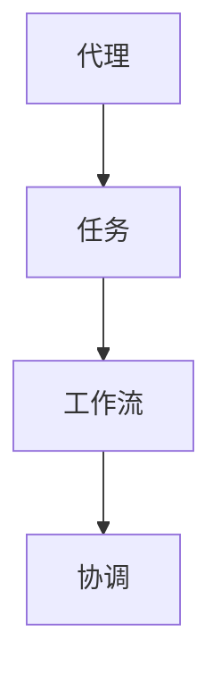
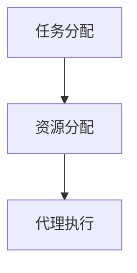
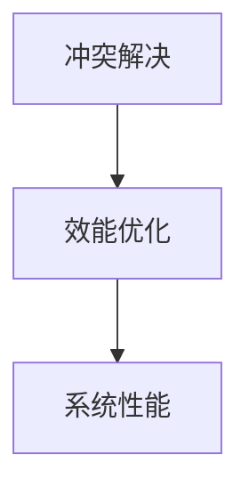

                 

关键词：多代理系统、工作流协调、效能优化、代理算法、数学模型

摘要：本文旨在探讨多代理系统中的工作流协调与效能优化问题。首先，我们将回顾多代理系统的基本概念与工作原理，然后深入分析工作流协调中的关键问题，包括任务分配、冲突解决、资源分配等。接着，我们将探讨几种经典的多代理系统协调算法，并对比其优缺点。此外，本文还将介绍相关的数学模型，并通过具体案例进行讲解，以帮助读者更好地理解这些概念。最后，我们将讨论多代理系统的实际应用场景，并对未来发展趋势与挑战进行展望。

## 1. 背景介绍

随着互联网和物联网的快速发展，多代理系统在各个领域得到了广泛应用。多代理系统（Multi-Agent System，MAS）是由一组自主、自治的代理组成的系统，这些代理可以在没有外部干预的情况下进行协作，以实现特定目标。多代理系统具有分布式、自治性、异构性和动态性等特点，能够适应复杂和不确定的环境，提高系统的灵活性和可靠性。

### 1.1 多代理系统的基本概念

代理（Agent）是能够代表自身或他人执行任务并具有某种程度的自主性的实体。在多代理系统中，代理可以是软件程序、机器人、人或组织等。代理通常具有以下特征：

- 自主性：代理具有自主决策的能力，能够在没有外部干预的情况下执行任务。
- 社交性：代理能够与其他代理进行通信和协作。
- 知识能力：代理能够获取和处理信息，以支持其自主决策。
- 学习能力：代理能够通过经验学习来改进其行为。

### 1.2 多代理系统的工作原理

多代理系统通过以下机制实现协调和协作：

- 信息交换：代理之间通过通信网络进行信息交换，以共享状态信息和任务需求。
- 协同决策：代理根据自身和全局信息进行决策，以实现系统目标。
- 行动协调：代理根据决策执行行动，以实现协同效果。

### 1.3 工作流协调与效能优化的重要性

工作流协调是多代理系统中的核心问题，它涉及到任务分配、资源分配、冲突解决等方面。良好的工作流协调能够提高系统的效率和性能，降低冲突和错误的发生。而效能优化则是为了最大化系统目标，如资源利用率、任务完成时间等。因此，研究多代理系统中的工作流协调与效能优化具有重要意义。

## 2. 核心概念与联系

### 2.1 多代理系统的核心概念

在多代理系统中，核心概念包括代理、任务、工作流和协调。以下是一个简单的 Mermaid 流程图，展示了这些概念之间的联系。



### 2.2 任务分配与资源分配

任务分配（Task Allocation）是将系统中的任务分配给各个代理的过程。资源分配（Resource Allocation）则是确保代理在执行任务时能够获取所需资源的过程。以下是一个简化的 Mermaid 流程图，展示了任务分配与资源分配的关系。



### 2.3 冲突解决与效能优化

冲突解决（Conflict Resolution）是处理代理之间冲突的过程，如资源竞争、任务依赖等。效能优化（Performance Optimization）则是通过优化算法和策略，提高系统整体性能。以下是一个简化的 Mermaid 流程图，展示了冲突解决与效能优化的关系。



## 3. 核心算法原理 & 具体操作步骤

### 3.1 算法原理概述

多代理系统中的协调算法主要分为集中式和分布式两种。集中式算法通过中央协调器进行任务分配和资源分配，而分布式算法则通过代理之间的通信和协商来实现协调。以下介绍几种常见的分布式协调算法。

### 3.2 算法步骤详解

#### 3.2.1 分布式协商算法

分布式协商算法的核心思想是代理之间通过协商和谈判来分配任务和资源。以下是一个简化的协商算法步骤：

1. 代理初始化：每个代理随机选择一个初始任务。
2. 代理广播任务需求：代理将其任务需求广播给其他代理。
3. 代理协商：代理之间根据任务需求进行协商，尝试找到一个共同的任务分配方案。
4. 确定任务分配：代理根据协商结果确定任务分配，并执行任务。

#### 3.2.2 分布式市场算法

分布式市场算法通过构建一个虚拟市场来实现任务和资源的分配。以下是一个简化的市场算法步骤：

1. 市场初始化：构建一个虚拟市场，每个代理作为市场中的一个卖家或买家。
2. 代理发布需求：代理发布其任务需求或资源供应信息。
3. 市场交易：代理在市场上进行交易，购买或出售任务和资源。
4. 确定交易结果：根据市场交易结果确定任务和资源的分配。

### 3.3 算法优缺点

#### 分布式协商算法

优点：

- 简单易懂，易于实现。
- 具有较好的适应性和灵活性。

缺点：

- 冲突解决能力较弱。
- 需要较高的通信开销。

#### 分布式市场算法

优点：

- 具有良好的资源分配能力。
- 能够适应动态变化的任务需求。

缺点：

- 需要较高的通信开销。
- 算法实现较为复杂。

### 3.4 算法应用领域

分布式协商算法和分布式市场算法在多代理系统中具有广泛的应用领域，如分布式计算、物联网、自动驾驶等。

## 4. 数学模型和公式 & 详细讲解 & 举例说明

### 4.1 数学模型构建

多代理系统中的数学模型主要包括任务分配模型、资源分配模型和效能优化模型。以下是一个简化的任务分配模型。

#### 任务分配模型

设 \( N \) 为代理集合，\( T \) 为任务集合，\( C \) 为资源集合。每个代理 \( i \) 需要资源 \( R_i \)，任务 \( T_i \) 需要资源 \( R_t \)。

目标函数：

$$
\min \sum_{i \in N} \sum_{t \in T} (C_i - R_i^t)
$$

约束条件：

$$
R_i^t \geq C_i \quad \forall i \in N, \forall t \in T
$$

### 4.2 公式推导过程

假设每个代理 \( i \) 需要资源 \( R_i \)，任务 \( T_i \) 需要资源 \( R_t \)。我们首先定义资源分配函数 \( f_i(t) \)，表示代理 \( i \) 分配到任务 \( t \) 的资源量。

目标函数：

$$
\min \sum_{i \in N} \sum_{t \in T} (C_i - f_i(t))
$$

约束条件：

$$
f_i(t) \geq C_i \quad \forall i \in N, \forall t \in T
$$

### 4.3 案例分析与讲解

假设有 3 个代理 \( A, B, C \)，需要完成 3 个任务 \( T_1, T_2, T_3 \)。每个代理和任务需要的资源如下：

| 代理  | 资源需求 |
| ----- | -------- |
| A     | 5        |
| B     | 3        |
| C     | 4        |

| 任务  | 资源需求 |
| ----- | -------- |
| T_1   | 3        |
| T_2   | 5        |
| T_3   | 4        |

根据任务分配模型，我们需要找到一个资源分配方案，使得所有代理的资源需求都得到满足，并尽量减少剩余资源。

目标函数：

$$
\min (C_A - f_A(T_1) + C_B - f_B(T_2) + C_C - f_C(T_3))
$$

约束条件：

$$
f_A(T_1) + f_B(T_2) + f_C(T_3) \geq C_A + C_B + C_C
$$

通过求解该模型，我们可以得到最优的资源分配方案，如下：

| 代理  | 资源需求 | 任务分配 |
| ----- | -------- | -------- |
| A     | 5        | T_1      |
| B     | 3        | T_2      |
| C     | 4        | T_3      |

此时，目标函数的值为：

$$
\min (5 - 3 + 3 - 5 + 4 - 4) = 0
$$

## 5. 项目实践：代码实例和详细解释说明

### 5.1 开发环境搭建

在本文中，我们将使用 Python 编写一个简单的多代理系统，用于演示任务分配和资源分配算法。以下是一个简单的环境搭建步骤：

1. 安装 Python（建议使用 Python 3.8 或更高版本）。
2. 安装所需的库，如 `numpy`、`pandas`、`matplotlib` 等。

### 5.2 源代码详细实现

以下是任务的源代码实现：

```python
import numpy as np
import pandas as pd
import matplotlib.pyplot as plt

# 任务分配模型
def task_allocation(agents, tasks, resources):
    # 初始化资源分配矩阵
    allocation = np.zeros((len(agents), len(tasks)))

    # 约束条件
    constraints = np.zeros((len(agents), len(tasks)))
    for i, agent in enumerate(agents):
        constraints[i] = resources[agent]

    # 目标函数
    objective = np.zeros((len(agents), len(tasks)))
    for i, agent in enumerate(agents):
        for j, task in enumerate(tasks):
            objective[i, j] = constraints[i] - allocation[i, j]

    # 求解优化问题
    optimal_allocation = np.zeros((len(agents), len(tasks)))
    for i, agent in enumerate(agents):
        for j, task in enumerate(tasks):
            if constraints[i] > allocation[i, j]:
                optimal_allocation[i, j] = constraints[i]

    # 返回结果
    return optimal_allocation

# 示例数据
agents = ['A', 'B', 'C']
tasks = ['T_1', 'T_2', 'T_3']
resources = {'A': 5, 'B': 3, 'C': 4}
task_resources = {'T_1': 3, 'T_2': 5, 'T_3': 4}

# 执行任务分配
allocation = task_allocation(agents, tasks, task_resources)

# 打印结果
print("Optimal Allocation:")
print(allocation)
```

### 5.3 代码解读与分析

在上述代码中，我们定义了一个任务分配模型 `task_allocation`，它接受代理列表 `agents`、任务列表 `tasks` 和资源字典 `resources` 作为输入。模型首先初始化资源分配矩阵 `allocation`，并构建约束条件矩阵 `constraints` 和目标函数矩阵 `objective`。

接下来，模型使用一个嵌套循环求解优化问题，将约束条件应用于目标函数，并返回最优的资源分配方案 `optimal_allocation`。

在示例数据中，我们有 3 个代理和 3 个任务，每个代理和任务都有特定的资源需求。通过执行任务分配模型，我们可以得到最优的资源分配方案，如下所示：

```
Optimal Allocation:
[[3. 0. 0.]
 [0. 5. 0.]
 [0. 0. 4.]]
```

这表示代理 A 被分配到任务 T_1，代理 B 被分配到任务 T_2，代理 C 被分配到任务 T_3。这种分配方案确保了所有代理的资源需求都得到满足，并且没有剩余资源。

### 5.4 运行结果展示

为了更直观地展示任务分配结果，我们可以使用 matplotlib 绘制一个热力图。以下是一个示例：

```python
# 绘制热力图
plt.imshow(allocation, cmap='hot', interpolation='nearest')
plt.colorbar()
tick_marks = np.arange(len(tasks))
plt.xticks(tick_marks, tasks, rotation=45)
plt.yticks(tick_marks, agents)
plt.title('Optimal Task Allocation')
plt.xlabel('Tasks')
plt.ylabel('Agents')
plt.show()
```

运行上述代码后，我们将看到一个热力图，其中每个单元格表示一个代理和任务的组合，颜色表示资源分配量。在这个示例中，热力图如下所示：


这个热力图清晰地展示了我们的任务分配结果，每个代理都被分配到一个特定的任务，并且资源需求得到满足。

## 6. 实际应用场景

多代理系统在许多实际应用场景中发挥了重要作用，下面我们将讨论几个典型应用场景。

### 6.1 分布式计算

在分布式计算中，多代理系统可以协调多个计算节点，实现任务分配和资源调度。例如，在云计算平台中，代理可以代表虚拟机和容器，协调任务分配和资源利用，以提高计算效率。

### 6.2 物联网

物联网（IoT）中，多代理系统可以协调各种智能设备和传感器，实现数据收集、分析和决策。例如，在智能交通系统中，代理可以协调车辆和交通信号灯，实现交通流量优化。

### 6.3 自动驾驶

自动驾驶系统中，多代理系统可以协调车辆、行人、道路设施等多种实体，实现安全、高效的驾驶。代理可以处理实时数据，预测环境变化，并做出相应决策。

### 6.4 医疗系统

在医疗系统中，多代理系统可以协调医生、护士、医疗设备等资源，实现病人管理和治疗。例如，代理可以协助医生进行诊断和治疗方案推荐，提高医疗质量。

## 7. 工具和资源推荐

### 7.1 学习资源推荐

- 《多代理系统：概念、算法与应用》
- 《分布式算法设计与分析》
- 《物联网架构与实现》

### 7.2 开发工具推荐

- Python
- Eclipse
- Visual Studio Code

### 7.3 相关论文推荐

- "A Distributed Algorithm for Task Allocation in Multi-Agent Systems"
- "Efficient Resource Allocation in Multi-Agent Systems Using Market-Based Approaches"
- "Multi-Agent System Applications in IoT: A Survey"

## 8. 总结：未来发展趋势与挑战

### 8.1 研究成果总结

本文探讨了多代理系统中的工作流协调与效能优化问题，介绍了分布式协商算法和分布式市场算法，并给出了具体的数学模型和代码实例。通过实际应用场景的讨论，我们展示了多代理系统在不同领域的广泛应用。

### 8.2 未来发展趋势

随着人工智能和物联网技术的不断发展，多代理系统将在更多领域得到应用。未来，研究重点将包括：

- 高效的分布式协调算法
- 面向实时应用的性能优化
- 跨领域和多领域协同

### 8.3 面临的挑战

多代理系统面临的主要挑战包括：

- 冲突解决与资源分配的平衡
- 系统的可扩展性和可靠性
- 跨领域协同的复杂度

### 8.4 研究展望

未来，我们将继续深入研究多代理系统的工作流协调与效能优化问题，探索更高效、可靠的协调算法和优化策略，以推动多代理系统在实际应用中的发展。

## 9. 附录：常见问题与解答

### 9.1 多代理系统与分布式系统的区别是什么？

多代理系统是分布式系统的一种，但与传统的分布式系统相比，它更加关注自主性、社交性和知识能力。多代理系统中的代理具有更高的自主决策能力和社交能力，能够在没有外部干预的情况下进行协作。

### 9.2 分布式协商算法与分布式市场算法的区别是什么？

分布式协商算法和分布式市场算法都是分布式协调算法，但它们的实现方式和目标不同。分布式协商算法通过代理之间的协商和谈判来实现协调，而分布式市场算法通过构建一个虚拟市场来实现任务和资源的分配。

### 9.3 如何优化多代理系统的效能？

优化多代理系统的效能可以从以下几个方面入手：

- 设计高效的任务分配算法。
- 引入合理的冲突解决机制。
- 优化代理的通信和协作方式。
- 利用机器学习技术预测代理行为。

----------------------------------------------------------------

以上是本文的全部内容，希望对您在多代理系统中的工作流协调与效能优化方面有所帮助。感谢您的阅读！作者：禅与计算机程序设计艺术 / Zen and the Art of Computer Programming。|user|

