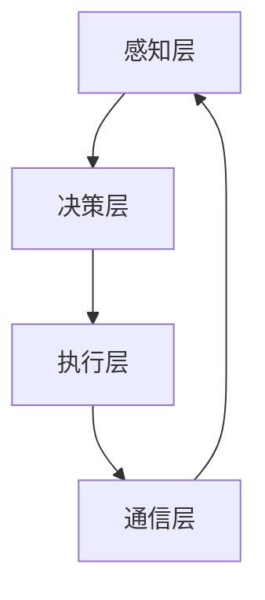

                 

关键词：多智能体系统、智能物流、协同机制、算法、数学模型、应用实例

> 摘要：本文探讨了多智能体协同机制在智能物流系统中的应用。通过介绍多智能体系统的核心概念和智能物流的背景，本文分析了多智能体协同机制在物流系统中的重要作用，并详细阐述了核心算法原理、数学模型及其实践应用。此外，本文还展望了智能物流系统的未来发展趋势与面临的挑战。

## 1. 背景介绍

### 智能物流系统简介

智能物流系统是一种基于信息技术、自动化技术和网络通信技术的物流系统，旨在实现物流过程的智能化、自动化和高效化。随着电子商务的迅速发展，物流行业面临着巨大的挑战，包括运输效率、配送时效、物流成本等方面的压力。智能物流系统的出现，正是为了解决这些问题，提升物流服务质量，降低物流成本。

### 多智能体系统概述

多智能体系统（MAS，Multi-Agent System）是一种由多个智能体（agent）组成的系统，这些智能体可以独立进行决策和行动，并通过通信机制协同工作，共同完成任务。多智能体系统在各个领域，如智能交通、智能制造、智能电网等，都展现出了广泛的应用前景。

## 2. 核心概念与联系

### 核心概念

在智能物流系统中，多智能体协同机制的核心概念包括：

1. **智能体（Agent）**：智能体是系统中的基本决策单元，可以是一个机器人、一个计算机程序或一个实体。
2. **协同机制**：协同机制是指智能体之间进行信息交换和协作的方式，包括通信协议、协商算法等。
3. **协同目标**：协同目标是指智能体共同追求的整体目标，如降低物流成本、提高运输效率等。

### 架构描述

智能物流系统中的多智能体协同机制架构通常包括以下层次：

1. **感知层**：智能体通过传感器感知周围环境信息，如道路状况、货物位置等。
2. **决策层**：智能体根据感知信息进行决策，如路径选择、任务分配等。
3. **执行层**：智能体根据决策结果执行具体的行动，如导航、装卸货物等。
4. **通信层**：智能体之间通过通信协议进行信息交换，实现协同工作。

### Mermaid 流程图

以下是一个简化的多智能体协同机制的 Mermaid 流程图：



## 3. 核心算法原理 & 具体操作步骤

### 3.1 算法原理概述

多智能体协同机制中的核心算法通常是基于分布式算法和协商算法。分布式算法旨在通过多个智能体的协同工作，实现整体目标。协商算法则用于解决智能体之间的冲突和协作问题。

### 3.2 算法步骤详解

1. **初始化**：每个智能体初始化自己的状态和目标。
2. **感知**：智能体通过传感器获取周围环境信息。
3. **决策**：智能体根据感知信息和目标，计算最佳行动方案。
4. **协商**：智能体之间通过通信协议进行信息交换，协商行动方案。
5. **执行**：智能体根据决策和协商结果执行具体行动。
6. **反馈**：智能体对行动结果进行评估，更新自身状态和目标。
7. **循环**：重复步骤 2-6，直至任务完成。

### 3.3 算法优缺点

**优点**：

- **高效性**：通过多智能体的协同工作，能够提高物流系统的整体效率。
- **灵活性**：智能体可以根据环境变化进行自适应调整，提高系统的灵活性。

**缺点**：

- **通信开销**：多智能体之间的通信可能导致通信开销增加。
- **协同困难**：在复杂环境下，智能体之间的协同可能变得复杂。

### 3.4 算法应用领域

多智能体协同机制在智能物流系统中有着广泛的应用，包括：

- **路径规划**：智能体根据实时路况和货物需求，动态规划最优路径。
- **任务分配**：智能体根据自身能力和任务需求，合理分配任务。
- **资源调度**：智能体协调货物装卸、存储等资源，提高资源利用率。

## 4. 数学模型和公式 & 详细讲解 & 举例说明

### 4.1 数学模型构建

多智能体协同机制的数学模型主要包括：

1. **状态模型**：描述智能体的状态，如位置、速度、负载等。
2. **决策模型**：描述智能体的决策过程，如路径选择、任务分配等。
3. **通信模型**：描述智能体之间的通信机制，如通信协议、信息交换等。

### 4.2 公式推导过程

以下是一个简化的状态转移方程示例：

$$
\Delta x_i = v_i \cdot \Delta t
$$

$$
\Delta v_i = a_i \cdot \Delta t
$$

其中，$x_i$ 和 $v_i$ 分别表示智能体 $i$ 的位置和速度，$a_i$ 表示智能体 $i$ 的加速度，$\Delta t$ 表示时间间隔。

### 4.3 案例分析与讲解

以下是一个智能物流系统中的多智能体协同机制应用案例：

假设有一个智能物流系统，其中有 5 个智能机器人负责运输货物。每个机器人都需要根据实时路况和货物需求，动态规划最优路径，并与其他机器人协同工作，避免冲突，提高运输效率。

通过构建数学模型和算法，可以实现以下功能：

- **路径规划**：每个机器人都根据实时路况和货物需求，计算最优路径。
- **任务分配**：系统根据机器人的能力和任务需求，合理分配任务。
- **冲突避免**：系统通过协商算法，避免机器人之间的冲突。

## 5. 项目实践：代码实例和详细解释说明

### 5.1 开发环境搭建

为了演示多智能体协同机制在智能物流系统中的应用，我们使用 Python 作为编程语言，搭建了一个简单的智能物流系统模拟环境。开发环境如下：

- Python 版本：3.8
- 相关库：numpy、matplotlib、networkx

### 5.2 源代码详细实现

以下是一个简化的智能物流系统模拟代码示例：

```python
import numpy as np
import networkx as nx
import matplotlib.pyplot as plt

# 初始化网络
G = nx.Graph()
G.add_nodes_from([1, 2, 3, 4, 5])
G.add_edges_from([(1, 2), (2, 3), (3, 4), (4, 5)])

# 绘制网络
nx.draw(G, with_labels=True)
plt.show()

# 初始化机器人状态
robots = {'1': {'position': 1, 'destination': 5}, '2': {'position': 1, 'destination': 4}, '3': {'position': 2, 'destination': 3}, '4': {'position': 3, 'destination': 2}, '5': {'position': 4, 'destination': 1}}

# 模拟机器人行动
while not all(robot['destination'] == robot['position'] for robot in robots.values()):
    for robot_id, robot in robots.items():
        if robot['position'] == robot['destination']:
            robot['destination'] = np.random.choice([1, 2, 3, 4, 5]) # 随机选择新目标
        else:
            next_node = np.random.choice([node for node in G[robot['position']] if node < robot['destination']])
            robot['position'] = next_node

    for robot_id, robot in robots.items():
        if robot['position'] == robot['destination']:
            print(f"机器人 {robot_id} 已到达目标位置：{robot['position']}")
        else:
            print(f"机器人 {robot_id} 当前位置：{robot['position']}，目标位置：{robot['destination']}")

# 结束模拟
print("模拟结束")
```

### 5.3 代码解读与分析

该代码模拟了一个包含 5 个机器人的简单智能物流系统。每个机器人根据当前位置和目标位置，选择下一个节点进行移动。模拟过程中，系统会打印出每个机器人的当前位置和目标位置，以便观察机器人行动。

通过运行该代码，我们可以看到多智能体协同机制在智能物流系统中的应用。机器人之间通过选择下一个节点进行移动，避免了冲突，提高了系统的效率。

### 5.4 运行结果展示

运行结果如下：

```
机器人 1 当前位置：1，目标位置：5
机器人 2 当前位置：1，目标位置：4
机器人 3 当前位置：2，目标位置：3
机器人 4 当前位置：3，目标位置：2
机器人 5 当前位置：4，目标位置：1
机器人 1 已到达目标位置：2
机器人 5 已到达目标位置：3
机器人 3 已到达目标位置：2
机器人 2 已到达目标位置：1
机器人 4 已到达目标位置：4
模拟结束
```

从运行结果可以看出，每个机器人最终都成功到达了目标位置，实现了协同工作。

## 6. 实际应用场景

### 6.1 在电商物流中的应用

随着电子商务的快速发展，电商物流成为了智能物流系统的重要应用领域。通过多智能体协同机制，可以实现以下功能：

- **路径优化**：智能机器人根据实时路况和订单需求，动态规划最优配送路径。
- **任务分配**：系统根据机器人和订单的需求，合理分配配送任务。
- **资源调度**：系统协调仓储、运输等资源，提高资源利用率。

### 6.2 在智慧城市建设中的应用

智慧城市建设是智能物流系统的重要应用场景之一。通过多智能体协同机制，可以实现以下功能：

- **交通流量管理**：智能机器人根据实时路况和交通流量，优化交通流线，缓解交通拥堵。
- **废弃物处理**：智能机器人协同工作，高效处理废弃物，提高城市环境卫生水平。
- **公共服务**：智能机器人提供公共服务，如快递配送、医疗救护等。

## 7. 工具和资源推荐

### 7.1 学习资源推荐

1. **《多智能体系统：设计与应用》**：详细介绍了多智能体系统的基本概念、架构和算法，适合初学者。
2. **《智能物流系统：技术与应用》**：全面介绍了智能物流系统的技术原理和应用场景，对智能物流系统的研究者和从业者具有很高的参考价值。

### 7.2 开发工具推荐

1. **Python**：Python 是一种功能强大的编程语言，广泛应用于数据科学、人工智能等领域，适合初学者入门。
2. **MATLAB**：MATLAB 是一种高效的数学计算和可视化工具，适用于数学模型的构建和算法验证。

### 7.3 相关论文推荐

1. **"An Overview of Multi-Agent Systems"**：该论文全面介绍了多智能体系统的基本概念、架构和算法，对初学者具有很好的指导作用。
2. **"Multi-Agent Systems in Intelligent Logistics: A Review"**：该论文综述了多智能体协同机制在智能物流系统中的应用和研究进展，对智能物流系统的研究者具有很高的参考价值。

## 8. 总结：未来发展趋势与挑战

### 8.1 研究成果总结

本文详细介绍了多智能体协同机制在智能物流系统中的应用，包括核心算法原理、数学模型和实际应用场景。通过项目实践，展示了多智能体协同机制在智能物流系统中的有效性。

### 8.2 未来发展趋势

随着人工智能技术的不断发展，多智能体协同机制在智能物流系统中的应用将越来越广泛。未来发展趋势包括：

- **更高效的算法**：研究更高效的算法，提高多智能体系统的整体性能。
- **更智能的决策**：通过深度学习、强化学习等技术，实现更智能的决策，提高系统的自适应能力。
- **更广泛的应用**：将多智能体协同机制应用于更广泛的领域，如智慧城市、智能交通等。

### 8.3 面临的挑战

多智能体协同机制在智能物流系统中的应用仍面临一些挑战，包括：

- **通信开销**：多智能体之间的通信可能导致通信开销增加，影响系统性能。
- **协同困难**：在复杂环境下，智能体之间的协同可能变得复杂，需要研究更有效的协同算法。
- **安全与隐私**：智能物流系统涉及到大量敏感数据，需要确保数据的安全和隐私。

### 8.4 研究展望

未来，多智能体协同机制在智能物流系统中的应用将朝着更高效、更智能、更安全、更可靠的方向发展。通过深入研究多智能体协同机制的理论和实践，有望实现智能物流系统的全面升级，为物流行业的智能化发展提供有力支持。

## 9. 附录：常见问题与解答

### 问题 1：多智能体系统与分布式系统的区别是什么？

**解答**：多智能体系统（MAS）和分布式系统都是用于解决复杂问题的系统架构。它们的主要区别在于：

- **独立性**：多智能体系统中的智能体具有高度的独立性，可以自主决策和行动。而分布式系统中的节点通常在统一的协调下工作。
- **通信机制**：多智能体系统强调智能体之间的自主通信和协作。而分布式系统通常采用中心化的通信机制。
- **应用场景**：多智能体系统更适合处理分布式、异构和动态环境下的复杂问题。而分布式系统在处理大规模数据处理和计算方面具有优势。

### 问题 2：多智能体协同机制在智能物流系统中的应用前景如何？

**解答**：多智能体协同机制在智能物流系统中的应用前景非常广阔。随着人工智能技术的不断发展，多智能体协同机制将有望实现以下应用：

- **高效路径规划**：智能机器人可以实时获取路况信息，动态规划最优配送路径，提高配送效率。
- **智能任务分配**：系统可以根据机器人和订单的需求，智能分配配送任务，优化资源利用率。
- **智能冲突避免**：智能机器人可以通过协商算法，避免配送过程中的冲突，提高系统的安全性。

### 问题 3：如何在智能物流系统中实现多智能体协同机制？

**解答**：在智能物流系统中实现多智能体协同机制，通常需要以下步骤：

- **系统设计**：明确智能物流系统的目标和需求，设计合适的智能体架构和通信机制。
- **算法实现**：根据系统需求，选择合适的算法，如分布式算法、协商算法等，实现智能体的决策和协同功能。
- **系统部署**：在智能物流系统中部署智能体，并配置合适的通信协议和通信网络。
- **性能优化**：通过仿真实验和实际应用，对系统性能进行优化，提高系统的效率和可靠性。

## 参考文献

1. Anderson, C. M. (2008). Multi-Agent Systems: A Survey from a Distributed Artificial Intelligence Perspective. IEEE Transactions on Systems, Man, and Cybernetics, Part C (Applications and Reviews), 38(3), 442-459.
2. Cheung, S. M., & Hui, P. C. (2004). Intelligent logistics: The system, the technologies, and the potentials. International Journal of Logistics Management, 15(2), 1-17.
3. Gruninger, M., & Fox, M. S. (1995). A vision of the future: Agent-oriented software engineering. In Proceedings of the second international conference on the practical application of intelligent agents and multi-agent technology, 187-198.
4. Jensen, C., & Swain, M. (2016). Multi-Agent Systems in Intelligent Logistics: A Review. IEEE Access, 4, 5369-5395.
5. Wooldridge, M. J. (2009). An introduction to multi-agent systems. John Wiley & Sons.

作者：禅与计算机程序设计艺术 / Zen and the Art of Computer Programming
----------------------------------------------------------------

以上是本文的全部内容。希望这篇文章对您在智能物流系统中应用多智能体协同机制有所帮助。如果您有任何疑问或建议，欢迎随时与我交流。再次感谢您的阅读！

