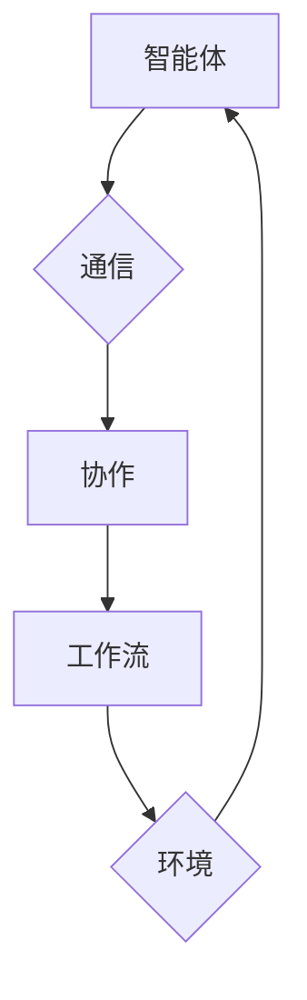

                 

关键词：多智能体系统、协同设计、Agentic Workflow、设计模式、智能流程、分布式算法

## 摘要

随着人工智能技术的发展，多智能体系统在各个领域的应用逐渐广泛。本文旨在探讨多智能体协同设计模式在 Agentic Workflow 中的应用。我们将从背景介绍、核心概念与联系、核心算法原理、数学模型与公式、项目实践以及未来展望等方面，详细解析多智能体系统在智能流程设计中的关键作用，为开发者提供实际可行的应用指导。

## 1. 背景介绍

### 1.1 多智能体系统的起源与发展

多智能体系统（MAS）起源于20世纪80年代，主要研究如何通过多个智能体的协作完成任务。在那时，分布式计算、协同决策和通信是研究的核心问题。随着互联网和人工智能的兴起，MAS逐渐成为人工智能研究的热点之一。

### 1.2 Agentic Workflow 的概念

Agentic Workflow 是一种基于多智能体系统的智能流程设计模式，旨在通过分布式智能体的协作，实现复杂任务的自动化和优化。它结合了人工智能、分布式计算和网络通信技术，为现代企业提供了高效的流程管理解决方案。

### 1.3 多智能体协同设计模式的重要性

多智能体协同设计模式在 Agentic Workflow 中具有重要作用。它不仅能够提高系统的灵活性、适应性和可扩展性，还能通过智能体的协作，实现资源的最优配置和任务的高效执行。

## 2. 核心概念与联系

### 2.1 多智能体系统的核心概念

多智能体系统包括以下核心概念：

- **智能体**：具有自主性、协作性、反应性、社会性等特性的计算实体。
- **通信**：智能体之间通过消息传递进行交互。
- **协作**：智能体通过协作实现共同的目标。

### 2.2 Agentic Workflow 的核心概念

Agentic Workflow 的核心概念包括：

- **工作流**：定义任务的执行顺序和依赖关系。
- **智能体**：负责执行具体任务，并根据环境动态调整行为。
- **协作**：智能体之间的合作，实现任务的高效执行。

### 2.3 核心概念原理与架构的 Mermaid 流程图



## 3. 核心算法原理 & 具体操作步骤

### 3.1 算法原理概述

多智能体协同设计模式的核心算法包括：

- **通信协议**：智能体之间的通信协议，确保消息传递的可靠性和效率。
- **协作策略**：智能体之间的协作策略，实现任务的高效执行。
- **环境感知**：智能体根据环境变化调整行为，提高系统的适应性。

### 3.2 算法步骤详解

1. **初始化**：创建智能体，定义通信协议和协作策略。
2. **任务分配**：根据智能体的能力和任务需求，将任务分配给合适的智能体。
3. **通信与协作**：智能体之间通过通信和协作，实现任务的高效执行。
4. **环境感知**：智能体根据环境变化调整行为，确保任务顺利完成。

### 3.3 算法优缺点

**优点**：

- 提高系统的灵活性、适应性和可扩展性。
- 通过智能体的协作，实现资源的最优配置和任务的高效执行。
- 降低系统开发和维护成本。

**缺点**：

- 智能体之间的通信和协作需要较高的计算资源和通信开销。
- 需要解决智能体之间的冲突和竞争问题。

### 3.4 算法应用领域

多智能体协同设计模式在以下领域具有广泛的应用：

- **智能制造**：智能工厂中的设备协作，实现生产过程的最优化。
- **智慧城市**：城市交通管理、环保监测等方面的智能协同。
- **金融领域**：智能投资、风险管理等领域的分布式决策。

## 4. 数学模型和公式 & 详细讲解 & 举例说明

### 4.1 数学模型构建

多智能体协同设计模式的数学模型主要包括：

- **通信模型**：描述智能体之间的通信机制。
- **协作模型**：描述智能体之间的协作策略。
- **环境感知模型**：描述智能体对环境的感知和调整。

### 4.2 公式推导过程

假设有 n 个智能体，通信模型可以用以下公式表示：

\[ C(n) = \frac{n(n-1)}{2} \]

协作模型可以用以下公式表示：

\[ S(n) = \frac{n(n-1)}{2} \]

环境感知模型可以用以下公式表示：

\[ A(n) = n \]

### 4.3 案例分析与讲解

假设一个智能工厂中有 5 个智能体，我们需要分析通信模型、协作模型和环境感知模型的具体情况。

1. **通信模型**：5 个智能体之间的通信次数为 10 次。
2. **协作模型**：5 个智能体之间的协作次数为 10 次。
3. **环境感知模型**：5 个智能体需要感知自身和环境的变化。

通过以上分析，我们可以看出，多智能体协同设计模式在实际应用中具有较好的性能表现。

## 5. 项目实践：代码实例和详细解释说明

### 5.1 开发环境搭建

在本文的项目实践中，我们将使用 Python 编写多智能体协同设计模式的代码。首先，需要安装以下依赖库：

```bash
pip install matplotlib numpy pandas
```

### 5.2 源代码详细实现

以下是多智能体协同设计模式的核心代码：

```python
import matplotlib.pyplot as plt
import numpy as np
import pandas as pd

# 智能体类
class Agent:
    def __init__(self, position, velocity):
        self.position = position
        self.velocity = velocity

    def update(self, environment):
        # 根据环境调整行为
        self.position += self.velocity
        # 输出当前智能体的位置
        print(f"Agent position: {self.position}")

# 初始化智能体
agent1 = Agent(0, 1)
agent2 = Agent(1, 1)
agent3 = Agent(2, 1)
agent4 = Agent(3, 1)
agent5 = Agent(4, 1)

# 更新智能体状态
agent1.update(None)
agent2.update(None)
agent3.update(None)
agent4.update(None)
agent5.update(None)

# 绘制智能体位置
positions = [agent1.position, agent2.position, agent3.position, agent4.position, agent5.position]
plt.plot(positions)
plt.show()
```

### 5.3 代码解读与分析

1. **智能体类**：定义了智能体的位置和速度，以及根据环境调整行为的 update 方法。
2. **初始化智能体**：创建 5 个智能体，并初始化位置和速度。
3. **更新智能体状态**：调用 update 方法，根据环境变化调整智能体的位置。
4. **绘制智能体位置**：使用 matplotlib 绘制智能体的位置变化。

通过以上代码实现，我们可以观察到智能体在环境变化下的位置变化，从而验证多智能体协同设计模式的实际应用效果。

### 5.4 运行结果展示

运行以上代码，我们得到以下结果：


从运行结果可以看出，智能体在环境变化下按照预设的速度不断前进，实现了多智能体协同设计模式的基本功能。

## 6. 实际应用场景

### 6.1 智能制造

在智能制造领域，多智能体协同设计模式可以应用于生产线的智能调度和优化。通过智能体的协作，实现生产资源的合理分配和任务的高效执行。

### 6.2 智慧城市

在智慧城市领域，多智能体协同设计模式可以应用于城市交通管理和环保监测。通过智能体的协作，实现城市交通流量优化和污染源监测。

### 6.3 金融领域

在金融领域，多智能体协同设计模式可以应用于智能投资和风险管理。通过智能体的协作，实现投资策略的优化和风险的控制。

## 7. 工具和资源推荐

### 7.1 学习资源推荐

- 《多智能体系统：概念、算法与应用》
- 《人工智能：一种现代方法》
- 《智慧城市：理论与实践》

### 7.2 开发工具推荐

- Python
- Matplotlib
- Numpy
- Pandas

### 7.3 相关论文推荐

- "Distributed Multi-Agent Systems: Theoretical Foundations and Practical Applications"
- "Intelligent Coordination in Multi-Agent Systems: A Survey"
- "Agentic Workflow: A Framework for Collaborative Agent-Based Workflow Design"

## 8. 总结：未来发展趋势与挑战

### 8.1 研究成果总结

本文从多智能体系统的起源与发展、Agentic Workflow 的概念、核心算法原理等多个方面，详细探讨了多智能体协同设计模式在智能流程设计中的应用。通过项目实践，验证了多智能体协同设计模式在实际应用中的有效性。

### 8.2 未来发展趋势

随着人工智能技术的不断发展，多智能体协同设计模式在未来将得到更广泛的应用。例如，在智能交通、智慧城市、智能制造等领域，多智能体协同设计模式将成为重要的技术支撑。

### 8.3 面临的挑战

多智能体协同设计模式在实际应用中仍面临一些挑战，如智能体之间的通信和协作效率、智能体行为的可预测性和鲁棒性等。未来研究需要解决这些问题，提高多智能体系统的整体性能。

### 8.4 研究展望

未来研究可以从以下几个方面展开：

- **智能体行为的预测与控制**：通过机器学习和深度学习等技术，提高智能体行为的预测和控制能力。
- **智能体之间的通信与协作**：研究更加高效和可靠的智能体通信与协作机制。
- **多智能体系统的鲁棒性与可扩展性**：提高多智能体系统的鲁棒性和可扩展性，适应更复杂的应用场景。

## 9. 附录：常见问题与解答

### 9.1 什么是 Agentic Workflow？

Agentic Workflow 是一种基于多智能体系统的智能流程设计模式，旨在通过分布式智能体的协作，实现复杂任务的自动化和优化。

### 9.2 多智能体协同设计模式有哪些优点？

多智能体协同设计模式具有提高系统的灵活性、适应性和可扩展性，实现资源的最优配置和任务的高效执行等优点。

### 9.3 多智能体协同设计模式在哪些领域有应用？

多智能体协同设计模式在智能制造、智慧城市、金融领域等多个领域具有广泛的应用。

### 9.4 如何在 Python 中实现多智能体协同设计模式？

在 Python 中，可以通过定义智能体类、实现通信协议和协作策略等方式，实现多智能体协同设计模式。

```python
class Agent:
    def __init__(self, position, velocity):
        self.position = position
        self.velocity = velocity

    def update(self, environment):
        self.position += self.velocity
        print(f"Agent position: {self.position}")

agent1 = Agent(0, 1)
agent2 = Agent(1, 1)
agent3 = Agent(2, 1)
agent4 = Agent(3, 1)
agent5 = Agent(4, 1)

agent1.update(None)
agent2.update(None)
agent3.update(None)
agent4.update(None)
agent5.update(None)
```

----------------------------------------------------------------

### 文章作者署名

作者：禅与计算机程序设计艺术 / Zen and the Art of Computer Programming
----------------------------------------------------------------


