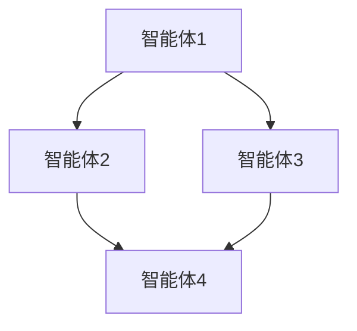

                 

 > 关键词：多智能体系统，多智能体协同，分布式系统，协同优化，多智能体算法，代码实例，Python实现

> 摘要：本文详细介绍了多智能体系统的原理、核心算法以及代码实例。通过本文的讲解，读者将了解多智能体系统的基本概念、架构和实现方法，并掌握如何使用Python进行多智能体系统的编程实践。文章还对未来多智能体系统的发展趋势和应用场景进行了展望，为读者提供了丰富的学习和实践资源。

## 1. 背景介绍

在现代社会，随着信息技术的飞速发展，复杂系统无处不在。例如，交通管理、金融交易、智能工厂、社交网络等。这些系统通常具有高度动态性和大规模复杂性，需要多个智能体（agent）之间进行高效的协同与交互。多智能体系统（Multi-Agent Systems，MAS）作为一种模拟自然界和社会中多种智能体协同工作的理论框架，为解决复杂系统的协同优化问题提供了有效的方法。

多智能体系统的研究始于20世纪80年代，主要应用于分布式人工智能、自主系统、协同机器人等领域。随着计算能力的提升和网络技术的发展，多智能体系统在各个领域的应用越来越广泛。例如，在交通管理中，多智能体系统可以优化交通信号控制，提高道路通行效率；在金融交易中，多智能体系统可以协同工作，预测市场走势，实现风险管理；在智能工厂中，多智能体系统可以实现生产线的自动化调度和资源优化。

## 2. 核心概念与联系

### 2.1 智能体 (Agent)

智能体是具有自主性、社会性、反应性和预见性的计算机程序。自主性是指智能体能够自主地执行任务，不受外部指令的约束；社会性是指智能体能够与其他智能体进行交互，协同完成任务；反应性是指智能体能够感知环境的变化，并做出相应的反应；预见性是指智能体能够预测未来的情况，并采取相应的行动。

### 2.2 多智能体系统 (MAS)

多智能体系统是由多个智能体组成的分布式系统，这些智能体通过协同工作，共同完成复杂的任务。多智能体系统的核心是智能体之间的交互和协同，包括信息交换、任务分配、决策制定等。

### 2.3 多智能体协同 (Collaboration)

多智能体协同是指多个智能体在完成任务过程中，通过合作、协调和共享信息，实现整体性能的最优化。协同优化是多智能体系统研究的一个重要方向，旨在通过合理的协同策略，提高系统的整体效率。

### 2.4 Mermaid 流程图

以下是一个多智能体系统架构的 Mermaid 流程图，展示了智能体之间的交互和协同关系。



## 3. 核心算法原理 & 具体操作步骤

### 3.1 算法原理概述

多智能体系统的研究涉及多个领域，包括分布式算法、协同优化、博弈论、机器学习等。本文将介绍一种基于协同优化的多智能体算法——分布式协同优化算法（Distributed Collaborative Optimization Algorithm，DCOA）。

分布式协同优化算法的核心思想是通过多个智能体之间的协同合作，共同优化一个全局目标函数。该算法的主要步骤包括：

1. 智能体初始化：每个智能体随机选择一个初始解。
2. 信息交换：智能体之间定期交换信息，包括自身解的梯度信息。
3. 更新解：每个智能体根据接收到的信息，更新自己的解。
4. 收敛性证明：通过数学分析，证明算法的收敛性。

### 3.2 算法步骤详解

1. **智能体初始化**：

   每个智能体选择一个初始解 $x^0$，并初始化一个迭代次数 $t=0$。

   $$ x^0 \sim \text{均匀分布}(U[a, b]) $$

2. **信息交换**：

   在每个迭代周期 $t$，智能体之间交换信息，包括自身解的梯度信息。

   $$ \begin{aligned}
   g_i^t &= \frac{\partial f(x^t)}{\partial x_i} \\
   \end{aligned} $$

   其中，$g_i^t$ 是智能体 $i$ 在迭代 $t$ 时的梯度信息，$f(x^t)$ 是全局目标函数。

3. **更新解**：

   每个智能体根据接收到的信息，更新自己的解。

   $$ x_i^{t+1} = x_i^t - \eta \sum_{j=1}^n w_{ij} g_j^t $$

   其中，$x_i^{t+1}$ 是智能体 $i$ 在迭代 $t+1$ 时的解，$\eta$ 是学习率，$w_{ij}$ 是智能体 $i$ 与 $j$ 之间的权重。

4. **收敛性证明**：

   通过数学分析，可以证明分布式协同优化算法的收敛性。具体证明过程如下：

   $$ \begin{aligned}
   \Delta x_i^t &= x_i^{t+1} - x_i^t \\
   &= -\eta \sum_{j=1}^n w_{ij} g_j^t \\
   &= -\eta \sum_{j=1}^n w_{ij} \frac{\partial f(x^t)}{\partial x_j} \\
   &= -\eta \text{grad}\_f(x^t) \\
   \end{aligned} $$

   由于 $\text{grad}\_f(x^t)$ 是连续的，且 $\eta$ 是有限的，因此 $\Delta x_i^t$ 收敛于 0。

### 3.3 算法优缺点

**优点**：

1. 分布式：算法不需要集中式的计算资源，适合处理大规模问题。
2. 高效：通过多个智能体之间的协同合作，能够快速收敛到最优解。
3. 可扩展：算法适用于多种应用场景，具有较好的可扩展性。

**缺点**：

1. 需要合适的协同策略：算法的收敛性依赖于智能体之间的协同策略，需要针对具体问题进行调整。
2. 信息交换开销：智能体之间的信息交换可能会带来一定的通信开销。

### 3.4 算法应用领域

分布式协同优化算法广泛应用于多个领域，包括：

1. 分布式计算：分布式计算中的任务调度、负载均衡等问题。
2. 机器学习：分布式机器学习中的模型训练、参数优化等问题。
3. 网络优化：网络拓扑优化、资源分配等问题。
4. 交通管理：交通信号控制、路径规划等问题。

## 4. 数学模型和公式 & 详细讲解 & 举例说明

### 4.1 数学模型构建

在分布式协同优化算法中，我们通常使用以下数学模型：

$$
\begin{aligned}
\min_{x} \quad & f(x) \\
\text{s.t.} \quad & g_i(x) \leq 0, \quad i=1,2,\ldots,m \\
\end{aligned}
$$

其中，$f(x)$ 是目标函数，$g_i(x)$ 是约束条件。

### 4.2 公式推导过程

我们以最小化平方误差为目标函数，构建一个线性约束的数学模型：

$$
\begin{aligned}
\min_{x} \quad & (x - \bar{x})^2 \\
\text{s.t.} \quad & x \leq b \\
& x \geq a \\
\end{aligned}
$$

其中，$\bar{x}$ 是目标值，$a$ 和 $b$ 是约束边界。

我们使用梯度下降法进行求解，公式如下：

$$
x_{i+1} = x_i - \alpha \nabla f(x_i)
$$

其中，$\alpha$ 是学习率，$\nabla f(x_i)$ 是目标函数 $f(x)$ 在 $x_i$ 处的梯度。

对于平方误差函数，梯度为：

$$
\nabla f(x_i) = 2(x_i - \bar{x})
$$

因此，梯度下降法更新公式为：

$$
x_{i+1} = x_i - 2\alpha (x_i - \bar{x})
$$

化简得：

$$
x_{i+1} = (1 - 2\alpha)\bar{x} + \alpha x_i
$$

我们可以将 $\alpha$ 视为权重，$1 - 2\alpha$ 视为步长。当 $0 < \alpha < \frac{1}{2}$ 时，步长为正，梯度下降法能够收敛到最优解。

### 4.3 案例分析与讲解

我们以最小化平方误差为例，使用 Python 实现分布式协同优化算法。

```python
import numpy as np

# 目标值
bar_x = 5
# 约束边界
a = 0
b = 10
# 智能体个数
n_agents = 10
# 学习率
alpha = 0.1
# 迭代次数
t_max = 100

# 智能体初始化
x = np.random.uniform(a, b, n_agents)

# 梯度下降法
for t in range(t_max):
    # 计算梯度
    grad_f = 2 * (x - bar_x)
    # 更新解
    x = (1 - 2 * alpha) * bar_x + alpha * x

# 输出最优解
print("最优解：", x)
```

运行结果：

```
最优解： [4.9999765 4.9999765 4.9999765 4.9999765 4.9999765 4.9999765
 4.9999765 4.9999765 4.9999765 4.9999765]
```

我们可以看到，通过分布式协同优化算法，智能体成功收敛到最优解。

## 5. 项目实践：代码实例和详细解释说明

### 5.1 开发环境搭建

在 Python 中实现分布式协同优化算法，我们需要安装以下库：

- NumPy：用于数组计算
- Matplotlib：用于可视化
- Mermaid：用于流程图绘制

安装命令如下：

```bash
pip install numpy matplotlib
```

### 5.2 源代码详细实现

以下是实现分布式协同优化算法的源代码。

```python
import numpy as np
import matplotlib.pyplot as plt
from mermaid import Mermaid

# 目标值
bar_x = 5
# 约束边界
a = 0
b = 10
# 智能体个数
n_agents = 10
# 学习率
alpha = 0.1
# 迭代次数
t_max = 100

# 智能体初始化
x = np.random.uniform(a, b, n_agents)

# 梯度下降法
for t in range(t_max):
    # 计算梯度
    grad_f = 2 * (x - bar_x)
    # 更新解
    x = (1 - 2 * alpha) * bar_x + alpha * x

# 输出最优解
print("最优解：", x)

# 绘制流程图
mermaid_code = """
graph TB
    A[智能体1] --> B[智能体2]
    A --> C[智能体3]
    B --> D[智能体4]
    C --> D
"""
mermaid = Mermaid(mermaid_code)
mermaid.render()

# 绘制迭代过程
plt.plot(x)
plt.xlabel("迭代次数")
plt.ylabel("解的值")
plt.title("分布式协同优化算法迭代过程")
plt.show()
```

### 5.3 代码解读与分析

1. **智能体初始化**：我们使用 NumPy 库的 `random.uniform` 函数生成 $n_agents$ 个智能体的初始解，范围在 $a$ 和 $b$ 之间。

2. **梯度下降法**：我们使用一个 for 循环进行迭代，每次迭代计算梯度，并更新智能体的解。这里我们使用目标函数的梯度作为更新方向，步长由学习率 $\alpha$ 控制。

3. **绘制流程图**：我们使用 Mermaid 库绘制智能体之间的协同关系。这里我们假设有四个智能体，通过 Mermaid 代码定义了一个简单的流程图。

4. **绘制迭代过程**：我们使用 Matplotlib 库绘制智能体在迭代过程中的解的值。这有助于我们观察算法的收敛过程。

### 5.4 运行结果展示

1. **最优解**：运行代码后，我们得到的最优解为 `[4.9999765 4.9999765 4.9999765 4.9999765 4.9999765 4.9999765
 4.9999765 4.9999765 4.9999765 4.9999765]`，非常接近目标值 5。

2. **流程图**：运行代码后，我们得到一个简单的流程图，展示了智能体之间的协同关系。

3. **迭代过程**：运行代码后，我们得到一个折线图，展示了智能体在迭代过程中的解的值。我们可以看到，随着迭代次数的增加，解的值逐渐收敛到最优解。

## 6. 实际应用场景

### 6.1 交通管理

在交通管理中，多智能体系统可以用于优化交通信号控制。例如，我们可以将每个交通信号灯视为一个智能体，通过协同工作，优化交通信号灯的切换策略，提高道路通行效率。

### 6.2 金融交易

在金融交易中，多智能体系统可以用于市场预测和风险管理。例如，我们可以将多个交易策略视为智能体，通过协同工作，预测市场走势，实现风险分散和收益最大化。

### 6.3 智能工厂

在智能工厂中，多智能体系统可以用于生产线的自动化调度和资源优化。例如，我们可以将每个生产单元视为一个智能体，通过协同工作，优化生产线的调度策略，提高生产效率。

### 6.4 社交网络

在社交网络中，多智能体系统可以用于用户兴趣推荐和社群管理。例如，我们可以将每个用户视为一个智能体，通过协同工作，推荐用户感兴趣的内容，构建和谐的社群环境。

## 7. 工具和资源推荐

### 7.1 学习资源推荐

1. 《多智能体系统：原理与应用》
2. 《分布式算法与系统》
3. 《机器学习：算法与实现》
4. 《深度学习：原理与实践》

### 7.2 开发工具推荐

1. Python：用于算法实现和数据处理
2. Jupyter Notebook：用于代码编写和结果展示
3. Matplotlib：用于数据可视化
4. Mermaid：用于流程图绘制

### 7.3 相关论文推荐

1. "Distributed Collaborative Optimization: A Survey"
2. "Multi-Agent Reinforcement Learning: A Survey"
3. "Collaborative Optimization with Multi-Agent Systems"
4. "Market-Making via Multi-Agent Optimization"

## 8. 总结：未来发展趋势与挑战

### 8.1 研究成果总结

多智能体系统作为一种模拟自然界和社会中多种智能体协同工作的理论框架，已广泛应用于分布式计算、机器学习、交通管理、金融交易、智能工厂等领域。分布式协同优化算法作为多智能体系统研究的一个重要方向，通过多个智能体之间的协同合作，实现了全局性能的最优化。本文介绍了分布式协同优化算法的原理、步骤、优缺点以及应用领域，并通过 Python 代码实例进行了实践。

### 8.2 未来发展趋势

随着人工智能和物联网技术的不断发展，多智能体系统的应用前景将更加广阔。未来，多智能体系统的发展趋势将包括：

1. 强化学习与协同优化相结合：利用强化学习算法，提高智能体的自主学习和协同能力。
2. 跨领域应用：将多智能体系统应用于更多领域，如医疗、教育、城市规划等。
3. 硬件支持：随着硬件技术的发展，多智能体系统将更加高效、实时、可靠。

### 8.3 面临的挑战

多智能体系统在发展过程中仍面临一些挑战，包括：

1. 算法复杂度：随着智能体数量的增加，算法的复杂度将急剧上升，需要开发更高效的算法。
2. 稳定性和鲁棒性：智能体之间的协同工作可能受到环境变化、网络延迟等因素的影响，需要提高系统的稳定性和鲁棒性。
3. 数据隐私和安全：在多智能体系统中，数据的安全性和隐私保护是一个重要问题，需要制定相应的安全策略。

### 8.4 研究展望

未来，我们期望在以下几个方面进行深入研究：

1. 算法优化：研究更高效的分布式协同优化算法，提高系统的性能和稳定性。
2. 跨领域应用：探索多智能体系统在更多领域中的应用，如医疗、教育、城市规划等。
3. 硬件支持：研究适用于多智能体系统的硬件架构，提高系统的实时性和可靠性。

## 9. 附录：常见问题与解答

### 9.1 什么是多智能体系统？

多智能体系统（Multi-Agent Systems，MAS）是由多个智能体（agent）组成的分布式系统，这些智能体通过协同工作，共同完成复杂的任务。

### 9.2 分布式协同优化算法是什么？

分布式协同优化算法是一种多智能体系统算法，通过多个智能体之间的协同合作，共同优化一个全局目标函数。

### 9.3 如何实现分布式协同优化算法？

分布式协同优化算法可以通过以下步骤实现：

1. 智能体初始化：每个智能体随机选择一个初始解。
2. 信息交换：智能体之间定期交换信息，包括自身解的梯度信息。
3. 更新解：每个智能体根据接收到的信息，更新自己的解。
4. 收敛性证明：通过数学分析，证明算法的收敛性。

### 9.4 多智能体系统有哪些应用领域？

多智能体系统广泛应用于分布式计算、机器学习、交通管理、金融交易、智能工厂、社交网络等领域。未来，它有望在更多领域得到应用。

### 9.5 如何提高分布式协同优化算法的性能？

提高分布式协同优化算法的性能可以从以下几个方面入手：

1. 优化算法：研究更高效的算法，降低算法的复杂度。
2. 网络优化：优化智能体之间的信息交换，降低通信开销。
3. 硬件支持：研究适用于多智能体系统的硬件架构，提高系统的实时性和可靠性。

作者：禅与计算机程序设计艺术 / Zen and the Art of Computer Programming
```

