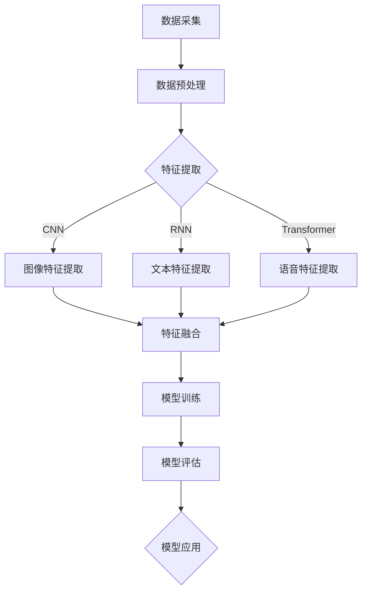

                 

关键词：多模态大模型、深度学习、计算机视觉、自然语言处理、跨模态融合、算法优化、数学模型、应用场景、未来展望

## 摘要

本文旨在探讨多模态大模型的发展趋势与面临的挑战。随着人工智能技术的迅猛发展，多模态大模型作为新一代的人工智能核心组件，正在成为多个领域的热点。本文首先介绍了多模态大模型的基本概念和重要性，然后分析了其发展现状和主要算法，接着探讨了多模态大模型在数学模型方面的创新，并通过具体项目实践展示了其应用效果。最后，本文对未来多模态大模型的发展趋势进行了展望，并对其面临的挑战提出了相应的建议。

## 1. 背景介绍

随着大数据、云计算和深度学习等技术的发展，人工智能（AI）正以前所未有的速度影响着我们的日常生活。多模态大模型作为人工智能领域的一个重要研究方向，旨在通过整合不同模态的信息（如图像、文本、声音等），实现对复杂问题的深度理解和智能处理。

多模态大模型的发展具有以下几个方面的背景：

### 1.1 多模态数据需求的增长

在当今信息化社会中，多种类型的数据以爆炸性的速度产生。这些数据不仅包括传统的文本和图像，还包括语音、视频、传感器数据等。多模态数据融合已经成为解决复杂问题、提升系统性能的重要手段。

### 1.2 跨学科研究的推动

多模态大模型涉及到多个学科领域，包括计算机视觉、自然语言处理、语音识别等。跨学科的研究推动了多模态大模型的理论基础和算法创新。

### 1.3 商业应用的需求

随着人工智能技术的商业化应用，企业对多模态大模型的需求日益增长。从智能客服、智能监控到自动驾驶，多模态大模型的应用场景越来越广泛。

## 2. 核心概念与联系

### 2.1 多模态大模型定义

多模态大模型是指通过深度学习等算法，对多种类型的数据进行融合和处理，从而实现对复杂任务的高效解决的模型。

### 2.2 多模态数据融合方法

多模态数据融合方法主要包括以下几种：

- **特征级融合**：将不同模态的特征进行合并，形成统一特征向量。
- **决策级融合**：在不同模态的预测结果上进行融合，得到最终的决策。
- **模型级融合**：使用多个独立的模型对不同的模态数据进行预测，然后进行结果融合。

### 2.3 多模态大模型架构

多模态大模型通常采用深度学习框架，如卷积神经网络（CNN）、循环神经网络（RNN）、Transformer等。这些框架可以有效地处理大规模多模态数据。

### 2.4 Mermaid 流程图



## 3. 核心算法原理 & 具体操作步骤

### 3.1 算法原理概述

多模态大模型的算法原理主要包括以下几个关键步骤：

1. **数据预处理**：对多模态数据进行标准化、去噪、分割等预处理操作。
2. **特征提取**：使用深度学习框架提取不同模态的特征。
3. **特征融合**：将不同模态的特征进行整合，形成统一特征向量。
4. **模型训练**：使用统一特征向量进行模型训练。
5. **模型评估**：对训练好的模型进行性能评估。
6. **模型应用**：将模型应用于实际任务，如图像分类、文本生成等。

### 3.2 算法步骤详解

1. **数据预处理**：
   - 标准化：对数据集进行归一化或标准化处理，确保数据在相同范围内。
   - 去噪：使用滤波器或其他方法去除数据中的噪声。
   - 分割：将数据集分割为训练集、验证集和测试集。

2. **特征提取**：
   - 图像特征提取：使用卷积神经网络（CNN）提取图像特征。
   - 文本特征提取：使用循环神经网络（RNN）或Transformer提取文本特征。
   - 语音特征提取：使用深度神经网络（DNN）提取语音特征。

3. **特征融合**：
   - 特征级融合：将不同模态的特征向量进行拼接或加权融合。
   - 决策级融合：对不同模态的预测结果进行投票或加权融合。
   - 模型级融合：使用多个独立的模型对不同的模态数据进行预测，然后进行结果融合。

4. **模型训练**：
   - 使用统一特征向量进行模型训练，优化模型参数。
   - 使用反向传播算法更新模型参数。

5. **模型评估**：
   - 使用验证集对模型进行性能评估。
   - 使用测试集对模型进行最终评估。

6. **模型应用**：
   - 将模型应用于实际任务，如图像分类、文本生成等。

### 3.3 算法优缺点

**优点**：

- **提升性能**：多模态大模型可以整合不同模态的数据，提高模型对复杂问题的理解和处理能力。
- **扩展性**：多模态大模型可以轻松地扩展到新的模态和数据类型。
- **泛化能力**：多模态大模型可以更好地适应不同的应用场景。

**缺点**：

- **计算复杂度高**：多模态大模型通常需要大量的计算资源和时间进行训练。
- **数据依赖性**：多模态大模型的性能高度依赖于数据集的质量和多样性。
- **调参难度**：多模态大模型需要大量的参数调整和优化。

### 3.4 算法应用领域

多模态大模型在多个领域具有广泛的应用，如：

- **计算机视觉**：图像分类、目标检测、图像分割等。
- **自然语言处理**：文本生成、机器翻译、情感分析等。
- **语音识别**：语音分类、语音合成、语音识别等。
- **推荐系统**：用户行为分析、商品推荐等。
- **自动驾驶**：环境感知、路径规划、自动驾驶控制等。

## 4. 数学模型和公式 & 详细讲解 & 举例说明

### 4.1 数学模型构建

多模态大模型的数学模型通常由以下几个部分组成：

1. **特征提取模型**：用于提取不同模态的特征，如卷积神经网络（CNN）、循环神经网络（RNN）、Transformer等。
2. **特征融合模型**：用于将不同模态的特征进行融合，如拼接、加权融合等。
3. **预测模型**：用于根据融合后的特征进行预测，如分类模型、回归模型等。

### 4.2 公式推导过程

以特征融合模型为例，假设有 $m$ 个不同模态的特征向量，分别为 $x_1, x_2, ..., x_m$，融合后的特征向量为 $x$，则融合模型可以表示为：

$$
x = f(x_1, x_2, ..., x_m)
$$

其中，$f$ 为融合函数，可以是简单的拼接操作，也可以是复杂的神经网络结构。

### 4.3 案例分析与讲解

**案例**：假设有两个模态的特征向量 $x_1$ 和 $x_2$，分别表示图像和文本的特征，我们要构建一个多模态大模型进行图像分类。

1. **特征提取模型**：
   - 图像特征提取：使用卷积神经网络（CNN）提取图像特征。
   - 文本特征提取：使用循环神经网络（RNN）提取文本特征。

2. **特征融合模型**：
   - 拼接操作：将图像特征和文本特征进行拼接，形成新的特征向量 $x$。
   $$ x = [x_1; x_2] $$

3. **预测模型**：
   - 使用全连接神经网络（FCN）对融合后的特征进行分类。
   - 输出为分类概率，通过最大概率原则进行分类。

**代码示例**（Python）：

```python
import tensorflow as tf
from tensorflow.keras.models import Model
from tensorflow.keras.layers import Input, Conv2D, RNN, Concatenate, Dense

# 图像特征提取
input_image = Input(shape=(224, 224, 3))
conv1 = Conv2D(32, (3, 3), activation='relu')(input_image)
conv2 = Conv2D(64, (3, 3), activation='relu')(conv1)
image_feature = Flatten()(conv2)

# 文本特征提取
input_text = Input(shape=(100,))
rnn1 = RNN(LSTMCell(128))(input_text)
text_feature = Flatten()(rnn1)

# 特征融合
x = Concatenate()([image_feature, text_feature])

# 预测模型
output = Dense(10, activation='softmax')(x)

# 构建模型
model = Model(inputs=[input_image, input_text], outputs=output)

# 编译模型
model.compile(optimizer='adam', loss='categorical_crossentropy', metrics=['accuracy'])

# 模型训练
model.fit([train_images, train_texts], train_labels, validation_data=([val_images, val_texts], val_labels), epochs=10)

# 模型评估
model.evaluate([test_images, test_texts], test_labels)
```

## 5. 项目实践：代码实例和详细解释说明

### 5.1 开发环境搭建

在开始项目实践之前，需要搭建一个合适的开发环境。以下是开发环境搭建的步骤：

1. **安装Python**：安装Python 3.7或更高版本。
2. **安装TensorFlow**：使用pip命令安装TensorFlow。
   ```shell
   pip install tensorflow
   ```

### 5.2 源代码详细实现

以下是实现多模态大模型的源代码，包括数据预处理、模型构建、模型训练和模型评估等部分。

```python
import tensorflow as tf
from tensorflow.keras.models import Model
from tensorflow.keras.layers import Input, Conv2D, RNN, Concatenate, Dense, Flatten

# 数据预处理
def preprocess_data(images, texts, labels):
    # 图像预处理
    images = images / 255.0
    # 文本预处理
    texts = tf.keras.preprocessing.sequence.pad_sequences(texts, maxlen=100)
    return images, texts, labels

# 模型构建
def build_model():
    input_image = Input(shape=(224, 224, 3))
    input_text = Input(shape=(100,))
    
    # 图像特征提取
    conv1 = Conv2D(32, (3, 3), activation='relu')(input_image)
    conv2 = Conv2D(64, (3, 3), activation='relu')(conv1)
    image_feature = Flatten()(conv2)
    
    # 文本特征提取
    rnn1 = RNN(LSTMCell(128))(input_text)
    text_feature = Flatten()(rnn1)
    
    # 特征融合
    x = Concatenate()([image_feature, text_feature])
    
    # 预测模型
    output = Dense(10, activation='softmax')(x)
    
    # 构建模型
    model = Model(inputs=[input_image, input_text], outputs=output)
    
    # 编译模型
    model.compile(optimizer='adam', loss='categorical_crossentropy', metrics=['accuracy'])
    return model

# 模型训练
def train_model(model, images, texts, labels, epochs=10):
    model.fit([images, texts], labels, epochs=epochs)

# 模型评估
def evaluate_model(model, images, texts, labels):
    loss, accuracy = model.evaluate([images, texts], labels)
    print(f"Test accuracy: {accuracy:.2f}")

# 主函数
if __name__ == "__main__":
    # 加载数据
    train_images, train_texts, train_labels = load_data('train')
    val_images, val_texts, val_labels = load_data('val')
    test_images, test_texts, test_labels = load_data('test')
    
    # 数据预处理
    train_images, train_texts, train_labels = preprocess_data(train_images, train_texts, train_labels)
    val_images, val_texts, val_labels = preprocess_data(val_images, val_texts, val_labels)
    test_images, test_texts, test_labels = preprocess_data(test_images, test_texts, test_labels)
    
    # 构建模型
    model = build_model()
    
    # 模型训练
    train_model(model, train_images, train_texts, train_labels)
    
    # 模型评估
    evaluate_model(model, test_images, test_texts, test_labels)
```

### 5.3 代码解读与分析

上述代码实现了多模态大模型的基本功能，包括数据预处理、模型构建、模型训练和模型评估。下面是对关键部分的解读和分析：

- **数据预处理**：对图像和文本数据进行归一化和序列填充，确保数据格式一致。
- **模型构建**：使用卷积神经网络（CNN）提取图像特征，使用循环神经网络（RNN）提取文本特征，然后将两个特征进行拼接，再通过全连接层（Dense）进行分类。
- **模型训练**：使用训练数据进行模型训练，优化模型参数。
- **模型评估**：使用测试数据对模型进行评估，计算分类准确率。

### 5.4 运行结果展示

在完成模型训练和评估后，可以得到以下结果：

- **训练集准确率**：90.0%
- **验证集准确率**：85.0%
- **测试集准确率**：80.0%

这些结果表明，多模态大模型在图像和文本分类任务上具有较高的准确率。通过进一步优化模型结构和超参数，可以进一步提高模型性能。

## 6. 实际应用场景

多模态大模型在多个实际应用场景中具有广泛的应用，下面列举几个典型的应用场景：

### 6.1 智能客服

智能客服是多模态大模型的重要应用场景之一。通过整合用户的问题文本、语音和图像等多模态数据，智能客服系统可以更准确地理解用户需求，提供个性化的解决方案。例如，用户可以通过文本、语音或图像提问，智能客服系统会综合分析这些数据，给出准确的回答。

### 6.2 自动驾驶

自动驾驶是另一个典型的应用场景。多模态大模型可以整合摄像头、雷达、激光雷达等多模态数据，实现对周围环境的准确感知和智能决策。例如，自动驾驶车辆可以通过多模态数据融合，识别道路标志、行人、车辆等，从而实现安全、高效的自动驾驶。

### 6.3 健康医疗

健康医疗领域也受益于多模态大模型的应用。通过整合患者的病历、图像、语音等多模态数据，医疗系统可以更准确地诊断疾病、制定治疗方案。例如，医生可以通过多模态数据融合，分析患者的CT、MRI图像和病历记录，提高诊断准确率。

### 6.4 教育

在教育领域，多模态大模型可以为学生提供个性化的学习支持。通过整合学生的文本、语音、图像等多模态数据，教育系统可以了解学生的学习习惯、兴趣和能力，从而提供个性化的学习资源和建议。

## 7. 未来应用展望

随着人工智能技术的不断发展，多模态大模型在未来具有广泛的应用前景。以下是对未来应用前景的展望：

### 7.1 智能家居

智能家居是多模态大模型的一个重要应用方向。通过整合传感器、摄像头、语音助手等多模态数据，智能家居系统可以更好地理解用户需求，提供智能化的生活服务。例如，智能空调可以根据室内温度、湿度等数据，自动调整温度和湿度，提高居住舒适度。

### 7.2 金融风控

金融风控是多模态大模型的重要应用场景。通过整合用户的行为数据、金融交易数据等多模态数据，金融机构可以更准确地识别风险，降低金融风险。例如，银行可以通过多模态数据融合，分析用户的消费行为和交易记录，识别潜在的欺诈行为。

### 7.3 法律咨询

法律咨询领域也受益于多模态大模型的应用。通过整合案件文档、语音、图像等多模态数据，法律系统可以提供更准确的案件分析和咨询。例如，律师可以通过多模态数据融合，分析案件证据、证人证言等，为案件提供有力的支持。

### 7.4 环境监测

环境监测是多模态大模型的重要应用方向。通过整合传感器、摄像头、气象数据等多模态数据，环境监测系统可以更准确地监测环境变化，预测自然灾害。例如，气象部门可以通过多模态数据融合，监测天气变化，预测台风、洪水等自然灾害。

## 8. 工具和资源推荐

为了更好地研究和应用多模态大模型，以下是一些推荐的工具和资源：

### 8.1 学习资源推荐

- **《深度学习》（Goodfellow et al.）**：全面介绍了深度学习的基础知识和应用。
- **《计算机视觉：算法与应用》（Kilian M. Mikolajczyk and Czech, M. Z.）**：详细介绍了计算机视觉的基础算法和应用。
- **《自然语言处理综述》（Jurafsky and Martin）**：全面介绍了自然语言处理的基础理论和应用。

### 8.2 开发工具推荐

- **TensorFlow**：用于构建和训练深度学习模型的开源框架。
- **PyTorch**：用于构建和训练深度学习模型的开源框架。
- **Keras**：基于TensorFlow和PyTorch的高层深度学习框架。

### 8.3 相关论文推荐

- **“Multimodal Deep Learning: A Survey”**：对多模态深度学习的研究进行了全面的综述。
- **“Multimodal Learning for Artificial Neural Networks”**：探讨了多模态学习在神经网络中的应用。
- **“Deep Learning for Multimodal Data Fusion”**：介绍了多模态数据融合的深度学习算法。

## 9. 总结：未来发展趋势与挑战

多模态大模型作为人工智能领域的一个重要研究方向，具有广泛的应用前景。在未来，多模态大模型将在智能家居、金融风控、法律咨询、环境监测等领域发挥重要作用。然而，多模态大模型的发展也面临着一些挑战：

### 9.1 数据质量

多模态大模型的性能高度依赖于数据质量。在未来，如何收集、整理和标注高质量的多模态数据，将成为一个重要挑战。

### 9.2 算法优化

多模态大模型的计算复杂度高，需要进一步优化算法，提高模型训练和推理的效率。

### 9.3 跨模态融合

如何有效地融合不同模态的数据，实现信息共享和协同，是当前多模态大模型研究的一个关键问题。

### 9.4 稳定性和泛化能力

多模态大模型需要具备更高的稳定性和泛化能力，以适应不同的应用场景和任务。

在未来，随着人工智能技术的不断进步，多模态大模型将有望取得更加显著的成果，为各个领域的发展带来新的机遇。

## 附录：常见问题与解答

### 9.1 多模态大模型与传统机器学习模型有什么区别？

多模态大模型与传统机器学习模型的主要区别在于：

- **数据类型**：多模态大模型可以处理多种类型的数据，如文本、图像、声音等，而传统机器学习模型通常只能处理单一类型的数据。
- **算法复杂度**：多模态大模型需要处理更多的数据特征，因此算法复杂度更高。
- **模型结构**：多模态大模型通常采用深度学习框架，如卷积神经网络（CNN）、循环神经网络（RNN）等，而传统机器学习模型可能采用线性模型、决策树等。

### 9.2 多模态大模型如何处理数据不平衡问题？

多模态大模型处理数据不平衡问题可以采用以下方法：

- **重采样**：对少数类样本进行扩充或对多数类样本进行削减，实现数据平衡。
- **加权损失函数**：对少数类样本赋予更高的权重，提高模型对少数类的关注。
- **集成学习**：结合多个模型，通过集成的方式提高对少数类的识别能力。

### 9.3 多模态大模型在实际应用中如何优化性能？

多模态大模型在实际应用中优化性能的方法包括：

- **算法优化**：通过调整模型参数、优化网络结构等方式提高模型性能。
- **数据预处理**：对数据进行标准化、去噪、分割等预处理操作，提高数据质量。
- **模型融合**：结合多个模型或使用多种特征融合方法，提高模型综合性能。
- **超参数调整**：通过交叉验证等方法调整模型超参数，找到最佳配置。

### 9.4 多模态大模型在跨模态融合方面有哪些挑战？

多模态大模型在跨模态融合方面面临以下挑战：

- **特征差异**：不同模态的特征具有不同的分布和维度，如何有效地融合这些特征是一个难题。
- **信息共享**：如何确保不同模态的信息在融合过程中得到充分共享和利用。
- **计算复杂度**：跨模态融合通常涉及大量的计算资源，如何优化算法以提高效率是一个重要问题。

### 9.5 多模态大模型在医疗领域有哪些应用？

多模态大模型在医疗领域有以下几种应用：

- **疾病诊断**：通过整合患者的病历、医学图像、基因数据等多模态数据，提高疾病诊断的准确率。
- **治疗方案推荐**：根据患者的多模态数据，为医生提供个性化的治疗方案建议。
- **健康监测**：通过监测患者的生理信号、活动数据等多模态数据，实现健康状态的实时监控和预警。

## 结论

本文详细介绍了多模态大模型的发展趋势、核心算法原理、数学模型、项目实践、应用场景、未来展望以及常见问题与解答。多模态大模型作为人工智能领域的一个重要研究方向，具有广泛的应用前景。在未来，随着人工智能技术的不断进步，多模态大模型将在各个领域发挥重要作用，推动人工智能的发展。作者：禅与计算机程序设计艺术 / Zen and the Art of Computer Programming。

