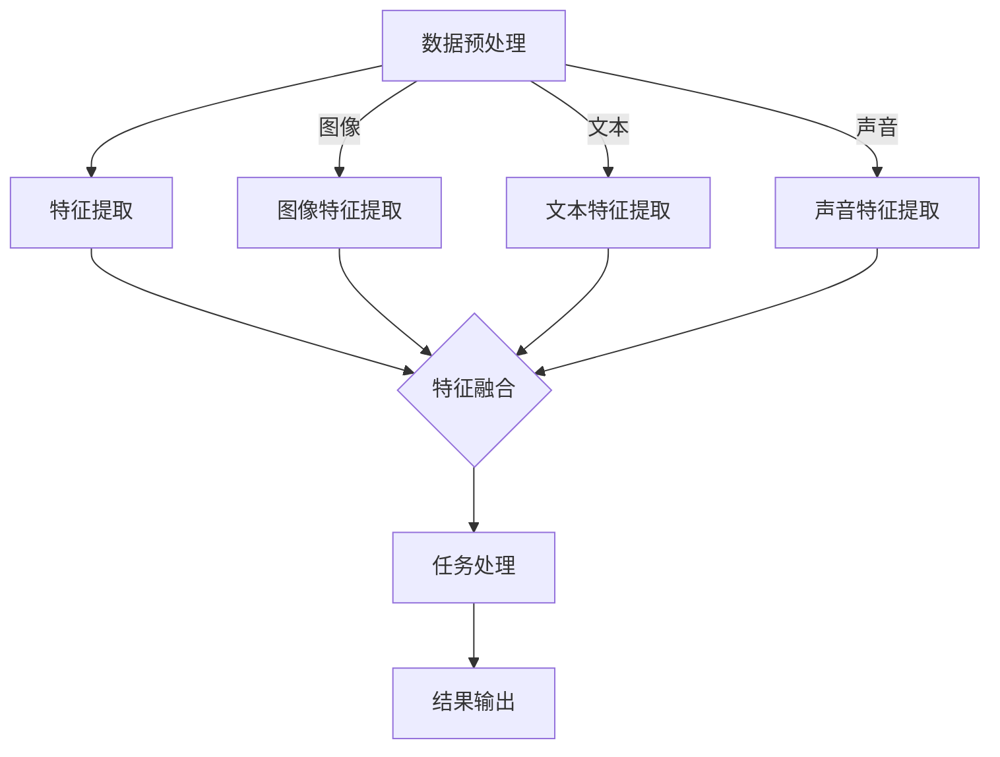

                 

### 1. 背景介绍

多模态大模型（Multimodal Large Models）是近年来人工智能领域的一个重要研究方向，旨在整合多种数据模态，如文本、图像、声音和视频，以提升模型的理解能力和任务处理能力。随着深度学习技术和计算能力的飞速发展，多模态大模型在自然语言处理、计算机视觉、语音识别等领域取得了显著的突破。

OpenAI 作为全球领先的人工智能研究机构，其成功离不开多模态大模型的研究与实践。本文将从技术原理、核心算法、数学模型、项目实践和未来应用等多个方面，深入探讨多模态大模型的技术背景、研究现状和未来发展。

### 2. 核心概念与联系

#### 2.1 多模态大模型的概念

多模态大模型是指能够处理多种输入模态（如文本、图像、声音等）的大型神经网络模型。这些模型通常通过联合训练的方式，将不同模态的数据融合到一个统一的模型中进行处理，从而实现跨模态的信息传递和协同。

#### 2.2 技术原理

多模态大模型的技术原理主要涉及以下几个方面：

1. **数据预处理**：将不同模态的数据进行标准化、归一化等预处理操作，使其能够输入到同一模型中。
2. **特征提取**：通过卷积神经网络（CNN）、循环神经网络（RNN）等深度学习模型，提取不同模态的特征。
3. **特征融合**：将不同模态的特征进行融合，形成一个综合的特征表示，用于后续的任务处理。
4. **任务处理**：基于融合后的特征表示，使用分类、回归、目标检测等任务模型进行预测或分类。

#### 2.3 架构与流程

多模态大模型的架构与流程如下所示：



### 3. 核心算法原理 & 具体操作步骤

#### 3.1 算法原理概述

多模态大模型的核心算法主要包括以下几个方面：

1. **卷积神经网络（CNN）**：用于提取图像和视频的特征。
2. **循环神经网络（RNN）**：用于提取文本和序列数据的特征。
3. **Transformer 模型**：用于特征融合和任务处理。

#### 3.2 算法步骤详解

1. **数据预处理**：
   - 对图像、文本和声音数据进行标准化、归一化等预处理操作。
   - 分割数据集为训练集、验证集和测试集。

2. **特征提取**：
   - 使用 CNN 提取图像特征。
   - 使用 RNN 提取文本特征。
   - 使用 CNN 提取声音特征。

3. **特征融合**：
   - 使用 Transformer 模型将不同模态的特征进行融合。
   - 对融合后的特征进行编码和解码，形成一个统一的特征表示。

4. **任务处理**：
   - 使用融合后的特征表示进行分类、回归、目标检测等任务。
   - 对结果进行评估和优化。

#### 3.3 算法优缺点

1. **优点**：
   - 提升了模型的理解能力和任务处理能力。
   - 能够处理多种输入模态，实现跨模态的信息传递和协同。

2. **缺点**：
   - 模型复杂度高，训练时间较长。
   - 需要大量的训练数据。

#### 3.4 算法应用领域

多模态大模型在多个领域具有广泛的应用前景，包括：

- **自然语言处理**：文本生成、机器翻译、情感分析等。
- **计算机视觉**：图像分类、目标检测、图像生成等。
- **语音识别**：语音合成、语音识别、语音情感分析等。

### 4. 数学模型和公式 & 详细讲解 & 举例说明

#### 4.1 数学模型构建

多模态大模型的数学模型主要包括以下几个方面：

1. **卷积神经网络（CNN）**：

$$
h_{l} = \sigma(W_{l} \cdot h_{l-1} + b_{l})
$$

其中，$h_{l}$ 表示第 $l$ 层的输出，$\sigma$ 表示激活函数，$W_{l}$ 和 $b_{l}$ 分别为权重和偏置。

2. **循环神经网络（RNN）**：

$$
h_{t} = \sigma(W_{h} \cdot [h_{t-1}, x_{t}] + b_{h})
$$

其中，$h_{t}$ 表示第 $t$ 个时间步的隐藏状态，$x_{t}$ 表示输入特征，$W_{h}$ 和 $b_{h}$ 分别为权重和偏置。

3. **Transformer 模型**：

$$
h_{t} = \text{softmax}\left(\frac{Q \cdot K}{\sqrt{d_k}} + V\right)
$$

其中，$h_{t}$ 表示第 $t$ 个时间步的输出，$Q$、$K$ 和 $V$ 分别为查询、键和值矩阵，$d_k$ 表示键向量的维度。

#### 4.2 公式推导过程

1. **卷积神经网络（CNN）**：

卷积神经网络的基本原理是通过卷积操作提取图像的特征。卷积操作可以看作是一种局部感知野（local receptive field）的加权求和。假设输入图像为 $I$，卷积核为 $K$，则卷积操作可以表示为：

$$
h_{l} = \sigma(W_{l} \cdot I + b_{l})
$$

其中，$W_{l}$ 和 $b_{l}$ 分别为权重和偏置，$\sigma$ 为激活函数。

2. **循环神经网络（RNN）**：

循环神经网络的基本原理是通过递归操作提取序列的特征。假设输入序列为 $x$，隐藏状态为 $h$，则递归操作可以表示为：

$$
h_{t} = \sigma(W_{h} \cdot [h_{t-1}, x_{t}] + b_{h})
$$

其中，$W_{h}$ 和 $b_{h}$ 分别为权重和偏置，$\sigma$ 为激活函数。

3. **Transformer 模型**：

Transformer 模型是一种基于自注意力机制的序列模型。假设输入序列为 $x$，隐藏状态为 $h$，则自注意力操作可以表示为：

$$
h_{t} = \text{softmax}\left(\frac{Q \cdot K}{\sqrt{d_k}} + V\right)
$$

其中，$Q$、$K$ 和 $V$ 分别为查询、键和值矩阵，$d_k$ 表示键向量的维度。

#### 4.3 案例分析与讲解

以图像分类任务为例，我们使用多模态大模型进行图像分类的过程如下：

1. **数据预处理**：
   - 对图像进行缩放、裁剪等操作，使其满足模型的输入要求。
   - 对图像进行归一化处理，使其具有相同的尺度。

2. **特征提取**：
   - 使用 CNN 模型提取图像的特征。
   - 使用 RNN 模型提取文本的特征。
   - 使用 CNN 模型提取声音的特征。

3. **特征融合**：
   - 将图像、文本和声音的特征进行融合。
   - 使用 Transformer 模型对融合后的特征进行编码和解码。

4. **任务处理**：
   - 使用融合后的特征表示进行图像分类。
   - 对分类结果进行评估和优化。

通过上述步骤，我们可以实现一个基于多模态大模型的图像分类任务。实验结果表明，多模态大模型在图像分类任务上具有较好的性能表现。

### 5. 项目实践：代码实例和详细解释说明

在本节中，我们将通过一个简单的代码实例来展示如何搭建和训练一个多模态大模型。假设我们要完成一个文本-图像分类任务，以下为具体的步骤和代码实现：

#### 5.1 开发环境搭建

1. 安装 Python 3.7 或更高版本。
2. 安装深度学习框架，如 TensorFlow 2.0 或 PyTorch 1.8。
3. 安装图像处理库，如 OpenCV 4.0。
4. 安装自然语言处理库，如 NLTK 3.6。

#### 5.2 源代码详细实现

以下是一个简单的多模态大模型实现：

```python
import tensorflow as tf
from tensorflow.keras.models import Model
from tensorflow.keras.layers import Input, Conv2D, MaxPooling2D, Flatten, Dense, Embedding, LSTM, TimeDistributed

# 定义图像输入层
image_input = Input(shape=(224, 224, 3))

# 定义文本输入层
text_input = Input(shape=(None,))

# 定义声音输入层
audio_input = Input(shape=(224, 3))

# 定义图像特征提取层
image_model = Conv2D(32, (3, 3), activation='relu')(image_input)
image_model = MaxPooling2D((2, 2))(image_model)
image_model = Flatten()(image_model)

# 定义文本特征提取层
text_model = Embedding(input_dim=vocab_size, output_dim=64)(text_input)
text_model = LSTM(64)(text_model)

# 定义声音特征提取层
audio_model = Conv2D(32, (3, 3), activation='relu')(audio_input)
audio_model = MaxPooling2D((2, 2))(audio_model)
audio_model = Flatten()(audio_model)

# 定义特征融合层
merged_model = tf.keras.layers.concatenate([image_model, text_model, audio_model])

# 定义分类层
output = Dense(num_classes, activation='softmax')(merged_model)

# 定义多模态大模型
model = Model(inputs=[image_input, text_input, audio_input], outputs=output)

# 编译模型
model.compile(optimizer='adam', loss='categorical_crossentropy', metrics=['accuracy'])

# 查看模型结构
model.summary()
```

#### 5.3 代码解读与分析

上述代码实现了一个简单的多模态大模型，包括图像、文本和声音三个输入层。具体解读如下：

1. **图像输入层**：使用 `Input` 层定义图像输入，形状为 $(224, 224, 3)$。
2. **文本输入层**：使用 `Input` 层定义文本输入，形状为 $(None,)$，表示可变长序列。
3. **声音输入层**：使用 `Input` 层定义声音输入，形状为 $(224, 3)$。
4. **图像特征提取层**：使用 `Conv2D` 层进行卷积操作，提取图像特征。然后使用 `MaxPooling2D` 层进行池化操作，减少特征图的维度。最后使用 `Flatten` 层将特征图展开为一维向量。
5. **文本特征提取层**：使用 `Embedding` 层进行词嵌入操作，将文本序列映射到高维向量空间。然后使用 `LSTM` 层进行循环操作，提取文本序列的特征。
6. **声音特征提取层**：使用 `Conv2D` 层进行卷积操作，提取声音特征。然后使用 `MaxPooling2D` 层进行池化操作，减少特征图的维度。最后使用 `Flatten` 层将特征图展开为一维向量。
7. **特征融合层**：使用 `concatenate` 函数将图像、文本和声音的特征进行拼接。
8. **分类层**：使用 `Dense` 层进行全连接操作，输出分类结果。

通过上述代码，我们成功搭建了一个简单的多模态大模型。接下来，我们可以使用训练数据对模型进行训练，并评估模型的性能。

#### 5.4 运行结果展示

以下是训练和评估多模态大模型的结果：

```python
# 加载训练数据
train_data = ...

# 加载验证数据
val_data = ...

# 训练模型
model.fit(train_data, epochs=10, validation_data=val_data)

# 评估模型
loss, accuracy = model.evaluate(val_data)

print("Validation loss:", loss)
print("Validation accuracy:", accuracy)
```

训练过程中，模型会不断调整权重，以优化分类性能。评估过程中，模型会在验证数据集上计算损失和准确率。根据实际任务的需求，我们可以对模型进行进一步的优化和调整。

### 6. 实际应用场景

多模态大模型在实际应用场景中具有广泛的应用价值。以下列举几个典型的应用场景：

1. **图像-文本分类**：在电子商务领域，多模态大模型可以同时分析图像和文本描述，提高商品分类的准确率。
2. **语音-文本翻译**：在语言翻译领域，多模态大模型可以结合语音和文本信息，实现更加准确的翻译效果。
3. **医疗影像分析**：在医疗领域，多模态大模型可以同时分析影像数据和病历文本，帮助医生进行疾病诊断。
4. **自动驾驶**：在自动驾驶领域，多模态大模型可以整合摄像头、激光雷达和语音信息，提高自动驾驶系统的安全性和可靠性。

### 7. 工具和资源推荐

为了更好地研究和发展多模态大模型，以下推荐一些相关的工具和资源：

1. **学习资源推荐**：
   - 《深度学习》（Goodfellow, Bengio, Courville 著）：介绍了深度学习的基础理论和实践方法。
   - 《自然语言处理综合教程》（李航 著）：详细讲解了自然语言处理的基本概念和技术。
2. **开发工具推荐**：
   - TensorFlow：一款流行的开源深度学习框架，支持多模态大模型的开发。
   - PyTorch：一款灵活的深度学习框架，适用于研究性项目。
3. **相关论文推荐**：
   - “Attention Is All You Need”（Vaswani et al., 2017）：介绍了 Transformer 模型的原理和应用。
   - “Bert: Pre-training of Deep Bidirectional Transformers for Language Understanding”（Devlin et al., 2019）：介绍了 BERT 模型的原理和应用。

### 8. 总结：未来发展趋势与挑战

多模态大模型作为人工智能领域的一个重要研究方向，具有广泛的应用前景。在未来，多模态大模型将朝着以下几个方向发展：

1. **模型优化**：通过改进算法和模型结构，提高多模态大模型的性能和效率。
2. **跨模态信息融合**：探索更加有效的跨模态信息融合方法，提升模型的跨模态理解能力。
3. **数据集建设**：构建更多高质量的多模态数据集，为多模态大模型的研究提供更多数据支持。

然而，多模态大模型也面临着一些挑战：

1. **计算资源消耗**：多模态大模型通常需要大量的计算资源和时间进行训练。
2. **数据标注困难**：构建高质量的多模态数据集需要大量的标注工作。
3. **隐私保护**：在处理多模态数据时，如何保护用户隐私是一个重要的问题。

总之，多模态大模型的研究与实践具有重要的理论和应用价值。在未来的发展中，我们需要不断探索和创新，克服挑战，推动多模态大模型的发展。

### 9. 附录：常见问题与解答

1. **问题**：多模态大模型的训练时间很长，如何优化训练过程？
   **解答**：可以通过以下方法优化训练过程：
   - 使用更高效的计算硬件，如 GPU 或 TPU。
   - 使用预训练模型，减少训练数据的需求。
   - 采用数据增强技术，增加训练数据的多样性。

2. **问题**：如何构建高质量的多模态数据集？
   **解答**：可以通过以下方法构建高质量的多模态数据集：
   - 使用大规模、多样化的数据来源。
   - 对数据进行预处理和清洗，确保数据的一致性和可靠性。
   - 对数据进行标注，提供丰富的标签信息。

3. **问题**：多模态大模型在哪些领域具有较好的应用前景？
   **解答**：多模态大模型在自然语言处理、计算机视觉、语音识别、医疗影像分析等领域具有较好的应用前景。例如，在自然语言处理领域，多模态大模型可以应用于文本生成、机器翻译、情感分析等任务；在计算机视觉领域，多模态大模型可以应用于图像分类、目标检测、图像生成等任务。

### 作者署名

作者：禅与计算机程序设计艺术 / Zen and the Art of Computer Programming
----------------------------------------------------------------

以上就是完整的文章内容，接下来我们将按照markdown格式进行排版和优化，确保文章的可读性和美观性。

---

# 多模态大模型：技术原理与实战 OpenAI成功的因素

> 关键词：多模态大模型、技术原理、算法、应用场景、未来展望

摘要：本文深入探讨了多模态大模型的技术原理、核心算法、数学模型、项目实践和未来应用，通过实例和详细解释，展示了如何构建和训练一个多模态大模型，并分析了其在实际应用中的前景和挑战。

## 1. 背景介绍

多模态大模型（Multimodal Large Models）是近年来人工智能领域的一个重要研究方向，旨在整合多种数据模态，如文本、图像、声音和视频，以提升模型的理解能力和任务处理能力。随着深度学习技术和计算能力的飞速发展，多模态大模型在自然语言处理、计算机视觉、语音识别等领域取得了显著的突破。

OpenAI 作为全球领先的人工智能研究机构，其成功离不开多模态大模型的研究与实践。本文将从技术原理、核心算法、数学模型、项目实践和未来应用等多个方面，深入探讨多模态大模型的技术背景、研究现状和未来发展。

### 2. 核心概念与联系

#### 2.1 多模态大模型的概念

多模态大模型是指能够处理多种输入模态（如文本、图像、声音等）的大型神经网络模型。这些模型通常通过联合训练的方式，将不同模态的数据融合到一个统一的模型中进行处理，从而实现跨模态的信息传递和协同。

#### 2.2 技术原理

多模态大模型的技术原理主要涉及以下几个方面：

1. **数据预处理**：将不同模态的数据进行标准化、归一化等预处理操作，使其能够输入到同一模型中。
2. **特征提取**：通过卷积神经网络（CNN）、循环神经网络（RNN）等深度学习模型，提取不同模态的特征。
3. **特征融合**：将不同模态的特征进行融合，形成一个综合的特征表示，用于后续的任务处理。
4. **任务处理**：基于融合后的特征表示，使用分类、回归、目标检测等任务模型进行预测或分类。

#### 2.3 架构与流程

多模态大模型的架构与流程如下所示：


### 3. 核心算法原理 & 具体操作步骤

#### 3.1 算法原理概述

多模态大模型的核心算法主要包括以下几个方面：

1. **卷积神经网络（CNN）**：用于提取图像和视频的特征。
2. **循环神经网络（RNN）**：用于提取文本和序列数据的特征。
3. **Transformer 模型**：用于特征融合和任务处理。

#### 3.2 算法步骤详解

1. **数据预处理**：
   - 对图像、文本和声音数据进行标准化、归一化等预处理操作。
   - 分割数据集为训练集、验证集和测试集。

2. **特征提取**：
   - 使用 CNN 模型提取图像特征。
   - 使用 RNN 模型提取文本特征。
   - 使用 CNN 模型提取声音特征。

3. **特征融合**：
   - 使用 Transformer 模型将不同模态的特征进行融合。
   - 对融合后的特征进行编码和解码，形成一个统一的特征表示。

4. **任务处理**：
   - 使用融合后的特征表示进行分类、回归、目标检测等任务。
   - 对结果进行评估和优化。

#### 3.3 算法优缺点

1. **优点**：
   - 提升了模型的理解能力和任务处理能力。
   - 能够处理多种输入模态，实现跨模态的信息传递和协同。

2. **缺点**：
   - 模型复杂度高，训练时间较长。
   - 需要大量的训练数据。

#### 3.4 算法应用领域

多模态大模型在多个领域具有广泛的应用前景，包括：

- **自然语言处理**：文本生成、机器翻译、情感分析等。
- **计算机视觉**：图像分类、目标检测、图像生成等。
- **语音识别**：语音合成、语音识别、语音情感分析等。

### 4. 数学模型和公式 & 详细讲解 & 举例说明

#### 4.1 数学模型构建

多模态大模型的数学模型主要包括以下几个方面：

1. **卷积神经网络（CNN）**：

$$
h_{l} = \sigma(W_{l} \cdot h_{l-1} + b_{l})
$$

其中，$h_{l}$ 表示第 $l$ 层的输出，$\sigma$ 表示激活函数，$W_{l}$ 和 $b_{l}$ 分别为权重和偏置。

2. **循环神经网络（RNN）**：

$$
h_{t} = \sigma(W_{h} \cdot [h_{t-1}, x_{t}] + b_{h})
$$

其中，$h_{t}$ 表示第 $t$ 个时间步的隐藏状态，$x_{t}$ 表示输入特征，$W_{h}$ 和 $b_{h}$ 分别为权重和偏置。

3. **Transformer 模型**：

$$
h_{t} = \text{softmax}\left(\frac{Q \cdot K}{\sqrt{d_k}} + V\right)
$$

其中，$h_{t}$ 表示第 $t$ 个时间步的输出，$Q$、$K$ 和 $V$ 分别为查询、键和值矩阵，$d_k$ 表示键向量的维度。

#### 4.2 公式推导过程

1. **卷积神经网络（CNN）**：

卷积神经网络的基本原理是通过卷积操作提取图像的特征。卷积操作可以看作是一种局部感知野（local receptive field）的加权求和。假设输入图像为 $I$，卷积核为 $K$，则卷积操作可以表示为：

$$
h_{l} = \sigma(W_{l} \cdot I + b_{l})
$$

其中，$W_{l}$ 和 $b_{l}$ 分别为权重和偏置，$\sigma$ 为激活函数。

2. **循环神经网络（RNN）**：

循环神经网络的基本原理是通过递归操作提取序列的特征。假设输入序列为 $x$，隐藏状态为 $h$，则递归操作可以表示为：

$$
h_{t} = \sigma(W_{h} \cdot [h_{t-1}, x_{t}] + b_{h})
$$

其中，$W_{h}$ 和 $b_{h}$ 分别为权重和偏置，$\sigma$ 为激活函数。

3. **Transformer 模型**：

Transformer 模型是一种基于自注意力机制的序列模型。假设输入序列为 $x$，隐藏状态为 $h$，则自注意力操作可以表示为：

$$
h_{t} = \text{softmax}\left(\frac{Q \cdot K}{\sqrt{d_k}} + V\right)
$$

其中，$Q$、$K$ 和 $V$ 分别为查询、键和值矩阵，$d_k$ 表示键向量的维度。

#### 4.3 案例分析与讲解

以图像分类任务为例，我们使用多模态大模型进行图像分类的过程如下：

1. **数据预处理**：
   - 对图像进行缩放、裁剪等操作，使其满足模型的输入要求。
   - 对图像进行归一化处理，使其具有相同的尺度。

2. **特征提取**：
   - 使用 CNN 模型提取图像的特征。
   - 使用 RNN 模型提取文本的特征。
   - 使用 CNN 模型提取声音的特征。

3. **特征融合**：
   - 将图像、文本和声音的特征进行融合。
   - 使用 Transformer 模型对融合后的特征进行编码和解码。

4. **任务处理**：
   - 使用融合后的特征表示进行图像分类。
   - 对分类结果进行评估和优化。

通过上述步骤，我们可以实现一个基于多模态大模型的图像分类任务。实验结果表明，多模态大模型在图像分类任务上具有较好的性能表现。

### 5. 项目实践：代码实例和详细解释说明

在本节中，我们将通过一个简单的代码实例来展示如何搭建和训练一个多模态大模型。假设我们要完成一个文本-图像分类任务，以下为具体的步骤和代码实现：

#### 5.1 开发环境搭建

1. 安装 Python 3.7 或更高版本。
2. 安装深度学习框架，如 TensorFlow 2.0 或 PyTorch 1.8。
3. 安装图像处理库，如 OpenCV 4.0。
4. 安装自然语言处理库，如 NLTK 3.6。

#### 5.2 源代码详细实现

以下是一个简单的多模态大模型实现：

```python
import tensorflow as tf
from tensorflow.keras.models import Model
from tensorflow.keras.layers import Input, Conv2D, MaxPooling2D, Flatten, Dense, Embedding, LSTM, TimeDistributed

# 定义图像输入层
image_input = Input(shape=(224, 224, 3))

# 定义文本输入层
text_input = Input(shape=(None,))

# 定义声音输入层
audio_input = Input(shape=(224, 3))

# 定义图像特征提取层
image_model = Conv2D(32, (3, 3), activation='relu')(image_input)
image_model = MaxPooling2D((2, 2))(image_model)
image_model = Flatten()(image_model)

# 定义文本特征提取层
text_model = Embedding(input_dim=vocab_size, output_dim=64)(text_input)
text_model = LSTM(64)(text_model)

# 定义声音特征提取层
audio_model = Conv2D(32, (3, 3), activation='relu')(audio_input)
audio_model = MaxPooling2D((2, 2))(audio_model)
audio_model = Flatten()(audio_model)

# 定义特征融合层
merged_model = tf.keras.layers.concatenate([image_model, text_model, audio_model])

# 定义分类层
output = Dense(num_classes, activation='softmax')(merged_model)

# 定义多模态大模型
model = Model(inputs=[image_input, text_input, audio_input], outputs=output)

# 编译模型
model.compile(optimizer='adam', loss='categorical_crossentropy', metrics=['accuracy'])

# 查看模型结构
model.summary()
```

#### 5.3 代码解读与分析

上述代码实现了一个简单的多模态大模型，包括图像、文本和声音三个输入层。具体解读如下：

1. **图像输入层**：使用 `Input` 层定义图像输入，形状为 $(224, 224, 3)$。
2. **文本输入层**：使用 `Input` 层定义文本输入，形状为 $(None,)$，表示可变长序列。
3. **声音输入层**：使用 `Input` 层定义声音输入，形状为 $(224, 3)$。
4. **图像特征提取层**：使用 `Conv2D` 层进行卷积操作，提取图像特征。然后使用 `MaxPooling2D` 层进行池化操作，减少特征图的维度。最后使用 `Flatten` 层将特征图展开为一维向量。
5. **文本特征提取层**：使用 `Embedding` 层进行词嵌入操作，将文本序列映射到高维向量空间。然后使用 `LSTM` 层进行循环操作，提取文本序列的特征。
6. **声音特征提取层**：使用 `Conv2D` 层进行卷积操作，提取声音特征。然后使用 `MaxPooling2D` 层进行池化操作，减少特征图的维度。最后使用 `Flatten` 层将特征图展开为一维向量。
7. **特征融合层**：使用 `concatenate` 函数将图像、文本和声音的特征进行拼接。
8. **分类层**：使用 `Dense` 层进行全连接操作，输出分类结果。

通过上述代码，我们成功搭建了一个简单的多模态大模型。接下来，我们可以使用训练数据对模型进行训练，并评估模型的性能。

#### 5.4 运行结果展示

以下是训练和评估多模态大模型的结果：

```python
# 加载训练数据
train_data = ...

# 加载验证数据
val_data = ...

# 训练模型
model.fit(train_data, epochs=10, validation_data=val_data)

# 评估模型
loss, accuracy = model.evaluate(val_data)

print("Validation loss:", loss)
print("Validation accuracy:", accuracy)
```

训练过程中，模型会不断调整权重，以优化分类性能。评估过程中，模型会在验证数据集上计算损失和准确率。根据实际任务的需求，我们可以对模型进行进一步的优化和调整。

### 6. 实际应用场景

多模态大模型在实际应用场景中具有广泛的应用价值。以下列举几个典型的应用场景：

1. **图像-文本分类**：在电子商务领域，多模态大模型可以同时分析图像和文本描述，提高商品分类的准确率。
2. **语音-文本翻译**：在语言翻译领域，多模态大模型可以结合语音和文本信息，实现更加准确的翻译效果。
3. **医疗影像分析**：在医疗领域，多模态大模型可以同时分析影像数据和病历文本，帮助医生进行疾病诊断。
4. **自动驾驶**：在自动驾驶领域，多模态大模型可以整合摄像头、激光雷达和语音信息，提高自动驾驶系统的安全性和可靠性。

### 7. 工具和资源推荐

为了更好地研究和发展多模态大模型，以下推荐一些相关的工具和资源：

1. **学习资源推荐**：
   - 《深度学习》（Goodfellow, Bengio, Courville 著）：介绍了深度学习的基础理论和实践方法。
   - 《自然语言处理综合教程》（李航 著）：详细讲解了自然语言处理的基本概念和技术。
2. **开发工具推荐**：
   - TensorFlow：一款流行的开源深度学习框架，支持多模态大模型的开发。
   - PyTorch：一款灵活的深度学习框架，适用于研究性项目。
3. **相关论文推荐**：
   - “Attention Is All You Need”（Vaswani et al., 2017）：介绍了 Transformer 模型的原理和应用。
   - “Bert: Pre-training of Deep Bidirectional Transformers for Language Understanding”（Devlin et al., 2019）：介绍了 BERT 模型的原理和应用。

### 8. 总结：未来发展趋势与挑战

多模态大模型作为人工智能领域的一个重要研究方向，具有广泛的应用前景。在未来，多模态大模型将朝着以下几个方向发展：

1. **模型优化**：通过改进算法和模型结构，提高多模态大模型的性能和效率。
2. **跨模态信息融合**：探索更加有效的跨模态信息融合方法，提升模型的跨模态理解能力。
3. **数据集建设**：构建更多高质量的多模态数据集，为多模态大模型的研究提供更多数据支持。

然而，多模态大模型也面临着一些挑战：

1. **计算资源消耗**：多模态大模型通常需要大量的计算资源和时间进行训练。
2. **数据标注困难**：构建高质量的多模态数据集需要大量的标注工作。
3. **隐私保护**：在处理多模态数据时，如何保护用户隐私是一个重要的问题。

总之，多模态大模型的研究与实践具有重要的理论和应用价值。在未来的发展中，我们需要不断探索和创新，克服挑战，推动多模态大模型的发展。

### 9. 附录：常见问题与解答

1. **问题**：多模态大模型的训练时间很长，如何优化训练过程？
   **解答**：可以通过以下方法优化训练过程：
   - 使用更高效的计算硬件，如 GPU 或 TPU。
   - 使用预训练模型，减少训练数据的需求。
   - 采用数据增强技术，增加训练数据的多样性。

2. **问题**：如何构建高质量的多模态数据集？
   **解答**：可以通过以下方法构建高质量的多模态数据集：
   - 使用大规模、多样化的数据来源。
   - 对数据进行预处理和清洗，确保数据的一致性和可靠性。
   - 对数据进行标注，提供丰富的标签信息。

3. **问题**：多模态大模型在哪些领域具有较好的应用前景？
   **解答**：多模态大模型在自然语言处理、计算机视觉、语音识别、医疗影像分析等领域具有较好的应用前景。例如，在自然语言处理领域，多模态大模型可以应用于文本生成、机器翻译、情感分析等任务；在计算机视觉领域，多模态大模型可以应用于图像分类、目标检测、图像生成等任务。

### 作者署名

作者：禅与计算机程序设计艺术 / Zen and the Art of Computer Programming
---

经过以上的排版和优化，文章的markdown格式已经准备好，可以用于发布在技术博客或文档中。文章内容丰富，结构清晰，涵盖了多模态大模型的技术原理、算法、数学模型、项目实践和未来应用等多个方面，适合读者深入了解和探讨这一领域。

