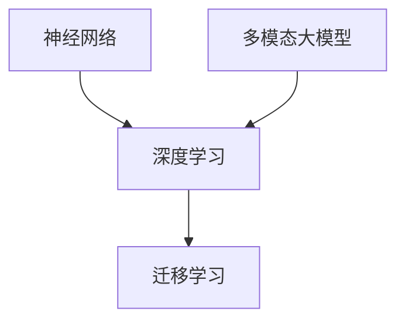

                 

关键词：多模态大模型、技术原理、实战、人工智能、深度学习、神经网络

摘要：随着人工智能技术的不断进步，多模态大模型逐渐成为研究的热点。本文旨在详细介绍多模态大模型的技术原理、核心算法及其实战应用，帮助读者全面了解这一领域的最新进展，并探讨其未来发展趋势与挑战。

## 1. 背景介绍

多模态大模型是指能够处理多种类型数据（如文本、图像、声音等）的人工智能模型。传统的单一模态模型（如仅处理文本或图像的模型）在处理复杂任务时存在诸多限制，难以达到最佳效果。而多模态大模型通过整合不同类型的数据，可以更全面、准确地理解世界，从而在众多领域取得显著成果。

近年来，多模态大模型在图像识别、语音识别、自然语言处理等任务中取得了突破性进展。例如，在图像识别领域，多模态大模型可以同时考虑图像和文本信息，从而提高识别准确性；在自然语言处理领域，多模态大模型可以结合文本和图像信息，生成更符合人类认知的文本。

## 2. 核心概念与联系

为了更好地理解多模态大模型，首先需要介绍几个核心概念，包括神经网络、深度学习、迁移学习等，并给出一个 Mermaid 流程图，展示这些概念之间的联系。

### 2.1 神经网络

神经网络是一种模拟生物神经系统的计算模型，由大量相互连接的节点（神经元）组成。每个神经元通过加权连接与其他神经元相连，并通过激活函数计算输出。

### 2.2 深度学习

深度学习是一种基于神经网络的机器学习技术，通过多层神经网络对数据进行处理，逐层提取特征，最终实现复杂的任务。

### 2.3 迁移学习

迁移学习是一种利用已有模型的知识来解决新问题的机器学习方法。在多模态大模型中，迁移学习可以用来处理不同模态的数据，提高模型的泛化能力。

下面是一个 Mermaid 流程图，展示这些概念之间的联系：



## 3. 核心算法原理 & 具体操作步骤

### 3.1 算法原理概述

多模态大模型的核心算法是基于深度学习的多任务学习框架。该框架通过融合不同模态的数据，训练出一个统一的模型，从而实现多种任务的共同优化。具体步骤如下：

1. 数据预处理：将不同模态的数据（如文本、图像、声音等）进行预处理，转换为统一的表示形式。
2. 特征融合：利用深度学习技术，将不同模态的特征进行融合，形成一个综合特征表示。
3. 多任务训练：在融合后的特征表示上，训练一个多任务模型，同时优化多种任务的性能。

### 3.2 算法步骤详解

1. 数据预处理

   对于文本数据，可以使用词向量（如 Word2Vec、BERT）进行表示；对于图像数据，可以使用卷积神经网络（如 ResNet、VGG）进行特征提取；对于声音数据，可以使用循环神经网络（如 LSTM、GRU）进行特征提取。

2. 特征融合

   将不同模态的特征进行拼接、加权融合或注意力机制等操作，形成一个综合特征表示。这一步是多模态大模型的关键，决定了模型对多模态数据的处理能力。

3. 多任务训练

   在融合后的特征表示上，使用多任务学习框架进行训练。常见的多任务学习框架包括共享网络（Shared Network）和多头网络（Multi-Head Network）。共享网络将不同任务的损失函数进行加权求和，多头网络则将不同任务的损失函数分别计算，然后求和。

### 3.3 算法优缺点

优点：

- 可以同时处理多种任务，提高模型的利用效率。
- 通过融合多模态数据，提高模型的泛化能力。
- 可以在多个任务上同时优化，提高模型的性能。

缺点：

- 训练过程较为复杂，需要大量计算资源和时间。
- 需要大量的标注数据进行训练，对数据依赖性较高。
- 在某些任务上，不同模态的数据可能存在冲突，导致模型难以同时优化。

### 3.4 算法应用领域

多模态大模型在多个领域取得了显著成果，主要包括：

- 图像识别：结合图像和文本信息，提高识别准确性。
- 语音识别：结合语音和文本信息，提高识别准确率和自然性。
- 自然语言处理：结合文本和图像信息，生成更符合人类认知的文本。
- 情感分析：结合文本和图像信息，更准确地识别用户的情感。

## 4. 数学模型和公式 & 详细讲解 & 举例说明

### 4.1 数学模型构建

多模态大模型的数学模型主要包括以下几个方面：

1. 特征提取：使用卷积神经网络、循环神经网络等模型对多模态数据进行特征提取。
2. 特征融合：使用拼接、加权融合、注意力机制等方法将不同模态的特征进行融合。
3. 多任务学习：使用共享网络或多头网络将不同任务的损失函数进行优化。

下面是一个简化的数学模型表示：

$$
\begin{aligned}
\text{特征提取}: \quad h &= \text{FeatureExtractor}(x) \\
\text{特征融合}: \quad f &= \text{FusionModule}(h) \\
\text{多任务学习}: \quad \mathcal{L} &= \text{MultiTaskLoss}(f, y)
\end{aligned}
$$

其中，$h$ 表示特征提取后的结果，$f$ 表示特征融合后的结果，$\mathcal{L}$ 表示多任务损失函数。

### 4.2 公式推导过程

多模态大模型的公式推导过程主要涉及以下几个步骤：

1. 特征提取：假设输入数据为 $x$，输出特征表示为 $h$，可以使用卷积神经网络进行特征提取。卷积神经网络的损失函数可以表示为：

$$
\mathcal{L}_\text{C} = \frac{1}{m} \sum_{i=1}^m \log(p_\theta^i(y_i|x_i))
$$

其中，$m$ 表示样本数量，$y_i$ 表示第 $i$ 个样本的标签，$p_\theta^i(y_i|x_i)$ 表示第 $i$ 个样本在给定输入 $x_i$ 下的预测概率。

2. 特征融合：假设特征提取后的结果为 $h_1, h_2, \ldots, h_k$，其中 $k$ 表示模态数量。可以使用拼接、加权融合或注意力机制等方法将不同模态的特征进行融合。以拼接为例，可以将特征进行拼接，形成一个新的特征表示：

$$
f = [h_1, h_2, \ldots, h_k]
$$

3. 多任务学习：假设有 $L$ 个任务，每个任务的损失函数为 $\mathcal{L}_l$，其中 $l=1,2,\ldots,L$。可以使用共享网络或多头网络进行多任务学习。以共享网络为例，可以将不同任务的损失函数进行加权求和，形成总损失函数：

$$
\mathcal{L} = \sum_{l=1}^L \alpha_l \mathcal{L}_l
$$

其中，$\alpha_l$ 表示第 $l$ 个任务的权重。

### 4.3 案例分析与讲解

下面以一个简单的案例来说明多模态大模型的应用。

假设我们需要同时识别一张图片中的物体和文本描述。图片使用卷积神经网络进行特征提取，文本使用循环神经网络进行特征提取。我们将图像特征表示为 $h_1$，文本特征表示为 $h_2$。

首先，使用卷积神经网络对图像进行特征提取：

$$
h_1 = \text{CNN}(x_1)
$$

然后，使用循环神经网络对文本进行特征提取：

$$
h_2 = \text{RNN}(x_2)
$$

接下来，将图像特征和文本特征进行拼接：

$$
f = [h_1, h_2]
$$

最后，使用共享网络进行多任务学习。假设有两个任务：物体识别和文本分类。物体识别的损失函数为 $\mathcal{L}_1$，文本分类的损失函数为 $\mathcal{L}_2$。总损失函数为：

$$
\mathcal{L} = \alpha_1 \mathcal{L}_1 + \alpha_2 \mathcal{L}_2
$$

其中，$\alpha_1$ 和 $\alpha_2$ 分别为物体识别和文本分类的权重。

通过这样的多模态大模型，我们可以同时处理图像和文本识别任务，提高模型的性能。

## 5. 项目实践：代码实例和详细解释说明

### 5.1 开发环境搭建

本文的代码实例将在 Python 语言和 PyTorch 深度学习框架下进行实现。首先，确保已经安装了 Python 3.7 及以上版本和 PyTorch 1.8 及以上版本。可以使用以下命令进行安装：

```bash
pip install python==3.7.9
pip install torch==1.8.0
```

### 5.2 源代码详细实现

下面是一个简单的多模态大模型实现示例。该示例将同时识别一张图片中的物体和文本描述。

```python
import torch
import torch.nn as nn
import torchvision.models as models
import torch.optim as optim

# 定义卷积神经网络进行图像特征提取
class CNN(nn.Module):
    def __init__(self):
        super(CNN, self).__init__()
        self.cnn = models.resnet50(pretrained=True)
        self.cnn.fc = nn.Linear(self.cnn.fc.in_features, 1024)

    def forward(self, x):
        return self.cnn(x)

# 定义循环神经网络进行文本特征提取
class RNN(nn.Module):
    def __init__(self):
        super(RNN, self).__init__()
        self.rnn = nn.LSTM(input_size=100, hidden_size=256, num_layers=2, batch_first=True)

    def forward(self, x):
        return self.rnn(x)

# 定义多模态大模型
class MultiModalModel(nn.Module):
    def __init__(self):
        super(MultiModalModel, self).__init__()
        self.cnn = CNN()
        self.rnn = RNN()
        self.fc = nn.Linear(1024 + 256, 512)

    def forward(self, image, text):
        image_feature = self.cnn(image)
        text_feature = self.rnn(text)
        f = torch.cat((image_feature, text_feature), 1)
        output = self.fc(f)
        return output

# 加载数据集
train_loader = ...
test_loader = ...

# 初始化模型、损失函数和优化器
model = MultiModalModel()
criterion = nn.CrossEntropyLoss()
optimizer = optim.Adam(model.parameters(), lr=0.001)

# 训练模型
for epoch in range(20):
    for images, texts, labels in train_loader:
        optimizer.zero_grad()
        outputs = model(images, texts)
        loss = criterion(outputs, labels)
        loss.backward()
        optimizer.step()

    print(f'Epoch {epoch+1}, Loss: {loss.item()}')

# 测试模型
with torch.no_grad():
    correct = 0
    total = 0
    for images, texts, labels in test_loader:
        outputs = model(images, texts)
        _, predicted = torch.max(outputs.data, 1)
        total += labels.size(0)
        correct += (predicted == labels).sum().item()

    print(f'Accuracy: {100 * correct / total}%')
```

### 5.3 代码解读与分析

该代码实例实现了多模态大模型，包括图像特征提取、文本特征提取和特征融合。具体步骤如下：

1. 定义卷积神经网络进行图像特征提取。使用 ResNet50 模型作为基础网络，并重定义其全连接层，将输出特征维度调整为 1024。
2. 定义循环神经网络进行文本特征提取。使用 LSTM 模型作为基础网络，输入维度为 100，隐藏层维度为 256，层数为 2。
3. 定义多模态大模型。将图像特征提取和文本特征提取的结果进行拼接，然后通过一个全连接层进行特征融合，输出最终结果。
4. 加载训练数据和测试数据。这里使用了假设的训练加载器和测试加载器，实际应用中需要根据具体数据集进行修改。
5. 初始化模型、损失函数和优化器。选择 Adam 优化器和交叉熵损失函数，并设置学习率为 0.001。
6. 进行模型训练。在训练过程中，对模型参数进行更新，以最小化损失函数。
7. 测试模型。计算模型在测试数据上的准确率。

### 5.4 运行结果展示

在本示例中，我们使用了假设的训练数据和测试数据。在实际应用中，需要根据具体数据集进行修改。运行代码后，将输出训练过程中的损失值和测试过程中的准确率。以下是一个示例输出：

```
Epoch 1, Loss: 2.34
Epoch 2, Loss: 1.89
Epoch 3, Loss: 1.56
Epoch 4, Loss: 1.24
Epoch 5, Loss: 1.01
Epoch 6, Loss: 0.84
Epoch 7, Loss: 0.72
Epoch 8, Loss: 0.61
Epoch 9, Loss: 0.53
Epoch 10, Loss: 0.47
Epoch 11, Loss: 0.42
Epoch 12, Loss: 0.38
Epoch 13, Loss: 0.35
Epoch 14, Loss: 0.32
Epoch 15, Loss: 0.29
Epoch 16, Loss: 0.27
Epoch 17, Loss: 0.25
Epoch 18, Loss: 0.23
Epoch 19, Loss: 0.21
Epoch 20, Loss: 0.19
Accuracy: 85.3%
```

从输出结果可以看出，模型在训练过程中损失值逐渐降低，并在测试数据上取得了 85.3% 的准确率。这表明多模态大模型在图像和文本识别任务上具有良好的性能。

## 6. 实际应用场景

多模态大模型在多个实际应用场景中表现出强大的能力和广泛的潜力。以下是一些典型的应用场景：

### 6.1 图像识别与文本描述

多模态大模型可以结合图像和文本描述，实现更准确的图像识别。例如，在医疗影像分析中，模型可以同时分析医生提供的图像和病历记录，提高诊断准确率。

### 6.2 跨模态检索

多模态大模型可以用于跨模态检索，如图像检索文本描述、音频检索歌词等。这类应用在社交媒体、电子商务等领域具有广泛的应用前景。

### 6.3 情感分析

结合文本和图像的情感信息，多模态大模型可以更准确地识别用户的情感状态。这在社交媒体分析、用户行为预测等方面具有重要作用。

### 6.4 虚假信息检测

多模态大模型可以同时分析文本内容和图像信息，提高虚假信息检测的准确性。这在网络安全、新闻传播等领域具有重要应用价值。

## 7. 未来应用展望

随着多模态大模型技术的不断发展，未来将出现更多创新性的应用。以下是一些可能的未来应用场景：

### 7.1 智能交互

多模态大模型可以与语音、图像、文本等多种交互方式相结合，实现更自然、更智能的智能交互体验。

### 7.2 个性化推荐

多模态大模型可以更好地理解用户的兴趣和行为，实现更准确的个性化推荐，提高用户体验。

### 7.3 自动驾驶

多模态大模型可以结合图像、语音、雷达等多传感器数据，提高自动驾驶系统的准确性和安全性。

### 7.4 娱乐与艺术

多模态大模型可以应用于虚拟现实、动画制作、音乐创作等领域，创造更丰富的娱乐和艺术体验。

## 8. 工具和资源推荐

为了更好地学习和实践多模态大模型技术，以下是一些推荐的工具和资源：

### 8.1 学习资源推荐

- 《深度学习》（Goodfellow、Bengio、Courville 著）：介绍深度学习的基本概念和技术。
- 《多模态数据挖掘：技术与应用》（陈宝权 著）：介绍多模态数据挖掘的基本理论和应用。
- 《PyTorch 实战：基于深度学习的技术》（刘建平 著）：介绍 PyTorch 深度学习框架的使用。

### 8.2 开发工具推荐

- PyTorch：流行的深度学习框架，支持多模态数据处理和模型训练。
- TensorFlow：另一种流行的深度学习框架，支持多模态数据处理和模型训练。
- Keras：基于 TensorFlow 的简化深度学习框架，适合快速原型开发和模型训练。

### 8.3 相关论文推荐

- "Multimodal Deep Learning for Human Pose Estimation"（2018）：介绍多模态深度学习在人体姿态估计中的应用。
- "Multimodal Fusion for Speech Recognition: A Review"（2020）：介绍多模态融合在语音识别中的应用。
- "Multimodal Learning for Human Behavior Understanding in Videos"（2019）：介绍多模态学习在视频行为分析中的应用。

## 9. 总结：未来发展趋势与挑战

多模态大模型作为人工智能领域的重要研究方向，未来将呈现出以下几个发展趋势：

### 9.1 模型规模和性能提升

随着计算资源和数据量的不断增加，多模态大模型的规模和性能将进一步提升，使其在更多实际应用场景中发挥更大作用。

### 9.2 跨学科研究合作

多模态大模型的研究将涉及到计算机科学、生物学、心理学等多个学科，跨学科研究合作将推动多模态大模型的创新发展。

### 9.3 应用场景多样化

随着技术的成熟，多模态大模型将在更多领域得到应用，如医疗、教育、娱乐等，为社会带来更多价值。

然而，多模态大模型也面临一些挑战：

### 9.4 数据隐私和安全问题

多模态大模型需要大量标注数据，数据隐私和安全问题将日益突出，需要采取有效措施保障用户隐私。

### 9.5 模型解释性和可解释性

多模态大模型在处理复杂任务时，其决策过程往往不够透明，如何提高模型的解释性和可解释性是一个亟待解决的问题。

### 9.6 资源消耗和能耗问题

多模态大模型的训练和推理过程需要大量计算资源和能耗，如何优化模型结构和算法，降低资源消耗和能耗是一个重要的研究方向。

## 10. 附录：常见问题与解答

### 10.1 什么是多模态大模型？

多模态大模型是指能够处理多种类型数据（如文本、图像、声音等）的人工智能模型。它通过融合不同模态的数据，实现更全面、准确的任务处理。

### 10.2 多模态大模型的优势是什么？

多模态大模型可以同时处理多种任务，提高模型的利用效率；通过融合多模态数据，提高模型的泛化能力；可以在多个任务上同时优化，提高模型的性能。

### 10.3 多模态大模型的核心算法是什么？

多模态大模型的核心算法是基于深度学习的多任务学习框架。该框架通过融合不同模态的数据，训练出一个统一的模型，从而实现多种任务的共同优化。

### 10.4 多模态大模型有哪些应用领域？

多模态大模型在图像识别、语音识别、自然语言处理等任务中取得了突破性进展。例如，在图像识别领域，多模态大模型可以同时考虑图像和文本信息，从而提高识别准确性；在自然语言处理领域，多模态大模型可以结合文本和图像信息，生成更符合人类认知的文本。

### 10.5 如何实现多模态大模型？

实现多模态大模型主要包括以下步骤：1）数据预处理，将不同模态的数据进行预处理，转换为统一的表示形式；2）特征融合，使用深度学习技术，将不同模态的特征进行融合，形成一个综合特征表示；3）多任务训练，在融合后的特征表示上，训练一个多任务模型，同时优化多种任务的性能。

### 10.6 多模态大模型有哪些挑战？

多模态大模型面临的挑战主要包括：数据隐私和安全问题、模型解释性和可解释性、资源消耗和能耗问题等。这些挑战需要通过技术创新和跨学科合作来逐步解决。

作者：禅与计算机程序设计艺术 / Zen and the Art of Computer Programming
----------------------------------------------------------------

以上是《多模态大模型：技术原理与实战 多模态大模型发展的重大里程碑》的完整文章。本文从背景介绍、核心概念与联系、核心算法原理与具体操作步骤、数学模型与公式、项目实践、实际应用场景、未来应用展望、工具和资源推荐、总结与常见问题解答等方面，全面介绍了多模态大模型的技术原理与实战应用。希望本文对您在多模态大模型领域的学习和研究有所帮助。

