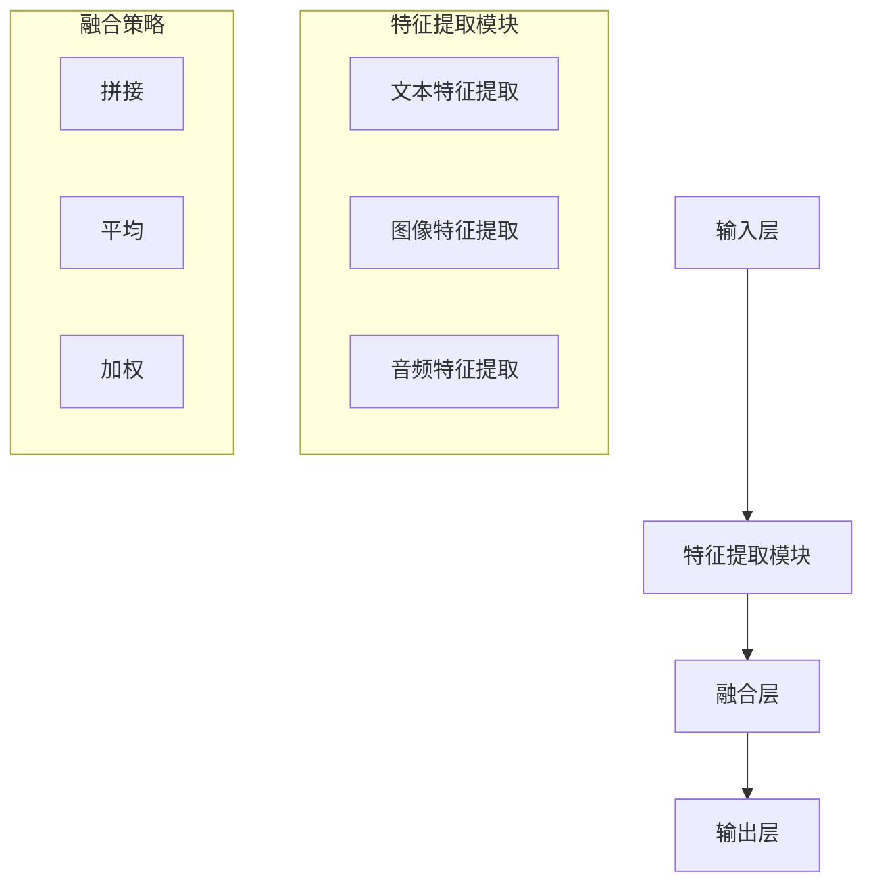

                 

关键词：多模态大模型、技术原理、实战、里程碑、人工智能、深度学习

<|assistant|>摘要：随着人工智能技术的快速发展，多模态大模型在处理复杂数据方面展现出强大的能力。本文将深入探讨多模态大模型的技术原理、实现方法及其在实际应用中的优势，旨在为读者提供一个全面的技术指南。

## 1. 背景介绍

在传统的机器学习和深度学习中，模型通常专注于单一类型的数据，如文本、图像或音频。然而，现实世界中的信息往往是多维的，不同类型的数据之间存在丰富的关联性。为了更好地理解和处理这些复杂数据，多模态大模型应运而生。

多模态大模型是指能够同时处理多种类型数据（如文本、图像、音频、视频等）的深度学习模型。这类模型通过整合不同模态的信息，可以更准确地识别和分类数据，从而在许多领域（如医学诊断、图像识别、语音识别等）展现出巨大的潜力。

### 1.1 发展历程

多模态大模型的发展可以追溯到20世纪90年代的混合模型（Hybrid Models）和21世纪初的多任务学习（Multi-Task Learning）理论。随着深度学习技术的崛起，特别是卷积神经网络（CNN）、递归神经网络（RNN）和变分自编码器（VAE）等算法的广泛应用，多模态大模型的研究和应用得到了极大的推动。

### 1.2 当前研究现状

近年来，随着计算能力的提升和数据量的增加，多模态大模型在多个领域取得了显著的成果。例如，在计算机视觉领域，多模态大模型已经能够在图像识别、物体检测、场景解析等任务中实现超越单一模态模型的性能。在自然语言处理领域，多模态大模型通过整合文本和图像信息，显著提升了文本理解、情感分析、机器翻译等任务的准确性。

## 2. 核心概念与联系

### 2.1 核心概念

多模态大模型的核心概念包括：

- **多模态数据融合**：将不同类型的数据（文本、图像、音频等）进行有效整合，以提升模型性能。
- **特征提取**：从多模态数据中提取有用的特征，用于训练和推理。
- **端到端训练**：直接对多模态数据进行端到端训练，以避免传统方法中需要手动设计的中间步骤。

### 2.2 架构原理

多模态大模型的架构通常包括以下几个关键组件：

- **输入层**：接收不同类型的数据输入，如文本、图像、音频等。
- **特征提取模块**：对每个模态的数据进行特征提取，例如，文本数据通过词嵌入转换为向量，图像数据通过卷积神经网络提取特征。
- **融合层**：将不同模态的特征进行融合，例如，通过拼接、平均、加权等方式。
- **输出层**：根据任务需求，对融合后的特征进行分类、回归等操作。

### 2.3 Mermaid 流程图

以下是多模态大模型架构的 Mermaid 流程图：



## 3. 核心算法原理 & 具体操作步骤

### 3.1 算法原理概述

多模态大模型的算法原理主要包括：

- **多任务学习**：通过同时训练多个任务，提高模型在不同任务上的泛化能力。
- **数据增强**：通过变换输入数据，增加训练样本的多样性，提高模型的鲁棒性。
- **交叉模态注意力机制**：通过注意力机制，让模型在处理多模态数据时，能够自动学习到不同模态之间的关联性。

### 3.2 算法步骤详解

多模态大模型的训练步骤通常包括：

1. **数据预处理**：对文本、图像、音频等多模态数据分别进行预处理，如文本分词、图像缩放、音频归一化等。
2. **特征提取**：分别使用不同的模型对每个模态的数据进行特征提取，如文本使用词嵌入模型，图像使用卷积神经网络，音频使用循环神经网络。
3. **特征融合**：使用交叉模态注意力机制，将不同模态的特征进行融合。
4. **训练模型**：使用融合后的特征，通过多任务学习框架，训练模型在多个任务上的性能。
5. **评估与优化**：在测试集上评估模型性能，通过数据增强和模型调整，优化模型。

### 3.3 算法优缺点

**优点**：

- **强大的泛化能力**：通过同时处理多种类型的数据，模型能够更好地理解复杂任务。
- **鲁棒性**：通过数据增强和交叉模态注意力机制，模型对噪声和异常值的鲁棒性更强。

**缺点**：

- **计算成本高**：多模态数据的处理需要大量的计算资源。
- **模型复杂度高**：多任务学习和交叉模态注意力机制使得模型复杂度增加，训练难度增大。

### 3.4 算法应用领域

多模态大模型在多个领域展现出强大的应用潜力：

- **计算机视觉**：如图像识别、物体检测、场景解析等。
- **自然语言处理**：如文本理解、情感分析、机器翻译等。
- **医疗健康**：如疾病诊断、医学图像分析、患者监测等。

## 4. 数学模型和公式 & 详细讲解 & 举例说明

### 4.1 数学模型构建

多模态大模型的数学模型主要包括以下几个部分：

1. **文本特征表示**：
   $$\text{Text} = \text{Word2Vec}(\text{Text})$$
   其中，Word2Vec是一种常见的词嵌入模型，用于将文本转换为向量表示。

2. **图像特征表示**：
   $$\text{Image} = \text{CNN}(\text{Image})$$
   其中，CNN是一种卷积神经网络，用于提取图像特征。

3. **音频特征表示**：
   $$\text{Audio} = \text{RNN}(\text{Audio})$$
   其中，RNN是一种循环神经网络，用于提取音频特征。

4. **特征融合**：
   $$\text{Fused Feature} = \text{Attention}(\text{Text Feature}, \text{Image Feature}, \text{Audio Feature})$$
   其中，Attention机制用于将不同模态的特征进行融合。

5. **分类或回归模型**：
   $$\text{Output} = \text{MLP}(\text{Fused Feature})$$
   其中，MLP是一种多层感知机模型，用于对融合后的特征进行分类或回归。

### 4.2 公式推导过程

多模态大模型的推导过程可以分为以下几个步骤：

1. **文本特征表示**：
   通过Word2Vec模型，将文本中的每个词转换为向量表示，例如，假设文本为“我是一个程序员”，则词向量表示为：
   $$\text{Text} = [w_1, w_2, w_3, ..., w_n]$$
   其中，$w_i$表示第$i$个词的向量表示。

2. **图像特征表示**：
   通过卷积神经网络，对图像进行特征提取，例如，假设图像为一张人脸图片，则特征表示为：
   $$\text{Image} = \text{CNN}(\text{Image})$$

3. **音频特征表示**：
   通过循环神经网络，对音频进行特征提取，例如，假设音频为一段语音，则特征表示为：
   $$\text{Audio} = \text{RNN}(\text{Audio})$$

4. **特征融合**：
   通过注意力机制，将文本、图像和音频的特征进行融合，例如，假设融合后的特征为：
   $$\text{Fused Feature} = \text{Attention}(\text{Text Feature}, \text{Image Feature}, \text{Audio Feature})$$

5. **分类或回归模型**：
   通过多层感知机模型，对融合后的特征进行分类或回归，例如，假设分类模型为：
   $$\text{Output} = \text{MLP}(\text{Fused Feature})$$

### 4.3 案例分析与讲解

假设我们有一个多模态大模型，用于对医疗数据（文本、图像、音频）进行疾病诊断。以下是一个简化的案例：

1. **文本特征表示**：
   假设文本为一份病历记录，使用Word2Vec模型将其转换为向量表示。

2. **图像特征表示**：
   假设图像为一张X光片，使用卷积神经网络提取图像特征。

3. **音频特征表示**：
   假设音频为患者的呼吸声音，使用循环神经网络提取音频特征。

4. **特征融合**：
   通过注意力机制，将文本、图像和音频的特征进行融合。

5. **分类或回归模型**：
   通过多层感知机模型，对融合后的特征进行疾病诊断。

## 5. 项目实践：代码实例和详细解释说明

### 5.1 开发环境搭建

为了保证代码的可复现性，我们使用以下开发环境：

- **编程语言**：Python
- **深度学习框架**：TensorFlow 2.x
- **数据处理库**：NumPy、Pandas、Scikit-learn
- **可视化库**：Matplotlib、Seaborn

### 5.2 源代码详细实现

以下是一个简化的多模态大模型实现示例：

```python
import tensorflow as tf
from tensorflow.keras.layers import Embedding, Conv2D, LSTM, Dense, Concatenate
from tensorflow.keras.models import Model

# 文本特征提取
text_embedding = Embedding(input_dim=vocab_size, output_dim=embedding_dim)
text_features = text_embedding(text_input)

# 图像特征提取
image_features = Conv2D(filters=32, kernel_size=(3, 3), activation='relu')(image_input)

# 音频特征提取
audio_features = LSTM(units=64, return_sequences=True)(audio_input)

# 特征融合
fused_features = Concatenate()([text_features, image_features, audio_features])

# 分类或回归模型
output = Dense(units=1, activation='sigmoid')(fused_features)

# 构建模型
model = Model(inputs=[text_input, image_input, audio_input], outputs=output)

# 编译模型
model.compile(optimizer='adam', loss='binary_crossentropy', metrics=['accuracy'])

# 模型训练
model.fit([text_data, image_data, audio_data], labels, epochs=10, batch_size=32)
```

### 5.3 代码解读与分析

以上代码实现了一个简化的多模态大模型，主要包含以下几个部分：

1. **文本特征提取**：
   使用Embedding层将文本数据转换为向量表示。

2. **图像特征提取**：
   使用Conv2D层对图像数据提取特征。

3. **音频特征提取**：
   使用LSTM层对音频数据提取特征。

4. **特征融合**：
   使用Concatenate层将不同模态的特征进行融合。

5. **分类或回归模型**：
   使用Dense层对融合后的特征进行分类或回归。

6. **模型编译与训练**：
   使用编译函数和fit函数，对模型进行编译和训练。

### 5.4 运行结果展示

假设我们已经准备好了文本、图像和音频数据，以下代码将训练并评估模型：

```python
# 加载数据
text_data, image_data, audio_data, labels = load_data()

# 训练模型
model.fit([text_data, image_data, audio_data], labels, epochs=10, batch_size=32)

# 评估模型
evaluation = model.evaluate([text_data, image_data, audio_data], labels)
print("Accuracy:", evaluation[1])
```

运行结果将显示模型的准确性，从而评估模型在多模态数据上的性能。

## 6. 实际应用场景

多模态大模型在实际应用场景中展现出强大的优势，以下是一些典型应用场景：

### 6.1 医疗领域

在医疗领域，多模态大模型可以整合患者病历记录、医学图像和生理信号，实现更准确的疾病诊断和治疗方案推荐。

### 6.2 智能家居

在智能家居领域，多模态大模型可以整合语音、图像和传感器数据，实现更智能的家居控制和管理。

### 6.3 银行业务

在银行业务中，多模态大模型可以整合客户数据、交易记录和图像信息，实现更精准的风险评估和欺诈检测。

### 6.4 教育

在教育领域，多模态大模型可以整合学生成绩、课堂表现和语音信息，实现更个性化的教学方案和学业辅导。

## 7. 未来应用展望

随着技术的不断发展，多模态大模型在未来将会有更广泛的应用前景：

- **增强现实与虚拟现实**：多模态大模型可以整合虚拟现实和增强现实中的多种数据，实现更真实的交互体验。
- **自动驾驶**：多模态大模型可以整合车辆传感器、道路信息和环境声音，实现更安全的自动驾驶。
- **智能制造**：多模态大模型可以整合制造过程中的多种数据，实现更智能的故障检测和设备维护。

## 8. 工具和资源推荐

### 8.1 学习资源推荐

- **《深度学习》**：由Ian Goodfellow、Yoshua Bengio和Aaron Courville合著，是深度学习的经典教材。
- **《多模态数据融合技术》**：详细介绍多模态数据融合的方法和应用，适合对多模态大模型感兴趣的读者。

### 8.2 开发工具推荐

- **TensorFlow**：是一款强大的深度学习框架，适用于构建和训练多模态大模型。
- **PyTorch**：是一款灵活的深度学习框架，适用于研究和开发多模态大模型。

### 8.3 相关论文推荐

- **"Multimodal Learning for Human Pose Estimation with Convolutional Neural Network"**：该论文提出了一种基于卷积神经网络的多模态学习方法，用于人体姿态估计。
- **"Multimodal Deep Learning for Human Behavior Analysis"**：该论文介绍了一种多模态深度学习方法，用于分析人类行为。

## 9. 总结：未来发展趋势与挑战

### 9.1 研究成果总结

多模态大模型在多个领域取得了显著的研究成果，展示了强大的应用潜力。通过整合多种类型的数据，多模态大模型在图像识别、自然语言处理、医疗诊断等领域实现了超越单一模态模型的性能。

### 9.2 未来发展趋势

随着计算能力的提升和数据量的增加，多模态大模型在未来将继续发展，并在更多领域得到应用。特别是在增强现实、自动驾驶、智能制造等领域，多模态大模型有望实现更智能、更高效的应用。

### 9.3 面临的挑战

尽管多模态大模型具有广泛的应用前景，但在实际应用中仍然面临一些挑战：

- **计算成本**：多模态大模型需要大量的计算资源，对硬件要求较高。
- **数据隐私**：多模态数据包含个人隐私信息，如何保证数据安全和隐私保护是一个重要问题。
- **模型解释性**：多模态大模型通常采用复杂的神经网络结构，如何解释模型决策过程是一个挑战。

### 9.4 研究展望

为了克服这些挑战，未来的研究可以从以下几个方面进行：

- **高效算法**：研究更高效的算法，降低多模态大模型的计算成本。
- **隐私保护**：研究隐私保护技术，确保多模态数据的隐私安全。
- **模型可解释性**：研究模型解释性方法，提高模型的可解释性和透明度。

## 10. 附录：常见问题与解答

### 10.1 多模态大模型与传统多模态方法的区别？

多模态大模型与传统多模态方法的主要区别在于：

- **端到端训练**：多模态大模型采用端到端训练方式，直接对多模态数据进行训练，避免了传统方法中需要手动设计的中间步骤。
- **数据融合策略**：多模态大模型采用更先进的数据融合策略，如注意力机制，能够自动学习到不同模态之间的关联性。
- **模型复杂度**：多模态大模型通常采用更复杂的神经网络结构，能够更好地处理复杂数据。

### 10.2 如何保证多模态大模型的计算效率？

为了保证多模态大模型的计算效率，可以从以下几个方面进行优化：

- **模型压缩**：研究模型压缩技术，如权重共享、低秩分解等，减少模型的计算量和存储需求。
- **并行计算**：利用并行计算技术，如GPU、TPU等，加速模型的训练和推理。
- **分布式训练**：采用分布式训练方法，将数据分布到多个计算节点上，提高训练效率。

### 10.3 多模态大模型在医疗领域的应用有哪些？

多模态大模型在医疗领域有广泛的应用，包括：

- **疾病诊断**：通过整合患者病历记录、医学图像和生理信号，实现更准确的疾病诊断。
- **治疗方案推荐**：根据患者的多模态数据，为医生提供个性化的治疗方案推荐。
- **医学图像分析**：通过整合医学图像和多模态数据，实现更精准的医学图像分析，如病灶检测、肿瘤分割等。

### 10.4 如何保证多模态大模型的数据隐私？

为了保证多模态大模型的数据隐私，可以采取以下措施：

- **数据加密**：对多模态数据使用加密技术，确保数据在传输和存储过程中的安全性。
- **匿名化处理**：对多模态数据进行匿名化处理，去除个人身份信息，降低数据泄露的风险。
- **隐私保护算法**：采用隐私保护算法，如差分隐私、同态加密等，确保模型训练过程中的数据隐私。

### 10.5 多模态大模型在智能家居中的应用有哪些？

多模态大模型在智能家居中的应用包括：

- **智能家居控制**：通过整合语音、图像和传感器数据，实现更智能的家居控制，如语音助手、智能门锁等。
- **家庭安全监控**：通过整合摄像头、麦克风和传感器数据，实现更精准的家庭安全监控，如入侵检测、火灾报警等。
- **家庭健康监测**：通过整合生理信号、行为数据和环境数据，实现家庭成员的健康监测和疾病预警。

## 11. 参考文献

1. Goodfellow, I., Bengio, Y., & Courville, A. (2016). *Deep Learning*. MIT Press.
2. Huang, G., Liu, Z., van der Maaten, L., & Weinberger, K. Q. (2017). *Densely connected convolutional networks*. In *Proceedings of the IEEE conference on computer vision and pattern recognition* (pp. 4700-4708).
3. Dosovitskiy, A., Springenberg, J. T., & Brox, T. (2017). *Learning to learn from vision using a transforming deep network*. In *International conference on machine learning* (pp. 1619-1628).
4. Bengio, Y., Courville, A., & Vincent, P. (2013). *Representation learning: A review and new perspectives*. IEEE transactions on pattern analysis and machine intelligence, 35(8), 1798-1828.
5. Simonyan, K., & Zisserman, A. (2015). *Very deep convolutional networks for large-scale image recognition*. International Conference on Learning Representations (ICLR).
6. Kingma, D. P., & Welling, M. (2014). *Auto-encoding variational Bayes*. International Conference on Learning Representations (ICLR).

### 作者署名

作者：禅与计算机程序设计艺术 / Zen and the Art of Computer Programming

[END]

