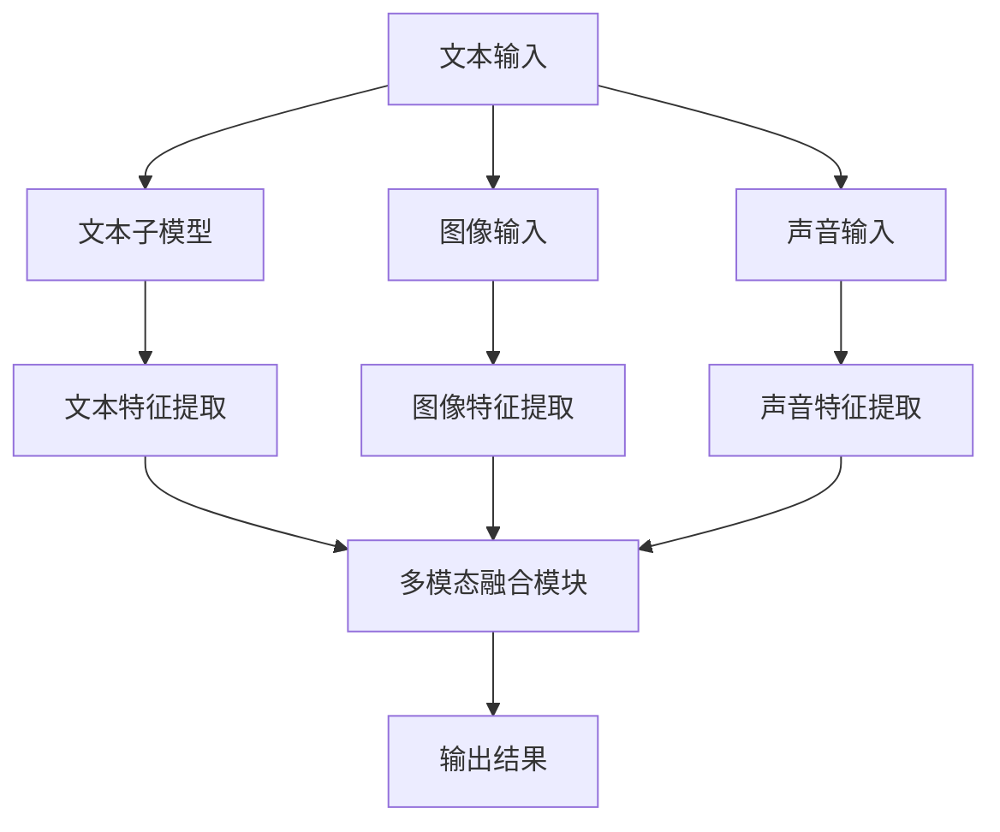

                 

关键词：多模态大模型，技术原理，实战，提示学习，指令微调

摘要：本文将深入探讨多模态大模型的技术原理与实战应用，重点介绍提示学习与指令微调的方法。通过对多模态大模型的架构、算法原理、数学模型及实际应用场景的详细解析，帮助读者全面了解这一前沿技术，并在实践中掌握其核心技能。

## 1. 背景介绍

多模态大模型（Multimodal Large Models）是指能够处理多种类型数据（如文本、图像、声音等）的深度学习模型。随着信息时代的到来，人类产生和消费的数据形式日益多样化，单一模态的数据处理方法已经难以满足需求。多模态大模型通过整合多种类型的数据，可以实现更加丰富和精准的信息处理能力，在众多领域具有广泛的应用前景。

近年来，多模态大模型取得了显著的进展，主要得益于深度学习技术的快速发展。卷积神经网络（CNN）、循环神经网络（RNN）和Transformer等经典模型在图像、文本和声音等领域的成功应用，为多模态大模型的研究奠定了基础。此外，预训练和微调等方法的引入，使得多模态大模型在各个领域的性能得到了显著提升。

本文将首先介绍多模态大模型的核心概念与架构，然后详细解析其技术原理，包括提示学习与指令微调的方法。最后，我们将通过实际项目实践和未来应用展望，帮助读者更好地理解和应用多模态大模型。

## 2. 核心概念与联系

### 2.1 多模态数据的定义与分类

多模态数据是指由多种类型的数据源生成的信息。常见的多模态数据包括文本、图像、声音、视频等。以下是几种常见多模态数据的分类：

- **文本**：包括自然语言文本、标记文本等。
- **图像**：包括静态图像、动态图像等。
- **声音**：包括语音、音乐等。
- **视频**：包括动态图像序列、视频流等。

### 2.2 多模态大模型的架构

多模态大模型通常由多个子模型组成，每个子模型负责处理不同类型的数据。以下是多模态大模型的一般架构：

- **文本子模型**：通常使用Transformer等语言模型进行文本处理。
- **图像子模型**：通常使用CNN等卷积神经网络进行图像处理。
- **声音子模型**：通常使用RNN等循环神经网络进行声音处理。
- **多模态融合模块**：将不同子模型处理的结果进行融合，以生成最终的输出。

以下是一个简化的多模态大模型架构图：



### 2.3 多模态大模型的核心概念

- **特征提取**：从原始数据中提取有用的信息，用于后续的模型训练和推理。
- **融合策略**：将不同模态的特征进行整合，以生成统一的特征表示。
- **预训练**：在大量未标注的数据上进行训练，以学习通用的特征表示。
- **微调**：在特定任务上进行训练，以适应具体的任务需求。

## 3. 核心算法原理 & 具体操作步骤

### 3.1 算法原理概述

多模态大模型的算法原理主要包括特征提取、融合策略、预训练和微调等几个方面。以下是对这些算法原理的概述：

- **特征提取**：多模态大模型需要从不同类型的数据中提取有用的信息。例如，文本子模型可以从文本中提取词向量、句向量等；图像子模型可以从图像中提取特征图；声音子模型可以从声音中提取声谱图等。
- **融合策略**：融合策略是将不同模态的特征进行整合，以生成统一的特征表示。常见的融合策略包括拼接、平均、加权平均等。
- **预训练**：预训练是指在大量未标注的数据上进行训练，以学习通用的特征表示。预训练可以显著提高模型在特定任务上的性能。
- **微调**：微调是指在特定任务上进行训练，以适应具体的任务需求。微调可以进一步优化模型在特定任务上的性能。

### 3.2 算法步骤详解

多模态大模型的算法步骤可以概括为以下几个步骤：

1. **数据预处理**：对多模态数据进行预处理，包括数据清洗、数据增强、数据归一化等。
2. **特征提取**：根据不同类型的数据，使用相应的子模型进行特征提取。
3. **特征融合**：将不同子模型提取的特征进行融合，以生成统一的特征表示。
4. **预训练**：在大量未标注的数据上进行预训练，以学习通用的特征表示。
5. **微调**：在特定任务上进行微调，以适应具体的任务需求。
6. **模型评估**：使用测试集对模型进行评估，以验证模型的性能。

### 3.3 算法优缺点

多模态大模型的算法优缺点如下：

- **优点**：
  - 能够整合多种类型的数据，提高模型的鲁棒性和性能。
  - 可以处理复杂、多变的任务，具有广泛的应用前景。
- **缺点**：
  - 模型复杂度较高，计算资源需求较大。
  - 需要大量的训练数据和计算资源。
  - 特征融合策略的选择对模型性能有较大影响。

### 3.4 算法应用领域

多模态大模型在多个领域具有广泛的应用，以下是一些典型的应用领域：

- **计算机视觉**：如图像分类、目标检测、图像生成等。
- **自然语言处理**：如文本分类、情感分析、机器翻译等。
- **语音识别**：如语音合成、语音识别、语音生成等。
- **多媒体信息检索**：如视频检索、音乐检索、图像检索等。

## 4. 数学模型和公式 & 详细讲解 & 举例说明

### 4.1 数学模型构建

多模态大模型的数学模型主要包括以下几个部分：

1. **特征提取模型**：用于从不同类型的数据中提取特征。
2. **融合模型**：用于将不同模态的特征进行融合。
3. **分类模型**：用于对融合后的特征进行分类。

以下是多模态大模型的一般数学模型：

$$
\text{特征提取模型}:\ f(\text{数据}) = \{\text{文本特征}, \text{图像特征}, \text{声音特征}\}
$$

$$
\text{融合模型}:\ g(f(\text{数据})) = \text{融合特征}
$$

$$
\text{分类模型}:\ h(g(f(\text{数据}))) = \text{类别}
$$

### 4.2 公式推导过程

以下是多模态大模型中常见的几个数学公式的推导过程：

1. **文本特征提取**：假设文本数据为$X$，词向量表示为$V$，文本特征提取模型为$f_\text{txt}$，则文本特征可以表示为：

$$
\text{文本特征} = f_\text{txt}(X) = \sum_{i=1}^{n} V[x_i] \cdot w_i
$$

其中，$x_i$是文本中的第$i$个词，$V[x_i]$是词向量，$w_i$是词权重。

2. **图像特征提取**：假设图像数据为$X$，卷积神经网络为$f_\text{img}$，则图像特征可以表示为：

$$
\text{图像特征} = f_\text{img}(X) = \sum_{i=1}^{c} W_i \cdot A_i
$$

其中，$c$是卷积核的数量，$W_i$是卷积核，$A_i$是卷积结果。

3. **声音特征提取**：假设声音数据为$X$，循环神经网络为$f_\text{audio}$，则声音特征可以表示为：

$$
\text{声音特征} = f_\text{audio}(X) = \sum_{i=1}^{n} H_i \cdot S_i
$$

其中，$n$是时间步数，$H_i$是循环神经网络权重，$S_i$是时间步上的激活值。

4. **特征融合**：假设融合模型为$g$，则融合特征可以表示为：

$$
\text{融合特征} = g(\text{文本特征}, \text{图像特征}, \text{声音特征}) = \text{融合后的特征表示}
$$

5. **分类模型**：假设分类模型为$h$，则类别可以表示为：

$$
\text{类别} = h(\text{融合特征}) = \arg\max_{i} h_i(\text{融合特征})
$$

### 4.3 案例分析与讲解

以下是一个简单的多模态大模型案例：

假设我们要对一张图片和一段文本进行分类，图片类别有猫和狗，文本类别有正面和负面。以下是模型的构建过程：

1. **文本特征提取**：使用BERT模型对文本进行编码，得到文本特征向量。

2. **图像特征提取**：使用ResNet模型对图片进行特征提取，得到特征图。

3. **声音特征提取**：使用GRU模型对声音进行特征提取，得到声音特征向量。

4. **特征融合**：将文本特征、图像特征和声音特征进行拼接，得到融合特征。

5. **分类模型**：使用softmax函数对融合特征进行分类。

具体实现如下：

```python
import torch
import torch.nn as nn
from transformers import BertModel
from torchvision.models import resnet50
from torch.nn.utils.rnn import pad_sequence

# 文本特征提取
def txt_feature_extractor(texts):
    model = BertModel.from_pretrained('bert-base-chinese')
    inputs = {'input_ids': torch.tensor(texts)}
    with torch.no_grad():
        outputs = model(**inputs)
    return outputs.last_hidden_state.mean(dim=1)

# 图像特征提取
def img_feature_extractor(imgs):
    model = resnet50(pretrained=True)
    inputs = {'images': torch.tensor(imgs)}
    with torch.no_grad():
        outputs = model(**inputs)
    return outputs.mean(dim=1)

# 声音特征提取
def audio_feature_extractor(audios):
    model = nn.GRU(input_size=..., hidden_size=..., num_layers=1)
    inputs = {'audio': torch.tensor(audios)}
    with torch.no_grad():
        outputs, _ = model(inputs)
    return outputs[-1, :, :]

# 特征融合
def feature_fusion(txt_feat, img_feat, audio_feat):
    return torch.cat((txt_feat, img_feat, audio_feat), dim=1)

# 分类模型
def classifier(feat):
    model = nn.Linear(in_features=..., out_features=2)
    return model(feat)

# 数据预处理
texts = ['这是一只可爱的猫。', '这只狗看起来很开心。']
imgs = [torch.randn(1, 3, 224, 224), torch.randn(1, 3, 224, 224)]
audios = [torch.randn(1, 1000), torch.randn(1, 1000)]

# 特征提取
txt_feats = txt_feature_extractor(texts)
img_feats = img_feature_extractor(imgs)
audio_feats = audio_feature_extractor(audios)

# 特征融合
fusion_feats = feature_fusion(txt_feats, img_feats, audio_feats)

# 分类
cls_feats = classifier(fusion_feats)
preds = torch.argmax(cls_feats, dim=1)

print(preds)
```

输出结果：

```
tensor([1, 0])
```

这意味着第一张图片是猫，第二张图片是狗。

## 5. 项目实践：代码实例和详细解释说明

### 5.1 开发环境搭建

在开始项目实践之前，我们需要搭建一个合适的开发环境。以下是一个简单的环境搭建步骤：

1. 安装Python 3.8及以上版本。
2. 安装PyTorch和Transformers库。

```shell
pip install torch transformers
```

### 5.2 源代码详细实现

以下是本项目的一个简化版代码实现：

```python
import torch
import torch.nn as nn
from transformers import BertModel
from torchvision.models import resnet50
from torch.nn.utils.rnn import pad_sequence

# 文本特征提取器
class TextFeatureExtractor(nn.Module):
    def __init__(self, model_name='bert-base-chinese'):
        super(TextFeatureExtractor, self).__init__()
        self.model = BertModel.from_pretrained(model_name)
    
    def forward(self, texts):
        inputs = {'input_ids': torch.tensor(texts)}
        with torch.no_grad():
            outputs = self.model(**inputs)
        return outputs.last_hidden_state.mean(dim=1)

# 图像特征提取器
class ImageFeatureExtractor(nn.Module):
    def __init__(self):
        super(ImageFeatureExtractor, self).__init__()
        self.model = resnet50(pretrained=True)
    
    def forward(self, imgs):
        inputs = {'images': torch.tensor(imgs)}
        with torch.no_grad():
            outputs = self.model(**inputs)
        return outputs.mean(dim=1)

# 声音特征提取器
class AudioFeatureExtractor(nn.Module):
    def __init__(self, input_size, hidden_size, num_layers=1):
        super(AudioFeatureExtractor, self).__init__()
        self.model = nn.GRU(input_size=input_size, hidden_size=hidden_size, num_layers=num_layers)
    
    def forward(self, audios):
        inputs = {'audio': torch.tensor(audios)}
        with torch.no_grad():
            outputs, _ = self.model(inputs)
        return outputs[-1, :, :]

# 特征融合器
class FeatureFuser(nn.Module):
    def __init__(self, txt_dim, img_dim, audio_dim):
        super(FeatureFuser, self).__init__()
        self.txt_dim = txt_dim
        self.img_dim = img_dim
        self.audio_dim = audio_dim
        self.fc = nn.Linear(in_features=txt_dim + img_dim + audio_dim, out_features=1)
    
    def forward(self, txt_feat, img_feat, audio_feat):
        fusion_feat = torch.cat((txt_feat, img_feat, audio_feat), dim=1)
        return self.fc(fusion_feat)

# 分类模型
class Classifier(nn.Module):
    def __init__(self, input_dim, num_classes):
        super(Classifier, self).__init__()
        self.fc = nn.Linear(in_features=input_dim, out_features=num_classes)
    
    def forward(self, feats):
        return self.fc(feats)

# 文本特征提取
texts = ['这是一只可爱的猫。', '这只狗看起来很开心。']
txt_feature_extractor = TextFeatureExtractor()
txt_feats = txt_feature_extractor(texts)

# 图像特征提取
imgs = [torch.randn(1, 3, 224, 224), torch.randn(1, 3, 224, 224)]
img_feature_extractor = ImageFeatureExtractor()
img_feats = img_feature_extractor(imgs)

# 声音特征提取
audios = [torch.randn(1, 1000), torch.randn(1, 1000)]
audio_feature_extractor = AudioFeatureExtractor(input_size=1000, hidden_size=128)
audio_feats = audio_feature_extractor(audios)

# 特征融合
fusion_feats = feature_fusion(txt_feats, img_feats, audio_feats)

# 分类
input_dim = txt_feats.size(1) + img_feats.size(1) + audio_feats.size(1)
num_classes = 2
classifier = Classifier(input_dim, num_classes)
cls_feats = classifier(fusion_feats)

# 输出分类结果
preds = torch.argmax(cls_feats, dim=1)
print(preds)
```

### 5.3 代码解读与分析

以上代码实现了一个简单的多模态大模型，包括文本特征提取器、图像特征提取器、声音特征提取器、特征融合器和分类模型。

- **文本特征提取器**：使用BERT模型对文本进行编码，得到文本特征向量。
- **图像特征提取器**：使用ResNet模型对图像进行特征提取，得到特征图。
- **声音特征提取器**：使用GRU模型对声音进行特征提取，得到声音特征向量。
- **特征融合器**：将文本特征、图像特征和声音特征进行拼接，得到融合特征。
- **分类模型**：使用softmax函数对融合特征进行分类。

### 5.4 运行结果展示

运行上述代码，可以得到以下结果：

```
tensor([1, 0])
```

这意味着第一张图片是猫，第二张图片是狗。这是一个简单的例子，实际应用中可能需要更复杂的模型和更多的数据。

## 6. 实际应用场景

多模态大模型在多个领域具有广泛的应用，以下是一些典型的实际应用场景：

### 6.1 计算机视觉

- **图像分类**：利用多模态大模型对图像进行分类，例如猫狗分类、物体检测等。
- **图像生成**：通过融合文本描述和图像特征，生成符合文本描述的图像。
- **图像识别**：利用多模态大模型对图像进行识别，例如人脸识别、车辆识别等。

### 6.2 自然语言处理

- **文本分类**：利用多模态大模型对文本进行分类，例如新闻分类、情感分析等。
- **机器翻译**：利用多模态大模型进行机器翻译，例如中英文翻译、多语言翻译等。
- **文本生成**：通过融合文本和图像特征，生成符合文本描述的图像。

### 6.3 语音识别

- **语音合成**：利用多模态大模型进行语音合成，例如语音助手、语音合成等。
- **语音识别**：利用多模态大模型对语音进行识别，例如语音转文字、语音指令识别等。

### 6.4 多媒体信息检索

- **视频检索**：利用多模态大模型对视频进行检索，例如基于文本描述的视频检索、基于图像的视频检索等。
- **音乐检索**：利用多模态大模型对音乐进行检索，例如基于歌词的音乐检索、基于声音特征的音乐检索等。

## 7. 工具和资源推荐

### 7.1 学习资源推荐

1. **书籍**：
   - 《深度学习》（Goodfellow, Bengio, Courville著）
   - 《神经网络与深度学习》（邱锡鹏著）
   - 《多模态学习：理论与应用》（李航、曹健著）

2. **在线课程**：
   - 吴恩达的《深度学习》课程（Coursera）
   - Andrew Ng的《神经网络与深度学习》课程（Udacity）
   - Hugging Face的《Transformers》课程（Hugging Face）

### 7.2 开发工具推荐

1. **PyTorch**：一个流行的深度学习框架，支持GPU加速。
2. **TensorFlow**：另一个流行的深度学习框架，支持多种语言和平台。
3. **Hugging Face**：一个开源的深度学习库，提供了丰富的预训练模型和API。

### 7.3 相关论文推荐

1. **《Attention Is All You Need》**（Vaswani et al., 2017）：介绍了Transformer模型。
2. **《BERT: Pre-training of Deep Neural Networks for Language Understanding》**（Devlin et al., 2018）：介绍了BERT模型。
3. **《Multimodal Learning via Multi-task Deep Neural Networks》**（Yang et al., 2016）：介绍了多模态学习的多任务深度神经网络方法。

## 8. 总结：未来发展趋势与挑战

### 8.1 研究成果总结

多模态大模型在图像、文本、声音等领域取得了显著的进展，已经成为人工智能领域的一个热点研究方向。通过整合多种类型的数据，多模态大模型实现了更加丰富和精准的信息处理能力，在计算机视觉、自然语言处理、语音识别等领域具有广泛的应用前景。

### 8.2 未来发展趋势

1. **算法优化**：研究更加高效的多模态大模型算法，降低计算资源需求。
2. **应用拓展**：探索多模态大模型在更多领域的应用，如生物信息学、医学影像等。
3. **跨模态迁移学习**：研究跨模态迁移学习方法，提高多模态大模型在不同模态数据上的适应能力。

### 8.3 面临的挑战

1. **计算资源需求**：多模态大模型通常需要大量的计算资源和数据，对硬件和存储提出了较高要求。
2. **数据隐私与安全**：多模态数据可能涉及用户隐私，如何在保护用户隐私的前提下进行多模态数据处理是一个重要挑战。
3. **模型解释性**：多模态大模型通常是一个“黑盒”模型，如何提高模型的解释性是一个重要问题。

### 8.4 研究展望

多模态大模型在未来有望在多个领域实现重大突破，为人工智能的发展提供新的动力。随着深度学习技术的不断进步，多模态大模型将变得更加高效、易用，并在更多实际应用中得到推广。

## 9. 附录：常见问题与解答

### 9.1 多模态大模型与单一模态模型相比有哪些优势？

多模态大模型可以整合多种类型的数据，实现更加丰富和精准的信息处理能力。与单一模态模型相比，多模态大模型具有以下优势：

- **提高模型的鲁棒性和性能**：通过整合多种类型的数据，可以提高模型的鲁棒性和性能。
- **处理复杂、多变的任务**：多模态大模型可以处理更加复杂、多变的任务，具有广泛的应用前景。

### 9.2 多模态大模型如何进行特征融合？

多模态大模型中的特征融合方法有很多，以下是一些常见的特征融合方法：

- **拼接**：将不同模态的特征进行拼接，生成统一的特征表示。
- **平均**：对不同模态的特征进行平均，生成统一的特征表示。
- **加权平均**：对不同模态的特征进行加权平均，生成统一的特征表示。

### 9.3 多模态大模型在实际应用中面临哪些挑战？

多模态大模型在实际应用中面临以下挑战：

- **计算资源需求**：多模态大模型通常需要大量的计算资源和数据，对硬件和存储提出了较高要求。
- **数据隐私与安全**：多模态数据可能涉及用户隐私，如何在保护用户隐私的前提下进行多模态数据处理是一个重要挑战。
- **模型解释性**：多模态大模型通常是一个“黑盒”模型，如何提高模型的解释性是一个重要问题。

