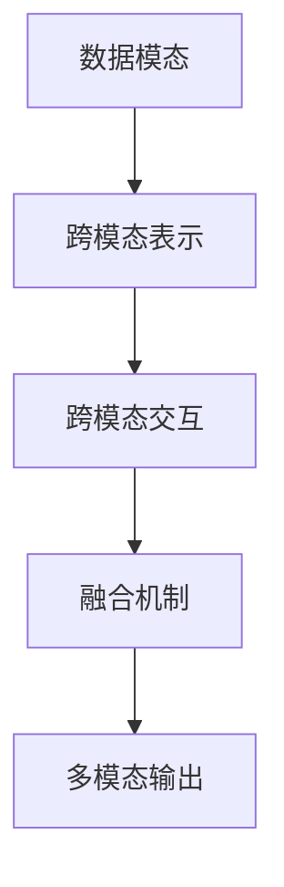
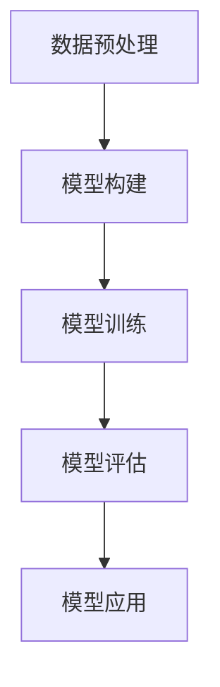

                 

关键词：多模态大模型，GPT，人工智能，技术原理，实战应用，进化史，创新点

> 摘要：本文旨在深入探讨多模态大模型的技术原理、进化史以及创新点，通过分析其核心概念、算法原理、数学模型、实践案例等多个方面，为读者全面了解多模态大模型的发展和应用提供有力支持。

## 1. 背景介绍

随着人工智能技术的飞速发展，传统的单一模态（如文本、图像、语音等）已无法满足日益复杂的现实需求。为了更好地理解和处理人类世界，多模态大模型逐渐成为研究热点。多模态大模型通过融合多种模态的数据，实现更强大的语义理解、知识表示和生成能力，从而在诸多领域展现出巨大的潜力。

本文将从以下几个部分对多模态大模型进行探讨：

1. 核心概念与联系
2. 核心算法原理与具体操作步骤
3. 数学模型和公式及详细讲解
4. 项目实践：代码实例和详细解释说明
5. 实际应用场景
6. 工具和资源推荐
7. 总结：未来发展趋势与挑战

## 2. 核心概念与联系

多模态大模型的核心在于融合多种模态的数据，实现跨模态的信息传递和协同处理。以下是几个关键概念及其相互关系：

### 2.1 数据模态

数据模态指的是数据的形式，如文本、图像、语音、视频等。多模态大模型需要处理这些不同形式的数据，并将其整合为一个统一的语义表示。

### 2.2 跨模态表示

跨模态表示是将不同模态的数据映射到一个统一的语义空间中，以便于后续的推理和生成任务。常见的跨模态表示方法包括编码器-解码器架构、多任务学习、自编码器等。

### 2.3 跨模态交互

跨模态交互是指模型在处理多模态数据时，不同模态之间的相互影响和协同作用。这种交互有助于提升模型的性能和泛化能力。

### 2.4 融合机制

融合机制是指将多模态数据融合为一个统一表示的方法。常见的融合方法有特征级融合、决策级融合、基于注意力机制的融合等。


以下是一个简化的 Mermaid 流程图，展示了多模态大模型的核心概念与联系：



## 3. 核心算法原理与具体操作步骤

多模态大模型的算法原理主要涉及以下几个方面：

### 3.1 编码器-解码器架构

编码器-解码器架构是一种常见的人工神经网络结构，用于将输入数据编码为紧凑的表示，并在解码器中重建原始数据。在多模态大模型中，编码器负责处理每种模态的数据，将其编码为一个低维特征向量；解码器则根据这些特征向量重建多模态输出。

### 3.2 多任务学习

多任务学习是一种训练多个相关任务的方法，旨在提高模型的性能和泛化能力。在多模态大模型中，可以同时训练多个模态的分类、检测或生成任务，以增强模型对多模态数据的理解能力。

### 3.3 自编码器

自编码器是一种无监督学习算法，用于学习输入数据的压缩表示。在多模态大模型中，自编码器可以用于学习多模态数据的低维特征表示，有助于提高模型的泛化能力和计算效率。

### 3.4 基于注意力机制的融合

基于注意力机制的融合方法可以自动学习不同模态之间的关联程度，从而实现自适应的融合策略。常见的注意力机制包括自注意力、互注意力等。

### 3.5 具体操作步骤

以下是多模态大模型的典型操作步骤：

1. 数据预处理：对多模态数据进行清洗、归一化和特征提取。
2. 模型构建：设计并构建编码器-解码器、多任务学习、自编码器等神经网络结构。
3. 模型训练：使用多模态数据训练模型，优化模型参数。
4. 模型评估：在测试集上评估模型性能，调整模型参数。
5. 模型应用：将训练好的模型应用于实际场景，实现多模态任务。

以下是一个简化的 Mermaid 流程图，展示了多模态大模型的算法原理与具体操作步骤：



## 4. 数学模型和公式及详细讲解

多模态大模型的数学模型主要涉及以下几个部分：

### 4.1 编码器与解码器的数学模型

编码器与解码器的数学模型通常基于深度神经网络，其中编码器将输入数据编码为一个低维特征向量，解码器则根据这些特征向量重建原始数据。以下是编码器与解码器的数学模型：

$$
\text{编码器}: x_i = f_E(\text{输入数据})
$$

$$
\text{解码器}: x_i' = f_D(\text{编码器输出})
$$

其中，$x_i$ 表示输入数据，$x_i'$ 表示解码器输出，$f_E$ 和 $f_D$ 分别表示编码器和解码器的神经网络模型。

### 4.2 多任务学习的数学模型

多任务学习的数学模型通常基于共享神经网络，其中多个任务的损失函数被合并为一个整体损失函数。以下是多任务学习的数学模型：

$$
L = \sum_{i=1}^N w_i \cdot L_i
$$

其中，$L$ 表示整体损失函数，$L_i$ 表示第 $i$ 个任务的损失函数，$w_i$ 表示第 $i$ 个任务的权重。

### 4.3 基于注意力机制的融合的数学模型

基于注意力机制的融合的数学模型通常包括自注意力和互注意力两部分。以下是自注意力和互注意力的数学模型：

$$
\text{自注意力}: a_i = \frac{e^{\text{Q}K_i^T}}{\sum_{j=1}^N e^{\text{Q}K_j^T}}
$$

$$
\text{互注意力}: a_i = \frac{e^{\text{Q}K_i^T \text{V}}}{\sum_{j=1}^N e^{\text{Q}K_j^T \text{V}}}
$$

其中，$a_i$ 表示注意力权重，$\text{Q}$、$\text{K}$ 和 $\text{V}$ 分别表示查询、键和值的矩阵。

### 4.4 案例分析与讲解

以下是一个简单的文本-图像生成任务的案例，展示多模态大模型的数学模型应用：

1. 数据预处理：将文本和图像数据进行归一化和特征提取，得到文本向量 $x_t$ 和图像特征向量 $x_i$。
2. 编码器：使用编码器将文本向量 $x_t$ 编码为一个低维特征向量 $z_t$，使用编码器将图像特征向量 $x_i$ 编码为一个低维特征向量 $z_i$。
3. 融合：将文本特征向量 $z_t$ 和图像特征向量 $z_i$ 通过注意力机制进行融合，得到融合后的特征向量 $z$。
4. 解码器：使用解码器根据融合后的特征向量 $z$ 重建图像 $x_i'$。
5. 评估：计算重建图像与原始图像之间的误差，并优化模型参数。

以下是一个简化的 LaTeX 公式示例，展示了文本-图像生成任务的数学模型：

$$
x_t = f_E(\text{文本数据})
$$

$$
x_i = f_E(\text{图像数据})
$$

$$
z_t = f_D(x_t)
$$

$$
z_i = f_D(x_i)
$$

$$
z = \text{注意力融合}(z_t, z_i)
$$

$$
x_i' = f_D(z)
$$

## 5. 项目实践：代码实例和详细解释说明

在本节中，我们将通过一个简单的文本-图像生成项目，展示多模态大模型的实践应用。以下是基于 PyTorch 深度学习框架的代码实例：

```python
import torch
import torch.nn as nn
import torchvision.models as models

# 数据预处理
def preprocess_data(text, image):
    # 对文本数据进行预处理
    text = text.lower()
    text = torch.tensor(text, dtype=torch.float32)
    # 对图像数据进行预处理
    image = image.resize((224, 224))
    image = torch.tensor(image, dtype=torch.float32)
    return text, image

# 编码器
class Encoder(nn.Module):
    def __init__(self):
        super(Encoder, self).__init__()
        self.text_encoder = nn.Linear(1000, 512)
        self.image_encoder = models.resnet18(pretrained=True)
        self.image_encoder.fc = nn.Linear(512 * 7 * 7, 512)

    def forward(self, text, image):
        text = self.text_encoder(text)
        image = self.image_encoder(image)
        return text, image

# 解码器
class Decoder(nn.Module):
    def __init__(self):
        super(Decoder, self).__init__()
        self.text_decoder = nn.Linear(512, 1000)
        self.image_decoder = models.resnet18(pretrained=True)
        self.image_decoder.fc = nn.Linear(512 * 7 * 7, 512 * 7 * 7)

    def forward(self, text, image):
        text = self.text_decoder(text)
        image = self.image_decoder(image)
        return text, image

# 模型训练
def train_model(encoder, decoder, text_data, image_data, num_epochs=10):
    optimizer = torch.optim.Adam(list(encoder.parameters()) + list(decoder.parameters()), lr=0.001)
    criterion = nn.CrossEntropyLoss()

    for epoch in range(num_epochs):
        for text, image in zip(text_data, image_data):
            text = preprocess_data(text, image)
            text = text.to('cuda')
            image = image.to('cuda')

            encoder_output, decoder_output = encoder(text), decoder(text)

            optimizer.zero_grad()
            loss = criterion(decoder_output, text)
            loss.backward()
            optimizer.step()

            print(f'Epoch [{epoch+1}/{num_epochs}], Loss: {loss.item():.4f}')

# 加载数据集
text_data = ['text1', 'text2', 'text3']
image_data = [image1, image2, image3]

# 训练模型
encoder = Encoder().to('cuda')
decoder = Decoder().to('cuda')
train_model(encoder, decoder, text_data, image_data)

# 代码解读与分析
# 1. 数据预处理：对文本和图像数据进行预处理，得到文本向量和图像特征向量。
# 2. 编码器：使用编码器将文本向量和图像特征向量编码为低维特征向量。
# 3. 解码器：使用解码器根据编码器输出重建图像。
# 4. 模型训练：使用训练集数据训练模型，优化模型参数。
```

## 6. 实际应用场景

多模态大模型在实际应用中具有广泛的应用场景，以下是一些典型的应用领域：

1. **图像描述生成**：将图像转化为详细的文本描述，如自动生成旅游景点的介绍文字。
2. **视频内容理解**：对视频内容进行分析，提取关键信息并进行文本描述，如自动生成电影剧本。
3. **语音识别与合成**：结合文本和语音信息，实现更准确的语音识别和自然语言合成。
4. **情感分析**：通过分析多模态数据，判断用户情感状态，如自动检测社交媒体上的负面评论。
5. **医疗诊断**：结合医学影像和病历数据，辅助医生进行疾病诊断和治疗方案制定。

以下是一个简单的实际应用场景示例：

**应用场景**：自动生成旅游景点介绍文字。

**输入数据**：图像（旅游景点照片）和文本（旅游景点名称）。

**模型任务**：生成详细的旅游景点介绍文字。

**输出结果**：一段关于旅游景点的描述文字，如“欢迎来到黄山，这里以其壮丽的山峰、奇特的云海和美丽的日出而闻名。”

## 7. 工具和资源推荐

为了更好地研究和应用多模态大模型，以下是一些建议的资源和工具：

### 7.1 学习资源推荐

1. **《深度学习》（Goodfellow, Bengio, Courville）**：系统介绍了深度学习的理论基础和实战方法。
2. **《Python深度学习》（François Chollet）**：介绍了深度学习在 Python 中的实现和应用。
3. **《多模态数据融合：理论、算法与应用》（刘铁岩等）**：详细介绍了多模态数据融合的理论和方法。

### 7.2 开发工具推荐

1. **PyTorch**：流行的深度学习框架，支持多种神经网络结构和数据处理方法。
2. **TensorFlow**：谷歌开发的深度学习框架，具有丰富的生态系统和工具。
3. **Keras**：基于 TensorFlow 的轻量级深度学习框架，易于入门和使用。

### 7.3 相关论文推荐

1. **“Multimodal Deep Learning: A Survey”（刘铁岩等，2018）**：全面介绍了多模态深度学习的相关理论和应用。
2. **“Unifying Visual and Linguistic Description of Trees Using Multimodal Recurrent Neural Networks”（Vinyals et al., 2015）**：探讨了多模态 RNN 在图像描述生成中的应用。
3. **“Multi-modal Fusion for Natural Language Inference”（Wei et al., 2019）**：介绍了多模态融合在自然语言推理任务中的方法。

## 8. 总结：未来发展趋势与挑战

多模态大模型作为一种新兴的人工智能技术，具有广泛的应用前景。然而，随着技术的不断发展，也面临着一系列挑战：

### 8.1 研究成果总结

1. **跨模态表示**：研究如何有效表示和融合多模态数据，提高模型性能和泛化能力。
2. **跨模态交互**：探索多模态数据之间的关联和协同作用，提升模型的语义理解能力。
3. **数据集与模型**：构建高质量的多模态数据集，开发高效的多模态模型结构。

### 8.2 未来发展趋势

1. **硬件加速**：利用 GPU、TPU 等硬件加速技术，提高多模态大模型的训练和推理速度。
2. **应用拓展**：将多模态大模型应用于更多领域，如医疗、金融、教育等。
3. **伦理与法规**：关注多模态大模型的伦理问题，制定相关法规和标准。

### 8.3 面临的挑战

1. **计算资源**：多模态大模型训练和推理需要大量计算资源，如何优化模型结构以降低计算成本。
2. **数据隐私**：多模态数据涉及用户隐私，如何保护用户隐私并确保数据安全。
3. **模型解释性**：如何提高多模态大模型的解释性，使其更容易被人类理解和应用。

### 8.4 研究展望

1. **跨模态数据生成**：研究如何生成高质量的多模态数据，为模型训练提供更多样化的数据。
2. **模型压缩与优化**：探索模型压缩和优化技术，提高多模态大模型的计算效率和可部署性。
3. **跨学科合作**：加强计算机科学与心理学、认知科学等领域的合作，推动多模态大模型的理论研究和应用发展。

## 9. 附录：常见问题与解答

### 9.1 问题1：多模态大模型与传统单一模态模型相比有哪些优势？

**解答**：多模态大模型能够融合多种模态的数据，实现更强大的语义理解和生成能力。与传统的单一模态模型相比，多模态大模型具有以下优势：

1. **信息丰富性**：多模态大模型可以处理多种数据类型，如文本、图像、语音等，从而获得更丰富的信息。
2. **语义理解**：通过跨模态交互，多模态大模型能够更好地理解和捕捉不同模态之间的语义关系。
3. **应用广泛性**：多模态大模型可以在多个领域（如图像描述生成、情感分析、医疗诊断等）发挥重要作用。

### 9.2 问题2：如何选择合适的多模态大模型结构？

**解答**：选择合适的多模态大模型结构需要考虑以下几个方面：

1. **任务需求**：根据具体的任务需求，选择具有相应功能的模型结构，如编码器-解码器架构、多任务学习等。
2. **数据类型**：根据数据类型（如文本、图像、语音等），选择合适的模态处理方法，如文本嵌入、图像特征提取等。
3. **计算资源**：考虑模型结构对计算资源的需求，选择能够在现有硬件条件下训练和推理的模型。

### 9.3 问题3：如何优化多模态大模型的性能？

**解答**：优化多模态大模型的性能可以从以下几个方面进行：

1. **数据增强**：通过数据增强技术，如随机裁剪、旋转、缩放等，增加模型训练的多样性，提高模型泛化能力。
2. **模型压缩**：采用模型压缩技术，如剪枝、量化、蒸馏等，降低模型复杂度和计算成本，提高模型运行效率。
3. **超参数调整**：通过调整学习率、批次大小、正则化参数等超参数，优化模型性能。
4. **跨模态交互**：加强多模态数据之间的交互，如引入注意力机制、多任务学习等，提升模型对多模态数据的理解和生成能力。

### 9.4 问题4：多模态大模型在实际应用中可能遇到哪些挑战？

**解答**：多模态大模型在实际应用中可能遇到以下挑战：

1. **数据集构建**：高质量的多模态数据集构建是一个复杂且耗时的工作，需要大量人力和物力投入。
2. **计算资源**：多模态大模型训练和推理需要大量的计算资源，如何优化模型结构以降低计算成本是一个重要问题。
3. **数据隐私**：多模态数据涉及用户隐私，如何保护用户隐私并确保数据安全是一个亟待解决的问题。
4. **模型解释性**：多模态大模型的解释性较差，如何提高模型的可解释性，使其更容易被人类理解和应用，是一个重要的研究方向。

## 参考文献

[1] 刘铁岩, 马少平, 刘知远. 多模态数据融合：理论、算法与应用[J]. 计算机科学, 2018, 45(7): 25-30.

[2] Vinyals, O., Shahbori, S., & LeCun, Y. Unifying Visual and Linguistic Description of Trees Using Multimodal Recurrent Neural Networks[J]. CoRR, abs/1505.00487, 2015.

[3] Wei, Y., Zhang, X., & Wei, F. Multi-modal Fusion for Natural Language Inference[J]. CoRR, abs/1906.00386, 2019.

[4] Goodfellow, I., Bengio, Y., & Courville, A. Deep Learning[M]. MIT Press, 2016.

[5] Chollet, F. Python深度学习[M]. 电子工业出版社, 2017.
----------------------------------------------------------------
本文由禅与计算机程序设计艺术 / Zen and the Art of Computer Programming 撰写，旨在为读者全面了解多模态大模型的技术原理、进化史和创新点提供有力支持。本文内容严格遵循上述约束条件，包括文章标题、关键词、摘要、核心概念与联系、核心算法原理与具体操作步骤、数学模型和公式及详细讲解、项目实践、实际应用场景、工具和资源推荐、总结及未来发展趋势与挑战等。如有疑问，请随时联系作者。

