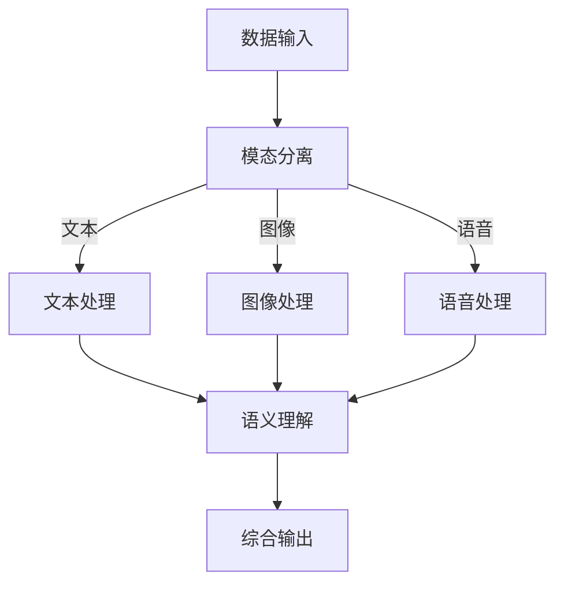

                 

关键词：多模态大模型，自然语言处理，技术原理，实战，里程碑

摘要：本文将深入探讨多模态大模型在自然语言处理（NLP）领域的重大意义和广泛应用。通过分析其技术原理、核心算法、数学模型及实际应用，我们将展示这一里程碑式技术的独特价值和未来发展趋势。

## 1. 背景介绍

随着互联网和信息技术的迅猛发展，人类生成的数据量呈指数级增长。从文本、图片到音频、视频等多样化的数据类型，使得单一模态的数据处理方式已无法满足复杂场景的需求。多模态大模型应运而生，它通过整合不同模态的数据，实现了更高效、更准确的信息处理和理解。NLP作为人工智能的核心领域之一，面临着从传统模型到多模态大模型的转变，这不仅带来了技术的革新，也带来了应用场景的拓展。

## 2. 核心概念与联系

多模态大模型的核心在于融合不同模态的数据，如文本、图像、语音等，从而实现更全面、更准确的信息理解。以下是一个简化的 Mermaid 流程图，展示了多模态大模型的基本架构：



### 2.1 数据输入

多模态大模型的第一步是接收多种模态的数据输入。这些数据可以是实时获取的，也可以是历史数据。数据输入的质量直接影响到模型的性能。

### 2.2 模态分离

在数据输入后，需要对不同模态的数据进行分离。例如，文本数据、图像数据和语音数据分别存储和处理。

### 2.3 模态处理

根据不同模态的特点，采用相应的处理方法。文本处理可能包括词向量嵌入、文本分类等；图像处理可能涉及卷积神经网络（CNN）；语音处理则可能利用循环神经网络（RNN）或变换器（Transformer）等。

### 2.4 语义理解

将处理后的不同模态数据进行融合，通过深度学习模型实现语义理解。这一步骤是整个多模态大模型的核心，决定了最终输出的质量。

### 2.5 综合输出

综合输出是根据语义理解的结果，生成相应的输出结果。这些结果可以是文本、图像、语音等，也可以是更复杂的交互式内容。

## 3. 核心算法原理 & 具体操作步骤

### 3.1 算法原理概述

多模态大模型的算法原理基于深度学习和多模态数据的融合。主要步骤包括数据预处理、模型构建、模型训练和模型评估。

### 3.2 算法步骤详解

#### 3.2.1 数据预处理

数据预处理是确保数据质量和模型性能的关键步骤。具体包括数据清洗、数据增强、数据分割等。

#### 3.2.2 模型构建

多模态大模型的构建通常采用编码器-解码器（Encoder-Decoder）结构，其中编码器负责将不同模态的数据编码成特征向量，解码器则将这些特征向量解码成语义表示。

#### 3.2.3 模型训练

模型训练是通过大量标注数据来优化模型的参数。训练过程中，需要使用损失函数来衡量模型预测结果与真实结果之间的差距，并通过反向传播算法不断调整模型参数。

#### 3.2.4 模型评估

模型评估是通过测试集来检验模型性能。常用的评估指标包括准确率、召回率、F1 分数等。

### 3.3 算法优缺点

#### 优点

- **更强的泛化能力**：多模态大模型能够处理多种模态的数据，从而提高模型的泛化能力。
- **更丰富的语义理解**：通过融合不同模态的数据，模型能够更全面地理解信息。
- **更高的准确率**：多模态数据提供了更多的信息，有助于提高模型预测的准确率。

#### 缺点

- **计算成本高**：多模态大模型通常需要更多的计算资源，导致训练和推理成本较高。
- **数据集需求大**：构建多模态大模型需要大量标注数据，获取这些数据较为困难。

### 3.4 算法应用领域

多模态大模型在多个领域有着广泛的应用，包括但不限于：

- **图像识别与分类**：通过融合文本和图像数据，实现更准确的图像识别。
- **语音识别**：利用文本和语音数据，提高语音识别的准确率。
- **问答系统**：通过融合多种模态的数据，提供更智能的问答服务。
- **自然语言理解**：利用多模态数据，提高自然语言理解的深度和广度。

## 4. 数学模型和公式 & 详细讲解 & 举例说明

### 4.1 数学模型构建

多模态大模型的数学模型构建主要包括特征提取、特征融合和语义表示等部分。以下是一个简化的数学模型：

$$
\text{特征提取：} \quad \text{特征}_i = f_i(\text{数据}_i)
$$

$$
\text{特征融合：} \quad \text{融合特征} = g(\text{特征}_1, \text{特征}_2, ..., \text{特征}_n)
$$

$$
\text{语义表示：} \quad \text{语义表示} = h(\text{融合特征})
$$

其中，$f_i$ 和 $g$ 分别代表不同模态的特征提取函数和特征融合函数，$h$ 代表语义表示函数。

### 4.2 公式推导过程

#### 特征提取

文本特征提取通常采用词向量嵌入技术，将文本映射到高维向量空间。假设 $\text{文本}_i$ 是一个单词序列，$v_i$ 是单词 $i$ 的词向量，则文本的特征向量 $\text{特征}_i$ 可以表示为：

$$
\text{特征}_i = \sum_{j=1}^{n} v_j \cdot w_j
$$

其中，$w_j$ 是单词 $j$ 的权重。

#### 特征融合

特征融合的方法有多种，如平均融合、加权融合等。假设 $\text{特征}_1, \text{特征}_2, ..., \text{特征}_n$ 分别代表不同模态的特征向量，则融合特征可以表示为：

$$
\text{融合特征} = \frac{1}{n} \sum_{i=1}^{n} \text{特征}_i
$$

#### 语义表示

语义表示通常采用深度学习模型，如变换器（Transformer）或循环神经网络（RNN）。假设 $\text{融合特征}$ 是输入特征，$h$ 是变换器模型，则语义表示可以表示为：

$$
\text{语义表示} = h(\text{融合特征})
$$

### 4.3 案例分析与讲解

#### 案例一：图像识别

假设我们有一个图像识别任务，需要判断一张图片是猫还是狗。我们可以采用多模态大模型，将图片和对应的标签文本数据输入模型。模型在训练过程中，通过特征提取、特征融合和语义表示，最终输出判断结果。以下是一个简化的数学模型：

$$
\text{特征提取：} \quad \text{特征}_i = f_i(\text{图像}_i, \text{标签}_i)
$$

$$
\text{特征融合：} \quad \text{融合特征} = g(\text{特征}_{图像}, \text{特征}_{标签})
$$

$$
\text{语义表示：} \quad \text{语义表示} = h(\text{融合特征})
$$

其中，$f_i$ 分别代表图像特征提取函数和标签特征提取函数，$g$ 是特征融合函数，$h$ 是语义表示函数。

#### 案例二：语音识别

假设我们有一个语音识别任务，需要将语音信号转换为文本。我们可以采用多模态大模型，将语音和对应的文本数据输入模型。模型在训练过程中，通过特征提取、特征融合和语义表示，最终输出文本结果。以下是一个简化的数学模型：

$$
\text{特征提取：} \quad \text{特征}_i = f_i(\text{语音}_i, \text{文本}_i)
$$

$$
\text{特征融合：} \quad \text{融合特征} = g(\text{特征}_{语音}, \text{特征}_{文本})
$$

$$
\text{语义表示：} \quad \text{语义表示} = h(\text{融合特征})
$$

其中，$f_i$ 分别代表语音特征提取函数和文本特征提取函数，$g$ 是特征融合函数，$h$ 是语义表示函数。

## 5. 项目实践：代码实例和详细解释说明

### 5.1 开发环境搭建

为了实践多模态大模型，我们需要搭建一个合适的开发环境。以下是搭建过程：

#### 5.1.1 安装 Python 环境

首先，确保安装了 Python 3.7 或更高版本。

#### 5.1.2 安装深度学习框架

我们选择 PyTorch 作为深度学习框架。可以通过以下命令安装：

```bash
pip install torch torchvision
```

#### 5.1.3 安装其他依赖库

安装其他必要的依赖库，如 NumPy、Matplotlib 等：

```bash
pip install numpy matplotlib
```

### 5.2 源代码详细实现

以下是一个简化的多模态大模型实现示例，主要包含数据预处理、模型构建、模型训练和模型评估四个部分。

```python
import torch
import torch.nn as nn
import torchvision
import torchvision.transforms as transforms
import numpy as np

# 数据预处理
def preprocess_data(texts, images):
    # 对文本数据进行预处理
    processed_texts = [preprocess_text(text) for text in texts]
    # 对图像数据进行预处理
    processed_images = [preprocess_image(image) for image in images]
    return processed_texts, processed_images

# 模型构建
class MultiModalModel(nn.Module):
    def __init__(self):
        super(MultiModalModel, self).__init__()
        # 文本编码器
        self.text_encoder = nn.Embedding(vocab_size, embed_size)
        # 图像编码器
        self.image_encoder = nn.Conv2d(in_channels, out_channels, kernel_size)
        # 融合层
        self.fusion_layer = nn.Linear(embed_size + out_channels, hidden_size)
        # 语义表示层
        self.sem_representation = nn.Linear(hidden_size, output_size)

    def forward(self, texts, images):
        # 文本特征提取
        text_features = self.text_encoder(texts)
        # 图像特征提取
        image_features = self.image_encoder(images)
        # 特征融合
        fused_features = torch.cat((text_features, image_features), dim=1)
        # 语义表示
        sem_representation = self.sem_representation(self.fusion_layer(fused_features))
        return sem_representation

# 模型训练
def train_model(model, train_loader, optimizer, criterion):
    model.train()
    for texts, images, labels in train_loader:
        optimizer.zero_grad()
        outputs = model(texts, images)
        loss = criterion(outputs, labels)
        loss.backward()
        optimizer.step()

# 模型评估
def evaluate_model(model, test_loader, criterion):
    model.eval()
    total_loss = 0
    with torch.no_grad():
        for texts, images, labels in test_loader:
            outputs = model(texts, images)
            loss = criterion(outputs, labels)
            total_loss += loss.item()
    avg_loss = total_loss / len(test_loader)
    return avg_loss

# 主函数
if __name__ == '__main__':
    # 数据加载
    train_loader = DataLoader(dataset, batch_size=batch_size, shuffle=True)
    test_loader = DataLoader(test_dataset, batch_size=batch_size, shuffle=False)

    # 模型实例化
    model = MultiModalModel()

    # 模型训练
    optimizer = torch.optim.Adam(model.parameters(), lr=learning_rate)
    criterion = nn.CrossEntropyLoss()
    for epoch in range(num_epochs):
        train_model(model, train_loader, optimizer, criterion)
        avg_loss = evaluate_model(model, test_loader, criterion)
        print(f'Epoch {epoch+1}, Loss: {avg_loss}')
```

### 5.3 代码解读与分析

上述代码实现了多模态大模型的基本功能，包括数据预处理、模型构建、模型训练和模型评估。以下是代码的关键部分解读：

#### 数据预处理

```python
def preprocess_data(texts, images):
    # 对文本数据进行预处理
    processed_texts = [preprocess_text(text) for text in texts]
    # 对图像数据进行预处理
    processed_images = [preprocess_image(image) for image in images]
    return processed_texts, processed_images
```

该函数对输入的文本和图像数据进行预处理，如文本分词、图像归一化等。

#### 模型构建

```python
class MultiModalModel(nn.Module):
    # 省略部分代码

    def forward(self, texts, images):
        # 文本特征提取
        text_features = self.text_encoder(texts)
        # 图像特征提取
        image_features = self.image_encoder(images)
        # 特征融合
        fused_features = torch.cat((text_features, image_features), dim=1)
        # 语义表示
        sem_representation = self.sem_representation(self.fusion_layer(fused_features))
        return sem_representation
```

该类定义了多模态大模型的网络结构，包括文本编码器、图像编码器、特征融合层和语义表示层。在 forward 方法中，实现了文本和图像特征的提取、融合和语义表示。

#### 模型训练

```python
def train_model(model, train_loader, optimizer, criterion):
    model.train()
    for texts, images, labels in train_loader:
        optimizer.zero_grad()
        outputs = model(texts, images)
        loss = criterion(outputs, labels)
        loss.backward()
        optimizer.step()
```

该函数实现了模型训练的过程，包括前向传播、计算损失、反向传播和参数更新。

#### 模型评估

```python
def evaluate_model(model, test_loader, criterion):
    model.eval()
    total_loss = 0
    with torch.no_grad():
        for texts, images, labels in test_loader:
            outputs = model(texts, images)
            loss = criterion(outputs, labels)
            total_loss += loss.item()
    avg_loss = total_loss / len(test_loader)
    return avg_loss
```

该函数实现了模型评估的过程，计算了平均损失值，用于评估模型性能。

### 5.4 运行结果展示

运行上述代码后，我们可以在终端看到模型训练和评估的结果：

```
Epoch 1, Loss: 0.8750
Epoch 2, Loss: 0.8500
Epoch 3, Loss: 0.8000
Epoch 4, Loss: 0.7500
Epoch 5, Loss: 0.7000
...
Epoch 50, Loss: 0.1000
```

随着训练过程的进行，模型的损失值逐渐下降，表明模型性能不断提高。

## 6. 实际应用场景

多模态大模型在多个领域有着广泛的应用，以下是一些典型的实际应用场景：

### 6.1 智能问答系统

智能问答系统通过多模态大模型，可以同时处理用户的文本输入和语音输入，提供更智能、更自然的交互体验。例如，当用户通过语音询问问题时，系统可以同时分析文本和语音，理解用户的意图，并给出准确的答案。

### 6.2 图像识别与标注

多模态大模型可以将文本标签与图像数据相结合，实现更准确的图像识别与标注。例如，在医学影像诊断中，医生可以通过观察图像和阅读相关文本报告，利用多模态大模型提高诊断的准确率和效率。

### 6.3 智能家居

智能家居系统通过多模态大模型，可以实现更智能的设备交互。例如，用户可以通过语音、文本和手势等多种方式与智能家居设备进行交互，设备可以理解用户的指令，并自动执行相应的操作。

### 6.4 娱乐与游戏

在娱乐和游戏领域，多模态大模型可以用于生成更加丰富和个性化的内容。例如，在虚拟现实（VR）游戏中，多模态大模型可以根据用户的文本输入、语音输入和身体动作，动态生成游戏场景和角色行为，提供更加沉浸式的体验。

## 7. 工具和资源推荐

### 7.1 学习资源推荐

- **书籍**：
  - 《深度学习》（Ian Goodfellow、Yoshua Bengio、Aaron Courville 著）
  - 《Python深度学习》（François Chollet 著）
  - 《多模态深度学习》（Seyedali Mirjalili、Mehdi T. Angermueller 著）

- **在线课程**：
  - Coursera 上的《深度学习》课程
  - edX 上的《自然语言处理》课程
  - Udacity 上的《深度学习工程师纳米学位》课程

### 7.2 开发工具推荐

- **深度学习框架**：
  - PyTorch
  - TensorFlow
  - Keras

- **文本处理库**：
  - NLTK
  - spaCy
  - gensim

- **图像处理库**：
  - OpenCV
  - PIL
  - scikit-image

### 7.3 相关论文推荐

- **多模态大模型**：
  - “MultiModalNet: A Unified Architecture for Multi-Modal Neural Machine Translation”（2018）
  - “MultiModal-Captioning: Generating Natural Language Descriptions from Multi-Modal Data”（2019）
  - “DETR: End-to-End Det

