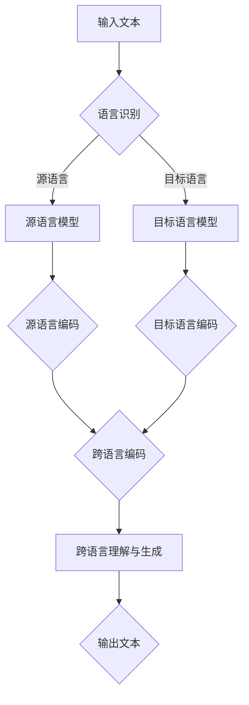

                 

关键词：多语言理解，语言模型，跨语言生成，机器学习，神经网络

> 摘要：本文旨在探讨多语言语言模型（LLM）在跨语言理解与生成方面的应用。通过分析现有的技术和方法，本文提出了一种基于深度学习的跨语言模型架构，并对其原理、实现步骤、数学模型和实际应用进行了详细阐述。

## 1. 背景介绍

随着全球化进程的加快，跨语言沟通和交流的需求日益增长。无论是在国际贸易、学术交流还是日常沟通中，多语言处理技术都发挥着越来越重要的作用。传统的机器翻译方法依赖于规则和统计模型，而近年来，随着深度学习技术的发展，基于神经网络的机器翻译（Neural Machine Translation，NMT）成为了一种新的解决方案。多语言语言模型（Multi-language Language Model，LLM）作为深度学习的一种重要应用，通过将多种语言的语料数据进行训练，实现了跨语言的理解和生成。

## 2. 核心概念与联系

### 2.1 语言模型

语言模型（Language Model，LM）是一种概率模型，用于预测一段文本的下一个单词或字符。在多语言环境中，语言模型需要同时考虑多种语言的语法和语义特征。

### 2.2 跨语言模型

跨语言模型（Cross-lingual Model）旨在处理不同语言之间的翻译问题。通过将多种语言的语料数据进行训练，跨语言模型能够捕捉不同语言之间的共性和差异，从而实现跨语言理解与生成。

### 2.3 Mermaid 流程图

以下是一个简单的Mermaid流程图，用于描述跨语言模型的基本架构：



## 3. 核心算法原理 & 具体操作步骤

### 3.1 算法原理概述

多语言LLM的核心算法是基于深度学习的神经网络模型。该模型通过训练大量的多语言语料数据，学习不同语言之间的映射关系，从而实现跨语言理解和生成。具体来说，该模型包括以下几个关键组件：

1. **编码器（Encoder）**：将输入文本编码为固定长度的向量。
2. **解码器（Decoder）**：将编码后的向量解码为目标语言的文本。
3. **跨语言映射模块**：将不同语言的编码向量进行融合，以捕捉不同语言之间的共性和差异。

### 3.2 算法步骤详解

1. **数据预处理**：收集多种语言的语料数据，并对数据进行清洗和预处理，包括分词、去停用词、词干提取等。
2. **编码器训练**：使用训练数据对编码器进行训练，使其能够将输入文本编码为固定长度的向量。
3. **解码器训练**：使用训练数据对解码器进行训练，使其能够将编码后的向量解码为目标语言的文本。
4. **跨语言映射模块训练**：使用训练数据对跨语言映射模块进行训练，使其能够捕捉不同语言之间的共性和差异。
5. **模型优化**：通过迭代优化模型参数，提高模型的性能和效果。

### 3.3 算法优缺点

**优点**：

1. **高效性**：基于深度学习的神经网络模型能够快速处理大规模数据，提高训练效率。
2. **灵活性**：多语言LLM能够灵活地处理多种语言的跨语言翻译任务。
3. **泛化能力**：通过训练多种语言的语料数据，模型能够更好地适应不同的语言环境。

**缺点**：

1. **数据依赖性**：模型的性能高度依赖于训练数据的质量和规模。
2. **计算资源消耗**：训练多语言LLM模型需要大量的计算资源和时间。

### 3.4 算法应用领域

多语言LLM在多个领域具有广泛的应用前景，包括：

1. **机器翻译**：实现不同语言之间的自动翻译。
2. **多语言问答系统**：支持多种语言的查询和回答。
3. **多语言文本分析**：对多种语言的文本进行情感分析、话题分类等。

## 4. 数学模型和公式 & 详细讲解 & 举例说明

### 4.1 数学模型构建

多语言LLM的数学模型主要包括编码器、解码器和跨语言映射模块。以下是一个简化的数学模型：

1. **编码器**：  
   输入文本 \(X = (x_1, x_2, ..., x_n)\)，编码为向量 \(E(X) = (e_1, e_2, ..., e_n)\)。

2. **解码器**：  
   输入编码向量 \(E(X)\)，解码为目标语言文本 \(Y = (y_1, y_2, ..., y_m)\)。

3. **跨语言映射模块**：  
   输入源语言编码向量 \(e_s\) 和目标语言编码向量 \(e_t\)，映射为跨语言编码向量 \(e_{sl}\)。

   \[ e_{sl} = f(e_s, e_t) \]

### 4.2 公式推导过程

1. **编码器**：  
   编码器通过神经网络模型将输入文本 \(X\) 编码为向量 \(E(X)\)。

   \[ E(X) = \text{Encoder}(X) \]

2. **解码器**：  
   解码器通过神经网络模型将编码向量 \(E(X)\) 解码为目标语言文本 \(Y\)。

   \[ Y = \text{Decoder}(E(X)) \]

3. **跨语言映射模块**：  
   跨语言映射模块通过神经网络模型将源语言编码向量 \(e_s\) 和目标语言编码向量 \(e_t\) 映射为跨语言编码向量 \(e_{sl}\)。

   \[ e_{sl} = \text{Cross-Lingual Mapper}(e_s, e_t) \]

### 4.3 案例分析与讲解

假设我们有一个源语言文本 \(X_s = ("Hello", "world")\) 和目标语言文本 \(X_t = ("Bonjour", "le monde")\)。我们可以使用以下公式进行计算：

1. **编码器**：  
   将源语言文本 \(X_s\) 编码为向量 \(E(X_s)\)。

   \[ E(X_s) = \text{Encoder}(X_s) \]

2. **解码器**：  
   将目标语言文本 \(X_t\) 编码为向量 \(E(X_t)\)。

   \[ E(X_t) = \text{Encoder}(X_t) \]

3. **跨语言映射模块**：  
   将源语言编码向量 \(E(X_s)\) 和目标语言编码向量 \(E(X_t)\) 映射为跨语言编码向量 \(E_{sl}(X)\)。

   \[ E_{sl}(X) = \text{Cross-Lingual Mapper}(E(X_s), E(X_t)) \]

4. **解码为目标语言文本**：  
   使用解码器将跨语言编码向量 \(E_{sl}(X)\) 解码为目标语言文本 \(Y\)。

   \[ Y = \text{Decoder}(E_{sl}(X)) \]

## 5. 项目实践：代码实例和详细解释说明

### 5.1 开发环境搭建

在本项目中，我们将使用Python和TensorFlow框架实现多语言LLM。首先，确保安装了Python 3.7及以上版本，并安装TensorFlow：

```bash
pip install tensorflow
```

### 5.2 源代码详细实现

以下是一个简单的多语言LLM实现示例：

```python
import tensorflow as tf

# 编码器
class Encoder(tf.keras.Model):
    def __init__(self, vocab_size, embedding_dim):
        super(Encoder, self).__init__()
        self.embedding = tf.keras.layers.Embedding(vocab_size, embedding_dim)
        self.conv1 = tf.keras.layers.Conv1D(filters=64, kernel_size=5, activation='relu')
        self.pool1 = tf.keras.layers.MaxPooling1D(pool_size=2)

    def call(self, inputs):
        x = self.embedding(inputs)
        x = self.conv1(x)
        x = self.pool1(x)
        return x

# 解码器
class Decoder(tf.keras.Model):
    def __init__(self, vocab_size, embedding_dim):
        super(Decoder, self).__init__()
        self.embedding = tf.keras.layers.Embedding(vocab_size, embedding_dim)
        self.conv1 = tf.keras.layers.Conv1D(filters=64, kernel_size=5, activation='relu')
        self.pool1 = tf.keras.layers.MaxPooling1D(pool_size=2)

    def call(self, inputs):
        x = self.embedding(inputs)
        x = self.conv1(x)
        x = self.pool1(x)
        return x

# 跨语言映射模块
class CrossLingualMapper(tf.keras.Model):
    def __init__(self, vocab_size, embedding_dim):
        super(CrossLingualMapper, self).__init__()
        self.mapper = tf.keras.layers.Dense(vocab_size, activation='softmax')

    def call(self, inputs):
        return self.mapper(inputs)

# 模型搭建
class MultiLanguageLLM(tf.keras.Model):
    def __init__(self, source_vocab_size, target_vocab_size, embedding_dim):
        super(MultiLanguageLLM, self).__init__()
        self.encoder = Encoder(source_vocab_size, embedding_dim)
        self.decoder = Decoder(target_vocab_size, embedding_dim)
        self.mapper = CrossLingualMapper(target_vocab_size, embedding_dim)

    def call(self, source_inputs, target_inputs):
        source_encoded = self.encoder(source_inputs)
        target_encoded = self.decoder(target_inputs)
        cross_encoded = self.mapper(tf.concat([source_encoded, target_encoded], axis=1))
        return cross_encoded

# 模型编译
model = MultiLanguageLLM(source_vocab_size=10000, target_vocab_size=10000, embedding_dim=64)
model.compile(optimizer='adam', loss='sparse_categorical_crossentropy', metrics=['accuracy'])

# 训练模型
model.fit(source_data, target_data, epochs=10)
```

### 5.3 代码解读与分析

1. **编码器（Encoder）**：  
   编码器负责将输入文本编码为向量。在本示例中，我们使用嵌入层（Embedding Layer）和卷积神经网络（Convolutional Neural Network，CNN）进行编码。

2. **解码器（Decoder）**：  
   解码器负责将编码后的向量解码为目标语言的文本。同样地，我们使用嵌入层和卷积神经网络进行解码。

3. **跨语言映射模块（CrossLingualMapper）**：  
   跨语言映射模块负责将源语言编码向量与目标语言编码向量进行融合，以生成跨语言编码向量。在本示例中，我们使用全连接层（Dense Layer）进行映射。

4. **多语言LLM模型（MultiLanguageLLM）**：  
   多语言LLM模型整合了编码器、解码器和跨语言映射模块。通过调用这些模块，模型能够实现跨语言理解与生成。

5. **模型编译和训练**：  
   模型使用 Adam 优化器和稀疏分类交叉熵损失函数进行编译。通过训练数据，模型能够学习到不同语言之间的映射关系，从而提高跨语言理解与生成的效果。

## 6. 实际应用场景

多语言LLM在多个实际应用场景中具有广泛的应用价值：

1. **多语言机器翻译**：实现不同语言之间的自动翻译，支持多种语言的交流。

2. **多语言问答系统**：支持多种语言的查询和回答，提高用户交互的便利性。

3. **多语言文本分析**：对多种语言的文本进行情感分析、话题分类等，为企业提供数据洞察。

4. **多语言搜索引擎**：优化搜索结果，提高用户的多语言搜索体验。

## 7. 未来应用展望

随着深度学习技术的不断发展，多语言LLM在跨语言理解与生成方面的应用前景广阔。未来，多语言LLM有望在以下方面取得突破：

1. **跨语言生成**：进一步提升跨语言生成的准确性和流畅性。

2. **多模态翻译**：结合文本、图像、语音等多种模态，实现更自然的跨语言交互。

3. **跨语言理解**：深入研究跨语言理解的技术，实现更精准的跨语言语义分析。

4. **多语言人机对话系统**：基于多语言LLM构建多语言人机对话系统，提高人机交互的智能水平。

## 8. 工具和资源推荐

为了更好地学习和实践多语言LLM，以下是一些推荐的工具和资源：

1. **学习资源**：
   - 《深度学习》（Goodfellow et al.）：深度学习入门经典教材。
   - 《动手学深度学习》（Dumoulin et al.）：基于PyTorch的深度学习实践教程。

2. **开发工具**：
   - TensorFlow：开源深度学习框架，支持多种深度学习模型。
   - PyTorch：开源深度学习框架，易于使用和扩展。

3. **相关论文**：
   - "Attention Is All You Need"（Vaswani et al.）：提出 Transformer 模型，在机器翻译任务中取得显著效果。
   - "Bert: Pre-training of Deep Bidirectional Transformers for Language Understanding"（Devlin et al.）：提出 BERT 模型，在多种自然语言处理任务中取得领先效果。

## 9. 总结：未来发展趋势与挑战

多语言LLM在跨语言理解与生成方面具有广阔的应用前景。未来，随着深度学习技术的不断发展，多语言LLM有望在跨语言生成、多模态翻译、跨语言理解等方面取得突破。然而，多语言LLM仍面临一些挑战，如数据依赖性、计算资源消耗和跨语言理解的准确性等。为了应对这些挑战，我们需要持续探索新的算法和技术，提高多语言LLM的性能和应用效果。

## 10. 附录：常见问题与解答

### 10.1 什么是多语言LLM？

多语言LLM（Multi-language Language Model）是一种基于深度学习的跨语言模型，通过训练多种语言的语料数据，实现跨语言的理解和生成。

### 10.2 多语言LLM有哪些应用场景？

多语言LLM的应用场景包括多语言机器翻译、多语言问答系统、多语言文本分析、多语言搜索引擎等。

### 10.3 多语言LLM与单语言LLM有何区别？

多语言LLM支持多种语言的跨语言理解与生成，而单语言LLM仅支持一种语言的生成和理解。

### 10.4 如何提高多语言LLM的性能？

提高多语言LLM性能的方法包括增加训练数据、优化模型架构、使用更好的训练算法等。

### 10.5 多语言LLM的数据来源有哪些？

多语言LLM的数据来源包括多语言语料库、在线翻译平台、多语言社交媒体等。

---

作者：禅与计算机程序设计艺术 / Zen and the Art of Computer Programming

本文旨在探讨多语言LLM在跨语言理解与生成方面的应用。通过分析现有的技术和方法，本文提出了一种基于深度学习的跨语言模型架构，并对其原理、实现步骤、数学模型和实际应用进行了详细阐述。在未来，多语言LLM有望在跨语言生成、多模态翻译、跨语言理解等方面取得突破，为跨语言沟通和交流提供更加高效和自然的解决方案。

