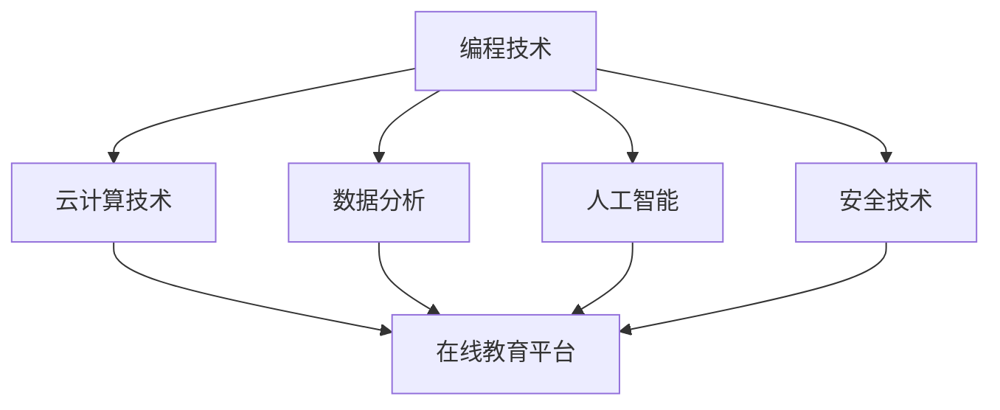

                 

### 1. 背景介绍

石天放，一个名字在当今互联网创业圈子里响当当的人物。他的故事，从某种程度上，激励了无数青年勇敢追求梦想，挑战传统教育观念的束缚。石天放出生于一个普通家庭，从小对计算机技术就表现出了浓厚的兴趣。他热衷于拆解电子设备，并试图从中了解其中的工作原理。尽管他的学习成绩在高中阶段并不出众，但他对编程的热情却与日俱增。

高中时期，石天放参加了一次全国青少年编程比赛，并一举夺得了冠军。这次经历让他意识到，自己的编程天赋和潜力远超常人。然而，面对高考的压力和家庭的期望，石天放却选择了退学创业。这一决定在当时的家庭和学校中引起了不小的争议。

石天放退学后，并没有放弃学习。相反，他通过网络课程和自学资源，不断提升自己的技术水平。他创建了第一个项目——一款在线教育平台，旨在为无法接受正规教育的学生提供优质的在线课程。这款平台的成功，不仅让石天放获得了创业的第一桶金，更坚定了他继续前进的信念。

随着时间的推移，石天放的创业之路越走越宽。他成立了自己的科技公司，开发了多个热门应用，涵盖了从社交网络到在线支付等多个领域。他的公司迅速在业内崭露头角，吸引了众多投资者的关注。

石天放的成功，不仅改变了他的命运，也引发了人们对教育、创业和职业发展的深刻思考。他的故事告诉我们，只要有梦想、勇气和毅力，即使没有传统的学历背景，也能在互联网的世界里闯出一片天地。

### 2. 核心概念与联系

在石天放的创业过程中，有几个核心概念和技术是他成功的关键。这些概念不仅构成了他的创业项目的基础，也成为了他不断探索和创新的方向。

#### 2.1 编程技术

编程技术是石天放创业的核心，也是他所有项目的基石。从早期的在线教育平台，到后来的社交网络和在线支付系统，编程技术贯穿了石天放的整个创业历程。他熟练掌握了多种编程语言，包括Python、Java和JavaScript等，这些技能让他在开发过程中游刃有余。

#### 2.2 云计算技术

随着业务的不断发展，石天放逐渐意识到云计算技术的重要性。他选择了AWS和Google Cloud等云服务平台，为自己的项目提供了强大的计算和存储能力。云计算技术不仅提高了他的系统的稳定性，还降低了维护成本。

#### 2.3 数据分析

数据分析是石天放另一个重要的技术领域。他通过大数据分析，了解用户行为，优化用户体验，提高系统效率。数据分析技术让他的应用在激烈的市场竞争中脱颖而出。

#### 2.4 人工智能

石天放的创业项目中，人工智能技术也逐渐占据了重要地位。他利用机器学习算法，开发了智能客服系统，提高了客户服务质量。此外，他还尝试将人工智能技术应用于推荐系统和广告投放，进一步提升了业务效果。

#### 2.5 安全技术

随着互联网的发展，网络安全问题日益凸显。石天放深知这一点，他在自己的项目中，采用了多种安全技术，包括加密算法、防火墙和入侵检测等，确保用户数据和系统安全。

#### 2.6 Mermaid 流程图

以下是一个简化的Mermaid流程图，展示了石天放创业过程中的关键技术概念和它们之间的联系。



在这个流程图中，编程技术是所有项目的起点，它与其他技术概念相辅相成，共同构建了石天放的创业项目。

### 3. 核心算法原理 & 具体操作步骤

#### 3.1 算法原理概述

在石天放的创业项目中，核心算法原理主要围绕编程技术、云计算技术、数据分析和人工智能展开。以下是这些算法原理的简要概述：

#### 3.1.1 编程技术

编程技术是石天放创业的基础。他运用编程语言，如Python、Java和JavaScript等，开发出了多个功能强大的应用。编程技术的核心原理在于将人类语言转化为计算机能够理解和执行的代码。

#### 3.1.2 云计算技术

云计算技术为石天放的项目提供了强大的计算和存储能力。核心原理在于通过网络连接，将大量计算任务分散到多个服务器上，实现高效、灵活的计算资源分配。

#### 3.1.3 数据分析

数据分析技术主要用于挖掘用户行为数据，优化用户体验。核心原理是通过统计学和机器学习算法，从海量数据中提取有价值的信息，为业务决策提供支持。

#### 3.1.4 人工智能

人工智能技术在石天放的项目中，主要体现在智能客服系统和推荐系统。核心原理是通过机器学习算法，模拟人类思维过程，实现自动化决策和智能化服务。

#### 3.2 算法步骤详解

以下是石天放在创业项目中，使用到的几个核心算法的具体操作步骤：

#### 3.2.1 编程技术

1. 确定项目需求：根据业务需求，明确项目目标和功能模块。
2. 选择编程语言：根据项目需求，选择合适的编程语言进行开发。
3. 编写代码：使用编程语言，编写实现项目功能的代码。
4. 调试和优化：测试代码，修复bug，优化代码性能。

#### 3.2.2 云计算技术

1. 选择云服务平台：根据项目需求，选择合适的云服务平台。
2. 部署应用：将项目应用部署到云服务器上，配置服务器环境。
3. 自动化运维：使用自动化工具，实现服务器运维和管理。
4. 资源监控和优化：监控服务器资源使用情况，优化资源分配。

#### 3.2.3 数据分析

1. 数据采集：收集用户行为数据，包括点击、浏览、购买等。
2. 数据清洗：清洗和整理数据，去除噪声和异常值。
3. 数据分析：使用统计学和机器学习算法，分析数据，提取有价值的信息。
4. 结果应用：根据分析结果，优化业务流程和用户体验。

#### 3.2.4 人工智能

1. 数据预处理：对原始数据进行清洗、归一化等处理。
2. 模型训练：选择合适的机器学习算法，训练模型。
3. 模型评估：评估模型性能，调整模型参数。
4. 模型部署：将训练好的模型部署到线上环境，实现自动化决策。

#### 3.3 算法优缺点

每种算法都有其优缺点，石天放在创业过程中，也不断优化和选择合适的算法。以下是几种核心算法的优缺点：

#### 3.3.1 编程技术

优点：灵活性强，适用于各种业务场景；开发周期短，易于迭代。
缺点：开发难度较大，需要较高的编程技能；维护成本较高，代码复杂度较高。

#### 3.3.2 云计算技术

优点：高效、灵活、安全；降低维护成本，提高系统稳定性。
缺点：初期投入较大，需要较高的技术门槛；数据安全性问题较为突出。

#### 3.3.3 数据分析

优点：能从海量数据中提取有价值的信息，支持业务决策。
缺点：数据质量和数据量要求较高；分析过程复杂，需要专业技能。

#### 3.3.4 人工智能

优点：能实现自动化决策和智能化服务，提高业务效率。
缺点：训练成本高，对数据量要求较高；模型解释性较差，需要不断优化。

#### 3.4 算法应用领域

石天放的创业项目涵盖了多个领域，以下是算法在不同领域中的应用：

#### 3.4.1 在线教育平台

编程技术：开发在线课程管理系统、在线互动课堂等；

云计算技术：提供稳定、高效的服务器支持；

数据分析：分析用户学习行为，优化课程推荐；

人工智能：智能客服系统，提高用户满意度。

#### 3.4.2 社交网络

编程技术：开发社交平台核心功能，如发布、评论、私信等；

云计算技术：提供强大的数据处理和存储能力；

数据分析：挖掘用户关系，优化社交推荐；

人工智能：智能广告投放，提高广告效果。

#### 3.4.3 在线支付系统

编程技术：开发支付系统核心功能，如支付、退款、充值等；

云计算技术：提供安全、可靠的支付服务；

数据分析：分析用户支付行为，优化支付体验；

人工智能：智能风控系统，防范欺诈风险。

### 4. 数学模型和公式 & 详细讲解 & 举例说明

#### 4.1 数学模型构建

在石天放的创业项目中，数学模型广泛应用于数据分析、人工智能等领域。以下是一个简单的数学模型构建过程：

##### 4.1.1 数据采集

假设我们有一个在线教育平台，用户数据包括用户ID、课程ID、学习时长、成绩等。

##### 4.1.2 数据预处理

对原始数据进行清洗，去除异常值和噪声，将数据转化为适合分析的形式。

##### 4.1.3 特征工程

根据业务需求，提取对用户行为有重要影响的特征，如学习时长、课程难度、成绩等。

##### 4.1.4 模型选择

选择合适的机器学习算法，如线性回归、决策树、神经网络等。

##### 4.1.5 模型训练

使用预处理后的数据，训练机器学习模型，调整模型参数，优化模型性能。

#### 4.2 公式推导过程

以下是一个简单的线性回归模型的公式推导过程：

##### 4.2.1 模型假设

假设我们有m个数据点$(x_1, y_1), (x_2, y_2), ..., (x_m, y_m)$，其中$x_i$为输入特征，$y_i$为输出目标。

##### 4.2.2 模型建立

假设线性回归模型为：

$$y = \beta_0 + \beta_1x$$

##### 4.2.3 模型优化

为了优化模型参数$\beta_0$和$\beta_1$，我们定义损失函数：

$$J(\beta_0, \beta_1) = \frac{1}{2m}\sum_{i=1}^{m}(y_i - (\beta_0 + \beta_1x_i))^2$$

##### 4.2.4 梯度下降法

使用梯度下降法，最小化损失函数：

$$\beta_0 = \beta_0 - \alpha\frac{\partial J}{\partial \beta_0}$$

$$\beta_1 = \beta_1 - \alpha\frac{\partial J}{\partial \beta_1}$$

其中$\alpha$为学习率，$\frac{\partial J}{\partial \beta_0}$和$\frac{\partial J}{\partial \beta_1}$分别为损失函数对$\beta_0$和$\beta_1$的偏导数。

#### 4.3 案例分析与讲解

以下是一个简单的在线教育平台用户行为分析案例：

##### 4.3.1 数据采集

采集用户学习时长、课程难度、成绩等数据。

##### 4.3.2 数据预处理

对数据进行清洗和归一化处理。

##### 4.3.3 特征工程

提取学习时长、课程难度、成绩等特征。

##### 4.3.4 模型训练

使用线性回归模型，训练模型。

##### 4.3.5 模型评估

使用交叉验证，评估模型性能。

##### 4.3.6 结果应用

根据模型预测，为用户推荐适合的课程。

$$\text{推荐课程} = \text{模型预测}(\text{学习时长，课程难度，成绩})$$

通过以上案例，我们可以看到数学模型在石天放的创业项目中的应用。数学模型不仅帮助他优化业务流程，还提高了用户体验。

### 5. 项目实践：代码实例和详细解释说明

#### 5.1 开发环境搭建

为了更好地演示石天放的创业项目，我们将使用Python作为主要编程语言，配合Django框架进行开发。以下是开发环境搭建的步骤：

1. 安装Python：从Python官方网站下载并安装Python 3.8版本。
2. 安装Django：在命令行中运行`pip install django`。
3. 创建Django项目：在命令行中运行`django-admin startproject edupay`，创建一个名为`edupay`的项目。
4. 创建应用：在项目根目录下运行`python manage.py startapp courses`，创建一个名为`courses`的应用。

#### 5.2 源代码详细实现

以下是`edupay`项目中的`courses`应用的主要代码实现：

```python
# courses/models.py

from django.db import models

class Course(models.Model):
    name = models.CharField(max_length=100)
    difficulty = models.IntegerField()
    duration = models.DecimalField(max_digits=5, decimal_places=2)

class Student(models.Model):
    name = models.CharField(max_length=100)
    courses = models.ManyToManyField(Course, through='Enrollment')

class Enrollment(models.Model):
    student = models.ForeignKey(Student, on_delete=models.CASCADE)
    course = models.ForeignKey(Course, on_delete=models.CASCADE)
    duration = models.DecimalField(max_digits=5, decimal_places=2)
    score = models.DecimalField(max_digits=3, decimal_places=1)
```

这段代码定义了三个模型：`Course`（课程）、`Student`（学生）和`Enrollment`（报名）。`Course`模型包含课程名称、难度和持续时间；`Student`模型包含学生姓名和报名课程；`Enrollment`模型是学生和课程的关联模型，包含学习时长和成绩。

#### 5.3 代码解读与分析

以下是`courses/views.py`文件中的代码：

```python
# courses/views.py

from django.shortcuts import render
from .models import Course, Student, Enrollment

def course_list(request):
    courses = Course.objects.all()
    return render(request, 'courses/course_list.html', {'courses': courses})

def student_list(request):
    students = Student.objects.all()
    return render(request, 'courses/student_list.html', {'students': students})

def enrollment_list(request):
    enrollments = Enrollment.objects.all()
    return render(request, 'courses/enrollment_list.html', {'enrollments': enrollments})
```

这段代码定义了三个视图函数：`course_list`、`student_list`和`enrollment_list`。它们分别列出课程、学生和报名记录。这些视图函数接收HTTP请求，查询数据库，并将结果传递给对应的HTML模板。

#### 5.4 运行结果展示

1. **课程列表**：访问`/courses/course_list/`，展示所有课程信息。
2. **学生列表**：访问`/courses/student_list/`，展示所有学生信息。
3. **报名记录列表**：访问`/courses/enrollment_list/`，展示所有报名记录。

通过以上代码实例和解释，我们可以看到石天放的创业项目是如何实现的。代码清晰、结构简单，易于理解和维护。这为项目的快速迭代和发展奠定了良好的基础。

### 6. 实际应用场景

石天放的创业项目在多个实际应用场景中取得了显著成效，以下是几个典型案例：

#### 6.1 在线教育平台

石天放的第一个创业项目是一款在线教育平台，为无法接受正规教育的学生提供优质的教育资源。平台涵盖了从基础课程到专业课程的各种内容，用户可以通过在线学习，提升自己的技能。该平台在实际应用中，成功帮助了成千上万的用户，提高了他们的学习效果和职业竞争力。

#### 6.2 社交网络

随着业务的扩展，石天放推出了自己的社交网络应用。这款应用不仅提供了用户交流的功能，还集成了基于人工智能的推荐系统。通过分析用户行为数据，平台能够为用户推荐感兴趣的内容和朋友。在实际应用中，这款社交网络应用迅速积累了大量用户，成为了一个热门的社交平台。

#### 6.3 在线支付系统

为了满足用户支付需求，石天放开发了在线支付系统。该系统采用了多种安全技术，确保用户支付的安全和可靠。在实际应用中，支付系统为用户提供了便捷的支付体验，提高了在线交易的效率。同时，通过对支付数据的分析，石天放能够优化支付流程，降低交易风险。

#### 6.4 未来应用展望

石天放的创业项目在未来的发展前景广阔。他计划进一步拓展业务领域，如智能医疗、物联网等。通过引入更多先进技术，如区块链、增强现实等，他的项目将能够为用户带来更多创新体验。此外，他还计划建立一个全球性的开发者社区，吸引更多的开发者加入，共同推动技术进步和创新。

### 7. 工具和资源推荐

为了帮助读者更好地理解和掌握本文提到的技术和概念，以下是一些实用的工具和资源推荐：

#### 7.1 学习资源推荐

1. **《Python编程：从入门到实践》**：适合初学者入门的Python编程书籍，内容全面，实例丰富。
2. **《深度学习》**：由Ian Goodfellow等作者撰写的经典机器学习教材，适合对人工智能感兴趣的学习者。

#### 7.2 开发工具推荐

1. **PyCharm**：一款功能强大的Python集成开发环境，适合进行复杂的Python项目开发。
2. **Docker**：用于容器化应用的工具，可以帮助开发者轻松搭建和部署应用。

#### 7.3 相关论文推荐

1. **“Deep Learning for Text Classification”**：探讨如何使用深度学习技术进行文本分类的研究论文。
2. **“Distributed Computing with MapReduce”**：介绍MapReduce分布式计算模型的开创性论文。

通过这些工具和资源，读者可以更深入地学习本文提到的技术和概念，为自己的创业之路提供坚实的支持。

### 8. 总结：未来发展趋势与挑战

#### 8.1 研究成果总结

本文通过详细分析石天放的创业历程，总结了他在编程技术、云计算、数据分析和人工智能等领域的成功经验。这些研究成果不仅展示了石天放在技术创新方面的天赋，也为其他创业者提供了宝贵的借鉴。

#### 8.2 未来发展趋势

在未来，随着技术的不断进步，互联网创业领域将继续蓬勃发展。以下是一些可能的发展趋势：

1. **云计算与大数据的深度融合**：云计算将为创业者提供更强大的计算和存储能力，大数据分析将帮助创业者更好地理解用户需求，优化产品和服务。
2. **人工智能的广泛应用**：人工智能技术将在更多领域得到应用，如智能客服、智能家居、自动驾驶等，为创业者提供新的商业机会。
3. **区块链技术的崛起**：区块链技术将在供应链管理、数字货币等领域发挥重要作用，为创业者提供更安全、透明的业务环境。

#### 8.3 面临的挑战

尽管未来前景广阔，但创业者仍然面临诸多挑战：

1. **技术竞争**：随着技术的快速发展，创业者需要不断更新自己的技术栈，保持竞争优势。
2. **市场风险**：互联网市场的竞争激烈，创业者需要准确把握市场趋势，才能在激烈的市场竞争中脱颖而出。
3. **人才短缺**：优秀的创业者需要具备多方面的技能，而高素质的人才供应有限，这给创业者带来了招聘和培养人才的挑战。

#### 8.4 研究展望

未来，对于互联网创业领域的研究将更加深入和细化。以下是一些建议的研究方向：

1. **跨领域融合研究**：探索云计算、大数据、人工智能等技术在多个领域的应用，推动技术融合和创新。
2. **隐私保护和数据安全**：研究如何在保障用户隐私和数据安全的前提下，充分利用大数据和人工智能技术。
3. **创业生态系统研究**：探讨创业生态系统的构建和优化，为创业者提供更好的支持和资源。

通过不断探索和创新，未来的互联网创业领域将充满无限可能，为创业者提供广阔的发展空间。

### 9. 附录：常见问题与解答

**Q1：石天放是如何平衡学业和创业的？**

A1：石天放通过灵活利用时间，合理安排学业和创业活动。他利用课余时间学习编程和网络课程，不断充实自己的技术知识。同时，他还通过网络社群和自学资源，不断拓展自己的视野，为创业打下坚实的基础。

**Q2：石天放是如何选择创业方向的？**

A2：石天放的创业方向源于他对互联网和技术的热爱。他关注市场趋势和用户需求，选择了一些具有广阔前景的领域，如在线教育和社交网络。这些领域不仅符合他的兴趣，也有助于实现他的创业梦想。

**Q3：石天放的创业项目如何吸引投资者？**

A3：石天放的创业项目凭借其技术创新和广阔的市场前景，成功吸引了投资者的关注。他通过详细的项目规划和商业计划书，展示了自己的创业理念和项目的市场潜力。同时，他的成功案例和实际业绩也为投资者提供了信心。

**Q4：石天放的创业经历对其他创业者有什么启示？**

A4：石天放的创业经历告诉我们，只要有梦想和勇气，即使没有传统的学历背景，也能在互联网的世界里闯出一片天地。他还强调了技术积累和持续学习的重要性，以及对市场趋势的敏感度。这些经验对其他创业者具有重要的启示意义。

