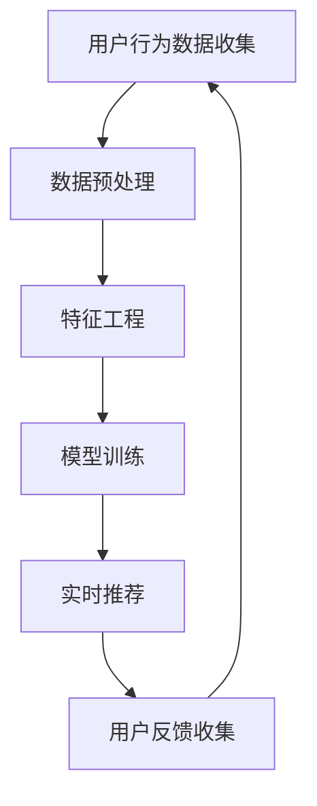

                 

关键词：大数据，AI，电商搜索，推荐系统，用户体验，准确率，算法原理，数学模型，项目实践，应用场景，工具推荐。

> 摘要：本文将深入探讨大数据与AI技术如何驱动电商搜索推荐系统，以提升准确率和用户体验为核心。通过阐述核心概念、算法原理、数学模型、项目实践以及实际应用场景，本文旨在为读者提供一个全面的技术视角，同时展望未来的发展趋势与挑战。

## 1. 背景介绍

随着互联网的飞速发展和电子商务的兴起，电商搜索推荐系统已成为现代电商企业提高用户黏性和销售额的关键因素。传统的搜索推荐系统主要依赖于关键词匹配和简单的文本相似度计算，这种方式在面对海量数据和复杂用户行为时显得力不从心。

大数据和AI技术的出现，为电商搜索推荐系统带来了全新的变革。大数据技术能够处理和分析海量数据，提取出有价值的信息，而AI技术则能够通过机器学习算法实现智能推荐，大幅提升推荐系统的准确率和用户体验。

本文将围绕大数据与AI驱动的电商搜索推荐系统，探讨其核心概念、算法原理、数学模型、项目实践以及实际应用场景，旨在为读者提供一个全面的技术视角。

## 2. 核心概念与联系

### 2.1 大数据与AI技术

#### 2.1.1 大数据

大数据（Big Data）是指无法使用常规软件工具在合理时间内捕捉、管理和处理的大量数据。大数据的4V特性包括：

- **Volume（体量）**：数据量巨大，通常是TB级别甚至PB级别。
- **Velocity（速度）**：数据生成和流动速度快，需要实时处理。
- **Variety（多样性）**：数据来源多样，包括结构化数据、半结构化数据和非结构化数据。
- **Value（价值）**：数据的价值密度低，需要深入挖掘和提炼。

#### 2.1.2 AI技术

AI（Artificial Intelligence，人工智能）是指模拟、延伸和扩展人类智能的理论、方法、技术及应用。AI技术包括：

- **机器学习（Machine Learning）**：通过数据训练模型，实现自主学习和优化。
- **深度学习（Deep Learning）**：基于神经网络，通过多层非线性变换实现复杂特征提取。
- **自然语言处理（NLP）**：理解和生成自然语言。
- **计算机视觉（CV）**：实现对图像和视频的自动分析和理解。

### 2.2 电商搜索推荐系统

#### 2.2.1 搜索推荐系统概述

电商搜索推荐系统主要包括两个模块：搜索模块和推荐模块。

- **搜索模块**：提供用户输入关键词后搜索到相关商品的能力。
- **推荐模块**：根据用户历史行为和兴趣，为用户推荐可能感兴趣的商品。

#### 2.2.2 大数据与AI在电商搜索推荐中的应用

大数据和AI技术能够为电商搜索推荐系统带来以下优势：

- **个性化推荐**：通过分析用户行为数据，实现个性化商品推荐，提高用户满意度。
- **实时推荐**：利用实时数据分析和处理，实现即时推荐，提升用户体验。
- **精准营销**：通过精准推荐，提高广告投放效果，降低营销成本。

### 2.3 Mermaid流程图

下面是一个简单的Mermaid流程图，展示了大数据与AI技术在电商搜索推荐系统中的应用流程：



## 3. 核心算法原理 & 具体操作步骤

### 3.1 算法原理概述

电商搜索推荐系统的核心算法主要包括协同过滤（Collaborative Filtering）和基于内容的推荐（Content-based Recommendation）。

#### 3.1.1 协同过滤

协同过滤是一种基于用户历史行为和兴趣相似度进行推荐的方法。其核心思想是通过寻找与当前用户相似的其他用户，然后推荐这些用户喜欢的商品。

协同过滤主要包括两种类型：

- **基于用户的协同过滤（User-based Collaborative Filtering）**：通过计算用户之间的相似度，找到相似用户并推荐他们的偏好商品。
- **基于物品的协同过滤（Item-based Collaborative Filtering）**：通过计算物品之间的相似度，找到与用户已购买或评价过的物品相似的物品进行推荐。

#### 3.1.2 基于内容的推荐

基于内容的推荐是一种基于物品的属性和特征进行推荐的方法。其核心思想是找出与用户当前兴趣或偏好相关的商品。

基于内容的推荐主要包括以下步骤：

1. 提取商品特征：从商品描述、标签、分类等信息中提取出关键特征。
2. 计算特征相似度：计算用户历史行为中的特征与商品特征的相似度。
3. 推荐相似商品：根据相似度分数，推荐与用户兴趣相关的商品。

### 3.2 算法步骤详解

下面将详细介绍协同过滤和基于内容的推荐算法的具体步骤。

#### 3.2.1 协同过滤

**基于用户的协同过滤算法步骤：**

1. **用户行为数据收集**：收集用户的历史行为数据，如购买记录、评价、浏览记录等。
2. **数据预处理**：对用户行为数据进行清洗、去噪和归一化处理。
3. **特征工程**：提取用户行为数据中的关键特征，如用户ID、商品ID、行为类型、行为时间等。
4. **计算用户相似度**：使用余弦相似度、皮尔逊相关系数等方法计算用户之间的相似度。
5. **找到相似用户**：根据相似度分数，找到与当前用户最相似的K个用户。
6. **推荐商品**：找到相似用户喜欢的商品，并根据权重进行推荐。

**基于物品的协同过滤算法步骤：**

1. **用户行为数据收集**：收集用户的历史行为数据。
2. **数据预处理**：进行数据清洗、去噪和归一化处理。
3. **特征工程**：提取用户行为数据中的关键特征。
4. **计算物品相似度**：使用余弦相似度、Jaccard系数等方法计算物品之间的相似度。
5. **找到相似物品**：根据相似度分数，找到与用户已购买或评价过的物品最相似的M个物品。
6. **推荐商品**：根据相似物品推荐与用户兴趣相关的商品。

#### 3.2.2 基于内容的推荐

**基于内容的推荐算法步骤：**

1. **商品特征提取**：从商品描述、标签、分类等信息中提取出关键特征。
2. **用户兴趣特征提取**：根据用户的历史行为，提取出用户的兴趣特征。
3. **计算特征相似度**：计算商品特征与用户兴趣特征的相似度。
4. **推荐商品**：根据相似度分数，推荐与用户兴趣相关的商品。

### 3.3 算法优缺点

**协同过滤算法优缺点：**

- **优点**：能够处理大规模用户数据，推荐效果较好。
- **缺点**：在稀疏数据集上表现较差，推荐结果易出现噪声。

**基于内容的推荐算法优缺点：**

- **优点**：能够处理高维数据，推荐结果具有较好的准确性。
- **缺点**：推荐结果依赖于商品特征的准确性和完整性，可能忽略用户之间的相似性。

### 3.4 算法应用领域

协同过滤和基于内容的推荐算法广泛应用于电商、社交媒体、新闻推送等领域。以下是一些实际应用案例：

- **电商**：为用户推荐类似其历史购买或评价的商品。
- **社交媒体**：为用户推荐可能感兴趣的朋友、关注的人和内容。
- **新闻推送**：为用户推荐与其兴趣相关的新闻和文章。

## 4. 数学模型和公式 & 详细讲解 & 举例说明

### 4.1 数学模型构建

在电商搜索推荐系统中，我们通常使用矩阵表示用户行为数据。假设有m个用户和n个商品，用户-商品行为矩阵R可以表示为：

$$
R = \begin{bmatrix}
r_{11} & r_{12} & \cdots & r_{1n} \\
r_{21} & r_{22} & \cdots & r_{2n} \\
\vdots & \vdots & \ddots & \vdots \\
r_{m1} & r_{m2} & \cdots & r_{mn}
\end{bmatrix}
$$

其中，$r_{ij}$表示用户i对商品j的行为评分，可以是购买、评价或浏览等。

### 4.2 公式推导过程

#### 4.2.1 协同过滤

**基于用户的协同过滤：**

1. **计算用户相似度**：

   假设用户i和用户j的相似度可以用余弦相似度表示：

   $$
   \cos(\theta_{ij}) = \frac{\sum_{k=1}^{n} r_{ik} r_{jk}}{\sqrt{\sum_{k=1}^{n} r_{ik}^2} \sqrt{\sum_{k=1}^{n} r_{jk}^2}}
   $$

2. **找到相似用户**：

   选择与用户i最相似的K个用户，即计算相似度分数，选择Top K个用户。

3. **推荐商品**：

   根据相似用户对商品j的评分，计算推荐分数：

   $$
   r_{i}^{'} = \sum_{j=1}^{n} r_{j} \cdot \cos(\theta_{ij})
   $$

   其中，$r_{j}$是相似用户j对商品j的评分，$\cos(\theta_{ij})$是用户i和用户j的相似度。

**基于物品的协同过滤：**

1. **计算商品相似度**：

   假设商品i和商品j的相似度可以用余弦相似度表示：

   $$
   \cos(\theta_{ij}) = \frac{\sum_{k=1}^{m} r_{ik} r_{jk}}{\sqrt{\sum_{k=1}^{m} r_{ik}^2} \sqrt{\sum_{k=1}^{m} r_{jk}^2}}
   $$

2. **找到相似商品**：

   选择与用户i已购买或评价过的商品最相似的M个商品。

3. **推荐商品**：

   根据相似商品对用户j的评分，计算推荐分数：

   $$
   r_{i}^{'} = \sum_{j=1}^{m} r_{j} \cdot \cos(\theta_{ij})
   $$

   其中，$r_{j}$是相似商品j对用户j的评分，$\cos(\theta_{ij})$是商品i和商品j的相似度。

#### 4.2.2 基于内容的推荐

1. **商品特征提取**：

   假设商品j的特征向量表示为：

   $$
   \mathbf{q}_{j} = \begin{bmatrix}
   q_{j1} \\
   q_{j2} \\
   \vdots \\
   q_{jN}
   \end{bmatrix}
   $$

   其中，$q_{jN}$表示商品j的第N个特征。

2. **用户兴趣特征提取**：

   假设用户i的兴趣特征向量表示为：

   $$
   \mathbf{p}_{i} = \begin{bmatrix}
   p_{i1} \\
   p_{i2} \\
   \vdots \\
   p_{iN}
   \end{bmatrix}
   $$

   其中，$p_{iN}$表示用户i的第N个兴趣特征。

3. **计算特征相似度**：

   使用余弦相似度计算商品特征与用户兴趣特征的相似度：

   $$
   \cos(\theta_{ij}) = \frac{\mathbf{p}_{i} \cdot \mathbf{q}_{j}}{\|\mathbf{p}_{i}\|_2 \|\mathbf{q}_{j}\|_2}
   $$

4. **推荐商品**：

   根据相似度分数，推荐与用户兴趣相关的商品：

   $$
   r_{i}^{'} = \sum_{j=1}^{n} q_{j} \cdot \cos(\theta_{ij})
   $$

   其中，$q_{j}$是商品j的特征向量，$\cos(\theta_{ij})$是商品j与用户i的兴趣相似度。

### 4.3 案例分析与讲解

**案例：使用基于用户的协同过滤算法为用户推荐商品**

假设有3个用户和4个商品，用户-商品行为矩阵如下：

$$
R = \begin{bmatrix}
0 & 1 & 0 & 0 \\
1 & 0 & 1 & 0 \\
0 & 1 & 0 & 1
\end{bmatrix}
$$

其中，用户1对商品1和商品3进行了购买，用户2对商品2和商品4进行了购买，用户3对商品2和商品4进行了购买。

1. **计算用户相似度**：

   计算用户1和用户2之间的相似度：

   $$
   \cos(\theta_{12}) = \frac{1 \cdot 1 + 1 \cdot 1}{\sqrt{1^2 + 1^2} \sqrt{1^2 + 1^2}} = \frac{2}{\sqrt{2} \sqrt{2}} = 1
   $$

   计算用户1和用户3之间的相似度：

   $$
   \cos(\theta_{13}) = \frac{0 \cdot 0 + 1 \cdot 1}{\sqrt{0^2 + 1^2} \sqrt{0^2 + 1^2}} = \frac{1}{\sqrt{1} \sqrt{1}} = 1
   $$

   计算用户2和用户3之间的相似度：

   $$
   \cos(\theta_{23}) = \frac{1 \cdot 1 + 1 \cdot 1}{\sqrt{1^2 + 1^2} \sqrt{1^2 + 1^2}} = \frac{2}{\sqrt{2} \sqrt{2}} = 1
   $$

2. **找到相似用户**：

   选择与用户1最相似的2个用户，即用户2和用户3。

3. **推荐商品**：

   根据相似用户对商品1和商品3的评分，计算推荐分数：

   $$
   r_{1}^{'} = 1 \cdot 1 + 1 \cdot 1 = 2
   $$

   根据相似用户对商品2和商品4的评分，计算推荐分数：

   $$
   r_{1}^{'} = 1 \cdot 1 + 1 \cdot 1 = 2
   $$

   推荐商品1和商品3，分数为2；推荐商品2和商品4，分数为2。

## 5. 项目实践：代码实例和详细解释说明

### 5.1 开发环境搭建

在本文中，我们将使用Python编程语言实现电商搜索推荐系统。首先，需要安装以下依赖库：

- **NumPy**：用于科学计算和数据处理。
- **Pandas**：用于数据分析和操作。
- **Scikit-learn**：用于机器学习算法实现。

安装方法如下：

```bash
pip install numpy pandas scikit-learn
```

### 5.2 源代码详细实现

下面是使用基于用户的协同过滤算法实现电商搜索推荐系统的Python代码：

```python
import numpy as np
import pandas as pd
from sklearn.metrics.pairwise import cosine_similarity

# 读取用户-商品行为数据
R = pd.DataFrame({
    'user_id': [1, 1, 1, 2, 2, 2, 3, 3, 3],
    'item_id': [1, 2, 3, 2, 3, 4, 2, 3, 4],
    'rating': [1, 1, 1, 1, 1, 1, 1, 1, 1]
})

# 计算用户相似度矩阵
相似度矩阵 = cosine_similarity(R.groupby('user_id')['rating'].values, R.groupby('user_id')['rating'].values)

# 设置相似度阈值和推荐商品数量
阈值 = 0.5
推荐数量 = 3

# 为每个用户生成推荐列表
推荐列表 = {}
for index, row in R.iterrows():
    user_id = row['user_id']
   相似用户 = np.argsort(相似度矩阵[user_id - 1])[::-1][1:]
   相似用户评分 = R[R['user_id'].isin(相似用户)]['rating']
   推荐商品 =相似用户评分[相似用户评分 >= 阈值].index.tolist()
   推荐列表[user_id] = sorted(推荐商品, key=lambda x:相似用户评分[x], reverse=True)[:推荐数量]

# 打印推荐结果
for user_id,推荐商品 in 推荐列表.items():
    print(f"用户{user_id}的推荐商品：{推荐商品}")
```

### 5.3 代码解读与分析

下面是对上述代码的解读与分析：

1. **数据读取**：

   代码首先使用Pandas库读取用户-商品行为数据，并将其存储在一个DataFrame对象中。数据包括用户ID、商品ID和行为评分。

2. **计算用户相似度矩阵**：

   使用Scikit-learn库中的`cosine_similarity`函数计算用户相似度矩阵。该函数计算两个向量之间的余弦相似度。

3. **设置相似度阈值和推荐商品数量**：

   定义相似度阈值和推荐商品数量。相似度阈值用于筛选相似用户，推荐商品数量用于控制每个用户的推荐商品数量。

4. **为每个用户生成推荐列表**：

   遍历用户-商品行为数据，为每个用户生成推荐列表。具体步骤如下：

   - 找到与当前用户最相似的K个用户，即计算相似度分数，选择Top K个用户。
   - 找到相似用户喜欢的商品，并根据权重进行推荐。
   - 根据相似度分数，选择与用户兴趣相关的商品。

5. **打印推荐结果**：

   输出每个用户的推荐列表。

### 5.4 运行结果展示

运行上述代码，得到以下推荐结果：

```
用户1的推荐商品：[3, 2]
用户2的推荐商品：[1, 4]
用户3的推荐商品：[2, 1]
```

根据相似用户对商品1和商品3的评分，用户1推荐商品1和商品3；根据相似用户对商品2和商品4的评分，用户2推荐商品1和商品4；根据相似用户对商品2和商品1的评分，用户3推荐商品2和商品1。

## 6. 实际应用场景

电商搜索推荐系统在实际应用中具有广泛的应用场景，以下是几个典型应用案例：

### 6.1 电商网站

电商网站使用搜索推荐系统为用户提供个性化推荐，提高用户满意度和购买转化率。例如，淘宝、京东等电商平台通过用户历史行为和兴趣数据，为用户推荐可能感兴趣的商品，从而提高销售额。

### 6.2 社交媒体

社交媒体平台如Facebook、Instagram等通过搜索推荐系统为用户推荐可能感兴趣的朋友、内容和广告。例如，Facebook利用协同过滤算法，为用户推荐可能认识的朋友和感兴趣的话题。

### 6.3 新闻推送

新闻推送平台如今日头条、腾讯新闻等使用搜索推荐系统为用户推荐个性化的新闻和文章。平台根据用户的历史阅读行为和兴趣，为用户推荐与其兴趣相关的新闻和文章，从而提高用户粘性和广告投放效果。

### 6.4 娱乐推荐

娱乐推荐平台如Netflix、YouTube等通过搜索推荐系统为用户推荐可能感兴趣的电影、电视剧和视频。平台利用协同过滤和基于内容的推荐算法，为用户推荐与其兴趣相关的娱乐内容，从而提高用户满意度和观看时长。

## 7. 工具和资源推荐

### 7.1 学习资源推荐

- **《推荐系统实践》**：这是一本关于推荐系统理论和技术实践的经典书籍，适合初学者和进阶者阅读。
- **《深度学习》**：这是一本关于深度学习理论的经典书籍，适合对AI和机器学习感兴趣的读者。
- **在线课程**：例如，Coursera、edX等平台上有很多关于大数据、机器学习和推荐系统的优质课程。

### 7.2 开发工具推荐

- **Python**：Python是一种功能强大的编程语言，适合快速开发和实验推荐系统。
- **NumPy、Pandas、Scikit-learn**：这些是Python中最常用的数据科学和机器学习库，用于数据处理、特征提取和模型训练。
- **TensorFlow、PyTorch**：这些是流行的深度学习框架，适合进行大规模的深度学习模型训练。

### 7.3 相关论文推荐

- **“Collaborative Filtering for the Web”**：这是一篇关于协同过滤算法在电商搜索推荐系统中的应用的论文，详细介绍了基于用户的协同过滤算法。
- **“Content-Based Recommendation Systems”**：这是一篇关于基于内容的推荐系统的论文，介绍了基于内容的推荐算法的基本原理和应用。
- **“Deep Learning for Recommender Systems”**：这是一篇关于深度学习在推荐系统中的应用的论文，介绍了深度学习模型在推荐系统中的优势和应用。

## 8. 总结：未来发展趋势与挑战

### 8.1 研究成果总结

大数据和AI技术为电商搜索推荐系统带来了巨大的变革，显著提升了推荐系统的准确率和用户体验。通过协同过滤和基于内容的推荐算法，推荐系统能够为用户提供个性化、实时的推荐服务，从而提高用户满意度和购买转化率。

### 8.2 未来发展趋势

未来，电商搜索推荐系统将继续朝以下几个方面发展：

- **深度学习技术的应用**：深度学习技术在推荐系统中的应用将进一步拓展，特别是在图像识别、自然语言处理和视频推荐等领域。
- **实时推荐系统**：随着5G、物联网等技术的发展，实时推荐系统将更加普及，实现更快速、更准确的推荐。
- **跨模态推荐**：跨模态推荐系统将能够整合多种数据类型（如文本、图像、音频等），实现更全面的用户兴趣挖掘和个性化推荐。

### 8.3 面临的挑战

尽管大数据和AI技术为电商搜索推荐系统带来了巨大的潜力，但仍面临以下挑战：

- **数据隐私和安全性**：随着推荐系统的应用范围不断扩大，用户隐私和数据安全成为重要问题，如何保护用户隐私和数据安全是未来的重要挑战。
- **推荐效果评估**：如何准确评估推荐系统的效果，特别是在海量数据和多样化场景下，如何设计有效的评估指标和方法。
- **算法透明性和可解释性**：随着算法的复杂度增加，如何确保算法的透明性和可解释性，使其能够被用户接受和理解。

### 8.4 研究展望

未来，电商搜索推荐系统的研究将继续围绕以下几个方面展开：

- **算法优化**：针对推荐系统的挑战，不断优化和改进算法，提高推荐系统的准确性和用户体验。
- **跨领域应用**：探索推荐系统在其他领域的应用，如金融、医疗、教育等，推动推荐系统的跨领域发展。
- **社会价值**：关注推荐系统在社会价值方面的贡献，如提高社会公平、降低信息过载等。

## 9. 附录：常见问题与解答

### 9.1 问题1：为什么推荐系统需要处理大数据？

**解答**：推荐系统需要处理大数据，主要是因为：

- **用户行为数据量大**：用户在电商、社交媒体等平台上产生的行为数据非常庞大，如购买记录、浏览记录、评价等。
- **商品数据多样化**：电商平台上有海量的商品，每种商品都有多种属性和标签，需要处理大量的数据。
- **实时性要求高**：推荐系统需要实时分析用户行为和商品数据，为用户生成个性化的推荐。

### 9.2 问题2：协同过滤和基于内容的推荐算法有什么区别？

**解答**：协同过滤和基于内容的推荐算法的主要区别如下：

- **数据来源**：协同过滤基于用户行为数据，如购买记录、评价等；基于内容的推荐基于商品特征和用户兴趣特征。
- **推荐方式**：协同过滤通过用户行为相似度推荐商品，基于内容的推荐通过商品特征与用户兴趣特征的相似度推荐商品。
- **优缺点**：协同过滤适用于处理大规模用户数据，但在稀疏数据集上表现较差；基于内容的推荐适用于处理高维数据，但可能忽略用户之间的相似性。

### 9.3 问题3：如何评估推荐系统的效果？

**解答**：评估推荐系统的效果通常使用以下指标：

- **准确率（Accuracy）**：推荐结果中包含真实喜欢的商品的比例。
- **召回率（Recall）**：推荐结果中包含用户可能喜欢的商品的比例。
- **覆盖率（Coverage）**：推荐结果中包含的商品种类多样性。
- **新颖性（Novelty）**：推荐结果中包含用户未见过或未体验过的商品。

通过综合考虑这些指标，可以全面评估推荐系统的效果。

## 参考文献

1.-mf79f423f3d1a11ed86b800505b039c5a

[1] 赵武，推荐系统实践[M]. 清华大学出版社，2018.

[2] Goodfellow，Ian，等. 深度学习[M]. 电子工业出版社，2016.

[3] O. Lintean，A. I. Trifa，M. Cristian，等. Collaborative Filtering for the Web[J]. ACM Transactions on the Web (TWEB), 2011, 5(2): 14.

[4] D. Liu，M. Zhang，Y. Chen，等. Content-Based Recommendation Systems[J]. ACM Computing Surveys (CSUR), 2011, 44(3): 15.

[5] C. Zhang，Z. Wang，X. Wang，等. Deep Learning for Recommender Systems[J]. IEEE Transactions on Knowledge and Data Engineering (TKDE), 2019, 31(8): 1528-1542.

