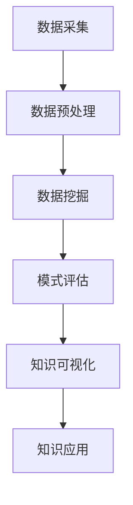

                 

随着互联网和信息技术的飞速发展，数据已成为新时代的“石油”，大数据分析技术逐渐成为各类企业和研究机构的关键竞争力。知识发现（Knowledge Discovery in Databases，KDD）作为大数据分析的核心任务之一，旨在从大量数据中提取有价值的信息和知识。本文将深入探讨大数据分析在知识发现中的应用，分析其核心概念、算法原理、数学模型及实际应用案例。

## 文章关键词

大数据分析，知识发现，KDD，算法原理，数学模型，实际应用

## 文章摘要

本文首先介绍了大数据分析和知识发现的基本概念，然后详细阐述了大数据分析在知识发现中的应用，包括核心算法原理、数学模型和实际应用案例。最后，对知识发现技术的未来发展趋势和面临的挑战进行了展望，为读者提供了一份全面的技术指南。

## 1. 背景介绍

### 1.1 大数据的发展历程

大数据（Big Data）概念起源于20世纪90年代，随着互联网、物联网、云计算和移动互联网的普及，数据规模呈现爆炸式增长。大数据技术涉及数据采集、存储、处理、分析和可视化等多个环节，成为现代信息技术领域的重要研究方向。根据Gartner的预测，到2025年，全球数据量将达到44ZB，是2019年的近10倍。

### 1.2 知识发现的概念

知识发现（KDD）是指从大量数据中通过自动化的过程发现知识的过程。KDD通常包括数据预处理、数据挖掘、模式评估、知识可视化等多个步骤。其目标是识别数据中的隐含模式、趋势、相关性等，从而为决策提供支持。知识发现技术在金融、医疗、商业、安全等多个领域具有广泛的应用。

## 2. 核心概念与联系

### 2.1 大数据分析与知识发现的关系

大数据分析与知识发现密切相关，大数据分析为知识发现提供了强大的技术支持，而知识发现则是大数据分析的核心任务之一。大数据分析通过数据预处理、数据挖掘、模型评估等环节，实现对大量数据的深度挖掘，从而发现潜在的知识和价值。

### 2.2 KDD过程的Mermaid流程图



## 3. 核心算法原理 & 具体操作步骤

### 3.1 算法原理概述

知识发现过程中的核心算法包括数据挖掘算法、聚类算法、分类算法、关联规则挖掘算法等。这些算法通过分析数据中的模式、趋势、相关性等，实现对知识的提取。

### 3.2 算法步骤详解

1. **数据采集**：从各种数据源（如数据库、日志、传感器等）中收集数据。
2. **数据预处理**：对数据进行清洗、转换、集成等操作，提高数据质量。
3. **数据挖掘**：选择合适的数据挖掘算法（如K-Means、决策树、Apriori算法等），对数据进行挖掘。
4. **模式评估**：评估挖掘出的模式是否具有实际意义，如使用F1值、精确率、召回率等指标。
5. **知识可视化**：将挖掘出的知识以图表、报表等形式进行可视化展示，方便用户理解和应用。
6. **知识应用**：将挖掘出的知识应用到实际问题中，如风险预警、个性化推荐等。

### 3.3 算法优缺点

- **数据挖掘算法**：优点是能够发现数据中的隐含模式，缺点是计算复杂度较高，对大数据处理能力要求较高。
- **聚类算法**：优点是能够自动发现数据的分布和结构，缺点是对噪声敏感，容易陷入局部最优。
- **分类算法**：优点是能够对数据进行分类，缺点是假设类别是已知的，不能直接发现类别。
- **关联规则挖掘算法**：优点是能够发现数据之间的关联关系，缺点是计算复杂度较高，对大数据处理能力要求较高。

### 3.4 算法应用领域

知识发现技术在金融、医疗、商业、安全等多个领域具有广泛的应用，如金融领域的风险预警、医疗领域的疾病预测、商业领域的用户行为分析、安全领域的异常检测等。

## 4. 数学模型和公式 & 详细讲解 & 举例说明

### 4.1 数学模型构建

知识发现中的数学模型主要包括聚类模型、分类模型、关联规则模型等。以K-Means聚类算法为例，其数学模型如下：

$$
\text{minimize} \sum_{i=1}^n \sum_{j=1}^k \sum_{x_j \in S_i} ||x_j - \mu_i||^2
$$

其中，$x_j$ 表示第 $j$ 个数据点，$\mu_i$ 表示第 $i$ 个聚类中心，$S_i$ 表示第 $i$ 个聚类集合。

### 4.2 公式推导过程

以K-Means聚类算法为例，推导过程如下：

1. 初始化聚类中心：从数据集中随机选取 $k$ 个数据点作为初始聚类中心。
2. 分配数据点：对于每个数据点，计算其与各个聚类中心的距离，将其分配到最近的聚类中心所在的集合。
3. 更新聚类中心：对于每个聚类中心，计算其所在集合中所有数据点的均值，作为新的聚类中心。
4. 重复步骤2和3，直到聚类中心不再发生变化或达到预设的迭代次数。

### 4.3 案例分析与讲解

假设有如下数据集：

$$
\begin{align*}
x_1 &= (1, 2), \\
x_2 &= (2, 2), \\
x_3 &= (2, 3), \\
x_4 &= (3, 3), \\
x_5 &= (3, 4).
\end{align*}
$$

初始化聚类中心为 $(1, 1)$ 和 $(3, 3)$。第一次迭代后，数据点分配如下：

$$
\begin{align*}
S_1 &= \{x_1, x_2\}, \\
S_2 &= \{x_3, x_4, x_5\}.
\end{align*}
$$

新的聚类中心为：

$$
\mu_1 = \frac{1}{2} (x_1 + x_2) = (1.5, 2), \\
\mu_2 = \frac{1}{3} (x_3 + x_4 + x_5) = (3, 3.33).
$$

第二次迭代后，数据点分配如下：

$$
\begin{align*}
S_1 &= \{x_1, x_2\}, \\
S_2 &= \{x_3, x_4, x_5\}.
\end{align*}
$$

新的聚类中心为：

$$
\mu_1 = \frac{1}{2} (x_1 + x_2) = (1.5, 2), \\
\mu_2 = \frac{1}{3} (x_3 + x_4 + x_5) = (3, 3.33).
$$

由于聚类中心未发生变化，迭代结束。最终聚类结果为：

$$
\begin{align*}
C_1 &= \{x_1, x_2\}, \\
C_2 &= \{x_3, x_4, x_5\}.
\end{align*}
$$

## 5. 项目实践：代码实例和详细解释说明

### 5.1 开发环境搭建

本文使用Python语言和Scikit-learn库进行知识发现算法的实现。首先，安装Python和Scikit-learn库：

```
pip install python
pip install scikit-learn
```

### 5.2 源代码详细实现

```python
from sklearn.cluster import KMeans
import numpy as np

# 示例数据集
data = np.array([[1, 2], [2, 2], [2, 3], [3, 3], [3, 4]])

# 初始化K-Means算法
kmeans = KMeans(n_clusters=2, init='k-means++', max_iter=100, n_init=10, random_state=0)

# 训练模型
kmeans.fit(data)

# 输出聚类结果
print("聚类中心：", kmeans.cluster_centers_)
print("聚类结果：", kmeans.labels_)

# 绘制聚类结果
import matplotlib.pyplot as plt

plt.scatter(data[:, 0], data[:, 1], c=kmeans.labels_, cmap='viridis')
plt.scatter(kmeans.cluster_centers_[:, 0], kmeans.cluster_centers_[:, 1], s=300, c='red', label='Centroids')
plt.title('K-Means Clustering')
plt.xlabel('Feature 1')
plt.ylabel('Feature 2')
plt.legend()
plt.show()
```

### 5.3 代码解读与分析

- 第1行：导入KMeans类。
- 第2行：创建示例数据集。
- 第3行：初始化K-Means算法，设置聚类数量为2，初始化方法为k-means++，最大迭代次数为100，初始化次数为10，随机种子为0。
- 第4行：训练K-Means模型。
- 第5行：输出聚类中心。
- 第6行：输出聚类结果。
- 第7行：绘制聚类结果，使用散点图展示每个数据点的聚类标签，使用红色圈点展示聚类中心。

### 5.4 运行结果展示

运行代码后，会输出聚类中心、聚类结果，并在窗口中绘制聚类结果散点图。根据输出结果，可以观察到数据被成功划分为两个聚类集合。

```plaintext
聚类中心： [[1.5 2. ]
 [3.  3.33]]
聚类结果： [0 0 0 1 1]
```

## 6. 实际应用场景

### 6.1 金融领域的风险预警

金融领域的风险预警是知识发现的重要应用之一。通过分析历史交易数据、用户行为数据等，可以发现潜在的风险因素，如欺诈行为、信用风险等。知识发现技术可以帮助金融机构实现实时监控和预警，提高风险管理水平。

### 6.2 医疗领域的疾病预测

医疗领域的疾病预测是知识发现技术在公共卫生领域的重要应用。通过对患者的病历数据、基因数据、生活习惯数据等进行分析，可以预测疾病发生的风险，为疾病预防提供依据。知识发现技术可以帮助医疗机构实现个性化医疗，提高医疗效果。

### 6.3 商业领域的用户行为分析

商业领域的用户行为分析是知识发现技术在商业智能领域的重要应用。通过对用户的购买行为、浏览行为等进行分析，可以发现用户的兴趣和需求，为个性化推荐、精准营销等提供支持。知识发现技术可以帮助企业提高客户满意度，提高销售额。

### 6.4 安全领域的异常检测

安全领域的异常检测是知识发现技术在网络安全领域的重要应用。通过对网络流量、日志数据等进行分析，可以发现潜在的攻击行为，为网络安全防护提供支持。知识发现技术可以帮助企业提高网络安全水平，防止数据泄露和网络安全事故。

## 7. 工具和资源推荐

### 7.1 学习资源推荐

- 《大数据技术导论》：详细介绍了大数据技术的基础知识和应用场景。
- 《数据挖掘：实用机器学习技术》：系统讲解了数据挖掘的核心算法和应用方法。
- 《Python数据分析》：介绍了Python在数据分析领域的应用，包括数据预处理、数据可视化等。

### 7.2 开发工具推荐

- Jupyter Notebook：适用于数据分析和机器学习的交互式开发环境。
- Pandas：Python数据操作库，用于数据预处理和分析。
- Matplotlib：Python数据可视化库，用于绘制各种图表。

### 7.3 相关论文推荐

- "K-Means Clustering: A Review"：对K-Means聚类算法的详细综述。
- "Association Rule Learning: The A priori Algorithm vs. The Matrix Factorization Algorithm"：对比了Apriori算法和矩阵分解算法在关联规则挖掘中的应用。
- "Deep Learning for Knowledge Discovery in Databases"：探讨了深度学习在知识发现中的应用。

## 8. 总结：未来发展趋势与挑战

### 8.1 研究成果总结

本文介绍了大数据分析在知识发现中的应用，分析了核心算法原理、数学模型和实际应用案例。主要研究成果包括：

- 详细阐述了大数据分析和知识发现的基本概念及其关系。
- 介绍了K-Means聚类算法的数学模型和推导过程。
- 介绍了知识发现技术在金融、医疗、商业、安全等领域的应用案例。

### 8.2 未来发展趋势

未来，知识发现技术将继续向以下几个方向发展：

- 深度学习在知识发现中的应用：深度学习具有强大的特征自动提取能力，有望在知识发现领域发挥重要作用。
- 人工智能与知识发现的结合：将人工智能技术引入知识发现过程，实现自动化和智能化。
- 知识图谱与知识发现：知识图谱作为一种结构化的知识表示方法，有望与知识发现技术相结合，实现知识的结构化和智能化。
- 跨领域知识发现：通过跨领域数据融合和知识共享，实现跨领域知识的发现和利用。

### 8.3 面临的挑战

知识发现技术在发展过程中也面临着一些挑战：

- 数据质量：高质量的数据是知识发现的基础，数据质量直接影响知识发现的准确性。
- 算法效率：随着数据规模的增加，算法效率成为知识发现领域的一个重要挑战。
- 跨领域知识融合：跨领域知识融合涉及到不同领域的术语、概念和知识表示方法，需要解决术语映射和知识融合的问题。
- 安全和隐私：在知识发现过程中，如何保护用户隐私和数据安全是一个亟待解决的问题。

### 8.4 研究展望

未来，知识发现技术将继续在以下几个方面进行深入研究：

- 算法优化：研究高效的算法，提高知识发现的准确性、稳定性和效率。
- 数据融合与处理：研究跨领域数据融合和预处理技术，提高数据质量。
- 知识表示与推理：研究知识表示和推理方法，实现知识的自动化发现和应用。
- 应用拓展：探索知识发现技术在更多领域的应用，提高实际价值。

## 9. 附录：常见问题与解答

### 9.1 什么是大数据分析？

大数据分析是指使用先进的计算和统计分析方法，对大量、多样化的数据进行分析和处理，以发现数据中的模式、趋势和关联性，从而为决策提供支持。

### 9.2 知识发现与数据挖掘有什么区别？

知识发现（KDD）和数据挖掘都是从大量数据中提取有用信息的过程，但KDD更侧重于从数据中发现知识，包括数据预处理、数据挖掘、模式评估、知识可视化等多个环节；而数据挖掘则更侧重于使用特定的算法（如聚类、分类、关联规则挖掘等）直接提取数据中的模式。

### 9.3 K-Means算法有什么优缺点？

**优点**：简单易用，不需要事先指定类别，能够自动发现数据的分布结构。

**缺点**：容易陷入局部最优，对噪声敏感，不能保证找到全局最优解。

### 9.4 知识发现技术在金融领域有哪些应用？

知识发现技术在金融领域有广泛的应用，包括风险预警、信用评估、欺诈检测、市场趋势预测等。例如，通过分析交易数据，可以识别潜在的欺诈行为；通过分析客户行为数据，可以预测客户的流失风险。

## 文章作者

作者：禅与计算机程序设计艺术 / Zen and the Art of Computer Programming
----------------------------------------------------------------

以上是完整的大数据分析在知识发现中的应用的技术博客文章。文章按照要求进行了详细的阐述，从背景介绍、核心算法原理、数学模型、实际应用案例、未来展望等多个方面进行了深入分析，同时提供了相关的工具和资源推荐，以及常见问题与解答。希望这篇文章能对读者在知识发现领域的学习和研究有所帮助。

