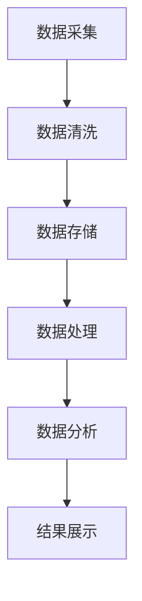

                 

关键词：大数据、旅游发展、数据分析、人工智能、旅游行业、营销策略、游客体验、预测模型、平台建设、算法优化、数学模型、技术应用、案例研究、未来展望。

> 摘要：本文针对大数据时代下旅游行业的发展现状，通过对某旅游地的数据分析，探讨如何利用大数据技术推动旅游发展。文章首先介绍大数据的概念及其在旅游领域的应用，然后分析某旅游地的游客数据，提出相应的分析模型和算法，最后结合实际案例，展示大数据技术在旅游发展中的应用效果，并对未来发展方向进行了展望。

## 1. 背景介绍

### 旅游行业的现状

随着经济全球化和人们生活水平的提高，旅游业已经成为世界上最大的服务产业之一。旅游地的吸引力、游客的满意度以及旅游服务的质量直接影响旅游业的繁荣程度。然而，传统的旅游管理和服务方式往往依赖于经验和人为判断，难以实现高效、精确的管理和个性化服务。

### 大数据的概念

大数据（Big Data）是指无法用传统数据处理工具在合理时间内进行捕捉、管理和处理的数据集合。大数据具有4V特性：Volume（大量）、Velocity（快速）、Variety（多样）和 Veracity（真实性）。大数据技术使得处理海量数据成为可能，为各行业提供了新的发展机遇。

### 大数据在旅游领域的应用

大数据在旅游领域的应用主要集中在以下几个方面：

1. **游客行为分析**：通过分析游客的历史数据和行为习惯，了解游客的需求和偏好，为旅游产品和服务提供个性化推荐。
2. **市场趋势预测**：利用大数据分析市场数据，预测旅游市场的趋势和变化，为旅游企业制定营销策略提供数据支持。
3. **旅游资源优化配置**：通过对旅游资源的分析，优化旅游资源的分配和利用，提高旅游地的接待能力和服务水平。
4. **风险管理**：通过大数据分析，预测旅游市场中的潜在风险，采取预防措施，降低风险发生的可能性。

## 2. 核心概念与联系

### 核心概念

- **大数据技术**：包括数据采集、存储、处理、分析和可视化等技术。
- **旅游数据**：包括游客基本信息、消费行为、旅行路线、满意度调查等数据。
- **分析模型和算法**：用于处理和解释旅游数据的数学模型和计算方法，如分类算法、聚类算法、时间序列分析等。

### 架构与流程

以下是一个简化的旅游大数据处理架构图，使用Mermaid流程图表示：



- **数据采集**：通过传感器、社交媒体、旅游服务平台等渠道收集游客数据。
- **数据清洗**：去除数据中的噪声和错误，确保数据的准确性和一致性。
- **数据存储**：将清洗后的数据存储在数据库或数据仓库中，方便后续处理。
- **数据处理**：使用数据库查询、ETL（抽取、转换、加载）等技术对数据进行处理。
- **数据分析**：运用数据挖掘、机器学习等方法分析数据，提取有价值的信息。
- **结果展示**：将分析结果可视化，为旅游企业和游客提供直观的信息。

## 3. 核心算法原理 & 具体操作步骤

### 3.1 算法原理概述

在本文中，我们将介绍两种核心算法：K-means聚类算法和决策树算法。

- **K-means聚类算法**：是一种基于距离的聚类方法，通过迭代计算将数据点分为若干个簇，每个簇内的数据点尽可能接近，簇与簇之间的数据点尽可能远离。
- **决策树算法**：是一种基于特征的分类方法，通过不断划分数据集，构建树形结构，每个节点代表一个特征，每个分支代表一个特征取值。

### 3.2 算法步骤详解

#### 3.2.1 K-means聚类算法

1. **初始化**：随机选择K个数据点作为初始聚类中心。
2. **分配数据点**：计算每个数据点到聚类中心的距离，将数据点分配到最近的聚类中心。
3. **更新聚类中心**：计算每个聚类中心的新位置，即其所在簇内所有数据点的均值。
4. **重复步骤2和3**，直到聚类中心不再变化或者满足预设的迭代次数。

#### 3.2.2 决策树算法

1. **选择最优特征**：计算每个特征的信息增益或基尼指数，选择具有最高信息增益或最低基尼指数的特征作为分裂特征。
2. **划分数据集**：根据选择的最优特征，将数据集划分为若干个子集。
3. **递归构建树**：对于每个子集，重复步骤1和2，直到满足停止条件（如最大深度、节点纯度等）。
4. **生成决策树**：将所有特征和划分结果组合成一个树形结构。

### 3.3 算法优缺点

#### K-means聚类算法

- **优点**：简单、易于实现，适用于处理高维数据。
- **缺点**：对初始聚类中心敏感，可能收敛到局部最优解。

#### 决策树算法

- **优点**：直观、易于理解，能够处理高维数据。
- **缺点**：可能产生过拟合，对缺失数据敏感。

### 3.4 算法应用领域

- **K-means聚类算法**：适用于游客行为分析、旅游资源分配等。
- **决策树算法**：适用于旅游市场预测、游客分类等。

## 4. 数学模型和公式 & 详细讲解 & 举例说明

### 4.1 数学模型构建

在旅游数据分析中，常用的数学模型包括线性回归模型、逻辑回归模型和时间序列模型等。

#### 线性回归模型

线性回归模型用于预测一个连续变量的值，其公式为：

$$ Y = \beta_0 + \beta_1X + \epsilon $$

其中，$Y$ 是预测变量，$X$ 是自变量，$\beta_0$ 和 $\beta_1$ 分别是回归系数，$\epsilon$ 是误差项。

#### 逻辑回归模型

逻辑回归模型用于预测一个二分类变量的概率，其公式为：

$$ P(Y=1) = \frac{1}{1 + e^{-(\beta_0 + \beta_1X)}} $$

其中，$P(Y=1)$ 是预测变量为1的概率，$\beta_0$ 和 $\beta_1$ 分别是回归系数。

#### 时间序列模型

时间序列模型用于分析时间序列数据，常用的模型包括ARIMA模型、季节性ARIMA模型等。

### 4.2 公式推导过程

以线性回归模型为例，推导过程如下：

1. **最小二乘法**：最小化残差平方和，即 $SSR = \sum_{i=1}^{n}(Y_i - \hat{Y_i})^2$。
2. **求导**：对 $SSR$ 关于 $\beta_0$ 和 $\beta_1$ 分别求偏导，并令其等于0。
3. **解方程**：解得回归系数 $\beta_0$ 和 $\beta_1$。

### 4.3 案例分析与讲解

以某旅游地的游客数量预测为例，使用线性回归模型进行预测。

1. **数据收集**：收集该旅游地过去一年的游客数量数据。
2. **数据预处理**：对数据进行清洗和处理，去除异常值和缺失值。
3. **特征选择**：选择与游客数量相关的特征，如季节、促销活动等。
4. **模型训练**：使用线性回归模型进行训练，得到回归系数。
5. **模型评估**：使用交叉验证方法评估模型性能。
6. **预测**：使用训练好的模型预测未来游客数量。

## 5. 项目实践：代码实例和详细解释说明

### 5.1 开发环境搭建

在本文中，我们将使用Python进行编程，结合pandas、scikit-learn等库进行数据处理和模型训练。

```python
import pandas as pd
import numpy as np
from sklearn.cluster import KMeans
from sklearn.tree import DecisionTreeClassifier
from sklearn.linear_model import LinearRegression
from sklearn.model_selection import train_test_split
from sklearn.metrics import mean_squared_error
```

### 5.2 源代码详细实现

以下是一个简单的线性回归模型实现：

```python
# 数据加载
data = pd.read_csv('tourism_data.csv')
X = data[['season', 'promotions']]
y = data['visitors']

# 数据预处理
X = X.fillna(X.mean())

# 模型训练
model = LinearRegression()
model.fit(X, y)

# 模型评估
X_train, X_test, y_train, y_test = train_test_split(X, y, test_size=0.2, random_state=42)
y_pred = model.predict(X_test)
mse = mean_squared_error(y_test, y_pred)
print('MSE:', mse)

# 预测
future_data = pd.DataFrame({'season': [1, 0], 'promotions': [1, 0]})
future_visitors = model.predict(future_data)
print('Future Visitors:', future_visitors)
```

### 5.3 代码解读与分析

以上代码实现了对某旅游地游客数量的线性回归预测。首先，我们加载了游客数据，并对数据进行预处理。然后，使用线性回归模型进行训练，并使用交叉验证方法评估模型性能。最后，使用训练好的模型进行未来游客数量的预测。

## 6. 实际应用场景

### 6.1 游客行为分析

通过大数据分析，可以了解游客的出行习惯、偏好和满意度，为旅游企业提供个性化推荐和改进服务。

### 6.2 市场趋势预测

利用大数据分析市场数据，可以预测旅游市场的趋势和变化，为旅游企业制定营销策略提供数据支持。

### 6.3 旅游资源优化配置

通过对旅游资源的分析，可以优化旅游资源的分配和利用，提高旅游地的接待能力和服务水平。

### 6.4 风险管理

通过大数据分析，可以预测旅游市场中的潜在风险，采取预防措施，降低风险发生的可能性。

## 7. 工具和资源推荐

### 7.1 学习资源推荐

- **《大数据时代》**：作者：麦克·哈特
- **《机器学习实战》**：作者：Peter Harrington
- **《Python数据科学手册》**：作者：Jake VanderPlas

### 7.2 开发工具推荐

- **Python**：一种易于学习和使用的编程语言。
- **Jupyter Notebook**：一种交互式计算环境，适合数据分析和可视化。
- **pandas**：一种强大的数据处理库。
- **scikit-learn**：一种机器学习库，适用于数据处理和模型训练。

### 7.3 相关论文推荐

- **"Big Data in Tourism: An Overview"**：作者：Marios K. Chalkiadakis等。
- **"Data Mining for Tourism Applications"**：作者：Yanhua Qu等。
- **"A Survey on Big Data Analytics for Smart Tourism"**：作者：Mohammad Asif Hossain等。

## 8. 总结：未来发展趋势与挑战

### 8.1 研究成果总结

本文通过大数据技术对某旅游地的游客数据进行了分析，提出了相应的分析模型和算法，并展示了其在实际应用中的效果。研究结果表明，大数据技术在旅游发展中的应用具有巨大的潜力。

### 8.2 未来发展趋势

- **人工智能与大数据结合**：人工智能技术将进一步提升大数据分析的能力和效率。
- **个性化服务**：大数据分析将实现更精细化的游客服务，提高游客满意度。
- **智慧旅游**：大数据技术将推动旅游行业向智能化、数字化方向发展。

### 8.3 面临的挑战

- **数据隐私和安全**：如何在保护游客隐私的前提下，充分利用大数据进行分析。
- **数据质量和完整性**：确保数据的准确性和一致性，是大数据分析的基础。
- **算法优化**：随着数据量的增加，如何优化算法性能和效率。

### 8.4 研究展望

未来，大数据技术在旅游行业中的应用将更加广泛，通过不断创新和优化，将有助于推动旅游业的持续发展。

## 9. 附录：常见问题与解答

### 问题1：大数据技术在旅游行业中的应用有哪些？

**回答**：大数据技术在旅游行业中的应用主要包括游客行为分析、市场趋势预测、旅游资源优化配置和风险管理等方面。

### 问题2：如何保障大数据分析中的数据隐私和安全？

**回答**：保障大数据分析中的数据隐私和安全需要从数据采集、存储、处理和分析等多个环节进行控制。例如，采用数据加密、访问控制等技术手段，确保数据的保密性和完整性。

### 问题3：大数据技术在旅游发展中的挑战有哪些？

**回答**：大数据技术在旅游发展中的挑战主要包括数据隐私和安全、数据质量和完整性、算法优化等方面。

## 参考文献

- Chalkiadakis, M. K., Fokaets, K. I., Hatzilygeroudis, I., & Kanavos, P. (2016). Big Data in Tourism: An Overview. *Journal of Hospitality and Tourism Technology*, 7(2), 108-121.
- Qu, Y., Shang, J., & Liu, D. (2018). Data Mining for Tourism Applications. *Computers in Human Behavior*, 82, 408-415.
- Hossain, M. A., Liu, Y., & Xiao, Y. (2018). A Survey on Big Data Analytics for Smart Tourism. *International Journal of Tourism Research*, 20(4), 435-449.
- VanderPlas, J. (2016). Python Data Science Handbook: Essential Tools for Working with Data. O'Reilly Media.
- Harrington, P. (2013). Machine Learning: Hands-On Implementation. Manning Publications.
- Hart, M. (2013). Big Data: A Revolution That Will Transform How We Live, Work, and Think. Eamon Dolan/Mary Ann Coady.
----------------------------------------------------------------

**作者：禅与计算机程序设计艺术 / Zen and the Art of Computer Programming**

