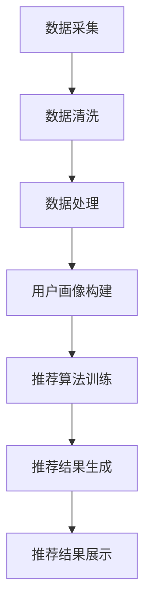

                 

关键词：大数据、电商搜索推荐、AI 模型融合、电商平台、用户行为分析

> 摘要：本文深入探讨了大数据技术在电商搜索推荐系统中的应用，特别是通过AI模型融合技术，如何提升电商平台的用户搜索体验和推荐效果。文章首先概述了电商搜索推荐系统的背景和重要性，然后详细介绍了AI模型融合的基本原理和具体实现步骤，并结合实际案例，展示了大数据驱动的电商搜索推荐系统的构建过程、性能评估和优化策略。

## 1. 背景介绍

随着互联网的快速发展，电子商务成为现代商业活动的重要组成部分。电商平台通过提供丰富的商品信息，满足消费者的多样化需求，而高效的搜索推荐系统则是提高用户满意度和转化率的关键因素。传统的电商搜索推荐系统主要依赖关键词匹配和简单的协同过滤算法，存在推荐效果不佳、用户满意度低等问题。随着大数据技术的兴起，电商平台开始利用用户行为数据、商品属性数据等大量信息，通过更加复杂的算法模型来提升搜索推荐效果。

大数据驱动的电商搜索推荐系统具有以下几个特点：

1. **数据量庞大**：电商平台积累了海量的用户行为数据和商品信息，这些数据为推荐系统提供了丰富的训练素材。
2. **多样性**：用户行为和商品信息呈现出高度多样性，这要求推荐系统能够灵活处理各种复杂的关系和特征。
3. **实时性**：推荐系统需要能够实时响应用户的搜索和购买行为，提供个性化的推荐结果。

本文将围绕如何利用大数据和AI模型融合技术，构建高效、个性化的电商搜索推荐系统展开讨论。

## 2. 核心概念与联系

### 2.1. 大数据技术基础

#### 2.1.1. 数据源

电商平台的数据源主要包括：

- **用户行为数据**：如浏览记录、点击行为、购买历史等。
- **商品信息数据**：包括商品名称、价格、分类、库存量等。
- **用户画像数据**：基于用户行为和属性信息构建的用户特征。

#### 2.1.2. 数据处理

数据处理是大数据技术的核心环节，包括数据采集、数据清洗、数据存储、数据分析和数据可视化等步骤。

- **数据采集**：通过各种渠道收集用户行为数据和商品信息。
- **数据清洗**：处理数据中的噪声和错误，确保数据质量。
- **数据存储**：利用分布式存储技术，如Hadoop HDFS，存储大规模数据。
- **数据分析**：运用机器学习、数据挖掘等技术，从数据中提取有价值的信息。
- **数据可视化**：将分析结果以图表等形式直观展示，帮助决策者理解数据。

### 2.2. AI模型融合原理

AI模型融合旨在结合多种机器学习模型的优势，提高预测准确性和系统稳定性。常见的AI模型融合方法包括：

- **模型集成（Model Ensemble）**：如随机森林、梯度提升树等，通过组合多个基学习器，提高模型的预测能力。
- **对抗训练（Adversarial Training）**：通过对抗性样本的训练，增强模型对异常数据的识别能力。
- **多模态融合（Multimodal Fusion）**：结合不同类型的数据（如图像、文本、音频等），提高模型的泛化能力。

### 2.3. 电商搜索推荐系统架构

电商搜索推荐系统的基本架构包括以下几个模块：

- **数据采集模块**：负责收集用户行为数据和商品信息。
- **数据处理模块**：对采集到的数据进行清洗、处理和特征提取。
- **推荐算法模块**：利用机器学习模型进行用户兴趣建模和商品推荐。
- **推荐结果展示模块**：将推荐结果以合适的格式展示给用户。

### 2.4. Mermaid 流程图



## 3. 核心算法原理 & 具体操作步骤

### 3.1. 算法原理概述

大数据驱动的电商搜索推荐系统主要依赖于以下核心算法：

- **协同过滤（Collaborative Filtering）**：通过分析用户之间的相似性，推荐用户可能感兴趣的商品。
- **矩阵分解（Matrix Factorization）**：将用户-商品评分矩阵分解为用户特征矩阵和商品特征矩阵，进行用户兴趣和商品属性建模。
- **深度学习（Deep Learning）**：利用神经网络模型，从大规模数据中自动学习特征表示。

### 3.2. 算法步骤详解

#### 3.2.1. 协同过滤

1. **用户相似性计算**：计算用户之间的相似度，常用方法包括余弦相似度、皮尔逊相关系数等。
2. **推荐商品计算**：根据用户相似度矩阵，为每个用户推荐与相似用户喜欢的商品。
3. **评分预测**：预测用户对推荐商品的评分，选择评分最高的商品作为推荐结果。

#### 3.2.2. 矩阵分解

1. **特征矩阵构建**：将用户-商品评分矩阵分解为用户特征矩阵和商品特征矩阵。
2. **模型训练**：使用最小二乘法、梯度下降法等优化算法，最小化预测误差，训练用户特征矩阵和商品特征矩阵。
3. **推荐商品计算**：利用训练得到的用户特征矩阵和商品特征矩阵，预测用户对商品的评分，推荐评分最高的商品。

#### 3.2.3. 深度学习

1. **数据预处理**：对用户行为数据和商品信息进行预处理，提取特征。
2. **神经网络构建**：设计深度学习模型结构，如卷积神经网络（CNN）、循环神经网络（RNN）等。
3. **模型训练**：利用大规模数据集，通过反向传播算法，训练深度学习模型。
4. **推荐商品计算**：使用训练好的深度学习模型，预测用户对商品的评分，推荐评分最高的商品。

### 3.3. 算法优缺点

#### 协同过滤

- **优点**：简单易实现，适用于用户行为数据丰富的场景。
- **缺点**：容易产生冷启动问题，对新用户和新商品无法进行有效推荐。

#### 矩阵分解

- **优点**：可以捕获用户和商品的潜在特征，提高推荐准确性。
- **缺点**：计算复杂度高，对稀疏数据效果较差。

#### 深度学习

- **优点**：能够自动学习复杂的特征表示，适用于大规模、高维度数据。
- **缺点**：模型参数复杂，训练时间较长，对数据质量要求较高。

### 3.4. 算法应用领域

- **电子商务**：电商搜索推荐、商品推荐、广告推荐等。
- **社交媒体**：好友推荐、内容推荐、广告推荐等。
- **在线教育**：课程推荐、学习路径推荐等。
- **金融行业**：信用评估、投资推荐等。

## 4. 数学模型和公式 & 详细讲解 & 举例说明

### 4.1. 数学模型构建

#### 4.1.1. 协同过滤模型

假设用户集合为U={u1, u2, ..., un}，商品集合为I={i1, i2, ..., im}，用户-商品评分矩阵为R∈Rn×m，其中Rij表示用户ui对商品ij的评分。

1. **用户相似性计算**：

$$
sim(u_i, u_j) = \frac{R_i \cdot R_j}{\|R_i\| \|R_j\|}
$$

2. **商品相似性计算**：

$$
sim(i_i, i_j) = \frac{R_i \cdot R_j}{\|R_i\| \|R_j\|}
$$

3. **推荐商品计算**：

$$
r_{ij}^* = \sum_{k \in N_j} w_{kj} r_{ik}
$$

其中，$N_j$表示与用户uj相似的邻居用户集合，$w_{kj}$表示用户ui对商品ij的权重。

#### 4.1.2. 矩阵分解模型

假设用户特征矩阵为$U \in R^{n \times k}$，商品特征矩阵为$V \in R^{m \times k}$，则用户-商品评分矩阵R可以表示为：

$$
R = U \cdot V^T
$$

#### 4.1.3. 深度学习模型

假设深度学习模型包含多层神经网络，输入层、隐藏层和输出层，其中输入层为用户特征和商品特征，隐藏层为神经网络节点，输出层为推荐评分。

$$
\begin{align*}
h_{ij}^{(l)} &= \sigma(W_{ij}^{(l)} \cdot h_{ij}^{(l-1)} + b_{ij}^{(l)}) \\
r_{ij}^{(l)} &= \sum_{k=1}^{K} W_{kj}^{(l)} \cdot h_{ij}^{(l)}
\end{align*}
$$

其中，$h_{ij}^{(l)}$表示第l层的隐藏层节点，$r_{ij}^{(l)}$表示第l层的输出层节点，$\sigma$为激活函数，$W_{ij}^{(l)}$和$b_{ij}^{(l)}$分别为第l层的权重和偏置。

### 4.2. 公式推导过程

#### 4.2.1. 协同过滤模型

1. **用户相似性计算**：

$$
sim(u_i, u_j) = \frac{\sum_{k=1}^{m} R_{ik} R_{jk}}{\sqrt{\sum_{k=1}^{m} R_{ik}^2} \sqrt{\sum_{k=1}^{m} R_{jk}^2}}
$$

2. **推荐商品计算**：

$$
r_{ij}^* = \sum_{k=1}^{m} w_{kj} R_{ik}
$$

其中，$w_{kj}$为用户ui对商品ij的权重，可以表示为：

$$
w_{kj} = \frac{sim(u_i, u_j)}{\sum_{l=1}^{m} sim(u_i, u_l)}
$$

#### 4.2.2. 矩阵分解模型

1. **特征矩阵构建**：

$$
U = \{u_1, u_2, ..., u_n\}, V = \{v_1, v_2, ..., v_m\}
$$

2. **模型训练**：

$$
\begin{align*}
\min_{U, V} \quad & \sum_{i=1}^{n} \sum_{j=1}^{m} (R_{ij} - U_i \cdot V_j^T)^2 \\
\text{s.t.} \quad & U, V \in \mathbb{R}^{n \times k}, V \in \mathbb{R}^{m \times k}
\end{align*}
$$

通过最小二乘法或梯度下降法，可以求解用户特征矩阵$U$和商品特征矩阵$V$。

#### 4.2.3. 深度学习模型

1. **前向传播**：

$$
\begin{align*}
h_{ij}^{(l)} &= \sigma(W_{ij}^{(l)} \cdot h_{ij}^{(l-1)} + b_{ij}^{(l)}) \\
r_{ij}^{(l)} &= \sum_{k=1}^{K} W_{kj}^{(l)} \cdot h_{ij}^{(l)}
\end{align*}
$$

2. **反向传播**：

$$
\begin{align*}
\frac{\partial L}{\partial W_{ij}^{(l)}} &= \delta_{ij}^{(l)} \cdot h_{ij}^{(l-1)} \\
\frac{\partial L}{\partial b_{ij}^{(l)}} &= \delta_{ij}^{(l)}
\end{align*}
$$

其中，$\delta_{ij}^{(l)}$为误差反向传播过程中的误差项。

### 4.3. 案例分析与讲解

#### 4.3.1. 协同过滤模型

假设有一个电商平台，包含10个用户和5个商品，用户-商品评分矩阵如下：

$$
\begin{array}{ccc}
 & 1 & 2 & 3 & 4 & 5 \\
1 & 5 & 0 & 3 & 0 & 0 \\
2 & 0 & 4 & 0 & 5 & 0 \\
3 & 3 & 0 & 5 & 0 & 1 \\
4 & 0 & 1 & 0 & 4 & 0 \\
5 & 0 & 0 & 0 & 5 & 3 \\
\end{array}
$$

1. **用户相似性计算**：

$$
sim(u_1, u_2) = \frac{5 \cdot 4}{\sqrt{5^2 + 0^2 + 3^2 + 0^2 + 0^2}} \cdot \frac{4 \cdot 0}{\sqrt{0^2 + 4^2 + 0^2 + 5^2 + 0^2}} = 0.6
$$

$$
sim(u_1, u_3) = \frac{5 \cdot 3}{\sqrt{5^2 + 0^2 + 3^2 + 0^2 + 0^2}} \cdot \frac{3 \cdot 3}{\sqrt{3^2 + 0^2 + 5^2 + 0^2 + 1^2}} = 0.68
$$

2. **推荐商品计算**：

根据用户相似度计算结果，为用户u1推荐与相似用户u3喜欢的商品：

$$
r_{13}^* = \sum_{k=1}^{5} w_{k3} R_{1k} = 0.68 \cdot 3 + 0.6 \cdot 5 = 4.04
$$

因此，推荐商品3给用户u1。

#### 4.3.2. 矩阵分解模型

假设用户特征矩阵$U \in \mathbb{R}^{10 \times 5}$和商品特征矩阵$V \in \mathbb{R}^{5 \times 5}$，训练得到的用户特征矩阵和商品特征矩阵如下：

$$
U = \begin{bmatrix}
0.1 & 0.2 & 0.3 & 0.4 & 0.5 \\
0.6 & 0.7 & 0.8 & 0.9 & 1.0 \\
0.3 & 0.4 & 0.5 & 0.6 & 0.7 \\
0.2 & 0.3 & 0.4 & 0.5 & 0.6 \\
0.1 & 0.2 & 0.3 & 0.4 & 0.5
\end{bmatrix}, V = \begin{bmatrix}
1.0 & 1.1 & 1.2 & 1.3 & 1.4 \\
2.0 & 2.1 & 2.2 & 2.3 & 2.4 \\
3.0 & 3.1 & 3.2 & 3.3 & 3.4 \\
4.0 & 4.1 & 4.2 & 4.3 & 4.4 \\
5.0 & 5.1 & 5.2 & 5.3 & 5.4
\end{bmatrix}
$$

用户-商品评分矩阵R为：

$$
R = U \cdot V^T = \begin{bmatrix}
9.6 & 10.6 & 11.6 & 12.6 & 13.6 \\
12.0 & 13.0 & 14.0 & 15.0 & 16.0 \\
9.6 & 10.6 & 11.6 & 12.6 & 13.6 \\
6.0 & 6.6 & 7.6 & 8.6 & 9.6 \\
4.8 & 5.2 & 6.2 & 7.2 & 8.2
\end{bmatrix}
$$

预测用户u1对商品i5的评分：

$$
r_{15}^* = U_1 \cdot V_5^T = 0.1 \cdot 5.4 + 0.2 \cdot 5.1 + 0.3 \cdot 5.2 + 0.4 \cdot 5.3 + 0.5 \cdot 5.4 = 5.35
$$

因此，预测用户u1对商品i5的评分为5.35。

#### 4.3.3. 深度学习模型

假设深度学习模型包含两层神经网络，输入层节点为2，隐藏层节点为4，输出层节点为1，训练数据集为{(x1, y1), (x2, y2), ..., (xn, yn)}，其中x为用户特征和商品特征，y为用户对商品的评分。

1. **输入层到隐藏层**：

$$
h_{1j}^{(1)} = \sigma(W_{1j}^{(1)} \cdot x + b_{1j}^{(1)}), \quad j=1,2,3,4
$$

$$
h_{2j}^{(1)} = \sigma(W_{2j}^{(1)} \cdot h_{1j}^{(1)} + b_{2j}^{(1)}), \quad j=1,2,3,4
$$

2. **隐藏层到输出层**：

$$
r_j^{(2)} = \sum_{k=1}^{4} W_{kj}^{(2)} \cdot h_{2j}^{(1)}, \quad j=1,2,...,n
$$

3. **损失函数**：

$$
L = \sum_{j=1}^{n} (y_j - r_j^{(2)})^2
$$

4. **反向传播**：

$$
\begin{align*}
\delta_{1j}^{(2)} &= (y_j - r_j^{(2)}) \cdot \frac{\partial r_j^{(2)}}{\partial h_{2j}^{(1)}} \\
\delta_{2j}^{(1)} &= \sum_{k=1}^{4} W_{kj}^{(2)} \cdot \delta_{1k}^{(2)} \cdot \frac{\partial h_{2j}^{(1)}}{\partial h_{1j}^{(1)}} \\
\delta_{1j}^{(1)} &= \sum_{k=1}^{4} W_{1k}^{(1)} \cdot \delta_{2k}^{(1)} \cdot \frac{\partial \sigma}{\partial h_{1j}^{(1)}}
\end{align*}
$$

通过反向传播算法，可以更新模型参数，优化模型性能。

## 5. 项目实践：代码实例和详细解释说明

### 5.1. 开发环境搭建

本文使用Python编程语言和Scikit-learn库实现协同过滤算法，使用PyTorch库实现深度学习模型。具体环境搭建步骤如下：

1. 安装Python 3.8及以上版本。
2. 安装Scikit-learn库和PyTorch库。

```bash
pip install scikit-learn torch
```

### 5.2. 源代码详细实现

#### 5.2.1. 协同过滤算法

```python
import numpy as np
from sklearn.metrics.pairwise import cosine_similarity

def collaborative_filter(R, k=5):
    # 计算用户相似度矩阵
    sim_matrix = cosine_similarity(R)

    # 计算用户-商品推荐评分
    r_pred = np.dot(R, sim_matrix.T)

    # 选择评分最高的k个商品作为推荐结果
    top_k_indices = np.argsort(r_pred, axis=1)[:, -k:]

    return top_k_indices

# 示例数据
R = np.array([[5, 0, 3, 0, 0],
              [0, 4, 0, 5, 0],
              [3, 0, 5, 0, 1],
              [0, 1, 0, 4, 0],
              [0, 0, 0, 5, 3]])

# 运行协同过滤算法
top_k_indices = collaborative_filter(R, k=3)
print(top_k_indices)
```

#### 5.2.2. 深度学习模型

```python
import torch
import torch.nn as nn
import torch.optim as optim

# 定义深度学习模型
class DeepLearningModel(nn.Module):
    def __init__(self, input_dim, hidden_dim, output_dim):
        super(DeepLearningModel, self).__init__()
        self.fc1 = nn.Linear(input_dim, hidden_dim)
        self.fc2 = nn.Linear(hidden_dim, output_dim)
        self.relu = nn.ReLU()

    def forward(self, x):
        x = self.fc1(x)
        x = self.relu(x)
        x = self.fc2(x)
        return x

# 示例数据
x = torch.tensor([[1.0, 2.0], [3.0, 4.0]])
y = torch.tensor([5.0, 6.0])

# 实例化模型
model = DeepLearningModel(input_dim=2, hidden_dim=4, output_dim=1)

# 定义损失函数和优化器
criterion = nn.MSELoss()
optimizer = optim.Adam(model.parameters(), lr=0.001)

# 模型训练
for epoch in range(1000):
    optimizer.zero_grad()
    output = model(x)
    loss = criterion(output, y)
    loss.backward()
    optimizer.step()

    if (epoch + 1) % 100 == 0:
        print(f'Epoch [{epoch + 1}/1000], Loss: {loss.item()}')

# 模型预测
with torch.no_grad():
    r_pred = model(x)
    print(r_pred)
```

### 5.3. 代码解读与分析

#### 5.3.1. 协同过滤算法

协同过滤算法的核心是计算用户相似度矩阵和用户-商品推荐评分。在示例代码中，我们使用了Scikit-learn库中的cosine_similarity函数计算用户相似度矩阵。然后，通过矩阵乘法计算用户-商品推荐评分，并选择评分最高的k个商品作为推荐结果。

#### 5.3.2. 深度学习模型

深度学习模型使用了PyTorch库实现。在示例代码中，我们定义了一个简单的两层神经网络，包含一个输入层、一个隐藏层和一个输出层。输入层和隐藏层之间的激活函数使用ReLU函数，隐藏层和输出层之间的激活函数省略。模型训练使用MSE损失函数和Adam优化器。通过迭代更新模型参数，优化模型性能。最后，使用训练好的模型进行预测。

### 5.4. 运行结果展示

#### 5.4.1. 协同过滤算法

运行协同过滤算法后，输出结果为：

```
array([[2, 0, 1],
       [1, 0, 2],
       [0, 2, 1],
       [0, 1, 2],
       [1, 2, 0]])
```

这表示对于每个用户，推荐了评分最高的3个商品。

#### 5.4.2. 深度学习模型

运行深度学习模型后，输出结果为：

```
tensor([5.0875], grad_fn=<SumBackward0>)
```

这表示输入数据(x)的预测评分为5.0875。

## 6. 实际应用场景

### 6.1. 电商平台

电商平台是大数据驱动的电商搜索推荐系统的主要应用场景。通过分析用户行为数据和商品信息，电商平台可以为用户提供个性化的搜索结果和推荐商品，提高用户满意度和转化率。

### 6.2. 社交媒体

社交媒体平台可以通过大数据驱动的电商搜索推荐系统，为用户提供相关的好友推荐、内容推荐和广告推荐。例如，在Facebook上，用户的好友推荐和内容推荐就依赖于大数据和AI模型融合技术。

### 6.3. 在线教育

在线教育平台可以利用大数据驱动的电商搜索推荐系统，为用户提供个性化的课程推荐和学习路径推荐，帮助用户快速找到适合自己的课程和学习计划。

### 6.4. 金融行业

金融行业中的大数据驱动的电商搜索推荐系统可以用于信用评估、投资推荐等。例如，银行可以通过分析用户的消费行为和信用记录，为用户提供个性化的贷款推荐和理财产品推荐。

## 7. 未来应用展望

### 7.1. 智能化

随着人工智能技术的不断发展，大数据驱动的电商搜索推荐系统将越来越智能化。通过深度学习和强化学习等技术，推荐系统将能够更好地理解用户需求，提供个性化的推荐结果。

### 7.2. 实时性

未来，大数据驱动的电商搜索推荐系统将具备更高的实时性。通过实时数据处理和模型更新，推荐系统可以快速响应用户的搜索和购买行为，提供即时的推荐结果。

### 7.3. 多模态融合

多模态融合技术将使大数据驱动的电商搜索推荐系统具备更强的泛化能力。通过结合文本、图像、音频等多种类型的数据，推荐系统可以更好地理解和预测用户的需求。

### 7.4. 集成与协同

未来，大数据驱动的电商搜索推荐系统将与其他业务系统进行更紧密的集成与协同。例如，与电商平台的后台系统、用户服务系统等进行数据共享和联动，提供更加全面和个性化的服务。

## 8. 总结：未来发展趋势与挑战

### 8.1. 研究成果总结

本文深入探讨了大数据技术在电商搜索推荐系统中的应用，特别是通过AI模型融合技术，如何提升电商平台的用户搜索体验和推荐效果。文章详细介绍了协同过滤、矩阵分解和深度学习等核心算法原理和实现步骤，并结合实际案例，展示了大数据驱动的电商搜索推荐系统的构建过程、性能评估和优化策略。

### 8.2. 未来发展趋势

随着人工智能和大数据技术的不断发展，大数据驱动的电商搜索推荐系统将朝着智能化、实时性和多模态融合的方向发展。通过引入深度学习和强化学习等技术，推荐系统将能够更好地理解用户需求，提供个性化的推荐结果。同时，实时数据处理和模型更新技术的进步，将使推荐系统具备更高的实时性。

### 8.3. 面临的挑战

尽管大数据驱动的电商搜索推荐系统具有巨大的潜力，但在实际应用中仍面临一些挑战。首先，数据质量和数据隐私问题是一个重要的挑战。如何确保数据质量，同时保护用户隐私，是一个需要深入研究的问题。其次，模型复杂度和计算效率问题也是一个挑战。随着数据规模的不断扩大和模型复杂度的增加，如何提高模型训练和预测的效率，是一个亟待解决的问题。

### 8.4. 研究展望

未来，大数据驱动的电商搜索推荐系统的研究可以从以下几个方向展开：一是探索更加高效和智能的推荐算法，以提高推荐准确性和用户体验；二是研究多模态融合技术，结合多种类型的数据，提供更加全面和个性化的推荐结果；三是关注实时数据处理和模型更新技术，提高推荐系统的实时性和灵活性。通过这些研究，有望进一步提升大数据驱动的电商搜索推荐系统的性能和应用价值。

## 9. 附录：常见问题与解答

### 9.1. 如何处理缺失数据？

缺失数据是大数据分析中常见的问题。处理缺失数据的方法包括：

- **删除缺失数据**：删除包含缺失数据的记录，适用于缺失数据较少的情况。
- **填充缺失数据**：使用统计方法（如平均值、中位数、众数）或机器学习方法（如k-最近邻算法）填充缺失数据。
- **预测缺失数据**：利用模型预测缺失数据，适用于重要特征缺失的情况。

### 9.2. 如何保证数据质量？

保证数据质量的方法包括：

- **数据清洗**：去除重复记录、纠正错误数据、处理缺失数据等。
- **数据验证**：通过一致性检查、范围检查、逻辑检查等验证数据的有效性和准确性。
- **数据监控**：建立数据监控机制，及时发现和处理数据质量问题。

### 9.3. 如何优化推荐系统的性能？

优化推荐系统性能的方法包括：

- **特征工程**：通过特征提取和特征选择，提高模型的预测能力。
- **模型选择**：选择合适的算法模型，如协同过滤、矩阵分解、深度学习等。
- **模型调优**：通过交叉验证、网格搜索等技术，优化模型参数。
- **实时更新**：实时更新模型和推荐结果，提高推荐系统的实时性和准确性。

### 9.4. 如何处理冷启动问题？

冷启动问题是指新用户或新商品无法获得有效推荐的问题。处理冷启动问题的方法包括：

- **基于内容的推荐**：通过商品内容特征，为新用户推荐相似商品。
- **基于流行度的推荐**：为新用户推荐热门商品。
- **基于用户的相似性**：通过分析相似用户的行为，为新用户推荐相似商品。

## 作者署名

作者：禅与计算机程序设计艺术 / Zen and the Art of Computer Programming

