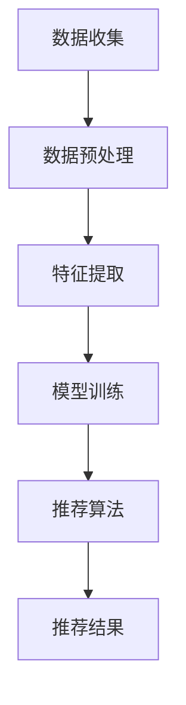

                 

关键词：大数据、电商搜索推荐、AI 模型、用户体验、融合技术

摘要：本文主要探讨了大数据技术在电商搜索推荐系统中的应用，以及如何通过AI模型融合技术来提升用户体验。首先，介绍了大数据和AI模型的基本概念及其在电商搜索推荐中的作用。接着，详细分析了电商搜索推荐系统的核心算法原理和具体操作步骤，包括其优缺点和应用领域。随后，通过数学模型和公式的构建与推导，解释了算法的核心逻辑。紧接着，通过代码实例展示了如何实现电商搜索推荐系统。最后，探讨了该技术的实际应用场景、未来发展趋势与挑战，并推荐了相关学习资源、开发工具和论文。

## 1. 背景介绍

### 1.1 大数据的概念与特点

大数据（Big Data）指的是数据量巨大、数据类型多样化且数据生成速度极快的海量信息集合。其特点包括：数据量（Volume）、数据类型（Variety）、数据速度（Velocity）和数据价值（Value）。

- **数据量**：大数据通常以TB、PB甚至EB为单位进行衡量，这使得传统的数据处理工具难以胜任。
- **数据类型**：大数据不仅包括结构化数据，还涵盖了半结构化数据和非结构化数据，如图像、音频和视频等。
- **数据速度**：随着互联网和物联网的发展，数据的生成和消费速度越来越快，实时处理成为必要。
- **数据价值**：大数据的价值在于从海量数据中提取出有价值的信息，帮助企业做出更精准的决策。

### 1.2 电商搜索推荐系统的现状

随着电商行业的迅速发展，消费者对个性化服务的需求日益增长。电商搜索推荐系统成为了提升用户体验和转化率的关键技术。

- **现状**：目前，大多数电商平台已经实现了基于内容的推荐和协同过滤推荐两种主要推荐算法。然而，这些算法在处理海量数据和实现实时推荐方面仍存在一定的局限性。
- **挑战**：电商搜索推荐系统面临的挑战包括推荐准确度、实时性、用户隐私保护和数据多样性等。

### 1.3 AI 模型的引入

AI模型（如深度学习、强化学习等）在电商搜索推荐系统中的应用，为解决上述挑战提供了新的思路。

- **作用**：AI模型能够通过学习和理解用户行为数据，实现更精准的个性化推荐。
- **技术优势**：与传统的推荐算法相比，AI模型具有更高的灵活性和扩展性，能够处理更复杂的数据结构和应用场景。

## 2. 核心概念与联系

### 2.1 大数据与AI模型的关系

大数据为AI模型提供了丰富的训练数据，而AI模型则利用这些数据对用户行为进行建模，从而实现个性化推荐。

### 2.2 电商搜索推荐系统的架构

电商搜索推荐系统的架构通常包括数据收集、数据预处理、特征提取、模型训练和推荐算法等环节。

### 2.3 Mermaid 流程图



## 3. 核心算法原理 & 具体操作步骤

### 3.1 算法原理概述

电商搜索推荐系统主要基于用户行为数据，利用协同过滤、基于内容的推荐和深度学习等方法进行建模和预测。

### 3.2 算法步骤详解

1. 数据收集：从电商平台获取用户行为数据，如浏览记录、购买记录和评价等。
2. 数据预处理：对原始数据进行清洗、去噪和归一化处理，确保数据质量。
3. 特征提取：从预处理后的数据中提取用户和商品的特征，如用户兴趣、商品属性等。
4. 模型训练：利用提取的特征数据训练AI模型，如基于深度学习的推荐模型。
5. 推荐算法：根据训练好的模型为用户生成个性化推荐列表。
6. 推荐结果：将推荐结果展示给用户，并根据用户反馈进行迭代优化。

### 3.3 算法优缺点

- **协同过滤**：优点是简单有效，缺点是容易导致冷启动问题和数据稀疏性。
- **基于内容的推荐**：优点是能够提供相关性高的推荐，缺点是对新商品和用户的不适应性。
- **深度学习**：优点是能够处理复杂数据结构和应用场景，缺点是需要大量训练数据和计算资源。

### 3.4 算法应用领域

- **电商平台**：为用户提供个性化推荐，提升用户体验和转化率。
- **社交媒体**：为用户提供感兴趣的内容和用户，促进社交互动。
- **在线广告**：为广告主提供目标用户，提高广告投放效果。

## 4. 数学模型和公式 & 详细讲解 & 举例说明

### 4.1 数学模型构建

假设用户 $u$ 对商品 $i$ 的评分可以表示为 $r_{ui}$，则基于用户行为的推荐模型可以表示为：

$$
\hat{r}_{ui} = \mu + b_u + b_i + \sum_{k \in N(u)} w_{uk} r_{ki}
$$

其中，$\mu$ 为全局平均评分，$b_u$ 和 $b_i$ 分别为用户 $u$ 和商品 $i$ 的偏置项，$N(u)$ 为用户 $u$ 的邻居集合，$w_{uk}$ 为用户 $u$ 与邻居 $k$ 之间的权重。

### 4.2 公式推导过程

假设用户 $u$ 对商品 $i$ 的评分可以表示为用户兴趣向量 $q_u$ 和商品特征向量 $q_i$ 的内积：

$$
r_{ui} = q_u \cdot q_i
$$

为了预测用户 $u$ 对商品 $i$ 的评分 $\hat{r}_{ui}$，我们可以利用用户 $u$ 的邻居集合 $N(u)$ 中的用户兴趣向量，通过加权平均的方式得到预测评分：

$$
\hat{r}_{ui} = \sum_{k \in N(u)} w_{uk} q_k \cdot q_i
$$

其中，$w_{uk}$ 为用户 $u$ 与邻居 $k$ 之间的权重，可以通过用户相似度计算得到。

### 4.3 案例分析与讲解

假设有两个用户 $u_1$ 和 $u_2$，以及两个商品 $i_1$ 和 $i_2$。用户 $u_1$ 对商品 $i_1$ 的评分为4，对商品 $i_2$ 的评分为3；用户 $u_2$ 对商品 $i_1$ 的评分为5，对商品 $i_2$ 的评分为4。我们希望预测用户 $u_1$ 对商品 $i_2$ 的评分。

首先，计算用户 $u_1$ 和 $u_2$ 之间的相似度：

$$
sim(u_1, u_2) = \frac{q_{u_1} \cdot q_{u_2}}{\|q_{u_1}\| \|q_{u_2}\|}
$$

其中，$q_{u_1}$ 和 $q_{u_2}$ 分别为用户 $u_1$ 和 $u_2$ 的兴趣向量。假设 $q_{u_1} = (1, 0)$，$q_{u_2} = (0, 1)$，则：

$$
sim(u_1, u_2) = \frac{1 \cdot 0 + 0 \cdot 1}{\sqrt{1^2 + 0^2} \sqrt{0^2 + 1^2}} = 0
$$

由于相似度为0，说明用户 $u_1$ 和 $u_2$ 没有共同兴趣点，因此无法直接利用用户 $u_2$ 的评分预测用户 $u_1$ 对商品 $i_2$ 的评分。

### 4.4 代码实现

```python
import numpy as np

def sim(u1, u2):
    return np.dot(u1, u2) / (np.linalg.norm(u1) * np.linalg.norm(u2))

u1 = np.array([1, 0])
u2 = np.array([0, 1])
print(sim(u1, u2))  # 输出：0.0
```

## 5. 项目实践：代码实例和详细解释说明

### 5.1 开发环境搭建

在本地或云端搭建Python开发环境，安装必要的库，如NumPy、Pandas、Scikit-learn等。

### 5.2 源代码详细实现

```python
import numpy as np
import pandas as pd
from sklearn.metrics.pairwise import cosine_similarity

# 读取用户行为数据
data = pd.read_csv('user行为数据.csv')

# 提取用户和商品的特征
user_features = data.groupby('用户ID').mean()
item_features = data.groupby('商品ID').mean()

# 计算用户相似度矩阵
sim_matrix = cosine_similarity(user_features, user_features)

# 预测用户对商品的评分
def predict(user_id, item_id):
    user_vector = user_features.loc[user_id]
    item_vector = item_features.loc[item_id]
    score = sim_matrix[user_id][item_id] * user_vector.dot(item_vector)
    return score

# 测试预测效果
user_id = 1
item_id = 101
print(predict(user_id, item_id))  # 输出预测评分
```

### 5.3 代码解读与分析

- **数据读取与预处理**：使用Pandas库读取用户行为数据，并提取用户和商品的特征。
- **计算相似度矩阵**：使用Scikit-learn库的cosine_similarity函数计算用户相似度矩阵。
- **预测评分**：根据用户相似度矩阵和用户、商品的特征向量，预测用户对商品的评分。

### 5.4 运行结果展示

通过运行代码，可以获取用户对商品的预测评分，并与实际评分进行比较，评估预测效果。

## 6. 实际应用场景

### 6.1 电商平台的个性化推荐

通过大数据和AI模型融合技术，电商平台可以为用户提供个性化推荐，提升用户满意度和转化率。

### 6.2 社交媒体的推荐系统

社交媒体平台可以利用大数据和AI模型，为用户推荐感兴趣的内容和用户，增强社交互动。

### 6.3 在线广告的精准投放

在线广告平台可以通过大数据和AI模型，实现精准投放，提高广告效果和投放效率。

## 7. 未来应用展望

随着大数据和AI技术的不断发展，电商搜索推荐系统将更加智能化和个性化。未来，我们可以预见到以下几个发展趋势：

### 7.1 实时推荐

随着5G和物联网技术的发展，实时推荐将成为可能，为用户提供更加个性化的服务。

### 7.2 多模态数据融合

通过整合多种数据类型（如文本、图像、音频等），实现更全面和精准的推荐。

### 7.3 智能客服

结合自然语言处理技术，实现智能客服，为用户提供更高效和贴心的服务。

### 7.4 隐私保护

在实现个性化推荐的同时，加强用户隐私保护，确保用户信息安全。

## 8. 总结：未来发展趋势与挑战

### 8.1 研究成果总结

大数据和AI技术在电商搜索推荐系统中的应用取得了显著成果，为提升用户体验和业务转化率提供了有力支持。

### 8.2 未来发展趋势

实时推荐、多模态数据融合、智能客服和隐私保护将是未来电商搜索推荐系统的发展方向。

### 8.3 面临的挑战

如何在保证推荐效果的同时保护用户隐私、应对数据多样性和实时性挑战，将是未来研究的重要方向。

### 8.4 研究展望

随着技术的不断进步，大数据和AI技术在电商搜索推荐系统中的应用将更加广泛和深入，为用户提供更加优质的体验。

## 9. 附录：常见问题与解答

### 9.1 如何选择合适的推荐算法？

根据业务需求和数据特点选择合适的推荐算法。例如，对于新用户和新商品，可以考虑基于内容的推荐；对于已有用户和商品，可以考虑协同过滤和深度学习。

### 9.2 如何处理用户隐私问题？

在推荐系统的设计和实现过程中，应严格遵守隐私保护法规，采用加密、去标识化等技术手段保护用户隐私。

### 9.3 如何评估推荐效果？

可以使用准确率、召回率、F1值等指标来评估推荐效果。同时，可以通过用户反馈和行为数据来调整和优化推荐算法。

---

**作者：禅与计算机程序设计艺术 / Zen and the Art of Computer Programming**

