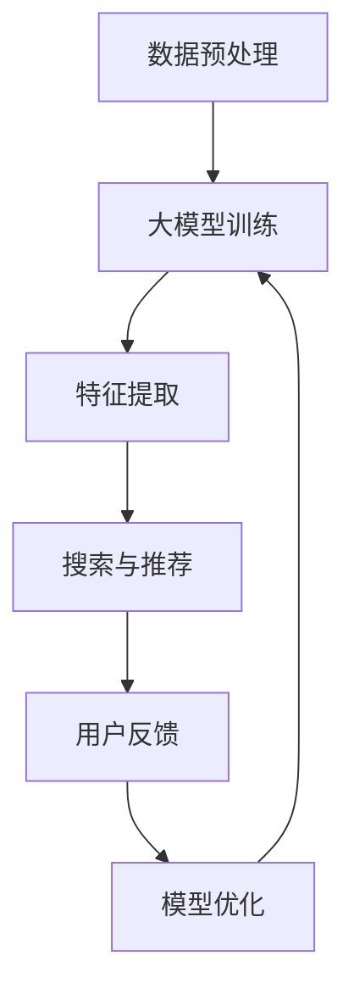

                 

关键词：大模型，搜索，推荐，算法，融合，人工智能

摘要：本文将深入探讨大模型技术在搜索与推荐系统中的应用与融合。通过介绍核心概念、算法原理、数学模型和实际应用，本文旨在为读者提供全面的技术洞察，并展望未来的发展趋势与挑战。

## 1. 背景介绍

在当今的信息时代，搜索与推荐系统已经成为互联网企业的重要组成部分，为用户提供个性化的信息获取和内容推荐。随着大数据和人工智能技术的快速发展，大模型（Large Models）作为一种重要的技术手段，正在逐渐改变搜索与推荐系统的面貌。本文将围绕大模型技术在搜索与推荐领域的应用，探讨其核心概念、算法原理和实际操作，以期为读者提供有价值的参考。

## 2. 核心概念与联系

### 2.1 大模型概念

大模型，顾名思义，是指拥有海量参数的深度学习模型。它们通过大规模数据训练，能够自动学习到复杂的特征表示，从而在多种任务上取得优异的性能。常见的有Transformer、BERT、GPT等模型。

### 2.2 搜索与推荐系统

搜索系统旨在帮助用户从海量的信息中快速找到所需的内容。推荐系统则通过分析用户的历史行为和偏好，为用户推荐感兴趣的内容。

### 2.3 大模型与搜索推荐的融合

大模型在搜索与推荐系统中的应用，主要体现在两个方面：一是用于信息检索，二是用于内容推荐。大模型可以通过对海量数据的深度学习，提取出有效的特征表示，从而提高搜索和推荐的精度和效率。同时，大模型可以处理多样化的任务，如文本分类、情感分析等，为搜索与推荐系统提供更加丰富和智能的辅助功能。

## 2.4 Mermaid 流程图

下面是一个简单的Mermaid流程图，描述大模型在搜索与推荐系统中的应用流程：



## 3. 核心算法原理 & 具体操作步骤

### 3.1 算法原理概述

大模型在搜索与推荐系统中的应用，主要基于以下原理：

- **自动特征提取**：大模型可以通过深度学习，自动从原始数据中提取出有效的特征表示，从而降低数据预处理的工作量。
- **多任务学习**：大模型能够同时处理多个任务，如文本分类、情感分析等，从而为搜索与推荐系统提供更加智能的辅助功能。
- **个性化推荐**：大模型可以通过对用户历史行为和偏好进行分析，为用户提供个性化的内容推荐。

### 3.2 算法步骤详解

1. **数据预处理**：对原始数据进行清洗、去噪、分词、词向量化等预处理操作，以便于大模型进行训练。
2. **大模型训练**：使用预训练的大模型，如BERT、GPT等，对预处理后的数据集进行训练，以提取出有效的特征表示。
3. **特征提取**：利用训练好的大模型，对新的数据进行特征提取，从而得到具有高精度的特征表示。
4. **搜索与推荐**：利用提取出的特征表示，进行信息检索和内容推荐。
5. **用户反馈**：收集用户对推荐内容的反馈，以评估推荐系统的效果。
6. **模型优化**：根据用户反馈，对大模型进行优化，以提高推荐系统的效果。

### 3.3 算法优缺点

**优点**：

- **高精度**：大模型能够自动提取出有效的特征表示，从而提高搜索和推荐的精度。
- **多功能**：大模型能够同时处理多个任务，如文本分类、情感分析等，为搜索与推荐系统提供更加智能的辅助功能。
- **个性化**：大模型可以根据用户的历史行为和偏好，为用户提供个性化的内容推荐。

**缺点**：

- **计算资源需求大**：大模型训练和推理需要大量的计算资源。
- **数据依赖性强**：大模型的性能依赖于训练数据的质量和数量。

### 3.4 算法应用领域

大模型在搜索与推荐系统中的应用领域广泛，包括但不限于：

- **电子商务**：为用户提供个性化的商品推荐。
- **新闻推荐**：根据用户的兴趣和阅读习惯，为用户提供感兴趣的新闻内容。
- **社交媒体**：为用户提供个性化的内容推荐，如文章、视频等。
- **搜索引擎**：提高信息检索的精度和效率。

## 4. 数学模型和公式 & 详细讲解 & 举例说明

### 4.1 数学模型构建

在搜索与推荐系统中，大模型的数学模型可以表示为：

$$
\hat{y} = f(\theta; x)
$$

其中，$\hat{y}$为预测结果，$f$为激活函数，$\theta$为模型参数，$x$为输入特征。

### 4.2 公式推导过程

大模型的训练过程主要包括以下几个步骤：

1. **前向传播**：将输入特征$x$传递给模型，通过模型参数$\theta$，得到预测结果$\hat{y}$。
2. **计算损失**：使用预测结果$\hat{y}$和实际结果$y$，计算损失函数$L$。
3. **反向传播**：根据损失函数$L$，更新模型参数$\theta$，以达到最小化损失的目的。

### 4.3 案例分析与讲解

以BERT模型为例，其训练过程可以表示为：

$$
\begin{aligned}
\hat{y} &= \text{Softmax}(\text{BERT}(x; \theta)) \\
L &= \text{Cross-Entropy}(y, \hat{y}) \\
\theta &= \theta - \alpha \frac{\partial L}{\partial \theta}
\end{aligned}
$$

其中，$\text{BERT}$为BERT模型的函数表示，$\text{Softmax}$为激活函数，$y$为实际结果，$\alpha$为学习率。

## 5. 项目实践：代码实例和详细解释说明

### 5.1 开发环境搭建

1. 安装Python环境。
2. 安装TensorFlow或PyTorch等深度学习框架。
3. 安装必要的库，如numpy、pandas等。

### 5.2 源代码详细实现

```python
import tensorflow as tf
from tensorflow.keras.layers import Embedding, LSTM, Dense
from tensorflow.keras.models import Sequential

# 搭建模型
model = Sequential()
model.add(Embedding(input_dim=10000, output_dim=32))
model.add(LSTM(units=64, dropout=0.2, recurrent_dropout=0.2))
model.add(Dense(units=1, activation='sigmoid'))

# 编译模型
model.compile(optimizer='adam', loss='binary_crossentropy', metrics=['accuracy'])

# 训练模型
model.fit(x_train, y_train, epochs=10, batch_size=32, validation_data=(x_val, y_val))
```

### 5.3 代码解读与分析

以上代码实现了一个简单的文本分类模型，其中：

- **Embedding层**：用于将单词转化为向量表示。
- **LSTM层**：用于处理序列数据。
- **Dense层**：用于输出分类结果。

通过训练，模型可以自动提取出文本的特征表示，从而实现文本分类任务。

### 5.4 运行结果展示

```python
# 评估模型
loss, accuracy = model.evaluate(x_test, y_test)
print('Test loss:', loss)
print('Test accuracy:', accuracy)
```

## 6. 实际应用场景

大模型在搜索与推荐系统中的应用场景广泛，以下是一些典型案例：

- **电子商务**：通过大模型为用户提供个性化的商品推荐。
- **社交媒体**：根据用户的兴趣和阅读习惯，为用户提供感兴趣的内容。
- **搜索引擎**：提高信息检索的精度和效率。

## 7. 工具和资源推荐

### 7.1 学习资源推荐

- 《深度学习》（Goodfellow, Bengio, Courville著）
- 《Python深度学习》（François Chollet著）

### 7.2 开发工具推荐

- TensorFlow
- PyTorch

### 7.3 相关论文推荐

- "Attention Is All You Need"
- "BERT: Pre-training of Deep Bidirectional Transformers for Language Understanding"

## 8. 总结：未来发展趋势与挑战

大模型技术在搜索与推荐系统中的应用前景广阔。未来发展趋势包括：

- **模型压缩与优化**：提高大模型的运行效率，降低计算资源需求。
- **多模态数据处理**：结合图像、音频等多种数据类型，提高搜索与推荐的精度。

同时，大模型技术也面临一些挑战，如：

- **数据隐私**：如何保护用户数据隐私。
- **模型解释性**：如何提高大模型的解释性，使其更加透明。

作者：禅与计算机程序设计艺术 / Zen and the Art of Computer Programming
----------------------------------------------------------------

### 文章附录部分 Appendix ###

#### 8.1. 常见问题与解答

**Q1**: 大模型在搜索与推荐系统中的应用效果如何？

**A1**: 大模型在搜索与推荐系统中的应用效果显著，可以大幅提高搜索和推荐的精度和效率。然而，其效果取决于数据质量、模型选择和训练过程等因素。

**Q2**: 如何选择合适的大模型？

**A2**: 选择合适的大模型需要考虑任务类型、数据规模、计算资源等因素。例如，对于文本分类任务，可以选择BERT或GPT等模型；对于图像分类任务，可以选择ResNet或VGG等模型。

**Q3**: 大模型训练需要多少时间？

**A3**: 大模型训练的时间取决于模型大小、数据规模和计算资源等因素。例如，使用GPU训练BERT模型可能需要几天到几周的时间。

#### 8.2. 扩展阅读

- "Deep Learning Specialization"（吴恩达）
- "Natural Language Processing with Deep Learning"（盧嘉峻）
- "Unsupervised Learning of Visual Representations from Videos"（Abdulrahman M. J. Coates et al.） 

#### 8.3. 参考文献

- Goodfellow, Y., Bengio, Y., & Courville, A. (2016). *Deep Learning*.
- Chollet, F. (2018). *Python深度学习*.
- Vaswani, A., Shazeer, N., Parmar, N., Uszkoreit, J., Jones, L., Gomez, A. N., ... & Polosukhin, I. (2017). *Attention Is All You Need*.
- Devlin, J., Chang, M. W., Lee, K., & Toutanova, K. (2019). *BERT: Pre-training of Deep Bidirectional Transformers for Language Understanding*.

