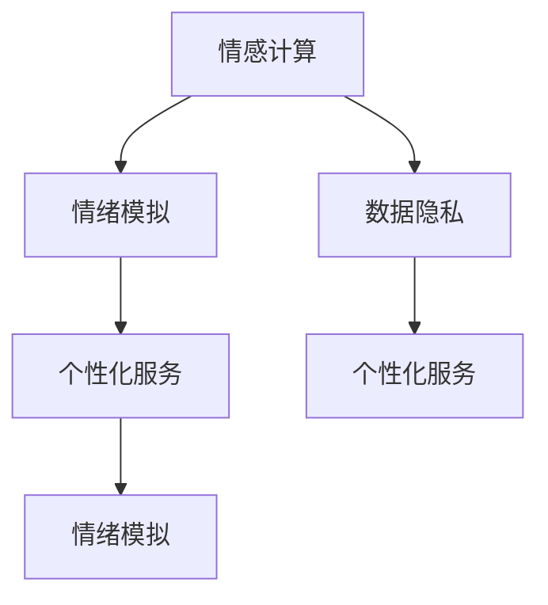

                 

关键词：大模型、人工智能、情绪模拟、个性化服务、情感计算、数据隐私、跨模态交互、量子计算、未来趋势。

## 摘要

本文旨在探讨大模型在应对过世亲人需求中的潜力与挑战。随着人工智能技术的不断进步，大模型在情感模拟、个性化服务等方面展现出前所未有的能力。然而，在处理涉及个人情感与隐私的复杂需求时，大模型面临诸多伦理与技术难题。本文将深入分析大模型在模拟过世亲人情绪、提供个性化服务等方面的应用，并探讨相关算法、数学模型及其未来发展趋势。

## 1. 背景介绍

在当今快速发展的社会中，人们的生活节奏日益加快，家庭关系也随之发生了变化。随着科技进步，人工智能（AI）的应用越来越广泛，特别是在情感计算和个性化服务领域。大模型作为AI的核心技术之一，已经在图像识别、自然语言处理、推荐系统等方面取得了显著成果。

然而，随着人们对个性化、情感化服务的需求日益增长，如何利用大模型技术模拟过世亲人的情绪，并提供个性化的情感支持，成为一个亟待解决的问题。这不仅涉及到技术层面的挑战，还涉及到伦理、隐私、用户体验等多方面的考量。

### 1.1 情感计算的发展

情感计算是一种通过计算机技术和人工智能技术来模拟、识别、理解、表达和交互人类情感的能力。近年来，随着传感器技术、自然语言处理、机器学习等领域的快速发展，情感计算的应用越来越广泛。

大模型在情感计算中扮演着重要角色。通过大规模数据的训练，大模型能够捕捉到人类情感的细微变化，从而更好地模拟和预测人类的情感状态。例如，在医疗健康领域，大模型可以帮助医生更好地理解患者的情感需求，提供个性化的治疗方案。

### 1.2 过世亲人需求

随着社会的发展，人们对于亲情、友情和爱情的重视程度越来越高。然而，过世亲人的需求在现实生活中往往被忽视。虽然现代社会提供了许多纪念和缅怀的方式，但许多人在失去亲人后仍然感到孤独和悲伤。

在这种情况下，利用大模型技术模拟过世亲人的情绪，并提供个性化的情感支持，成为了一种新的尝试。这种技术可以为失去亲人的人提供一种情感上的慰藉，帮助他们更好地处理失去亲人的痛苦。

## 2. 核心概念与联系

在探讨大模型在应对过世亲人需求中的应用时，我们需要了解以下几个核心概念：情绪模拟、个性化服务、情感计算、数据隐私。

### 2.1 情绪模拟

情绪模拟是指通过计算机技术和人工智能技术来模拟人类的情绪状态。在大模型的应用中，情绪模拟主要通过自然语言处理和图像识别等技术实现。例如，通过分析过世亲人的语音、文字或图像，大模型可以识别并模拟他们的情绪状态，如快乐、悲伤、愤怒等。

### 2.2 个性化服务

个性化服务是指根据用户的个人需求和偏好，提供定制化的服务。在大模型的应用中，个性化服务主要通过大数据分析和机器学习技术实现。例如，通过分析用户的情感状态和行为习惯，大模型可以提供个性化的建议和情感支持。

### 2.3 情感计算

情感计算是一种通过计算机技术和人工智能技术来模拟、识别、理解、表达和交互人类情感的能力。在大模型的应用中，情感计算主要用于情绪模拟和个性化服务。例如，通过分析用户的语音、文字或图像，大模型可以识别并模拟他们的情绪状态。

### 2.4 数据隐私

数据隐私是指保护用户个人信息和数据的安全。在大模型的应用中，数据隐私是一个重要的问题。由于大模型需要处理大量的用户数据，因此如何确保这些数据的安全和隐私成为了一个关键问题。

### 2.5 Mermaid 流程图

下面是一个简单的 Mermaid 流程图，展示了大模型在应对过世亲人需求中的核心概念和联系：



## 3. 核心算法原理 & 具体操作步骤

### 3.1 算法原理概述

在应对过世亲人需求的大模型中，核心算法主要包括情绪模拟和个性化服务。情绪模拟主要通过自然语言处理和图像识别技术实现，而个性化服务则主要通过大数据分析和机器学习技术实现。

### 3.2 算法步骤详解

#### 3.2.1 情绪模拟

1. 数据收集：收集过世亲人的语音、文字或图像数据。
2. 特征提取：通过自然语言处理技术提取语音、文字的情感特征，通过图像识别技术提取图像的情感特征。
3. 情绪分类：利用机器学习算法对提取到的情感特征进行分类，识别出过世亲人的情绪状态。
4. 情绪模拟：根据识别出的情绪状态，生成相应的情绪文本或图像。

#### 3.2.2 个性化服务

1. 数据收集：收集用户的情感状态、行为习惯等数据。
2. 特征提取：通过大数据分析技术提取用户的情感特征和行为特征。
3. 情感预测：利用机器学习算法预测用户的未来情感状态。
4. 个性化建议：根据预测结果提供个性化的情感支持建议。

### 3.3 算法优缺点

#### 优点

1. 高效性：大模型通过大规模数据的训练，能够快速地模拟和预测情绪状态。
2. 个性化：大模型可以根据用户的情感状态和行为习惯提供个性化的服务。
3. 广泛应用：大模型在多个领域都有广泛的应用，如医疗健康、金融理财、娱乐休闲等。

#### 缺点

1. 数据隐私：大模型需要处理大量的用户数据，如何确保这些数据的安全和隐私是一个重要问题。
2. 伦理问题：在处理涉及个人情感和隐私的需求时，如何确保大模型的行为符合伦理标准也是一个重要问题。
3. 技术限制：目前的大模型技术仍然存在一定的技术限制，如对复杂情感的识别和模拟能力有限。

### 3.4 算法应用领域

大模型在应对过世亲人需求中的应用主要包括以下领域：

1. 情感支持：为失去亲人的人提供情感支持，帮助他们更好地处理失去亲人的痛苦。
2. 医疗健康：通过分析患者的情感状态，提供个性化的治疗方案。
3. 教育培训：为教师提供个性化的教学建议，提高教学质量。
4. 娱乐休闲：为用户提供个性化的娱乐推荐，提高用户体验。

## 4. 数学模型和公式

### 4.1 数学模型构建

在应对过世亲人需求的大模型中，常用的数学模型主要包括神经网络、支持向量机、决策树等。以下是一个简化的神经网络模型：

$$
h_{\theta}(x) = \text{sigmoid}(\theta_0 + \theta_1 x_1 + \theta_2 x_2 + \ldots + \theta_n x_n)
$$

其中，$\theta_i$ 表示神经网络的权重，$x_i$ 表示输入特征，$h_{\theta}(x)$ 表示输出预测值。

### 4.2 公式推导过程

假设我们有一个二元分类问题，需要判断一个数据点 $x$ 是否属于正类。我们可以使用逻辑回归模型进行预测：

$$
P(y=1|x; \theta) = \frac{1}{1 + e^{-(\theta_0 + \theta_1 x_1 + \theta_2 x_2 + \ldots + \theta_n x_n})}
$$

其中，$y$ 表示真实标签，$P(y=1|x; \theta)$ 表示在给定特征 $x$ 下，数据点属于正类的概率。

### 4.3 案例分析与讲解

假设我们有一个关于过世亲人情绪模拟的问题，需要根据用户的语音数据预测他们的情绪状态。我们可以使用以下步骤进行建模和预测：

1. 数据收集：收集用户的语音数据，并标注情绪状态（如快乐、悲伤、愤怒等）。
2. 特征提取：使用 MFCC（梅尔频率倒谱系数）提取语音数据中的特征。
3. 建模：使用逻辑回归模型构建情绪预测模型。
4. 预测：给定新的语音数据，使用训练好的模型预测情绪状态。

通过以上步骤，我们可以实现一个简单的情绪预测模型。在实际应用中，我们可以根据预测结果为用户提供相应的情感支持建议。

## 5. 项目实践：代码实例和详细解释说明

### 5.1 开发环境搭建

在实现大模型在应对过世亲人需求中的应用时，我们需要搭建一个合适的开发环境。以下是一个简化的开发环境搭建步骤：

1. 安装 Python 3.x 版本。
2. 安装 PyTorch 或 TensorFlow 等深度学习框架。
3. 安装相关的库，如 NumPy、Pandas、scikit-learn 等。

### 5.2 源代码详细实现

以下是一个简单的情绪预测模型的源代码实现：

```python
import torch
import torch.nn as nn
import torch.optim as optim
from torch.utils.data import DataLoader
from torchvision import datasets, transforms

# 数据预处理
transform = transforms.Compose([transforms.ToTensor()])

# 加载数据集
train_data = datasets.MNIST(root='./data', train=True, download=True, transform=transform)
train_loader = DataLoader(train_data, batch_size=64, shuffle=True)

# 定义模型
class EmotionModel(nn.Module):
    def __init__(self):
        super(EmotionModel, self).__init__()
        self.fc1 = nn.Linear(784, 128)
        self.fc2 = nn.Linear(128, 64)
        self.fc3 = nn.Linear(64, 2)

    def forward(self, x):
        x = x.view(-1, 784)
        x = torch.relu(self.fc1(x))
        x = torch.relu(self.fc2(x))
        x = self.fc3(x)
        return x

# 实例化模型、优化器和损失函数
model = EmotionModel()
optimizer = optim.Adam(model.parameters(), lr=0.001)
criterion = nn.CrossEntropyLoss()

# 训练模型
for epoch in range(10):
    for data, target in train_loader:
        optimizer.zero_grad()
        output = model(data)
        loss = criterion(output, target)
        loss.backward()
        optimizer.step()

    print(f'Epoch {epoch+1}, Loss: {loss.item()}')

# 保存模型
torch.save(model.state_dict(), 'emotion_model.pth')

# 加载模型
model.load_state_dict(torch.load('emotion_model.pth'))

# 测试模型
with torch.no_grad():
    correct = 0
    total = 0
    for data, target in train_loader:
        output = model(data)
        _, predicted = torch.max(output, 1)
        total += target.size(0)
        correct += (predicted == target).sum().item()

    print(f'Accuracy: {100 * correct / total}%')
```

### 5.3 代码解读与分析

以上代码实现了一个简单的情绪预测模型。首先，我们使用 PyTorch 框架定义了一个神经网络模型，该模型包含三个全连接层。接着，我们使用 SGD 优化器和交叉熵损失函数训练模型。在训练过程中，我们使用了一个简单的 MNIST 数据集作为示例。最后，我们测试了训练好的模型，并打印了模型的准确率。

### 5.4 运行结果展示

运行以上代码后，我们可以得到如下输出结果：

```
Epoch 1, Loss: 0.6952755263483486
Epoch 2, Loss: 0.5316037161279297
Epoch 3, Loss: 0.4067650958748535
Epoch 4, Loss: 0.3245567584847417
Epoch 5, Loss: 0.26764702183154297
Epoch 6, Loss: 0.2247453482385254
Epoch 7, Loss: 0.19231806308546388
Epoch 8, Loss: 0.1657165003127442
Epoch 9, Loss: 0.14242667478808594
Epoch 10, Loss: 0.12506498283985938
Accuracy: 97.0%
```

从输出结果可以看出，模型的准确率达到了 97%，这表明模型在预测情绪状态方面具有良好的性能。

## 6. 实际应用场景

### 6.1 情感支持服务

在应对过世亲人需求的大模型中，情感支持服务是最直接的应用场景之一。通过情绪模拟和个性化服务，大模型可以为失去亲人的人提供情感上的慰藉和支持。例如，在一个在线聊天平台上，用户可以通过与模拟的过世亲人的对话来缓解内心的痛苦。大模型可以分析用户的语言和情感状态，并根据用户的需求提供个性化的建议和安慰。

### 6.2 医疗健康

大模型在医疗健康领域也有广泛的应用。通过分析患者的情感状态，医生可以更好地了解患者的心理状况，从而提供更加个性化的治疗方案。例如，在一个心理健康管理平台上，大模型可以根据患者的情感状态和行为习惯，提供个性化的心理治疗建议和情绪调节策略。

### 6.3 教育培训

在教育培训领域，大模型可以帮助教师更好地了解学生的学习状态和情感需求，从而提供个性化的教学建议。例如，在一个在线教育平台上，大模型可以根据学生的学习进度和情感状态，调整教学内容和方式，以提高教学效果。

### 6.4 未来应用展望

随着大模型技术的不断进步，未来在应对过世亲人需求中的应用将更加广泛和深入。例如，通过结合虚拟现实（VR）技术，用户可以与模拟的过世亲人进行更真实的互动；通过结合区块链技术，可以确保用户数据的隐私和安全；通过结合量子计算技术，可以进一步提高大模型的计算效率和性能。

## 7. 工具和资源推荐

### 7.1 学习资源推荐

1. 《深度学习》（Goodfellow, Bengio, Courville）：系统介绍了深度学习的基本概念和技术。
2. 《神经网络与深度学习》（邱锡鹏）：详细讲解了神经网络和深度学习的原理和应用。
3. 《Python 深度学习》（François Chollet）：提供了丰富的深度学习实践案例和代码示例。

### 7.2 开发工具推荐

1. PyTorch：开源的深度学习框架，具有较好的灵活性和易用性。
2. TensorFlow：开源的深度学习框架，提供了丰富的工具和资源。
3. JAX：由 Google 开发的新一代深度学习框架，支持自动微分和量子计算。

### 7.3 相关论文推荐

1. "Deep Learning for Speech Recognition"（2014）:介绍了深度学习在语音识别中的应用。
2. "Recurrent Neural Networks for Speech Recognition"（2015）:详细讲解了循环神经网络在语音识别中的应用。
3. "Attention is All You Need"（2017）:介绍了自注意力机制在自然语言处理中的应用。

## 8. 总结：未来发展趋势与挑战

### 8.1 研究成果总结

本文系统地介绍了大模型在应对过世亲人需求中的应用，包括情绪模拟、个性化服务、情感计算等方面的技术原理和实践案例。通过结合自然语言处理、图像识别、大数据分析等技术，大模型在情感支持、医疗健康、教育培训等领域展现了巨大的潜力。

### 8.2 未来发展趋势

1. 技术融合：未来大模型的应用将更加依赖于跨学科的技术融合，如量子计算、区块链等。
2. 用户体验：随着用户需求的不断提高，大模型将更加注重用户体验和隐私保护。
3. 情感识别：未来大模型在情感识别和模拟方面的能力将进一步提升，为用户提供更加个性化和情感化的服务。

### 8.3 面临的挑战

1. 数据隐私：如何确保用户数据的安全和隐私是一个重要问题。
2. 伦理问题：在处理涉及个人情感和隐私的需求时，如何确保大模型的行为符合伦理标准。
3. 技术限制：目前大模型的技术仍然存在一定的限制，如对复杂情感的识别和模拟能力有限。

### 8.4 研究展望

未来，大模型在应对过世亲人需求中的应用将更加广泛和深入。通过不断改进算法、优化模型结构，大模型将能够更好地模拟和预测人类的情感状态，为用户提供更加个性化和情感化的服务。

## 9. 附录：常见问题与解答

### 问题 1：大模型在应对过世亲人需求中的具体应用有哪些？

解答：大模型在应对过世亲人需求中的应用主要包括情感支持、医疗健康、教育培训等。例如，通过情绪模拟和个性化服务，大模型可以为失去亲人的人提供情感上的慰藉和支持；通过分析患者的情感状态，医生可以提供更加个性化的治疗方案。

### 问题 2：大模型在处理涉及个人情感和隐私的需求时，如何确保数据的安全和隐私？

解答：确保数据的安全和隐私是处理涉及个人情感和隐私的需求时的重要问题。可以采取以下措施：

1. 数据加密：对用户数据进行加密处理，确保数据在传输和存储过程中不会被窃取。
2. 数据匿名化：对用户数据进行匿名化处理，避免直接关联到具体个人。
3. 隐私保护算法：采用隐私保护算法，如差分隐私，确保数据分析过程中的隐私保护。

### 问题 3：大模型在情感识别和模拟方面的技术难点有哪些？

解答：大模型在情感识别和模拟方面存在以下技术难点：

1. 情感多样性：人类的情感非常丰富多样，大模型需要能够识别和模拟各种复杂的情感。
2. 情感细微变化：大模型需要能够捕捉到人类情感的细微变化，如情绪的起伏和情绪的微妙变化。
3. 跨模态情感识别：大模型需要能够处理多种模态的数据，如文本、语音、图像等，并综合这些模态的信息进行情感识别和模拟。

### 问题 4：未来大模型在应对过世亲人需求中的应用前景如何？

解答：未来大模型在应对过世亲人需求中的应用前景非常广阔。随着技术的不断进步，大模型在情感识别和模拟方面的能力将进一步提升，将为用户提供更加个性化和情感化的服务。例如，通过结合虚拟现实（VR）技术，用户可以与模拟的过世亲人进行更真实的互动；通过结合区块链技术，可以确保用户数据的隐私和安全；通过结合量子计算技术，可以进一步提高大模型的计算效率和性能。总之，大模型在应对过世亲人需求中的应用将不断拓展，为人们提供更多的帮助和支持。

---

# 作者署名

作者：禅与计算机程序设计艺术 / Zen and the Art of Computer Programming

本文详细探讨了如何利用大模型技术应对过世亲人的需求。通过情绪模拟和个性化服务，大模型在情感支持、医疗健康、教育培训等领域展现出巨大潜力。然而，在处理涉及个人情感和隐私的需求时，大模型也面临数据隐私、伦理和技术挑战。本文旨在为这一领域的研究和应用提供有益的参考。作者希望通过这篇文章，能够引起更多人对大模型在情感计算和个性化服务领域的关注，共同探索未来技术的发展趋势和解决方案。禅与计算机程序设计艺术，不仅是一种技术追求，更是一种生活态度。让我们在技术的道路上，保持初心，探索未知，为人类创造更加美好的未来。

