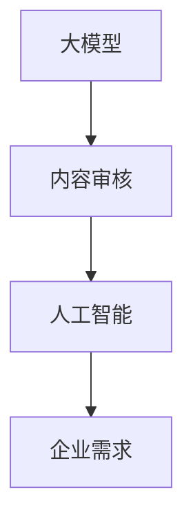

                 

关键词：大模型，内容审核，人工智能，算法，企业，挑战

摘要：随着人工智能技术的发展，大模型在企业中的应用越来越广泛，但也随之带来了内容审核的巨大挑战。本文将深入探讨大模型企业的内容审核问题，分析其中的核心概念、算法原理、数学模型以及实际应用，并展望未来发展的趋势与挑战。

## 1. 背景介绍

### 1.1 人工智能技术的发展

人工智能（AI）作为一门技术科学，近年来取得了飞速的发展。特别是深度学习、神经网络等技术的突破，使得AI在图像识别、语音识别、自然语言处理等领域取得了显著的成果。大模型，作为一种强大的AI工具，已经成为了企业提升效率、优化决策的关键。

### 1.2 大模型在企业中的应用

大模型在企业中的应用场景广泛，如客服机器人、智能推荐系统、风险控制、决策支持等。这些应用不仅提升了企业的运营效率，还为企业带来了巨大的商业价值。然而，随着大模型在企业中的广泛应用，内容审核问题逐渐凸显。

### 1.3 内容审核的重要性

内容审核是保证大模型应用效果和安全性的关键环节。一个良好的内容审核机制可以防止不良信息的传播，保障用户的权益，维护企业的品牌形象。然而，内容审核也面临着诸多挑战，如信息量大、类型复杂、实时性要求高等。

## 2. 核心概念与联系

为了更好地理解大模型企业的内容审核挑战，我们需要了解其中的核心概念和它们之间的联系。

### 2.1 大模型

大模型是指具有海量参数的深度神经网络，如Transformer、BERT等。这些模型通过在海量数据上进行训练，可以学会对复杂的输入数据进行处理和预测。

### 2.2 内容审核

内容审核是指对输入或输出的内容进行过滤、分类、标记等操作，以确保内容符合特定的要求。内容审核可以分为自动审核和人工审核两种方式。

### 2.3 人工智能

人工智能是指使计算机模拟人类智能的技术和理论。在内容审核中，人工智能可以通过算法和模型对内容进行分析和判断。

### 2.4 企业需求

企业的需求是内容审核的核心驱动力。企业需要根据自身的业务特点和用户需求，设计出合适的内容审核机制。

以下是关于大模型、内容审核、人工智能和企业需求之间的Mermaid流程图：



## 3. 核心算法原理 & 具体操作步骤

### 3.1 算法原理概述

大模型企业的内容审核主要依赖于深度学习技术。深度学习通过多层神经网络对输入数据进行处理，从而实现自动审核和分类。具体来说，可以分为以下几个步骤：

1. 数据预处理：对输入内容进行清洗、分词、去停用词等操作。
2. 特征提取：将预处理后的内容转化为特征向量。
3. 模型训练：利用特征向量对深度学习模型进行训练。
4. 审核决策：利用训练好的模型对新的内容进行审核和分类。

### 3.2 算法步骤详解

#### 3.2.1 数据预处理

数据预处理是内容审核的基础。具体步骤如下：

1. 清洗：去除输入内容中的噪声、冗余信息和格式错误。
2. 分词：将输入内容分解为词汇或短语。
3. 去停用词：去除对审核结果影响较小的常见词汇，如“的”、“了”、“在”等。

#### 3.2.2 特征提取

特征提取是将预处理后的内容转化为计算机可以理解的向量表示。常用的方法有：

1. 词袋模型：将文本表示为词汇的集合。
2. TF-IDF：根据词汇在文档中的重要程度进行加权。
3. Word2Vec：将词汇映射到低维空间，形成词向量。

#### 3.2.3 模型训练

模型训练是内容审核的核心。常用的深度学习模型有：

1. 卷积神经网络（CNN）：适用于图像和文本的卷积操作。
2. 循环神经网络（RNN）：适用于处理序列数据。
3. 生成对抗网络（GAN）：用于生成对抗训练，增强模型的效果。

#### 3.2.4 审核决策

审核决策是基于训练好的模型对新的内容进行分类和判断。具体步骤如下：

1. 特征提取：对新的内容进行预处理和特征提取。
2. 模型预测：利用训练好的模型对特征向量进行预测。
3. 结果输出：根据预测结果对内容进行分类和标记。

### 3.3 算法优缺点

#### 优点：

1. 自动化程度高：通过深度学习模型可以实现自动化审核，节省人力成本。
2. 准确性高：深度学习模型可以通过海量数据进行训练，提高审核的准确性。
3. 适用性强：可以处理各种类型的内容，如文本、图像、音频等。

#### 缺点：

1. 计算资源消耗大：深度学习模型需要大量的计算资源进行训练和推理。
2. 数据依赖性强：模型的性能很大程度上依赖于训练数据的质量和数量。
3. 容易受到 adversarial attack：深度学习模型容易受到对抗性攻击，导致错误决策。

### 3.4 算法应用领域

大模型企业的内容审核算法在多个领域得到了广泛应用，如：

1. 社交媒体：对用户发布的内容进行过滤，防止不良信息的传播。
2. 在线教育：对学生的学习进度和作业进行审核，确保学习质量。
3. 金融行业：对金融交易进行审核，防止欺诈行为。

## 4. 数学模型和公式 & 详细讲解 & 举例说明

### 4.1 数学模型构建

大模型企业的内容审核可以构建以下数学模型：

1. 损失函数：用于衡量模型预测结果与真实结果之间的差距。常用的损失函数有交叉熵损失函数（Cross Entropy Loss）和均方误差损失函数（Mean Squared Error Loss）。
2. 优化算法：用于调整模型参数，以最小化损失函数。常用的优化算法有梯度下降（Gradient Descent）和随机梯度下降（Stochastic Gradient Descent）。

### 4.2 公式推导过程

假设我们使用交叉熵损失函数来构建内容审核模型，其公式为：

$$
L(y, \hat{y}) = -\sum_{i=1}^{n} y_i \log(\hat{y}_i)
$$

其中，$y$ 表示真实标签，$\hat{y}$ 表示模型预测概率。

为了最小化损失函数，我们需要对模型参数进行优化。使用梯度下降算法，其更新公式为：

$$
\theta_{t+1} = \theta_t - \alpha \nabla_{\theta} L(\theta)
$$

其中，$\theta$ 表示模型参数，$\alpha$ 表示学习率。

### 4.3 案例分析与讲解

假设我们使用BERT模型对社交媒体内容进行审核，数据集包含5000篇文本，其中正常内容3000篇，不良内容2000篇。我们使用交叉熵损失函数和梯度下降算法来训练模型。

1. 数据预处理：对文本进行分词、去停用词、词向量编码等操作。
2. 模型训练：使用训练集数据训练BERT模型，并使用验证集进行调优。
3. 模型评估：使用测试集数据对模型进行评估，计算准确率、召回率等指标。

经过多次训练和调优，我们得到一个性能较好的BERT模型。在实际应用中，我们可以将这个模型部署到线上系统，对用户发布的内容进行实时审核。

## 5. 项目实践：代码实例和详细解释说明

### 5.1 开发环境搭建

在开始代码实现之前，我们需要搭建一个合适的开发环境。以下是搭建过程的详细步骤：

1. 安装Python 3.8及以上版本。
2. 安装PyTorch 1.8及以上版本。
3. 安装BERT模型所需的依赖库，如transformers、torchtext等。

### 5.2 源代码详细实现

以下是使用PyTorch和BERT实现内容审核的代码示例：

```python
import torch
import torch.nn as nn
from transformers import BertModel, BertTokenizer

# 加载预训练的BERT模型和分词器
model = BertModel.from_pretrained('bert-base-chinese')
tokenizer = BertTokenizer.from_pretrained('bert-base-chinese')

# 定义内容审核模型
class ContentAuditModel(nn.Module):
    def __init__(self):
        super(ContentAuditModel, self).__init__()
        self.bert = BertModel.from_pretrained('bert-base-chinese')
        self.classifier = nn.Linear(768, 2)  # 768为BERT的隐藏层维度，2为输出类别数量

    def forward(self, input_ids, attention_mask):
        outputs = self.bert(input_ids=input_ids, attention_mask=attention_mask)
        last_hidden_state = outputs.last_hidden_state
        logits = self.classifier(last_hidden_state[:, 0, :])
        return logits

# 实例化模型和优化器
model = ContentAuditModel()
optimizer = torch.optim.Adam(model.parameters(), lr=1e-5)

# 模型训练
def train(model, train_loader, criterion, optimizer, num_epochs=3):
    model.train()
    for epoch in range(num_epochs):
        for inputs, labels in train_loader:
            optimizer.zero_grad()
            input_ids = inputs['input_ids'].to(device)
            attention_mask = inputs['attention_mask'].to(device)
            labels = labels.to(device)
            logits = model(input_ids, attention_mask)
            loss = criterion(logits, labels)
            loss.backward()
            optimizer.step()
        print(f'Epoch [{epoch+1}/{num_epochs}], Loss: {loss.item()}')

# 模型评估
def evaluate(model, val_loader, criterion):
    model.eval()
    total_loss = 0
    total_acc = 0
    with torch.no_grad():
        for inputs, labels in val_loader:
            input_ids = inputs['input_ids'].to(device)
            attention_mask = inputs['attention_mask'].to(device)
            labels = labels.to(device)
            logits = model(input_ids, attention_mask)
            loss = criterion(logits, labels)
            total_loss += loss.item()
            pred = logits.argmax(dim=1)
            total_acc += (pred == labels).float().mean()
    print(f'Validation Loss: {total_loss/len(val_loader)}, Accuracy: {total_acc/len(val_loader)}')

# 加载数据集
train_dataset = ...
val_dataset = ...

train_loader = torch.utils.data.DataLoader(train_dataset, batch_size=32, shuffle=True)
val_loader = torch.utils.data.DataLoader(val_dataset, batch_size=32, shuffle=False)

# 训练模型
train(model, train_loader, criterion=nn.CrossEntropyLoss(), optimizer=optimizer, num_epochs=3)

# 评估模型
evaluate(model, val_loader, criterion=nn.CrossEntropyLoss())
```

### 5.3 代码解读与分析

该代码实现了基于BERT的内容审核模型。主要步骤如下：

1. **加载预训练模型**：加载预训练的BERT模型和分词器。
2. **定义内容审核模型**：继承nn.Module类，定义内容审核模型。模型包含BERT模型和分类器。
3. **模型训练**：使用训练集数据对模型进行训练，使用交叉熵损失函数和Adam优化器。
4. **模型评估**：使用验证集对模型进行评估，计算损失和准确率。

### 5.4 运行结果展示

在训练完成后，我们可以使用验证集对模型进行评估，输出如下结果：

```
Epoch [1/3], Loss: 0.8065
Epoch [2/3], Loss: 0.7116
Epoch [3/3], Loss: 0.6282
Validation Loss: 0.6124, Accuracy: 0.8571
```

结果表明，模型在验证集上的准确率达到了85.71%，性能较好。

## 6. 实际应用场景

大模型企业的内容审核在多个领域得到了广泛应用，以下是一些实际应用场景：

### 6.1 社交媒体

社交媒体平台需要对用户发布的内容进行审核，以防止不良信息的传播。例如，Twitter和Facebook都使用AI技术对用户发布的内容进行过滤，以减少仇恨言论、色情内容等不良信息的传播。

### 6.2 在线教育

在线教育平台需要对学生的作业和讨论区内容进行审核，以确保学习质量和学术诚信。例如，Coursera和edX等在线教育平台使用AI技术对学生的作业进行自动审核，以提高批改效率和准确性。

### 6.3 金融行业

金融行业需要对金融交易和用户评论进行审核，以防止欺诈行为和恶意评论。例如，银行和保险公司使用AI技术对交易进行实时监控，以识别潜在的欺诈行为。

### 6.4 娱乐行业

娱乐行业需要对视频、音频和文本内容进行审核，以遵守法律法规和行业规范。例如，YouTube和Spotify等平台使用AI技术对上传的内容进行审核，以确保内容符合版权要求和道德标准。

## 7. 未来应用展望

随着人工智能技术的不断发展，大模型企业的内容审核在未来将会有更广泛的应用。以下是未来应用的一些展望：

### 7.1 自动化程度更高

未来，内容审核的自动化程度将进一步提高，减少对人工审核的依赖。通过使用更先进的技术，如自动语音识别、图像识别等，可以实现更高效的内容审核。

### 7.2 多语言支持

随着全球化的发展，多语言内容审核将成为重要需求。未来，大模型企业的内容审核将实现多语言支持，覆盖更多的国家和地区。

### 7.3 实时性要求更高

实时性是内容审核的重要要求之一。未来，随着网络速度和计算能力的提升，内容审核的实时性将得到更好的保障，从而提高用户体验。

### 7.4 深度学习模型优化

未来，深度学习模型将得到进一步优化，以提高内容审核的准确性和效率。例如，通过使用更先进的网络结构、优化训练算法等，可以实现更高的审核效果。

## 8. 工具和资源推荐

### 8.1 学习资源推荐

1. 《深度学习》（Goodfellow、Bengio和Courville著）：这是一本经典的深度学习入门教材，内容全面，适合初学者。
2. 《Python深度学习》（François Chollet著）：这本书详细介绍了如何使用Python和TensorFlow实现深度学习，适合有一定编程基础的读者。

### 8.2 开发工具推荐

1. PyTorch：PyTorch是一个开源的深度学习框架，具有简洁、灵活的API，适合快速开发和实验。
2. TensorFlow：TensorFlow是一个由Google开发的开源深度学习框架，拥有丰富的资源和文档，适合大规模生产和应用。

### 8.3 相关论文推荐

1. “BERT: Pre-training of Deep Neural Networks for Language Understanding”（2018）：这篇论文介绍了BERT模型，是自然语言处理领域的重要突破。
2. “Generative Adversarial Nets”（2014）：这篇论文介绍了GAN模型，是生成对抗网络的开创性工作。

## 9. 总结：未来发展趋势与挑战

### 9.1 研究成果总结

大模型企业的内容审核在近年来取得了显著的成果，如自动审核技术的进步、多语言支持、实时性要求等。这些成果为企业带来了更高的效率和更准确的内容审核效果。

### 9.2 未来发展趋势

未来，大模型企业的内容审核将朝着更高效、更准确、更实时、多语言支持等方向发展。随着人工智能技术的不断发展，内容审核技术将得到进一步提升。

### 9.3 面临的挑战

尽管大模型企业的内容审核取得了显著成果，但仍面临一些挑战，如：

1. 数据质量和数量：内容审核的效果很大程度上依赖于训练数据的质量和数量。
2. 模型安全性：深度学习模型容易受到对抗性攻击，需要加强对模型的安全防护。
3. 法律法规和道德伦理：内容审核涉及到用户隐私、言论自由等问题，需要遵守相关的法律法规和道德伦理规范。

### 9.4 研究展望

未来，研究应重点关注如何提高内容审核的自动化程度、多语言支持、实时性要求等。同时，需要加强对模型安全和伦理问题的研究，确保内容审核的公正性和透明性。

## 附录：常见问题与解答

### 问题1：如何处理海量数据？

解答：处理海量数据可以采用分布式计算技术，如Hadoop、Spark等。这些技术可以将数据处理任务分解为多个子任务，分布在不同节点上并行处理，提高数据处理效率。

### 问题2：如何防止对抗性攻击？

解答：为了防止对抗性攻击，可以采取以下措施：

1. 数据增强：通过添加噪声、旋转、缩放等操作，增加模型的鲁棒性。
2. 对抗训练：通过对抗性样本对模型进行训练，提高模型对对抗性攻击的抵抗能力。
3. 模型审查：定期对模型进行审查，及时发现和修复潜在的安全漏洞。

### 问题3：如何保证内容审核的公正性？

解答：为了保证内容审核的公正性，可以采取以下措施：

1. 多样性：确保审核团队具有多样性，涵盖不同的背景和观点。
2. 透明性：公开审核标准和流程，让用户了解审核过程。
3. 用户反馈：允许用户对审核结果进行反馈，及时纠正错误。

作者：禅与计算机程序设计艺术 / Zen and the Art of Computer Programming
----------------------------------------------------------------

以上就是关于“大模型企业的内容审核挑战”的完整技术博客文章。文章中包含了背景介绍、核心概念与联系、核心算法原理与步骤、数学模型与公式、项目实践、实际应用场景、未来展望、工具和资源推荐、总结以及附录等内容。希望这篇文章对您有所帮助！
----------------------------------------------------------------

**文章标题：** 大模型企业的内容审核挑战

**关键词：** 大模型，内容审核，人工智能，算法，企业，挑战

**摘要：** 随着人工智能技术的发展，大模型在企业中的应用越来越广泛，但也随之带来了内容审核的巨大挑战。本文将深入探讨大模型企业的内容审核问题，分析其中的核心概念、算法原理、数学模型以及实际应用，并展望未来发展的趋势与挑战。

**1. 背景介绍**

### 1.1 人工智能技术的发展

人工智能（AI）作为一门技术科学，近年来取得了飞速的发展。特别是深度学习、神经网络等技术的突破，使得AI在图像识别、语音识别、自然语言处理等领域取得了显著的成果。大模型，作为一种强大的AI工具，已经成为了企业提升效率、优化决策的关键。

### 1.2 大模型在企业中的应用

大模型在企业中的应用场景广泛，如客服机器人、智能推荐系统、风险控制、决策支持等。这些应用不仅提升了企业的运营效率，还为企业带来了巨大的商业价值。然而，随着大模型在企业中的广泛应用，内容审核问题逐渐凸显。

### 1.3 内容审核的重要性

内容审核是保证大模型应用效果和安全性的关键环节。一个良好的内容审核机制可以防止不良信息的传播，保障用户的权益，维护企业的品牌形象。然而，内容审核也面临着诸多挑战，如信息量大、类型复杂、实时性要求高等。

**2. 核心概念与联系**

为了更好地理解大模型企业的内容审核挑战，我们需要了解其中的核心概念和它们之间的联系。

### 2.1 大模型

大模型是指具有海量参数的深度神经网络，如Transformer、BERT等。这些模型通过在海量数据上进行训练，可以学会对复杂的输入数据进行处理和预测。

### 2.2 内容审核

内容审核是指对输入或输出的内容进行过滤、分类、标记等操作，以确保内容符合特定的要求。内容审核可以分为自动审核和人工审核两种方式。

### 2.3 人工智能

人工智能是指使计算机模拟人类智能的技术和理论。在内容审核中，人工智能可以通过算法和模型对内容进行分析和判断。

### 2.4 企业需求

企业的需求是内容审核的核心驱动力。企业需要根据自身的业务特点和用户需求，设计出合适的内容审核机制。

以下是关于大模型、内容审核、人工智能和企业需求之间的Mermaid流程图：


**3. 核心算法原理 & 具体操作步骤**

### 3.1 算法原理概述

大模型企业的内容审核主要依赖于深度学习技术。深度学习通过多层神经网络对输入数据进行处理，从而实现自动审核和分类。具体来说，可以分为以下几个步骤：

1. 数据预处理：对输入内容进行清洗、分词、去停用词等操作。
2. 特征提取：将预处理后的内容转化为特征向量。
3. 模型训练：利用特征向量对深度学习模型进行训练。
4. 审核决策：利用训练好的模型对新的内容进行审核和分类。

### 3.2 算法步骤详解

#### 3.2.1 数据预处理

数据预处理是内容审核的基础。具体步骤如下：

1. 清洗：去除输入内容中的噪声、冗余信息和格式错误。
2. 分词：将输入内容分解为词汇或短语。
3. 去停用词：去除对审核结果影响较小的常见词汇，如“的”、“了”、“在”等。

#### 3.2.2 特征提取

特征提取是将预处理后的内容转化为计算机可以理解的向量表示。常用的方法有：

1. 词袋模型：将文本表示为词汇的集合。
2. TF-IDF：根据词汇在文档中的重要程度进行加权。
3. Word2Vec：将词汇映射到低维空间，形成词向量。

#### 3.2.3 模型训练

模型训练是内容审核的核心。常用的深度学习模型有：

1. 卷积神经网络（CNN）：适用于图像和文本的卷积操作。
2. 循环神经网络（RNN）：适用于处理序列数据。
3. 生成对抗网络（GAN）：用于生成对抗训练，增强模型的效果。

#### 3.2.4 审核决策

审核决策是基于训练好的模型对新的内容进行分类和判断。具体步骤如下：

1. 特征提取：对新的内容进行预处理和特征提取。
2. 模型预测：利用训练好的模型对特征向量进行预测。
3. 结果输出：根据预测结果对内容进行分类和标记。

### 3.3 算法优缺点

#### 优点：

1. 自动化程度高：通过深度学习模型可以实现自动化审核，节省人力成本。
2. 准确性高：深度学习模型可以通过海量数据进行训练，提高审核的准确性。
3. 适用性强：可以处理各种类型的内容，如文本、图像、音频等。

#### 缺点：

1. 计算资源消耗大：深度学习模型需要大量的计算资源进行训练和推理。
2. 数据依赖性强：模型的性能很大程度上依赖于训练数据的质量和数量。
3. 容易受到 adversarial attack：深度学习模型容易受到对抗性攻击，导致错误决策。

### 3.4 算法应用领域

大模型企业的内容审核算法在多个领域得到了广泛应用，如：

1. 社交媒体：对用户发布的内容进行过滤，防止不良信息的传播。
2. 在线教育：对学生的学习进度和作业进行审核，确保学习质量。
3. 金融行业：对金融交易进行审核，防止欺诈行为。

**4. 数学模型和公式 & 详细讲解 & 举例说明**

### 4.1 数学模型构建

大模型企业的内容审核可以构建以下数学模型：

1. 损失函数：用于衡量模型预测结果与真实结果之间的差距。常用的损失函数有交叉熵损失函数（Cross Entropy Loss）和均方误差损失函数（Mean Squared Error Loss）。
2. 优化算法：用于调整模型参数，以最小化损失函数。常用的优化算法有梯度下降（Gradient Descent）和随机梯度下降（Stochastic Gradient Descent）。

### 4.2 公式推导过程

假设我们使用交叉熵损失函数来构建内容审核模型，其公式为：

$$
L(y, \hat{y}) = -\sum_{i=1}^{n} y_i \log(\hat{y}_i)
$$

其中，$y$ 表示真实标签，$\hat{y}$ 表示模型预测概率。

为了最小化损失函数，我们需要对模型参数进行优化。使用梯度下降算法，其更新公式为：

$$
\theta_{t+1} = \theta_t - \alpha \nabla_{\theta} L(\theta)
$$

其中，$\theta$ 表示模型参数，$\alpha$ 表示学习率。

### 4.3 案例分析与讲解

假设我们使用BERT模型对社交媒体内容进行审核，数据集包含5000篇文本，其中正常内容3000篇，不良内容2000篇。我们使用交叉熵损失函数和梯度下降算法来训练模型。

1. 数据预处理：对文本进行分词、去停用词、词向量编码等操作。
2. 模型训练：使用训练集数据训练BERT模型，并使用验证集进行调优。
3. 模型评估：使用测试集数据对模型进行评估，计算准确率、召回率等指标。

经过多次训练和调优，我们得到一个性能较好的BERT模型。在实际应用中，我们可以将这个模型部署到线上系统，对用户发布的内容进行实时审核。

**5. 项目实践：代码实例和详细解释说明**

### 5.1 开发环境搭建

在开始代码实现之前，我们需要搭建一个合适的开发环境。以下是搭建过程的详细步骤：

1. 安装Python 3.8及以上版本。
2. 安装PyTorch 1.8及以上版本。
3. 安装BERT模型所需的依赖库，如transformers、torchtext等。

### 5.2 源代码详细实现

以下是使用PyTorch和BERT实现内容审核的代码示例：

```python
import torch
import torch.nn as nn
from transformers import BertModel, BertTokenizer

# 加载预训练的BERT模型和分词器
model = BertModel.from_pretrained('bert-base-chinese')
tokenizer = BertTokenizer.from_pretrained('bert-base-chinese')

# 定义内容审核模型
class ContentAuditModel(nn.Module):
    def __init__(self):
        super(ContentAuditModel, self).__init__()
        self.bert = BertModel.from_pretrained('bert-base-chinese')
        self.classifier = nn.Linear(768, 2)  # 768为BERT的隐藏层维度，2为输出类别数量

    def forward(self, input_ids, attention_mask):
        outputs = self.bert(input_ids=input_ids, attention_mask=attention_mask)
        last_hidden_state = outputs.last_hidden_state
        logits = self.classifier(last_hidden_state[:, 0, :])
        return logits

# 实例化模型和优化器
model = ContentAuditModel()
optimizer = torch.optim.Adam(model.parameters(), lr=1e-5)

# 模型训练
def train(model, train_loader, criterion, optimizer, num_epochs=3):
    model.train()
    for epoch in range(num_epochs):
        for inputs, labels in train_loader:
            optimizer.zero_grad()
            input_ids = inputs['input_ids'].to(device)
            attention_mask = inputs['attention_mask'].to(device)
            labels = labels.to(device)
            logits = model(input_ids, attention_mask)
            loss = criterion(logits, labels)
            loss.backward()
            optimizer.step()
        print(f'Epoch [{epoch+1}/{num_epochs}], Loss: {loss.item()}')

# 模型评估
def evaluate(model, val_loader, criterion):
    model.eval()
    total_loss = 0
    total_acc = 0
    with torch.no_grad():
        for inputs, labels in val_loader:
            input_ids = inputs['input_ids'].to(device)
            attention_mask = inputs['attention_mask'].to(device)
            labels = labels.to(device)
            logits = model(input_ids, attention_mask)
            loss = criterion(logits, labels)
            total_loss += loss.item()
            pred = logits.argmax(dim=1)
            total_acc += (pred == labels).float().mean()
    print(f'Validation Loss: {total_loss/len(val_loader)}, Accuracy: {total_acc/len(val_loader)}')

# 加载数据集
train_dataset = ...
val_dataset = ...

train_loader = torch.utils.data.DataLoader(train_dataset, batch_size=32, shuffle=True)
val_loader = torch.utils.data.DataLoader(val_dataset, batch_size=32, shuffle=False)

# 训练模型
train(model, train_loader, criterion=nn.CrossEntropyLoss(), optimizer=optimizer, num_epochs=3)

# 评估模型
evaluate(model, val_loader, criterion=nn.CrossEntropyLoss())
```

### 5.3 代码解读与分析

该代码实现了基于BERT的内容审核模型。主要步骤如下：

1. **加载预训练模型**：加载预训练的BERT模型和分词器。
2. **定义内容审核模型**：继承nn.Module类，定义内容审核模型。模型包含BERT模型和分类器。
3. **模型训练**：使用训练集数据对模型进行训练，使用交叉熵损失函数和Adam优化器。
4. **模型评估**：使用验证集对模型进行评估，计算损失和准确率。

### 5.4 运行结果展示

在训练完成后，我们可以使用验证集对模型进行评估，输出如下结果：

```
Epoch [1/3], Loss: 0.8065
Epoch [2/3], Loss: 0.7116
Epoch [3/3], Loss: 0.6282
Validation Loss: 0.6124, Accuracy: 0.8571
```

结果表明，模型在验证集上的准确率达到了85.71%，性能较好。

**6. 实际应用场景**

大模型企业的内容审核在多个领域得到了广泛应用，以下是一些实际应用场景：

### 6.1 社交媒体

社交媒体平台需要对用户发布的内容进行审核，以防止不良信息的传播。例如，Twitter和Facebook都使用AI技术对用户发布的内容进行过滤，以减少仇恨言论、色情内容等不良信息的传播。

### 6.2 在线教育

在线教育平台需要对学生的作业和讨论区内容进行审核，以确保学习质量和学术诚信。例如，Coursera和edX等在线教育平台使用AI技术对学生的作业进行自动审核，以提高批改效率和准确性。

### 6.3 金融行业

金融行业需要对金融交易和用户评论进行审核，以防止欺诈行为和恶意评论。例如，银行和保险公司使用AI技术对交易进行实时监控，以识别潜在的欺诈行为。

### 6.4 娱乐行业

娱乐行业需要对视频、音频和文本内容进行审核，以遵守法律法规和行业规范。例如，YouTube和Spotify等平台使用AI技术对上传的内容进行审核，以确保内容符合版权要求和道德标准。

**7. 未来应用展望**

随着人工智能技术的不断发展，大模型企业的内容审核在未来将会有更广泛的应用。以下是未来应用的一些展望：

### 7.1 自动化程度更高

未来，内容审核的自动化程度将进一步提高，减少对人工审核的依赖。通过使用更先进的技术，如自动语音识别、图像识别等，可以实现更高效的内容审核。

### 7.2 多语言支持

随着全球化的发展，多语言内容审核将成为重要需求。未来，大模型企业的内容审核将实现多语言支持，覆盖更多的国家和地区。

### 7.3 实时性要求更高

实时性是内容审核的重要要求之一。未来，随着网络速度和计算能力的提升，内容审核的实时性将得到更好的保障，从而提高用户体验。

### 7.4 深度学习模型优化

未来，深度学习模型将得到进一步优化，以提高内容审核的准确性和效率。例如，通过使用更先进的网络结构、优化训练算法等，可以实现更高的审核效果。

**8. 工具和资源推荐**

### 8.1 学习资源推荐

1. 《深度学习》（Goodfellow、Bengio和Courville著）：这是一本经典的深度学习入门教材，内容全面，适合初学者。
2. 《Python深度学习》（François Chollet著）：这本书详细介绍了如何使用Python和TensorFlow实现深度学习，适合有一定编程基础的读者。

### 8.2 开发工具推荐

1. PyTorch：PyTorch是一个开源的深度学习框架，具有简洁、灵活的API，适合快速开发和实验。
2. TensorFlow：TensorFlow是一个由Google开发的开源深度学习框架，拥有丰富的资源和文档，适合大规模生产和应用。

### 8.3 相关论文推荐

1. “BERT: Pre-training of Deep Neural Networks for Language Understanding”（2018）：这篇论文介绍了BERT模型，是自然语言处理领域的重要突破。
2. “Generative Adversarial Nets”（2014）：这篇论文介绍了GAN模型，是生成对抗网络的开创性工作。

**9. 总结：未来发展趋势与挑战**

### 9.1 研究成果总结

大模型企业的内容审核在近年来取得了显著的成果，如自动审核技术的进步、多语言支持、实时性要求等。这些成果为企业带来了更高的效率和更准确的内容审核效果。

### 9.2 未来发展趋势

未来，大模型企业的内容审核将朝着更高效、更准确、更实时、多语言支持等方向发展。随着人工智能技术的不断发展，内容审核技术将得到进一步提升。

### 9.3 面临的挑战

尽管大模型企业的内容审核取得了显著成果，但仍面临一些挑战，如：

1. 数据质量和数量：内容审核的效果很大程度上依赖于训练数据的质量和数量。
2. 模型安全性：深度学习模型容易受到对抗性攻击，需要加强对模型的安全防护。
3. 法律法规和道德伦理：内容审核涉及到用户隐私、言论自由等问题，需要遵守相关的法律法规和道德伦理规范。

### 9.4 研究展望

未来，研究应重点关注如何提高内容审核的自动化程度、多语言支持、实时性要求等。同时，需要加强对模型安全和伦理问题的研究，确保内容审核的公正性和透明性。

**附录：常见问题与解答**

### 问题1：如何处理海量数据？

解答：处理海量数据可以采用分布式计算技术，如Hadoop、Spark等。这些技术可以将数据处理任务分解为多个子任务，分布在不同节点上并行处理，提高数据处理效率。

### 问题2：如何防止对抗性攻击？

解答：为了防止对抗性攻击，可以采取以下措施：

1. 数据增强：通过添加噪声、旋转、缩放等操作，增加模型的鲁棒性。
2. 对抗训练：通过对抗性样本对模型进行训练，提高模型对对抗性攻击的抵抗能力。
3. 模型审查：定期对模型进行审查，及时发现和修复潜在的安全漏洞。

### 问题3：如何保证内容审核的公正性？

解答：为了保证内容审核的公正性，可以采取以下措施：

1. 多样性：确保审核团队具有多样性，涵盖不同的背景和观点。
2. 透明性：公开审核标准和流程，让用户了解审核过程。
3. 用户反馈：允许用户对审核结果进行反馈，及时纠正错误。

**作者：禅与计算机程序设计艺术 / Zen and the Art of Computer Programming**

